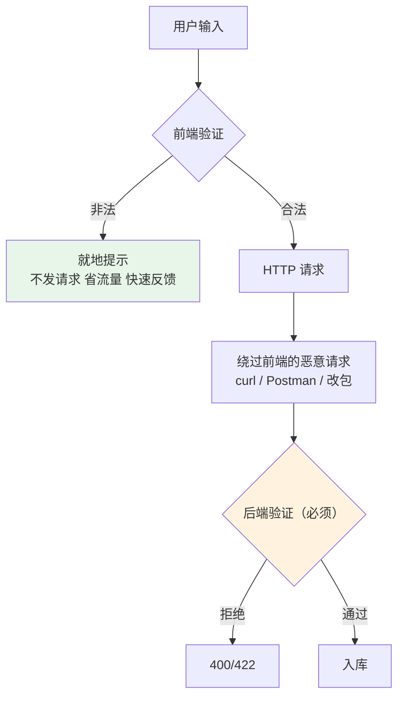
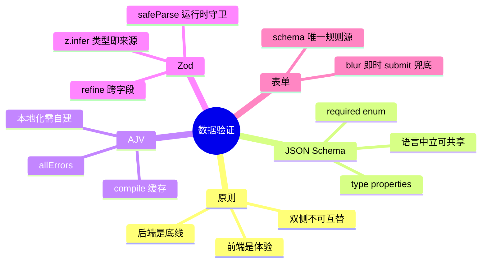

# 02 - JSON Schema 验证

> 前置：[[前端开发/04-DOM与交互/JSON/01-JSON基础|JSON 基础]]、[[前端开发/01-基础/JavaScript/05-异步编程|异步编程]]。接口返回的数据真的符合约定吗？用户提交的表单合法吗？本章讲前端侧数据验证的完整方案：从手写函数到 AJV 到 Zod。

---

## 1. 为什么前端也要验证

先立观点：**后端验证是底线，前端验证是体验，两者不可互替**。



- 只有前端验证：攻击者用 curl 直打接口，脏数据入库。
- 只有后端验证：用户填完 20 个字段点提交，等两秒才被告知第一格邮箱少个 @，体验崩坏。
- 双侧验证：前端挡住九成误操作，后端兜住全部安全边界。

## 2. 手写验证函数的局限

小表单手写没问题，但规模一上来就会失控：

```javascript
function validateUser(form) {
  const errors = {};

  if (!form.username) {
    errors.username = "用户名必填";
  } else if (form.username.length < 3 || form.username.length > 20) {
    errors.username = "用户名长度须在 3~20 之间";
  }

  if (!/^1[3-9]\d{9}$/.test(form.phone)) {
    errors.phone = "手机号格式不正确";
  }

  if (form.password.length < 8) {
    errors.password = "密码至少 8 位";
  } else if (!/[A-Z]/.test(form.password)) {
    errors.password = "密码须包含大写字母";
  } else if (form.password !== form.confirmPassword) {
    errors.confirmPassword = "两次密码不一致";
  }

  return Object.keys(errors).length ? errors : null;
}
```

这段代码的问题不在"错"，而在"不可生长"：

1. **规则与代码耦合**：改一条长度限制要翻业务代码。
2. **无法复用与共享**：同一规则后端 Java 还要再写一遍，且两边极易不一致。
3. **无类型推导**：TS 里 form 的形状全靠人肉对齐。
4. **组合困难**：条件必填（选了"其他"才必须填说明）会让 if 嵌套爆炸。

标准解是把"数据的形状和规则"声明成数据本身——这就是 Schema 思想。

## 3. JSON Schema 四要素速成

JSON Schema 是描述 JSON 结构的标准词汇，四要素覆盖日常八成场景：

```javascript
const userSchema = {
  type: "object",                 // 要素一：type 根类型
  properties: {                   // 要素二：properties 各字段规则
    username: { type: "string", minLength: 3, maxLength: 20 },
    email:    { type: "string", format: "email" },
    age:      { type: "integer", minimum: 0, maximum: 150 },
    role:     { type: "string", enum: ["admin", "editor", "viewer"] }, // 要素四：enum 枚举
    bio:      { type: "string", maxLength: 200 }, // 非必需字段不写进 required
  },
  required: ["username", "email"], // 要素三：required 必填清单
};
```

常用关键字补充：`pattern`（正则）、`minimum/maximum`、`items`（数组元素 schema）、`additionalProperties: false`（禁止多余字段）。

它最大的价值是**语言中立**：这份 schema 可以同时给前端校验、Java 后端校验、API 文档生成使用。

## 4. AJV：JSON Schema 的标准实现

### 4.1 基本用法

AJV（Another JSON Validator）把 schema **编译成 JS 函数**并缓存，重复校验近乎零开销：

```bash
npm install ajv ajv-formats
```

```javascript
import Ajv from "ajv";
import addFormats from "ajv-formats";

const ajv = new Ajv({ allErrors: true }); // allErrors 收集全部错误而非首个即停
addFormats(ajv); // 支持 format: email/date-time 等

const validateUser = ajv.compile(userSchema); // 编译一次

const ok = validateUser({ username: "ab", age: -1 });
if (!ok) {
  console.log(validateUser.errors);
  // [
  //   { instancePath: "/username", message: "must NOT have fewer than 3 characters" },
  //   { instancePath: "/age", message: "must be >= 0" }
  // ]
}
```

### 4.2 错误信息本地化

默认错误是英文长句，中文项目要做映射：

```javascript
const zhDict = {
  required: () => "此项为必填",
  minLength: (e) => `长度不能少于 ${e.params.limit} 个字符`,
  maxLength: (e) => `长度不能超过 ${e.params.limit} 个字符`,
  pattern: () => "格式不正确",
  format: (e) => e.params.format === "email" ? "邮箱格式不正确" : "格式不正确",
  enum: () => "取值不在允许范围内",
};

function localizeErrors(errors, schema) {
  return errors.map((e) => {
    // required 错误挂在对象路径上，缺的字段在 params.missingProperty
    const field = e.keyword === "required"
      ? e.params.missingProperty
      : e.instancePath.replaceAll("/", "").replace(/~1/g, "/");
    const tpl = zhDict[e.keyword];
    const msg = tpl ? tpl(e) : e.message;
    return { field, msg };
  });
}

const valid = ajv.validate(userSchema, input);
if (!valid) {
  renderFieldErrors(localizeErrors(ajv.errors, userSchema));
  // [{ field: "username", msg: "长度不能少于 3 个字符" }]
}
```

复杂度提示：本地化是 AJV 的痛点所在，如果团队重度依赖中文报错与 TS 类型合一，直接看第 5 节 Zod。

## 5. Zod：TS 优先的方案

Zod 用链式调用定义 schema，**schema 即类型来源**——一份代码同时产出运行时校验和编译期类型：

```bash
npm install zod
```

```typescript
import { z } from "zod";

// 定义 schema 的同时得到类型
export const userSchema = z.object({
  username: z.string().min(3, "用户名至少 3 个字符").max(20),
  email: z.string().email("邮箱格式不正确"),
  age: z.number().int().min(0).max(150).optional(),
  role: z.enum(["admin", "editor", "viewer"]),
  bio: z.string().max(200).optional(),
});

// 类型从 schema 推导，永远与规则同步 —— 这是 z.infer 的杀手锏
export type User = z.infer<typeof userSchema>;
// 等价于手写：
// interface User { username: string; email: string; age?: number; role: "admin"|"editor"|"viewer"; bio?: string }

/* ---------- 校验 ---------- */
const result = userSchema.safeParse(await getSomeJson());

if (result.success) {
  result.data.username; // 类型收窄为 User，放心使用
} else {
  const issues = result.error.issues;
  issues[0].path;   // ["username"] 字段路径
  issues[0].message; // 中文消息直接写在 schema 里
}
```

### 5.1 AJV vs Zod 选型表

| 维度 | AJV | Zod |
|------|-----|-----|
| Schema 形态 | 标准 JSON Schema 对象 | TS 链式 DSL |
| 类型推导 | 无（需 json-schema-to-ts 辅助） | 原生 z.infer |
| 性能 | 编译成函数，海量校验最快 | 解释执行，够用 |
| 与后端共享 | 直接共享 JSON Schema 文件 | 需转译 |
| 中文错误定制 | 需自建字典层 | 定义时内联，直观 |
| 运行时开销 | 首次编译后极快 | 每次解释执行 |
| 适用 | 校验密集型（日志网关/配置中心） | 业务开发（表单/API 守卫） |

结论一句话：**TS 项目首选 Zod；需要与后端共享标准 JSON Schema 或追求极致吞吐选 AJV。**

## 6. 表单联动验证实战

复用 [[前端开发/01-基础/HTML/02-HTML表单与语义化|HTML 表单]] 章的注册页面结构，实现三条联动规则：密码强度分级、两次一致、手机号正则。Zod 版：

```html
<!DOCTYPE html>
<html lang="zh">
<head>
<meta charset="UTF-8">
<style>
  .field { margin-bottom: 14px; }
  .error { color: #d93026; font-size: 12px; min-height: 16px; }
  .invalid input { border-color: #d93026; }
  .meter { height: 6px; background: #eee; border-radius: 3px; }
  .meter i { display: block; height: 100%; width: 0; border-radius: 3px;
             transition: all .3s; }
</style>
</head>
<body>
<form id="reg">
  <div class="field"><input name="phone" placeholder="手机号">
    <div class="error"></div></div>
  <div class="field"><input name="password" type="password" placeholder="密码">
    <div class="meter"><i id="strength"></i></div>
    <div class="error"></div></div>
  <div class="field"><input name="confirm" type="password" placeholder="确认密码">
    <div class="error"></div></div>
  <button>注册</button>
</form>

<script type="module">
import { z } from "https://cdn.jsdelivr.net/npm/zod@3/+esm";

/* ---------- schema：规则集中一处 ---------- */
const regSchema = z.object({
  phone: z.string().regex(/^1[3-9]\d{9}$/, "手机号格式不正确"),
  password: z.string().min(8, "密码至少 8 位")
    .refine((v) => /[a-z]/.test(v), "需包含小写字母")
    .refine((v) => /\d/.test(v), "需包含数字"),
  confirm: z.string(),
})
.refine((data) => data.password === data.confirm, {
  message: "两次密码不一致",
  path: ["confirm"],           // 错误记到 confirm 字段上
});

/* ---------- 强度条（独立于校验，纯展示） ---------- */
const strengthBar = document.querySelector("#strength");
document.querySelector("[name=password]").addEventListener("input", (e) => {
  const v = e.target.value;
  let score = 0;
  if (v.length >= 8) score++;
  if (/[a-z]/i.test(v)) score++;
  if (/\d/.test(v)) score++;
  if (/[^a-z0-9]/i.test(v)) score++;
  const level = ["#eee", "#d93026", "#f9ab00", "#34a853", "#34a853"][score];
  strengthBar.style.width = `${score * 25}%`;
  strengthBar.style.background = level;
});

/* ---------- 字段级 blur 校验 + 提交级整体校验 ---------- */
const form = document.querySelector("#reg");

function setFieldError(name, msg) {
  const field = form.querySelector(`[name=${name}]`)?.closest(".field");
  if (!field) return;
  field.classList.toggle("invalid", !!msg);
  field.querySelector(".error").textContent = msg ?? "";
}

function collect() {
  return Object.fromEntries(new FormData(form));
}

// 单字段失焦即时反馈
form.querySelectorAll("input").forEach((inp) => {
  inp.addEventListener("blur", async () => {
    const shape = regSchema.pick?.({}) ?? null;
    try {
      // 只验当前字段：构造仅含该字段的子 schema
      const single = regSchema instanceof Object ? pickSchema(inp.name) : null;
      await single.parseAsync(collect());
      setFieldError(inp.name, "");
    } catch (err) {
      setFieldError(inp.name, err.issues?.[0]?.message ?? "");
    }
  });
});

// 按字段名裁剪出子 schema（联动规则 refine 在整体验证时兜底）
function pickSchema(name) {
  const base = z.object({
    phone: regSchema.shape.phone,
    password: regSchema.shape.password,
    confirm: regSchema.shape.confirm,
  }).pick({ [name]: true });
  return base;
}

form.addEventListener("submit", async (e) => {
  e.preventDefault();
  const result = regSchema.safeParse(collect());

  if (!result.success) {
    for (const issue of result.error.issues) {
      setFieldError(issue.path[0], issue.message);
    }
    return;
  }
  // 全部通过，提交到后端（请求写法见 Fetch API 章）
  console.log("提交:", result.data);
});
</script>
</body>
</html>
```

要点复盘：schema 是唯一规则源，强度条只是展示层；blur 单字段校验保证即时性，submit 整体 safeParse 保证一致性（含跨字段 refine）；错误信息写在 schema 定义处，无需第二套文案。

## 7. API 响应运行时守卫

TypeScript 的类型在运行时不存在——`as User[]` 只是编译器安慰剂，接口真返回了垃圾数据照样炸。Zod 把类型与校验合一时，这个缺口就补上了：

```typescript
import { z } from "zod";

const apiUserSchema = z.object({
  id: z.string(),                       // 后端 ID 约定为字符串（防大数精度）
  name: z.string(),
  createdAt: z.string().datetime(),     // ISO 时间
  tags: z.array(z.string()).default([]),
});

export type ApiUser = z.infer<typeof apiUserSchema>;

async function fetchApiUsers(): Promise<ApiUser[]> {
  const res = await fetch("/api/users");       // 请求细节见 Fetch API 章
  if (!res.ok) throw new Error(`HTTP ${res.status}`);

  const raw: unknown = await res.json();       // 先当 unknown，不信任何假设

  // parse 同时完成两件事：运行时校验 + 类型断言的合法化
  return z.array(apiUserSchema).parse(raw);
  // 不合格直接抛 ZodError，带着精确的 path 和 message
}
```

配合 axios 封装可以做成通用壳：

```typescript
import type { AxiosInstance } from "axios";

export function createTypedGet(client: AxiosInstance) {
  return async <S extends z.ZodTypeAny>(url: string, schema: S): Promise<z.infer<S>> => {
    const { data } = await client.get(url);
    return schema.parse(data); // 出口统一设卡
  };
}

const typedGet = createTypedGet(apiClient);
const users = await typedGet("/users", z.array(apiUserSchema)); // 自动推导 ApiUser[]
```

收益总结：接口契约破坏时（后端悄悄改字段），故障从"渲染深处 undefined 报错"提前到"parse 处明确指出哪个字段不符"，排障时间从小时级降到分钟级。

---

## 8. 小结



选型口诀：**规则要共享用 AJV，类型要合一用 Zod；不管用哪个，后端那道墙永远不许拆。**
