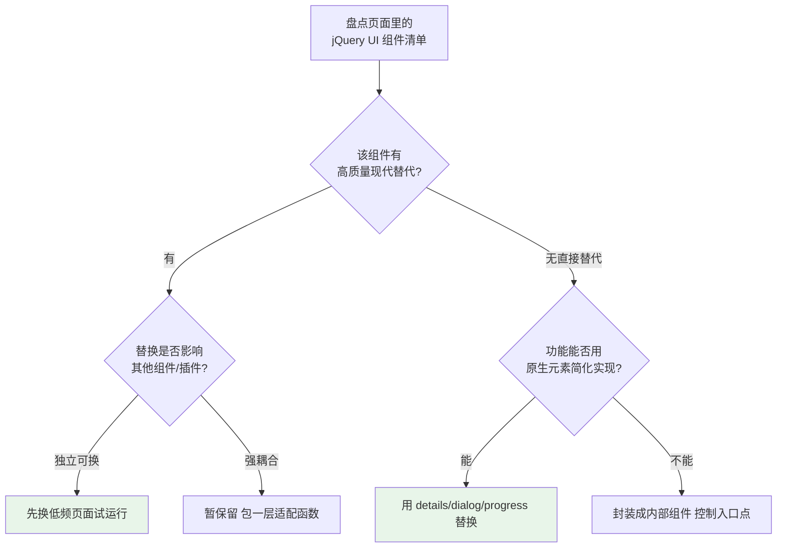
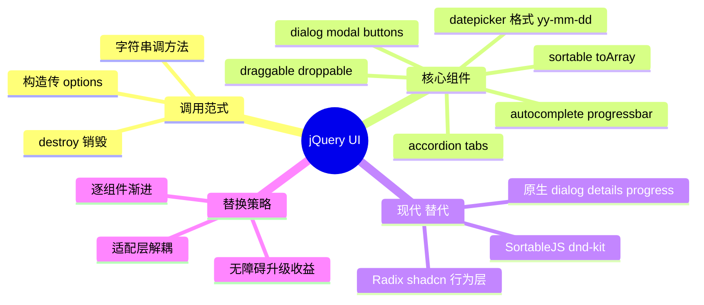

# 01 - jQuery UI 快速参考

> 定位声明：jQuery UI 是 jQuery 官方组件库（2007-2017 黄金期），**官方已停止积极开发，仅安全维护**。本章用途：读懂与维护老后台系统，并给出每个组件的现代替代路线。

---

## 1. 引入方式

老项目典型引入（CDN 或本地静态资源）：

```html
<link rel="stylesheet" href="https://code.jquery.com/ui/1.13.2/themes/base/jquery-ui.min.css">
<script src="https://code.jquery.com/jquery-3.6.0.min.js"></script>
<script src="https://code.jquery.com/ui/1.13.2/jquery-ui.min.js"></script>
```

依赖关系：jQuery UI 建立在 jQuery 之上（含 widget 工厂机制），CSS 主题文件必须同时引入，否则控件样式全崩。所有组件遵循统一调用范式：

```javascript
// 初始化
$(el).datepicker({ /* options */ });
// 运行时改配置 / 调方法
$(el).datepicker("option", "dateFormat", "yy-mm-dd");
$(el).datepicker("show");
// 销毁
$(el).datepicker("destroy");
```

记住这个"构造器 + 字符串命令"三段式，就能触类旁通用全部组件。

## 2. 组件速查表

### 2.1 datepicker：日期选择器

```javascript
$("#start-date").datepicker({
  dateFormat: "yy-mm-dd",      // 注意不是 moment 格式！yy=四位年 mm=补零月 dd=日
  changeMonth: true,           // 显示月份下拉
  changeYear: true,            // 显示年份下拉
  minDate: 0,                  // 0 = 今天起可选；字符串 "-1w" 也行
  maxDate: "+3m",
  firstDay: 1,                 // 周一为一周开始
  onSelect: (dateText, inst) => console.log("选中:", dateText),
});

// 中文本地化：额外引入语言包或手动覆盖 regional
$.datepicker.regional["zh-CN"] = {
  monthNames: ["一月","二月","三月","四月","五月","六月",
               "七月","八月","九月","十月","十一月","十二月"],
  dayNamesMin: ["日","一","二","三","四","五","六"],
  dateFormat: "yy-mm-dd",
};
$.datepicker.setDefaults($.datepicker.regional["zh-CN"]);
```

### 2.2 dialog：模态框

```javascript
$("#confirm-dialog").dialog({
  modal: true,                 // 遮罩背景
  autoOpen: false,             // 手动控制打开时机
  width: 420,
  buttons: {
    "确定": function () {
      $(this).dialog("close");
      doConfirm();
    },
    "取消": function () { $(this).dialog("close"); },
  },
});

$("#open-btn").on("click", () => $("#confirm-dialog").dialog("open"));
```

### 2.3 draggable 与 droppable：拖放

```javascript
$(".card").draggable({
  revert: "invalid",   // 放置失败回弹原位
  containment: "#board",
  cursor: "move",
});

$("#trash").droppable({
  accept: ".card",
  activeClass: "drop-hover", // 拖动悬停时的高亮类
  drop: (event, ui) => {
    ui.draggable.remove();
    console.log("已删除一张卡片");
  },
});
```

### 2.4 sortable：拖拽排序

```javascript
$("ul#playlist").sortable({
  axis: "y",               // 限定纵向拖动
  handle: ".drag-handle",  // 只有把手区域可拖
  update: (event, ui) => {
    const order = $(this).sortable("toArray"); // 新顺序的 id 数组
    saveOrder(order);
  },
});
```

### 2.5 resizable：缩放

```javascript
$("#editor-pane").resizable({
  handles: "e",        // 东边（右缘）可拉
  minWidth: 240,
  maxWidth: 640,
  resize: () => redrawChart(), // 拉动过程持续触发，注意节流
});
```

### 2.6 accordion：手风琴折叠组

```javascript
$("#faq").accordion({
  collapsible: true,    // 允许全部收起
  heightStyle: "content", // 高度随内容而非取最高
  animate: 200,
  active: 1,            // 默认展开第二项
});
```

### 2.7 tabs：选项卡

```javascript
$("#detail").tabs({
  active: 0,
  activate: (e, ui) => lazyLoadPanel(ui.newPanel), // 切换时按需加载内容
});
```

### 2.8 autocomplete：自动完成

```javascript
$("#city").autocomplete({
  source: "/api/cities?q=",     // 直接接接口，响应需是 [{label, value}] 或字符串数组
  minLength: 1,                 // 输入几个字符开始提示
  delay: 300,                   // 输入防抖毫秒
  select: (e, ui) => console.log(ui.item.value),
});

// source 也接受函数：完全自定义取数逻辑（本地过滤或异步请求都行）
$("#kw").autocomplete({
  source: (request, response) => {
    const pool = ["北京", "上海", "广州", "深圳"];
    const hits = $.ui.autocomplete.filter(pool, request.term);
    response(hits.slice(0, 8)); // 回调返回候选数组
  },
});
```

### 2.9 progressbar：进度条

```javascript
$("#bar").progressbar({ max: 100 });
$("#bar").progressbar("value", 37);          // 设置进度
const v = $("#bar").progressbar("value");    // 读取
```

### 2.10 button：按钮增强

```javascript
$("button").button();                 // 统一按钮样式
$("#icon-btn").button({
  icons: { primary: "ui-icon-locked" },
  text: false,                        // 纯图标按钮
});
// 单选/复选组变按钮组
$("#format").buttonset();
```

## 3. Widget 工厂：所有组件的共同骨架

读懂 widget 三段式后，再补一张通用事件与命令表：

| 类别 | 写法 | 说明 |
|------|------|------|
| 创建 | `$(el).comp(opts)` | 重复调用默认幂等（不会叠加初始化） |
| 读配置 | `$(el).comp("option", key)` | 取单个选项 |
| 改配置 | `$(el).comp("option", key, val)` | 运行时热更新 |
| 调方法 | `$(el).comp("method", args)` | show/close/destroy 等 |
| 事件 | `$(el).on("compevent", fn)` | 事件名 = 组件名 + 行为，如 dialogclose、sortstop |
| 销毁 | `$(el).comp("destroy")` | 移除行为并尽量还原 DOM |

事件命名规律值得背下来：dialog 的 open/close 触发 `dialogopen` / `dialogclose`；sortable 拖完触发 `sortupdate` / `sortstop`；datepicker 选完触发 onSelect 回调（它反而不用事件）。读老代码时按"组件名前缀 + 动词"猜事件名，命中率极高。

一个典型的"运行时联动"例子——两个 datepicker 做日期范围约束：

```javascript
$("#from").datepicker("option", "onSelect", function (dateText) {
  $("#to").datepicker("option", "minDate", dateText);
});
```

不销毁重建、不改内部状态，全部通过 option 命令完成——这是老项目里最常见的写法，也是维护时最安全的切入点。

## 4. ThemeRoller 一句话

官网的 ThemeRoller 在线工具可以可视化调色生成整套主题 CSS——老项目换肤靠它重新下载主题文件即可，无需改代码。

## 5. ThemeRoller 一句话

官网的 ThemeRoller 在线工具可以可视化调色生成整套主题 CSS——老项目换肤靠它重新下载主题文件即可，无需改代码。

## 6. 现代替代方案对照表

| jQuery UI 组件 | 今天用什么 | 说明 |
|----------------|-----------|------|
| datepicker | 原生 `<input type="date">`；复杂需求用 flatpickr、react-day-picker | 原生控件移动端体验更好 |
| dialog | **原生 `<dialog>` 元素** + showModal()；React 用 Radix Dialog / shadcn/ui | 原生自带焦点圈定与 Esc 关闭 |
| draggable/droppable | Pointer Events 自研；复杂场景 dnd-kit（React）、SortableJS | 触屏兼容是 jQuery UI 版的硬伤 |
| sortable | SortableJS（零框架依赖）或 dnd-kit | SortableJS API 几乎一比一对应 |
| resizable | CSS `resize: horizontal`；面板场景用 allotment/react-resizable-panels | CSS 一行能解决就别上库 |
| accordion | 原生 `<details>/<summary>`；设计系统用 Radix Accordion | 无 JS 也能工作 |
| tabs | Radix Tabs / shadcn/ui Tabs；简单页用 radio+css 技巧 | 关注键盘方向键导航 |
| autocomplete | `<datalist>`（轻量）；重交互用 downshift/cmdk | datalist 零 JS 但样式受限 |
| progressbar | 原生 `<progress>` 元素 | 一行 HTML |

原生 `<dialog>` 示例，感受一下替代品有多简洁：

```html
<dialog id="confirm">
  <p>确认删除这条记录吗？</p>
  <menu>
    <button id="ok">确定</button>
    <button id="cancel" autofocus>取消</button>
  </menu>
</dialog>
```

```javascript
const dlg = document.querySelector("#confirm");
document.querySelector("#del").onclick = () => dlg.showModal();
dlg.querySelector("#ok").onclick = () => { doDelete(); dlg.close(); };
dlg.querySelector("#cancel").onclick = () => dlg.close();
// showModal 自动提供遮罩、焦点陷阱、Esc 关闭——jQuery UI 时代要手写的全送了
```

选型判断口诀：**headless 组件库（Radix 等）负责行为和无障碍，你负责样式**——这是对 jQuery UI"样式行为捆绑"模式的根本性超越。

选型判断口诀：**headless 组件库（Radix 等）负责行为和无障碍，你负责样式**——这是对 jQuery UI"样式行为捆绑"模式的根本性超越。

## 7. 迁移实战：dialog 从 jQuery UI 换成原生

以最常见的 dialog 为例走一遍完整迁移，其余组件同理：

```javascript
/* ---------- 旧代码（jQuery UI） ---------- */
$("#dlg").dialog({
  modal: true,
  autoOpen: false,
  buttons: {
    "保存": function () { save(); $(this).dialog("close"); },
    "取消": function () { $(this).dialog("close"); },
  },
});
$(document).on("click", ".open-dlg", () => $("#dlg").dialog("open"));
```

```html
<!-- 新结构（原生 dialog） -->
<dialog id="dlg">
  <form method="dialog" id="dlg-form">
    <p>编辑内容...</p>
    <menu>
      <button value="cancel">取消</button>
      <button id="save-btn" value="default">保存</button>
    </menu>
  </form>
</dialog>
```

```javascript
/* ---------- 新代码（原生） ---------- */
const dlg = document.querySelector("#dlg");

document.addEventListener("click", (e) => {
  if (e.target.closest(".open-dlg")) dlg.showModal();
});

// form method=dialog 让按钮自动关闭并带回返回值
dlg.querySelector("#dlg-form").addEventListener("submit", (e) => {
  if (e.submitter?.id === "save-btn") save(); // 只有保存按钮触发业务
});

// 原生自带的能力（旧版要手写）：Esc 关闭、点击遮罩关闭、焦点圈定
dlg.addEventListener("click", (e) => {
  if (e.target === dlg) dlg.close(); // 点击遮罩区域（对话框本体之外）
});
```

迁移差异清单：buttons 配置变成 HTML 内的 menu；`dialog("open"/"close")` 变 `showModal()/close()`；事件名从 dialogclose 变 close；遮罩样式从主题 CSS 变为 `::backdrop` 伪元素自行设计。功能等价后即可删除对应 jQuery UI 引用。

## 8. 老项目渐进替换策略

一次性重写风险大，推荐逐组件评估替换：



可行性判断清单：

1. **优先替换**：tabs、accordion、progressbar——结构简单、替代成熟。
2. **次级替换**：datepicker、dialog——注意日期格式迁移和事件名差异。
3. **谨慎对待**：sortable/draggable 组合出的复杂看板——交互细节多，建议整块重构而不是缝缝补补。
4. **替换前必测**：键盘操作、屏幕阅读器播报（jQuery UI 组件的无障碍普遍不达标，这反而是升级收益）。

过渡技巧：新代码统一走一个薄适配层（如 `ui.dialog()` 内部先走原生 dialog），让业务代码不再感知底层用的是谁，最终把旧实现静默换掉。

---

## 9. 小结



一句话总结：读得懂它的 widget 三段式，就能维护任何老系统；知道每个组件的原生替代，就能在新项目里永远不碰它。
