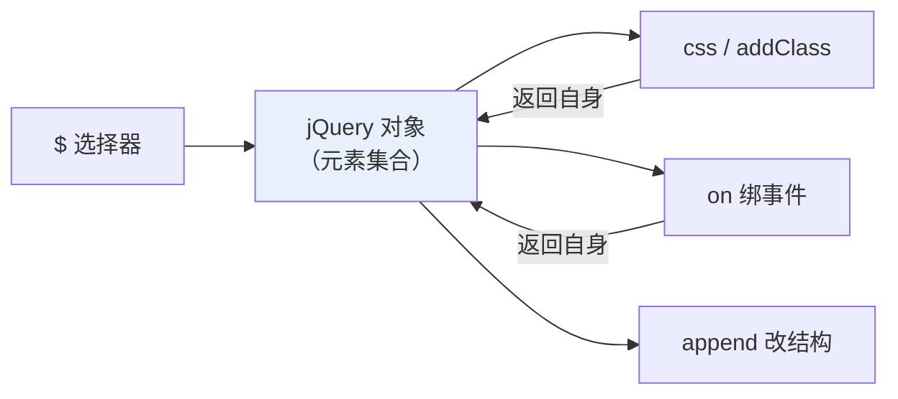
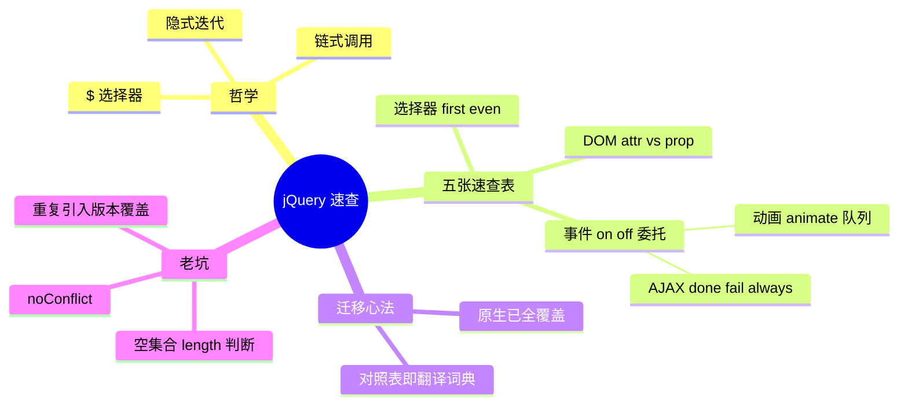

# 01 - jQuery 快速参考

> 定位声明：jQuery 是 2006-2016 年的绝对霸主，2019 年后新项目基本不再使用（原生 API 与框架已覆盖其全部价值）。本章用途：**维护老项目、读懂旧代码、应对面试**，不是新项目选型推荐。

---

## 1. 核心哲学：$ 选择器 + 链式调用

jQuery 把"找元素、改元素、绑事件"压缩成统一风格：

```javascript
// 一行完成：找到所有 .item，加类、绑定点击
$(".item").addClass("active").on("click", handleClick);
```

三个设计支柱：

1. **$ 函数**：`$("选择器")` 查询并返回 jQuery 对象（类数组集合），几乎所有方法都挂在这个对象上。
2. **链式调用**：每个操作方法返回自身，可以一路点下去。
3. **隐式迭代**：对集合操作时自动循环每个元素，不用手写 for。



## 2. 速查表：选择器

| 写法 | 含义 | 原生等价 |
|------|------|----------|
| `$("#id")` | 按 id | getElementById |
| `$(".cls")` | 按 class | querySelectorAll(".cls") |
| `$("div")` | 按标签 | getElementsByTagName |
| `$("[name=mail]")` | 属性选择器 | querySelectorAll("[name=mail]") |
| `$("li:first")` | 第一个 li | querySelector("li") |
| `$("li:last")` | 最后一个 | 集合取末位 |
| `$("tr:even")` | 偶数行（0 起） | filter((\_, i) => i % 2 === 0) |
| `$("li:eq(2)")` | 第 3 个 | 集合下标 [2] |
| `$("input:checked")` | 选中的框 | querySelectorAll(":checked") |
| `$("ul li:not(.off)")` | 排除 | :not() 同名 |

```javascript
// jQuery
const $rows = $("table tr:even").addClass("striped");

// 原生等价
document.querySelectorAll("table tr")
  .forEach((tr, i) => { if (i % 2 === 0) tr.classList.add("striped"); });
```

注意 jQuery 特有伪类的冒号写法在原生 CSS 中大多不存在（:first/:eq 是 jQuery 发明的）。

## 3. 速查表：DOM 操作

### 3.1 内容与值

| jQuery | 作用 | 原生等价 |
|--------|------|----------|
| `.html()` / `.html(str)` | 读/写 innerHTML | el.innerHTML |
| `.text()` / `.text(str)` | 读/写纯文本 | el.textContent |
| `.val()` / `.val(v)` | 表单控件值 | input.value |
| `.attr(k)` / `.prop(k)` | HTML 属性 / JS 属性 | getAttribute / 直接访问 |

attr 与 prop 的区别是高频面试题：

- `attr` 对应写在 HTML 标签上的 attribute（初始值，字符串）。
- `prop` 对应 DOM 对象的 property（当前值，随交互变化）。
- checked/disabled/selected 这类布尔状态必须用 prop 才能拿到实时值。

```javascript
$("#agree").prop("checked");   // 实时勾选状态，正确
$("#agree").attr("checked");   // 只有 HTML 里写了才返回 "checked"，且不更新

$("#avatar").attr("src", "/new.png"); // 动态资源地址用 attr 合理
$("#nick").val("新昵称");              // 设置输入框
```

### 3.2 结构增删与样式

| jQuery | 原生等价 |
|--------|----------|
| `.append($el)` / `.prepend($el)` | appendChild / prepend |
| `.before()` / `.after()` | before / after |
| `.remove()` | remove |
| `.empty()` 清空子节点 | replaceChildren() |
| `.clone(true)` 克隆含事件 | cloneNode + 手动重绑 |
| `.wrap(html)` 包一层 | 无直接等价，手动操作 |
| `.css("color", "red")` | style.color = "red" |
| `.css({ width: 100, opacity: .5 })` | Object.assign(style, ...) |
| `.addClass/.removeClass/.toggleClass` | classList 同名方法 |
| `.hasClass(x)` | classList.contains(x) |
| `.width()/.height()` | clientWidth/clientHeight |
| `.offset()/.position()` | getBoundingClientRect 换算 |
| `.data(key, v)` 自定义数据 | dataset |

```javascript
// jQuery
$("#list").append("<li>新项</li>").css({"border": "1px solid #ccc"});
$(".tag").toggleClass("on");

// 原生等价
const list = document.querySelector("#list");
list.insertAdjacentHTML("beforeend", "<li>新项</li>");
list.style.border = "1px solid #ccc";
document.querySelectorAll(".tag")
  .forEach((el) => el.classList.toggle("on"));
```

## 4. 速查表：事件

| jQuery | 说明 | 原生等价 |
|--------|------|----------|
| `.on("click", fn)` | 绑定 | addEventListener |
| `.on("click", ".del", fn)` | **委托**（第二参为过滤选择器） | closest 手写委托 |
| `.off("click", fn)` | 解绑 | removeEventListener |
| `.one("click", fn)` | 只触发一次 | { once: true } |
| `.click(fn)` | on 的简写 | addEventListener |
| `.hover(fnIn, fnOut)` | 进出组合 | mouseenter+mouseleave |
| `.trigger("click")` | 程序触发 | dispatchEvent |
| `$(document).ready(fn)` | DOM 就绪执行 | defer 脚本/DOMContentLoaded |
| `e.preventDefault()` | 同名 | 同名 |
| `e.stopPropagation()` | 同名 | 同名 |

```javascript
// jQuery 委托：一行
$("#list").on("click", "button.del", function () {
  $(this).closest("li").remove();
});

// 原生等价
document.querySelector("#list").addEventListener("click", (e) => {
  const btn = e.target.closest("button.del");
  if (btn) btn.closest("li").remove();
});
```

ready 的历史背景值得知道：老代码把脚本放在 head 里，必须等 DOM 就绪；现代规范用 `<script defer>` 从根上解决了这个问题。

## 5. 速查表：动画

| 方法 | 效果 |
|------|------|
| `.show()/.hide()/.toggle()` | 显隐 |
| `.slideUp()/.slideDown()/.slideToggle()` | 高度收展 |
| `.fadeIn()/.fadeOut()/.fadeToggle()` | 透明度渐变 |
| `.fadeTo(dur, opacity)` | 渐变到指定透明度 |
| `.animate(props, dur, ease, cb)` | 数值属性自定义动画 |
| `.delay(ms)` | 队列延时 |

```javascript
$(".panel").slideUp(300).delay(200).fadeIn(400);

$(".box").animate(
  { left: "+=120", opacity: 0.6 },
  500,
  "swing",
  () => console.log("动画完成")
);
```

现代替代思路：CSS transition/animation + classList 切换（见 [[前端开发/01-基础/CSS/05-CSS3动画与过渡|CSS3 动画与过渡]]），或 Web Animations API 的 `element.animate()`。jQuery 动画是 JS 逐帧驱动的，性能不如浏览器合成的 CSS 动画。

## 6. 速查表：AJAX

| 方法 | 用途 |
|------|------|
| `$.get(url, data, cb)` | GET 快捷方式 |
| `$.post(url, data, cb)` | POST 快捷方式 |
| `$.getJSON(url, cb)` | GET 并自动解析 JSON |
| `$.ajax(options)` | 全功能入口 |
| `.load(url)` | 把响应 HTML 直接灌进元素 |

```javascript
// $.ajax 完整形态
$.ajax({
  url: "/api/users",
  method: "POST",
  contentType: "application/json",
  data: JSON.stringify({ name: "张三" }),
  dataType: "json",
  timeout: 5000,
})
.done((res) => console.log(res))     // 成功
.fail((xhr) => console.error(xhr.status)) // 失败
.always(() => hideLoading());        // 无论成败
```

`.done/.fail/.always` 是 jQuery 自己的 Deferred 风格，比标准 Promise 早上几年——这就是为什么老代码里看不到 async/await。迁移时对照关系：done→then、fail→catch、always→finally。

## 7. 速查表：each 遍历

```javascript
// 集合遍历：回调参数是 (index, element)，注意顺序和数组 forEach 相反！
$("li").each(function (i, el) {
  console.log(i, this.textContent); // this 即当前元素
});

// 任意对象/数组遍历
$.each(["a", "b"], (i, val) => console.log(i, val));
$.each({ x: 1, y: 2 }, (key, val) => console.log(key, val));

// 工具函数一族
$.map([1, 2], (v) => v * 2);      // [2, 4]
$.grep([1, 2, 3], (v) => v > 1);  // 过滤 [2, 3]
$.inArray("b", ["a", "b"]);       // 1，找不到返回 -1
$.extend(true, target, src1);     // 深合并对象
```

原生等价就是 forEach/map/filter/includes/Object.assign，语义一一对应。

## 8. 速查表：遍历与集合操作

读老代码高频出现的遍历族方法：

| 方法 | 方向 | 原生等价 |
|------|------|----------|
| `.parent()` / `.parents(sel)` | 直接父级 / 全部祖先 | parentElement / closest 循环 |
| `.closest(sel)` | 最近祖先 | 同名（原生也有） |
| `.children()` | 子元素 | el.children |
| `.find(sel)` | 后代查找 | el.querySelectorAll(sel) |
| `.siblings()` | 兄弟 | [...p.children] 过滤自身 |
| `.next()` / `.prev()` | 相邻兄弟 | nextElementSibling 等 |
| `.first()` / `.last()` / `.eq(i)` | 集合取项 | [0] / [length-1] / [i] |
| `.filter(sel)` | 集合过滤 | Array.prototype.filter |
| `.not(sel)` | 反向过滤 | filter 取反 |
| `.add(sel)` | 合并集合 | 展开拼接 |
| `.end()` | 回退到上一个集合 | 无——链式穿越专用 |

`.end()` 是链式调用里最费解的一个，配合 `.find()` 使用：

```javascript
// jQuery：从 #list 出发 → 找 .item → 操作 → end 回到 #list → 再找 .head
$("#list").find(".item").hide().end().find(".head").show();

// 原生等价：拆成两句更清晰
document.querySelector("#list").querySelectorAll(".item")
  .forEach((el) => (el.style.display = "none"));
document.querySelector("#list").querySelectorAll(".head")
  .forEach((el) => (el.style.display = ""));
```

判断一个元素是否在集合中：

```javascript
// jQuery
if ($el.is(":visible")) { /* ... */ }   // is() 接选择器做判断
if ($list.index($item) !== -1) { /* ... */ }

// 原生
if (el.offsetParent !== null) { /* 可见（近似） */ }
```

`is(":visible")` 的判定规则要记牢：`display:none` 或没有布局尺寸即不可见；`visibility:hidden` 和 `opacity:0` **算可见**——与直觉不同，排查"明明藏了还判断为可见"时先想到这里。

## 9. 现代 vs jQuery 对照总表

| 场景 | jQuery | 现代原生 |
|------|--------|----------|
| 查询 | `$(".card")` | document.querySelectorAll(".card") |
| 改文本 | `.text("hi")` | el.textContent = "hi" |
| 加类 | `.addClass("on")` | el.classList.add("on") |
| 绑定 | `.on("click", fn)` | addEventListener("click", fn) |
| 委托 | `.on("click", "sel", fn)` | closest 判断（见委托章节） |
| 插入 | `.append(html)` | insertAdjacentHTML |
| AJAX | `$.get(...).done(fn)` | fetch + res.json() |
| 动画 | `.fadeIn()` | CSS transition / el.animate() |
| 就绪 | `$(fn)` | `<script defer>` |
| 遍历 | `.each(fn)` | NodeList.forEach |

读这张表的正确心态不是"我要背两套"，而是：**你其实已经会了 jQuery——它只是把你会的原生 API 换了个更短的写法**。反向阅读老代码时按此表翻译即可。

## 10. 老项目常见坑

### 9.1 重复引入与多版本共存

```html
<script src="/js/jquery-1.7.2.min.js"></script>
<script src="/js/jquery-3.6.0.min.js"></script> <!-- 后者覆盖 $ -->
```

后引入的版本覆盖前者的 `$`，依赖旧版特有行为的插件会静默坏掉。排查手段：控制台执行 `$.fn.jquery` 打印实际版本；全局搜索页面里所有 jquery script 引入。

### 9.2 $ 冲突与 noConflict

其他库（如 Prototype 时代）也占用 `$` 时：

```javascript
const jq = jQuery.noConflict(); // 让出 $，改用别名
jq(".item").hide();

// 或隔离作用域写法：插件模板标配
(function ($) {
  // 这里 $ 就是安全的 jQuery
  $(".item").hide();
})(jQuery);
```

### 9.3 隐式迭代的误伤

```javascript
// 对空集合操作不报错也不生效——条件判断永远为真
if ($(".error-tip")) { /* 永远进入！jQuery 对象永远 truthy */ }

// 正确判空：看 length
if ($(".error-tip").length) { /* 有匹配才进入 */ }
```

这是从原生转来的人最容易踩的逻辑错误：`querySelector` 返回 null 可以 if，jQuery 对象永远是对象。

### 9.4 其他高频坑速记

- `.html()` 与用户输入拼串存在 XSS，同原生 innerHTML 规则。
- 动画队列堆积：快速连点导致 slideDown 排长队，需要 `.stop(true)` 先清队。
- `$(this)` 在箭头函数里失效——老插件的回调都是 function 不是箭头函数，改写时要保留。
- 版本 1.x 支持 IE6-8，体积大且有已知漏洞（CVE-2020-11023 等），维护时至少升到 3.x 补丁版。

---

## 11. 小结



最后重申定位：这章是**考古工具书**。新项目遇到"想用 jQuery 解决的问题"，答案永远是现代原生 API 或框架。
