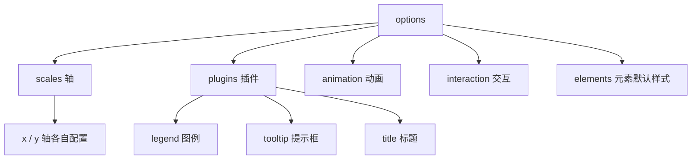

# 图表类型与配置

> Chart.js 的所有能力都在一个嵌套的 config 对象里。
> 本章把 scales、legend、tooltip、颜色体系讲透，再过各图表的关键选项。

---

## 1. 配置体系全景

先建立整体心智模型——options 是一棵按"区域"划分的树：



记住三条规则：
1. **轴配置在 `options.scales.x` 与 `options.scales.y`**（v3 之后是对象不是数组）。
2. **legend/tooltip/title 都在 `options.plugins` 下**。
3. dataset 级配置优先级高于 options 级。

---

## 2. scales：轴的深度定制

### 2.1 轴标题、网格与刻度

```js
options: {
  scales: {
    y: {
      title: {
        display: true,
        text: '销售额（万元）'
      },
      grid: {
        color: '#eee',           // 网格线颜色
        drawOnChartArea: true
      },
      ticks: {
        stepSize: 100,           // 刻度步长
        callback: function (value) {
          // 刻度回调：格式化金额
          return value >= 1000
            ? (value / 1000) + 'k'
            : value;
        }
      },
      beginAtZero: true,
      max: 800                   // 也可以不设，自动计算
    },
    x: {
      grid: { display: false },  // X 向网格通常不需要
      ticks: {
        maxRotation: 0,          // 类目过多时不旋转标签
        autoSkip: true           // 自动跳过放不下的标签
      }
    }
  }
}
```

### 2.2 金额格式化回调完整示例

```js
ticks: {
  callback(value) {
    return '¥' + value.toLocaleString('zh-CN');
  }
}
```

tooltip 的金额格式化在 plugins.tooltip.callbacks 里做，
下一节展开。**ticks.callback 改的是刻度文字，
tooltips.callbacks 改的是提示框内容**，别混用。

---

## 3. legend 与 tooltip

### 3.1 legend：标题与位置

```js
plugins: {
  legend: {
    position: 'bottom',          // top/bottom/left/right
    align: 'center',
    labels: {
      usePointStyle: true,       // 小圆点代替色块
      boxWidth: 8,
      padding: 20
    }
  },
  title: {
    display: true,
    text: '季度销售对比',
    font: { size: 16 }
  }
}
```

图例点击默认行为是切换系列显隐，这个联动是免费的。
想禁用可以设 `onClick: null`。

### 3.2 tooltip 自定义：callback 加单位

```js
plugins: {
  tooltip: {
    backgroundColor: 'rgba(30, 30, 30, .9)',
    padding: 10,
    callbacks: {
      // 标题行：显示完整月份
      title(items) {
        return items[0].label + ' 销售明细';
      },
      // 数据行：加单位
      label(item) {
        const v = item.parsed.y;
        return ` ${item.dataset.label}：${v} 万元`;
      },
      // 追加同比行
      afterLabel(item) {
        const idx = item.dataIndex;
        const prev = item.chart.data.datasets[1].data[idx];
        const diff = ((item.parsed.y - prev) / prev * 100).toFixed(1);
        return ` 同比：${diff}%`;
      }
    }
  }
}
```

常用 callback 钩子：

| 钩子         | 控制内容             |
|--------------|----------------------|
| title        | 第一行标题           |
| label        | 每条数据行           |
| afterLabel   | 每条数据行的附加行   |
| footer       | 底部合计等           |

---

## 4. colors：rgba 透明度填充技巧

Chart.js 的颜色直接用 CSS 颜色字符串。
面积类视觉效果的诀窍是：**线用实色、填充用同色的低透明度 rgba**：

```js
{
  label: '访问量',
  data: [120, 200, 150, 300, 250],
  borderColor: '#3498db',                    // 线：实色
  backgroundColor: 'rgba(52, 152, 219, .18)',// 填充：12% 透明度
  fill: true
}
```

饼图/环形图需要一组离散颜色：

```js
const PALETTE = [
  '#3498db', '#2ecc71', '#f39c12',
  '#e74c3c', '#9b59b6', '#1abc9c'
];

{
  type: 'doughnut',
  data: {
    labels: ['华东', '华南', '华北', '西南', '东北'],
    datasets: [{
      data: [420, 350, 280, 190, 120],
      backgroundColor: PALETTE,
      borderWidth: 2,
      borderColor: '#fff'       // 白描边制造分隔感
    }]
  }
}
```

小技巧：写一个 hex 转 rgba 的工具函数，避免手抄透明度：

```js
function withAlpha(hex, a) {
  return `rgba(${parseInt(hex.slice(1,3),16)}, ` +
         `${parseInt(hex.slice(3,5),16)}, ` +
         `${parseInt(hex.slice(5,7),16)}, ${a})`;
}
withAlpha('#3498db', 0.18);  // 'rgba(52, 152, 219, 0.18)'
```

---

## 5. 各图表关键选项

### 5.1 bar：堆叠与横向

```js
{ type: 'bar', options: { scales: { x: { stacked: true },
                                    y: { stacked: true } } } }   // 堆叠

{ type: 'bar', options: { indexAxis: 'y' } }   // 横向，类目名长时好用
```

| 选项                | 说明                             |
|---------------------|----------------------------------|
| `indexAxis`         | 'x' 默认纵向，'y' 横向           |
| `scales.*.stacked`  | 开启堆叠                         |
| `barPercentage` / `borderRadius` / `maxBarThickness` | 柱宽比例 / 圆角 / 最大柱宽 |

### 5.2 pie vs doughnut

```js
{
  type: 'doughnut',
  data,
  options: {
    cutout: '62%'          // 中空比例；'50%' 或像素值均可
  }
}
```

pie 实心圆；doughnut 中空更现代，中间还能叠放合计数字，二者配置几乎一致。

### 5.3 radar：多维度对比场景

适合员工技能评估、产品多维评分等"能力画像"场景。注意雷达图的
轴配置键是 `scales.r`，不是 x/y：

```js
{
  type: 'radar',
  data: {
    labels: ['沟通', '编码', '架构', '协作', '交付'],
    datasets: [
      { label: '张三', data: [4, 3, 3, 5, 4],
        backgroundColor: 'rgba(52, 152, 219, .2)',
        borderColor: '#3498db' },
      { label: '李四', data: [3, 5, 4, 3, 3],
        backgroundColor: 'rgba(46, 204, 113, .2)',
        borderColor: '#2ecc71' }
    ]
  },
  options: {
    scales: {
      r: { min: 0, max: 5,
           ticks: { stepSize: 1 },
           pointLabels: { font: { size: 13 } } }
    }
  }
}
```

### 5.4 mixed 混合图：type 数组

dataset 级别可以覆盖图表类型——柱线混合是报表页常客：

```js
new Chart(ctx, {
  data: {
    labels: ['Q1', 'Q2', 'Q3', 'Q4'],
    datasets: [
      {
        type: 'bar',                    // 柱：销售额
        label: '销售额（万元）',
        data: [320, 450, 520, 610],
        backgroundColor: '#3498db'
      },
      {
        type: 'line',                   // 线：利润率
        label: '利润率（%）',
        data: [12, 15, 14, 18],
        borderColor: '#e67e22',
        yAxisID: 'y1'                   // 挂到第二根 Y 轴
      }
    ]
  },
  options: {
    scales: {
      y: {
        position: 'left',
        title: { display: true, text: '万元' }
      },
      y1: {
        position: 'right',
        grid: { drawOnChartArea: false }, // 避免两套网格打架
        title: { display: true, text: '%' }
      }
    }
  }
});
```

要点：
- 顶层不再写 `type`（或写默认类型），每个 dataset 自带 type。
- 双轴时第二个轴必须给 id 并在 dataset 里用 `yAxisID` 引用。

---

## 6. 数据更新与动画

### 6.1 update 方法

数据变化后不要重新 new，改数据再调用 `chart.update()`：

```js
const chart = new Chart(ctx, config);

// 之后某时刻
chart.data.datasets[0].data = [100, 220, 180, 300];
chart.data.labels = ['Q1', 'Q2', 'Q3', 'Q4'];
chart.update();                       // 带过渡动画刷新

chart.update('none');                 // 不要动画，立即重绘
```

`update('none')` 表示无动画立即重绘。高频轮询场景
（如 1 秒一刷的监控图）建议用它，否则动画永远追不上数据变化。

### 6.2 chart.destroy 与内存注意

每个 Chart 实例都持有 canvas 引用和事件监听。
**canvas 元素被移除或复用前必须销毁实例**，否则监听器泄漏，
且同一个 canvas 上重复 new 会直接抛错：

```js
let chart = null;

function render(newData) {
  if (chart) chart.destroy();          // 先销毁旧实例
  chart = new Chart(ctx, { ... });
}
```

更优雅的做法是保留实例、只更新数据（6.1），
把 destroy 留给组件卸载时机（React 的 useEffect cleanup /
Vue 的 onBeforeUnmount）。SPA 页面切换时忘记 destroy
是 Chart.js 内存泄漏的头号来源。

---

## 7. 响应式 resize

开启 `responsive: true` 后，Chart.js 内部用 ResizeObserver
监听容器尺寸变化并自动重绘。你只需要保证容器决定尺寸、
canvas 不设宽高（relative + 定高的老配方）。
需要在小屏切换配置时，可用 `options.onResize` 回调按宽度调整图例显隐。

---

## 8. 实战：堆叠柱 + 环形占比组合面板

完整可运行单文件：上半区季度渠道堆叠柱，下半区年度构成环形图。

```html
<!DOCTYPE html>
<html lang="zh-CN">
<head>
<meta charset="UTF-8" />
<title>销售组合面板</title>
<script src="https://cdn.jsdelivr.net/npm/chart.js@4"></script>
<style>
  body {
    font-family: sans-serif;
    background: #f0f2f5;
    padding: 24px;
    margin: 0;
  }
  .panel {
    max-width: 960px;
    margin: auto;
    display: grid;
    grid-template-columns: 3fr 2fr;
    gap: 20px;
  }
  .card {
    background: #fff;
    border-radius: 10px;
    padding: 18px;
    box-shadow: 0 1px 4px rgba(0, 0, 0, .08);
  }
  .card h2 { margin: 0 0 12px; font-size: 15px; color: #444; }
  .box { position: relative; height: 300px; }
</style>
</head>
<body>

<div class="panel">
  <div class="card">
    <h2>季度销售渠道构成（万元）</h2>
    <div class="box"><canvas id="stack"></canvas></div>
  </div>
  <div class="card">
    <h2>全年渠道占比</h2>
    <div class="box"><canvas id="ring"></canvas></div>
  </div>
</div>

<script>
  const PALETTE = ['#3498db', '#2ecc71', '#f39c12', '#e74c3c'];
  const fmt = v => '¥' + v.toLocaleString();

  // ---- 堆叠柱 ----
  new Chart(document.getElementById('stack'), {
    type: 'bar',
    data: {
      labels: ['Q1', 'Q2', 'Q3', 'Q4'],
      datasets: [
        { label: '直营店', data: [120, 140, 160, 180],
          backgroundColor: PALETTE[0] },
        { label: '电商',   data: [90, 130, 150, 200],
          backgroundColor: PALETTE[1] },
        { label: '分销',   data: [60, 70, 80, 95],
          backgroundColor: PALETTE[2] },
        { label: '其他',   data: [30, 35, 40, 45],
          backgroundColor: PALETTE[3] }
      ]
    },
    options: {
      responsive: true,
      maintainAspectRatio: false,
      scales: {
        x: { stacked: true },
        y: {
          stacked: true,
          ticks: { callback: v => fmt(v) },
          title: { display: true, text: '销售额' }
        }
      },
      plugins: {
        tooltip: {
          callbacks: {
            label: item => ` ${item.dataset.label}：${fmt(item.parsed.y)}`
          }
        }
      }
    }
  });

  // ---- 环形占比 ----
  new Chart(document.getElementById('ring'), {
    type: 'doughnut',
    data: {
      labels: ['直营店', '电商', '分销', '其他'],
      datasets: [{
        data: [600, 570, 305, 150],
        backgroundColor: PALETTE,
        borderColor: '#fff',
        borderWidth: 2
      }]
    },
    options: {
      responsive: true,
      maintainAspectRatio: false,
      cutout: '58%',
      plugins: {
        legend: { position: 'bottom', labels: { usePointStyle: true } },
        tooltip: {
          callbacks: {
            label(item) {
              const total = item.dataset.data.reduce((a, b) => a + b, 0);
              const pct = (item.parsed / total * 100).toFixed(1);
              return ` ${item.label}：${fmt(item.parsed)}（${pct}%）`;
            }
          }
        }
      }
    }
  });
</script>

</body>
</html>
```

本例综合运用了：stacked 双开、ticks 金额格式化、tooltip label 回调、
环形图百分比计算、cutout 中空、usePointStyle 图例样式。

---

## 小结

- options 是分区树：轴进 scales，插件进 plugins，别放错层。
- 刻度格式化用 ticks.callback，提示框用 tooltips.callbacks。
- 堆叠要求 x/y 同时 stacked: true；横向图只改 indexAxis。
- 混合图在 dataset 上写 type，双轴记得 yAxisID + drawOnChartArea:false。
- 更新走 chart.update()；实例生命周期结束必须 chart.destroy()。

下一篇进入工程化实战：
[[前端开发/06-数据可视化/Chart.js/03-Chart.js实战|Chart.js 实战]]
