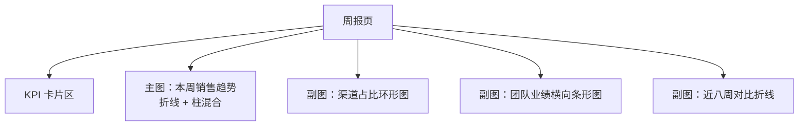

# Chart.js 实战

> 综合实战：一个业务周报图表页。单 HTML 文件、零构建、CDN 引入，
> 覆盖布局、异步加载、图例联动、图片导出与主题化五个工程要点。

---

## 1. 目标与结构

页面包含四个图表，用 CSS Grid 排版
（布局基础见 [[前端开发/01-基础/CSS/04-Grid布局|Grid 布局]]）：



功能清单：
1. Grid 四宫格响应式排版
2. fetch 模拟 API 数据，加载中有 loading 态
3. 点击环形图图例时，主图同步过滤对应渠道（联动）
4. 每张图支持导出 PNG 下载
5. 主题色从 CSS 变量读取注入图表

---

## 2. 骨架与 Grid 排版

```html
<!DOCTYPE html>
<html lang="zh-CN">
<head>
<meta charset="UTF-8" />
<title>业务周报</title>
<script src="https://cdn.jsdelivr.net/npm/chart.js@4"></script>
<style>
  :root {
    --c-primary: #3498db;
    --c-success: #2ecc71;
    --c-warning: #f39c12;
    --c-danger:  #e74c3c;
    --bg: #f0f2f5;
  }
  * { box-sizing: border-box; }
  body {
    margin: 0;
    padding: 24px;
    font-family: sans-serif;
    background: var(--bg);
  }
  h1 { font-size: 22px; color: #333; }

  /* 四宫格：大屏两列，小屏单列 */
  .grid {
    display: grid;
    grid-template-columns: repeat(2, 1fr);
    gap: 20px;
  }
  @media (max-width: 900px) {
    .grid { grid-template-columns: 1fr; }
  }
  .card {
    background: #fff;
    border-radius: 12px;
    padding: 18px;
    box-shadow: 0 1px 4px rgba(0,0,0,.08);
    position: relative;              /* loading 蒙层的定位父级 */
  }
  .card-head {
    display: flex;
    justify-content: space-between;
    align-items: center;
    margin-bottom: 10px;
  }
  .card-head h2 { font-size: 15px; margin: 0; color: #444; }

  /* Chart.js 响应式铁三角 */
  .box { position: relative; height: 300px; }

  /* loading 与错误态 */
  .mask {
    position: absolute; inset: 0;
    display: flex; align-items: center; justify-content: center;
    background: rgba(255,255,255,.7);
    border-radius: 12px;
    z-index: 2;
    font-size: 13px; color: #888;
  }
  .export-btn {
    border: 1px solid #ddd;
    background: #fafafa;
    border-radius: 6px;
    padding: 4px 10px;
    font-size: 12px;
    cursor: pointer;
  }
  .export-btn:hover { border-color: var(--c-primary); color: var(--c-primary); }

  /* KPI 卡片 */
  .kpis { display: grid; grid-template-columns: repeat(4, 1fr); gap: 14px; margin-bottom: 20px; }
  .kpi {
    background: #fff; border-radius: 12px; padding: 16px;
    box-shadow: 0 1px 4px rgba(0,0,0,.08);
  }
  .kpi b { display: block; font-size: 24px; color: #222; margin-top: 6px; }
  .kpi span { font-size: 12px; color: #999; }
</style>
</head>
<body>

<h1>销售周报（第 34 周）</h1>

<div class="kpis">
  <div class="kpi"><span>本周销售额</span><b id="kpi-sales">--</b></div>
  <div class="kpi"><span>订单数</span><b id="kpi-orders">--</b></div>
  <div class="kpi"><span>客单价</span><b id="kpi-price">--</b></div>
  <div class="kpi"><span>环比</span><b id="kpi-delta">--</b></div>
</div>

<div class="grid">
  <div class="card">
    <div class="card-head">
      <h2>每日销售趋势</h2>
      <button class="export-btn" data-target="trend">导出 PNG</button>
    </div>
    <div class="box"><canvas id="trend"></canvas><div class="mask">加载中...</div></div>
  </div>
  <div class="card">
    <div class="card-head">
      <h2>渠道构成（点击图例联动左图）</h2>
      <button class="export-btn" data-target="channel">导出 PNG</button>
    </div>
    <div class="box"><canvas id="channel"></canvas><div class="mask">加载中...</div></div>
  </div>
  <div class="card">
    <div class="card-head">
      <h2>团队成员业绩</h2>
      <button class="export-btn" data-target="team">导出 PNG</button>
    </div>
    <div class="box"><canvas id="team"></canvas><div class="mask">加载中...</div></div>
  </div>
  <div class="card">
    <div class="card-head">
      <h2>近八周走势对比</h2>
      <button class="export-btn" data-target="weeks">导出 PNG</button>
    </div>
    <div class="box"><canvas id="weeks"></canvas><div class="mask">加载中...</div></div>
  </div>
</div>

<script src="./weekly-report.js"></script>
</body>
</html>
```

排版要点：
- `.grid` 两列四行，小屏媒体查询降为单列。
- `.card` 设 `position: relative` 是为了让 loading 蒙层能盖住图表区。
- 每个图表的容器都是 relative + 定高的标准配方。

---

## 3. 模拟 API 数据与 loading 态

用 fetch + 延时模拟真实接口，加载完成前蒙层显示"加载中"，
失败时显示错误信息：

```js
// weekly-report.js
const API = '/api/weekly-report';

async function loadReport() {
  try {
    // 模拟网络延迟 800ms
    const timer = delay => new Promise(r => setTimeout(r, delay));
    await timer(800);

    const res = await fetch(API);
    if (!res.ok) throw new Error(`HTTP ${res.status}`);
    const data = await res.json();

    hideAllMasks();
    renderKPI(data.kpi);
    renderTrend(data.daily);
    renderChannel(data.channels);
    renderTeam(data.team);
    renderWeeks(data.weekly);
  } catch (err) {
    showAllMasks(`数据加载失败：${err.message}`);
  }
}

function hideAllMasks() {
  document.querySelectorAll('.mask').forEach(m => m.style.display = 'none');
}
function showAllMasks(text) {
  document.querySelectorAll('.mask').forEach(m => {
    m.style.display = 'flex';
    m.textContent = text;
  });
}

loadReport();
```

本地调试时没有后端，可以用一个内联 mock 替换 fetch：

```js
const mockData = {
  kpi: { sales: '¥48.2万', orders: '1,286', price: '¥375', delta: '+8.4%' },
  daily: {
    labels: ['周一', '周二', '周三', '周四', '周五', '周六', '周日'],
    sales: [5.2, 6.8, 7.4, 6.1, 9.2, 12.5, 10.0],   // 万元
    orders: [142, 186, 201, 168, 253, 342, 294]
  },
  channels: { labels: ['直营', '电商', '分销'], values: [21.4, 18.9, 7.9] },
  team: { names: ['张三', '李四', '王五', '赵六'], values: [12.4, 10.1, 9.6, 16.1] },
  weekly: { labels: ['W27','W28','W29','W30','W31','W32','W33','W34'],
            thisYear: [32,35,38,36,41,44,46,48],
            lastYear: [30,31,33,35,37,39,41,42] }
};
```

工程上更推荐把 mock 拦截做成独立开关，
页面代码始终走 `fetch(API)` 的真实路径。

---

## 4. 四个图表的渲染

主题色统一从 CSS 变量读取，换肤只改 CSS：

```js
const css = getComputedStyle(document.documentElement);
const C = {
  primary: css.getPropertyValue('--c-primary').trim(),
  success: css.getPropertyValue('--c-success').trim(),
  warning: css.getPropertyValue('--c-warning').trim(),
  danger:  css.getPropertyValue('--c-danger').trim()
};

let trendChart, channelChart;

function renderKPI(k) {
  document.getElementById('kpi-sales').textContent = k.sales;
  document.getElementById('kpi-orders').textContent = k.orders;
  document.getElementById('kpi-price').textContent = k.price;
  const d = document.getElementById('kpi-delta');
  d.textContent = k.delta;
  d.style.color = k.delta.startsWith('+') ? C.success : C.danger;
}

function renderTrend(daily) {
  trendChart = new Chart(document.getElementById('trend'), {
    data: {
      labels: daily.labels,
      datasets: [
        { type: 'bar', label: '销售额（万元）',
          data: daily.sales,
          backgroundColor: C.primary },
        { type: 'line', label: '订单数',
          data: daily.orders,
          borderColor: C.warning,
          yAxisID: 'y1', tension: .3 }
      ]
    },
    options: {
      responsive: true,
      maintainAspectRatio: false,
      scales: {
        y:  { title: { display: true, text: '万元' } },
        y1: { position: 'right',
              grid: { drawOnChartArea: false },
              title: { display: true, text: '单' } }
      }
    }
  });
}

function renderChannel(ch) {
  channelChart = new Chart(document.getElementById('channel'), {
    type: 'doughnut',
    data: {
      labels: ch.labels,
      datasets: [{
        data: ch.values,
        backgroundColor: [C.primary, C.success, C.warning]
      }]
    },
    options: {
      responsive: true,
      maintainAspectRatio: false,
      cutout: '55%',
      plugins: { legend: { position: 'bottom' } }
    }
  });

  // 图例联动：点图例切换显隐时，同步过滤主图的柱子
  channelChart.options.plugins.legend.onClick =
    (e, legendItem, legend) => {
      const chart = legend.chart;
      const idx = legendItem.index;
      Chart.defaults.plugins.legend.onClick.call(chart, e, legendItem, legend);

      const meta = chart.getDatasetMeta(0).data[idx];
      const hidden = meta && meta.hidden;
      trendChart.data.datasets[0].backgroundColor =
        trendChart.data.labels.map((_, i) =>
          i === idx && hidden ? 'rgba(200,200,200,.35)' : C.primary);
      trendChart.update();
    };
}
```

图例联动的实现思路：
1. 覆写 doughnut 图的 `legend.onClick`。
2. 先调用默认行为（切换环形扇区的显隐）。
3. 读取被点击扇区的新状态，把主图对应柱子的颜色置灰或还原。
4. `trendChart.update()` 触发主图重绘。

剩余两个图表是标准配方，不再展开完整代码——
team 用 `type: 'bar'` 加 `indexAxis: 'y'` 横向条形；
weeks 用双折线对比今年去年，去年线加 `borderDash: [6,4]`。

---

## 5. 导出 PNG：toBase64Image

Chart.js 实例自带 `toBase64Image()`，导出只需三步：
取 base64、造 a 标签、模拟点击下载：

```js
document.querySelectorAll('.export-btn').forEach(btn => {
  btn.addEventListener('click', () => {
    const id = btn.dataset.target;
    const chart = { trend: trendChart, channel: channelChart }[id];
    if (!chart) return;

    const a = document.createElement('a');
    a.href = chart.toBase64Image('image/png', 1);   // 第二个参数是质量
    a.download = `${id}-${new Date().toISOString().slice(0, 10)}.png`;
    a.click();
  });
});
```

注意点：
- 导出的图不含 CSS 背景（透明底），需要白底时在 options 里加
  自定义 plugin 在 beforeDraw 阶段填充矩形。
- 若图表处于隐藏状态（如被 tab 切走），导出会是空白，
  先确保容器可见或临时渲染。

---

## 6. 工程化预告：React 与 Vue 封装

单文件方案验证完效果后，进框架要用官方包装库。

### react-chartjs-2

```bash
npm install chart.js react-chartjs-2
```

```jsx
import { Line } from 'react-chartjs-2';
import {
  Chart as ChartJS, CategoryScale, LinearScale,
  PointElement, LineElement, Tooltip, Legend
} from 'chart.js';

// 按需注册，控制打包体积
ChartJS.register(CategoryScale, LinearScale,
                 PointElement, LineElement, Tooltip, Legend);

function TrendChart({ labels, data }) {
  const config = {
    data: {
      labels,
      datasets: [{ label: '销量', data }]
    },
    options: { maintainAspectRatio: false }
  };
  return (
    <div style={{ position: 'relative', height: 300 }}>
      <Line {...config} />
    </div>
  );
}
```

组件卸载时库会自动 destroy，不用手动管理实例生命周期。

### vue-chartjs

```vue
<script setup>
import { Line } from 'vue-chartjs';
import { Chart as ChartJS, registerables } from 'chart.js';
ChartJS.register(...registerables);

const props = defineProps({ labels: Array, data: Array });
</script>

<template>
  <div style="position: relative; height: 300px">
    <Line :data="{ labels: props.labels,
                   datasets: [{ label: '销量', data: props.data }] }"
          :options="{ responsive: true, maintainAspectRatio: false }" />
  </div>
</template>
```

无论哪个包装库，核心心智不变：
**config 是纯数据，组件负责挂载与销毁**——
这正是 Chart.js "类实例 + 方法调用"模型的优势。

---

## 7. 选型：何时用 Chart.js vs ECharts

| 维度         | Chart.js              | ECharts                      |
|--------------|-----------------------|------------------------------|
| 定位         | 轻量常规报表           | 全能大屏级可视化              |
| 体积         | 约 70KB gzip          | 全量约 1MB（可按需裁剪）      |
| 图表种类     | 8 种内建              | 数十种系列 + 地理/3D 扩展     |
| 上手成本     | 极低                  | 中等（option 配置项庞大）     |
| 大数据量     | 一般                  | 强（large/sampling 优化）     |
| 交互能力     | tooltip/图例为主      | dataZoom、brush、下钻成套     |
| 文档与社区   | 简洁清晰              | 中文文档一流，国内生态最强    |
| 典型场景     | 后台报表、H5 小图     | 监控大屏、复杂分析页          |

一句话决策：**报表选 Chart.js，大屏与复杂交互选 ECharts**；
ECharts 的体系从
[[前端开发/06-数据可视化/ECharts/01-ECharts基础|ECharts 基础]]
开始展开。

---

## 小结

- Grid 四宫格 + relative 定高容器，是报表页的固定排版套路。
- fetch 加载配 loading 蒙层与错误态，数据未到不渲染图表。
- 图例联动 = 覆写 legend.onClick，先调默认行为再做自定义同步。
- toBase64Image 一行拿到 PNG，配合 a.download 即可下载。
- 进框架用 react-chartjs-2 / vue-chartjs 包装，config 心智完全复用。
