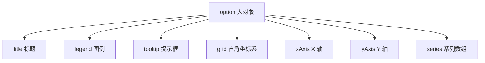

# ECharts 基础

> ECharts 是百度开源、现属 Apache 顶级项目的可视化库，
> 国产生态中最强大的图表工具，核心哲学是"一份 option 配置树描述一切"。

---

## 1. 定位：配置项驱动的全能图表库

- **Apache ECharts**：2013 年开源，2018 年进入 Apache 孵化，
  2021 年成为顶级项目，GitHub star 数长期居可视化类目第一梯队。
- **配置驱动**：不写渲染逻辑，只声明"我要什么"，库负责怎么画。
- **多端渲染**：默认 Canvas 渲染器，可切 SVG 渲染器（小程序等场景）。
- **系列丰富**：柱/折/饼/散点/K线/地图/热力/关系图/桑基图/3D……

与 Chart.js 的定位差异一句话概括：
Chart.js 是"够用的报表工具"，ECharts 是"什么都能画的可视化平台"。

---

## 2. 安装

### npm 安装

```bash
npm install echarts
```

### CDN 引入

```html
<script src="https://cdn.jsdelivr.net/npm/echarts@5/dist/echarts.min.js"></script>
```

### 按需引入（tree-shaking 减体积）

全量包约 1MB，生产环境强烈建议按需引入：

```js
import * as echarts from 'echarts/core';
import { BarChart, LineChart } from 'echarts/charts';
import {
  GridComponent,
  TooltipComponent,
  TitleComponent,
  LegendComponent
} from 'echarts/components';
import { CanvasRenderer } from 'echarts/renderers';

echarts.use([
  BarChart, LineChart,
  GridComponent, TooltipComponent, TitleComponent,
  LegendComponent, CanvasRenderer
]);

// 之后用 echarts.init / chart.setOption 与全量包完全一致
```

按需后通常能压到 300~400KB。缺组件的典型报错是
`Unknown component: xxx`，回来补 `use` 即可。

---

## 3. init 容器要求：必须指定宽高

这是 ECharts 第一坑：**init 的容器必须有确定的宽度和高度**
（不能由内容撑开），否则图表显示为空白或 100x100 小方块。

```html
<!-- 正确 -->
<div id="main" style="width: 600px; height: 400px;"></div>

<!-- 错误示范：没有高度，图出不来 -->
<div id="main"></div>
```

推荐用 CSS 类管理：

```css
.chart { width: 100%; height: 400px; }
```

---

## 4. setOption 配置式哲学

ECharts 的全部能力收敛在一个大对象上：



心智模型对比：

| 维度       | ECharts                    | Chart.js                    |
|------------|----------------------------|------------------------------|
| 模型       | 声明式配置树               | 类实例 + 方法                |
| 更新方式   | setOption 合并更新         | 改 data 再 update()          |
| 图表类型   | series[i].type             | 顶层 type 或 dataset.type    |
| 扩展方式   | 注册自定义系列/组件        | plugin 体系                  |

ECharts 里"图表类型"就是 series 的 type 属性——
一个 option 里放多个不同类型的 series 就成了混合图。

---

## 5. 第一个柱状图逐行解析

```html
<!DOCTYPE html>
<html lang="zh-CN">
<head>
<meta charset="UTF-8" />
<script src="https://cdn.jsdelivr.net/npm/echarts@5/dist/echarts.min.js"></script>
</head>
<body>

<div id="main" style="width: 640px; height: 400px;"></div>

<script>
  // 1. 初始化实例（绑定到有宽高的容器）
  const chart = echarts.init(document.getElementById('main'));

  // 2. 一份 option 描述整张图
  const option = {
    title: {
      text: '月度销量',
      subtext: '数据来源：示例',
      left: 'center'
    },
    tooltip: {
      trigger: 'axis'              // axis：悬停对齐整列
    },
    xAxis: {
      type: 'category',            // 类目轴
      data: ['一月', '二月', '三月', '四月', '五月', '六月']
    },
    yAxis: {
      type: 'value'                // 数值轴，自动算刻度
    },
    series: [
      {
        name: '销量',
        type: 'bar',               // 柱状图
        data: [320, 450, 280, 520, 410, 600],
        itemStyle: { color: '#3498db' },
        barWidth: '40%'
      }
    ]
  };

  // 3. 应用配置
  chart.setOption(option);
</script>

</body>
</html>
```

三行主流程：`init -> setOption`，就这两步。
后续任何变化都是再次 `setOption`（增量合并）或 `resize()`。

---

## 6. 四大件：title / legend / tooltip / grid

几乎所有直角坐标系图表都绕不开这四个配置块。

```js
const option = {
  title: {
    text: '销售分析',
    left: 'left',                 // 支持 'center'/'right' 或百分比
    textStyle: { fontSize: 16 }
  },
  legend: {
    data: ['线上', '线下'],       // 对应 series.name
    top: 28
  },
  tooltip: {
    trigger: 'axis',              // 'item' 只对单个图形生效
    axisPointer: { type: 'shadow' },
    valueFormatter: v => v + ' 万元'
  },
  grid: {
    left: '3%',
    right: '4%',
    bottom: '3%',
    containLabel: true            // 关键：轴标签也算进边距
  },
  xAxis: { type: 'category', data: ['Q1', 'Q2', 'Q3', 'Q4'] },
  yAxis: { type: 'value' },
  series: [
    { name: '线上', type: 'bar', data: [120, 200, 150, 230] },
    { name: '线下', type: 'bar', data: [90, 140, 120, 180] }
  ]
};
```

| 组件     | 职责                     | 高频坑                       |
|----------|--------------------------|------------------------------|
| title    | 主副标题                 | left 用百分比时注意与 grid 叠加 |
| legend   | 系列显隐切换             | data 必须匹配 series.name     |
| tooltip  | 悬停提示                 | trigger 选 item 还是 axis     |
| grid     | 直角坐标系绘图区         | 忘写 containLabel 标签被裁剪  |

一个页面多个坐标系时，grid/xAxis/yAxis 都是数组，
series 通过 `xAxisIndex/yAxisIndex` 挂载——这是下一章多图联动的地基。

---

## 7. 通用概念：系列、维度与数据集

### 7.1 series 即图表

series 数组里的每一项是一个"系列"（一组同类数据 + 渲染方式）。
两个系列可以类型不同：

```js
series: [
  { name: '销量', type: 'bar', data: [...] },
  { name: '利润率', type: 'line', yAxisIndex: 1, data: [...] }
]
```

### 7.2 常用轴类型

| xAxis/yAxis type | 含义       | data 形态              |
|------------------|------------|------------------------|
| category         | 类目轴     | 字符串数组             |
| value            | 数值轴     | 自动从 series 提取      |
| time             | 时间轴     | 时间戳或日期字符串     |
| log              | 对数轴     | 跨数量级数据           |

### 7.3 dataset 维度式数据源

除了每个 series 单独给 data，还可以用 dataset 集中管理
（详见 [[前端开发/06-数据可视化/ECharts/02-高级图表|高级图表]]）：

```js
dataset: {
  source: [
    ['月份', '销量', '利润'],
    ['一月', 320, 42],
    ['二月', 450, 58]
  ]
},
series: [
  { type: 'bar' },        // 默认取第 2 列
  { type: 'bar' }         // 默认取第 3 列
]
```

---

## 8. 与 Chart.js 心智差异

同样一张双系列柱状图的两库写法对照：

Chart.js（类实例）：

```js
const chart = new Chart(ctx, {
  type: 'bar',
  data: { labels, datasets: [{ label: '线上', data }] },
  options: { scales: { y: { beginAtZero: true } } }
});
chart.update();   // 数据变了这样刷新
```

ECharts（配置树）：

```js
const chart = echarts.init(el);
chart.setOption({
  xAxis: { type: 'category', data: labels },
  yAxis: { type: 'value' },
  series: [{ name: '线上', type: 'bar', data }]
});
chart.setOption(newOption);   // 数据变了直接再 setOption（合并）
```

三个关键差异：
1. **更新语义**：setOption 是深度合并——只传变化的字段即可；
   Chart.js 必须改实例上的 data 再调 update。
2. **布局职责**：ECharts 的 grid 管绘图区边距，
   Chart.js 用 layout padding，概念不同别混搭。
3. **扩展模型**：ECharts 一切皆组件/系列，可注册自定义；
   Chart.js 走 plugin 钩子。

---

## 9. 实战：双 Y 轴销量 + 利润率

销量是绝对值（万元），利润率是百分比（%），
量纲不同必须分轴。这是业务报表最经典的组合：

```html
<!DOCTYPE html>
<html lang="zh-CN">
<head>
<meta charset="UTF-8" />
<script src="https://cdn.jsdelivr.net/npm/echarts@5/dist/echarts.min.js"></script>
<style>
  body { font-family: sans-serif; background: #f0f2f5; margin: 0; padding: 24px; }
  .card {
    background: #fff; border-radius: 12px; padding: 18px;
    box-shadow: 0 1px 4px rgba(0,0,0,.08); max-width: 860px;
  }
  #dual-axis { width: 100%; height: 420px; }
</style>
</head>
<body>

<div class="card"><div id="dual-axis"></div></div>

<script>
  const chart = echarts.init(document.getElementById('dual-axis'));

  const option = {
    title: { text: '销量与利润率', left: 'center' },
    tooltip: {
      trigger: 'axis',
      axisPointer: { type: 'cross' }     // 十字指示器同时标两轴
    },
    legend: { data: ['销量', '利润率'], top: 30 },
    grid: { top: 90, left: 60, right: 60, bottom: 40 },

    // 两根 Y 轴
    yAxis: [
      {
        type: 'value',
        name: '销量（万元）',
        position: 'left',
        axisLine: { show: true }
      },
      {
        type: 'value',
        name: '利润率（%）',
        position: 'right',
        min: 0,
        max: 30,
        axisLabel: { formatter: '{value}%' },
        splitLine: { show: false }       // 右轴不画网格线避免打架
      }
    ],
    xAxis: {
      type: 'category',
      data: ['Q1', 'Q2', 'Q3', 'Q4']
    },
    series: [
      {
        name: '销量',
        type: 'bar',
        yAxisIndex: 0,                   // 挂左轴
        data: [320, 450, 520, 610],
        itemStyle: { color: '#3498db' }
      },
      {
        name: '利润率',
        type: 'line',
        yAxisIndex: 1,                   // 挂右轴
        smooth: true,
        symbolSize: 8,
        data: [12, 15, 14, 18],
        itemStyle: { color: '#e67e22' },
        label: { show: true, formatter: '{c}%' }
      }
    ]
  };

  chart.setOption(option);

  // 容器尺寸变化时必须手动 resize
  window.addEventListener('resize', () => chart.resize());
</script>

</body>
</html>
```

本例新知识点：

| 配置                       | 说明                                   |
|----------------------------|----------------------------------------|
| `yAxis` 写数组             | 多轴声明；series 用 yAxisIndex 挂载    |
| `splitLine.show: false`    | 双轴只保留一套网格线                   |
| `axisPointer.cross`        | 十字准星同时读两轴数值                 |
| `label.formatter`          | 数据点常显标签                         |
| `window.resize 监听`       | ECharts 不自动响应容器变化             |

最后一条尤其重要：与 Chart.js 内置 ResizeObserver 不同，
**ECharts 的 resize 永远要自己调**，交互与响应式的完整方案
见 [[前端开发/06-数据可视化/ECharts/03-交互与响应式|交互与响应式]]。

---

## 小结

- init 前容器必须有宽高，否则图不出来。
- 一切配置进 option：title/legend/tooltip/grid 四大件打底。
- 图表类型 = series.type，混合图就是多类型 series 共存。
- setOption 是增量合并的声明式更新，与 Chart.js 的 update 模型不同。
- 双 Y 轴 = yAxis 数组 + yAxisIndex，注意关掉副轴 splitLine。
