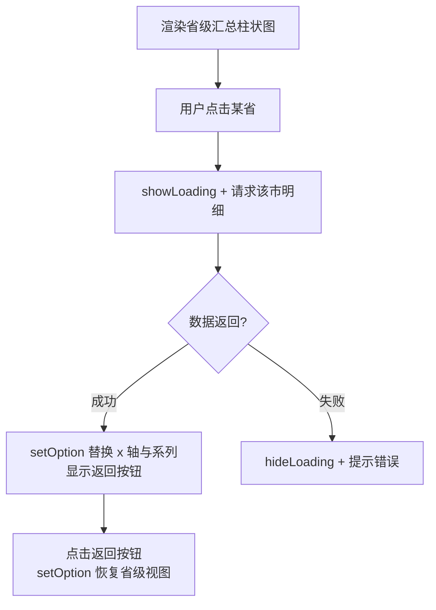

# ECharts 交互与响应式

> 图表不只是"看"，还要能点、能缩放、能联动。
> 本章讲事件系统、程序化触发、多图联动、resize 正确姿势与大数据优化。

---

## 1. 事件系统 chart.on

ECharts 实例上用 `chart.on(eventName, handler)` 监听交互：

```js
chart.on('click', params => {
  // params 携带被点击图形的完整信息
  console.log(params.seriesName);   // 系列名
  console.log(params.name);         // 类目名
  console.log(params.value);        // 数值
  console.log(params.dataIndex);    // 数据下标
});
```

常用事件一览：

| 事件                   | 触发时机                     |
|------------------------|------------------------------|
| `click` / `dblclick`   | 点击图形元素                 |
| `mouseover` / `mouseout` | 悬停进入/离开              |
| `legendselectchanged`  | 图例切换显隐（注意拼写）     |
| `datazoom`             | 缩放窗口变化                 |
| `brushselected`        | 框选                         |

只想监听某个系列的点击：

```js
chart.on('click', 'series.bar.sales', params => {
  goDrillDown(params.name);
});
// query 参数格式：'series.类型.名称' 或 { seriesIndex: n }
```

### legendselectchanged：监听图例切换

```js
chart.on('legendselectchanged', params => {
  // params.selected 形如 { 销量: true, 利润率: false }
  syncOtherChart(params.selected);
});
```

这个事件是"图例状态变化"的唯一入口，
跨图同步显隐全靠它。

---

## 2. 点击下钻典型模式

从全国到省到市的层级下钻，是地图和柱状图的经典交互。



代码骨架（下一节实战补完）：

```js
let currentLevel = 'province';

chart.on('click', params => {
  if (currentLevel === 'province') {
    drillToCity(params.name);
  }
});

function drillToCity(province) {
  chart.showLoading({ text: '加载中...' });

  fetch(`/api/cities?province=${encodeURIComponent(province)}`)
    .then(r => r.json())
    .then(data => {
      chart.hideLoading();
      chart.setOption({
        xAxis: { data: data.cities },
        series: [{ data: data.values }],
        title: { text: `${province} 各市销量` }
      });
      currentLevel = 'city';
      backButton.style.display = 'inline-block';
    })
    .catch(() => {
      chart.hideLoading();
      alert('加载失败');
    });
}
```

要点：
- **setOption 增量合并**——只传变化的 x 轴数据和标题即可。
- 下钻请求期间 `showLoading` 给出反馈，避免"点了没反应"。
- 维护一个 level 状态机，防止在下钻层重复触发省级逻辑。

---

## 3. dispatchAction：程序化触发

事件是"用户操作 -> JS 感知"，dispatchAction 反过来
"JS 模拟操作 -> 图表表现"：

```js
// 程序化显示第 2 个数据点的 tooltip 并高亮
chart.dispatchAction({ type: 'showTip', seriesIndex: 0, dataIndex: 2 });
chart.dispatchAction({ type: 'highlight', seriesIndex: 0, dataIndex: 2 });

// 隐藏
chart.dispatchAction({ type: 'hideTip' });
chart.dispatchAction({ type: 'downplay', seriesIndex: 0, dataIndex: 2 });

// 程序化缩放
chart.dispatchAction({
  type: 'dataZoom',
  startValue: 'D10',
  endValue: 'D20'
});
```

典型用途：
- 轮播大屏：定时器循环 showTip，制造自动巡检效果。
- 表格联动：hover 表格行时高亮图表对应元素。
- 播放动画：按时间轴推进 dataZoom。

---

## 4. connect：多图联动

一行代码把多个实例连成一组，tooltip、dataZoom、图例全部同步：

```js
const chart1 = echarts.init(el1);
const chart2 = echarts.init(el2);
echarts.connect([chart1, chart2]);      // 或 connect(groupName)
```

之后悬停 chart1 的某列，chart2 同位置的 tooltip 同时弹出；
任意图上缩放，另一张跟随。适合"同一份数据的多个视角"
（如价格走势 + 成交量）并排展示的场景。

---

## 5. resize 正确姿势

ECharts 实例不会自动跟随容器尺寸，必须手动调 resize。

### 方案一：window resize 监听（基础）

```js
window.addEventListener('resize', () => chart.resize());
```

问题：只能感知窗口变化。容器因侧边栏折叠而变宽时不会触发。

### 方案二：ResizeObserver 容器感知（推荐）

```js
const ro = new ResizeObserver(() => chart.resize());
ro.observe(chart.getDom());
```

ResizeObserver 的完整原理与更多应用见
[[前端开发/04-DOM与交互/HTML-DOM/03-DOM高级：MutationObserver|DOM 高级：MutationObserver]]。

### 封装成通用函数

```js
function createChart(el, option) {
  const chart = echarts.init(el);
  chart.setOption(option);

  const ro = new ResizeObserver(() => chart.resize());
  ro.observe(el);

  // 返回销毁函数，组件卸载时调用
  return () => {
    ro.disconnect();
    chart.dispose();
  };
}
```

**注意防抖**：resize 连续触发时会频繁重绘，拖拽窗口时可加节流：

```js
let timer;
new ResizeObserver(() => {
  clearTimeout(timer);
  timer = setTimeout(() => chart.resize(), 100);
}).observe(chart.getDom());
```

---

## 6. 大数据渲染优化

几万个点直接渲染会卡，三招应对：

```js
series: [{
  type: 'line',
  large: true,               // 大数据模式：合并绘制路径
  sampling: 'lttb',          // 降采样：保留视觉形状抽稀数据
  data: hugeArray
}]
```

| 手段            | 原理                             | 适用                     |
|-----------------|----------------------------------|--------------------------|
| `large: true`   | 关闭逐点样式，整体批量绘制       | 十万级 scatter/line      |
| `sampling`      | LTTB 抽稀，视觉形状不变          | 时间序列折线             |
| `appendData`    | 增量追加数据不整幅重绘           | 流式加载超大数据集       |

```js
// appendData 用法：首次 setOption 后分批喂入
chart.setOption({ xAxis: {...}, yAxis: {...},
                  series: [{ type: 'scatter', data: firstBatch }] });
chart.appendData({ seriesIndex: 0, data: nextBatch });
```

另外两个通用建议：
- 数据量超过几千后考虑 `useDirtyRect: true`（init 参数）减少重绘面积。
- 动画关闭可显著提速：`animation: false`。

---

## 7. 主题注册与暗黑模式

### 内置暗黑主题

```js
const chart = echarts.init(el, 'dark');   // 第二参数传主题名
```

### 自定义注册主题

```js
echarts.registerTheme('corporate', {
  color: ['#3498db', '#2ecc71', '#f39c12', '#e74c3c', '#9b59b6'],
  backgroundColor: '#fafafa',
  textStyle: { fontFamily: 'sans-serif' },
  title: { textStyle: { fontWeight: 'normal' } },
  legend: { textStyle: { color: '#666' } }
});

// 使用
const chart = echarts.init(el, 'corporate');
```

注意：**主题在 init 时绑定，切换主题只能 dispose 后重新 init**：

```js
function switchTheme(chart, el, themeName) {
  const option = chart.getOption();     // 先保存配置
  chart.dispose();
  return echarts.init(el, themeName).setOption(option);
}
```

配合 CSS 变量与 `prefers-color-scheme` 媒体查询，
可以做出跟随系统的完整暗黑方案。

---

## 8. 实战：可下钻的销售大屏主图（省 -> 市）

```html
<!DOCTYPE html>
<html lang="zh-CN">
<head>
<meta charset="UTF-8" />
<script src="https://cdn.jsdelivr.net/npm/echarts@5/dist/echarts.min.js"></script>
<style>
  body {
    font-family: sans-serif;
    margin: 0; padding: 24px;
    background: #0d1424;
    color: #dbe4ff;
  }
  .panel { max-width: 880px; }
  .head {
    display: flex; justify-content: space-between; align-items: center;
    margin-bottom: 10px;
  }
  h1 { font-size: 18px; margin: 0; }
  #back {
    display: none;
    background: transparent;
    border: 1px solid #3b4a6b;
    color: #9fb3d8;
    border-radius: 6px;
    padding: 4px 14px;
    cursor: pointer;
  }
  #main { width: 100%; height: 480px; }
</style>
</head>
<body>

<div class="panel">
  <div class="head">
    <h1 id="title">各省销量总览</h1>
    <button id="back">返回全国</button>
  </div>
  <div id="main"></div>
</div>

<script>
  // ---- 模拟数据 ----
  const provinceData = [
    ['广东', 820], ['江苏', 640], ['浙江', 590],
    ['山东', 430], ['四川', 380], ['河南', 320]
  ];
  const cityDB = {
    '广东': [['深圳', 310], ['广州', 260], ['东莞', 140], ['佛山', 110]],
    '江苏': [['南京', 240], ['苏州', 220], ['无锡', 180]],
    '浙江': [['杭州', 300], ['宁波', 180], ['温州', 110]],
    '山东': [['青岛', 210], ['济南', 150], ['烟台', 70]],
    '四川': [['成都', 290], ['绵阳', 90]],
    '河南': [['郑州', 230], ['洛阳', 90]]
  };

  const el = document.getElementById('main');
  const chart = echarts.init(el, 'dark');

  function baseOption() {
    return {
      backgroundColor: 'transparent',
      tooltip: { trigger: 'axis', axisPointer: { type: 'shadow' } },
      grid: { left: 60, right: 30, top: 40, bottom: 40,
              containLabel: true },
      xAxis: { type: 'value' },
      yAxis: {
        type: 'category',
        inverse: true,                 // 大值在上
        axisLabel: { fontSize: 13 }
      },
      series: [{
        type: 'bar',
        barWidth: '52%',
        itemStyle: {
          borderRadius: [0, 8, 8, 0],
          color: new echarts.graphic.LinearGradient(0, 0, 1, 0, [
            { offset: 0, color: '#2b5876' },
            { offset: 1, color: '#4e9dd6' }
          ])
        },
        label: { show: true, position: 'right' }
      }]
    };
  }

  function render(list, title) {
    document.getElementById('title').textContent = title;
    chart.setOption({
      yAxis: { data: list.map(d => d[0]) },
      series: [{ data: list.map(d => d[1]) }]
    });
  }

  chart.setOption(baseOption());
  render(provinceData, '各省销量总览');

  // ---- 下钻 ----
  let level = 'province';
  chart.on('click', params => {
    if (level !== 'province') return;
    const cities = cityDB[params.name];
    if (!cities) return;               // 无下级数据则忽略

    level = 'city';
    render(cities, `${params.name} 各市销量`);
    document.getElementById('back').style.display = 'inline-block';
  });

  document.getElementById('back').addEventListener('click', () => {
    level = 'province';
    render(provinceData, '各省销量总览');
    document.getElementById('back').style.display = 'none';
  });
</script>

</body>
</html>
```

实现要点：
- 横向条形图（value 轴 + inverse 的 category 轴）是大屏排行榜标准形态。
- 下钻只更新 yAxis.data 与 series.data 两处，option 骨架不动。
- back 按钮与 level 状态构成完整的层级状态机。
- 生产环境把 cityDB 换成接口请求，配 showLoading。

---

## 小结

- chart.on 监听用户操作，dispatchAction 反向驱动图表表现。
- legendselectchanged 是图例联动跨图同步的唯一入口。
- connect 一行让多实例 tooltip/dataZoom 全同步。
- resize 用 ResizeObserver 观察容器而非 window，记得节流与销毁。
- 大数据三板斧：large、sampling、appendData；主题切换必须重 init。
