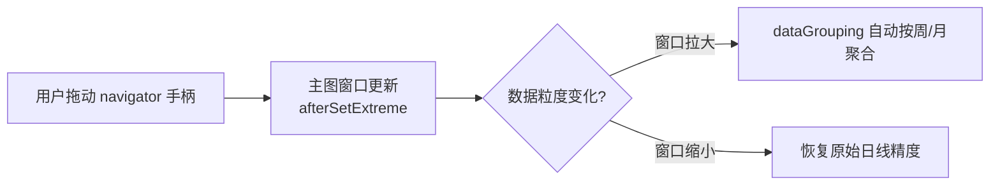
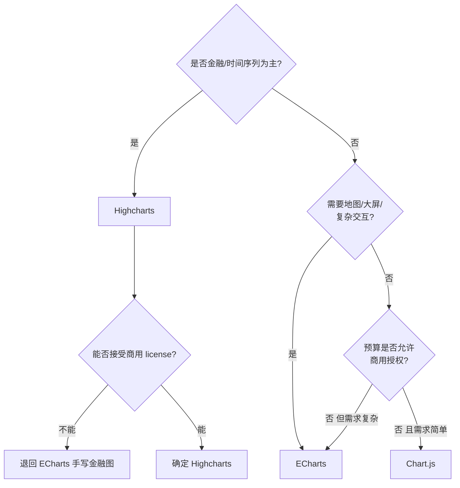

# Highcharts 实战

> 进阶与选型收尾：Stock Tools 金融工具栏、动态数据、原生 drilldown
> 对比 ECharts 手写下钻、主题定制，以及三库终局决策表。

---

## 1. Stock Tools 金融工具栏

引入 `stock-tools` 模块后，图表顶部会出现一套专业工具栏：

```html
<script src="https://code.highcharts.com/stock/highstock.js"></script>
<script src="https://code.highcharts.com/stock/modules/exporting.js"></script>
<script src="https://code.highcharts.com/stock/modules/stock-tools.js"></script>
<link rel="stylesheet"
      href="https://code.highcharts.com/css/stocktools/gui.css" />
<link rel="stylesheet"
      href="https://code.highcharts.com/css/highcharts.css" />
```

免费获得的能力：画线标注（趋势线/水平线）、斐波那契回调、
指标叠加（SMA/EMA/Bollinger）、标注文本框。
这些在 ECharts 里都要自己实现或买商业插件。

---

## 2. highstock navigator 底部缩略图

navigator 是 Highstock 的标志性组件——底部缩略图 + 拖动手柄：

```js
Highcharts.stockChart('container', {
  navigator: {
    enabled: true,               // 默认开启
    height: 60,
    maskFill: 'rgba(80, 140, 220, .25)'
  },
  scrollbar: { enabled: true }, // 右侧滚动条，可关
  series: [{ name: '价格', data: priceData }]
});
```

交互模型：



dataGrouping 完全自动，无需任何配置——
这就是金融库与通用库的差距所在。

---

## 3. 动态数据：addPoint 与 setData

### addPoint：实时追加（轮询模拟）

```js
const chart = Highcharts.stockChart('container', {
  title: { text: '实时监控' },
  time: { useUTC: false },
  series: [{
    name: 'QPS',
    data: (function () {
      const data = [], t = Date.now();
      for (let i = -29; i <= 0; i++) {
        data.push([t + i * 1000, Math.round(200 + Math.random() * 80)]);
      }
      return data;
    })()
  }]
});

// 每 2 秒推一个新点，并保持窗口最多 30 个点
setInterval(() => {
  const series = chart.series[0];
  const x = Date.now();
  const y = Math.round(200 + Math.random() * 80);
  const shift = series.data.length > 30;   // 超长则移除最旧点
  series.addPoint([x, y], true, shift);
}, 2000);
```

| 方法         | 行为                       | 适用                     |
|--------------|----------------------------|--------------------------|
| `addPoint`   | 增量加一个点，动画平滑     | 实时推送场景             |
| `setData`    | 整体替换数据数组           | 切换维度/全量刷新        |

注意 addPoint 的第三个参数 shift：为 true 时移除队首旧点，
实现滑动窗口。这与 ECharts 里手动 concat + shift 再 setOption
（见 [[前端开发/06-数据可视化/ECharts/04-ECharts实战|ECharts 实战]]）
是同一模式，但 API 更直接。

---

## 4. drilldown 原生下钻 vs ECharts 手写

Highcharts 的 drilldown 模块把"点击进入下一层"做成了声明式配置。

```html
<script src="https://code.highcharts.com/modules/drilldown.js"></script>
```

```js
Highcharts.chart('dd', {
  chart: { type: 'column' },
  title: { text: '销售区域下钻' },
  xAxis: { type: 'category' },

  series: [{
    name: '区域销量',
    colorByPoint: true,
    data: [
      { name: '华南', y: 820,
        drilldown: 'south' },          // 点击后进入 id=south 的层
      { name: '华东', y: 640,
        drilldown: 'east' }
    ]
  }],

  drilldown: {
    breadcrumbs: { showFullPath: false },   // 面包屑返回导航
    series: [
      { id: 'south', name: '华南各省',
        data: [['广东', 420], ['广西', 230], ['海南', 170]] },
      { id: 'east', name: '华东各省',
        data: [['江苏', 310], ['浙江', 210], ['上海', 120]] }
    ]
  }
});
```

对比上一章 ECharts 的手写下钻
（[[前端开发/06-数据可视化/ECharts/03-交互与响应式|交互与响应式]] 第 8 节）：

| 环节           | Highcharts            | ECharts                    |
|----------------|-----------------------|-----------------------------|
| 下级数据绑定   | drilldown.id 声明     | 自己维护状态机 + setOption  |
| 返回导航       | 面包屑内置            | 自己做 back 按钮            |
| 动画过渡       | 内置                  | 需自行处理                  |
| 异步加载下层   | 支持（函数形式）      | fetch 后手动 setOption      |

ECharts 的手写方式更灵活（可以任意改造视图），
但常规层级下钻 Highcharts 十行搞定——省事程度肉眼可见。

---

## 5. 主题定制

### 全局默认 setOptions

```js
// 必须在所有图表创建之前执行
Highcharts.setOptions({
  colors: ['#3498db', '#2ecc71', '#f39c12',
           '#e74c3c', '#9b59b6', '#1abc9c'],
  chart: {
    backgroundColor: '#fafbfc',
    style: { fontFamily: 'sans-serif' }
  },
  lang: {
    // 中文化内置文案
    downloadPNG: '下载 PNG',
    downloadCSV: '导出 CSV',
    viewFullscreen: '全屏'
  },
  tooltip: { backgroundColor: '#fff', borderColor: '#ddd' }
});
```

### highcharts.css 微调

引入官方 CSS 后可用普通样式覆盖图形外观（v10+ 支持样式表定制）：

```css
/* 高亮十字线与轴文字 */
.highcharts-axis-title { fill: #666; font-size: 12px; }
.highcharts-credits { display: none; }
```

主题策略与 ECharts 的 registerTheme 类似，
区别在于 ECharts 换主题要 dispose 重 init
（见 [[前端开发/06-数据可视化/ECharts/03-交互与响应式|主题注册一节]]），
Highcharts 的 setOptions 对后续创建的实例直接生效。

---

## 7. 实战：单文件实时监控页

把 navigator、addPoint 轮询、drilldown、导出组合进一个可运行页面：

```html
<!DOCTYPE html>
<html lang="zh-CN">
<head>
<meta charset="UTF-8" />
<title>服务监控</title>
<script src="https://code.highcharts.com/highcharts.js"></script>
<script src="https://code.highcharts.com/modules/exporting.js"></script>
<style>
  body { font-family: sans-serif; background: #f0f2f5;
         margin: 0; padding: 24px; }
  .grid {
    display: grid;
    grid-template-columns: repeat(auto-fit, minmax(420px, 1fr));
    gap: 20px; max-width: 1100px; margin: auto;
  }
  .card {
    background: #fff; border-radius: 12px; padding: 14px;
    box-shadow: 0 1px 4px rgba(0,0,0,.08);
  }
  .card h2 { font-size: 14px; margin: 0 0 8px; color: #444; }
  .rt { height: 280px; }
  .dd { height: 320px; }
</style>
</head>
<body>

<div class="grid">
  <div class="card">
    <h2>集群 QPS（2s 刷新）</h2>
    <div id="realtime" class="rt"></div>
  </div>
  <div class="card">
    <h2>机房流量分布（点击下钻主机）</h2>
    <div id="drill" class="dd"></div>
  </div>
</div>

<script>
  // ---- 图一：轮询实时曲线 ----
  const rtChart = Highcharts.chart('realtime', {
    title: { text: null },
    time: { useUTC: false },
    yAxis: { title: { text: 'QPS' } },
    legend: { enabled: false },
    series: [{
      type: 'area',
      name: 'QPS',
      fillColor: 'rgba(52, 152, 219, .15)',
      data: (function () {
        const d = [], t = Date.now();
        for (let i = -29; i <= 0; i++) {
          d.push([t + i * 2000, Math.round(300 + Math.random() * 120)]);
        }
        return d;
      })()
    }]
  });

  setInterval(() => {
    const s = rtChart.series[0];
    s.addPoint([Date.now(), Math.round(300 + Math.random() * 120)],
               true, s.data.length > 30);
  }, 2000);

  // ---- 图二：声明式下钻 ----
  Highcharts.chart('drill', {
    chart: { type: 'column' },
    title: { text: null },
    xAxis: { type: 'category' },
    credits: { enabled: false },
    plotOptions: {
      series: { colorByPoint: true, borderWidth: 0 }
    },
    series: [{
      name: '流量',
      data: [
        { name: '北京机房', y: 520, drilldown: 'bj' },
        { name: '上海机房', y: 480, drilldown: 'sh' }
      ]
    }],
    drilldown: {
      breadcrumbs: { position: { align: 'right' } },
      series: [
        { id: 'bj', name: '北京主机',
          data: [['web-01', 210], ['web-02', 180], ['db-01', 130]] },
        { id: 'sh', name: '上海主机',
          data: [['web-01', 240], ['cache-01', 240]] }
      ]
    },
    exporting: { buttons: { contextButton: {
      menuItems: ['downloadPNG', 'downloadCSV'] } } }
  });
</script>

</body>
</html>
```

这个页面演示了四个要点协同工作：
1. **Grid 自适应两列**，窄屏自动叠为单列。
2. **addPoint + shift** 维持 30 点滑动窗口，无需手动 concat。
3. **声明式下钻**零状态机代码，面包屑自动出现在右上角。
4. **exporting 精简菜单**只留 PNG 与 CSV 两项。

保存为 html 直接打开即可运行。

---

## 8. Angular / Vue 封装

官方维护了框架 wrapper，以 Vue 为例：

```bash
npm install highcharts highcharts-vue
```

```js
// main.js
import Vue from 'vue';
import Highcharts from 'highcharts';
import stockInit from 'highcharts/modules/stock';
import HighchartsVue from 'highcharts-vue';

stockInit(Highcharts);
Vue.use(HighchartsVue);
```

```vue
<template>
  <highchart :options="chartOptions" style="height: 400px" />
</template>

<script>
export default {
  data() {
    return {
      chartOptions: {
        title: { text: '月度销量' },
        series: [{ name: '销量', data: [320, 450, 280] }]
      }
    };
  }
};
</script>
```

Angular 同理用 `highcharts-angular` 包：
`<highcharts-chart [Highcharts]="Highcharts" [options]="options">`。
wrapper 只做挂载与销毁，options 结构与纯 JS 完全一致——
学习成本为零的封装哲学。

---

## 9. 三库终局对比决策表

| 维度         | Chart.js              | ECharts                | Highcharts             |
|--------------|-----------------------|------------------------|------------------------|
| 一句话定位   | 轻快报表              | 大屏全能               | 金融成熟               |
| 渲染方式     | Canvas                | Canvas/SVG 可选        | SVG                    |
| 体积(gzip)   | 约 70KB               | 约 1MB(可裁到 400KB)   | 约 300KB+模块          |
| 图表种类     | 8 种                  | 数十种+地理/3D         | 常规+金融全套          |
| 时间序列     | 一般                  | 良好                   | 业界最强               |
| 下钻能力     | 无                    | 手写                   | 原生声明式             |
| 导出         | toBase64Image 手动    | 需自配或后端渲染        | exporting 模块内置     |
| 中文文档     | 社区翻译              | 官方一流               | 官方完整英文+范例      |
| 授权协议     | MIT                   | Apache 2.0             | 商业双协议(非商用免费) |
| 商用成本     | 零                    | 零                     | 可能需购买 license     |

授权协议重点提示（商用必看）：

- **Chart.js：MIT**——随便用，闭源商用无任何义务。
- **ECharts：Apache 2.0**——商用友好，保留版权声明即可。
- **Highcharts：专有双协议**——个人项目/学校/非营利组织免费，
  企业商用需购买 license，违规使用有法律风险。
  选它之前先问财务能不能报销。

### 选型流程



最终建议浓缩成三句：
- 后台报表、移动端小图：Chart.js，最快最轻。
- 国内项目、监控大屏、复杂可视化：ECharts 默认答案。
- 金融行情、专业分析终端：Highcharts，先确认授权预算。

---

## 小结

- Stock Tools 免费送画线与指标工具栏，金融页面的护城河。
- addPoint 增量 + shift 滑窗是实时图的固定写法。
- drilldown 声明式下钻含面包屑，比 ECharts 手写省一个量级。
- 全局主题走 setOptions，lang 字段顺手中文化按钮文案。
- 选型先看协议：MIT / Apache 2.0 免费，Highcharts 商用要钱。
