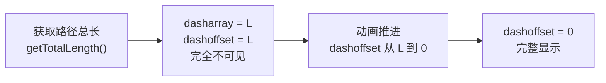
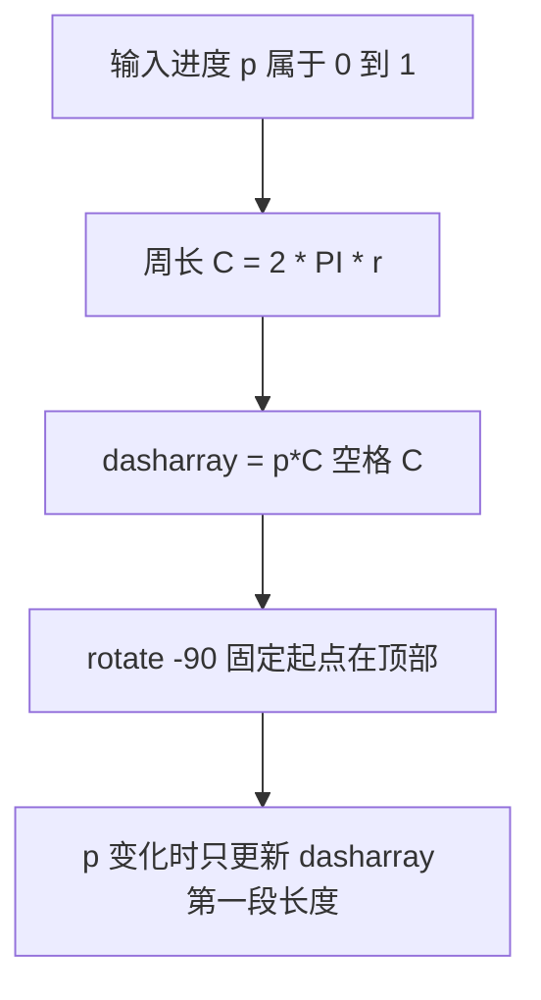

# SVG 动画

> SVG 的每个图形都是 DOM 节点，因此 CSS、SMIL、JS 三条动画路线全部可用。
> 本章重点讲清一个精髓：stroke-dasharray + stroke-dashoffset 描边动画。

---

## 1. CSS 动画作用于 SVG

内联 SVG 的元素和普通 HTML 元素一样接受 CSS 控制。
transition 和 keyframes 都能操作 `transform`、`fill`、`opacity` 等属性。

### 1.1 transition 过渡

```html
<!DOCTYPE html>
<html lang="zh-CN">
<head>
<meta charset="UTF-8" />
<style>
  .dot {
    fill: #3498db;
    transition: fill 0.3s, transform 0.3s;
    cursor: pointer;
  }
  .dot:hover {
    fill: #e74c3c;
    transform: scale(1.3);
  }
</style>
</head>
<body>
<svg width="200" height="100" viewBox="0 0 200 100">
  <circle class="dot" cx="60" cy="50" r="24" />
  <rect class="dot" x="120" y="26" width="48" height="48"
        style="transform-box: fill-box; transform-origin: center;" />
</svg>
</body>
</html>
```

### 1.2 关键陷阱：transform-origin 的差异

普通 HTML 元素的 `transform: scale(1.3)` 默认绕自身中心；
但 **SVG 元素默认绕整个 SVG 画布的左上角 (0,0)** 变换，
一缩放就飞出视野。两种解法：

```css
/* 解法一（现代浏览器推荐） */
.svg-el {
  transform-box: fill-box;      /* 参照系改为元素自身的包围盒 */
  transform-origin: center;     /* 再取中心 */
}

/* 解法二：直接用属性写死旋转中心 */
/* <rect ... transform="rotate(45 144 50)" /> */
```

`transform-box` 是理解 SVG + CSS 动画的第一课：
- `view-box`（默认）：参照整个 svg 视图框
- `fill-box`：参照元素自己的几何包围盒

### 1.3 keyframes 帧动画

```css
@keyframes pulse {
  0%   { opacity: 1;   transform: scale(1); }
  50%  { opacity: 0.4; transform: scale(1.15); }
  100% { opacity: 1;   transform: scale(1); }
}
.pulse-circle {
  animation: pulse 1.6s ease-in-out infinite;
  transform-box: fill-box;
  transform-origin: center;
}
```

```html
<svg width="120" height="120" viewBox="0 0 120 120">
  <circle class="pulse-circle" cx="60" cy="60" r="40" fill="#9b59b6" />
</svg>
```

---

## 2. SMIL 原生动画

SMIL 是 SVG 自带的声明式动画机制。虽然已被标记为边缘技术且不再扩展新特性，
但它**零依赖**，写在纯 svg 文件里也能动——img 引入的 svg 想有动画只能靠它。

### 2.1 animate：动画任意属性

```html
<svg width="300" height="100" viewBox="0 0 300 100">
  <!-- 圆半径呼吸 -->
  <circle cx="60" cy="50" r="20" fill="#e67e22">
    <animate attributeName="r"
             values="20;28;20" dur="1.5s"
             repeatCount="indefinite" />
  </circle>

  <!-- 颜色循环 -->
  <rect x="130" y="25" width="50" height="50" fill="#2980b9">
    <animate attributeName="fill"
             values="#2980b9;#8e44ad;#2980b9"
             dur="3s" repeatCount="indefinite" />
  </rect>

  <!-- 位置往返 -->
  <circle cx="250" cy="50" r="14" fill="#27ae60">
    <animate attributeName="cy"
             values="30;70;30" dur="2s"
             repeatCount="indefinite" />
  </circle>
</svg>
```

核心属性：
- `attributeName`：要动的属性名
- `values`：关键帧序列（分号分隔），或用 `from/to`
- `dur`：单次时长；`repeatCount="indefinite"` 无限循环
- `begin="0s"` / `begin="click"`：可绑定事件延迟启动

### 2.2 animateTransform：动画变换

```html
<svg width="150" height="150" viewBox="0 0 150 150">
  <g>
    <rect x="55" y="55" width="40" height="40" fill="#c0392b" />
    <animateTransform attributeName="transform"
                      type="rotate"
                      from="0 75 75" to="360 75 75"
                      dur="4s" repeatCount="indefinite" />
  </g>
</svg>
```

注意 rotate 的旋转中心参数直接写在 from/to 里（这里是画布中心 75,75），
不需要 transform-origin。

---

## 3. JS 驱动：requestAnimationFrame

需要精确逻辑控制（如跟随数据变化）时，用 rAF 每帧更新属性：

```html
<!DOCTYPE html>
<html lang="zh-CN">
<head><meta charset="UTF-8" /></head>
<body>
<svg id="scene" width="400" height="100" viewBox="0 0 400 100">
  <circle id="ball" cx="20" cy="50" r="16" fill="#16a085" />
</svg>

<script>
  const ball = document.getElementById('ball');
  let t = 0;
  function tick() {
    t += 0.02;
    ball.setAttribute('cx', 20 + ((t * 100) % 340));
    ball.setAttribute('cy', 50 + Math.sin(t * 6) * 28);
    requestAnimationFrame(tick);
  }
  requestAnimationFrame(tick);
</script>
</body>
</html>
```

要点：SVG 的几何属性没有布局引擎参与，直接 setAttribute 改
cx/cy/r 就是最高效路径；批量更新时把写操作合并在同一帧内完成。

---

## 4. 路径动画精髓：描边效果

这是 SVG 动画最经典的效果——让线条像被笔画出来一样生长。

### 4.1 原理

两个属性配合：

- `stroke-dasharray`：把线切成"实线段 + 空白段"的虚线
- `stroke-dashoffset`：虚线的起始偏移量

技巧在于：**把 dasharray 设成与路径总长一样大**，
此时路径上只有一段实线。然后从"偏移 = 总长"（实线完全移出，看不见）
过渡到"偏移 = 0"（实线完整覆盖路径），视觉上就是线条被画出来。



### 4.2 CSS 版描边（签名动画）

```html
<!DOCTYPE html>
<html lang="zh-CN">
<head>
<meta charset="UTF-8" />
<style>
  .draw-path {
    fill: none;
    stroke: #2c3e50;
    stroke-width: 3;
    stroke-linecap: round;
    stroke-dasharray: 600;
    stroke-dashoffset: 600;
    animation: draw 3s ease forwards;
  }
  @keyframes draw {
    to { stroke-dashoffset: 0; }
  }
</style>
</head>
<body>
<svg width="320" height="140" viewBox="0 0 320 140">
  <path class="draw-path"
        d="M 20 110 C 80 -10, 140 190, 190 70 S 280 20, 300 90" />
</svg>
</body>
</html>
```

dasharray 的值只要大于等于路径总长即可。精确做法是 JS 里
`path.getTotalLength()` 后动态设置，再触发动画类名。

### 4.3 Loading 圈

```html
<svg width="80" height="80" viewBox="0 0 80 80">
  <circle cx="40" cy="40" r="30" fill="none"
          stroke="#dfe6e9" stroke-width="8" />
  <circle cx="40" cy="40" r="30" fill="none"
          stroke="#0984e3" stroke-width="8" stroke-linecap="round"
          stroke-dasharray="47 141.4"
          transform="rotate(-90 40 40)">
    <animateTransform attributeName="transform"
                      type="rotate"
                      from="0 40 40" to="360 40 40"
                      dur="1.2s" repeatCount="indefinite" />
  </circle>
</svg>
```

周长 = 2 * PI * 30 约 188.5。dasharray "47 141.4" 表示实线约四分之一圈，
其余空白，再整体旋转即成 spinner。

### 4.4 进度环数据流



morph 变形一句带过：对 polygon 的 points 做 JS 插值——两组点数相同，
逐点做线性插值 lerp，每帧重写 points 属性即可实现形状渐变；
复杂 path morph 的插值细节建议交给 GSAP 等成熟库处理。

---

## 5. 实战：描边进度圆环组件

综合运用 getTotalLength、CSS 过渡与 JS 属性控制，做一个可复用的进度环：

```html
<!DOCTYPE html>
<html lang="zh-CN">
<head>
<meta charset="UTF-8" />
<style>
  body {
    font-family: sans-serif;
    display: flex;
    gap: 40px;
    justify-content: center;
    padding-top: 60px;
    background: #f5f6fa;
  }
  .ring { position: relative; width: 160px; height: 160px; }
  .ring svg { width: 100%; height: 100%; transform: rotate(-90deg); }
  .ring .track { fill: none; stroke: #dcdde1; stroke-width: 12; }
  .ring .bar {
    fill: none; stroke: #00a8ff; stroke-width: 12;
    stroke-linecap: round;
    transition: stroke-dashoffset 1s ease;
  }
  .ring .label {
    position: absolute; inset: 0;
    display: flex; align-items: center; justify-content: center;
    font-size: 28px; color: #2f3640; font-weight: bold;
  }
</style>
</head>
<body>

<div class="ring" data-progress="72"></div>
<div class="ring" data-progress="45"></div>
<div class="ring" data-progress="93"></div>

<script>
  function createRing(container) {
    const progress = parseFloat(container.dataset.progress) / 100;

    container.innerHTML =
      '<svg viewBox="0 0 120 120">' +
      '  <circle class="track" cx="60" cy="60" r="50"/>' +
      '  <circle class="bar"   cx="60" cy="60" r="50"/>' +
      '</svg>' +
      '<div class="label">0%</div>';

    const bar = container.querySelector('.bar');
    const label = container.querySelector('.label');

    // 关键一步：用真实路径长度初始化虚线
    const len = bar.getTotalLength();
    bar.style.strokeDasharray = len;
    bar.style.strokeDashoffset = len;

    // 双 rAF 保证初始态先渲染，再触发过渡
    requestAnimationFrame(() => {
      requestAnimationFrame(() => {
        bar.style.strokeDashoffset = len * (1 - progress);
      });
    });

    // 数字滚动与描边同步（都是 1s）
    const start = performance.now();
    (function count(now) {
      const t = Math.min((now - start) / 1000, 1);
      label.textContent = Math.round(progress * t * 100) + '%';
      if (t < 1) requestAnimationFrame(count);
    })(start);
  }

  document.querySelectorAll('.ring').forEach(createRing);
</script>
</body>
</html>
```

代码要点回顾：

1. **getTotalLength 拿真实周长**：不手算 2*PI*r，改 r 代码也不用动。
2. **双 rAF 触发过渡**：第一帧设置初始态，第二帧改目标态，
   保证 transition 生效而不是被合并成瞬移。
3. **svg 整体 rotate(-90deg)**：让进度从 12 点钟方向开始。
4. **数字滚动与描边同步**：时长一致，视觉统一。

---

## 6. 性能与合成层提示

1. **优先动画 transform 与 opacity**：这两个可走浏览器合成器线程；
   动画 cx/cy/width 等几何属性会逐帧重绘。
2. **节点数量敏感**：SVG 每个图形都是真实 DOM，几千个带动画的节点
   会拖垮主线程——大规模粒子请转 Canvas。
3. **will-change 慎用**：给频繁动画的元素加 `will-change: transform`
   可提示提升合成层，但层过多反而增加显存开销。
4. **CSS 优于 JS**：能声明式解决的不写 rAF 循环，让浏览器优化帧调度。
5. **离屏测量**：display:none 的元素拿不到 getTotalLength，
   可先渲染到视口外或用 visibility:hidden 测量后再显示。

---

## 小结

- CSS 动画操作 SVG 记住一个词：transform-box: fill-box。
- SMIL 虽边缘但零依赖，img 内 svg 动画的唯一选择。
- 描边动画公式：dasharray = L，dashoffset 从 L 过渡到 0。
- 进度环本质是 dasharray 第一段长度随数据变化的受控组件。

下一篇我们把 SVG 用到底层图表：
[[前端开发/06-数据可视化/SVG/03-SVG实战：数据图表|SVG 实战：数据图表]]
