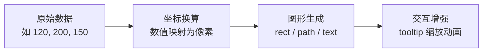
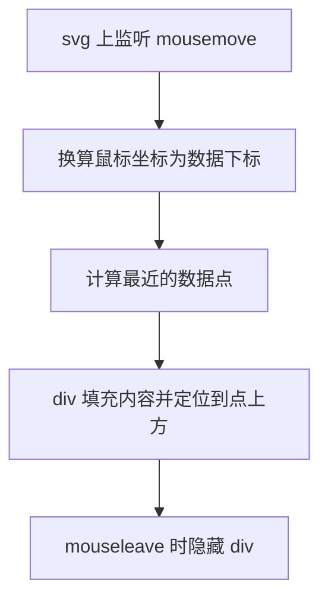

# SVG 实战：数据图表

> 不用任何库，纯手写 SVG 柱状图、折线图和坐标轴。
> 目的不是造轮子，而是理解 ECharts 这类库到底替你做了什么。

---

## 1. 为什么值得手写一遍

数据可视化的本质只有三步：



所有图表库的核心都是"数据到像素的映射函数"。手写一遍后，
再看 [[前端开发/06-数据可视化/ECharts/01-ECharts基础|ECharts 基础]]
的 option 配置，你会明白每个配置项背后对应哪段底层逻辑。

---

## 2. 柱状图：从数据到 rect

### 2.1 坐标换算思路

画布高 300，留出上下边距后绘图区高约 240。
柱高 = 数值 / 最大值 * 绘图区高度。

### 2.2 JS 动态创建 SVG 元素完整实现

注意：SVG 元素必须用 `createElementNS` 创建，
命名空间是 `http://www.w3.org/2000/svg`——这是新手最常见的坑。

```html
<!DOCTYPE html>
<html lang="zh-CN">
<head>
<meta charset="UTF-8" />
<style>
  body { font-family: sans-serif; background: #f5f6fa; }
  #chart {
    background: #ffffff;
    border-radius: 8px;
    box-shadow: 0 2px 8px rgba(0,0,0,.08);
  }
</style>
</head>
<body>

<div id="app"></div>

<script>
  const NS = 'http://www.w3.org/2000/svg';

  // 便捷创建函数
  function el(tag, attrs) {
    const node = document.createElementNS(NS, tag);
    for (const k in attrs) node.setAttribute(k, attrs[k]);
    return node;
  }

  function renderBarChart(container, data) {
    const W = 600, H = 360;
    const PAD = { top: 30, right: 20, bottom: 40, left: 50 };
    const plotW = W - PAD.left - PAD.right;
    const plotH = H - PAD.top - PAD.bottom;

    const maxVal = Math.max(...data.map(d => d.value));

    const svg = el('svg', { viewBox: `0 0 ${W} ${H}`, width: '100%' });

    data.forEach((d, i) => {
      const slot = plotW / data.length;          // 每组槽宽
      const barW = slot * 0.55;                  // 柱宽占槽的 55%
      const x = PAD.left + i * slot + (slot - barW) / 2;
      const h = (d.value / maxVal) * plotH;
      const y = PAD.top + plotH - h;

      const rect = el('rect', {
        x, y, width: barW, height: h,
        rx: 4,
        fill: '#3498db'
      });
      svg.appendChild(rect);

      // 数值标签
      const valText = el('text', {
        x: x + barW / 2, y: y - 8,
        'text-anchor': 'middle',
        'font-size': 12, fill: '#555'
      });
      valText.textContent = d.value;
      svg.appendChild(valText);

      // 类目标签
      const catText = el('text', {
        x: x + barW / 2, y: PAD.top + plotH + 22,
        'text-anchor': 'middle',
        'font-size': 13, fill: '#333'
      });
      catText.textContent = d.name;
      svg.appendChild(catText);
    });

    container.appendChild(svg);
  }

  const sales = [
    { name: '一月', value: 320 },
    { name: '二月', value: 450 },
    { name: '三月', value: 280 },
    { name: '四月', value: 520 },
    { name: '五月', value: 410 },
    { name: '六月', value: 600 }
  ];

  renderBarChart(document.getElementById('app'), sales);
</script>
</body>
</html>
```

核心公式再强调一次：

```
柱高 h   = value / maxVal * plotH
柱顶 y   = 绘图区底部 - h
```

SVG 的 y 轴向下增长，这与数学直觉相反，是手写图表最容易搞反的地方。

---

## 3. 折线图：path d 拼接与 scale 封装

### 3.1 先封装一个线性比例尺

D3.js 的核心思想就是比例尺（scale）——把值域映射到像素域。
我们手写一个最简版本，之后所有换算都走它：

```js
/**
 * 线性比例尺：把 [dMin, dMax] 映射到 [rMin, rMax]
 */
function scaleLinear(domain, range) {
  const [dMin, dMax] = domain;
  const [rMin, rMax] = range;
  return function (value) {
    const t = (value - dMin) / (dMax - dMin);
    return rMin + t * (rMax - rMin);
  };
}

// 用法
const xScale = scaleLinear([0, 5],   [50, 550]);   // 序号 -> x 像素
const yScale = scaleLinear([0, 600], [330, 30]);   // 销量 -> y 像素（注意反向）
```

注意 y 轴的 range 是 `[底部, 顶部]`——数值越大 y 越小，
这就是"SVG 的 y 向下长"在工程上的处理。

### 3.2 path d 拼接折线

```html
<!DOCTYPE html>
<html lang="zh-CN">
<head><meta charset="UTF-8" /></head>
<body>
<div id="line-app"></div>

<script>
  const NS = 'http://www.w3.org/2000/svg';
  function el(tag, attrs) {
    const node = document.createElementNS(NS, tag);
    for (const k in attrs) node.setAttribute(k, attrs[k]);
    return node;
  }
  function scaleLinear(domain, range) {
    const [d0, d1] = domain, [r0, r1] = range;
    return v => r0 + ((v - d0) / (d1 - d0)) * (r1 - r0);
  }

  function renderLineChart(container, data) {
    const W = 600, H = 360;
    const PAD = { top: 30, right: 20, bottom: 40, left: 50 };

    const xScale = scaleLinear([0, data.length - 1],
                               [PAD.left, W - PAD.right]);
    const maxVal = Math.max(...data) * 1.1;   // 顶部留 10% 余量
    const yScale = scaleLinear([0, maxVal],
                               [H - PAD.bottom, PAD.top]);

    // 拼 d 字符串：M 起点，L 后续点
    let d = '';
    data.forEach((v, i) => {
      const x = xScale(i), y = yScale(v);
      d += (i === 0 ? 'M' : 'L') + x + ' ' + y + ' ';
    });

    const svg = el('svg', { viewBox: `0 0 ${W} ${H}`, width: '100%' });

    // 主折线
    svg.appendChild(el('path', {
      d,
      fill: 'none',
      stroke: '#e74c3c',
      'stroke-width': 2.5,
      'stroke-linejoin': 'round'
    }));

    // 数据点圆圈
    data.forEach((v, i) => {
      svg.appendChild(el('circle', {
        cx: xScale(i), cy: yScale(v), r: 4,
        fill: '#fff', stroke: '#e74c3c', 'stroke-width': 2
      }));
    });

    container.appendChild(svg);
    return { svg, xScale, yScale };   // 返回给坐标轴复用
  }

  renderLineChart(document.getElementById('line-app'),
                  [120, 300, 180, 420, 360, 500]);
</script>
</body>
</html>
```

想加面积填充？再拼一条闭合路径即可：

```js
// 面积路径：折线到底部闭合
const areaPath =
  d +
  `L ${xScale(data.length - 1)} ${H - PAD.bottom} ` +
  `L ${xScale(0)} ${H - PAD.bottom} Z`;

svg.appendChild(el('path', {
  d: areaPath,
  fill: 'rgba(231, 76, 60, 0.15)',
  stroke: 'none'
}));
// 注意要先插入面积、后插入折线，否则会盖住线
```

---

## 4. 简单坐标轴：line + text

轴 = 一条主线 + 刻度短线 + 若干文字标签，全是基础元素：

```js
function renderAxes(svg, xScale, yScale, W, H, PAD, tickCount) {
  const bottom = H - PAD.bottom;

  // X 轴主线
  svg.appendChild(el('line', {
    x1: PAD.left, y1: bottom,
    x2: W - PAD.right, y2: bottom,
    stroke: '#999', 'stroke-width': 1
  }));

  // Y 轴主线
  svg.appendChild(el('line', {
    x1: PAD.left, y1: PAD.top,
    x2: PAD.left, y2: bottom,
    stroke: '#999', 'stroke-width': 1
  }));

  // Y 轴刻度与网格线
  for (let i = 0; i <= tickCount; i++) {
    const val = (yScale.invert
      ? null : null); // 手写比例尺没实现 invert，直接算
  }

  // 更实用的写法：按数值均分
  const [yTopVal] = [Math.ceil((PAD.top === 0 ? 0 : 0))]; // 见下方完整版
}
```

上面故意展示了"没有 invert 会多别扭"——完整版直接从数值域正向生成：

```js
function renderAxes(svg, yDomainMax, W, H, PAD, xLabels, xScale) {
  const NS = 'http://www.w3.org/2000/svg';
  const el = (t, a) => {
    const n = document.createElementNS(NS, t);
    for (const k in a) n.setAttribute(k, a[k]);
    return n;
  };
  const bottom = H - PAD.bottom;
  const ticks = 5;
  const step = yDomainMax / ticks;

  // Y 轴刻度 + 水平网格线
  for (let i = 0; i <= ticks; i++) {
    const value = i * step;
    // 需要一个 yScale 把 value 变像素，这里内联计算
    const plotH = bottom - PAD.top;
    const y = bottom - (value / yDomainMax) * plotH;

    if (i > 0) {
      svg.appendChild(el('line', {          // 网格虚线
        x1: PAD.left, y1: y, x2: W - PAD.right, y2: y,
        stroke: '#eee', 'stroke-dasharray': '4 4'
      }));
    }
    const label = el('text', {
      x: PAD.left - 8, y: y + 4,
      'text-anchor': 'end', 'font-size': 12, fill: '#666'
    });
    label.textContent = value;
    svg.appendChild(label);

    // 小刻度线
    svg.appendChild(el('line', {
      x1: PAD.left - 4, y1: y, x2: PAD.left, y2: y,
      stroke: '#999'
    }));
  }

  // X 轴类目标签
  xLabels.forEach((name, i) => {
    const t = el('text', {
      x: xScale(i), y: bottom + 20,
      'text-anchor': 'middle', 'font-size': 12, fill: '#333'
    });
    t.textContent = name;
    svg.appendChild(t);
  });
}
```

你会发现：轴的计算逻辑（取整刻度、nice number 处理、标签防重叠）
才是真正麻烦的部分——这正是图表库替你做掉的脏活。

---

## 5. tooltip 思路：mousemove 定位 div

图表的提示框其实不是 SVG 元素，而是一个绝对定位的 HTML div。
思路：



在折线图上补一段实现（承接第 3 节返回的 scales）：

```html
<style>
  .tooltip {
    position: absolute;
    pointer-events: none;      /* 不挡住鼠标事件 */
    background: rgba(44, 62, 80, 0.92);
    color: #fff;
    padding: 6px 10px;
    border-radius: 4px;
    font-size: 12px;
    transform: translate(-50%, -110%);   /* 锚点在框底部中心 */
    opacity: 0;
    transition: opacity 0.15s;
    white-space: nowrap;
  }
</style>

<div id="wrap" style="position: relative;">
  <!-- svg 会插入这里 -->
</div>
<div class="tooltip" id="tip"></div>

<script>
  function bindTooltip(wrapEl, tipEl, svg, data, xScale, yScale, PAD, W) {
    svg.addEventListener('mousemove', e => {
      // 鼠标的 svg 视图框坐标
      const rect = svg.getBoundingClientRect();
      const mx = (e.clientX - rect.left) * (W / rect.width);

      // 找最近的数据点
      let best = 0, bestDist = Infinity;
      data.forEach((v, i) => {
        const dist = Math.abs(xScale(i) - mx);
        if (dist < bestDist) { bestDist = dist; best = i; }
      });

      const px = xScale(best), py = yScale(data[best]);
      tipEl.textContent = `第 ${best + 1} 期：${data[best]}`;
      // 像素坐标要按实际渲染尺寸还原回页面坐标
      const sx = rect.left + px * (rect.width / W);
      const sy = rect.top + py * (rect.height / (W * 0.6));
      tipEl.style.left = sx + window.scrollX + 'px';
      tipEl.style.top  = sy + window.scrollY + 'px';
      tipEl.style.opacity = 1;
    });
    svg.addEventListener('mouseleave', () => {
      tipEl.style.opacity = 0;
    });
  }
</script>
```

三个易错点：
1. **坐标系转换**：鼠标事件给的是页面像素，要除以缩放比换算回 viewBox 坐标；
   显示 tooltip 时再反着变回来。
2. **pointer-events: none**：否则 tooltip 会闪烁（自己挡住自己）。
3. **吸附效果**：找"最近点"而不是精确命中，交互手感好得多。

---

## 6. 手写的意义：理解 ECharts 替你做了什么

回头看，我们写了什么，库又替我们做了什么：

| 环节         | 手写时的工作量                     | 图表库代劳的部分                  |
|--------------|------------------------------------|-----------------------------------|
| 比例尺       | 自己写 scaleLinear                 | 内置 linear/log/time/category 等   |
| 刻度计算     | 手动取整、防重叠                   | nice number 算法自动出漂亮刻度     |
| 渲染         | createElementNS 一个个拼           | 一份 option 配置树自动生成全部节点 |
| 动画         | rAF 或 CSS 自己编排                | 初次渲染动画、更新过渡全部内置     |
| tooltip      | 坐标换算 + 最近点 + div 定位        | 一行 tooltip: {} 开箱即用         |
| 图例/联动    | 完全没敢做                         | legend、dataZoom、brush 成套提供   |

手写一遍的价值在于：**当库的表现不符合预期时，
你知道问题出在映射层还是渲染层**。排查 ECharts 的
stack 计算异常、双轴对不齐这类问题，底层理解直接决定排障速度。

---

## 7. 与 Chart.js 对比收尾

同样一张折线图，Chart.js 的写法：

```js
new Chart(ctx, {
  type: 'line',
  data: {
    labels: ['一月', '二月', '三月', '四月', '五月', '六月'],
    datasets: [{ label: '销量', data: [120, 300, 180, 420, 360, 500] }]
  }
});
```

三行配置 vs 我们两百多行的手写实现——这就是库的意义：
把"数据到像素"的通用脏活封装掉，让你专注业务数据本身。

- Chart.js 基于 canvas 渲染，上手最快，适合常规报表：
  [[前端开发/06-数据可视化/Chart.js/01-Chart.js基础|Chart.js 基础]]
- ECharts 功能最全，适合大屏与复杂交互：
  [[前端开发/06-数据可视化/ECharts/01-ECharts基础|ECharts 基础]]
- 而 SVG 底层知识，在你需要自定义系列、定制 tooltip 结构、
  排查渲染问题时，会一直派上用场。

---

## 小结

- 可视化核心公式：比例尺把数据域映射到像素域。
- SVG 创建元素必须用 createElementNS 和命名空间 URI。
- y 轴 range 反向写 [bottom, top]，解决"y 向下长"的反直觉。
- 折线就是 M/L 拼接的 path；面积是折线加两段 L 再 Z 闭合。
- tooltip 是 absolute 定位的 div，关键在坐标系双向换算与最近点吸附。
