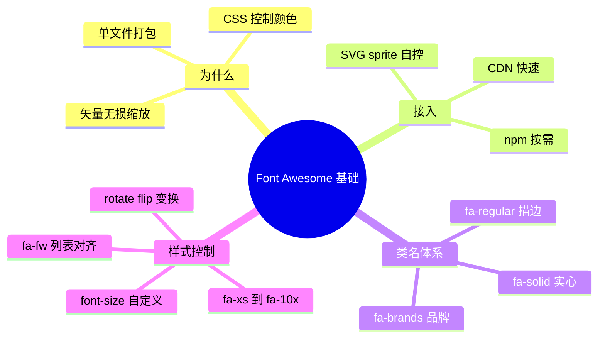

# 01 - Font Awesome 基础

> 前置：[[前端开发/01-基础/CSS/01-CSS基础语法|CSS 基础语法]]。图标库解决"页面上那些小图形从哪来"的问题。Font Awesome 是全球使用量最大的图标库之一，免费版提供 1500+ 图标，本章讲清接入方式与类名体系。

---

## 1. 为什么需要图标库

### 1.1 矢量的优势

图标库提供的都是矢量图（SVG 或图标字体），相比切图片有决定性优势：

| 维度 | 位图（png/jpg） | 矢量（SVG/字体） |
|------|-----------------|-------------------|
| 缩放 | 放大发糊，要出 @2x @3x 多套 | 无损任意缩放 |
| 颜色 | 改色要重新切图 | CSS `color` 一行控制 |
| 请求 | 每个图标一个文件（或雪碧图） | 一个字体/组件文件全打包 |
| 高分屏适配 | 需专门处理 | 天然清晰 |

```css
/* 同一个图标：颜色、大小全部由 CSS 接管 */
.icon-star { color: #f5a623; font-size: 24px; }
.icon-star:hover { color: #e8890c; transform: scale(1.15); }
```

## 2. Font Awesome 定位

- 官方：fontawesome.com，当前主版本 6.x。
- 免费版约 2000+ 图标，覆盖日常九成需求；Pro 版收费。
- 图标分三大系列（见第 4 节），每个图标有唯一名字如 `house`、`user`、`magnifying-glass`。

## 3. 三种接入方式

### 3.1 方式一：CDN link（最简单）

```html
<!DOCTYPE html>
<html lang="zh">
<head>
<meta charset="UTF-8">
<!-- Kit 或公共 CDN 二选一 -->
<link rel="stylesheet"
      href="https://cdnjs.cloudflare.com/ajax/libs/font-awesome/6.5.2/css/all.min.css">
</head>
<body>
<i class="fa-solid fa-house"></i>
</body>
</html>
```

适用：演示项目、快速原型、无构建流程的静态页。缺点：加载全量 CSS（100KB+），依赖外网。

### 3.2 方式二：npm 包 + 构建工具

```bash
npm install @fortawesome/fontawesome-free
```

```javascript
// Vite/webpack 项目：引入全量
import "@fortawesome/fontawesome-free/css/all.min.css";
```

按需引入（推荐，见进阶章的性能节）：

```javascript
import { library, dom } from "@fortawesome/fontawesome-svg-core";
import { faHouse, faUser } from "@fortawesome/free-solid-svg-icons";

library.add(faHouse, faUser);
dom.watch(); // 自动扫描 <i data-icon="..."> 并替换为 SVG
```

适用：工程化项目的标准姿势。

### 3.3 方式三：SVG sprite（手动控制）

把用到的 SVG 合成一个 sprite 文件，页面里用 `<use>` 引用：

```html
<svg style="display:none" xmlns="http://www.w3.org/2000/svg">
  <symbol id="icon-home" viewBox="0 0 576 512">
    <!-- 从 FA 下载的 path 数据粘贴于此 -->
    <path d="..."/>
  </symbol>
</svg>

<svg class="icon"><use href="#icon-home"></use></svg>
```

```css
.icon { width: 16px; height: 16px; fill: currentColor; }
```

适用：追求零运行时、完全自主可控的场景；缺点是更新图标要手工同步。

三种方式的选型一句话：原型用 CDN，工程用 npm 按需，极端性能洁癖用 sprite。

## 4. 类名体系：前缀 + 名称

FA6 的图标写法是固定模式 `<i class="{前缀} fa-{名称}"></i>`：

| 前缀 | 系列 | 风格 | 免费可用 |
|------|------|------|----------|
| `fa-solid` (fas) | Solid 实心 | 粗实填充 | 是，主力系列 |
| `fa-regular` (far) | Regular 描边 | 线框轮廓 | 部分（约 160 个） |
| `fa-brands` (fab) | Brands 品牌 | 公司/产品 logo | 全部 |

```html
<!-- 实心的房子 -->
<i class="fa-solid fa-house"></i>

<!-- 同名图标的描边版本（若免费版提供） -->
<i class="fa-regular fa-heart"></i>
<i class="fa-solid fa-heart"></i>   <!-- 对比：实心 -->

<!-- 品牌图标只能用 brands 前缀 -->
<i class="fa-brands fa-github"></i>
<i class="fa-brands fa-weixin"></i>
<i class="fa-brands fa-chrome"></i>
```

三个注意点：

1. **品牌图标没有 regular/solid 之分**，只有 brands 一种画法。
2. 同名图标在不同系列下视觉差异大（实心醒目、描边轻盈），界面里应保持同一场景用同一系列。
3. 老代码里的 `fas/far/fab` 缩写仍然有效（FA6 兼容），新代码建议写完整前缀。

`<i>` 标签本身无语义，只是历史惯例；语义上等价的 `<span>` 同样可以。若图标承载信息（如状态指示），务必加可访问文本：

```html
<button aria-label="搜索"><i class="fa-solid fa-magnifying-glass"></i></button>
<span><i class="fa-solid fa-triangle-exclamation"></i> <span class="sr-only">警告：</span>磁盘空间不足</span>
```

## 5. 尺寸控制

### 5.1 内建尺寸档位

| 类 | 相对大小 |
|----|----------|
| fa-2xs / fa-xs / fa-sm | 0.625x / 0.75x / 0.875x |
| （默认无类） | 1x = 继承 font-size |
| fa-lg | 1.25x |
| fa-2x 到 fa-10x | 2~10 倍 |

```html
<i class="fa-solid fa-camera fa-xs"></i>
<i class="fa-solid fa-camera"></i>
<i class="fa-solid fa-camera fa-lg"></i>
<i class="fa-solid fa-camera fa-3x"></i>
<i class="fa-solid fa-camera fa-10x"></i>
```

### 5.2 自定义尺寸与垂直对齐

档位不够用时回到普通 CSS——图标字体本质上就是文字：

```css
.fa-bigger {
  font-size: 28px;      /* 直接控制大小 */
  vertical-align: -0.125em; /* 与相邻文字基线微调对齐 */
}
```

```html
<p>继续操作 <i class="fa-solid fa-arrow-right fa-bigger"></i></p>
```

经验：按钮和菜单里的图标优先不设尺寸类，让它跟随文字的 font-size 自动缩放，整体才协调；只有独立展示的大图标才用 fa-Nx。

flex 布局里则完全不用管对齐：给父容器加 `display:flex; align-items:center; gap:6px`，图标文字天然垂直居中，比 vertical-align 微调可靠得多——现代项目里这是默认做法。

## 6. 固定宽度 fa-fw：列表对齐神器

不同图标的原始宽度不同，竖排列表会出现"文字参差"：

```mermaid
flowchart LR
    subgraph 不加fa-fw["不加 fa-fw"]
      A1["(窄) home 文字A"] 
      A2["(宽) camera 文字B"]
    end
    subgraph 加fa-fw["加 fa-fw"]
      B1["[home ] 文字A"]
      B2 "[camera] 文字B"]
    end

    style B1 fill:#e8f5e9
    style B2 fill:#e8f5e9
```

```html
<nav class="menu">
  <a href="#"><i class="fa-solid fa-house fa-fw"></i> 首页</a>
  <a href="#"><i class="fa-solid fa-envelope fa-fw"></i> 消息</a>
  <a href="#"><i class="fa-solid fa-gear fa-fw"></i> 设置</a>
</nav>
<style>
.menu a { display: block; padding: 8px; text-decoration: none; color: inherit; }
.menu a:hover { background: #f0f4ff; }
</style>
```

fa-fw 把所有图标强制为统一宽度（1.25em），文字左边缘整齐划一——侧边栏菜单必配。

## 7. 旋转与翻转

| 类 | 效果 |
|----|------|
| fa-rotate-90 / 180 / 270 | 定角旋转 |
| fa-flip-horizontal / vertical | 水平/垂直镜像 |
| fa-rotate-by + CSS 变量 --fa-rotate-angle | 任意角度 |

```html
<i class="fa-solid fa-arrow-right fa-rotate-90"></i>       <!-- 变成向下 -->
<i class="fa-solid fa-reply fa-flip-horizontal"></i>        <!-- 回复变转发方向 -->
<i class="fa-solid fa-thumbtack" style="--fa-rotate-angle: 45deg"></i>
```

也可以直接对元素写 transform，效果相同——旋转类只是预设了 transform 的便捷封装。

## 8. 实战：导航栏+按钮+表单综合案例

```html
<!DOCTYPE html>
<html lang="zh">
<head>
<meta charset="UTF-8">
<link rel="stylesheet"
      href="https://cdnjs.cloudflare.com/ajax/libs/font-awesome/6.5.2/css/all.min.css">
<style>
  * { box-sizing: border-box; margin: 0; }
  body { font-family: system-ui, sans-serif; }

  /* ---------- 顶部导航 ---------- */
  .navbar {
    display: flex; align-items: center; gap: 20px;
    background: #1f2937; color: #fff; padding: 0 24px; height: 52px;
  }
  .brand i { color: #60a5fa; margin-right: 8px; }
  .navbar a {
    color: #d1d5db; text-decoration: none; display: flex;
    align-items: center; gap: 6px; height: 100%; padding: 0 10px;
  }
  .navbar a.active, .navbar a:hover { color: #fff; border-bottom: 2px solid #60a5fa; }

  /* ---------- 工具区：搜索框 + 按钮 ---------- */
  .toolbar { max-width: 720px; margin: 32px auto; display: flex; gap: 10px; }
  .search { position: relative; flex: 1; }
  .search i {
    position: absolute; left: 12px; top: 50%; translate: 0 -50%;
    color: #9ca3af; pointer-events: none;
  }
  .search input {
    width: 100%; height: 40px; padding-left: 36px;
    border: 1px solid #d1d5db; border-radius: 8px;
  }
  .btn {
    display: inline-flex; align-items: center; gap: 8px;
    height: 40px; padding: 0 16px; border: none; border-radius: 8px;
    background: #2563eb; color: #fff; cursor: pointer;
  }
  .btn.danger { background: #dc2626; }
  .btn:hover { filter: brightness(1.1); }

  /* ---------- 表单校验反馈 ---------- */
  .field { max-width: 720px; margin: 12px auto; position: relative; }
  .field input {
    width: 100%; height: 40px; padding: 0 36px 0 12px;
    border: 1px solid #d1d5db; border-radius: 8px;
  }
  .field.ok input { border-color: #16a34a; }
  .field.bad input { border-color: #dc2626; }
  .field .status {
    position: absolute; right: 12px; top: 50%; translate: 0 -50%;
    display: none;
  }
  .field.ok .status.ok { display: inline; color: #16a34a; }
  .field.bad .status.bad { display: inline; color: #dc2626; }
</style>
</head>
<body>

<nav class="navbar">
  <span class="brand"><i class="fa-solid fa-cubes"></i>RootStack</span>
  <a href="#" class="active"><i class="fa-solid fa-house"></i>首页</a>
  <a href="#"><i class="fa-solid fa-folder"></i>项目</a>
  <a href="#"><i class="fa-solid fa-chart-line"></i>报表</a>
</nav>

<div class="toolbar">
  <div class="search">
    <i class="fa-solid fa-magnifying-glass"></i>
    <input type="text" placeholder="搜索项目…">
  </div>
  <button class="btn"><i class="fa-solid fa-plus"></i>新建</button>
  <button class="btn danger"><i class="fa-solid fa-trash-can"></i>删除</button>
</div>

<div class="field">
  <input type="email" placeholder="邮箱" id="email">
  <span class="status ok"><i class="fa-solid fa-circle-check"></i></span>
  <span class="status bad"><i class="fa-solid fa-circle-exclamation"></i></span>
</div>

<script>
const field = document.querySelector(".field");
document.querySelector("#email").addEventListener("input", (e) => {
  const ok = /^[^\s@]+@[^\s@]+\.[^\s@]+$/.test(e.target.value.trim());
  field.classList.toggle("ok", ok && e.target.value !== "");
  field.classList.toggle("bad", !ok && e.target.value !== "");
});
</script>
</body>
</html>
```

案例中用到的技巧回顾：导航项 flex + gap 让图标文字自动对齐；搜索框图标绝对定位在输入框内且 pointer-events:none 不挡点击；表单校验用两个预置状态图标切换显隐，避免频繁增删 DOM。

---

## 9. 小结



下一章 [[前端开发/07-图标与UI/Font-Awesome/02-Font-Awesome进阶|Font Awesome 进阶]] 讲叠加层、动画、性能优化与框架集成。
