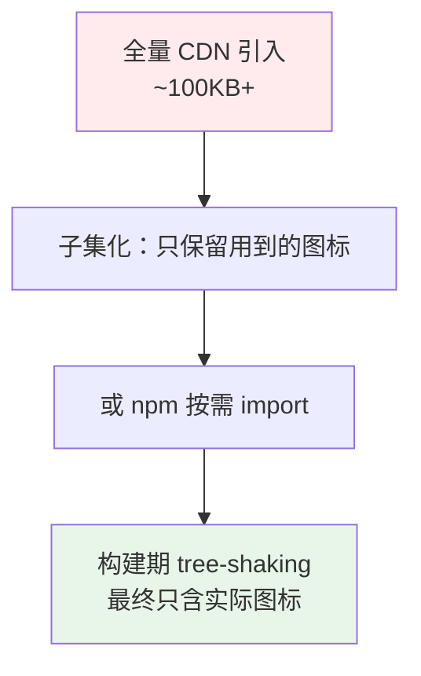
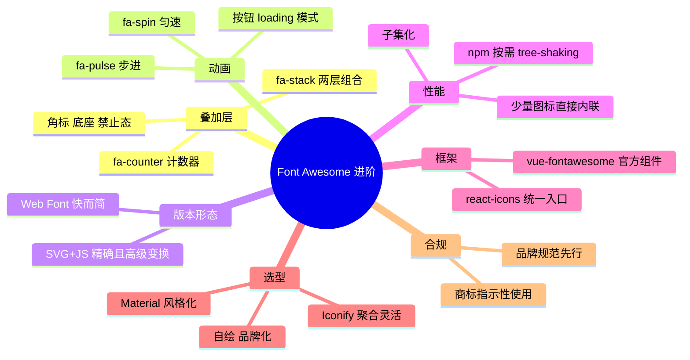

# 02 - Font Awesome 进阶

> 前置：[[前端开发/07-图标与UI/Font-Awesome/01-Font-Awesome基础|Font Awesome 基础]]。本章讲叠加层、动画、SVG+JS 版本、性能优化与 React/Vue 集成，并给出图标方案选型对比。

---

## 1. 图标叠加层：fa-stack 组合

两个图标叠成一个复合图形，典型用途：徽标角标、带背景的图标：

```html
<span class="fa-stack" style="--fa-counter-background-color: #dc2626">
  <i class="fa-solid fa-bell fa-stack-2x"></i>
  <i class="fa-solid fa-circle fa-stack-1x" style="translate: 8px -8px; color: #dc2626"></i>
</span>
```

结构规则：外层 `fa-stack` 定位上下文；`fa-stack-2x` 是底层大图；`fa-stack-1x` 是上层小图（默认居中，用 translate 微调到角上）。

经典三例——消息铃铛角标、相册徽章、禁止态：

```html
<!-- 一、铃铛 + 数字角标 -->
<span class="fa-stack fa-1x">
  <i class="fa-solid fa-bell fa-stack-2x"></i>
  <span class="fa-stack-1x"
        style="font-size:11px; translate:9px -9px; color:#fff;
               background:#dc2626; border-radius:50%;
               width:16px; height:16px; display:grid; place-items:center;">3</span>
</span>

<!-- 二、圆形底座 + 图标 -->
<span class="fa-stack">
  <i class="fa-solid fa-circle fa-stack-2x" style="color:#2563eb"></i>
  <i class="fa-solid fa-download fa-stack-1x fa-inverse"></i> <!-- fa-inverse 反白 -->
</span>

<!-- 三、禁止覆盖 -->
<span class="fa-stack">
  <i class="fa-solid fa-camera fa-stack-1x"></i>
  <i class="fa-solid fa-ban fa-stack-2x" style="color:#dc2626"></i>
</span>
```

FA6 还提供了计数器专用类，比手拼 stack 更省事：

```html
<i class="fa-solid fa-envelope">
  <span class="fa-counter" style="position:absolute">5</span>
</i>
```

## 2. 动画：fa-spin 与 fa-pulse

| 类 | 效果 | 场景 |
|----|------|------|
| fa-spin | 匀速连续旋转 | 通用 loading |
| fa-pulse | 八步阶梯旋转（每步顿一下） | 复古/机械感加载 |

```html
<button disabled>
  <i class="fa-solid fa-spinner fa-spin"></i> 提交中…
</button>

<i class="fa-solid fa-circle-notch fa-spin fa-2x"></i>
<i class="fa-solid fa-cog fa-pulse"></i>
```

配合按钮防重复提交的完整模式：

```javascript
const btn = document.querySelector("#submit");

async function onSubmit() {
  const icon = btn.querySelector("i");
  icon.className = "fa-solid fa-spinner fa-spin"; // 转起来
  btn.disabled = true;

  try {
    await saveForm(); // 请求见 Fetch API 章
    icon.className = "fa-solid fa-circle-check";
  } catch {
    icon.className = "fa-solid fa-circle-exclamation";
  } finally {
    btn.disabled = false;
    setTimeout(() => (icon.className = "fa-solid fa-paper-plane"), 1500);
  }
}
```

原理提示：这些类只是预设了 CSS animation，自定义旋转速度直接覆盖即可：

```css
.fa-slow-spin { animation-duration: 3s; } /* 默认 2s */
```

## 3. 带边框与拉直对齐

```html
<!-- fa-border：细边框圆角，常用于引用块旁的装饰 -->
<p><i class="fa-solid fa-quote-left fa-2x fa-pull-left fa-border"></i>
   这是一段引用文字，图标浮动在左侧并与文字保持间距……</p>

<!-- fa-pull-left / fa-pull-right：类似 float 的排版浮动 -->
<!-- ul-icon 列表：图标替代项目符号 -->
<ul class="fa-ul">
  <li><span class="fa-li"><i class="fa-solid fa-check"></i></span>支持项一</li>
  <li><span class="fa-li"><i class="fa-solid fa-xmark"></i></span>不支持项二</li>
</ul>
```

`fa-ul` 的价值在于图标宽度统一占位、文字严格对齐，比自己调 padding 稳定得多。

## 4. SVG + JS 版本

前面用的都是 Web Font 版本（CSS + 字体文件）。FA 还提供 SVG+JS 模式：引入 JS 后自动把 `<i>` 替换为内联 `<svg>`：

```html
<script src="https://cdnjs.cloudflare.com/ajax/libs/font-awesome/6.5.2/js/all.min.js"
        data-auto-replace-svg="nest"></script>
```

两种版本对比：

| 维度 | Web Font | SVG + JS |
|------|----------|----------|
| 渲染清晰度 | 字体抗锯齿，个别平台发虚 | 矢量精确 |
| 样式控制 | color/font-size/text-shadow | 多一个 fill/stroke 细控 |
| CSS 能力 | text-stroke 等字体特性可用 | 不支持字体专属效果 |
| 无障碍 | 需手动 aria | 自动携带 aria-hidden |
| 性能 | 首屏快（纯 CSS） | 有 JS 执行开销 |

SVG 模式独占的能力——power transform，对图标做精细几何变换：

```html
<!-- 上移 0.25 个单位并放大 1.2 倍 -->
<i class="fa-solid fa-user" data-fa-transform="up-.25 grow-4"></i>
<!-- 组合语法：rotate shrink flip-x up down left right grow -->
<i class="fa-solid fa-comment" data-fa-transform="shrink-8 rotate-15"></i>
```

选择建议：普通项目 Web Font 足够；需要 mask、layering、power transform 这些高级特性时才上 SVG+JS。

## 5. 按需加载与性能优化

### 5.1 问题：全量 CSS 的体积账

`all.min.css` 约 100KB+ gzip 前，其中绝大多数是永远用不到的图标定义。优化路径按收益排序：



### 5.2 方式一：在线子集化

FA 官方 Kit 或第三方工具扫描源码收集图标名，生成只含所需图标的精简包。适合静态站点一次性构建。

### 5.3 方式二：npm 按需 import（工程化标准）

```javascript
// 只打包用到的图标，其余全部摇掉
import { library, dom } from "@fortawesome/fontawesome-svg-core";
import { faHouse, faMagnifyingGlass } from "@fortawesome/free-solid-svg-icons";
import { faGithub } from "@fortawesome/free-brands-svg-icons";

library.add(faHouse, faMagnifyingGlass, faGithub);
dom.i2svg(); // 执行一次替换（SPA 在路由后需再次调用或用 dom.watch）
```

对应页面写法改为 data 属性形式：

```html
<i data-fa-i2svg class="fa-solid fa-house"></i>
```

### 5.4 其他优化要点

- 加 `rel="stylesheet"` 时配 preload 关键资源，避免图标闪现（FOUT）。
- 图标区域设置固定宽高占位，防止字体加载完成前后布局跳动。
- 单页面用量少（<10 个）时考虑直接内联 SVG，省掉整个库请求。

## 6. React/Vue 中使用

### 6.1 react-icons：统一入口方案

react-icons 把 FA、Material、AntD 等十多个图标库打包成同一套组件 API：

```bash
npm install react-icons
```

```jsx
// 从对应库的模块导入，tree-shaking 友好
import { FaHouse, FaGithub } from "react-icons/fa6";
import { MdSearch } from "react-icons/md";

function Nav() {
  return (
    <>
      <a href="/"><FaHouse /> 首页</a>
      <a href="https://github.com"><FaGithub /></a>
      <MdSearch size={20} color="#666" />
    </>
  );
}
```

优点：一套 import 语法通吃多库、天然按需、类型完整；缺点：跨库风格混用需要设计把关。

### 6.2 vue-fontawesome 官方方案

```bash
npm install @fortawesome/fontawesome-svg-core @fortawesome/free-solid-svg-icons @fortawesome/vue-fontawesome-v3
```

```javascript
// main.js
import { library } from "@fortawesome/fontawesome-svg-core";
import { FontAwesomeIcon } from "@fortawesome/vue-fontawesome";
import { faUser, faHouse } from "@fortawesome/free-solid-svg-icons";

library.add(faUser, faHouse);
app.component("font-awesome-icon", FontAwesomeIcon);
```

```vue
<template>
  <font-awesome-icon :icon="['fas', 'user']" spin />
  <!-- 字符串简写（library 里全局注册过名字时） -->
  <font-awesome-icon icon="house" />
</template>
```

框架集成的共同心法：**图标即组件**——尺寸颜色走 props 与 CSS 变量，不再手写类名组合。

## 7. 与其他图标方案对比

| 方案 | 图标量 | 风格 | 接入成本 | 适用 |
|------|--------|------|----------|------|
| Font Awesome | 免费约 2000+ | 均匀圆润，系列全 | 低 | 通用后台、快速开发 |
| Material Icons | 2500+ | Google 风，几何感强 | 低 | Android 风/Google 生态产品 |
| Iconify | 20 万+（聚合所有主流库） | 取决于所选集合 | 中（运行时或构建时） | 不想被单库锁定 |
| 自绘 SVG | 自定 | 完全品牌化 | 高 | 设计规范成熟的产品团队 |
| iconfont.cn | 海量中文社区图标 | 参差 | 中 | 国内项目找本土化图标 |

选型建议：新项目无强约束优先 Iconify（聚合意味着随时可换底层集合）；团队有 UI 设计规范则走自绘 SVG sprite；FA 的优势在生态和文档，老项目延续与快速原型仍是好选择。

## 8. 品牌合规注意

brands 系列全是商标，使用时受商标法约束：

1. **指代性使用安全**：用 GitHub logo 表示"链接到我们的 GitHub"，属于正当指示性使用。
2. **不得暗示背书**：把他人 logo 放进自家产品名、宣传语中暗示合作关系，存在法律风险。
3. **遵守品牌规范**：各公司对 logo 的留白、配色、禁用场景有官方 guideline（如"不可拉伸变形""不可改色"），商用前查一遍。
4. FA 许可本身：免费版图标遵循 CC BY 4.0、代码 MIT——商业使用没问题，但整体 redistribution 注意署名要求。

## 9. 实战：后台侧边栏菜单

综合运用：分组折叠、激活态、徽标数、收窄模式。零依赖完整实现：

```html
<!DOCTYPE html>
<html lang="zh">
<head>
<meta charset="UTF-8">
<link rel="stylesheet"
      href="https://cdnjs.cloudflare.com/ajax/libs/font-awesome/6.5.2/css/all.min.css">
<style>
  * { box-sizing: border-box; margin: 0; }
  body { font-family: system-ui, sans-serif; display: flex; min-height: 100vh; }

  .sidebar { width: 232px; background: #111827; color: #9ca3af;
             transition: width .25s ease; overflow: hidden; }
  body.collapsed .sidebar { width: 60px; }

  .side-head { display: flex; align-items: center; justify-content: space-between;
               height: 52px; padding: 0 16px; color: #fff; }
  .collapse-btn { background: none; border: none; color: #9ca3af; cursor: pointer; }

  .menu { list-style: none; padding: 8px; }
  .menu a {
    display: flex; align-items: center; gap: 10px;
    padding: 10px 12px; margin-bottom: 2px; border-radius: 6px;
    color: inherit; text-decoration: none; white-space: nowrap; position: relative;
  }
  .menu a i:first-child { width: 18px; text-align: center; } /* fa-fw 效果 */
  .menu a:hover { background: #1f2937; color: #fff; }
  .menu a.active { background: #2563eb; color: #fff; }

  /* 徽标 */
  .badge {
    margin-left: auto; background: #dc2626; color: #fff;
    font-size: 11px; line-height: 1; padding: 3px 7px; border-radius: 999px;
  }
  .arrow { margin-left: auto; transition: rotate .2s; }
  li.open > a .arrow { rotate: 90deg; }

  /* 折叠分组 */
  .submenu { list-style: none; max-height: 0; overflow: hidden; transition: max-height .25s; }
  li.open .submenu { max-height: 300px; }
  .submenu a { padding-left: 40px; font-size: 13px; }

  /* 收窄态隐藏文字与徽标 */
  body.collapsed .label, body.collapsed .badge,
  body.collapsed .arrow, body.collapsed .submenu { display: none; }
  body.collapsed a:hover::after {
    content: attr(data-tip); position: absolute; left: calc(100% + 8px);
    background: #374151; color: #fff; font-size: 12px; padding: 4px 8px;
    border-radius: 4px; white-space: nowrap; z-index: 10;
  }
</style>
</head>
<body>
<nav class="sidebar">
  <div class="side-head">
    <span class="label"><i class="fa-solid fa-cubes" style="margin-right:8px"></i>管理台</span>
    <button class="collapse-btn" id="fold"><i class="fa-solid fa-bars"></i></button>
  </div>

  <ul class="menu">
    <li><a href="#" class="active"><i class="fa-solid fa-gauge-high"></i><span class="label">仪表盘</span></a></li>

    <li>
      <a href="#" class="group"><i class="fa-solid fa-cart-shopping"></i>
        <span class="label">订单管理</span>
        <span class="badge">12</span>
        <i class="fa-solid fa-chevron-right arrow"></i></a>
      <ul class="submenu">
        <li><a href="#"><span class="label">订单列表</span></a></li>
        <li><a href="#"><span class="label">退款处理</span></a></li>
      </ul>
    </li>

    <li><a href="#"><i class="fa-solid fa-boxes-stacked"></i>
      <span class="label">商品库存</span></a></li>

    <li><a href="#"><i class="fa-solid fa-users"></i>
      <span class="label">用户管理</span>
      <span class="badge">3</span></a></li>

    <li><a href="#"><i class="fa-solid fa-gear"></i>
      <span class="label">系统设置</span></a></li>
  </ul>
</nav>

<main style="flex:1;padding:24px"><h2>内容区</h2></main>

<script>
const sidebar = document.body;

// 整体收窄
document.querySelector("#fold").addEventListener("click", () => {
  sidebar.classList.toggle("collapsed");
});

// 分组展开/收起 + 激活互斥
document.querySelector(".menu").addEventListener("click", (e) => {
  const link = e.target.closest("a");
  if (!link) return;
  e.preventDefault();

  if (link.classList.contains("group")) {
    link.parentElement.classList.toggle("open");
    return;
  }
  document.querySelectorAll(".menu a.active").forEach((a) => a.classList.remove("active"));
  link.classList.add("active");
});
</script>
</body>
</html>
```

实现复盘：

1. **委托**绑定在 `.menu` 上一次搞定激活与折叠，菜单项随便增删。
2. 徽标用 `margin-left:auto` 自动推到行尾；折叠时隐藏文字只留图标，靠 `data-tip` 提供悬浮提示。
3. 分组动画走 max-height 过渡（简单可靠）；更精细可用 grid-template-rows 0fr/1fr 技巧。
4. 图标列宽用固定 18px 实现 fa-fw 同款对齐效果，不依赖额外类名。

---

## 10. 小结



至此图标专题完结：基础章解决"怎么用"，本章解决"用得专业"——叠加表达信息、动效传达状态、性能不拖累首屏。
