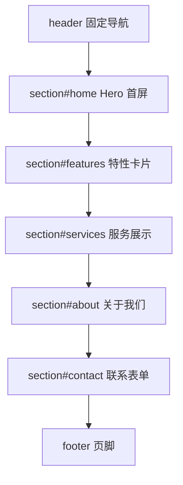

# 响应式企业官网：零框架综合实战

> 前置：[[前端开发/01-基础/HTML/04-HTML实战：语义化页面|HTML 语义化页面]]、[[前端开发/01-基础/CSS/03-Flexbox布局|Flexbox 布局]]、[[前端开发/01-基础/CSS/04-Grid布局|Grid 布局]]、[[前端开发/01-基础/CSS/06-CSS实战：响应式设计|响应式设计]]、[[前端开发/07-图标与UI/Font-Awesome/01-Font-Awesome基础|Font Awesome 基础]]
>
> 目标：不依赖任何框架和构建工具，用 HTML + CSS + 原生 JavaScript 完成一个可直接部署的企业官网单页。这是检验 01-基础是否扎实的试金石。

---

## 1. 项目概览

### 1.1 需求清单

| 模块 | 功能点 | 涉及技术 |
|------|--------|---------|
| 导航栏 | 锚点平滑滚动、滚动后变色、移动端汉堡菜单 | CSS scroll-behavior、checkbox 技巧 |
| Hero 区 | 全屏首屏、标语与行动按钮 | Flex 布局、渐变背景 |
| 特性区 | 三列特性卡片 | Flex 换行布局 |
| 服务区 | 六格服务展示 | Grid 网格 |
| 联系区 | 表单校验与提交反馈 | 表单语义、JS 校验 |
| 动效 | 各区块进入视口时淡入上移 | IntersectionObserver |
| 图标 | 全站图标 | Font Awesome CDN |
| SEO | meta 描述、Open Graph 分享标签 | head 元信息 |

### 1.2 页面结构



单页锚点导航的关键是**每个 section 的 id 与导航链接的 href 一一对应**，浏览器原生支持 `#id` 跳转，我们要做的是让它"平滑"且考虑固定导航的遮挡。

## 2. 项目骨架与 SEO 头部

```html
<!-- index.html -->
<!DOCTYPE html>
<html lang="zh-CN">
<head>
  <meta charset="UTF-8">
  <meta name="viewport" content="width=device-width, initial-scale=1.0">

  <!-- SEO 基础三件套 -->
  <title>云舟科技 - 企业数字化转型服务商</title>
  <meta name="description" content="云舟科技提供企业级软件定制、数据中台与云计算服务，已服务 500+ 企业客户。">
  <meta name="keywords" content="软件开发,数据中台,云计算,数字化转型">

  <!-- Open Graph：分享到微信/微博/社交平台的卡片信息 -->
  <meta property="og:type" content="website">
  <meta property="og:title" content="云舟科技 - 企业数字化转型服务商">
  <meta property="og:description" content="云舟科技提供企业级软件定制、数据中台与云计算服务。">
  <meta property="og:image" content="https://www.example.com/assets/og-cover.jpg">
  <meta property="og:url" content="https://www.example.com">

  <!-- 移动端主题色（部分浏览器地址栏会着色） -->
  <meta name="theme-color" content="#1a5fb4">

  <!-- Font Awesome 图标库 -->
  <link rel="stylesheet" href="https://cdnjs.cloudflare.com/ajax/libs/font-awesome/6.5.1/css/all.min.css">

  <link rel="stylesheet" href="css/style.css">
</head>
<body>
  <!-- 内容见后续模块 -->
  <script src="js/main.js" defer></script>
</body>
</html>
```

要点：

- `lang="zh-CN"` 影响屏幕阅读器发音与搜索引擎语言判断；
- `viewport` 缺失则移动端会把页面按 980px 宽缩放显示，响应式无从谈起；
- OG 标签决定链接分享出去时显示的标题、描述与配图，做官网必配；
- `<script defer>` 保证 DOM 解析完再执行脚本，不必把 script 挪到 body 底部。

## 3. 导航栏：锚点平滑滚动与汉堡菜单

### 3.1 HTML 结构

```html
<header class="site-header" id="siteHeader">
  <nav class="container nav">
    <a href="#home" class="nav-logo">
      <i class="fa-solid fa-water"></i> 云舟科技
    </a>

    <!-- checkbox 技巧核心：input 放在 label 之前，利用 :checked 兄弟选择器控制菜单 -->
    <input type="checkbox" id="navToggle" class="nav-toggle" aria-label="打开菜单">
    <label for="navToggle" class="nav-burger">
      <i class="fa-solid fa-bars"></i>
    </label>

    <ul class="nav-menu">
      <li><a href="#home">首页</a></li>
      <li><a href="#features">产品特性</a></li>
      <li><a href="#services">服务体系</a></li>
      <li><a href="#about">关于我们</a></li>
      <li><a href="#contact" class="nav-cta">联系我们</a></li>
    </ul>
  </nav>
</header>
```

### 3.2 平滑滚动：一行 CSS 加一个偏移修正

```css
html {
  scroll-behavior: smooth;
}
/* 锚点跳转时给目标留出固定导航的高度，避免标题被遮住 */
section[id] {
  scroll-margin-top: 72px;
}
```

`scroll-behavior: smooth` 让所有锚点跳转自带平滑动画；`scroll-margin-top` 是比 JS 计算偏移优雅得多的原生方案。

### 3.3 汉堡菜单：纯 CSS checkbox 技巧

原理：`input[type=checkbox]` 在视觉上隐藏但保留可勾选状态，`label` 充当汉堡按钮；勾选后通过兄弟选择器展开菜单——全程无需 JS。

```css
.nav-toggle {
  display: none;           /* 隐藏 input 本体，功能保留 */
}
.nav-burger {
  display: none;
  font-size: 1.5rem;
  cursor: pointer;
}

@media (max-width: 768px) {
  .nav-burger { display: block; }

  .nav-menu {
    position: absolute;
    top: 100%;
    left: 0;
    right: 0;
    background: #fff;
    flex-direction: column;
    padding: 1rem 0;
    box-shadow: 0 8px 16px rgba(0,0,0,.08);
    /* 收起态：最大高度为 0 配合过渡实现展开动画 */
    max-height: 0;
    overflow: hidden;
    transition: max-height .3s ease;
  }
  /* 勾选 checkbox 时展开紧邻其后的菜单 */
  .nav-toggle:checked ~ .nav-menu {
    max-height: 400px;
  }
}
```

这个技巧的价值在于理解**选择器只能向后找兄弟，所以 input 必须写在菜单元素之前**——CSS 没有父选择器和前向选择器，DOM 结构要为样式服务让路。

### 3.4 点击菜单项后自动收起（少量 JS）

```js
// js/main.js
document.querySelectorAll('.nav-menu a').forEach(link => {
  link.addEventListener('click', () => {
    document.getElementById('navToggle').checked = false;
  });
});
```

### 3.5 导航栏滚动态

```js
const header = document.getElementById('siteHeader');
window.addEventListener('scroll', () => {
  // 滚过首屏一半后给导航加白底阴影
  header.classList.toggle('scrolled', window.scrollY > 60);
}, { passive: true });
```

```css
.site-header {
  position: fixed;
  inset: 0 0 auto 0;
  height: 72px;
  background: transparent;
  transition: background .3s, box-shadow .3s;
  z-index: 100;
}
.site-header.scrolled {
  background: #fff;
  box-shadow: 0 2px 12px rgba(0,0,0,.08);
}
```

`passive: true` 告诉浏览器本监听器不会调用 `preventDefault`，滚动事件处理不再阻塞渲染主线。

## 4. Hero 区与特性卡（Flex）

### 4.1 Hero 首屏

```html
<section id="home" class="hero">
  <div class="container hero-inner">
    <h1>让每一家企业<br>都拥有自己的数字引擎</h1>
    <p>从咨询、开发到运维的一站式数字化服务</p>
    <div class="hero-actions">
      <a href="#contact" class="btn btn-primary">免费咨询</a>
      <a href="#services" class="btn btn-ghost">了解服务</a>
    </div>
  </div>
</section>
```

```css
.hero {
  min-height: 100vh;
  display: flex;
  align-items: center;
  background:
    linear-gradient(135deg, rgba(26,95,180,.92), rgba(10,50,120,.88)),
    url('../assets/hero-bg.jpg') center / cover no-repeat;
  color: #fff;
  text-align: center;
}
.hero-inner { max-width: 720px; }
.hero h1 { font-size: clamp(2rem, 5vw, 3.5rem); line-height: 1.25; }
.hero p  { font-size: 1.25rem; margin: 1rem 0 2rem; opacity: .9; }
```

两个细节值得记住：**渐变叠加图片**保证文字在任何底图上都有对比度；`clamp()` 让标题字号在移动端与桌面端之间平滑伸缩，替代多断点媒体查询。

### 4.2 按钮体系

```css
.btn {
  display: inline-block;
  padding: .75rem 2rem;
  border-radius: 999px;
  font-weight: 600;
  text-decoration: none;
  transition: transform .2s, box-shadow .2s;
}
.btn:hover { transform: translateY(-2px); }
.btn-primary {
  background: #1a5fb4;
  color: #fff;
  box-shadow: 0 4px 14px rgba(26,95,180,.4);
}
.btn-ghost {
  border: 1px solid rgba(255,255,255,.7);
  color: #fff;
}
```

### 4.3 特性卡片区

```html
<section id="features" class="section">
  <div class="container">
    <h2 class="section-title">为什么选择云舟</h2>
    <p class="section-sub">三个理由，让你放心把系统交给我们</p>

    <div class="feature-row">
      <div class="feature-card reveal">
        <i class="fa-solid fa-shield-halved feature-icon"></i>
        <h3>安全合规</h3>
        <p>等保三级认证，数据加密存储与传输。</p>
      </div>
      <div class="feature-card reveal">
        <i class="fa-solid fa-rocket feature-icon"></i>
        <h3>极速交付</h3>
        <p>标准化组件库加成熟方法论，最快两周上线。</p>
      </div>
      <div class="feature-card reveal">
        <i class="fa-solid fa-headset feature-icon"></i>
        <h3>全天候支持</h3>
        <p>7x24 小时响应，重大故障 30 分钟介入。</p>
      </div>
    </div>
  </div>
</section>
```

```css
.feature-row {
  display: flex;
  gap: 2rem;
  flex-wrap: wrap;              /* 空间不足自动换行 */
}
.feature-card {
  flex: 1 1 260px;              /* 可伸可缩，基准宽 260px */
  text-align: center;
  padding: 2.5rem 1.5rem;
  border-radius: 12px;
  background: #f7f9fc;
  transition: transform .3s, box-shadow .3s;
}
.feature-card:hover {
  transform: translateY(-6px);
  box-shadow: 0 12px 24px rgba(0,0,0,.1);
}
.feature-icon {
  font-size: 2.5rem;
  color: #1a5fb4;
  margin-bottom: 1rem;
}
```

`flex: 1 1 260px` 是响应式卡片的惯用写法：不需要媒体查询，容器放得下就并排、放不下就换行，配合基准宽度天然自适应。

## 5. 服务展示（Grid）与关于我们

```html
<section id="services" class="section section-alt">
  <div class="container">
    <h2 class="section-title">服务体系</h2>
    <div class="service-grid">
      <article class="service-item reveal">
        <i class="fa-solid fa-code"></i>
        <h3>软件定制开发</h3>
        <p>Web / 小程序 / App 全端覆盖</p>
      </article>
      <article class="service-item reveal">
        <i class="fa-solid fa-database"></i>
        <h3>数据中台建设</h3>
        <p>数据汇聚、治理与资产化</p>
      </article>
      <article class="service-item reveal">
        <i class="fa-solid fa-cloud"></i>
        <h3>云原生改造</h3>
        <p>容器化与微服务架构落地</p>
      </article>
      <article class="service-item reveal">
        <i class="fa-solid fa-chart-line"></i>
        <h3>BI 数据看板</h3>
        <p>经营数据一屏尽览</p>
      </article>
      <article class="service-item reveal">
        <i class="fa-solid fa-screwdriver-wrench"></i>
        <h3>系统运维托管</h3>
        <p>监控告警与应急响应</p>
      </article>
      <article class="service-item reveal">
        <i class="fa-solid fa-graduation-cap"></i>
        <h3>技术团队培训</h3>
        <p>体系化课程与实战陪跑</p>
      </article>
    </div>
  </div>
</section>
```

```css
.service-grid {
  display: grid;
  /* 自动填充：每个格子最小 240px，能塞几列塞几列 */
  grid-template-columns: repeat(auto-fill, minmax(240px, 1fr));
  gap: 1.5rem;
}
.service-item {
  padding: 2rem 1.5rem;
  border: 1px solid #e5eaf1;
  border-radius: 12px;
  transition: border-color .3s, transform .3s;
}
.service-item:hover {
  border-color: #1a5fb4;
  transform: translateY(-4px);
}
.service-item i {
  font-size: 1.75rem;
  color: #1a5fb4;
}
```

对比第 4 节的 Flex 卡片：**Flex 适合"一行内容流式排布"，Grid 适合"规整的多行多列矩阵"**，两者都靠 `auto-fill/minmax` 或 `flex-basis` 实现无断点响应式。更多网格细节见 [[前端开发/01-基础/CSS/04-Grid布局|Grid 布局]]。

## 6. 联系表单与验证

```html
<section id="contact" class="section">
  <div class="container contact-wrap">
    <form id="contactForm" class="contact-form" novalidate>
      <div class="form-field">
        <label for="name">姓名</label>
        <input type="text" id="name" name="name" required minlength="2"
               placeholder="您的称呼">
        <p class="error-msg" data-error-for="name"></p>
      </div>
      <div class="form-field">
        <label for="phone">手机号</label>
        <input type="tel" id="phone" name="phone" required
               pattern="^1[3-9]\d{9}$" placeholder="方便联系的手机号">
        <p class="error-msg" data-error-for="phone"></p>
      </div>
      <div class="form-field">
        <label for="message">需求描述</label>
        <textarea id="message" name="message" rows="4" required
                  placeholder="简单描述您的需求"></textarea>
        <p class="error-msg" data-error-for="message"></p>
      </div>
      <button type="submit" class="btn btn-primary btn-block">提交需求</button>
      <p id="formResult" class="form-result" aria-live="polite"></p>
    </form>
  </div>
</section>
```

```js
// js/main.js —— 表单校验
const form = document.getElementById('contactForm');
const messages = {
  name: '请填写至少 2 个字的姓名',
  phone: '请输入正确的 11 位手机号',
  message: '请简单描述您的需求'
};

function showError(input, text) {
  const tip = form.querySelector(`[data-error-for="${input.id}"]`);
  tip.textContent = text;
  input.classList.add('invalid');
}

function clearError(input) {
  const tip = form.querySelector(`[data-error-for="${input.id}"]`);
  tip.textContent = '';
  input.classList.remove('invalid');
}

form.addEventListener('submit', e => {
  e.preventDefault();                 // 拦截默认提交，改用自定义逻辑
  let valid = true;

  for (const field of ['name', 'phone', 'message']) {
    const input = form.elements[field];
    if (!input.value.trim()) {
      showError(input, messages[field]); valid = false;
    } else if (!input.checkValidity()) {
      // checkValidity 按 HTML 属性（pattern/minlength 等）判定
      showError(input, messages[field]); valid = false;
    } else {
      clearError(input);
    }
  }

  if (valid) {
    // 官网场景通常没有后端，这里演示两种去向：
    // 1) 对接后端：fetch('/api/contact', { method: 'POST', body: ... })
    //    参见 [[前端开发/04-DOM与交互/AJAX/02-Fetch-API]]
    // 2) 纯静态兜底：mailto 或第三方表单服务
    document.getElementById('formResult').textContent =
      '提交成功，我们会在 1 个工作日内与您联系。';
    form.reset();
  }
});
```

```css
.form-field { margin-bottom: 1.25rem; }
.form-field label { display: block; margin-bottom: .5rem; font-weight: 600; }
.form-field input,
.form-field textarea {
  width: 100%;
  padding: .75rem 1rem;
  border: 1px solid #d6dee9;
  border-radius: 8px;
  font-size: 1rem;
  outline: none;
  transition: border-color .2s;
}
.form-field input:focus,
.form-field textarea:focus { border-color: #1a5fb4; }
.invalid { border-color: #d93025 !important; }
.error-msg { color: #d93025; font-size: .85rem; min-height: 1.2em; margin-top: .35rem; }
```

设计决策说明：`novalidate` 关掉浏览器默认气泡提示是为了统一错误样式；`aria-live="polite"` 让提交结果对屏幕阅读器可见。更完整的表单专题见 [[前端开发/01-基础/HTML/02-HTML表单与语义化|HTML 表单与语义化]]。

## 7. 滚动显现动画（IntersectionObserver）

```css
.reveal {
  opacity: 0;
  transform: translateY(30px);
  transition: opacity .6s ease, transform .6s ease;
}
.reveal.visible {
  opacity: 1;
  transform: none;
}
@media (prefers-reduced-motion: reduce) {
  .reveal { opacity: 1; transform: none; transition: none; }
}
```

```js
const observer = new IntersectionObserver(entries => {
  entries.forEach(entry => {
    if (entry.isIntersecting) {
      entry.target.classList.add('visible');
      observer.unobserve(entry.target);   // 只播一次，播完即停观察
    }
  });
}, { threshold: 0.15 });                   // 元素露出 15% 即触发

document.querySelectorAll('.reveal').forEach(el => observer.observe(el));
```

相比监听 scroll 事件手动算坐标，IntersectionObserver 由浏览器异步调度回调，**不阻塞主线程，也不需要节流**。想进阶观察 DOM 变化可继续读 [[前端开发/04-DOM与交互/HTML-DOM/03-DOM高级：MutationObserver|MutationObserver]]。`prefers-reduced-motion` 则照顾了晕动症用户与低性能设备。

## 8. 设计要点清单

零框架做页面，代码之外更重要的是设计纪律：

| 要点 | 说明 |
|------|------|
| 留白 | 区块上下 padding 至少 96px（`.section { padding: 6rem 0 }`），内容不要顶满边缘，容器统一 `max-width: 1100px` 居中 |
| 字体层级 | 页面只用三级字号体系：标题 `clamp(2rem,4vw,2.75rem)`、副标题 `1.25rem`、正文 `1rem`，层级靠大小与字重表达而非颜色花样 |
| 一屏一主题 | 每个 viewport 高度只传达一个核心信息：Hero 只讲定位、特性区只讲三个卖点，禁止在一屏内堆砌多组内容 |
| 色彩克制 | 主色一个（#1a5fb4）、中性灰阶若干、语义红绿各一，全站不超过五个色值 |
| 统一圆角与阴影 | 圆角统一 12px，阴影只用两档（hover 深、常态浅或无） |
| 图片有 alt | 所有 `img` 必须带 alt，装饰图 alt 留空 |

## 9. 部署

纯静态产物，任意静态托管皆可：

```bash
# 方案一：GitHub Pages —— 推送仓库后在设置里开启 Pages
git init && git add . && git commit -m "feat: corporate site"
git remote add origin https://github.com/yourname/site.git && git push -u origin main

# 方案二：自有服务器 Nginx
scp -r index.html css assets user@server:/var/www/corp-site/
# Nginx server 块：
# root /var/www/corp-site;
# location / { try_files $uri $uri/ =404; }

# 方案三：本地快速预览
npx serve .
```

上线前自查清单：OG 图片链接必须是绝对 URL 且可公网访问；`og:url` 与最终域名一致；Favicon 已放置；手机真机走一遍汉堡菜单与表单。

---

## 小结

本章把 01-基础的 HTML/CSS/JS 核心知识压缩进了一个真实交付物：语义化结构、Flex 与 Grid 双布局、checkbox 纯 CSS 交互、IntersectionObserver 动效、表单校验。**它证明了不用框架也能做出合格的生产页面**。当你需要组件复用、状态管理和服务端对接时，就是进入 [[前端开发/08-项目实战/02-后台管理系统|后台管理系统（Vue3 实战）]] 的时机。
