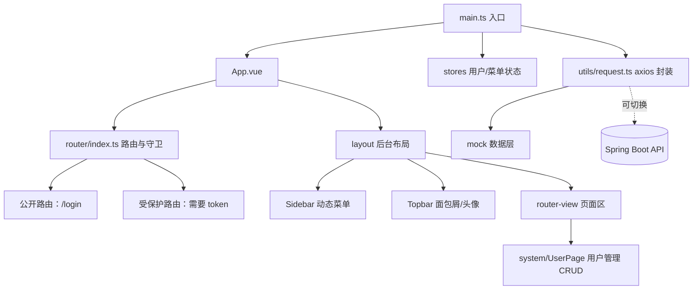

# 后台管理系统：Vue3 综合实战

> 前置：[[前端开发/03-JS框架/Vue3/01-Vue3基础|Vue3 基础]]、[[前端开发/03-JS框架/Vue3/02-组合式API|组合式 API]]、[[前端开发/03-JS框架/Vue3/04-Pinia与VueRouter4|Pinia 与 Vue Router 4]]、[[前端开发/01-基础/TypeScript/01-TS基础与类型系统|TS 基础与类型系统]]
>
> 目标：完成一个中后台管理系统的完整骨架——登录鉴权、动态路由、布局、用户管理 CRUD。这是求职作品集的核心项目，面试中"讲讲你的后台项目"几乎必问。

---

## 1. 技术选型与模块划分

| 层 | 选型 | 理由 |
|----|------|------|
| 工程 | Vite + vue-ts 模板 + TS | 秒级启动，类型安全开箱即用 |
| 框架 | Vue 3 组合式 API | 国内中后台事实标准 |
| 状态/路由 | Pinia + Vue Router 4 | 官方推荐，守卫做权限控制 |
| 组件库 | Element Plus | 表格表单弹窗齐全，中后台效率神器 |
| 数据层 | axios 封装 + mock 可切换 | 先 mock 后联调，见 [[前端开发/04-DOM与交互/AJAX/03-axios与拦截器\|axios 与拦截器]] |



职责划分原则：**store 只管状态与异步动作，页面只管编排组件，请求层只管协议细节**。三层互不越界，后期把 mock 换成真实接口时只动 `api/` 目录。

## 2. 项目初始化

```bash
npm create vite@latest admin-pro -- --template vue-ts
cd admin-pro && npm install
npm install pinia vue-router@4 element-plus axios
npm run dev
```

目录规划：

```text
src/
├── api/        # 接口定义（与 mock 同签名，业务层只认这里）
├── mock/       # 本地数据实现
├── layout/     # index.vue 整体布局 / Sidebar / Topbar
├── router/     # 路由表与导航守卫
├── stores/     # user.ts 登录态 / menu.ts 折叠状态
├── directives/ # v-permission 权限指令
├── utils/      # request.ts axios 封装
└── views/      # Login / Dashboard / system/User
```

## 3. 请求封装与 mock 数据层

### 3.1 axios 封装

```ts
// src/utils/request.ts
import axios from 'axios';
import { ElMessage } from 'element-plus';

const request = axios.create({
  baseURL: import.meta.env.VITE_API_BASE ?? '/api',
  timeout: 10000,
});
// 请求拦截：自动附带 token
request.interceptors.request.use(config => {
  const token = localStorage.getItem('token');
  if (token) config.headers.Authorization = `Bearer ${token}`;
  return config;
});

// 响应拦截：剥壳 + 归一错误
request.interceptors.response.use(
  res => {
    const { code, data, message } = res.data;
    if (code !== 0) {
      if (code === 401) {
        localStorage.removeItem('token');
        location.href = '/login';        // 会话过期回到登录页
      }
      ElMessage.error(message || '请求失败');
      return Promise.reject(new Error(message));
    }
    return data;                          // 直接返回业务数据
  },
  err => {
    ElMessage.error(err.message.includes('timeout') ? '请求超时' : '网络异常');
    return Promise.reject(err);
  }
);

export default request;
```

信封约定 `code/data/message` 与后端 [[java/3工程化/15_全栈开发技巧|全栈开发技巧]] 的 Result 规范一致；联调细节在 [[前端开发/09-融会贯通/02-Java全栈前后端联调|前后端联调]] 章展开。

### 3.2 mock 层：同签名可切换

```ts
// src/mock/index.ts —— 用本地内存数据模拟后端
import type { UserInfo, PageResult } from '../types';

const users: UserInfo[] = Array.from({ length: 42 }, (_, i) => ({
  id: i + 1,
  name: `用户${String(i + 1).padStart(2, '0')}`,
  role: ['admin', 'editor', 'viewer'][i % 3],
  status: i % 5 === 0 ? 'disabled' : 'active',
}));
const delay = <T>(data: T, ms = 300): Promise<T> =>
  new Promise(resolve => setTimeout(() => resolve(data), ms));

export const mockUserPage = (page: number, size: number, keyword: string) => {
  const filtered = users.filter(u => keyword ? u.name.includes(keyword) : true);
  return delay({
    total: filtered.length,
    records: filtered.slice((page - 1) * size, page * size),
  } as PageResult<UserInfo>);
};
export const mockDeleteUser = (id: number) => delay({ ok: true });
export const mockSaveUser = (u: Partial<UserInfo>) => delay({ ok: true });
```

```ts
// src/api/user.ts —— 业务层只认这个文件，底层用 mock 还是真接口它说了算
import request from '../utils/request';
import { mockUserPage, mockDeleteUser, mockSaveUser } from '../mock';
import type { UserInfo, PageResult } from '../types';

// 环境变量切换数据源，.env.local 里写 VITE_USE_MOCK=true
const useMock = import.meta.env.VITE_USE_MOCK === 'true';

export function fetchUserPage(params: { page: number; size: number; keyword?: string }) {
  return useMock
    ? mockUserPage(params.page, params.size, params.keyword ?? '')
    : request.get<never, PageResult<UserInfo>>('/users', { params });
}
export function removeUser(id: number) {
  return useMock ? mockDeleteUser(id) : request.delete(`/users/${id}`);
}
export function saveUser(data: Partial<UserInfo>) {
  return useMock
    ? mockSaveUser(data)
    : data.id ? request.put('/users', data) : request.post('/users', data);
}
```

关键设计：**mock 函数与真实接口的入参出参完全一致**。切到联调模式时改一个环境变量即可，业务代码零改动。

## 4. 登录页与用户状态

### 4.1 Pinia 用户 store

```ts
// src/stores/user.ts
import { defineStore } from 'pinia';

interface UserState {
  token: string;
  roles: string[];
  name: string;
}

export const useUserStore = defineStore('user', {
  state: (): UserState => ({
    token: localStorage.getItem('token') ?? '',
    roles: [],
    name: '',
  }),
  actions: {
    // mock 场景直接发 token；真实场景换成 request.post('/auth/login', form)
    async login(form: { username: string; password: string }) {
      await new Promise(r => setTimeout(r, 400));
      this.token = 'mock-token-' + Date.now();
      this.roles = form.username === 'admin' ? ['admin'] : ['editor'];
      this.name = form.username;
      localStorage.setItem('token', this.token);
    },
    logout() { this.$reset(); localStorage.removeItem('token'); },
  },
});
```

token 同时存 Pinia（响应式）与 localStorage（刷新不丢），两处同步写入是惯例做法。

### 4.2 登录页

```vue
<!-- src/views/Login.vue -->
<script setup lang="ts">
import { reactive, ref } from 'vue';
import { useRouter } from 'vue-router';
import { ElMessage } from 'element-plus';
import type { FormInstance, FormRules } from 'element-plus';
import { useUserStore } from '../stores/user';

const router = useRouter();
const userStore = useUserStore();
const formRef = ref<FormInstance>();
const loading = ref(false);

const form = reactive({ username: 'admin', password: '' });
const rules: FormRules = {
  username: [{ required: true, message: '请输入用户名', trigger: 'blur' }],
  password: [
    { required: true, message: '请输入密码', trigger: 'blur' },
    { min: 6, message: '密码至少 6 位', trigger: 'blur' },
  ],
};

async function handleLogin() {
  await formRef.value?.validate();          // 校验不过会抛异常并中断
  loading.value = true;
  try {
    await userStore.login(form);
    ElMessage.success('登录成功');
    const redirect =
      (router.currentRoute.value.query.redirect as string) || '/';
    router.push(redirect);                  // 消费守卫记录的目标地址
  } finally {
    loading.value = false;
  }
}
</script>

<template>
  <div class="login-page">
    <el-card class="login-card">
      <h2>云舟后台管理系统</h2>
      <el-form ref="formRef" :model="form" :rules="rules" size="large">
        <el-form-item prop="username">
          <el-input v-model="form.username" placeholder="用户名" />
        </el-form-item>
        <el-form-item prop="password">
          <el-input v-model="form.password" type="password" show-password
                    placeholder="密码" @keyup.enter="handleLogin" />
        </el-form-item>
        <el-button type="primary" style="width:100%" :loading="loading"
                   @click="handleLogin">登 录</el-button>
      </el-form>
    </el-card>
  </div>
</template>
```

要点：校验规则交给 `FormRules` 声明式配置而非手写 if；`await validate()` 失败自动中断后续逻辑；回车键提交是登录页的隐形需求。

## 5. 路由守卫与动态菜单

```ts
// src/router/index.ts
import { createRouter, createWebHistory } from 'vue-router';
import { useUserStore } from '../stores/user';

export const menuRoutes = [
  {
    path: '/',
    component: () => import('../layout/index.vue'),
    children: [
      { path: '', name: 'dashboard', component: () => import('../views/Dashboard.vue'),
        meta: { title: '首页', icon: 'HomeFilled' } },
      { path: 'system/users', name: 'users',
        component: () => import('../views/system/User.vue'),
        meta: { title: '用户管理', icon: 'User', requiresAdmin: true } },
      // 新增菜单只需在这里加一行
    ],
  },
  { path: '/login', component: () => import('../views/Login.vue'), meta: { public: true } },
];

const router = createRouter({ history: createWebHistory(), routes: menuRoutes });

router.beforeEach(to => {
  const userStore = useUserStore();
  if (to.meta.public) return userStore.token ? '/' : true;   // 已登录别看登录页
  if (!userStore.token) {
    // 未登录访问受保护页：记录目标地址，登录后跳回
    return { path: '/login', query: { redirect: to.fullPath } };
  }
  if (to.meta.requiresAdmin && !userStore.roles.includes('admin')) {
    return { path: '/' };                                    // 无权限回落首页
  }
  return true;
});

export default router;
```

```ts
// src/main.ts 记得注册
app.use(createPinia()).use(router).use(ElementPlus);
```

登录成功后的跳转已在上面的 Login.vue 中消费 redirect。

侧边栏由 `menuRoutes` 自动渲染，**菜单即路由的投影**，不存在两份配置：```vue
<!-- src/layout/Sidebar.vue -->
<script setup lang="ts">
import { computed } from 'vue';
import { useRoute } from 'vue-router';
import { menuRoutes } from '../router';
import { useMenuStore } from '../stores/menu';

const route = useRoute();
const menuStore = useMenuStore();

// 过滤掉无权限的菜单项（roles 来自 user store，此处从简）
const items = computed(() => menuRoutes[0].children!);
</script>

<template>
  <aside :class="{ collapsed: menuStore.collapsed }" class="sidebar">
    <div class="logo">{{ menuStore.collapsed ? '舟' : '云舟后台' }}</div>
    <!-- router 属性开启后 index 即跳转路径，无需手写导航事件 -->
    <el-menu :collapse="menuStore.collapsed" router :default-active="route.path">
      <el-menu-item v-for="item in items" :key="item.path" :index="item.path">
        <el-icon><component :is="item.meta?.icon" /></el-icon>
        <template #title>{{ item.meta?.title }}</template>
      </el-menu-item>
    </el-menu>
  </aside>
</template>
```

`el-menu` 的 `router` 属性开启后，点击菜单项即按 `index` 路径跳转。

## 6. 布局：折叠侧边栏 + 顶栏 + 面包屑

```ts
// src/stores/menu.ts
import { defineStore } from 'pinia';

export const useMenuStore = defineStore('menu', {
  state: () => ({ collapsed: false }),
  actions: {
    toggle() { this.collapsed = !this.collapsed; },
  },
});
```

```vue
<!-- src/layout/index.vue -->
<script setup lang="ts">
import Sidebar from './Sidebar.vue';
import Topbar from './Topbar.vue';
</script>

<template>
  <div class="layout">
    <Sidebar />
    <div class="main-area">
      <Topbar />
      <main class="content"><router-view /></main>
    </div>
  </div>
</template>

<style scoped>
.layout { display: flex; height: 100vh; }
.sidebar { width: 220px; transition: width .25s; }
.sidebar.collapsed { width: 64px; }
.main-area { flex: 1; display: flex; flex-direction: column; min-width: 0; }
.content { flex: 1; overflow: auto; padding: 16px; background: #f5f7fa; }
</style>
``````vue
<!-- src/layout/Topbar.vue -->
<script setup lang="ts">
import { computed } from 'vue';
import { useRoute } from 'vue-router';
import { useMenuStore } from '../stores/menu';
import { useUserStore } from '../stores/user';

const route = useRoute();
const menuStore = useMenuStore();
const userStore = useUserStore();

// 面包屑直接从路由 matched 记录派生，无需单独维护
const crumbs = computed(() =>
  route.matched.filter(r => r.meta?.title).map(r => r.meta.title as string)
);
function handleLogout() {
  userStore.logout();
  location.href = '/login';
}
</script>

<template>
  <header class="topbar">
    <el-icon class="fold-btn" @click="menuStore.toggle">
      <Fold v-if="!menuStore.collapsed" /><Expand v-else />
    </el-icon>
    <el-breadcrumb separator="/">
      <el-breadcrumb-item v-for="c in crumbs" :key="c">{{ c }}</el-breadcrumb-item>
    </el-breadcrumb>
    <el-dropdown @command="handleLogout">
      <span class="avatar">{{ userStore.name }}</span>
      <template #dropdown>
        <el-dropdown-menu><el-dropdown-item command="logout">退出登录</el-dropdown-item></el-dropdown-menu>
      </template>
    </el-dropdown>
  </header>
</template>
```

布局三要素各司其职：侧边栏宽度过渡动画靠 CSS transition 而非 JS；面包屑从 `route.matched` 派生，同样不需要单独维护；退出登录用整页跳转让所有内存状态归零。

## 7. 用户管理 CRUD 页

```vue
<!-- src/views/system/User.vue -->
<script setup lang="ts">
import { onMounted, reactive, ref } from 'vue';
import { ElMessage, ElMessageBox } from 'element-plus';
import { fetchUserPage, removeUser, saveUser } from '../../api/user';
import type { UserInfo } from '../../types';

const tableData = ref<UserInfo[]>([]);
const total = ref(0);
const loading = ref(false);
const dialogVisible = ref(false);
const editing = ref<Partial<UserInfo>>({});
const formRef = ref();
const query = reactive({ page: 1, size: 10, keyword: '' });
const rules = { name: [{ required: true, message: '请输入姓名', trigger: 'blur' }] };

async function load() {
  loading.value = true;
  try {
    const res = await fetchUserPage(query);
    tableData.value = res.records;
    total.value = res.total;
  } finally {
    loading.value = false;
  }
}

function search() {
  query.page = 1;                        // 新搜索从第一页开始
  load();
}

function openCreate() {
  editing.value = {};                    // 清空进入新增态
  dialogVisible.value = true;
}
function openEdit(row: UserInfo) {
  editing.value = { ...row };            // 浅拷贝，避免表格行被实时修改
  dialogVisible.value = true;
}
async function handleSave() {
  await formRef.value?.validate();
  await saveUser(editing.value);
  ElMessage.success('保存成功');
  dialogVisible.value = false;
  load();
}
async function handleDelete(row: UserInfo) {
  await ElMessageBox.confirm(`确定删除「${row.name}」吗？`, '删除确认', { type: 'warning' });
  await removeUser(row.id);
  ElMessage.success('已删除');
  // 当前页删空时回退一页
  if (tableData.value.length === 1 && query.page > 1) query.page--;
  load();
}

onMounted(load);
</script>

<template>
  <el-card shadow="never">
    <!-- 工具条：搜索 + 新增 -->
    <div class="toolbar">
      <el-input v-model="query.keyword" placeholder="搜索姓名" clearable
                style="width:220px" @keyup.enter="search" @clear="search" />
      <el-button type="primary" @click="openCreate">新增用户</el-button>
    </div>

    <!-- 表格 -->
    <el-table :data="tableData" v-loading="loading" stripe>
      <el-table-column prop="name" label="姓名" />
      <el-table-column prop="role" label="角色" width="120" />
      <el-table-column prop="status" label="状态" width="100">
        <template #default="{ row }">
          <el-tag :type="row.status === 'active' ? 'success' : 'danger'">
            {{ row.status === 'active' ? '启用' : '禁用' }}
          </el-tag>
        </template>
      </el-table-column>
      <el-table-column label="操作" width="160" fixed="right">
        <template #default="{ row }">
          <el-button link type="primary"
                     v-permission="'user:edit'" @click="openEdit(row)">编辑</el-button>
          <el-button link type="danger"
                     v-permission="'user:delete'" @click="handleDelete(row)">删除</el-button>
        </template>
      </el-table-column>
    </el-table>

    <!-- 分页 -->
    <el-pagination class="pager" background layout="total, prev, pager, next, sizes"
                   v-model:current-page="query.page" v-model:page-size="query.size"
                   :total="total" @change="load" />

    <!-- 新增/编辑弹窗 -->
    <el-dialog v-model="dialogVisible"
               :title="editing.id ? '编辑用户' : '新增用户'" width="420px">
      <el-form ref="formRef" :model="editing" :rules="rules" label-width="70px">
        <el-form-item label="姓名" prop="name">
          <el-input v-model="editing.name" />
        </el-form-item>
        <el-form-item label="角色">
          <el-select v-model="editing.role" style="width:100%">
            <el-option v-for="(label, value) in { admin: '管理员', editor: '运营', viewer: '访客' }"
                       :key="value" :value="value" :label="label" />
          </el-select>
        </el-form-item>
      </el-form>
      <template #footer>
        <el-button @click="dialogVisible = false">取消</el-button>
        <el-button type="primary" @click="handleSave">保存</el-button>
      </template>
    </el-dialog>
  </el-card>
</template>

<style scoped>
.toolbar { display: flex; justify-content: space-between; margin-bottom: 12px; }
.pager { margin-top: 12px; justify-content: flex-end; }
</style>
```

CRUD 五个易错点，全部体现在上面代码里：

1. **编辑用浅拷贝** `{ ...row }`，否则弹窗里的修改会实时污染表格；
2. **删除当前页最后一条要回退页码**，否则请求回来的是空列表；
3. **搜索防抖**（此处用回车触发代替输入即搜，最简可靠）；
4. **finally 关 loading**，请求失败也不能把表格锁死；
5. **删除前必须 confirm**，不可逆操作永远二次确认。

## 8. 权限按钮指令 v-permission

按钮级权限比菜单级更细：同一页面上，普通运营看得到"编辑"却看不到"删除"。

```ts
// src/directives/permission.ts
import type { Directive } from 'vue';
import { useUserStore } from '../stores/user';

// 权限码 -> 角色 映射（真实项目由后端下发）
const permissionMap: Record<string, string[]> = {
  'user:edit':   ['admin', 'editor'],
  'user:delete': ['admin'],
};

export const vPermission: Directive<HTMLElement, string> = {
  mounted(el, binding) {
    const roles = useUserStore().roles;
    const allowed = permissionMap[binding.value] ?? [];
    if (!allowed.some(r => roles.includes(r))) {
      el.remove();   // 直接移除 DOM，而不是 display:none
    }
  },
};
```

```ts
// main.ts 注册
app.directive('permission', vPermission);
```

选择 `el.remove()` 而非隐藏的理由：隐藏元素仍可通过开发者工具恢复显示，配合伪造请求就是越权漏洞。**前端权限只防君子，真正的防线必须在后端接口再校验一次**——这与 [[java/3工程化/06_Spring Boot快速开发|Spring Boot]] 章的服务端权限体系是一体两面。

## 9. 作品集提示

把它做出区分度的方式不是堆功能，而是**能回答为什么**：

| 面试高频问题 | 本章对应答案 |
|-------------|-------------|
| 路由守卫怎么做的？ | 第 5 节：全局 beforeEach + meta 标记 + redirect 回跳 |
| token 存哪？为什么？ | 第 4 节：Pinia 保响应式 + localStorage 保持久，双写同步 |
| 权限做到哪一层？ | 菜单级（路由 meta）+ 按钮级（自定义指令），强调服务端兜底 |
| 接口没写完怎么办？ | 第 3 节：mock 与真实接口同签名，环境变量切换 |
| 项目亮点？ | mock 无缝切换真实接口、v-permission 指令、面包屑自动生成 |

进阶方向：把数据源真正接到 [[java/3工程化/06_Spring Boot快速开发|Spring Boot]] 上，走一遍 [[前端开发/09-融会贯通/02-Java全栈前后端联调|前后端联调]]，这份作品集就从"前端项目"升级为"全栈项目"。

---

## 小结

本章完成了后台系统的四梁八柱：请求封装、登录鉴权、动态菜单、CRUD 页面。代码量不大，但每一处都是企业开发的真实套路。下一步建议：给 Dashboard 补上图表（参考 [[前端开发/08-项目实战/03-数据看板|数据看板实战]]），或者换 Tailwind 重写样式（参考 [[前端开发/02-CSS框架/Tailwind-CSS/01-Tailwind基础|Tailwind 入门]]）。
