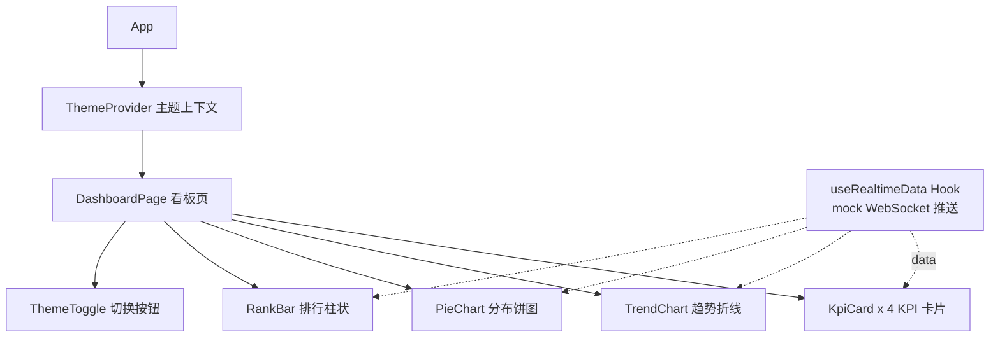

# 数据看板：React 综合实战

> 前置：[[前端开发/03-JS框架/React/01-React基础|React 基础]]、[[前端开发/03-JS框架/React/03-Hooks深入|Hooks 深入]]、[[前端开发/03-JS框架/React/05-状态管理|状态管理]]、[[前端开发/06-数据可视化/ECharts/01-ECharts基础|ECharts 入门]]
>
> 目标：完成一个实时刷新的数据看板——KPI 卡片、趋势折线、分布饼图、排行柱状图，支持暗黑主题与 WebSocket 实时推送。这是 React 生态的典型工作形态。

---

## 1. 技术选型：Recharts 还是 echarts-for-react

两者都能画图，集成方式差异很大，选型前必须讲清：

| 维度 | Recharts | echarts-for-react |
|------|----------|-------------------|
| 底层 | 纯 React 组件（基于 SVG） | ECharts 的 React 包装器（Canvas 渲染） |
| 写法 | `<LineChart><Line/>...` 组件式声明 | `option` 配置对象一次性传入 |
| 数据更新 | props 变化自动重渲染 | 需调用实例方法或依赖 option diff |
| 定制深度 | 受组件 API 限制 | ECharts 全部能力可用 |
| 包体积 | 较小 | 较大（可按需引入模块缓解） |
| 中文文档 | 一般 | 极全（ECharts 官方中文） |

结论：**图表类型常规、追求组件化心智选 Recharts；需要复杂交互、大数据量渲染或团队已有 ECharts 经验选 echarts-for-react**。本章以 echarts-for-react 为主线（配置对象更贴近 [[前端开发/06-数据可视化/ECharts/02-高级图表|ECharts 常用图表类型]] 的知识），Recharts 版本给出对照写法。

```bash
npm create vite@latest realtime-dashboard -- --template react-ts
cd realtime-dashboard && npm install
npm install echarts echarts-for-react
npm run dev
```



核心设计：**所有图表消费同一份由 `useRealtimeData` 产出的状态**，数据源切换（mock / WebSocket / 真实接口）不影响任何展示组件。

## 2. 类型定义与 mock 数据源

```ts
// src/types.ts
export interface Metrics {
  qps: number;            // 每秒请求数
  latency: number;        // 平均延迟 ms
  errorRate: number;      // 错误率 %
  onlineUsers: number;    // 在线用户
}

export interface TrendPoint { time: string; value: number }
export interface SliceItem  { name: string; value: number }

export interface DashboardData {
  kpis: Metrics;
  trend: TrendPoint[];      // 近 24 小时 QPS 曲线
  channelDist: SliceItem[]; // 流量渠道分布
  topPages: SliceItem[];    // 访问 Top5 页面
}
```

```ts
// src/hooks/useRealtimeData.ts —— 数据源抽象层
import { useEffect, useRef, useState } from 'react';
import type { DashboardData } from '../types';

function randomMock(): DashboardData {
  const now = new Date();
  return {
    kpis: {
      qps: 800 + Math.round(Math.random() * 400),
      latency: +(20 + Math.random() * 30).toFixed(1),
      errorRate: +(Math.random() * 0.8).toFixed(2),
      onlineUsers: 3000 + Math.round(Math.random() * 1000),
    },
    trend: Array.from({ length: 24 }, (_, i) => ({
      time: `${String((now.getHours() - 23 + i + 24) % 24).padStart(2, '0')}:00`,
      value: Math.round(500 + Math.sin(i / 3) * 200 + Math.random() * 150),
    })),
    channelDist: [
      { name: '直接访问', value: 420 },
      { name: '搜索引擎', value: 310 },
      { name: '社交媒体', value: 180 },
      { name: '外部链接', value: 90 },
    ],
    topPages: [
      { name: '/home', value: 1200 },
      { name: '/product', value: 900 },
      { name: '/pricing', value: 640 },
      { name: '/docs', value: 480 },
      { name: '/blog', value: 320 },
    ],
  };
}
```

真实推送模式用 WebSocket 封装成同样的"返回最新快照"语义，第 4 节展开。

## 3. KPI 卡片组件与数字滚动动画

### 3.1 数字滚动 hook

数字从旧值平滑滚到新值，是看板的标配质感：

```ts
// src/hooks/useCountUp.ts
import { useEffect, useRef, useState } from 'react';

export function useCountUp(target: number, duration = 600) {
  const [value, setValue] = useState(target);
  const prevRef = useRef(target);

  useEffect(() => {
    const from = prevRef.current;
    const start = performance.now();
    let rafId = 0;

    const tick = (now: number) => {
      const progress = Math.min((now - start) / duration, 1);
      // easeOutCubic 缓动：先快后慢
      const eased = 1 - Math.pow(1 - progress, 3);
      setValue(from + (target - from) * eased);
      if (progress < 1) rafId = requestAnimationFrame(tick);
    };
    rafId = requestAnimationFrame(tick);

    prevRef.current = target;
    return () => cancelAnimationFrame(rafId);   // 清理未完成的动画帧
  }, [target, duration]);

  return value;
}
```

要点：用 `requestAnimationFrame` 而非 setInterval（跟随屏幕刷新率、后台标签页自动暂停）；**每次 effect 清理上一轮动画帧**，否则快速连续推送时多个动画互相覆盖。

### 3.2 KPI 卡片

```tsx
// src/components/KpiCard.tsx
import { useCountUp } from '../hooks/useCountUp';
import type { ReactNode } from 'react';

interface Props {
  title: string;
  value: number;
  unit?: string;
  precision?: number;       // 小数位
  delta?: number;           // 环比变化百分比
  icon?: ReactNode;
}

export function KpiCard({ title, value, unit, precision = 0, delta, icon }: Props) {
  const shown = useCountUp(value);
  const up = (delta ?? 0) >= 0;

  return (
    <div className="kpi-card">
      <div className="kpi-head">
        <span className="kpi-title">{title}</span>
        {icon}
      </div>
      <div className="kpi-value">
        {shown.toFixed(precision)}
        {unit && <small>{unit}</small>}
      </div>
      {delta !== undefined && (
        <span className={`kpi-delta ${up ? 'up' : 'down'}`}>
          {up ? '↑' : '↓'} {Math.abs(delta)}% 环比
        </span>
      )}
    </div>
  );
}
```

```tsx
// 页面中的用法
<div className="kpi-grid">
  <KpiCard title="实时 QPS" value={data.kpis.qps} icon={<i className="fa-solid fa-bolt" />} delta={12} />
  <KpiCard title="平均延迟" value={data.kpis.latency} unit="ms"
           precision={1} delta={-3} />
  <KpiCard title="错误率" value={data.kpis.errorRate} unit="%"
           precision={2} delta={0.2} />
  <KpiCard title="在线用户" value={data.kpis.onlineUsers} delta={8} />
</div>
```

## 4. mock WebSocket 实时推送

真实项目里数据来自服务端推送；开发期用一个定时器模拟同样的生命周期——重点是 **useEffect 的清理逻辑必须按真实连接的标准来写**。

```ts
// src/hooks/useRealtimeData.ts 追加
type Unsubscribe = () => void;

function subscribeMock(cb: (d: DashboardData) => void): Unsubscribe {
  cb(randomMock());                            // 先推一次首屏数据
  const timer = setInterval(() => cb(randomMock()), 3000);
  // 返回退订函数：组件卸载时由调用方执行
  return () => clearInterval(timer);
}

export function useRealtimeData() {
  const [data, setData] = useState<DashboardData | null>(null);

  useEffect(() => {
    let stale = false;                          // 竞态标记
    const unsubscribe = subscribeMock(d => {
      if (!stale) setData(d);                   // 已卸载则丢弃推送
    });
    return () => {
      stale = true;                             // 标记失效
      unsubscribe();                            // 必须清理，否则内存泄漏
    };
  }, []);

  return data;
}
```

三个关键点：

1. **清理函数**：React 18 严格模式下 effect 会挂载-卸载-再挂载，不写清理会叠加两个定时器，数据翻倍跳动；
2. **stale 标记防竞态**：卸载瞬间可能还有一次回调在途，标记后丢弃，避免对已卸载组件 setState；
3. **订阅式 API**：把"如何建立连接"封在 subscribe 内部，未来换成真 WebSocket 只改这一个函数。

换成真实 WebSocket 的骨架：

```ts
function subscribeWs(cb: (d: DashboardData) => void): Unsubscribe {
  const ws = new WebSocket('wss://api.example.com/metrics');
  ws.onmessage = e => cb(JSON.parse(e.data));
  const reconnectTimer = setInterval(() => {
    if (ws.readyState === WebSocket.CLOSED) reconnect();   // 断线重连
  }, 5000);
  return () => { clearInterval(reconnectTimer); ws.close(); };
}
```

WebSocket 与后端打通的完整链路见 [[前端开发/09-融会贯通/02-Java全栈前后端联调|Java 全栈前后端联调]]。

## 5. 三张图表

### 5.1 趋势折线（echarts-for-react）

```tsx
// src/components/TrendChart.tsx
import ReactECharts from 'echarts-for-react';
import type { TrendPoint } from '../types';
import { useTheme } from '../theme/ThemeContext';

export function TrendChart({ points }: { points: TrendPoint[] }) {
  const { colors } = useTheme();

  const option = {
    tooltip: { trigger: 'axis' },
    grid: { left: 48, right: 16, top: 32, bottom: 32 },
    xAxis: {
      type: 'category',
      data: points.map(p => p.time),
      axisLine: { lineStyle: { color: colors.axis } },
    },
    yAxis: { type: 'value', splitLine: { lineStyle: { color: colors.split } } },
    series: [{
      type: 'line',
      data: points.map(p => p.value),
      smooth: true,
      showSymbol: false,
      areaStyle: { opacity: 0.15 },
      lineStyle: { width: 2 },
    }],
  };

  return <ReactECharts option={option} notMerge style={{ height: 300 }} />;
}
```

`notMerge` 很重要：数据刷新时若合并旧 option，被删除的系列不会消失，看板场景一律开启。

Recharts 对照版（体会两种集成差异）：

```tsx
<ResponsiveContainer width="100%" height={300}>
  <AreaChart data={points}>
    <XAxis dataKey="time" />
    <YAxis />
    <Tooltip />
    <Area type="monotone" dataKey="value" fillOpacity={0.15} />
  </AreaChart>
</ResponsiveContainer>
```

Recharts 把数据表直接绑在容器上、字段名走 `dataKey`，更像"模板"；echarts-for-react 则是纯函数式的 option 对象。前者上手快，后者迁移到任何框架都不变。

### 5.2 分布饼图与排行柱状

```tsx
// src/components/DistPie.tsx
export function DistPie({ items }: { items: SliceItem[] }) {
  const option = {
    tooltip: { trigger: 'item', formatter: '{b}: {c} ({d}%)' },
    legend: { bottom: 0 },
    series: [{
      type: 'pie',
      radius: ['45%', '70%'],              // 环形饼图
      itemStyle: { borderRadius: 6 },
      label: { show: false },
      data: items,
    }],
  };
  return <ReactECharts option={option} notMerge style={{ height: 300 }} />;
}
```

```tsx
// src/components/RankBar.tsx —— 横向柱状做 TopN 排行
export function RankBar({ items }: { items: SliceItem[] }) {
  const sorted = [...items].sort((a, b) => a.value - b.value);  // 升序让第一名在最上
  const option = {
    tooltip: {},
    grid: { left: 90, right: 30, top: 8, bottom: 24 },
    xAxis: { type: 'value' },
    yAxis: { type: 'category', data: sorted.map(i => i.name) },
    series: [{ type: 'bar', data: sorted.map(i => i.value),
               barWidth: 14, itemStyle: { borderRadius: [0, 7, 7, 0] } }],
  };
  return <ReactECharts option={option} notMerge style={{ height: 300 }} />;
}
```

更多图表配置细节参见 [[前端开发/06-数据可视化/ECharts/03-交互与响应式|ECharts 交互与组件]]。

## 6. 暗黑主题切换（Context + CSS 变量）

主题方案分两层：**页面骨架用 CSS 变量切换，图表用 Context 下发色板**。

```css
/* src/theme.css */
:root {
  --bg-page: #f5f7fa;
  --bg-card: #ffffff;
  --text-main: #1f2329;
  --text-sub: #86909c;
  --border: #e5e6eb;
}
[data-theme='dark'] {
  --bg-page: #101014;
  --bg-card: #1a1a20;
  --text-main: #e8e8ea;
  --text-sub: #7a7a85;
  --border: #2b2b33;
}
body { background: var(--bg-page); color: var(--text-main); }
.kpi-card { background: var(--bg-card); border: 1px solid var(--border); }
```

```tsx
// src/theme/ThemeContext.tsx
import { createContext, useContext, useState } from 'react';

interface ThemeColors { axis: string; split: string }
interface ThemeCtx {
  mode: 'light' | 'dark';
  toggle: () => void;
  colors: ThemeColors;          // 给 ECharts 用的色板
}

const Ctx = createContext<ThemeCtx>(null!);

const PALETTE: Record<'light' | 'dark', ThemeColors> = {
  light: { axis: '#86909c', split: '#e5e6eb' },
  dark:  { axis: '#5f6672', split: '#2b2b33' },
};

export function ThemeProvider({ children }: { children: React.ReactNode }) {
  const [mode, setMode] = useState<'light' | 'dark'>('light');

  document.documentElement.dataset.theme = mode;   // 驱动 CSS 变量切换

  const toggle = () => setMode(m => (m === 'light' ? 'dark' : 'light'));
  return <Ctx.Provider value={{ mode, toggle, colors: PALETTE[mode] }}>
    {children}
  </Ctx.Provider>;
}

export const useTheme = () => useContext(Ctx);
```

```tsx
// App.tsx
import { ThemeProvider } from './theme/ThemeContext';
import DashboardPage from './pages/Dashboard';

export default function App() {
  return (
    <ThemeProvider>
      <DashboardPage />
    </ThemeProvider>
  );
}
```

为什么图表不能只靠 CSS 变量：ECharts 用 Canvas 绘制，CSS 变量影响不到它，所以坐标轴颜色等必须作为 option 参数显式传入——这正是 ThemeContext 同时下发 `colors` 色板的原因。

## 7. 页面组装与 Grid 仪表盘布局

```tsx
// src/pages/Dashboard.tsx
import { useRealtimeData } from '../hooks/useRealtimeData';
import { KpiCard } from '../components/KpiCard';
import { TrendChart } from '../components/TrendChart';
import { DistPie } from '../components/DistPie';
import { RankBar } from '../components/RankBar';
import { useTheme } from '../theme/ThemeContext';

export default function DashboardPage() {
  const data = useRealtimeData();
  const { toggle, mode } = useTheme();

  if (!data) return <div className="loading">正在接入数据流...</div>;

  return (
    <div className="dashboard">
      <header className="dash-head">
        <h1>实时运营看板</h1>
        <button onClick={toggle}>{mode === 'light' ? '夜间模式' : '日间模式'}</button>
      </header>

      <section className="kpi-grid">
        <KpiCard title="实时 QPS" value={data.kpis.qps} delta={12} />
        <KpiCard title="平均延迟" value={data.kpis.latency} unit="ms" precision={1} delta={-3} />
        <KpiCard title="错误率" value={data.kpis.errorRate} unit="%" precision={2} delta={0.2} />
        <KpiCard title="在线用户" value={data.kpis.onlineUsers} delta={8} />
      </section>

      <section className="chart-grid">
        <div className="card span-2"><TrendChart points={data.trend} /></div>
        <div className="card"><DistPie items={data.channelDist} /></div>
        <div className="card"><RankBar items={data.topPages} /></div>
      </section>
    </div>
  );
}
```

```css
/* Grid 布局：桌面三列两行，移动端单列堆叠 */
.chart-grid {
  display: grid;
  grid-template-columns: repeat(3, 1fr);
  gap: 16px;
}
.span-2 { grid-column: span 2; }
.card {
  background: var(--bg-card);
  border: 1px solid var(--border);
  border-radius: 10px;
  padding: 16px;
}

@media (max-width: 1024px) {
  .chart-grid { grid-template-columns: repeat(2, 1fr); }
  .span-2 { grid-column: span 2; }
}
@media (max-width: 640px) {
  .chart-grid { grid-template-columns: 1fr; }
  .span-2 { grid-column: auto; }
  .kpi-grid { grid-template-columns: repeat(2, 1fr); }
}
```

## 8. 数据从哪来：对接监控体系

mock 之外，这类看板在生产环境最常见的后端形态是监控系统：

- 后端已部署 Prometheus 时，前端通常**不自建采集**，而是由一层适配服务（Java 侧用 micrometer-registry-prometheus 暴露指标，思路见 [[java/3工程化/14_性能调优与监控|性能调优与监控]]）聚合出本看板需要的指标结构；
- 实时性要求不高时可以降级为**轮询接口**：把 subscribe 函数里的定时推送改成每 10 秒 fetch 一次，其余代码零改动；
- 告警类看板则由后端通过 WebSocket 主动推送事件，前端只负责展示，与第 4 节的订阅模型完全一致。

记住这条分层原则：**前端永远只消费"业务形状"的数据（DashboardData），指标采集、聚合、推送都是后端的事**。

## 9. 部署：Nginx 托管与 gzip

```bash
npm run build          # 产物在 dist/
scp -r dist/* user@server:/var/www/dashboard/
```

```nginx
server {
    listen 80;
    server_name dash.example.com;
    root /var/www/dashboard;

    gzip on;
    gzip_types text/css application/javascript application/json image/svg+xml;
    gzip_min_length 1k;

    location /assets/ {
        # 带 hash 的静态文件可长缓存
        expires 365d;
        add_header Cache-Control "public, immutable";
    }

    location / {
        try_files $uri $uri/ /index.html;   # SPA 路由回退
    }
}
```

上线自查：gzip 是否生效（响应头 Content-Encoding: gzip）；JS 主包是否超过 500KB（超过就考虑按路由拆包，见 [[前端开发/09-融会贯通/01-前端工程化：构建与模块|前端工程化]]）；暗黑模式下刷新页面是否保持主题。

---

## 小结

本章的看板麻雀虽小五脏俱全：统一的数据订阅层、带清理纪律的 effect、Canvas 图表的暗黑适配、数字动画 hook。它和 Vue 版的 [[前端开发/08-项目实战/02-后台管理系统|后台管理系统]] 是同一套需求在两个框架下的实现，对照着读能清晰感受两大框架的思维差异。
