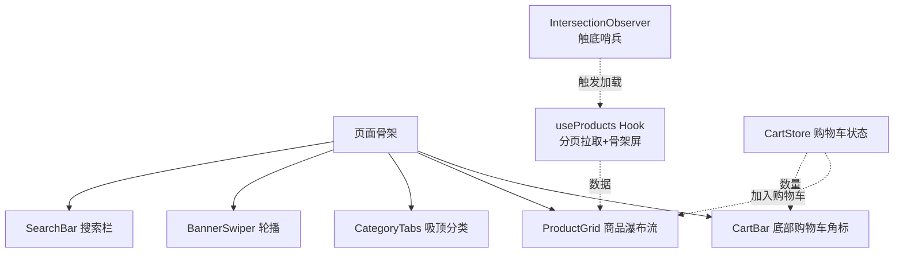

# 电商首页：Tailwind CSS 综合实战

> 前置：[[前端开发/02-CSS框架/Tailwind-CSS/01-Tailwind基础|Tailwind 入门]]、[[前端开发/02-CSS框架/Tailwind-CSS/03-自定义主题|响应式设计与定制]]、[[前端开发/01-基础/JavaScript/05-异步编程|异步编程]]、[[前端开发/04-DOM与交互/HTML-DOM/02-DOM操作与事件|DOM 操作与事件]]
>
> 目标：用 Tailwind CSS 完成移动端优先的电商首页——轮播、分类吸顶、瀑布流商品、无限滚动、购物车角标。它与 [[前端开发/08-项目实战/02-后台管理系统|后台管理系统]] 构成"前台 C 端 + 后台 B 端"的作品集闭环。

---

## 1. 项目形态与移动端优先

C 端电商流量八成来自手机，因此本章采用**移动优先**策略：所有样式先写小屏默认态，再用 `sm:` `md:` 前缀向大屏增强——这与后台项目"先桌面后兼容移动"的顺序正好相反。



### 快速起步：CDN 方式

学习与原型阶段用 CDN 最快，无需构建：

```html
<!DOCTYPE html>
<html lang="zh-CN">
<head>
  <meta charset="UTF-8">
  <meta name="viewport" content="width=device-width, initial-scale=1.0">
  <script src="https://cdn.tailwindcss.com"></script>
  <!-- 自定义 theme 色：CDN 模式通过内联配置注入 -->
  <script>
    tailwind.config = {
      theme: {
        extend: {
          colors: {
            brand: { DEFAULT: '#ff5000', dark: '#e04800', light: '#fff3ec' },
          },
        },
      },
    };
  </script>
</head>
<body class="bg-gray-50">
  <!-- 页面内容 -->
</body>
</html>
```

正式项目应改用构建集成（`npm install -D tailwindcss postcss autoprefixer` 后配置 `tailwind.config.js`），CDN 的运行时编译有约 300KB 开销且官方明确不建议生产使用。两者类名语法完全一致，本章示例可直接迁移。

## 2. 页面骨架

```html
<body class="bg-gray-50 text-gray-900 antialiased">

  <!-- 搜索栏 -->
  <header class="sticky top-0 z-40 flex items-center gap-3 bg-white px-4 py-2 shadow-sm">
    <div class="flex-1 rounded-full bg-gray-100 px-4 py-2 text-sm text-gray-400">
      <i class="fa-solid fa-magnifying-glass mr-2"></i>搜索商品名称
    </div>
    <a href="#" class="text-sm text-brand">登录</a>
  </header>

  <!-- 轮播区 -->
  <section id="banner" class="px-4 pt-3"></section>

  <!-- 分类吸顶 tab -->
  <nav id="cateTabs"
       class="sticky top-[52px] z-30 flex gap-6 overflow-x-auto bg-white px-4 py-3
              text-sm whitespace-nowrap">
    <button data-cate="all"     class="tab-active">推荐</button>
    <button data-cate="digital" class="text-gray-500">数码</button>
    <button data-cate="clothes" class="text-gray-500">服饰</button>
    <button data-cate="food"    class="text-gray-500">食品</button>
    <button data-cate="home"    class="text-gray-500">家居</button>
  </nav>

  <!-- 商品瀑布流 -->
  <main id="productGrid"
        class="grid grid-cols-2 gap-3 p-3 md:grid-cols-4 lg:grid-cols-5">
  </main>

  <!-- 加载哨兵与底部提示 -->
  <div id="sentinel" class="h-10"></div>
  <p id="listFooter" class="pb-24 text-center text-sm text-gray-400">上拉加载更多</p>

  <!-- 底部购物车条 -->
  <footer class="fixed inset-x-0 bottom-0 z-40 border-t border-gray-100 bg-white/95 px-4 py-2
                 backdrop-blur">
    <button id="cartBtn" class="relative ml-auto flex h-11 w-11 items-center justify-center
                                rounded-full bg-brand text-white shadow-lg shadow-brand/40">
      <i class="fa-solid fa-cart-shopping"></i>
      <span id="cartBadge" hidden
            class="absolute -top-1 -right-1 flex h-5 min-w-5 items-center justify-center
                   rounded-full bg-red-500 px-1 text-xs font-bold text-white">0</span>
    </button>
  </footer>

  <script src="https://cdnjs.cloudflare.com/ajax/libs/font-awesome/6.5.1/css/all.min.css"></script>
  <script src="js/app.js" defer></script>
</body>
```

吸顶细节：搜索栏 `top-0`，分类 tab 用 `top-[52px]`（任意值语法）紧贴其下，两层 sticky 叠出"头部常驻 + 分类次级吸顶"的经典电商布局。

## 3. 自定义 theme 色的使用

上面 `tailwind.config` 注入的 `brand` 色板生成了一整套工具类：

| 类名 | 效果 |
|------|------|
| `bg-brand` | 主色背景（购买按钮、购物车） |
| `bg-brand-light` | 浅色底（优惠券、标签底色） |
| `text-brand` | 主色文字（价格、链接） |
| `shadow-brand/40` | 带透明度的品牌色阴影 |
| `hover:bg-brand-dark` | hover 深化 |

原则：**业务语义色必须进 config，禁止在模板里裸写十六进制值**。改主色时只动配置一处，全站生效——这是 Tailwind 相对手写 CSS 在工程上的核心收益。更多定制手法见 [[前端开发/02-CSS框架/Tailwind-CSS/03-自定义主题|响应式设计与定制]]。

## 4. 轮播：Swiper 引入

自写轮播要处理触摸滑动、循环、自动播放等十几个边界，直接用 Swiper：

```html
<!-- 轮播区替换占位 -->
<link rel="stylesheet" href="https://cdn.jsdelivr.net/npm/swiper@11/swiper-bundle.min.css">
<script src="https://cdn.jsdelivr.net/npm/swiper@11/swiper-bundle.min.js"></script>
```

```js
// js/swiper-init.js
const banners = [
  { img: 'assets/banner-1.jpg', href: '/activity/seckill' },
  { img: 'assets/banner-2.jpg', href: '/activity/newyear' },
  { img: 'assets/banner-3.jpg', href: '/activity/coupon' },
];

document.getElementById('banner').innerHTML = `
  <div class="swiper h-[140px] overflow-hidden rounded-xl md:h-[240px]">
    <div class="swiper-wrapper">
      ${banners.map(b => `
        <a class="swiper-slide" href="${b.href}">
          
        </a>`).join('')}
    </div>
    <div class="swiper-pagination"></div>
  </div>`;

new Swiper('.swiper', {
  loop: true,
  autoplay: { delay: 3500, disableOnInteraction: false },
  pagination: { el: '.swiper-pagination', clickable: true },
});
```

要点：图片一律 `object-cover` 防拉伸；容器高度用任意值 `h-[140px]` 并随断点放大；每张 slide 是完整的 `<a>`，保证可点击区域即视觉区域。

## 5. 商品瀑布流与骨架屏

### 5.1 数据层 hook

```js
// js/api.js —— 分页商品接口（mock）
const PAGE_SIZE = 10;
let seq = 0;

function makeProduct(i) {
  const cates = ['digital', 'clothes', 'food', 'home'];
  return {
    id: i,
    name: ['无线蓝牙耳机', '纯棉T恤', '坚果礼盒', '香薰蜡烛'][i % 4] + ` 第${i}款`,
    price: +(19.9 + Math.random() * 480).toFixed(2),
    sales: Math.round(Math.random() * 20000),
    cate: cates[i % 4],
    img: `https://picsum.photos/seed/p${i}/300/300`,
  };
}

export function fetchProducts(page, cate = 'all') {
  return new Promise(resolve =>
    setTimeout(() => {
      const all = Array.from({ length: PAGE_SIZE }, (_, k) => makeProduct(seq + k))
        .filter(p => cate === 'all' ? true : p.cate === cate);
      seq += PAGE_SIZE;
      resolve(all);        // 真实环境换成 fetch(`/api/products?page=${page}&cate=${cate}`)
    }, 600)
  );
}
```

```js
// js/products.js —— 列表状态机
import { fetchProducts } from './api';

const state = {
  page: 0, cate: 'all', loading: false, finished: false, items: [],
};

export async function loadMore() {
  if (state.loading || state.finished) return;   // 防重入是无限滚动的第一守则
  state.loading = true;
  renderSkeleton();

  const batch = await fetchProducts(state.page + 1, state.cate);
  state.items.push(...batch);
  state.page += 1;
  state.loading = false;
  // 返回不足一页视为到底
  if (batch.length === 0) {
    state.finished = true;
    document.getElementById('listFooter').textContent = '已经到底啦';
  }
  renderItems(batch);
}

export function switchCate(cate) {
  Object.assign(state, { page: 0, cate, finished: false, items: [] });
  document.getElementById('productGrid').innerHTML = '';
  document.getElementById('listFooter').textContent = '上拉加载更多';
  loadMore();
}
```

### 5.2 骨架屏

数据到达前渲染灰色占位块，消除布局跳动：

```js
function renderSkeleton() {
  const tpl = Array.from({ length: 4 }).map(() => `
    <div class="animate-pulse space-y-2 rounded-lg bg-white p-2">
      <div class="aspect-square rounded bg-gray-200"></div>
      <div class="h-3 w-4/5 rounded bg-gray-200"></div>
      <div class="h-3 w-1/2 rounded bg-gray-200"></div>
    </div>`).join('');
  document.getElementById('productGrid').insertAdjacentHTML('beforeend', tpl);
}

function clearSkeleton() {
  document.querySelectorAll('#productGrid .animate-pulse')
          .forEach(el => el.remove());
}
```

`animate-pulse` 是 Tailwind 内置的呼吸动画；`aspect-square` 保证占位图与真实商品图比例一致，加载完成后不发生位移。

### 5.3 商品卡片

```js
function productCard(p) {
  return `
  <article class="overflow-hidden rounded-lg bg-white transition hover:shadow-md">
    
    <div class="space-y-1 p-2">
      <h3 class="line-clamp-2 min-h-8 text-xs leading-4 md:text-sm">${p.name}</h3>
      <p class="text-brand">
        <span class="text-[10px]">¥</span>
        <span class="text-base font-bold">${p.price}</span>
      </p>
      <div class="flex items-center justify-between">
        <span class="text-[10px] text-gray-400">已售 ${p.sales}</span>
        <button data-add="${p.id}"
                class="rounded-full bg-brand px-2.5 py-1 text-[10px] text-white active:bg-brand-dark">
          加入购物车
        </button>
      </div>
    </div>
  </article>`;
}

function renderItems(batch) {
  clearSkeleton();
  const grid = document.getElementById('productGrid');
  grid.insertAdjacentHTML('beforeend', batch.map(productCard).join(''));
}
```

实用类速记：`line-clamp-2` 两行截断加省略号；`min-h-8` 让一行标题也保持两行高度，卡片对齐；`active:bg-brand-dark` 处理移动端的按压反馈（移动端没有 hover）。

## 6. 无限滚动：IntersectionObserver 触底加载

```js
// js/infinite-scroll.js
import { loadMore } from './products';

const sentinel = new IntersectionObserver(entries => {
  entries.forEach(entry => {
    if (entry.isIntersecting) loadMore();   // 哨兵进入视口即加载下一页
  });
}, { rootMargin: '200px' });               // 提前 200px 预加载，用户无感

sentinel.observe(document.getElementById('sentinel'));

loadMore();                                 // 首屏先填一页
```

对比传统 scroll 监听：不需要节流、不需要手动计算高度差、rootMargin 天然实现预加载距离。切分类时旧 sentinel 依然有效，因为观察的是固定占位元素而非列表本身。原理详解见 [[前端开发/08-项目实战/01-响应式企业官网|企业官网实战]] 的动效章节。

## 6.1 分类 tab 的切换与高亮

吸顶 tab 不仅要能点，还要维护"当前分类"的高亮态：

```js
// js/tabs.js
import { switchCate } from './products';

const tabs = document.querySelectorAll('#cateTabs [data-cate]');

tabs.forEach(tab => {
  tab.addEventListener('click', () => {
    // 高亮态切换：主色加粗 vs 灰色常规，视觉即状态
    document.querySelector('.tab-active')?.classList.remove('tab-active');
    tab.classList.add('tab-active');
    tab.classList.remove('text-gray-500');

    switchCate(tab.dataset.cate);          // 重置分页并重新拉取
  });
});
```

```css
/* style.css —— 配合 Tailwind 少量自定义类 */
.tab-active {
  color: var(--tw-color-brand, #ff5000);
  font-weight: 600;
}
```

注意两个细节：切换分类必须**重置 page 与 finished 标记**（第 5.1 节的 `switchCate` 已处理），否则新分类从第 5 页开始拉取；高亮类名与 Tailwind 工具类并存时，先移除 `text-gray-500` 再加自定义类，避免优先级纠缠。

## 7. 购物车角标状态

```js
// js/cart.js
const cart = new Map();   // productId -> quantity

export function addToCart(id, name) {
  cart.set(id, (cart.get(id) ?? 0) + 1);
  renderBadge();
}

function renderBadge() {
  const total = [...cart.values()].reduce((s, n) => s + n, 0);
  const badge = document.getElementById('cartBadge');
  badge.hidden = total === 0;
  badge.textContent = total > 99 ? '99+' : total;
  // 弹跳动画：移除再添加类，强制重新触发
  badge.classList.remove('animate-bounce');
  void badge.offsetWidth;
  if (total > 0) badge.classList.add('animate-bounce');
}

// 事件委托：所有"加入购物车"按钮共用一个监听器
document.getElementById('productGrid').addEventListener('click', e => {
  const btn = e.target.closest('[data-add]');
  if (!btn) return;
  addToCart(Number(btn.dataset.add));
});
```

两个模式值得记住：**角标隐藏用 `hidden` 属性**而非条件拼接 DOM；**动态插入的商品按钮靠事件委托**绑定——瀑布流每次追加节点，逐个 addEventListener 既浪费又会泄漏。

## 8. 移动端适配要点

### rem 方案 vs viewport 方案

| 维度 | postcss-pxtorem（rem 方案） | viewport 单位方案（vw/vh 或 postcss-to-viewport） |
|------|----------------------------|---------------------------------------------------|
| 原理 | px 编译为 rem，JS/CSS 动态设置根字号 | px 编译为 vw，随屏宽线性缩放 |
| 兼容性 | 全兼容 | iOS 8+/Android 4.4+，如今可视为无障碍 |
| 极端屏幕 | 可钳制根字号上下限 | 宽屏等比放大需额外处理 |
| 与 Tailwind 配合 | 需关闭其默认 rem 体系或做映射 | 直接把设计稿 px 转 vw 即可 |
| 适用场景 | 需要大字号模式、无障碍缩放的产品 | 纯视觉还原型 H5 活动页 |

结论：**新项目优先 Tailwind 原生的响应式断点体系**（它本身就是 rem 基准），只在拿到严格按 iPhone 375 设计稿还原的需求时才引入转换插件。不要为了适配而叠加多套机制。

### 其他必做项

- 触控目标最小 44x44：本章购物车按钮 `h-11 w-11` 正好达标；
- 点击反馈用 `active:` 变体而不是 `hover:`；
- 底部固定条预留安全区：`pb-[env(safe-area-inset-bottom)]`；
- 输入框字号至少 16px，防止 iOS 自动放大页面。

## 9. 性能清单

| 项目 | 做法 | 本章落点 |
|------|------|---------|
| 图片懒加载 | `loading="lazy"` + 固定宽高比防抖动 | 商品卡 `loading="lazy"` + `aspect-square` |
| 解码不阻塞 | `decoding="async"` | 同上 |
| 首屏指标概念 | LCP 最大内容绘制应 < 2.5s：首图 preload、压缩、就近 CDN | 轮播首图可用 `<link rel="preload" as="image">` |
| CLS 累积偏移 < 0.1 | 所有媒体元素声明尺寸或比例 | 骨架屏与 `aspect-*` 类 |
| INP 交互延迟 < 200ms | 长列表用事件委托，避免海量监听器 | 第 7 节委托写法 |
| JS 体积 | 生产禁用 Tailwind CDN，改构建版按需生成 | 见 [[前端开发/09-融会贯通/01-前端工程化：构建与模块\|前端工程化]] |

验证方式：Chrome DevTools 的 Lighthouse 面板跑一次移动端报告，对照上表逐项检查，这组指标名也是面试高频词。

## 10. 作品集闭环建议

至此作品集有了两件套：[[前端开发/08-项目实战/02-后台管理系统|B 端后台]]（Vue3 + Element Plus）负责商品的增删改查，本章的 **C 端商城**负责展示这些商品。把它们串成一个故事：

1. 后台新增一件商品入库（对接 [[java/3工程化/06_Spring Boot快速开发|Spring Boot]] 接口）；
2. 商城首页刷新后出现该商品（同一个数据库的两端视图）；
3. 商城下单改变库存，后台表格里的库存数同步变化。

面试中讲清楚这条数据闭环，比再多十个独立 demo 更能证明工程理解。

---

## 小结

本章用 Tailwind 完成了移动端电商首页的全部关键交互：Swiper 轮播、双层吸顶、骨架屏、无限滚动、事件委托的购物车角标。核心收获是把 Tailwind 的原子类当作"设计系统的词汇表"来组织界面——当你发现自己重复写同一串类名超过三次，就该抽组件了。
