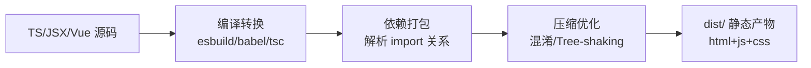
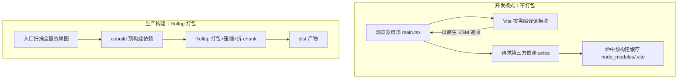

# 前端工程化：构建与模块

> 前置：[[npm|npm 教程]]、[[前端开发/01-基础/TypeScript/01-TS基础与类型系统|TS 基础]]、[[前端开发/08-项目实战/02-后台管理系统|后台管理系统实战]]
>
> 目标：搞懂现代前端的"基础设施层"——为什么需要构建工具、模块如何演化到 ESM、Vite 快在哪、package.json 与环境变量怎么配、代码规范工具链怎么搭、产物如何分析与优化。这是从"会写页面"到"能维护工程"的分水岭。

---

## 1. 为什么浏览器不直接跑源码

你在编辑器里写的代码，浏览器一个字都认不全：

| 你写的 | 浏览器认识的 |
|--------|-------------|
| `.ts` / `.vue` / `.jsx` 文件 | 只有 `.js`（且是特定语法集） |
| JSX `<Comp a={1}/>` | 必须编译成 `createElement` 调用 |
| SCSS / Less 嵌套语法 | 只有原生 CSS |
| `import` 第三方裸模块名（`import axios from 'axios'`） | 只认 URL 或相对路径 |

所以**必须有一个"翻译 + 打包"的环节**把源码加工成浏览器可执行的静态资源，这就是构建工具的本质职责：



## 2. 模块化简史：script 标签到 ESM

理解构建工具为什么长成今天这样，要看模块方案的三个时代。

**原始社会：全局作用域。** 多个 `<script>` 标签顺序执行，文件间靠全局变量通信：

```html
<script src="jquery.js"></script>   <!-- 挂载全局 $ -->
<script src="app.js"></script>      <!-- 使用 $ -->
```

问题：命名冲突、依赖关系靠人脑记忆、加载顺序错一行全站崩。

**CommonJS：服务端的答案。** Node.js 采用 `require`/`module.exports`，同步读取文件：

```js
const path = require('path');
module.exports = { format: p => path.basename(p) };
```

它解决了依赖管理，但"同步 IO 加载"在浏览器网络环境下不现实，且浏览器原生不认识 require——早期前端只能靠 Browserify/Webpack 把整棵依赖树打包成一个文件。

**过渡时代：AMD 与 UMD。** 浏览器等不及 CommonJS 的标准化移植，RequireJS 提出 AMD 规范——异步定义模块：

```js
// AMD：依赖前置，异步加载
define(['jquery', 'underscore'], function ($, _) {
  return { init() { /* ... */ } };
});
```

后来社区又出现 UMD 这种兼容写法：一段代码同时适配 CommonJS、AMD 和全局变量。jQuery 时代的插件头部那一大坨 `typeof define === 'function'` 判断就是 UMD。它们都是历史产物，如今只在老项目里能见到，但读懂它们对维护存量代码很有价值。

**ESM：语言的最终答案。** ES2015 把模块写进语言标准：

```js
import { format } from './utils.js';
export default format;
```

静态结构让打包器能做 Tree-shaking（删除未引用导出），`import()` 动态导入则给了按需加载的能力。今天的 Vite 开发模式甚至不再需要打包——浏览器自己就能跑 ESM。

一句话总结演进逻辑：**依赖管理的责任从"人的约定"逐步移交给了"语言规范"，构建工具随之从"必需品"演化为"优化器"**。

## 3. Node 与 npm 生态定位

前端工程链全部跑在 Node.js 上：Vite 是 Node 程序，ESLint 是 Node 程序，连 TypeScript 编译器也是。Node 提供运行时，npm 提供包生态——包的安装、版本解析、lockfile 机制、scripts 任务系统等通用概念，详见 [[npm|npm 教程]]，本章只补前端视角的两个要点：

1. **`node_modules` 不是源码的一部分**，永远进 `.gitignore`；还原环境的依据是 `package.json` + 锁文件；
2. **前端包分两类心智**：进产物的 dependencies（vue、axios），只在开发期用的 devDependencies（vite、eslint）。装错了不影响运行但会让 CI 变慢、体积审计混乱。

### 包管理器三选一

| 维度 | npm | yarn | pnpm |
|------|-----|------|------|
| 安装速度 | 一般 | 较快 | 最快 |
| 磁盘占用 | 高（逐项目拷贝） | 中 | 极低（硬链接共享仓库） |
| 幽灵依赖 | 存在（扁平化副作用） | 存在 | 天然杜绝 |
| monorepo | 一般 | workspace 成熟 | workspace 强 |
| 现状 | Node 内置默认 | 老项目常见 | 新项目趋势 |

幽灵依赖解释：npm/yarn 把依赖拍平后，你 `require` 一个没在 package.json 里声明的传递依赖也能成功；pnpm 的符号链接结构让它直接报错，依赖声明被迫诚实。团队新项目建议 pnpm，存量项目跟着锁文件走不要中途换。

## 4. Vite 为什么快

### 4.1 webpack 时代的痛点

webpack 冷启动要先把整个应用从入口开始递归分析、编译、打包成 bundle 才能启动 dev server。项目越大，启动越慢，改一行代码的热更新也要重新跑一遍受影响的依赖图。

### 4.2 Vite 的两个核心手段



第一刀：**开发期用原生 ESM，按需编译**。dev server 启动几乎零成本，因为根本没打包；浏览器请求哪个模块就即时转换哪个，改代码后的 HMR 只失效当前模块边界。

第二刀：**依赖预构建用 esbuild**。第三方包（如 lodash-es 内部几百个小文件）被 esbuild 用 Go 写的速度预先合并成单文件缓存在 `node_modules/.vite`，后续请求直接命中缓存。

代价是开发与生产行为可能不一致（预构建的是依赖，生产走 Rollup），所以上线前必须 `npm run build && npm run preview` 验证一次。

### 4.3 一句话对照

> webpack：先打包后启动，启动成本与项目大小成正比；Vite：先启动后取用，启动成本近似常数。

### 4.4 一个典型的 vite.config.ts

把本章涉及的配置集中看一眼全貌：

```ts
// vite.config.ts
import { defineConfig, loadEnv } from 'vite';
import vue from '@vitejs/plugin-vue';
import path from 'node:path';

export default defineConfig(({ mode }) => {
  // loadEnv 读取 .env.[mode] 文件，供 vite 自身使用
  const env = loadEnv(mode, process.cwd());

  return {
    plugins: [vue()],

    resolve: {
      alias: { '@': path.resolve(__dirname, 'src') },   // 与 tsconfig.paths 保持一致
    },

    server: {
      port: 5173,
      proxy: {
        '/api': {
          target: env.VITE_PROXY_TARGET ?? 'http://localhost:8080',
          changeOrigin: true,
        },
      },
    },

    build: {
      sourcemap: false,
      target: 'es2020',
      rollupOptions: {
        output: {
          manualChunks: {
            vue: ['vue', 'vue-router', 'pinia'],
            vendor: ['axios', 'dayjs'],
          },
        },
      },
    },
  };
});
```

这份配置里的 `server.proxy` 是本地联调的关键，完整原理在 [[前端开发/09-融会贯通/02-Java全栈前后端联调|前后端联调]] 章详解。

## 5. package.json 关键字段

```jsonc
{
  "name": "admin-pro",
  "version": "1.0.0",
  "private": true,                       // 防止误发布到 npm
  "type": "module",                      // 按 ESM 解析 .js 文件
  "engines": { "node": ">=20" },         // 声明运行时要求
  "scripts": {
    "dev": "vite",
    "build": "tsc -b && vite build",     // 先类型检查再打包
    "preview": "vite preview",
    "lint": "eslint . --ext .ts,.tsx,.vue",
    "format": "prettier --write ."
  },
  "dependencies": {                      // 进产物的运行时依赖
    "vue": "^3.4.0",
    "pinia": "^2.1.0"
  },
  "devDependencies": {                   // 仅工程链使用
    "vite": "^5.2.0",
    "typescript": "^5.4.0"
  }
}
```

版本号语义：`^3.4.0` 允许小版本与补丁升级（锁定大版本），`~3.4.0` 只允许补丁。真正决定装什么的是**锁文件**（package-lock.json / pnpm-lock.yaml）——提交锁文件到 git，团队成员与 CI 才能得到字节级一致的环境。

### scripts 的三个实用技巧

```jsonc
{
  "scripts": {
    "build": "vite build",
    "pretest": "eslint .",          // 1) pre/post 前缀：跑 test 前自动执行 pretest
    "test": "vitest run",
    "deploy": "npm run build && node scripts/upload.js",
    "dev": "vite --mode staging"    // 2) 直接传 CLI 参数指定模式
  }
}
```

第三个技巧在命令行：`npm run dev -- --port 3000`，双横线后的参数透传给脚本本体。CI 流水线里大量使用这种组合方式，无需为每个环境单写脚本。

## 6. 环境变量与多模式

同一份代码要在开发联调、测试、生产之间切换接口地址。Vite 约定 `.env` 系列文件：

```bash
# .env                    —— 所有模式生效
VITE_APP_TITLE=云舟后台

# .env.development        —— npm run dev 生效
VITE_API_BASE=/api
VITE_USE_MOCK=true

# .env.production         —— npm run build 生效
VITE_API_BASE=https://api.example.com
VITE_USE_MOCK=false
```

代码中通过 `import.meta.env` 访问：

```ts
const apiBase = import.meta.env.VITE_API_BASE;
console.log(import.meta.env.MODE);          // 'development' | 'production'
```

安全红线：**只有 `VITE_` 前缀的变量会进入客户端产物，因此任何密钥都不能加这个前缀放进前端**——产物里的"环境变量"本质是构建期的字符串替换，人人可读。真正的秘密应放在后端。

## 7. 代码规范工具链

一套现代标配：ESLint 管"对错"，Prettier 管"好看"，husky 管"强制执行"。

```bash
npm install -D eslint prettier eslint-config-prettier \
               husky lint-staged
npx husky init
```

```js
// eslint.config.js（扁平配置）
export default [
  { ignores: ['dist/**'] },
  {
    files: ['**/*.{ts,tsx,vue}'],
    languageOptions: { parserOptions: { ecmaVersion: 'latest' } },
    rules: {
      'no-console': 'warn',            // 生产代码少留 console
      eqeqeq: ['error', 'always'],     // 禁止 == 宽松比较
      'no-unused-vars': 'error',
    },
  },
];
```

```json
// .prettierrc —— 与 ESLint 冲突项交给 eslint-config-prettier 关闭
{
  "semi": true,
  "singleQuote": true,
  "printWidth": 100,
  "trailingComma": "all"
}
```

```json
// package.json 追加：提交前自动修复暂存区文件
{
  "lint-staged": {
    "*.{ts,tsx,vue}": ["eslint --fix", "prettier --write"],
    "*.{css,json,md}": ["prettier --write"]
  }
}
```

```bash
# .husky/pre-commit —— git 提交时的最后一道闸
npx lint-staged
```

分工原则记牢：**格式争议全部丢给 Prettier 自动解决，ESLint 只保留真正影响正确性与可维护性的规则**。团队规范文档写得再好，不如一次 pre-commit 钩子有效。

## 8. tsconfig 前端常用项

```jsonc
{
  "compilerOptions": {
    "target": "ES2020",              // 编译目标语法级别
    "lib": ["ES2020", "DOM"],        // 可用的类型声明环境
    "module": "ESNext",
    "moduleResolution": "bundler",   // 配合打包器的模块解析策略

    "strict": true,                  // 全家桶严格检查，新项目必开
    "noUnusedLocals": true,
    "noUnusedParameters": true,

    "baseUrl": ".",
    "paths": { "@/*": ["src/*"] },   // @ 别名，告别 ../../ 地狱
    "types": ["vite/client"]         // 让 TS 认识 import.meta.env
  },
  "include": ["src/**/*.ts", "src/**/*.tsx", "src/**/*.vue"]
}
```

注意 `paths` 只是告诉 TS 如何找类型，**运行时路径解析由构建器负责**——Vite 里还要在 `resolve.alias` 配一份同样的映射，两处必须一致。TS 类型系统本身的深入学习见 [[前端开发/01-基础/TypeScript/02-TS进阶类型|TS 进阶类型]]。

## 9. Source Map：线上调试的桥

构建产物经过压缩混淆后长这样：

```js
// 压缩后：变量名丢失、多行合一
!function(){var e=document.querySelector("#app");e.innerHTML="ok"}();
```

报错栈指向第 1 行第 12 列，完全无法定位。Source map 是一份映射表（`.map` 文件），记录了**产物每个位置对应源文件的行列号**，DevTools 据此自动还原本来的 TS/Vue 代码调试。

```jsonc
// vite.config.ts
export default defineConfig({
  build: {
    sourcemap: false,   // 生产一般不发布 sourcemap（暴露源码）
                        // 但可上传到 Sentry 等错误监控平台做符号化
  },
});
```

实践建议：本地开发永远开启（默认开）；生产环境产物不带 map，出错时通过错误监控平台配合上传的 map 还原堆栈——这也是 [[java/3工程化/16_应急处理与线上问题排查|线上问题排查]] 思路在前端的对应物。

## 10. 产物分析与优化

### 10.1 先测量再动手

```bash
npm install -D rollup-plugin-visualizer
```

```ts
// vite.config.ts
import { visualizer } from 'rollup-plugin-visualizer';

export default defineConfig({
  plugins: [
    visualizer({ open: true, gzipSize: true }),   // 构建完自动打开体积报告
  ],
});
```

矩形面积即模块体积占比。典型发现：moment 连带全部语言包占 300KB（换 day.js）、lodash 整包引入（换 `lodash-es` 按需导入）、某个组件库被整包打进主 chunk。

### 10.2 manualChunks 拆包

默认策略把所有代码打进少数几个大文件，首屏被迫下载全部。手动拆分的思路是**按变更频率分组**：

```ts
// vite.config.ts
export default defineConfig({
  build: {
    rollupOptions: {
      output: {
        manualChunks: {
          vue: ['vue', 'vue-router', 'pinia'],       // 框架：极少变化，长缓存
          vendor: ['axios', 'dayjs'],                // 三方工具：偶尔升级
          charts: ['echarts'],                       // 重型库：拆离主路径
        },
      },
    },
  },
});
```

收益有两层：并行下载多个中等文件优于单个巨文件；业务代码天天改也不影响框架 chunk 的浏览器缓存。

### 10.3 压缩与传输

| 层级 | 手段 | 说明 |
|------|------|------|
| 构建期 | minify（默认 esbuild） | 删除空白、缩短变量名、Tree-shaking 死代码 |
| 构建期 | 动态导入 `import()` | 路由级懒加载，非首屏代码延后 |
| 传输层 | gzip | 所有浏览器兼容，压缩率约 70% |
| 传输层 | brotli | 比 gzip 再省 15%-20%，需 HTTPS，Nginx 模块支持 |

Nginx 侧开启双压缩并优先 brotli：

```nginx
gzip on;
gzip_types application/javascript text/css application/json;
gzip_comp_level 6;

brotli on;
brotli_types application/javascript text/css application/json;
```

验证闭环：`curl -H "Accept-Encoding: br,gzip" -I https://site.com/assets/index.js` 看响应头 Content-Encoding；Lighthouse 对比优化前后分数。

---

## 11. 常见问题

**问：构建产物报"Unexpected token '<'"是什么鬼？**
答：HTML 被当作 JS 返回了——通常是部署后刷新页面命中了 SPA 路由（如 `/user/detail`），服务器没有配置回退到 index.html，返回了 404 页面。Nginx 加 `try_files $uri $uri/ /index.html;`。

**问：本地好好的，一打包就报类型错误？**
答：`npm run dev` 不做完整类型检查（esbuild 只删类型不检查），而 build 前跑了 `tsc -b`。这是特性不是 bug——开发期配合编辑器实时提示，提交前手动跑一次 `tsc --noEmit` 兜底。

**问：依赖装不上 / 安装巨慢怎么办？**
答：切换镜像源 `npm config set registry https://registry.npmmirror.com`；团队项目优先用锁文件 + 本地缓存代理，不要直接改 package.json 的版本号。

**问：Tree-shaking 为什么没生效？**
答：常见三个原因——包是 CommonJS 格式（如整包 lodash）；副作用标记缺失（package.json 缺 `"sideEffects": false`）；import 写法引入了命名空间整体（`import * as _`）。换 ESM 版本的包并按具名导入即可。

**问：需要学 webpack 吗？**
答：新项目不需要主动学，但要看懂老项目的配置。概念是通用的：entry、loader、plugin、splitChunks 在任何打包器里都有对应物，理解了本章原理再读 webpack 文档只是查 API。

---

## 小结

工程化的所有环节都服务于同一个目标：**让"源码 → 可信产物 → 线上稳定运行"这条流水线自动化且可复现**。掌握本章后，你已经具备搭建任意新项目脚手架的能力；下一步自然是让这份产物与后端对话——见 [[前端开发/09-融会贯通/02-Java全栈前后端联调|Java 全栈前后端联调]]。
