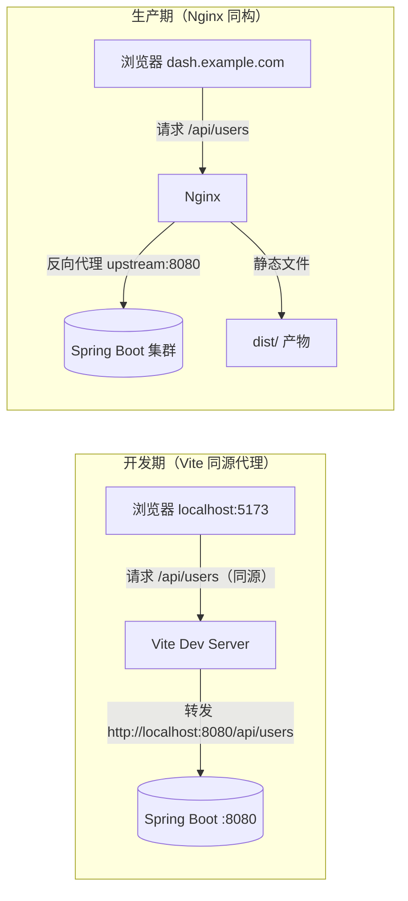
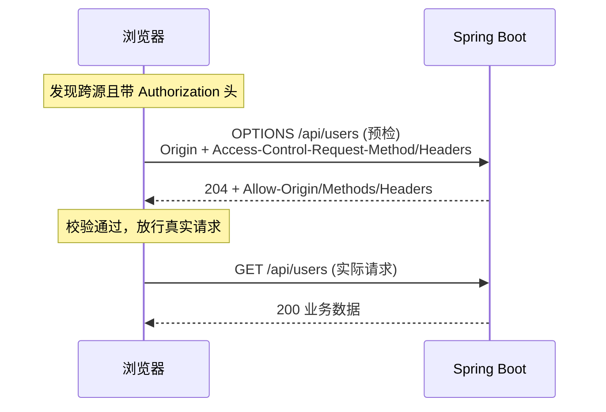
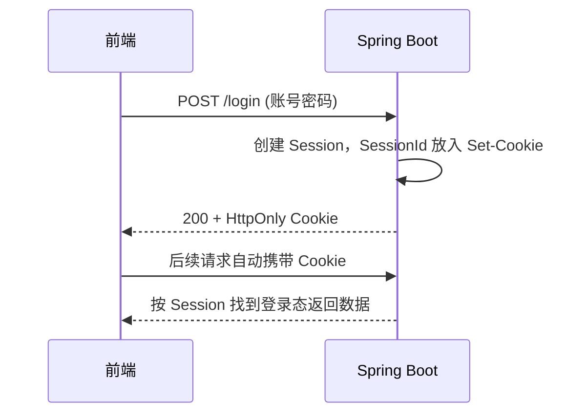
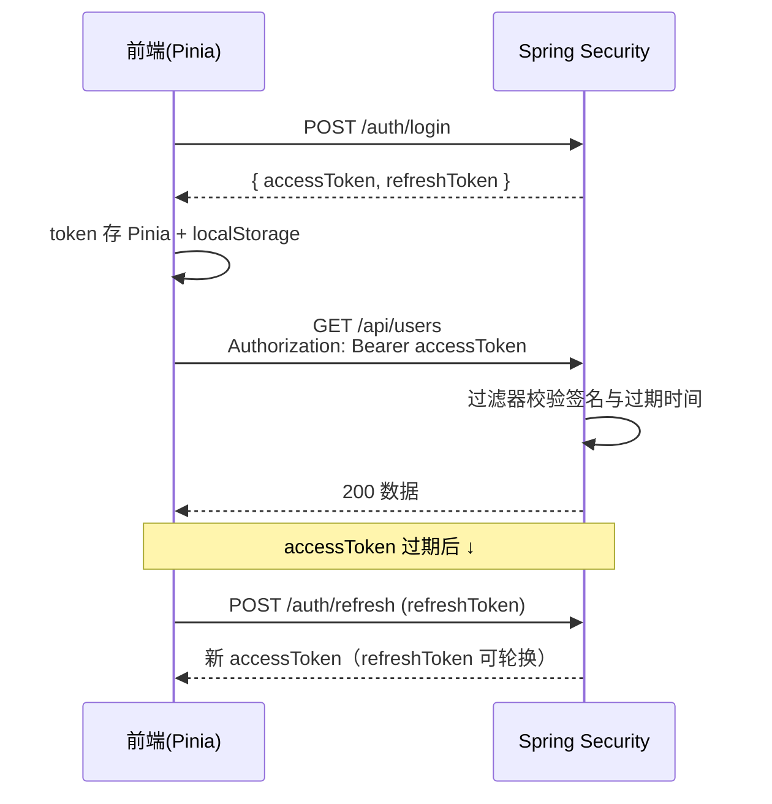

# Java 全栈前后端联调

> 前置：[[前端开发/09-融会贯通/01-前端工程化：构建与模块|前端工程化]]、[[前端开发/04-DOM与交互/AJAX/03-axios与拦截器|axios 与拦截器]]、[[java/3工程化/07_Spring MVC|Spring MVC]]、[[java/3工程化/15_全栈开发技巧|全栈开发技巧]]
>
> 目标：把 Vue/React 前端与 Spring Boot 后端真正"焊"在一起——契约先行、跨域打通、认证贯通、错误归一、上传与长连接、排障有清单。这是全栈工程师的日常主场。

---

## 1. 契约先行：API 文档是两端的合同

联调最大的浪费不是技术问题，而是**两端对接口的理解不一致**：前端等字段、后端改字段、测试环境对不上号。解法是把契约提到编码之前：

1. **先定文档再写代码**：路径、方法、入参出参 JSON 结构、错误码表；
2. **用 OpenAPI（Swagger）作为活文档**：注解即文档，永远与代码同步；
3. **前端基于文档并行 mock**，不等后端接口就绪。

Spring Boot 侧引入 springdoc-openapi 后访问 `/swagger-ui.html` 即可交互调试：

```java
// build.gradle: implementation 'org.springdoc:springdoc-openapi-starter-webmvc-ui:2.5.0'
@RestController
@RequestMapping("/users")
public class UserController {

    @Operation(summary = "分页查询用户")
    @GetMapping
    public PageResult<UserVO> list(
            @Parameter(description = "页码，从 1 开始") @RequestParam(defaultValue = "1") int page,
            @Parameter(description = "每页条数") @RequestParam(defaultValue = "10") int size,
            @RequestParam(required = false) String keyword) {
        return userService.page(page, size, keyword);
    }
}
```

这份文档与 [[java/3工程化/15_全栈开发技巧|全栈开发技巧]] 章的接口设计规范一脉相承；前端 mock 层按它实现同签名函数，正是 [[前端开发/08-项目实战/02-后台管理系统|后台管理系统]] 第 3 节的做法。

## 2. 本地联调拓扑：Vite proxy 解决开发期跨域

开发时前端跑在 `localhost:5173`，后端跑在 `localhost:8080`，端口不同即跨源。**不要在后端为开发期单独开 CORS**，标准做法是让 Vite 开发服务器代为转发：



```ts
// vite.config.ts
export default defineConfig({
  server: {
    proxy: {
      '/api': {
        target: 'http://localhost:8080',
        changeOrigin: true,              // 把 Host 头改成目标地址
        // 后端接口没有 /api 前缀时重写路径：
        // 浏览器请求 /api/users -> 实际到达 /users
        rewrite: path => path.replace(/^\/api/, ''),
      },
    },
  },
});
```

三个配置项的含义：

- `target`：前缀命中的请求转发去哪；
- `changeOrigin`：修改请求 Host 头为目标主机，后端有基于 Host 的校验时必须开；
- `rewrite`：剥掉前端统一加的 `/api` 前缀，让前后端的路径约定互不干扰。

### 与生产 Nginx 的同构思想

注意上面 mermaid 图的对称性：**开发期的 Vite proxy 和生产期的 Nginx 反向代理做的是同一件事**——让浏览器始终以为自己在和"同源的前端服务器"对话：

```nginx
server {
    listen 80;
    server_name admin.example.com;

    location /api/ {
        # 生产环境保留 /api 前缀，直接转发给网关或应用
        proxy_pass http://127.0.0.1:8080/;
        proxy_set_header Host $host;
    }

    location / {
        root /var/www/admin-dist;
        try_files $uri $uri/ /index.html;
    }
}
```

只要前端的 axios `baseURL` 统一写成 `/api`，从开发切到生产**不需要改任何一行代码**——这就是"前缀约定 + 代理同构"的价值。

## 3. CORS 本质：浏览器的同源安全策略

跨源资源共享（CORS）不是后端报错，而是**浏览器拦截了响应**。理解它的关键是区分两类请求。

### 3.1 简单请求与预检请求

同时满足以下条件的才是简单请求：GET/POST/HEAD 方法；Content-Type 仅限三种（application/x-www-form-urlencoded、multipart/form-data、text/plain）；不携带自定义头。

其余一切（比如带 `Authorization` 头、发 JSON）都会触发**预检**：浏览器先发一个 OPTIONS 探路，问服务端"我接下来要用的方法和头你允许吗"，得到许可才发真实请求。



排障启示：看到"一个请求变成两条，OPTIONS 返回 403/404"，就是预检被拒——检查后端是否放行了 OPTIONS 方法和对应自定义头。

### 3.2 Spring 侧两种配置

局部注解（单个 Controller 或方法）：

```java
@CrossOrigin(origins = "http://localhost:5173",
             allowedHeaders = "*",
             allowCredentials = "true")   // 允许携带 Cookie 时必配，且 origins 不能是 *
@GetMapping("/me")
public UserVO me() { return userService.currentUser(); }
```

全局配置（推荐）：

```java
@Configuration
public class CorsConfig implements WebMvcConfigurer {
    @Override
    public void addCorsMappings(CorsRegistry registry) {
        registry.addMapping("/api/**")
                .allowedOriginPatterns("https://*.example.com", "http://localhost:*")
                .allowedMethods("GET", "POST", "PUT", "DELETE", "OPTIONS")
                .allowedHeaders("*")
                .allowCredentials(true)
                .maxAge(3600);   // 预检结果缓存 1 小时，减少 OPTIONS 次数
    }
}
```

两个高频坑：`allowCredentials(true)` 时 origins 必须是明确域名，写 `*` 直接报错；若前面还有 Nginx/Spring Gateway，确保只在一层处理 CORS，重复设置 Allow-Origin 头同样会被浏览器拒绝。

## 4. 认证打通：两种模式的完整链路

### 4.1 Session-Cookie 模式



特点：浏览器全自动管理凭证；`HttpOnly` 使 JS 读不到 Cookie，天然防 XSS 窃取。代价是分布式部署需要 Session 共享（Redis），且跨域名场景受限。前端唯一要做的是 axios 配置 `withCredentials: true`。

### 4.2 JWT 模式



服务端无状态、水平扩展友好，是前后端分离的主流选择。前端封装要点已在 [[前端开发/08-项目实战/02-后台管理系统|后台管理系统]] 实现过：请求拦截器附头、响应拦截器识别 401 跳登录。补上 refresh 的静默续期骨架：

```ts
let refreshing: Promise<string> | null = null;

request.interceptors.response.use(res => res, async err => {
  if (err.response?.status === 401 && !err.config._retried) {
    // 并发多个 401 时只发起一次刷新，其余等待同一个 Promise
    refreshing ??= postRefresh().finally(() => { refreshing = null; });
    try {
      const newToken = await refreshing;
      err.config._retried = true;
      err.config.headers.Authorization = `Bearer ${newToken}`;
      return request(err.config);          // 用新 token 重放原请求
    } catch {
      userStore.logout();                  // refreshToken 也失效，回登录页
    }
  }
  return Promise.reject(err);
});
```

两种模式怎么选：单体或小集群选 Session 简单可靠；多端（Web + App + 小程序）、微服务架构选 JWT。安全细节对比详见 [[java/3工程化/09_Spring Security|Spring Security]]。

## 5. 错误码统一处理

### 5.1 后端 Result 信封

```java
// java 侧统一响应结构
public record Result<T>(int code, String message, T data) {
    public static <T> Result<T> ok(T data)       { return new Result<>(0, "success", data); }
    public static Result<Void> fail(int code, String msg) { return new Result<>(code, msg, null); }
}

// 业务异常由全局处理器翻译成信封，而不是散落的 try-catch
@RestControllerAdvice
public class GlobalExceptionHandler {

    @ExceptionHandler(BusinessException.class)
    public Result<Void> handleBiz(BusinessException e) {
        return Result.fail(e.getCode(), e.getMessage());
    }

    @ExceptionHandler(MethodArgumentNotValidException.class)
    public Result<Void> handleValid(MethodArgumentNotValidException e) {
        String msg = e.getBindingResult().getFieldErrors().stream()
                .map(f -> f.getField() + ": " + f.getDefaultMessage())
                .collect(Collectors.joining("; "));
        return Result.fail(40001, msg);
    }
}
```

### 5.2 前端拦截器归一 + 页面呈现

```ts
// axios 响应拦截：把"HTTP 成功但业务失败"统一转成异常
request.interceptors.response.use(
  res => {
    const { code, data, message } = res.data;
    if (code === 0) return data;
    if (code === 40001) ElMessage.warning(message);   // 参数类错误轻提示
    else ElMessage.error(message || '操作失败');        // 其余常规错误
    return Promise.reject({ code, message });
  },
  err => { /* 网络层错误见第 7 节速查 */ }
);
```

页面里于是只需要关心成功路径，失败时 toast 已经弹过：

```ts
async function onSave() {
  await formRef.value.validate();
  try {
    await saveUser(form);
    ElMessage.success('已保存');
    emit('saved');
  } catch { /* 错误提示已由拦截器完成，这里静默即可 */ }
}
```

分层原则：**网络错误在拦截器、业务错误码在拦截器、纯展示反馈在页面**。三层各管一段，避免每个页面重复写错误分支。

## 6. 文件上传前后端

```vue
<!-- 前端：Element Plus 上传组件 -->
<el-upload
  drag
  action="/api/files"
  name="file"
  :headers="{ Authorization: `Bearer ${token}` }"
  :before-upload="beforeUpload"
  :on-success="onUploaded">
  <el-icon class="text-4xl text-gray-300"><UploadFilled /></el-icon>
  <div class="text-sm">拖拽文件到此，或点击上传（不超过 10MB）</div>
</el-upload>

<script setup lang="ts">
function beforeUpload(file: File) {
  const legalType = ['image/jpeg', 'image/png', 'application/pdf'];
  if (!legalType.includes(file.type)) {
    ElMessage.error('仅支持 jpg / png / pdf');
    return false;                       // 返回 false 阻止上传
  }
  if (file.size > 10 * 1024 * 1024) {
    ElMessage.error('文件不能超过 10MB');
    return false;
  }
  return true;
}
</script>
```

```java
// 后端：MultipartFile 接收
@PostMapping(value = "/files", consumes = MediaType.MULTIPART_FORM_DATA_VALUE)
public Result<FileVO> upload(@RequestPart("file") MultipartFile file) throws IOException {
    if (file.isEmpty()) throw new BusinessException(40002, "文件为空");
    String original = StringUtils.cleanPath(
            Objects.requireNonNull(file.getOriginalFilename()));
    String stored = UUID.randomUUID() + "_" + original;

    Path target = Paths.get(uploadDir).resolve(stored);
    Files.copy(file.getInputStream(), target);

    return Result.ok(new FileVO(stored, original, file.getSize()));
}
```

易错点清单：Content-Type 必须是 multipart/form-data（用 FormData 对象时浏览器自动设置，**手动设错反而坏事**）；大文件要在 Spring 侧放开限制（`spring.servlet.multipart.max-file-size`）；生产环境文件应存对象存储而非本地磁盘，本地目录仅用于演示。

## 7. WebSocket 联调：实时通道

轮询能解决九成"准实时"，剩下的一成（协作编辑、行情推送、告警）才需要 WebSocket。Spring Boot 用 STOMP 子协议最省事：

```java
// 服务端：开启 STOMP
@Configuration
@EnableWebSocketMessageBroker
public class WsConfig implements WebSocketMessageBrokerConfigurer {
    @Override
    public void registerStompEndpoints(StompEndpointRegistry registry) {
        registry.addEndpoint("/ws").setAllowedOriginPatterns("*");
    }
    @Override
    public void configureMessageBroker(MessageBrokerRegistry registry) {
        registry.enableSimpleBroker("/topic");     // 服务端广播前缀
    }
}

@Scheduled(fixedRate = 5000)
public void pushMetrics() {
    template.convertAndSend("/topic/metrics", metricsService.snapshot());
}
```

```ts
// 前端：订阅 + 心跳 + 重连
import { Client } from '@stomp/stompjs';

function connectMetrics(onData: (m: Metrics) => void) {
  const client = new Client({
    brokerURL: 'ws://localhost:8080/ws',
    heartbeatIncoming: 10000,                 // 双向心跳：10 秒
    heartbeatOutgoing: 10000,
    reconnectDelay: 3000,                     // 断线自动重连间隔
    onConnect: () => {
      client.subscribe('/topic/metrics', msg => onData(JSON.parse(msg.body)));
    },
  });
  client.activate();
  return () => client.deactivate();           // 卸载时关闭连接
}

// React 中配合 useEffect 清理：
useEffect(() => connectMetrics(setMetrics), []);
// Vue 中则在 onUnmounted 里调用返回的清理函数
```

心跳的意义：中间的网络设备会把空闲 TCP 连接悄悄掐断，心跳包既是存活探测也是保活信号。原生 WebSocket API 没有 STOMP 那么方便，需要自己实现心跳帧与指数退避重连，逻辑相同。更完整的订阅模型参考 [[前端开发/08-项目实战/03-数据看板|数据看板实战]]。

## 8. 联调排障清单

### 8.1 万能三步

1. **打开 DevTools Network 面板**，看请求四要素：URL 是否符合预期、Status 是多少、请求头带了什么（Authorization/Cookie）、响应体说了什么；
2. **分清是谁的错**：请求根本没发出（前端逻辑）、发出了但 4xx/5xx（后端问题）、发出了也 200 但数据不对（契约偏差）；
3. **必要时断点双端**：前端 Sources 面板断点看参数构造，IDEA Debug 挂住 Controller 入口看接收结果。

### 8.2 高频错误速查表

| 症状 | 大概率原因 | 解法 |
|------|-----------|------|
| 401 Unauthorized | token 没带上 / 过期 / 格式少了 Bearer | 看 Network 请求头；确认拦截器生效顺序 |
| 403 Forbidden | 已认证但权限不足，或预检 OPTIONS 被 Spring Security 拦 | 放行 `/api/**` 的 OPTIONS；核对角色权限 |
| CORS 报错 | 后端未配 Allowed-Origin，或 credentials 与通配符冲突 | 第 3 节配置；确认只有一层在处理 CORS |
| 415 Unsupported Media Type | 发了 JSON 却没写 Content-Type，或后端 consumes 不匹配 | axios 默认已带 application/json；检查手动覆盖 |
| 400 Bad Request | 参数名大小写、日期格式、嵌套结构与文档不符 | 对照 swagger-ui 的 Schema 逐字段核对 |
| OPTIONS 单独失败 | 预检被网关或 Security 拦截 | 全链路（Nginx/Gateway/应用）逐一排查放行 |
| Cookie 带不上 | 跨站且 SameSite=Lax，或没开 withCredentials | axios 配置 withCredentials + 后端 allowCredentials |

### 8.3 一条经验

联调期的问题八成不在代码而在**环境假设**：你以为请求打到 A 环境，实际配置指向 B；你以为字段叫 userId，契约里是 id。所以每次动手前先花一分钟确认"当前到底在和谁通信"——Network 面板的完整 URL 就是事实。

---

## 小结

本章串起了前后端之间的全部接缝：契约先行避免误解，代理同构消灭跨域，双模认证贯通身份，信封加拦截器归一错误，上传与 WebSocket 补齐特殊通道，最后靠一张速查表快速定位故障。到这里，[[前端开发/前端开发目录|前端教程库]] 的主线已经走完——最后一个问题是面对下一个项目该怎么选型，答案在 [[前端开发/09-融会贯通/03-根据需求选择技术栈|根据需求选择技术栈]]。
