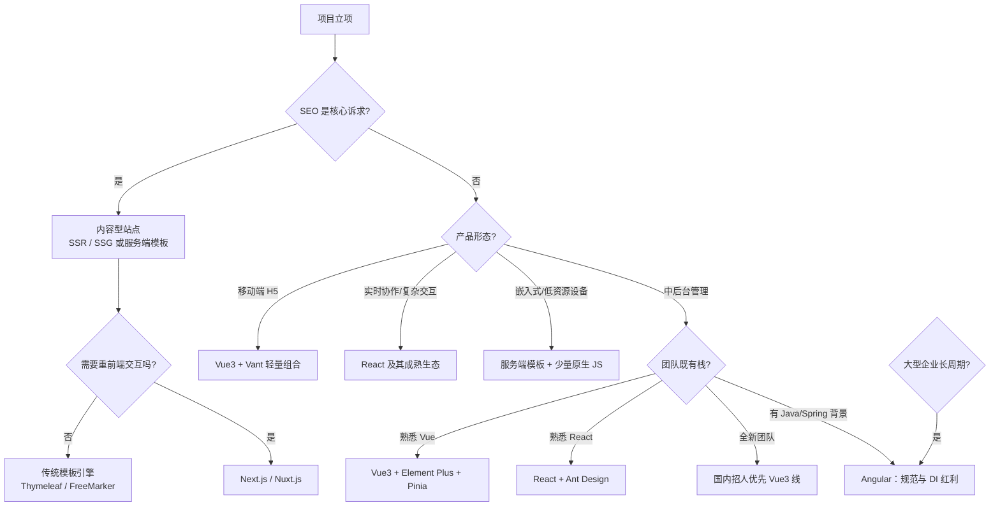
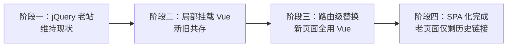
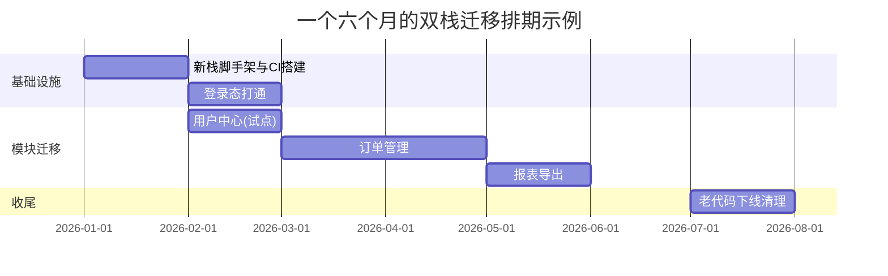
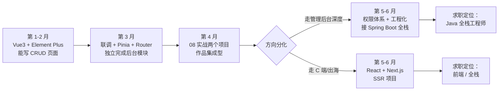
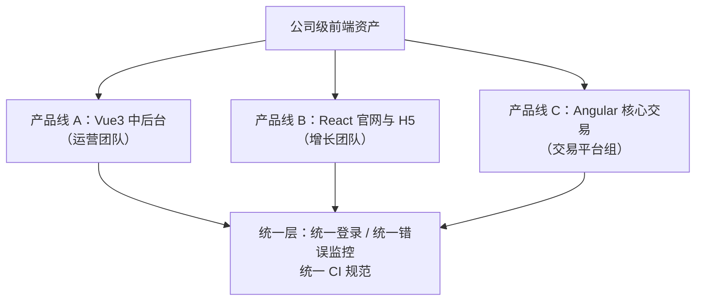

# 根据需求选择技术栈

> 前置：[[前端开发/09-融会贯通/01-前端工程化：构建与模块|前端工程化]]、[[前端开发/03-JS框架/Vue3/01-Vue3基础|Vue3 基础]]、[[前端开发/03-JS框架/React/01-React基础|React 基础]]
>
> 目标：建立一套选型方法论。选型的本质不是"学最好的框架"，而是"在约束条件下选合适的技术"——约束来自团队、周期、业务形态和维护预期。

---

## 1. 选型决策总图



读图方式：先看硬约束（SEO、资源、周期），再看软因素（团队技能、招聘市场）。**硬约束淘汰掉的选项再多理由也不能选**——给纯展示官网上 React SPA 再做 SSR 补救，就是典型的顺序颠倒。

决策图之外，把六大场景与推荐栈的对应关系压缩成速查表：

| 场景 | 首选组合 | 备选 | 一句话判据 |
|------|---------|------|-----------|
| 内容官网 | Thymeleaf 或 Next.js | Nuxt / Astro | 有没有复杂前端交互 |
| 中后台 | Vue3 + Element Plus | React + AntD / Angular | 团队既有栈与招聘市场 |
| 移动 H5 | Vue3 + Vant | React + antd-mobile | 首屏体积预算 |
| 大型长周期 | Angular + TS | Vue3/React + 强规范约束 | 十人三年门槛线 |
| 嵌入式低资源 | 服务端模板 + htmx 思想 | Svelte 编译时框架 | 内存以 MB 计时没有第二选项 |
| 实时协作 | React 生态 | Vue3（生态够但轮子少） | 现成轮子决定工期 |

---

## 2. 六大典型场景详评

### 2.1 内容官网：SEO 重

企业官网、营销落地页、博客资讯站。流量靠搜索引擎和社交分享，首屏速度即转化率。

| 方案 | 适用 | 说明 |
|------|------|------|
| 传统模板引擎 | 页面以展示为主，交互少 | Thymeleaf/FreeMarker 直接由 [[java/3工程化/07_Spring MVC\|Spring MVC]] 渲染，无前端工程链，运维最简单 |
| Next.js / Nuxt | 官网中混有搜索筛选等动态交互 | SSG 预渲染静态页 + 局部水合，兼得 SEO 与体验 |

对照建议：**Java 团队维护的官网，Thymeleaf 往往是最被低估的选项**——它没有构建、没有 node_modules、没有白屏风险，[[java/3工程化/15_全栈开发技巧|全栈开发技巧]] 章的页面组织方式完全够用。只有当"官网需要复杂的前端状态"时才值得引入 Next.js。

三个方案的关键指标对比：

| 维度 | Thymeleaf 服务端渲染 | Next.js/Nuxt | 纯 SPA |
|------|---------------------|--------------|--------|
| 首屏内容可见时间 | 最快（HTML 直出） | 快（缓存后直出） | 慢（等 JS 下载执行） |
| SEO 收录 | 原生友好 | 原生友好 | 需要额外手段且不保证 |
| 团队技能要求 | 后端即可 | 需要前端工程能力 | 需要前端工程能力 |
| 服务器成本 | 低 | 中（Node 渲染服务） | 几乎为零（静态托管） |
| 动态交互上限 | 低 | 高 | 高 |

选型口诀：**看内容更新频率与交互深度**——一年改两次的公司介绍页用 Thymeleaf；商品详情页这种"百万级 URL、结构固定、偶有动态价格"的场景用 SSG 加增量再生（ISR）最划算；搜索结果页这类强个性化页面则退回客户端渲染并接受其 SEO 局限。

### 2.2 中后台系统：表格密集型

管理系统、运营平台、CRM。特点：表格、表单、弹窗占九成界面，几乎不需要 SEO，桌面浏览器为主。

- **Vue3 + Element Plus + Pinia**：中文文档最全，组件 API 对后端思维友好，国内中后台事实标准；
- **React + Ant Design**：AntD 的表格能力略强于 Element Plus（虚拟滚动、可编辑单元格生态更成熟），外企与出海产品首选。
- **Angular + Angular Material / NG-ZORRO**：大型国企银行系常见组合，配合团队规范红利。

表格密集型的选型细节比框架本身更重要：

1. 万级数据表格必须支持**虚拟滚动**，两个库都要确认该能力的实现质量；
2. 查询表单 + 表格 + 分页的组合模式，评估是否引入 ProComponents 这类二次封装（React 侧生态明显更丰富）；
3. 权限粒度到按钮时，Vue 用自定义指令、React 用高阶组件或 Hook，实现成本相当；
4. 导出 Excel、批量操作、行内编辑这些"后台三件套"，先确认组件库的现成方案再动手造轮子。

一个容易被忽略的评估项是**组件库的定制深度**：设计部门如果要求严格的品牌视觉规范，Element Plus 的样式覆盖成本高于 AntD 的 CSS-in-JS token 方案；反之若接受默认视觉，两者无差别。

完整实现参考 [[前端开发/08-项目实战/02-后台管理系统|后台管理系统实战]]。

### 2.3 移动端 H5：轻量为王

营销活动页、轻量电商、微信内嵌页。特点：加载每慢一秒流失一批用户，生命周期短（活动结束就下线）。

推荐 **Vue3 + Vant**：组件按需引入后体积小，模板语法让临时抽调的人也能快速上手。配合 Tailwind 做定制样式（见 [[前端开发/08-项目实战/04-电商首页|电商首页实战]]）。React 侧对应组合是 React + antd-mobile，可用但社区活跃度不如 Vant。

H5 场景的选型检查单：

1. 组件库是否支持按需引入？全量引入 Vant 约 200KB gzip，按需后常用组件不到 50KB；
2. 是否内置移动端特有组件（轮播、下拉刷新、地址编辑器、SKU 选择器）？活动页最缺时间，现成组件就是工期；
3. 微信 JS-SDK 的封装成熟度——分享卡片、支付、定位是 H5 的三大高频需求；
4. 构建产物能否压缩到首屏 200KB 以内？

H5 场景的铁律：**首屏 JS 预算控制在 200KB 以内**，为此可以牺牲代码优雅——能 CDN 引 Swiper 就不要 npm 全家桶。

### 2.4 大型企业长周期：Angular 的规范红利

银行、电信、制造业的系统，几十人维护五年以上。这个场景 Angular 的"强制统一"从缺点变成优点：

- CLI 强制的项目结构、依赖注入（与 Spring DI 心智一致）、RxJS 处理复杂异步流；
- TypeScript 从第一天就不可关闭，大团队的类型安全有制度保障；
- 升级工具自动化，跨大版本升级成本可控；
- 官方全家桶（Router、Forms、HTTP、i18n）意味着不存在"选型焦虑"——新人入职只需要学一种既定方案。

代价是学习曲线陡峭（装饰器、RxJS、Zone.js 一套概念），小团队和小项目用它属于杀鸡用牛刀。判断标准很简单：**团队超过十人且项目预期超过三年，Angular 的规范性才开始回本**。

一个真实的权衡案例：某支付网关管理台从 Vue2 升级评估时发现，团队 15 人中 8 人为外包流动人员，每年新人培训成本远高于框架差异——最终选择 Angular 的理由不是技术先进，而是"强类型加强制结构让人替换成本最低"。这就是长周期视角下规范的价值兑现。

### 2.5 嵌入式低资源：回到服务端

工控面板、打印机配置页、车载低配屏。内存以 MB 计，浏览器可能是定制的 WebView 内核。

方案：**服务端渲染整页 HTML + 极少量原生 JS**（几百行量级），交互限于按钮提交和局部刷新。"htmx 思想"是这个方向的代表：前端不写状态管理，由后端返回 HTML 片段直接替换 DOM 节点——把"前后端分离"重新合并，换取极致的资源占用。本库读者的 Java 技能（模板引擎 + Controller）在这里就是全部前端能力。

```java
// htmx 思想的 Spring 实现：接口直接返回 HTML 片段
@GetMapping(value = "/status", produces = MediaType.TEXT_HTML_VALUE)
public String statusFragment(Model model) {
    model.addAttribute("devices", deviceService.listAll());
    return "fragments/device-table";   // Thymeleaf 片段模板
}
```

```html
<!-- 页面里声明式地定义"点击就局部刷新" -->
<button hx-get="/status" hx-target="#deviceTable" hx-swap="innerHTML">
  刷新设备列表
</button>
```

没有构建、没有打包、没有状态同步问题——当约束足够苛刻时，"倒退回 2005 年"反而是工程上的最优解。这个思路同样适用于内部小工具：不是每个表单页面都值得起一个 SPA 工程。

### 2.6 实时协作复杂应用：React 生态成熟度

在线文档、白板、IM、低代码搭建平台。特点：高频细粒度更新、复杂的组件树状态同步、大量第三方集成。

React 的优势在于生态纵深：

1. 状态库覆盖各种规模：Zustand 管全局轻状态、Jotai 管原子化细粒度状态、Redux Toolkit 管需要时间旅行调试的复杂流程；
2. 并发特性（useDeferredValue、useTransition）为高频输入更新提供了官方优化抓手；
3. 富文本编辑（Slate/Lexical）、拖拽（dnd-kit）、协同底层（Yjs）的参考实现几乎全是 React 版本最完善；
4. 遇到疑难杂症时，Stack Overflow 与 GitHub Issue 的历史积累量最大。

这类应用对框架运行时的要求远超 CRUD，**生态里有没有现成的轮子往往直接决定工期**。实现细节见 [[前端开发/03-JS框架/React/06-React实战|React 实战]] 与 [[前端开发/03-JS框架/React/05-状态管理|状态管理]]。

## 3. 团队因素权重表

技术再好，团队驾驭不了等于零。三个维度的权重建议：

| 因素 | 权重 | 评估要点 |
|------|------|---------|
| 现有技能 | 高 | 团队已经精通什么？切换框架的真实成本是 3-6 个月产能下降，多数项目承受不起 |
| 招聘市场 | 中高 | 未来两年要扩编的城市里哪个框架好招人？国内二线城市 Vue 明显占优 |
| 社区中文资料 | 中 | 出问题时的自救效率；Element Plus/ECharts/Vant 的中文生态是隐形资产 |
| 技术趋势 | 低 | 新框架的benchmark赢不了存量经验，为追新而迁移几乎总是错的 |

注意权重排序：**现有技能 > 招聘市场 > 中文资料 > 技术趋势**。面试中被问选型时，能按这个逻辑讲清楚约束与权衡，比背"Vue 上手快 React 灵活"高一个层级。

## 4. 一张选型检查清单

动手定栈前，把下面的问题过一遍，能答上来再拍板：

| # | 问题 | 淘汰的选项 |
|---|------|-----------|
| 1 | 用户从搜索引擎来吗？流量占比多少？ | 占比高则淘汰纯 SPA |
| 2 | 首屏 JS 预算多少？跑在什么设备上？ | 低端设备淘汰重型框架全家桶 |
| 3 | 项目预期寿命？团队规模会到多少人？ | 短平快项目淘汰 Angular 这类重规范方案 |
| 4 | 团队现在最熟什么？切换的学习期业务等得起吗？ | 全新栈需评估 3-6 个月产能折损 |
| 5 | 未来两年在目标城市招得到人吗？ | 小众技术栈慎选 |
| 6 | 有没有必须集成的第三方（组件库、SDK、监控）？生态支持如何？ | 关键依赖不支持则一票否决 |
| 7 | 三年内谁维护？交接成本算过吗？ | 冷门炫技方案淘汰 |

清单的用法是**先淘汰再挑选**：先用硬约束把选项砍到两三个，再用团队因素排序，最后用原型验证（花两天用候选栈各写一个最难的页面）。

## 5. 反模式警示

### 5.1 为简历选型

项目只有一个页面却引入微前端；三天活动的 H5 用上 SSR + 微服务。判断标准：**如果这个决策不能向不懂技术的老板讲清收益，它大概率是为简历服务的**。个人学习可以在业余项目放飞，公司项目请回归业务。

### 5.2 过度 SSR

内容站上 SSR 没问题，但把中后台也做成 Next.js 服务端渲染就本末倒置：后台不需要 SEO，却要为 SSR 支付服务器成本、水合开销和部署复杂度。记住判据——**用户是从搜索引擎来的吗？不是就不需要 SSR**。

### 5.3 过早引入微前端

多个团队并行开发才有多技术栈共存的需求；两三个人的团队为了"架构先进"拆成四个子应用，得到的是四倍的构建配置和一致的噩梦。渐进路径应该是：单体 → 模块化清晰的单体 → 真出现多团队边界冲突时再考虑微前端。

### 5.4 一票否决式迁移

"新来的架构师决定全部重写成 React"是事故经典开头。存量系统承载着无数隐含需求，重写的风险清单永远比预估的长——正确姿势见下一节。

### 5.5 反模式的共同根源

四个反模式看似不同，病根一致：**用技术的逻辑替代了业务的逻辑**。选型的第一性问题永远是"这个项目要为谁解决什么问题"，框架只是解题工具。

两个真实感很强的反面剧本，帮你建立识别直觉：

- 剧本 A：三人小组接了一个内部审批工具，负责人在立项会上提议"用微前端拆成四个子应用，方便以后扩展"。实际上这个工具的用户是公司内部两百人，未来三年不会有第二个团队接入——"以后扩展"没有对应的业务事实支撑；
- 剧本 B：团队为了简历亮点把稳定运行的 Vue2 管理台重写为 React + 微前端 + SSR，重写耗时四个月，期间业务需求全部积压；上线后新 bug 密集，用户满意度反而下降。四个月里唯一受益的是几份简历。

自检方法很简单：把你的选型理由讲给产品经理听，如果对方完全听不出和业务的关联，警惕——你可能正在为技术而技术。

## 6. 迁移策略：渐进增强

老系统换技术栈的正确打开方式是**逐步替换而非推倒重来**：



各阶段的操作要点：

1. **局部挂载**：在 jQuery 页面里插入一个 `<div id="widget">`，用 `createApp` 把一个 Vue 组件挂上去。新老代码互不感知，适合先改造某个复杂控件（如日期选择器）验证可行性；
2. **路由级替换**：Nginx 按 URL 前缀分流——`/legacy/**` 走老代码，其余走新 SPA。每个模块迁移完改一条规则，随时可回滚；
3. **共享登录态**：过渡期两端必须共享认证，JWT 存主域名 Cookie 或通过网关统一签发，避免迁移一半用户被登出；
4. **终点清理**：老代码下线后及时删掉兼容层（双份构建配置、桥接工具），否则它们会存活十年。

这套策略与 [[前端开发/09-融会贯通/02-Java全栈前后端联调|前后端联调]] 的代理思想同源：用基础设施的路由能力隔离变化，而不是让所有代码同时改变。

### 6.1 迁移期的三条纪律

渐进迁移失败的项目，几乎都败在纪律松懈上：

1. **冻结增量**：迁移开始后老代码只修 bug 不加功能，所有新功能进新栈——否则老代码边迁边长，终点永远在退后；
2. **双端契约先行**：新老页面共用同一套后端接口与错误码约定（见 [[前端开发/09-融会贯通/02-Java全栈前后端联调|联调章]]），避免过渡期出现两套数据口径；
3. **设定期限并公示**：没有截止日期的迁移等于永久双栈维护。按模块列出迁移排期表，每个里程碑向团队同步。



试点模块的选择有讲究：**选一个中等复杂度、使用频率高的页面**——太简单验证不了架构，太复杂容易让迁移首战失利打击士气。

## 7. 给本库读者的特别建议

结合你的背景（C/Java 或其他后端语言），三条经过验证的路径：

| 你的背景 | 推荐起点 | 理由 |
|---------|---------|------|
| C 语言背景 | 先 [[前端开发/03-JS框架/Vue3/01-Vue3基础\|Vue3]] 后 React | Vue 模板语法接近"数据填充视图"的传统思维，指令（v-if/v-for）像受控的宏 |
| Java 背景 | 同样先 Vue3 | 模板引擎心智与 Thymeleaf/JSP 一脉相承；Pinia store 类似 Spring 单例 Bean 的状态容器 |
| 已吃透 Vue3 | 进阶 [[前端开发/03-JS框架/React/01-React基础\|React]] | JSX 把 UI 写成函数返回值，是彻底的函数式训练，补齐另一派范式 |
| 熟悉 Spring DI | 可直上 [[前端开发/03-JS框架/Angular/01-Angular基础\|Angular]] | @Injectable/@Component 装饰器与 @Service/@Autowired 的依赖注入如出一辙 |

顺序背后的逻辑：

- **Vue3 先行**不是因为它是"最好的框架"，而是它的学习曲线对命令式思维出身的人最平缓——你先建立"声明式渲染"的概念，再理解"UI 即函数"只是换一种表达；
- **React 作为第二语言**价值最大：此时你已经懂组件化和状态管理，对比学习中看到的是范式差异而不是重复劳动；
- **Angular 不必刻意学**，遇到对应岗位或大型遗留系统时，凭借 Spring 经验大约两周可上手。

### 7.1 一个真实的全栈成长路径示例

把本章建议落到时间线上，一个 Java 后端的全栈化路线可以这样走：



注意第 4 月之后的分化：**不必两条路都走**，根据所在城市与目标公司选一条深入。这份计划与 [[java/java目录|Java 教程]] 的 Phase11 阶段完全衔接。

### 7.2 选型知识会过时，方法不会

最后提醒：选型结论会过时（今天的主流答案三年后可能不同），但本章的决策方法——列约束、排权重、找反例、留退路——不会。把它用在任何新技术面前都成立。

## 8. 常见问题

**问：公司让我用没学过的框架做新项目，接吗？**
答：评估两个变量——项目复杂度和你的学习余量。CRUD 型项目 + 一个月以上缓冲期可以接（组件库会兜住大部分难度）；高频交互型项目 + 两周内交付则建议据实说明风险。选型章教你的约束分析，同样适用于分析自己。

**问：Svelte/SolidJS 这些新框架值得押注吗？**
答：值得学习理念（编译时框架、细粒度响应式），不值得在公司项目押注。判断依据回到权重表第三行：它们的中文资料、招聘市场、生态轮子都还不足以支撑生产项目的风险。

**问：一个公司里同时存在 Vue 和 React 项目正常吗？**
答：非常正常，甚至是常态——不同年代的项目、不同团队负责的产品线各用各的栈。真正要避免的不是并存，而是**同一条产品线内的栈分裂**（同一个仓库一半 Vue 一半 React）。

**问：TypeScript 要不要写进所有选型结论里？**
答：是。TS 已经不是"可选项"而是现代前端的默认项，任何不含 TS 的选型讨论都默认落后一个版本。唯一例外是第 2.5 节的嵌入式场景——那里连构建链都省了。

**问：怎么向老板汇报选型方案？**
答：用本章结构组织一页纸（模板见 10.1 节）：业务约束 → 候选方案对比表 → 推荐方案与理由 → 风险与退路。老板不需要懂框架，但需要看到你考虑了成本、工期和回滚可能。

**问：全栈框架（Next.js）会不会取代纯前端框架？**
答：短期内不会，它们解决的是不同问题。SPA 依然是中后台与工具类应用的最优解，Next.js 的价值集中在内容与电商场景。正确的理解是"多了一个选项"，而不是"旧选项被淘汰"。

**问：小团队要不要直接上 monorepo 管理前后端？**
答：两三个仓库能管好的阶段不要引入 monorepo 的工具链复杂度。触发条件是出现明确的跨包共享需求（多个前端应用共用组件库），而不是"大厂都这么干"。

## 9. 混合栈的现实：并存与边界

理想情况一个产品线一套栈，现实是公司里往往多套并存。与其追求虚假的统一，不如学会管理边界：



跨栈并存的四条治理经验：

1. **按产品线划界，不按页面划界**：一条产品线内强制单栈；跨产品线不强求统一——强行统一 Vue 和 React 的收益远小于迁移风险；
2. **横向能力做成语言无关的服务**：登录鉴权走网关、埋点走 HTTP 接口、监控接 Sentry 类平台，任何栈都只是这些服务的消费方；
3. **设计系统先于组件库统一**：视觉规范、间距色板用 Figma token 或 CSS 变量定义一次，各栈各自实现绑定，保证用户看到的是同一家公司；
4. **共享工程规范而非代码**：ESLint 规则风格、git 提交约定、CI 流水线模板保持一致，降低人员跨线流动的成本。

这套思路的底层原则与微前端不同：微前端试图在运行时合并多个应用，而这里主张**在组织层面对齐、在运行时各自独立**——后者便宜且稳定得多。

## 10. 成本视角：选型是在买什么

工程师谈框架特性，管理者关心总拥有成本（TCO）。一次选型实际上同时买了四样东西：

| 成本项 | 内容 | 什么时候发生 |
|--------|------|-------------|
| 学习成本 | 团队从现有技能到熟练产出的过渡期 | 立项后 1-3 个月 |
| 招聘成本 | 目标岗位的薪资溢价与到岗周期 | 整个生命周期 |
| 开发效率 | 组件库、脚手架、生态轮子带来的提速 | 稳定期，收益项 |
| 维护成本 | 升级、依赖替换、人员交接的摩擦 | 长期持续 |

用这四项重新审视前面的结论，很多"技术优劣"之争会变得清晰：

- Angular 贵在学习成本，但把维护成本压到了最低——它本质是把成本从后期挪到前期；
- jQuery 老站学习成本为零，但维护成本随时间递增——它是典型的"分期付款越还越多"；
- Vue3 与 React 的学习成本相近时，决定因素往往落在招聘成本上——这就是国内中小团队倾向 Vue 的经济学解释。

一个实用的估算练习：假设五人团队维护三年的中后台项目，分别按候选栈列出上述四项的相对分值（1-5 分），加权求和。这个练习做两次你就会发现：**多数项目的最优解就是团队当前最熟的栈加上最好的组件库**——除非出现了硬约束变化（比如新增 SEO 需求）或团队即将大规模扩张。

### 10.1 选型汇报的一页纸模板

把本章方法压缩成可直接套用的汇报结构：

```markdown
# XX 系统前端技术选型（一页纸）

## 业务约束
- 用户来源：60% 搜索引擎 → SEO 为硬约束，排除纯 SPA
- 团队现状：6 人，Vue3 经验为主
- 工期要求：核心功能三个月内上线

## 候选方案对比
| 方案 | 满足 SEO | 团队匹配 | 预估工期 | 风险 |
|------|---------|---------|---------|------|
| Thymeleaf + 少量 JS | 是 | 高 | 10 周 | 交互上限低 |
| Next.js SSG        | 是 | 中 | 14 周 | 新技术学习期 |
| Vue3 SPA           | 否 | 高 | 8 周 | 收录不达标 |

## 推荐与理由
Next.js SSG：SEO 达标前提下交互上限最高；
Vue3 经验可复用约 70%（组合式 API 与 React Hooks 心智相近）。

## 风险与退路
- 学习期风险：前两周产出折损已计入工期
- 退路：路由级分流可随时回退到旧页面（见迁移策略）
```

这张纸的价值不在格式而在**它逼你写清退路**——没有退路的方案在评审时应当直接被打回。

---

## 小结

选型没有标准答案，只有约束下的权衡：SEO 和资源是硬约束一票否决，团队技能是最大权重，简历驱动和过度设计是要绕开的坑。至此 [[前端开发/前端开发目录|前端教程库]] 九个子目录的主线全部走完——愿你带着方法论而不是教条，去面对下一个真实项目。
