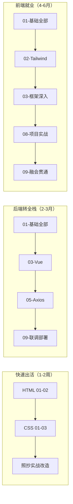

# 前端开发教程目录

## 定位声明

先说一个重要认知：**前端技术与编程语言不同，它天然互相依赖，不成独立体系**。

Java、C++、Rust 是"语言"，你可以只学语言本身，再按需接触生态。但前端不是——HTML 负责结构、CSS 负责样式、JavaScript 负责行为，三者从浏览器诞生第一天起就绑在一起；你写的任何一行 CSS 都作用在 HTML 结构上，任何一段 JS 都通过 DOM 操作前两者，任何一个框架最终编译产物仍是这三样。不存在"只学前端三件套之一"的可行路线，也不存在脱离浏览器的纯理论学法。

因此本目录不按"语言"组织，而按**学习阶段与能力层级**组织，分为七层：

1. **基础**：HTML / CSS / JavaScript / TypeScript 四大基石，一切的地基
2. **CSS 框架**：在掌握原生 CSS 后学习工程化的样式方案（Tailwind 等）
3. **JS 框架**：Vue / React 等现代框架，前端就业的核心竞争力
4. **DOM 与交互**：浏览器提供的底层 API，理解框架替你做了什么
5. **工具库**：请求库、工具函数库、状态管理等日常效率件
6. **数据可视化**：SVG / Canvas / Chart.js / ECharts，让数据开口说话
7. **图标与 UI、项目实战、融会贯通**：把所有技术串成完整产品能力

类比后端：01-基础 相当于"语言 + 标准库"；03-JS框架 相当于 Spring Boot——它没有引入新语言，只是提供了组织代码的范式与运行时便利；06-数据可视化 相当于报表引擎；08-项目实战 相当于毕业设计；09-融会贯通 则是把前后端真正焊在一起的全栈视角。

学习顺序严格自下而上。可以跳着查（本目录提供快速入口），但**不建议跳着学**——跳层学习的典型症状是"会用但不懂为什么"：会写 Vue 却说不清响应式原理，会调 ECharts 却改不动一个 SVG 路径。根基不牢的欠债迟早要还。

---

## 目录结构总览

```mermaid
graph TD
    A[前端开发] --> B[01-基础]
    A --> C[02-CSS框架]
    A --> D[03-JS框架]
    A --> E[04-DOM与交互]
    A --> F[05-工具库]
    A --> G[06-数据可视化]
    A --> H[07-图标与UI]
    A --> I[08-项目实战]
    A --> J[09-融会贯通]

    B --> B1[HTML]
    B --> B2[CSS]
    B --> B3[JavaScript]
    B --> B4[TypeScript]

    B1 --> B1a[01-HTML基础语法]
    B1 --> B1b[02-HTML表单与语义化]
    B1 --> B1c[03-HTML5新特性]
    B1 --> B1d[04-HTML实战：语义化页面]

    B2 --> B2a[01-CSS基础语法]
    B2 --> B2b[02-选择器与盒模型]
    B2 --> B2c[03-Flexbox布局]
    B2 --> B2d[04-Grid布局]
    B2 --> B2e[05-CSS3动画与过渡]
    B2 --> B2f[06-CSS实战：响应式设计]

    C --> C1[Tailwind CSS]
    C --> C2[UnoCSS 与其他方案]

    D --> D1[Vue 3 全家桶]
    D --> D2[React 生态]
    D --> D3[状态管理 Pinia/Zustand]

    E --> E1[DOM 操作]
    E --> E2[事件系统]
    E --> E3[浏览器存储与 API]

    F --> F1[Axios 网络请求]
    F --> F2[Lodash 工具函数]
    F --> F3[Day.js 日期处理]

    G --> G1[SVG 基础与应用]
    G --> G2[Canvas 绘图]
    G --> G3[Chart.js]
    G --> G4[ECharts]
    G --> G5[Highcharts]

    H --> H1[图标方案]
    H --> H2[组件库选型]

    I --> I1[工程脚手架]
    I --> I2[综合项目演练]

    J --> J1[前后端联调]
    J --> J2[部署与性能优化]
```

---

## 各子目录一览

| 子目录 | 技术清单 | 适合谁 |
|--------|---------|--------|
| [[前端开发/01-基础/HTML/01-HTML基础语法\|01-基础]] | HTML（语法/表单/H5）、CSS（选择器/Flex/Grid/动画/响应式）、JavaScript、TypeScript | 所有人必学，零起点唯一入口 |
| [[前端开发/02-CSS框架/Tailwind-CSS/01-Tailwind基础\|02-CSS框架]] | Tailwind CSS、UnoCSS | 学完原生 CSS、想提效的工程化学习者 |
| [[前端开发/03-JS框架/Vue/01-Vue2基础\|03-JS框架]] | Vue 3、React、Pinia/Zustand | 有 JS/TS 基础，目标是做真实产品的开发者 |
| [[前端开发/04-DOM与交互/HTML-DOM/01-DOM基础与选择器\|04-DOM与交互]] | DOM API、事件模型、Fetch、Storage | 想理解框架底层原理、维护无框架老项目的工程师 |
| [[前端开发/04-DOM与交互/AJAX/03-axios与拦截器\|05-工具库]] | Axios、Lodash、Day.js | 所有业务开发者，日常提效 |
| [[前端开发/06-数据可视化/SVG/01-SVG基础\|06-数据可视化]] | SVG、Canvas、Chart.js、ECharts、Highcharts | 需要做图表、大屏、报表的后端转全栈 |
| [[前端开发/07-图标与UI/Font-Awesome/01-Font-Awesome基础\|07-图标与UI]] | Iconify、Element Plus、Ant Design | 做管理后台、中后台产品的开发者 |
| [[前端开发/08-项目实战/01-响应式企业官网\|08-项目实战]] | Vite 工程、完整项目演练 | 学完框架需要落地经验的进阶者 |
| [[前端开发/09-融会贯通/02-Java全栈前后端联调\|09-融会贯通]] | 联调、鉴权、部署、性能优化 | 已有后端经验，要打通全栈的工程师 |

### 各子目录详细说明

**01-基础**：本目录的重心所在，篇幅最大。HTML 部分四章从语法到语义化实战；CSS 部分六章从盒模型到响应式设计；JavaScript 部分覆盖语言核心到 ES6+；TypeScript 作为 JS 的超集单独成篇。有后端背景的读者在 JS 章节会感到亲切（类、模块、异步都有对应物），但在 CSS 章节请放下面向对象直觉。

**02-CSS框架**：Tailwind 的"原子化 CSS"理念是近年主流。前置条件是必须先掌握原生 CSS——否则你不知道 `flex items-center justify-between` 这串类名到底声明了什么，出了问题也无法定位。

**03-JS框架**：Vue 与 React 二选一深入、另一个了解即可。国内就业市场 Vue 占比高，外企与出海产品 React 居多。教程以 Vue 3 为主线（模板语法对后端出身的工程师更友好，接近模板引擎的心智模型）。

**04-DOM与交互**：很多人学完框架就跳过这层，这是错误的。框架（Vue/React）本质上是 DOM 操作的抽象封装，不懂 DOM 就无法理解虚拟 DOM 为什么存在、diff 在解决什么问题。维护老 jQuery 项目更是离不开这一层。

**05-工具库**：Axios 处理 HTTP 请求（类比后端的 OkHttp/RestTemplate）；Lodash 补齐 JS 标准库短板（类比 Apache Commons）；Day.js 处理日期（替代饱受诟病的原生 Date）。都是小而美的日常件。

**06-数据可视化**：SVG 是矢量图形的语言（ECharts 底层导出就用它）；Canvas 是像素级画布（适合大量粒子、游戏场景）；Chart.js 轻量够用；ECharts 是国产标杆，文档全中文、图表类型最全，做管理后台首选。

**07-图标与UI**：图标看着小事，方案选错很烦。组件库则是中后台效率神器——Element Plus 配 Vue、Ant Design 配 React，拖出来就是一套后台界面。

**08-项目实战**：Vite 工程配置 + 一个贯穿性综合项目。所有章节的知识在这里被强制串联。

**09-融会贯通**：给后端工程师的专属章节——CORS 为什么报错、JWT 放 localStorage 还是 cookie、Nginx 怎么托管 SPA、首屏白屏怎么排查。这些"前后端之间"的问题，单独学前端或单独学前端都碰不到。

---

## 快速入口

不确定从哪开始？按你的需求场景对号入座：

| 你的需求场景 | 直达路径 |
|-------------|---------|
| 我要快速做一个页面（不需要框架） | [[前端开发/引导阅读\|引导阅读]] → 01-基础的 HTML 与 CSS 章节 |
| 我是后端，想接手前端工作（全栈化） | [[前端开发/引导阅读\|引导阅读]] → 按 01 → 03 → 09 主线走 |
| 我要给后台系统加数据看板 | [[前端开发/06-数据可视化/ECharts/01-ECharts基础\|ECharts 入门]] + [[前端开发/01-基础/CSS/04-Grid布局\|Grid 布局]] |
| 我接手了一个没有框架的老项目 | [[前端开发/04-DOM与交互/HTML-DOM/01-DOM基础与选择器\|DOM 基础]] + [[前端开发/01-基础/CSS/02-选择器与盒模型\|选择器与盒模型]] |
| 我想系统学前端并就业 | 从 [[前端开发/01-基础/HTML/01-HTML基础语法\|HTML 基础语法]] 开始逐章推进 |

> 所有场景的详细路线图、时间预估与学习节奏建议，见 [[前端开发/引导阅读|引导阅读]]。

### 三条典型学习路径

---

## 相关教程

前端不是孤岛，以下教程与本目录强关联：

| 相关教程 | 关系说明 |
|---------|---------|
| [[java/java目录\|Java 教程]] | 最常见的全栈组合：Spring Boot 后端 + Vue/React 前端，09-融会贯通的大量联调示例以 Java 接口为服务端 |
| [[数据库/数据库目录\|数据库教程]] | 前端展示的数据终归来自数据库，接口字段设计离不开对数据模型的理解；分页参数、排序规则都是两端共同约定 |
| [[dsh\|dsh 教程]] | 部署与运维视角：前端构建产物如何上线、Nginx 如何托管静态资源、CDN 与缓存策略 |

---

## 常见问题

**问：一定要先学完 HTML/CSS 才能碰 Vue 吗？**
答：至少完成 01-基础的 HTML 全部四章和 CSS 前三章。框架解决的是"状态到视图"的问题，不解决"这个布局怎么写"的问题。CSS 不熟的人用框架，会把所有样式难题原样带进组件里。

**问：jQuery 还值得学吗？**
答：不值得作为主线，但 04-DOM与交互 学完后 jQuery 半天就能看懂——它就是对 DOM API 的封装。老项目维护场景下能读即可。

**问：TypeScript 可以跳过直接用 JS 吗？**
答：新项目不建议。TS 已是事实标准，主流组件库与工具库全部提供类型定义。有 Java/C# 背景的读者会觉得类型系统非常亲切，学习成本比纯 JS 背景的人低得多。

**问：教程里的代码用什么编辑器跑？**
答：VS Code + Live Server 插件即可覆盖 01-基础全部章节；03 之后使用 Vite 脚手架（`npm create vite`），详见 08-项目实战。

---

## 学习建议

给有后端语言背景的工程师三句话：

1. **别用后端的"类与对象"思维硬套 CSS**——CSS 是声明式的规则匹配系统，更像"正则表达式作用于文档树"，而非面向对象。它的优先级模型（见 [[前端开发/01-基础/CSS/02-选择器与盒模型|选择器与盒模型]]）自成体系。
2. **JS 的异步模型是第一道坎**——事件循环、Promise、async/await，类比后端的 NIO 事件驱动会有帮助，但注意 JS 是单线程的，连阻塞 IO 都没有。
3. **每章都动手写**——前端是"眼睛学科"，效果看得见，写一遍胜过看十遍。每章末尾的实战代码都是完整可运行的，保存为 `.html` 双击打开即可验证。
