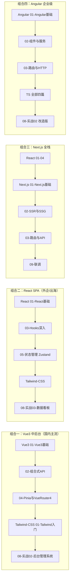

# 前端开发教程：引导阅读

> 本页是前端开发教程库的核心入口。九个子目录、四十余章内容如何选取，取决于你的目标——本页按"需求"而非"顺序"组织路线，先对号入座，再进入对应章节。
>
> 前置认知见 [[前端开发/前端开发目录|前端开发目录]]（定位声明与分层逻辑）。

---

## 一、目录结构总览

```mermaid
graph TD
    A[前端开发] --> B[01-基础]
    A --> C[02-CSS框架]
    A --> D[03-JS框架]
    A --> E[04-DOM与交互]
    A --> F[05-工具库]
    A --> G[06-数据可视化]
    A --> H[07-图标与UI]
    A --> I[08-项目实战]
    A --> J[09-融会贯通]

    B --> B1[HTML 4篇]
    B --> B2[CSS 6篇]
    B --> B3[JavaScript 7篇]
    B --> B4[TypeScript 4篇]

    C --> C1[Tailwind-CSS 4篇]
    C --> C2[Bootstrap5 4篇]
    C --> C3[Bootstrap4 1篇]
    C --> C4[Foundation 1篇]

    D --> D1[Vue2 5篇]
    D --> D2[Vue3 5篇]
    D --> D3[React 6篇]
    D --> D4[Next.js 4篇]
    D --> D5[Angular 4篇]
    D --> D6[AngularJS 1篇]

    E --> E1[HTML-DOM 3篇]
    E --> E2[AJAX 3篇]
    E --> E3[JSON 2篇]

    F --> F1[jQuery 1篇]
    F --> F2[jQuery-UI 1篇]

    G --> G1[Chart.js 3篇]
    G --> G2[ECharts 4篇]
    G --> G3[Highcharts 2篇]
    G --> G4[SVG 3篇]

    H --> H1[Font-Awesome 2篇]

    I --> I1[响应式企业官网]
    I --> I2[后台管理系统]
    I --> I3[数据看板]
    I --> I4[电商首页]

    J --> J1[工程化构建与模块]
    J --> J2[Java全栈前后端联调]
    J --> J3[技术栈选型]
```

依赖关系一句话：**01 是地基，03 站在 01 与 04 之上，06/07 是专项工具，08 把一切串联，09 打通前后端**。

### 本库的章节约定

每个子目录内的编号即建议阅读顺序；标题带"实战"字样的章节是综合演练，前置章节没学完不要硬上。所有代码示例默认可在浏览器直接运行（01-04 部分），涉及工程链的部分（03 框架、08 实战、09 融会贯通）以 Vite 为标准脚手架。每章开头的引用块会标注前置章节链接，遇到不认识的名词优先顺着链接回补，而不是硬着头皮往下读——前端知识网状交织，欠账越早还成本越低。

---

## 二、按需求路线表

不同目标所需的最小知识集差别极大。下表是六条典型路线，每条给出章节链接序列与预计章数：

| 需求场景 | 推荐路线 | 预计章数 |
|---------|---------|---------|
| 快速静态页面 | 见路线 A | 约 7 章 |
| Java 后端接前端 | 见路线 B | 约 16 章 |
| 数据看板 | 见路线 C | 约 10 章 |
| 前端工程师 | 见路线 D | 约 35+ 章 |
| 维护老项目 | 见路线 E | 约 8 章 |
| SSR 全栈 | 见路线 F | 约 10 章 |

每条路线附时间预估与阶段产出，供制定计划参考。

### 路线 A：快速静态页面

- 预计耗时：1-2 周（每天 2 小时）
- 阶段产出：一个可直接部署到静态托管的企业官网或个人主页
- 目标：公司介绍页、活动页、个人主页，不需要框架。

1. [[前端开发/01-基础/HTML/01-HTML基础语法|HTML 基础语法]] → [[前端开发/01-基础/HTML/02-HTML表单与语义化|表单与语义化]]
2. [[前端开发/01-基础/CSS/01-CSS基础语法|CSS 基础语法]] → [[前端开发/01-基础/CSS/03-Flexbox布局|Flexbox 布局]]（时间允许可加 [[前端开发/01-基础/CSS/04-Grid布局|Grid 布局]]）
3. [[前端开发/07-图标与UI/Font-Awesome/01-Font-Awesome基础|Font Awesome 基础]]
4. [[前端开发/02-CSS框架/Bootstrap5/01-Bootstrap5基础|Bootstrap5 入门]]（组件直接抄用，省大量手写样式）
5. 综合演练：[[前端开发/08-项目实战/01-响应式企业官网|响应式企业官网实战]]

### 路线 B：Java 后端接前端

- 预计耗时：2-3 个月（在职学习节奏）
- 阶段产出：一个对接自己 Spring Boot 接口的用户管理页面（含登录）
- 目标：Spring Boot 后端工程师补齐前端能力，能独立完成增删改查页面并与自己的接口联调。

1. [[前端开发/01-基础/HTML/01-HTML基础语法|HTML 01]] → [[前端开发/01-基础/HTML/02-HTML表单与语义化|HTML 02]]
2. [[前端开发/01-基础/CSS/01-CSS基础语法|CSS 01]] → [[前端开发/01-基础/CSS/02-选择器与盒模型|CSS 02]] → [[前端开发/01-基础/CSS/03-Flexbox布局|CSS 03]]
3. [[前端开发/01-基础/JavaScript/01-JS基础语法|JS 01]] → [[前端开发/01-基础/JavaScript/02-函数与作用域|JS 02]] → [[前端开发/01-基础/JavaScript/03-对象与数组|JS 03]] → [[前端开发/01-基础/JavaScript/05-异步编程|异步编程]] → [[前端开发/01-基础/JavaScript/06-ES6+特性|ES6+]]
4. [[前端开发/01-基础/TypeScript/01-TS基础与类型系统|TS 基础]]（Java 背景学 TS 极快）
5. [[前端开发/04-DOM与交互/AJAX/02-Fetch-API|Fetch API]] → [[前端开发/04-DOM与交互/AJAX/03-axios与拦截器|axios 与拦截器]]
6. [[前端开发/03-JS框架/Vue3/01-Vue3基础|Vue3 基础]] → [[前端开发/03-JS框架/Vue3/02-组合式API|组合式 API]]
7. [[前端开发/03-JS框架/Vue3/04-Pinia与VueRouter4|Pinia 与 Vue Router 4]]
8. 联调收口：[[前端开发/09-融会贯通/02-Java全栈前后端联调|Java 全栈前后端联调]]

### 路线 C：数据看板

- 预计耗时：3-4 周
- 阶段产出：一个含实时刷新、暗黑主题的监控看板页面
- 目标：给监控系统、业务后台加图表大屏。

1. [[前端开发/01-基础/JavaScript/01-JS基础语法|JS 基础]] + [[前端开发/04-DOM与交互/HTML-DOM/01-DOM基础与选择器|DOM 基础]]
2. [[前端开发/04-DOM与交互/AJAX/02-Fetch-API|Fetch API]]（定时拉数据）
3. [[前端开发/06-数据可视化/ECharts/01-ECharts基础|ECharts 入门]] → [[前端开发/06-数据可视化/ECharts/02-高级图表|常用图表类型]] → [[前端开发/06-数据可视化/ECharts/03-交互与响应式|交互与组件]] → [[前端开发/06-数据可视化/ECharts/04-ECharts实战|ECharts 实战]]
4. 综合落地：[[前端开发/08-项目实战/03-数据看板|数据看板实战]]（含 WebSocket 实时推送与暗黑主题）

### 路线 D：前端工程师（就业向）

- 预计耗时：4-6 个月（全职）或 8-12 个月（在职）
- 阶段产出：两个可写进简历的项目 + 一套工程化配置模板
- 完整路径：**01-基础全部 21 章 → 框架选一深入 → 工程化 → 两个项目**。

1. 01-基础全部：HTML 4 篇 + CSS 6 篇 + JavaScript 7 篇 + TypeScript 4 篇
2. 框架主线（Vue3 或 React 二选一深入）：[[前端开发/03-JS框架/Vue3/01-Vue3基础|Vue3 系列]] 或 [[前端开发/03-JS框架/React/01-React基础|React 系列]]
3. 配套生态：[[前端开发/03-JS框架/Vue3/04-Pinia与VueRouter4|Pinia 与 Router]] / [[前端开发/03-JS框架/React/05-状态管理|状态管理]]、[[前端开发/02-CSS框架/Tailwind-CSS/01-Tailwind基础|Tailwind CSS]]
4. 工程化：[[前端开发/09-融会贯通/01-前端工程化：构建与模块|前端工程化]]
5. 项目作品集：[[前端开发/08-项目实战/02-后台管理系统|后台管理系统]] + [[前端开发/08-项目实战/04-电商首页|电商首页]]
6. 收口：[[前端开发/09-融会贯通/03-根据需求选择技术栈|根据需求选择技术栈]]

### 路线 E：维护老项目

- 预计耗时：2 周（有框架基础时）至 1 个月（零基础接手）
- 阶段产出：能独立在存量项目中定位并修复问题
- 目标：接手 jQuery/Vue2/AngularJS 存量代码，能改 bug 能加功能。

1. [[前端开发/05-工具库/jQuery/01-jQuery快速参考|jQuery 快速参考]] + [[前端开发/05-工具库/jQuery-UI/01-jQuery-UI快速参考|jQuery-UI 快速参考]]
2. [[前端开发/04-DOM与交互/HTML-DOM/02-DOM操作与事件|DOM 操作与事件]]
3. [[前端开发/03-JS框架/Vue/01-Vue2基础|Vue2 基础]]（存量 Vue2 项目的阅读能力）
4. [[前端开发/03-JS框架/AngularJS/01-AngularJS快速参考|AngularJS 快速参考]]（如涉及）
5. 补齐底层：[[前端开发/04-DOM与交互/AJAX/01-AJAX基础|AJAX 基础]]、[[前端开发/09-融会贯通/01-前端工程化：构建与模块|工程化]]、[[前端开发/09-融会贯通/03-根据需求选择技术栈|迁移策略]]

### 路线 F：SSR 全栈

- 预计耗时：1.5-2 个月（需先有 React 基础）
- 阶段产出：一个服务端渲染的内容站，Lighthouse SEO 评分达标
- 目标：做需要 SEO 的产品官网与全栈应用。

1. [[前端开发/03-JS框架/React/01-React基础|React 基础]] → [[前端开发/03-JS框架/React/02-组件与JSX|组件与 JSX]] → [[前端开发/03-JS框架/React/03-Hooks深入|Hooks 深入]] → [[前端开发/03-JS框架/React/04-ReactRouter|React Router]]
2. [[前端开发/03-JS框架/Next.js/01-Next.js基础|Next.js 基础]] → [[前端开发/03-JS框架/Next.js/02-SSR与SSG|SSR 与 SSG]] → [[前端开发/03-JS框架/Next.js/03-路由与API|路由与 API]] → [[前端开发/03-JS框架/Next.js/04-Next.js实战|Next.js 实战]]
3. 服务端呼应：[[java/3工程化/15_全栈开发技巧|全栈开发技巧]]

---

## 三、技术栈组合路线

现代前端项目 = **框架 + 状态管理 + 样式方案 + 构建/部署**的组合。四条主流组合如下：

| 组合 | 适用场景 | 对应实战项目 |
|------|---------|-------------|
| Vue3 + Pinia + Tailwind | 国内中后台、中小团队、后端转全栈 | [[前端开发/08-项目实战/02-后台管理系统\|后台管理系统]] |
| React + Zustand + Tailwind | 复杂交互应用、国际化团队 | [[前端开发/08-项目实战/03-数据看板\|数据看板]] |
| Next.js 全栈 | 内容站、SEO 强需求、独立开发者 | 官网 + 商品页场景 |
| Angular 企业级 | 大团队长周期、强规范约束 | 后台管理系统的 Angular 版 |

---

## 四、学习建议

### 四条原则

1. **不必全学。** 九个子目录约 80 篇，任何真实岗位都只用到其中三分之一左右。jQuery、AngularJS、Foundation 属于历史遗产，只在维护老项目时查阅。
2. **按需选取。** 用第二节的需求路线表对号入座，路线之外的章节等遇到再回来查。教程库的正确用法是"地图"，不是"跑道"。
3. **框架只精一个。** Vue 和 React 的核心思想（组件化、声明式渲染、单向数据流）完全互通，精通一个后另一个一周可上手；两个都"会一点"在面试和实际工作中都不加分。
4. **每个实战亲手敲一遍。** 08-项目实战的四个项目分别对应零框架、Vue3、React、Tailwind 四种技术形态，覆盖了 90% 的真实工作形态。

### 与其他教程的衔接

本教程库的 Java 全栈定位意味着前端不是孤立的：

| 关联教程 | 衔接点 |
|---------|--------|
| [[java/java目录\|Java 教程]] | Phase11 前端阶段与本库路线 B/D 完全对应；[[java/3工程化/06_Spring Boot快速开发\|Spring Boot]] 提供所有实战项目的接口端 |
| [[java/3工程化/15_全栈开发技巧\|全栈开发技巧]] | 前后端契约、鉴权方案、跨域处理的 Java 视角 |
| [[java/3工程化/14_性能调优与监控\|性能调优与监控]] | 数据看板项目的 Prometheus 数据源思路 |
| [[数据库/数据库目录\|数据库教程]] | 接口字段即表结构的投影，分页排序参数两端共同约定 |
| [[npm\|npm 教程]] | 09-融会贯通工程化章的前置，包管理概念通用 |

### 常见问题

**问：CSS 六篇都要学吗？我只想快速出页面。**
答：路线 A 只需前三篇。但如果你要走路线 B/D，Flexbox 之后的 [[前端开发/01-基础/CSS/04-Grid布局|Grid 布局]] 与 [[前端开发/01-基础/CSS/06-CSS实战：响应式设计|响应式设计]] 是绕不开的——所有后台框架的栅格系统和移动端适配都建立在这两章之上。

**问：TypeScript 能跳过吗？**
答：走路线 A 可以跳过；走 B/D 不能。现代组件库（Element Plus、Ant Design）的类型提示全靠 TS，没有类型系统你只能靠翻文档猜 API。Java 背景者反而会觉得 TS 比原生 JS 更亲切。

**问：Vue2 和 Vue3 先学哪个？**
答：新项目一律 Vue3（见 [[前端开发/03-JS框架/Vue3/01-Vue3基础|Vue3 基础]]）。Vue2 系列只在维护存量项目时按需查阅（路线 E）。

**问：React 和 Vue 到底选哪个？**
答：国内求职选 Vue3（岗位多），外企或出海产品选 React。技术层面差异远小于社区想象，详见 [[前端开发/09-融会贯通/03-根据需求选择技术栈|根据需求选择技术栈]] 的决策分析。

**问：数据可视化四个库（Chart.js/ECharts/Highcharts/SVG）都学吗？**
答：不。ECharts 是中文文档最全、图表类型最多的国产标杆，做业务看板首选它；SVG 篇是理解底层原理的补充；Chart.js 轻量场景备选；Highcharts 商业授权注意合规即可。

**问：Bootstrap 和 Tailwind 学哪个？**
答：二选一即可，思路不同：Bootstrap 给"成品组件"，适合快速拼页面；Tailwind 给"原子类"，适合定制化设计。维护老项目可能遇到 Bootstrap4，查那一篇参考即可。

### 学习节奏参考

以在职学习（工作日晚 1.5 小时 + 周末半天）为例：

| 阶段 | 内容 | 周期 |
|------|------|------|
| 第一月 | HTML 全部 + CSS 前三篇 + JS 前三篇 | 打地基，别赶进度 |
| 第二月 | JS 异步与 ES6+ + TS 基础 + DOM/AJAX | 异步是第一道坎 |
| 第三月 | 框架主线前四篇 + 跟着写小例子 | 开始有"能做东西"的感觉 |
| 第四月起 | 实战项目 + 工程化 + 联调 | 产出作品集 |

全职学习可将周期压缩一半，但不建议再快——前端是"眼睛学科"，每章代码必须亲手运行验证，看懂和会写之间差着十遍键盘。

### 三条红线

以下三种学法被反复证明低效，请自查：

1. **收藏夹吃灰式**：视频和文章囤了一堆却没写过一行代码。前端的每一分能力都在键盘上，不在播放进度条里。
2. **框架速通式**：跳过 01 直接上 Vue/React，页面能跑但完全不懂为什么。布局问题、异步 bug、兼容性问题出现时束手无策。
3. **全栈焦虑式**：同时开 Vue、React、Angular 三个坑，每个都停在第一章。先走完一条路线，再横向对比才有意义。

### 一句话总结

> 先用路线表定位自己 → 只走一条主线 → 一个框架练到能独立完成 08 的项目 → 用 09 打通后端。其余章节，留作字典。
