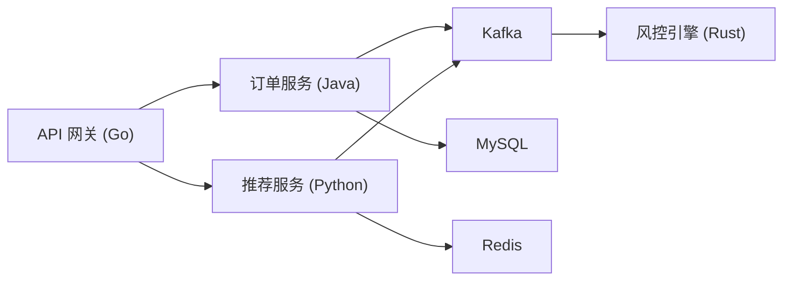
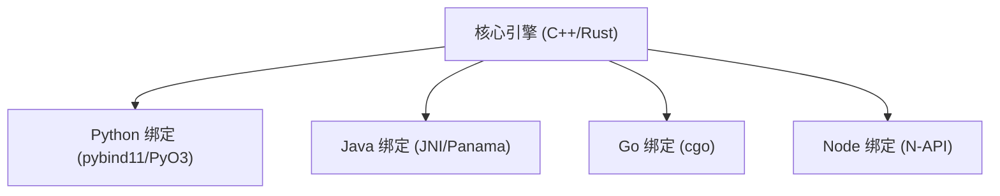
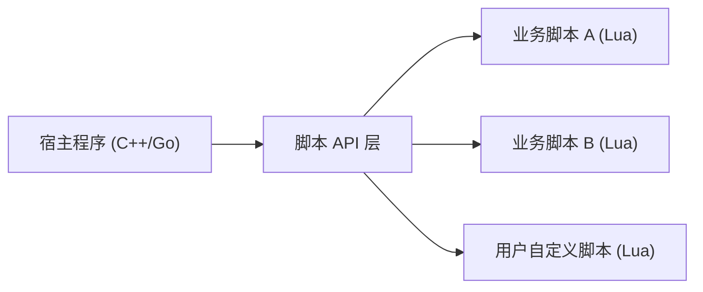
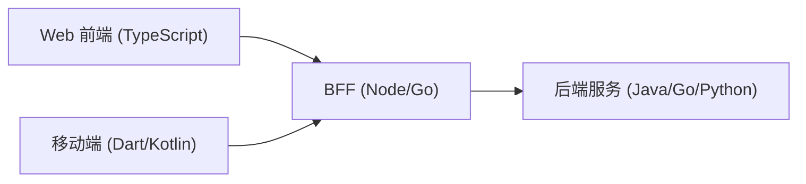

# 01 多语言项目全景

> 本章回答一个前置问题：**为什么以及什么时候需要多语言**。如果你已经身处一个多语言项目，可以直接跳到 [[多语言工程化/1统筹与协作/03_接口先行与契约驱动|03 接口先行与契约驱动]]，那里讨论最痛的接口问题。但建议至少读完本章第六、七节——大多数多语言项目的失败，不是因为选错了语言，而是因为引入语言时没有算清楚成本。

---

## 一、多语言是结果，不是目的

先把一句话钉在墙上：**没有任何项目以「使用 N 种语言」为目标**。多语言是一种被动的、后验的工程状态，它的出现通常有三种路径：

1. 业务扩张后发现某一环节用现有语言做不好，引入新语言补短板；
2. 历史遗留：并购、外包交付、早期技术选型叠加，系统里自然沉淀出多种语言；
3. 生态强制：算法、嵌入式、前端等领域的成熟工具只存在于特定语言生态。

这三条路径都不是「为了多语言而多语言」。因此，讨论多语言工程化的正确姿势不是「我们该用哪些语言」，而是：

> 在已经或即将多语言的前提下，如何让不同语言的模块在**接口、构建、测试、部署、责任**五个维度上稳定协作。

[[多语言工程化/多语言工程化目录|多语言工程化]] 全目录都建立在这个前提上。本部分（1 统筹与协作）负责组织与流程，后续部分负责技术手段。

### 1.1 单语言项目的边界在哪里

在决定引入第二种语言之前，先诚实地评估单语言的边界。很多团队以为遇到了语言瓶颈，实际上是架构问题：

| 表面症状 | 真实原因 | 引入新语言能解决吗 |
|---------|---------|------------------|
| 服务响应慢 | 数据库慢查询、N+1 查询、缺少缓存 | 不能，换语言只是掩盖 |
| 高并发扛不住 | 阻塞模型选错、连接池太小、单点 | 通常不能，先调架构 |
| 想做机器学习 | 生态确实缺失 | 能，属于生态绑定 |
| 代码越来越乱 | 模块边界不清、缺乏评审 | 不能，会加剧 |
| 构建越来越慢 | 构建系统未增量、未缓存 | 不能，换语言更慢 |

结论：**只有当问题无法在当前语言的生态内解决时，引入新语言才是理性选择**。性能问题尤其要谨慎——先用压测数据证明当前语言达不到目标，再考虑替换，见本章第七节。

---

## 二、选择多语言的三个理由

工程上可辩护的引入理由只有三类，其余都值得怀疑：

| 理由 | 本质 | 典型例子 | 判断信号 | 不适用场景 |
|------|------|---------|---------|-----------|
| 各取所长 | 不同语言在不同工作负载上有结构性优势 | Go 做高并发网关、C++ 做风控计算、Python 做数据分析 | 有明确、可量化的性能或表达能力差距 | 差距在 2 倍以内，优化当前语言即可解决 |
| 历史演进 | 存量系统不能停摆，新模块必须落地 | 老 Java 单体旁挂 Go 新服务 | 重写成本远大于长期维护成本 | 系统即将下线、团队无人能维护旧语言 |
| 生态绑定 | 某领域的关键库只存在于一种语言 | 机器学习选 Python、iOS 选 Swift、嵌入式选 C | 替代方案需要自研数月以上 | 只是「听说某个库好」，实际有等价替代 |

补充一个常被忽略的第四类——**人才约束**：团队里 80% 的人只会一种语言，硬上新语言会造成维护真空。这不是技术理由，但它是真实约束，必须在决策时计入。

### 2.1 「各取所长」需要量化

不要用「Go 比 Java 快」这种模糊判断做决策。可辩护的表述是：

```text
在订单查询接口上，Java 服务 P99 为 180ms，其中序列化占 60ms；
目标 P99 为 50ms。经压测，同逻辑 Go 实现 P99 为 35ms。
当前 Java 方案即使优化到极致（换序列化库、减少拷贝）预计 P99 为 90ms，无法达标。
结论：该接口用 Go 重写，其余服务维持 Java。
```

注意最后一句——**重写的是接口，不是整个服务**。多语言的粒度可以细到单个接口或单个模块，不必是整条业务线。

---

## 三、真实世界的多语言案例

以下案例只说明「多语言在工业界是常态」，不展开内部细节（细节多为公开演讲与论文中的片段，读者不必记忆）：

| 组织 | 公开可见的语言组合 | 多语言的原因 |
|------|------------------|-------------|
| Google | C++、Java、Go、Python 等 | 底层性能、业务开发效率、脚本与胶水、不同产品线历史 |
| Netflix | Java（后端核心）、Node.js（BFF 层）、Python（数据与实验） | 各层职责不同，BFF 需要快速迭代，数据侧依赖 Python 生态 |
| Uber | Go（地理与调度服务）、Java（业务）、Python（数据与 ML） | 高并发服务用 Go，业务系统延续 Java，算法侧绑定 Python |
| Bilibili | Go（网关与中间件）、Java（业务）、Lua（Nginx 层） | 网关自研、业务存量、边缘逻辑轻量化 |

从这些案例中可以提炼出共同的模式：

1. **多语言按层分布，而不是按随机分布**：底层/网关/数据各用其长；
2. **每种语言都有明确的「地盘」**：不会出现两个团队用不同语言实现同一职责的情况；
3. **组织规模是多语言的前提**：几百人以上的团队才养得起多套工具链与平台支持。

> 反过来说：**十人以下团队引入第三种语言，通常是负债而不是资产**。没有平台团队消化工具链成本时，这些成本会平摊到每个开发者头上。

---

## 四、四种典型多语言架构模式

多语言不是只有「微服务」一种形态。下面四种模式覆盖了绝大多数真实系统，选错模式是多语言项目痛苦的根源。

### 4.1 模式一：多服务（Polyglot Microservices）

每个服务独立选语言、独立部署，通过 HTTP/gRPC/消息队列通信。



- 优点：语言完全解耦，各服务可独立演进；边界天然清晰（进程边界即模块边界）
- 代价：网络调用取代函数调用，需要处理超时、重试、幂等、分布式事务
- 适用：服务边界已经清晰、团队按服务划分
- **不适用场景**：模块间调用极其频繁（每请求上百次交互），此时网络开销会压垮系统

### 4.2 模式二：共享核心 + 语言绑定

用 C/C++/Rust 实现核心算法，编译为动态库，再为各语言提供绑定（FFI）。



- 优点：核心逻辑只实现一次，性能与一致性最好
- 代价：构建链复杂（需要为每个平台编译）、内存管理跨语言易错、调试困难、绑定层维护成本高
- 适用：核心算法是公司资产且被多语言消费（如风控、图像处理、编解码）
- **不适用场景**：核心逻辑还在频繁变动，或团队没有 C/C++/Rust 能力；ABI 不稳定时绑定会成为灾难

### 4.3 模式三：宿主 + 脚本

主程序用静态语言实现，业务逻辑用嵌入的脚本语言编写（Lua、Python、JS）。



- 优点：业务变更不需要重新编译宿主，热更新友好；扩展点清晰
- 代价：脚本性能低一个数量级、调试跨语言栈、脚本 API 一旦发布极难收回
- 适用：Nginx/OpenResty 规则、游戏逻辑、插件系统、策略引擎
- **不适用场景**：对延迟极敏感的热路径；脚本需要访问大量宿主内部状态时（API 会失控膨胀）

### 4.4 模式四：前后端异构

前端 TypeScript + 后端任意语言，通过 HTTP/GraphQL 契约连接。



- 优点：两端各自使用最优生态，是当下最普遍的多语言形态
- 代价：类型系统割裂（后端类型无法直接给前端用）、接口变更需要双向同步、联调成本
- 适用：几乎所有 Web/移动产品
- **不适用场景**：无（这已是默认形态）；但要注意：**契约不统一时前后端会成为最常扯皮的地方**，解法见 [[多语言工程化/1统筹与协作/03_接口先行与契约驱动|03 接口先行与契约驱动]]

### 4.5 四种模式对比

| 维度 | 多服务 | 共享核心 + 绑定 | 宿主 + 脚本 | 前后端异构 |
|------|--------|---------------|------------|-----------|
| 通信方式 | 网络 RPC/MQ | 进程内 FFI | 进程内嵌入 | HTTP/GraphQL |
| 性能开销 | 高（网络） | 低（函数调用） | 低到中 | 高（网络） |
| 部署单元 | 每服务独立 | 共享库随宿主 | 宿主 + 脚本文件 | 前后端独立 |
| 边界清晰度 | 高 | 中（ABI 脆弱） | 中（API 面大） | 高 |
| 调试难度 | 中（分布式追踪） | 高（跨语言栈） | 高（跨语言栈） | 中 |
| 典型团队规模 | 50 人以上 | 20 人以上 | 10 人以上 | 任何规模 |
| 首选语言组合 | Go/Java/Python | C++/Rust + 上层 | C++/Go + Lua | TS + 任意后端 |

一个项目可以同时使用多种模式。例如：多服务为主，其中风控服务内部是「共享核心 + Python 绑定」，网关内部是「Go 宿主 + Lua 脚本」。

---

## 五、多语言的真实成本

多语言的成本不是线性叠加，而是**组合爆炸**。N 种语言产生 N 套工具链、N(N-1)/2 个互操作边界。

| 成本项 | 单语言 | 多语言 | 应对手段 |
|--------|--------|--------|---------|
| 工具链 | 1 套编译器/包管理器/格式化器 | N 套，且版本需统一 | 容器化构建环境、工具版本锁定（见 2 构建与依赖） |
| 依赖管理 | 1 个锁文件 | N 个锁文件 + 跨语言传递 | 私有仓库统一代理、依赖升级机器人 |
| 构建 | 一次编译 | 多语言编排 + 产物传递 | Bazel/Make 统一入口，见 2-01 |
| CI 时间 | 快 | 每语言独立流水线，缓存难共享 | 远程缓存、受影响模块检测 |
| 招聘与培训 | 单一技能栈 | 每个岗位都要指定语言 | 按语言设立明确 owner |
| 调试 | 单栈调试器 | 跨语言链路追踪、序列化边界 | OpenTelemetry 统一 trace |
| 认知负担 | 低 | 每人至少要读懂相邻语言 | 接口层代码生成，减少手写跨语言代码 |
| 组织协调 | 口头沟通 | 接口变更需要跨团队评审 | CODEOWNERS + 契约评审，见 1-03/1-04 |

### 5.1 一个被低估的成本：构建时间

多语言 Monorepo 中，一次全量构建可能需要 30 分钟以上。这会直接改变开发行为：开发者不敢频繁提交、倾向于攒大 PR、CI 反馈变慢，最终拖垮交付效率。这是 [[多语言工程化/2构建与依赖/01_多语言构建系统全景|构建系统全景]] 存在的意义。

### 5.2 另一个被低估的成本：认知负担

当一个人同时维护 Go 和 Rust 代码时，切换成本约为 15-30 分钟（需要重新进入上下文）。如果一天切换 4 次，近两小时被消耗。缓解手段：

- 让每个人**主攻一门语言，只读相邻语言**，而不是要求全栈
- 跨语言接口尽量由工具生成，而不是手写
- 文档与代码组织按语言分目录，减少混读

---

## 六、决策矩阵：什么时候该引入新语言

引入新语言前，用下面的清单逐项打分。**任何一项为「否」，都应暂停引入**：

| 问题 | 为「是」的表现 | 为「否」的处理 |
|------|--------------|--------------|
| 现有语言确实无法满足需求？ | 有压测/原型数据支撑 | 先优化现有实现 |
| 新语言有明确的负责人？ | 至少 2 人熟悉，能互相 review | 先培训或招聘，不要引入 |
| 工具链有人维护？ | 构建、CI、依赖代理有归属 | 由平台团队先支持 |
| 边界可以清晰定义？ | 能写出接口契约，不与现有代码深度耦合 | 先理清模块边界 |
| 团队规模支撑？ | 通常 20 人以上 | 小团队优先单语言 + 进程隔离 |
| 退出成本可接受？ | 最坏情况可整体删除该模块 | 不要引入无法回退的语言 |
| 招聘市场有供给？ | 该语言在目标城市/远程市场常见 | 评估维护风险 |

### 6.1 量化评估示例

```text
候选：为推荐服务引入 Python
1. 生态绑定：推荐算法库（PyTorch 生态）只成熟于 Python —— 强
2. 负责人：算法团队 4 人，均熟悉 Python —— 强
3. 工具链：已有 Python CI 模板与私有 PyPI 镜像 —— 中
4. 边界：推荐服务只通过 gRPC 对外，边界清晰 —— 强
5. 规模：后端团队 60 人 —— 强
6. 退出：算法模型可替换，服务可下线 —— 可接受
结论：引入，但限定在推荐服务内部，禁止其他服务直接依赖 Python 代码。
```

注意最后一行的**限定条件**——引入新语言时同时定义它的「活动范围」，比语言本身更重要。

---

## 七、何时不该多语言

以下场景中，多语言是明确的反模式：

1. **团队小（< 10 人）**：工具链成本无法被摊薄，一个人要维护全部构建脚本。优先选择单语言 + 进程隔离（同一个语言内拆模块），实在不行再考虑。
2. **边界不清晰**：如果两个模块还在频繁互相调用、数据结构还在变，任何语言差异都会放大耦合。先把边界画出来。
3. **性能需求未验证**：没有压测数据就断言「现有语言太慢」。先做 profiling，先优化算法与数据库。
4. **为了简历或兴趣**：个人偏好不能作为工程决策依据。
5. **为了一次性任务**：数据迁移、爬虫脚本这类一次性工作可以用任意语言写，但不要让它进入主干仓库、进入构建流水线。
6. **没有回退方案**：引入的语言如果失败，能否整体删除？不能的话，风险不可控。

### 7.1 「单语言多模块」是常见的更优解

很多需求用单语言即可满足：

| 需求 | 错误反应 | 更优解 |
|------|---------|--------|
| 需要高性能计算 | 引入 C++ | Java 用 Panama/FFM，Go 用汇编热点，或提取为独立进程 |
| 需要脚本化 | 引入 Lua | 使用宿主语言的内嵌引擎（JVM 有 GraalJS，Go 有 goja） |
| 需要数据分析 | 引入 Python | 输出结构化数据，交给独立的数据平台（而非混入服务代码） |
| 需要前端交互 | 引入 TS（必要） | 这是合理的多语言，但后端不必跟随换语言 |

---

## 八、渐进式引入新语言的策略

如果决策结论是「引入」，正确做法是渐进式落地，而不是一次性切换。推荐四阶段：


| 阶段 | 目标 | 退出条件 | 风险 |
|------|------|---------|------|
| 1 隔离实验 | 验证可行性与性能 | 原型达标，团队能维护 | 低（不进入主干） |
| 2 单服务落地 | 跑通构建-测试-部署闭环 | 服务稳定运行一个季度 | 中（引入新依赖） |
| 3 标准化 | 工具链纳入平台 | 新服务可自助创建 | 中（需要平台投入） |
| 4 推广或冻结 | 明确语言的长期地位 | 有明确结论，写进 ADR | 高（组织惯性） |

每个阶段结束都要写一页 ADR（架构决策记录）：背景、选项、决策、后果。见 [[多语言工程化/多语言工程化目录|多语言工程化]] 学习建议第 4 条。

### 8.1 引入时的边界规则

无论处于哪个阶段，都应遵守以下规则：

1. **新语言代码不得被其他语言直接 import/链接**，只能通过契约（gRPC/HTTP/MQ）通信；
2. **新语言模块必须有明确 owner**，owner 离职前必须完成交接；
3. **新语言的构建入口必须与其他语言一致**（如统一 `make build`），否则 CI 无法编排；
4. **不引入第二套同职责工具**（如已有 gRPC，就不要再引入 Thrift）。

---

## 九、常见坑与反模式

| 反模式 | 表现 | 后果 | 纠正 |
|--------|------|------|------|
| 简历驱动开发 | 用新语言重写稳定模块 | 引入 bug、维护真空 | 决策矩阵打分，写 ADR |
| 一刀切重写 | 「全部换成 Go」 | 项目延期、功能回退 | 按接口逐步迁移 |
| 语言无主 | 引入后没人负责 | 依赖腐烂、安全漏洞 | 指定至少 2 名 owner |
| 边界穿透 | 通过 FFI 直接调用内部实现 | 强耦合、升级互相阻塞 | 只走契约层 |
| 工具链并行 | 每种语言自建 CI 脚本 | 重复劳动、体验割裂 | 平台团队统一模板 |
| 忽略退出成本 | 无法回退的技术选型 | 被单一语言锁定 | 设计可替换边界 |
| 过早优化 | 未压测就换语言 | 白付成本 | 先 profiling 再决策 |

一个真实高频场景：团队用 Python 重写了一个 Java 接口，上线后发现 QPS 只有原来的三分之一，因为忽略了 GIL 与同步 I/O。**性能类决策必须先在目标语言里做原型压测**，这是本部分反复强调的工程纪律。

---

## 本章小结

- 多语言是结果不是目的；引入前必须回答「现有语言为什么不行」；
- 可辩护的理由只有三个：各取所长、历史演进、生态绑定；其余理由应被质疑；
- 四种架构模式（多服务、共享核心 + 绑定、宿主 + 脚本、前后端异构）各有明确的适用边界与不适用场景；
- 多语言成本是组合爆炸：工具链、依赖、构建、调试、认知、组织六个层面都要计入；
- 决策矩阵七问，任一为「否」就应暂停；小团队、边界不清、性能未验证时不该多语言；
- 渐进式引入分四阶段，每阶段有退出条件；引入语言的同时要定义它的活动范围与 owner。

下一章讨论多语言代码应该怎么放：[[多语言工程化/1统筹与协作/02_仓库结构：Monorepo与Polyrepo|02 仓库结构：Monorepo 与 Polyrepo]]。

---

## 动手实践

### 任务 1：为你的项目画一张多语言现状图

用 mermaid 画出当前项目（或你熟悉的一个开源项目）的语言分布：每个模块用什么语言、通过什么方式通信、由谁负责。

验收标准：

- 图中至少包含 2 种语言、3 个模块、明确的通信方式标注；
- 对每个跨语言边界，标注通信协议（HTTP/gRPC/MQ/FFI）；
- 用一段文字指出图中最脆弱的一个边界，并说明理由。

### 任务 2：写一份「引入新语言」的决策记录

假设你的项目要引入一门新语言（自选场景，如给 Java 后端加 Python 算法服务），按 ADR 格式写一页决策记录。

验收标准：

- 包含背景、至少 3 个候选选项、最终决策、后果四部分；
- 决策必须引用本章第六节的七问矩阵，逐项打分；
- 明确写出该语言的「活动范围」与退出方案；
- 全文不超过 800 字，结论明确。

### 任务 3：识别一个伪多语言需求

在公开技术社区或你的工作环境中找一个「引入新语言」的提议，用本章框架评估它。

验收标准：

- 指出提议属于三个可辩护理由中的哪一个，或指出它不属于任何一个；
- 给出一条替代方案（单语言内如何解决）；
- 如果支持引入，给出渐进式的第一阶段方案与退出条件；
- 写出至少一个可能被忽略的成本项。

- 返回目录：[[多语言工程化/多语言工程化目录|多语言工程化]]
