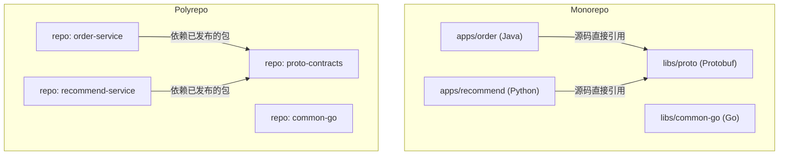
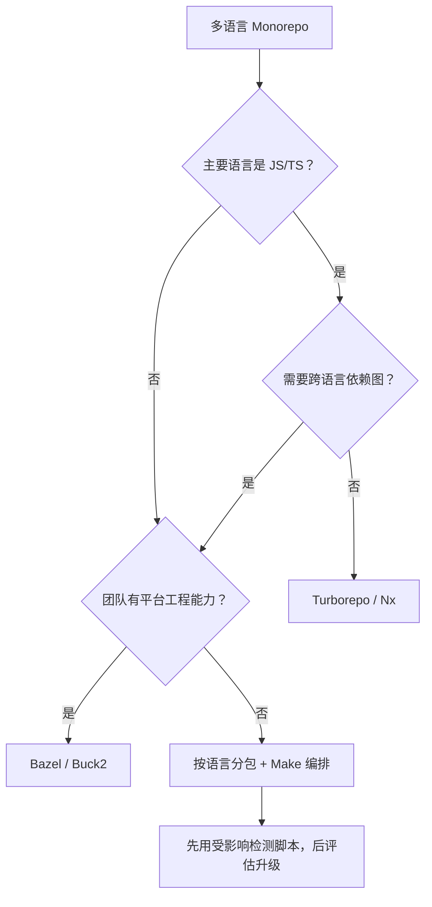
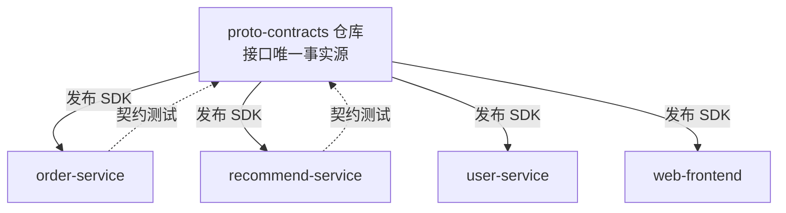
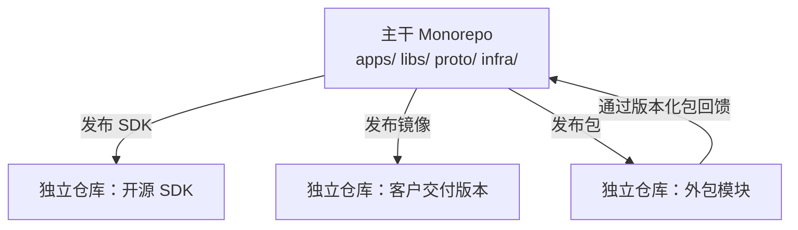

# 02 仓库结构：Monorepo 与 Polyrepo

> 仓库结构是多语言工程的第一个物理决策，也是影响最深远的一个。它决定了代码可见性、依赖如何解析、CI 如何触发、权限如何分配、版本如何发布。一旦选定，迁移成本极高。本章不站队，只给出两种模式的完整权衡与混合方案。前置阅读：[[多语言工程化/1统筹与协作/01_多语言项目全景|01 多语言项目全景]]。

---

## 一、两种模式的定义

- **Monorepo（单仓库）**：多个项目/服务/库的源码放在同一个 Git 仓库中，各自可有独立的构建与发布流程。注意：Monorepo 不等于「一个大项目」，Google 的单仓库里有数十亿行代码、数千个独立服务。
- **Polyrepo（多仓库）**：每个项目/服务/库一个独立仓库，通过版本化的包或镜像互相依赖。

关键认知：**Monorepo 是代码组织方式，不是发布方式**。单仓库里的服务依然可以独立部署、独立发版、独立打标签。



---

## 二、核心对比

| 维度 | Monorepo | Polyrepo |
|------|----------|----------|
| 代码可见性 | 全部可见，跨项目搜索/跳转自然 | 按仓库隔离，跨仓库搜索需额外工具 |
| 原子提交 | 一次提交可同时改接口与所有调用方 | 需要跨仓库协调，存在中间状态 |
| 依赖管理 | 源码引用，无版本发布延迟 | 必须先发包再引用，存在版本地狱 |
| CI 影响 | 需要「受影响模块」检测，否则全量构建 | 天然只构建本仓库，简单直接 |
| 权限 | 粗粒度（仓库级），目录级需平台支持 | 天然仓库级隔离，适合外包/敏感项目 |
| 工具成熟度 | 需要 Bazel/Nx 等专门工具 | Git + 各语言包管理器即可 |
| 构建规模 | 需要增量与远程缓存，否则很慢 | 单仓库小，构建快 |
| 版本管理 | 统一或独立版本策略需要工具支持 | 天然独立版本 |
| 发布协调 | 容易做全仓库一致的发布列车 | 需要人工协调多个仓库的发布顺序 |
| 新人上手 | clone 大、需要工具引导，但依赖齐备 | clone 快，但要跑通需拉多个仓库 |
| 适合规模 | 中大型、强协作团队 | 小团队、松耦合、外部协作 |

### 2.1 不适用场景

| 模式 | 不适用场景 |
|------|-----------|
| Monorepo | 团队 < 5 人且无共享代码；需要严格隔离的外部外包仓库；仓库体积超过平台硬限制且无平台团队支持 |
| Polyrepo | 接口变更频繁且需要原子提交；团队按业务垂直划分但共享大量库；无法承担包发布延迟 |

---

## 三、Monorepo 的真实案例

| 组织 | 公开事实 | 关键前提 |
|------|---------|---------|
| Google | 单一仓库承载绝大多数代码，配合自研构建系统与代码评审工具 | 有庞大的开发者基础设施团队 |
| Meta | 单一仓库（常被引用为超大规模 Monorepo 案例之一） | 自研版本控制与构建工具 |
| Microsoft | Windows 等大型产品采用单一仓库开发（另有大量产品线使用多仓库） | 自研构建与分布式编译 |

这些案例经常被误读为「Monorepo 一定好」。真实的结论是：

> **这些公司能跑 Monorepo，是因为它们同时投入了平台团队建设工具链。** 没有平台投入的 Monorepo，在几百人规模时会退化成「一个巨大的、构建两小时的仓库」。

因此，选型时要问的不是「Google 用什么」，而是「我有没有资源维护 Monorepo 的基础设施」。

---

## 四、Monorepo 工具生态

多语言 Monorepo 的核心难题是：**只构建受影响的模块，并复用构建结果**。工具生态如下：

| 工具 | 语言/生态 | 增量构建 | 远程缓存 | 多语言支持 | 学习曲线 | 不适用场景 |
|------|----------|---------|---------|-----------|---------|-----------|
| Bazel | 通用（Starlark 规则） | 强 | 支持（需自建/云） | 优秀 | 陡峭 | 小项目、无平台团队 |
| Buck2 | 通用（Starlark，Rust 实现） | 强 | 支持 | 优秀 | 陡峭 | 生态与文档少于 Bazel |
| Pants | 通用（Python 配置） | 强 | 支持 | 良好（Python/Go/JVM/Shell） | 中 | 非主流语言支持有限 |
| Nx | JS/TS 为主 | 强 | 支持（Nx Cloud） | 有限（可插件扩展） | 中 | 后端为主的多语言项目 |
| Turborepo | JS/TS 为主 | 强 | 支持（Vercel 生态） | 有限 | 低 | 需要跨语言依赖图的项目 |
| Melos | Dart/Flutter | 中 | 无 | 无（Dart 专用） | 低 | 非 Dart 项目 |

### 4.1 选型建议



**务实建议**：多数团队不需要一步到位上 Bazel。先用「Make/脚本 + 各语言原生工具」跑通闭环，当全量构建超过 10 分钟且无法用缓存解决时，再评估 Bazel。

### 4.2 工具能做什么与不能做什么

- 能做：依赖图分析、增量构建、远程缓存、受影响目标检测；
- 不能做：自动消除循环依赖、自动划分模块边界、替你决定版本策略。

工具解决的是「构建速度」，不解决「架构混乱」。很多团队上 Bazel 后构建依然慢，原因是依赖图本身就是一团乱麻。

---

## 五、多语言 Monorepo 的目录布局

一个经过实践检验的布局：

```text
root/
├── apps/                     可独立部署的应用（每个子目录一个服务）
│   ├── order/                Java 订单服务
│   │   ├── src/
│   │   └── BUILD
│   ├── recommend/            Python 推荐服务
│   │   ├── src/
│   │   └── pyproject.toml
│   └── web/                  TypeScript 前端
├── libs/                     内部共享库（不直接部署）
│   ├── proto/                跨语言接口定义（唯一事实源）
│   │   ├── order/v1/
│   │   └── user/v1/
│   ├── common-go/            Go 公共库
│   └── common-java/          Java 公共库
├── infra/                    部署与基础设施
│   ├── k8s/
│   ├── helm/
│   └── terraform/
├── tools/                    自研脚本与构建工具
│   ├── affected.sh           受影响模块检测
│   └── lint.sh
├── docs/                     文档
│   ├── adr/                  架构决策记录
│   └── runbooks/             运维手册
├── .github/                  CI 配置
├── CODEOWNERS                所有权声明
├── Makefile                  统一构建入口
└── README.md
```

### 5.1 布局原则

1. **apps 与 libs 分离**：应用可以依赖库，库不得依赖应用；这条规则可以用构建工具强制（Bazel 可见性、Nx 标签）。
2. **proto/ 独立于语言目录**：接口定义是跨语言资产，不能放进某个语言的目录里，否则会被当成该语言的私有物。详见 [[多语言工程化/1统筹与协作/03_接口先行与契约驱动|03 接口先行与契约驱动]]。
3. **tools/ 是产品的一部分**：构建脚本需要评审、测试、文档，不是「临时脚本」。
4. **infra 与代码同仓库**：部署配置与代码一起做原子变更（GitOps 的前提，见 6 持续交付）。
5. **每个应用自带构建文件**：语言原生文件（pom.xml、pyproject.toml、package.json）保留，根目录 Makefile 只做编排。

### 5.2 统一入口示例

```makefile
# 根 Makefile：所有语言的统一入口，CI 与本地都只调用这些目标
.PHONY: build test lint affected

build:  ## 构建全部
	$(MAKE) -C apps/order build
	$(MAKE) -C apps/recommend build
	$(MAKE) -C apps/web build

test:   ## 测试全部
	$(MAKE) -C apps/order test
	$(MAKE) -C apps/recommend test
	$(MAKE) -C apps/web test

affected:  ## 只构建与测试受本次改动影响的模块
	./tools/affected.sh | xargs -I{} $(MAKE) -C {} build
```

统一入口的价值：CI 配置、新人文档、IDE 任务都指向同一组命令，避免「每个人记住一套命令」。

---

## 六、Polyrepo 的依赖版本地狱与解法

Polyrepo 最典型的失败模式是**依赖版本地狱**：

```text
proto-contracts v1.3 发布
  -> order-service 升级到 v1.3
  -> recommend-service 还在 v1.1（消费方未跟进）
  -> user-service 依赖 v1.2，但 v1.3 改了字段语义
  -> 联调时三个服务对同一字段的理解不一致
```

### 6.1 解法清单

| 解法 | 做法 | 代价 |
|------|------|------|
| 契约仓库 + 自动生成 | 接口定义独立仓库，发布时自动生成各语言 SDK | 需要维护发布流水线 |
| 版本对齐清单 | 维护 BOM/版本清单，所有服务对齐同一版本 | 升级需要协调，敏捷性下降 |
| 强制版本检查 | CI 中校验依赖版本不低于最低支持版本 | 需要额外检查工具 |
| 契约测试 | 消费方契约测试保证兼容，见 4-02 | 测试基础设施成本 |
| 依赖机器人 | Renovate/Dependabot 自动提升级 PR | 需要评审带宽，见 06 章 |

### 6.2 推荐的 Polyrepo 结构



关键：**契约仓库是唯一的跨仓库依赖枢纽**，其他仓库之间尽量不直接互相依赖。如果发现服务 A 需要直接引用服务 B 的内部库，说明边界划分有问题，应把共享部分下沉到契约或公共库仓库。

---

## 七、代码搜索与导航

| 能力 | Monorepo | Polyrepo |
|------|----------|----------|
| 全文搜索 | 一次搜索覆盖全部代码 | 需要跨仓库搜索平台 |
| 引用查找 | 直接可用（IDE 内） | 跨仓库引用几乎不可查 |
| 重构改名 | 工具可一次完成 | 需要多个仓库分别改 |
| 工具推荐 | 仓库内 ripgrep + IDE 索引 | Sourcegraph、GitHub 搜索、自建索引 |

多语言场景下，代码搜索的价值被放大：你经常需要「从 Java 调用点找到 Go 实现」。Polyrepo 中这几乎不可能靠本地工具完成，通常需要部署 Sourcegraph 或类似平台。**如果团队频繁需要跨仓库跳转，这就是转向 Monorepo 的强信号。**

---

## 八、权限与 CODEOWNERS

| 维度 | Monorepo | Polyrepo |
|------|----------|----------|
| 读取权限 | 全仓库可见 | 按仓库控制 |
| 写入权限 | 需要目录级规则（平台支持不一） | 天然隔离 |
| 敏感代码 | 混在同一仓库，难以限制 | 独立仓库 + 独立权限 |
| 所有权声明 | CODEOWNERS 按路径分配 | 每个仓库自带 owner |

Monorepo 中 CODEOWNERS 是最关键的治理文件：

```text
# .github/CODEOWNERS

# 默认 owner：平台团队
*                       @org/platform-team

# 接口定义：必须由接口委员会评审
/libs/proto/            @org/api-reviewers

# Java 服务
/apps/order/            @org/order-team
/libs/common-java/      @org/java-platform

# Python 服务
/apps/recommend/        @org/algorithm-team

# 基础设施：SRE 必须评审
/infra/                 @org/sre-team

# 构建工具：平台团队
/tools/                 @org/platform-team
/Makefile               @org/platform-team
```

CODEOWNERS 的详细实践见 [[多语言工程化/1统筹与协作/04_团队分工与代码所有权|04 团队分工与代码所有权]]。

---

## 九、版本策略：固定版本 vs 独立版本

Monorepo 内的版本策略有两种：

| 策略 | 含义 | 优点 | 缺点 | 适用 |
|------|------|------|------|------|
| Fixed/Locked | 所有包共享同一版本号，一起发布 | 依赖关系简单，版本对齐 | 任一包变更导致全部重新发布 | 包之间强耦合、发布频率一致 |
| Independent | 每个包独立版本、独立发布 | 发布粒度小，互不阻塞 | 需要工具维护依赖图 | 包之间松耦合、独立消费者 |

工具支持：

- Nx：两种都支持（`nx release` 可配置）；
- Lerna：两种都支持，现代 Lerna 推荐 independent 或与 Nx 配合；
- Melos：Dart 生态，支持 fixed 与独立发布；
- Bazel：不管理版本，需要自行决定发布策略。

**经验法则**：如果包之间经常需要同时变更才能工作，用 Fixed；如果包可以独立升级且下游能承受版本漂移，用 Independent。详见 [[多语言工程化/1统筹与协作/06_版本管理与发布策略|06 版本管理与发布策略]]。

---

## 十、混合模式：主干 Monorepo + 部分独立仓库

现实中大量团队采用混合模式，这是被低估的务实选择：



混合模式的典型划分：

| 内容 | 位置 | 理由 |
|------|------|------|
| 核心服务与共享库 | Monorepo | 强协作、频繁接口变更 |
| 开源 SDK | 独立仓库 | 对外发布节奏、许可证与贡献流程不同 |
| 客户定制版本 | 独立仓库 | 需要权限隔离与独立发布 |
| 外包/供应商代码 | 独立仓库 | 安全边界，人员流动大 |
| 实验性项目 | 独立仓库 | 失败可直接归档，不污染主干 |

---

## 十一、迁移路径与渐进策略

从 Polyrepo 迁到 Monorepo（或反向）都是高风险操作，必须渐进：

| 阶段 | 动作 | 验收 |
|------|------|------|
| 0 评估 | 统计跨仓库依赖次数、构建时间、协作痛点 | 有数据支撑迁移收益 |
| 1 契约先行 | 先把接口定义集中到一个仓库 | 所有服务从该仓库消费接口 |
| 2 共享库合并 | 把公共库合并进一个仓库 | 共享库发布流程统一 |
| 3 试点服务 | 选 2-3 个协作最频繁的服务合入 | 原子提交验证通过 |
| 4 统一构建 | 引入受影响检测与统一入口 | CI 时间不高于迁移前 |
| 5 全量迁移 | 按业务线逐步合入 | 有回退方案（保留原仓库只读） |

反向迁移（Monorepo 拆 Polyrepo）同理，关键是**保留历史**与**依赖关系不变**，迁移期间两套并行。

---

## 十二、何时选哪个：决策清单

逐项回答：

1. 团队规模是否超过 20 人，且有多个团队共享代码？——是倾向 Monorepo；
2. 接口变更是否频繁，需要接口与调用方原子提交？——是强烈倾向 Monorepo；
3. 是否有平台团队维护构建与 CI？——否的话 Monorepo 风险高；
4. 是否存在必须权限隔离的内容（外包、客户定制）？——是则需要独立仓库或混合模式；
5. 是否有跨仓库搜索/重构的强需求？——是倾向 Monorepo；
6. 各项目是否完全独立、几乎不共享代码？——是倾向 Polyrepo；
7. 团队是否分布在不同组织，治理规则难以统一？——是倾向 Polyrepo。

### 12.1 一句话决策

> **强协作、共享多、有平台能力选 Monorepo；弱耦合、需隔离、无平台能力选 Polyrepo；介于两者之间选混合模式。**

---

## 十三、常见坑与反模式

| 反模式 | 表现 | 后果 | 纠正 |
|--------|------|------|------|
| 假 Monorepo | 代码放一起，构建仍各自为政 | 没有原子提交收益，仓库变大 | 先统一入口与受影响检测 |
| 无界依赖 | libs 依赖 apps、循环依赖 | 构建图混乱、无法增量 | 用工具强制可见性 |
| 大仓库无缓存 | 每次 CI 全量构建 | 构建 30 分钟以上 | 远程缓存 + 受影响检测 |
| 过度拆分 Polyrepo | 每个小库一个仓库 | 版本地狱、发布疲劳 | 合并共享库，减少仓库数 |
| 契约放错位置 | proto 放在某个服务仓库 | 其他语言消费需依赖该服务 | proto 独立目录/仓库 |
| 迁移一次到位 | 大爆炸式迁移 | 长期无法合并、冻结开发 | 渐进迁移，保留回退 |
| CODEOWNERS 虚设 | 所有人都是 owner | 无人真正负责 | 每个路径 2-4 人，见 1-04 |

---

## 本章小结

- Monorepo 与 Polyrepo 没有优劣，只有匹配；Monorepo 是代码组织方式，不是发布方式；
- Monorepo 的前提是平台能力：受影响检测、远程缓存、统一入口缺一不可；
- 工具选型务实为主：JS/TS 用 Nx/Turborepo，多语言且有平台能力用 Bazel/Buck2/Pants，小团队先用 Make 编排；
- 目录布局核心是 apps/libs/proto/infra/tools 分离，接口定义独立于语言；
- Polyrepo 的关键是契约仓库 + 版本对齐 + 契约测试；
- 混合模式（主干 Monorepo + 部分独立仓库）是多数团队的务实选择；
- 迁移必须渐进，每阶段有验收与回退方案。

下一章进入多语言协作最核心的议题：[[多语言工程化/1统筹与协作/03_接口先行与契约驱动|03 接口先行与契约驱动]]。

---

## 动手实践

### 任务 1：为你的项目选择仓库结构

用本章第十二节的七问清单评估你当前的项目，给出仓库结构决策。

验收标准：

- 逐项回答七个问题并给出倾向；
- 输出一份决策结论（Monorepo / Polyrepo / 混合），说明理由；
- 如果选混合模式，列出哪些内容放在独立仓库及理由；
- 写出迁移的第一步（不需要执行，只写方案）。

### 任务 2：设计多语言 Monorepo 目录骨架

在本地创建一个空的 Monorepo 骨架（只建目录与占位文件，不需要真实代码）。

验收标准：

- 目录包含 apps/、libs/proto/、libs/common-*、infra/、tools/、docs/adr/；
- 根目录有 Makefile，至少包含 `build`、`test`、`lint` 三个目标；
- 有 CODEOWNERS 文件，按路径分配至少 4 类 owner；
- 用 `tree -L 2` 输出目录结构并核对与本章布局一致。

### 任务 3：写一个受影响模块检测脚本

实现一个最小版本的 `tools/affected.sh`：根据 Git 变更文件路径，输出需要重新构建的模块目录。

验收标准：

- 输入为 `git diff --name-only` 的结果，输出为模块目录列表；
- 规则：`libs/proto/` 变更时所有依赖它的应用都要输出；`apps/x/` 变更只输出 `apps/x`；
- 脚本需处理空变更（无输出）与根目录配置变更（输出全部模块）；
- 用 3 个不同场景的模拟输入验证输出正确。

- 返回目录：[[多语言工程化/多语言工程化目录|多语言工程化]]
