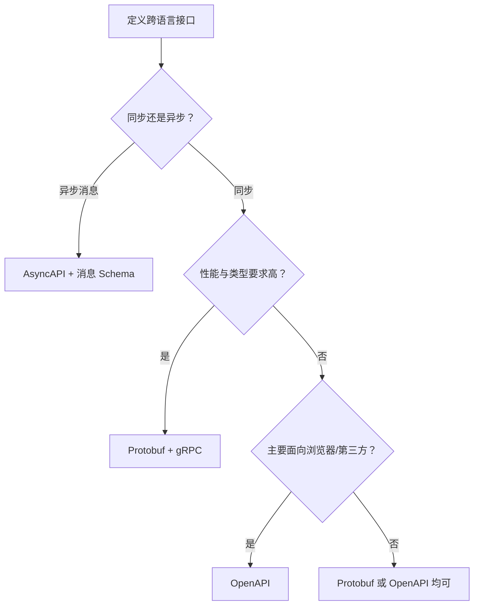
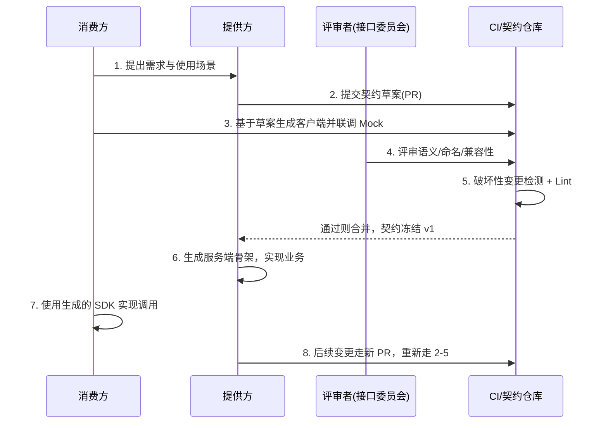
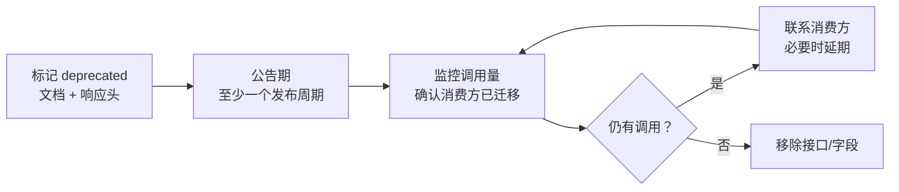

# 03 接口先行与契约驱动

> 如果整个「多语言工程化」只允许保留一个实践，那应该是接口先行。多语言项目里多数协作事故——联调对不上、字段含义分歧、上线顺序冲突——根源都是「接口定义晚于实现」。本章讨论契约的形态、设计流程、兼容规则、版本演进与自动化检查。前置阅读：[[多语言工程化/1统筹与协作/02_仓库结构：Monorepo与Polyrepo|02 仓库结构]]。

---

## 一、接口先行是什么，为什么是并行开发的前提

**Contract First（契约先行）**：在写任何一行业务实现之前，先把跨边界的接口定义（数据结构、方法、错误码、语义）确定下来，并把它作为不可随意变更的事实源。

### 1.1 对比：实现先行 vs 契约先行

| 维度 | 实现先行（Code First） | 契约先行（Contract First） |
|------|----------------------|--------------------------|
| 工作顺序 | 先写代码，后补文档/SDK | 先定义接口，评审后生成代码 |
| 并行能力 | 消费方必须等提供方实现完 | 双方基于契约并行开发 |
| 接口质量 | 接口形状由实现细节决定 | 接口形状由使用场景决定 |
| 文档一致性 | 文档永远滞后于代码 | 文档即契约，代码由契约生成 |
| 变更成本 | 变更无记录，消费方被动适配 | 变更需走评审与兼容检查 |
| 多语言支持 | 每种语言各自手写客户端 | 从契约自动生成各语言 SDK |
| 适合场景 | 单人原型、临时接口 | 多人/多语言/长期演进的接口 |

三个直接收益：并行开发（接口冻结后双方同时开工）、可生成的代码（服务端骨架与客户端 SDK 从契约生成）、可自动化的兼容检查（契约进 CI 做破坏性变更检测）。

### 1.2 契约的最小要素

```text
1. 端点/方法名：做什么（语义明确，不是 getData1）
2. 输入结构：字段名、类型、是否必填、取值范围、默认值
3. 输出结构：成功响应与错误响应的完整结构
4. 错误语义：错误码、可重试性、错误详情格式
5. 幂等性：重复调用是否安全
6. 超时与限制：最大请求体、超时建议、限流规则
7. 认证与鉴权：调用方需要什么凭证、什么权限
8. 版本与生命周期：当前版本、弃用计划
```

## 二、契约的四种形态

| 形态 | 描述对象 | 典型协议 | 代码生成 | 强类型 | 适用场景 | 不适用场景 |
|------|---------|---------|---------|--------|---------|-----------|
| OpenAPI | HTTP REST API | HTTP/JSON | 支持（多语言） | 中 | 对外 API、前后端接口 | 高频内部 RPC、流式通信 |
| Protobuf | 消息与 RPC | gRPC/HTTP | 支持（多语言） | 强 | 服务间通信、高性能场景 | 浏览器直接调用、人读为主 |
| JSON Schema | 数据结构 | 任意 JSON 载体 | 支持 | 中 | 配置校验、事件负载、Webhook | 需要方法定义与传输语义 |
| AsyncAPI | 异步消息 | Kafka/MQTT/AMQP | 支持 | 依载体 | 事件驱动、消息队列契约 | 同步请求响应场景 |

### 2.1 如何选择



务实原则：一个项目内不要用两种以上契约形态做同一层的事。常见组合是「对外 OpenAPI + 对内 gRPC + 事件 AsyncAPI」。

### 2.2 Protobuf 契约示例

```protobuf
// libs/proto/order/v1/order.proto
syntax = "proto3";
package order.v1;
option go_package = "example.com/gen/order/v1;orderv1";
option java_package = "com.example.order.v1";

service OrderService {
  // 创建订单。幂等：相同 request_id 重复调用返回同一订单
  rpc CreateOrder(CreateOrderRequest) returns (CreateOrderResponse);
  rpc GetOrder(GetOrderRequest) returns (GetOrderResponse);
}

message CreateOrderRequest {
  string request_id = 1;      // 幂等键，必填
  string user_id = 2;         // 用户 ID，必填
  repeated Item items = 3;    // 商品列表，至少一项
  string coupon_code = 4;     // 优惠券，可选
}

message Item { string sku_id = 1; int32 quantity = 2; }  // 数量 > 0

message CreateOrderResponse {
  string order_id = 1;
  int64 total_amount_cents = 2;  // 金额用「分」，避免浮点误差
}
```

### 2.3 OpenAPI 契约示例（结构节选）

```yaml
# libs/openapi/order/v1/openapi.yaml
openapi: 3.0.3
paths:
  /orders/{orderId}:
    get:
      operationId: getOrder
      parameters:
        - { name: orderId, in: path, required: true, schema: { type: string } }
      responses:
        "200":
          content:
            application/json:
              schema: { $ref: "#/components/schemas/Order" }
components:
  schemas:
    Order:
      type: object
      required: [orderId, status, totalAmountCents]
      properties:
        status: { type: string, enum: [CREATED, PAID, SHIPPED, CANCELLED] }
        totalAmountCents: { type: integer, format: int64 }
```

---

## 三、设计先行的流程



| 步骤 | 负责方 | 产出 | 验收标准 |
|------|--------|------|---------|
| 1 需求澄清 | 消费方 | 使用场景与字段清单 | 每个字段有明确来源与用途 |
| 2 契约草案 | 提供方 | proto/yaml 文件 PR | 通过 Lint、命名规范 |
| 3 Mock 联调 | 消费方 | 基于契约的 Mock 服务 | 提供方实现前可跑通调用 |
| 4 评审 | 接口委员会 | 评审意见 | 至少一名跨团队评审者通过 |
| 5 兼容检查 | CI | 检测报告 | 无未声明的破坏性变更 |
| 6-7 并行实现 | 双方 | 服务与客户端 | 双方基于同一契约版本 |
| 8 后续变更 | 任何人 | 新契约 PR | 走完整流程，不得直接改 |

### 3.1 Mock 是契约先行的关键工具

契约冻结后消费方不必等待实现，可直接从契约起 Mock：

```bash
# 从 OpenAPI 契约启动 Mock 服务（Prism）
npx @stoplight/prism-cli mock libs/openapi/order/v1/openapi.yaml --port 4010

# Protobuf 侧：buf generate 生成各语言 SDK 后，消费方对 Mock 端点联调
buf generate
```

这一步把「联调」从项目后期提前到接口冻结当天，是压缩交付周期的最大杠杆。

---

## 四、兼容性规则

- **向后兼容（Backward Compatible）**：新版本能正确处理旧客户端发来的数据；
- **向前兼容（Forward Compatible）**：旧版本能安全忽略新客户端带来的新字段。

生产环境要求两者同时满足，因为升级永远不是原子完成的。

### 4.1 Protobuf 字段号规则

Protobuf 的兼容性由**字段号**决定，而不是字段名。三条铁律：

| 规则 | 说明 | 违反后果 |
|------|------|---------|
| 不得复用字段号 | 删除字段后其编号永久保留 | 新旧客户端数据错位 |
| 可加不可改 | 可新增字段；不得改已有字段类型/语义 | 反序列化失败或语义错误 |
| 删除用 reserved | 删除时用 reserved 标记编号与名称 | 后人误用该编号 |

```protobuf
message User {
  string id = 1;
  string name = 2;
  // 邮箱字段已废弃：编号 3 与名称永久保留，禁止复用
  reserved 3;
  reserved "email";
  string phone = 4;  // 新增字段只能使用未使用的编号
}
```

其他细节：枚举必须保留 `UNKNOWN = 0` 并追加新值；不要改 `package` 名；`int32`/`int64` 部分兼容但注意截断；proto3 已移除 `required`，不要使用。

### 4.2 JSON 字段增删策略

| 变更 | 是否兼容 | 前提条件 |
|------|---------|---------|
| 新增可选字段 | 兼容 | 消费方必须忽略未知字段 |
| 新增必填字段 | 破坏性 | 老客户端不会发送该字段 |
| 删除字段 | 破坏性（多数情况） | 除非确认无消费方读取 |
| 修改字段类型 | 破坏性 | 如 string 改 number |
| 修改字段语义 | 破坏性 | 最隐蔽，必须视为破坏性 |
| 枚举新增值 | 兼容 | 消费方有 default 分支处理未知值 |
| 枚举删除/改名 | 破坏性 | 消费方可能依赖旧值 |
| 修改默认值 | 通常兼容 | 依赖默认行为的消费方会受影响 |

配套约定：消费方必须忽略未知字段（如 Jackson 关闭 `FAIL_ON_UNKNOWN_PROPERTIES`）；字段语义不可改变，需要新语义就新增字段；可选性显式化，不靠文档口头约定。速记：**可安全做**的是新增可选字段/枚举值/端点/可选参数；**需要版本升级**的是新增必填字段/删除字段/改类型/改语义/改默认值/收紧校验；**永远不要做**的是复用 Protobuf 字段号、改变已发布字段含义、悄悄修改枚举值。

## 五、API 版本演进策略

| 方案 | 示例 | 优点 | 缺点 | 适用场景 |
|------|------|------|------|---------|
| URL 版本 | `/v1/orders` | 直观、易调试、易路由 | URL 膨胀 | 对外 API、需要清晰可见的版本 |
| Header 版本 | `X-API-Version: 2024-01-01` | URL 稳定、可做日期版本 | 不直观、缓存不友好 | 内部 API、大厂对外 API |
| 媒体类型版本 | `Accept: application/vnd.example.v2+json` | 语义正确、符合内容协商 | 工具支持差、调试困难 | 工程上少见 |

版本演进原则：

1. **版本是最后手段**：能用兼容规则解决的变更不开新版本；
2. **同时维护版本数不超过 2 个**：N-1 与 N，多版本并行是维护灾难；
3. **版本升级必须有截止日期**：新版本发布时同步公布旧版本下线时间；
4. **版本粒度按 API 整体而非单接口**：否则版本矩阵爆炸。

| 变更类型 | 建议处理 |
|---------|---------|
| 兼容变更 | 直接发，不升版本 |
| 小破坏性变更 | 尽量改为兼容设计，或与消费方协商同步升级 |
| 大破坏性变更 | 开新大版本，旧版本进入弃用期 |
| 安全修复 | 所有支持版本同步修复 |

## 六、弃用流程



### 6.1 Deprecation 响应头

```http
HTTP/1.1 200 OK
Deprecation: true
Sunset: Sat, 01 Nov 2026 00:00:00 GMT
Link: <https://api.example.com/v2/orders>; rel="successor-version"
Warning: 299 - "This endpoint is deprecated. Use /v2/orders instead."
```

配套自动化：网关统计已弃用端点的调用方与调用量；CI 对调用已弃用接口的代码发警告；弃用期结束前发邮件/工单通知。

### 6.2 弃用期参考时长

| 场景 | 建议弃用期 |
|------|-----------|
| 内部 API，消费方可控 | 1 个发布周期（2-4 周） |
| 内部 API，多个团队 | 1 个季度 |
| 对外 API | 6-12 个月，按合同与公告执行 |
| 安全漏洞相关 | 立即，配合强制升级 |

## 七、契约的单一事实源

契约必须只有一个权威位置，否则必然漂移：

| 形态 | 做法 | 优点 | 缺点 |
|------|------|------|------|
| Schema 仓库 | 独立 Git 仓库/目录存放契约 | 简单、可评审、版本可控 | 需自建生成与发布流水线 |
| Schema Registry | 专用服务管理 Schema | 自动兼容检查、版本历史、运行时集成 | 需运维服务，引入依赖 |

### 7.1 仓库组织与 Buf

契约的物理位置独立于任何单一语言：

```text
libs/proto/                 # 或独立仓库 proto-contracts
├── buf.yaml                # Buf 配置：lint 与 breaking 规则
├── order/v1/order.proto
└── user/v1/user.proto
```

```yaml
# buf.yaml
version: v2
modules:
  - path: .
lint:
  use:
    - STANDARD          # 命名、包结构等标准规则
breaking:
  use:
    - FILE              # 以文件为单位检测破坏性变更
```

```bash
buf breaking --against '.git#branch=main'   # 与主分支对比检测破坏性变更
buf lint                                     # 检查命名与结构规范
buf generate                                 # 生成各语言代码
```

### 7.2 契约版本与 Git 标签

契约仓库的版本打 Git 标签（如 `proto/order/v1.4.0`），SDK 生成产物与标签一一对应，使「服务 A 用的是哪版契约」有确定答案。详见 [[多语言工程化/1统筹与协作/06_版本管理与发布策略|06 版本管理与发布策略]]。

## 八、RFC 与设计评审流程

契约变更不只是技术问题，也是组织问题。推荐轻量 RFC 流程：

| 阶段 | 动作 | 时长 | 参与者 |
|------|------|------|--------|
| 提案 | 提交 RFC 文档/契约 PR | — | 提出方 |
| 异步评审 | 评审者在 PR 中评论 | 1-3 个工作日 | 相关团队代表 |
| 同步讨论 | 争议较大时开 30 分钟会议 | 按需 | 接口委员会 |
| 决策 | 明确通过/驳回/修改 | — | 接口委员会负责人 |
| 记录 | 决策写入 ADR，契约合并 | — | 提出方 |

RFC 文档至少包含六部分：背景（为什么做）、提案（做什么，附契约 PR）、兼容性分析（向后与向前）、影响面（各消费方与负责人）、备选方案（为什么否掉）、决策结论（谁批准）。

**评审的核心是语义，不是语法**：命名是否清晰、错误是否可处理、边界条件是否定义，比缩进重要得多。

## 九、契约变更的自动化检查

把兼容性规则变成 CI 门禁：

```yaml
# .github/workflows/contract.yml
name: contract-check
on:
  pull_request:
    paths: ["libs/proto/**", "libs/openapi/**"]
jobs:
  check:
    runs-on: ubuntu-latest
    steps:
      - uses: actions/checkout@v4
        with:
          fetch-depth: 0        # 需要完整历史以对比基线
      - uses: bufbuild/buf-setup-action@v1
      - run: buf lint
      - run: buf breaking --against '.git#branch=main'
      # oasdiff 对比主分支与本分支的 OpenAPI 契约
      - run: oasdiff breaking libs/openapi/base.yaml libs/openapi/current.yaml
```

常用检测工具：Protobuf 用 Buf（lint、breaking、代码生成、registry）；OpenAPI 用 oasdiff、openapi-diff；AsyncAPI 用官方 CLI；JSON Schema 用 json-schema-diff 类工具。

| 变更类型 | CI 行为 |
|---------|--------|
| 兼容变更 | 通过，正常合并 |
| 破坏性变更 + 有豁免说明 | 接口委员会 approve 后放行 |
| 破坏性变更 + 无说明 | 直接失败，禁止合并 |

豁免机制必须有，否则团队会绕过检查。豁免方式：PR 描述中填写 `BREAKING-CHANGE: <理由>`，由指定评审者批准。

## 十、常见反模式

| 反模式 | 表现 | 后果 | 纠正 |
|--------|------|------|------|
| 实现先行补文档 | 上线后补 Swagger 注解 | 文档与实现漂移 | 契约进仓库、进 CI，由契约生成代码 |
| 契约与实现漂移 | 直接改代码不改契约 | 生成代码与手写代码冲突 | CI 校验生成代码与契约一致 |
| 契约当草稿 | 契约 PR 随手改不评审 | 消费方被动适配 | 契约变更必须跨团队评审 |
| 字段语义复用 | 同字段在不同版本含义不同 | 最隐蔽的线上事故 | 语义变更必须新增字段 |
| 多版本并行 | 同时维护 3 个以上 API 版本 | 修复要改 N 处 | 最多同时维护 2 个 |
| 无弃用流程 | 直接删除接口 | 消费方线上故障 | 弃用期 + 监控 + 通知 |
| 只生成不用 | 生成 SDK 但手写调用 | 手写实现与契约不一致 | 强制使用生成 SDK |

一个真实案例：某团队把已发布的 `status` 字段从字符串枚举改为数字编码，认为「消费方少，通知一下就行」。结果一个未联系上的内部工具在深夜批量任务中解析失败，对账数据缺失三天。**兼容性规则之所以是铁律，是因为你永远不知道谁在消费你的接口。**

---

## 本章小结

- 接口先行是多语言协作的第一原则：契约冻结后双方并行开发，联调提前到冻结当天；
- 四种契约形态各有边界：OpenAPI 对外、Protobuf 对内、JSON Schema 管数据、AsyncAPI 管消息；
- 设计先行五步：需求澄清、契约草案、Mock 联调、评审、兼容检查；
- 兼容性是纪律：Protobuf 字段号不复用、可加不可改、删除用 reserved；JSON 改语义即破坏性；
- 版本演进优先用兼容变更解决，破坏性变更才开版本，同时维护不超过两个版本；
- 弃用是流程：标记、公告、监控、移除，对外 API 弃用期 6-12 个月；
- 契约要有单一事实源、CI 门禁与 RFC 评审，破坏性变更必须有豁免机制。

下一章讨论「谁来负责这些契约与代码」：[[多语言工程化/1统筹与协作/04_团队分工与代码所有权|04 团队分工与代码所有权]]。

---

## 动手实践

### 任务 1：为一个小功能写契约

选择一个熟悉的功能（如待办事项增删查改），用 Protobuf 或 OpenAPI 写出完整契约。验收标准：

- 包含至少 4 个方法/端点、完整请求响应结构、错误响应结构；
- 每个字段有注释说明含义与约束；
- 标注哪些操作幂等、哪些可重试；
- 契约通过 `buf lint` 或 OpenAPI 校验器检查（无 error）。

### 任务 2：演练一次破坏性变更检测

用 Git 建立契约基线，然后制造三种变更，观察检测结果。验收标准：

- 变更一：新增可选字段——检测通过；
- 变更二：删除字段（未加 reserved）——检测报破坏性变更；
- 变更三：`string` 改为 `int32`——检测报破坏性变更；
- 提交检测报告，写出每种变更的判定与处理方式。

### 任务 3：写一份契约变更 RFC

假设要给一个已上线接口新增「分页」能力，写一份 RFC。验收标准：

- 包含背景、提案、兼容性分析、影响面、备选方案、决策六部分；
- 兼容性分析覆盖向后与向前两个方向；
- 明确是否需要版本升级并给出理由；
- 列出至少 2 个消费方及其迁移动作。

- 返回目录：[[多语言工程化/多语言工程化目录|多语言工程化]]
