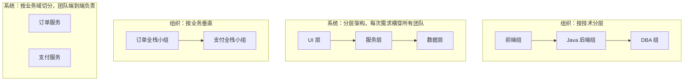
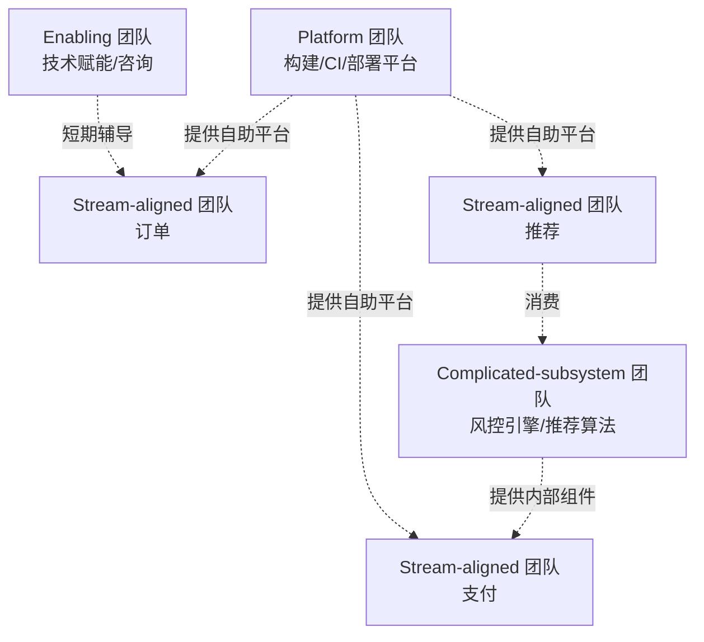
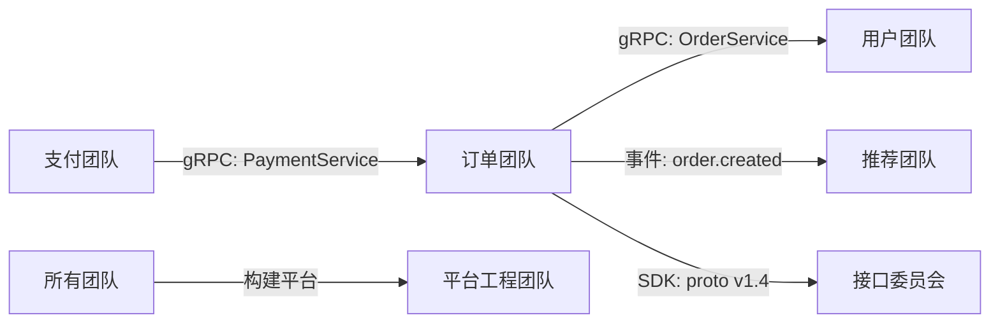

# 04 团队分工与代码所有权

> 多语言项目的技术复杂度只是表象，真正的难点是「谁对什么负责」。本章讨论组织与代码的映射关系：Conway 定律、Team Topologies、垂直与水平切分、CODEOWNERS、跨团队依赖、on-call 与评审 SLA。前置阅读：[[多语言工程化/1统筹与协作/02_仓库结构：Monorepo与Polyrepo|02 仓库结构]] 与 [[多语言工程化/1统筹与协作/03_接口先行与契约驱动|03 接口先行与契约驱动]]。

---

## 一、Conway 定律：架构是组织的投影

> 任何设计系统的组织，其产生的设计等同于组织之间沟通结构的副本。—— Melvin Conway, 1967

工程含义：**如果你的团队按技术层划分（前端组、Java 组、Python 组），系统就会按技术层分；如果按业务能力划分（订单组、支付组），系统就会按业务分。**



Conway 定律的推论不是宿命论，而是一个设计工具：

1. **想让架构变，先动组织**：如果希望服务边界清晰，就把团队按服务划分；
2. **组织与架构不一致时，架构会被组织拖回原形**：按业务拆了服务，却仍按技术层分工，服务最终会互相渗透；
3. **也可以反过来利用它**：先设计目标架构，再据此调整团队，这叫「逆 Conway 机动」。

---

## 二、Team Topologies：四种团队类型

Team Topologies（Matthew Skelton & Manuel Pais）给出了比「按技术/按业务」更细的划分，四种团队类型各有明确职责：



| 类型 | 职责 | 在多语言项目中的例子 | 衡量指标 | 常见错误 |
|------|------|-------------------|---------|---------|
| Stream-aligned | 对齐业务流，端到端交付一个业务域 | 订单团队（Java + 少量 Go） | 交付周期、业务价值 | 被迫做平台工作，交付被拖慢 |
| Platform | 提供自助式内部平台，降低交付团队的认知负担 | 构建系统、CI/CD、发布平台团队 | 平台采用率、交付团队等待时间 | 变成「审批部门」，收口而不是自助 |
| Enabling | 短期辅导其他团队掌握新技能 | 帮 Java 团队接入 gRPC 的专家 | 被辅导团队独立后的能力 | 变成长期外包，能力不落地 |
| Complicated-subsystem | 承担高复杂度子系统 | 风控引擎团队（Rust/C++） | 子系统稳定性、接口清晰度 | 子系统边界不清，向所有团队暴露内部 |

### 2.1 多语言项目中的典型映射

| 团队 | 类型 | 负责语言/组件 |
|------|------|-------------|
| 订单、支付、用户等业务团队 | Stream-aligned | 各自的 Java/Go 服务 |
| 算法团队 | Complicated-subsystem | Python 推荐模型、特征服务 |
| 风控团队 | Complicated-subsystem | Rust/C++ 风控引擎 |
| 平台工程团队 | Platform | Bazel/CI、私有仓库、K8s 平台、脚手架 |
| 架构组/接口委员会 | Enabling（兼治理） | 契约评审、技术选型、跨团队协调 |

**关键约束**：Platform 团队的存在是为了让 Stream-aligned 团队「自助」，而不是制造审批。判断平台团队是否健康的标准是：业务团队接入新服务需要多久？如果需要平台团队手动操作超过一天，平台就是瓶颈。

### 2.2 团队认知负担与「团队 API」

Team Topologies 的核心概念是**认知负担**。每个团队的认知容量有限，团队之间应该用清晰的「团队 API」交互：

- 你提供什么（服务、库、平台能力）；
- 你需要什么（依赖、SLA、接口）；
- 你如何被联系（on-call、频道、评审 SLA）。

团队 API 写不清楚，就会出现「所有事都要找某某人」的单点依赖。

---

## 三、垂直切分 vs 水平切分

| 维度 | 垂直切分（按业务域） | 水平切分（按技术层） |
|------|-------------------|-------------------|
| 划分依据 | 订单、支付、推荐 | 前端、后端、算法、DBA |
| 团队负责范围 | 端到端（含数据、部署、on-call） | 单一技术层 |
| 交付速度 | 快，需求在团队内闭环 | 慢，每个需求横穿多个团队 |
| 技术一致性 | 各团队技术栈可能分化 | 同一层内技术统一 |
| 多语言适配 | 天然适配（每个域选合适语言） | 容易变成「语言组」，跨语言协作成本高 |
| 适合阶段 | 业务复杂、需求多变 | 早期基础设施薄弱的平台建设期 |
| 不适用场景 | 平台能力尚未建成、团队缺乏全栈能力 | 业务需要快速迭代、团队规模大 |

### 3.1 混合切分：垂直为主，水平为辅

现实中推荐「垂直为主 + 水平平台」：

```text
业务交付：订单团队、支付团队、推荐团队（垂直，各自负责语言与部署）
技术平台：平台工程团队（水平，负责构建/CI/可观测性/基础库）
跨域治理：接口委员会、架构评审（水平，负责契约与选型）
```

反面案例：某公司将后端按语言拆成 Java 组和 Go 组，结果每个业务需求都要两个组联合排期，一个简单功能要走两周协调流程。三个月后被迫重组为业务垂直团队。

---

## 四、接口团队与实现团队

当接口（契约）由独立团队维护时（如中台/基础平台），需要明确分工：

| 角色 | 职责 | 不应做的事 |
|------|------|-----------|
| 接口团队 | 契约设计、兼容性把关、SDK 生成、弃用管理 | 替实现团队写业务逻辑 |
| 实现团队 | 按契约实现服务、保证 SLA | 私自改契约、绕开评审 |
| 消费团队 | 按契约调用、反馈需求 | 依赖未公开的内部实现 |

协作机制：

1. **契约评审必须包含消费方**：只有消费方知道自己需要什么；
2. **接口团队提供 Mock 与 SDK**，消费方不需要等待实现；
3. **变更走同一流程**：接口团队也不能单方面改契约；
4. **SLA 写入契约**：可用性、延迟、限流，避免「实现团队说做不到」。

### 4.1 中台反模式

「中台」在多语言环境中常见的失败模式：

| 反模式 | 表现 | 纠正 |
|--------|------|------|
| 中台团队成为瓶颈 | 所有需求排队等中台排期 | 中台只维护契约与核心能力，业务逻辑下放 |
| 接口与实现不分 | 中台既定接口又包办实现 | 拆分职责，实现可下放到业务团队 |
| 强耦合定制 | 每个消费方要求中台加特例字段 | 用扩展字段/事件机制，而非定制接口 |

---

## 五、CODEOWNERS 语法与实战

CODEOWNERS 是 Git 平台根据文件路径自动请求评审的机制。它是「代码所有权」从口头约定变成机器执行的关键一步。

### 5.1 语法要点

```text
# 语法：<路径模式> <owner1> <owner2> ...
# - 最后匹配的规则生效（后写的覆盖先写的）
# - owner 可以是用户(@user)、团队(@org/team)、邮箱
# - 团队必须在组织内存在且有写权限，否则规则静默失效

# 默认兜底：所有未匹配文件由平台团队评审
*                           @example/platform

# 按语言目录分配
/apps/order/                @example/order-team
/apps/recommend/            @example/algorithm-team @example/backend-python
/apps/web/                  @example/frontend

# 共享库：语言对应的平台小组
/libs/common-java/          @example/java-platform
/libs/common-go/            @example/go-platform

# 契约：接口委员会 + 消费方代表
/libs/proto/                @example/api-reviewers @example/order-team
/libs/openapi/              @example/api-reviewers

# 构建与 CI：平台团队，任何变更必须其评审
/Makefile                   @example/platform
/.github/workflows/         @example/platform
/tools/                     @example/platform

# 基础设施：SRE 必须评审
/infra/                     @example/sre

# 文档：各团队自己负责，但架构文档需要架构组
/docs/adr/                  @example/architecture
/docs/                      @example/tech-writers
```

### 5.2 实战规则

1. **每个路径 2-4 个 owner**：1 个是单点，超过 4 个等于没有（见第十一节）；
2. **团队而非个人**：人员流动时不需要改文件；团队可用 `@org/team` 形式；
3. **契约与 CI 必须收口**：这两类变更影响所有人，必须由跨团队角色评审；
4. **避免 `*` 兜底给全员**：`* @all` 等于无人负责；
5. **定期审计**：团队解散、目录迁移后及时更新，失效规则要能自动检测。

### 5.3 平台适配

| 平台 | 文件位置 | 差异 |
|------|---------|------|
| GitHub | `.github/CODEOWNERS` 或根目录 | 支持团队、最后匹配生效 |
| GitLab | `CODEOWNERS`（需启用） | 支持 `[Section]` 分组语法，近似而非精确匹配 |
| Gerrit | `OWNERS` 文件（每个目录） | 就近放置，支持通配符与继承 |

注意：不同平台的匹配语义有细微差别（GitLab 的规则不是「最后匹配」而是所有匹配都生效），迁移平台时需要重新核对。

---

## 六、跨团队依赖的管理

多语言项目的依赖关系是组织关系的镜像。管理跨团队依赖需要三件事：

### 6.1 依赖可视化

定期生成服务/团队依赖图：



工具可以从契约文件自动生成依赖图（谁 import 了哪个 proto 包），比人工维护的架构图可靠。**依赖图的价值在于发现循环依赖与单点枢纽**。

### 6.2 接口冻结

在重要发布前设置接口冻结期：

| 阶段 | 时长 | 规则 |
|------|------|------|
| 设计期 | 发布前 4 周 | 允许提交契约变更，正常评审 |
| 冻结期 | 发布前 2 周 | 只接受兼容性变更（新增可选字段） |
| 发布周 | 1 周 | 禁止契约变更，紧急变更走例外流程 |
| 解冻 | 发布后 | 恢复常态 |

### 6.3 联合排期

跨团队交付用「依赖倒排」方式排期：

```text
目标：订单服务 3 月 30 日上线部分退款
依赖倒推：
  3/30  订单服务上线
  3/25  客服系统接入完成（依赖订单团队提供测试环境）
  3/20  契约冻结（接口委员会评审通过）
  3/10  支付团队确认退款接口联调完成
  3/05  契约草案完成，Mock 可用
```

每个依赖节点要有明确负责人与验收标准，否则「联合排期」会变成「联合甩锅」。

---

## 七、On-call 与责任边界

多语言系统的故障定位往往跨越语言边界，on-call 责任必须先定义清楚：

| 问题 | 责任归属 |
|------|---------|
| 服务本身崩溃 | 服务 owner 团队 |
| 依赖方接口超时导致本服务报错 | 先由本服务 on-call 定位，确认后转依赖方 |
| 契约变更导致消费方故障 | 变更方负责回滚/修复，消费方协助 |
| 平台/CI 故障 | 平台团队 |
| 数据不一致 | 按数据所有权划分，写入方负责 |

### 7.1 On-call 的工程前提

1. **可观测性**：跨语言链路追踪（OpenTelemetry）是跨团队排障的基础，没有它就会互相甩锅；
2. **Runbook**：每个服务有排障手册，包含「常见故障 → 定位命令 → 处理动作」；
3. **升级路径**：明确什么时候升级到二级 on-call、什么时候拉其他团队；
4. **无责复盘**：故障复盘聚焦系统改进，不追责个人，否则故障会被隐瞒。

---

## 八、文档所有权

文档不是「谁有空谁写」，而是与代码一样有 owner：

| 文档类型 | Owner | 更新触发条件 |
|---------|-------|-------------|
| 服务 README | 服务团队 | 接口、部署方式变更时 |
| 契约文档 | 接口团队 | 契约变更时自动生成 |
| ADR | 架构组 + 提案人 | 决策作出时 |
| Runbook | 服务 on-call | 每次故障复盘后 |
| 新人指南 | 平台团队 | 上手流程变更时 |
| API 变更日志 | 接口团队 | 每次发布 |

自动化建议：契约文档由契约生成（不手写）、CHANGELOG 由提交记录生成（见 [[多语言工程化/1统筹与协作/05_Git协作与评审工作流|05 Git 协作与评审工作流]]），把「文档会过期」的问题转化为「文档生成自源头」。

---

## 九、评审 SLA 与响应时间

评审是多语言协作的咽喉。没有 SLA，PR 会在「等别人看」中腐烂。

| PR 类型 | 首次响应 SLA | 完成评审 SLA | 说明 |
|---------|-------------|-------------|------|
| 普通业务 PR | 4 工作小时 | 1 工作日 | 团队内评审 |
| 契约变更 PR | 1 工作日 | 3 工作日 | 跨团队评审 |
| 构建/CI 变更 | 4 工作小时 | 2 工作日 | 平台团队评审 |
| 紧急修复 | 30 分钟 | 2 小时 | 可事后补评审 |
| 安全修复 | 1 小时 | 4 小时 | 优先处理 |

配套机制：

1. **值班评审人**：每个团队每天指定一人负责响应评审，而不是「谁有空谁看」；
2. **自动提醒**：PR 超过 SLA 自动在团队频道提醒；
3. **评审配额**：把评审计入工作量，避免「写代码光荣、评审吃亏」；
4. **小 PR 优先**：见 05 章的 PR 大小原则，评审 SLA 与 PR 大小互相成就。

---

## 十、知识孤岛与 Bus Factor

**Bus Factor（巴士系数）**：多少关键成员突然离开会让项目停摆。多语言项目中，每种语言的 Bus Factor 需要单独评估。

| 风险信号 | 表现 | 应对 |
|---------|------|------|
| 单点 owner | 某语言只有 1 人懂 | 强制结对、轮岗、文档化 |
| 无人敢改的模块 | 修改前必须找原作者 | 补测试、补文档、结对修改 |
| 语言无人能评审 | PR 只能自己批自己 | 培养第二名评审者 |
| 构建脚本无人懂 | 只有一人能改 CI | 平台团队接管，脚本入库评审 |

降低 Bus Factor 的手段：每种语言至少 2 名可评审者（硬指标）；轮换 on-call；决策写入 ADR；结对处理故障；owner 变更必须更新 CODEOWNERS 并做知识转移。

---

## 十一、远程/分布式团队协作要点

| 维度 | 实践 |
|------|------|
| 沟通 | 默认异步：文档 > 评论 > 会议；跨时区时避免「必须同步」的流程 |
| 决策 | 所有决策写入 PR/ADR，口头结论必须回帖确认 |
| 会议 | 有议程、有纪要、有结论负责人；跨时区会议轮流照顾 |
| 代码 | 大 PR 拆分（异步评审更依赖小 PR）、评审意见写清「必须改/建议/nit」 |
| 文档 | 时区差异放大文档价值，Runbook 与上手文档是远程协作的生命线 |
| 信任 | 以产出与评审质量衡量，不以在线时长衡量 |

---

## 十二、常见坑与反模式

| 反模式 | 表现 | 后果 | 纠正 |
|--------|------|------|------|
| Owner 过多 | 每个 PR 挂 10 个 owner | 人人以为别人会看，无人评审 | 每路径 2-4 人 |
| Owner 是个人 | 规则写 `@zhangsan` | 休假/离职即阻塞 | 用团队 handle |
| 幽灵 owner | 团队已解散，规则未更新 | 评审请求石沉大海 | 季度审计 CODEOWNERS |
| 审批式平台 | 平台团队手动批所有变更 | 成为交付瓶颈 | 平台自助化 |
| 责任真空 | 跨语言边界故障无人负责 | 排障互相甩锅 | 明确边界责任与升级路径 |
| 口头决策 | 会议定了，没人记录 | 新人不知为何这样设计 | 决策写入 ADR/PR |
| 全栈要求 | 要求每人都会所有语言 | 认知过载、深度不足 | 主攻一门 + 只读相邻 |
| 单点依赖 | 某语言只有一人能改 | Bus Factor = 1 | 强制双人覆盖 |

一个可操作的检验：随机挑一个 PR，问三个问题——谁是 owner？他多久会响应？如果他休假谁接手？三个问题答不上来，说明所有权机制没有真正运转。

---

## 本章小结

- Conway 定律说明组织与架构互相塑造；想改架构先看组织；
- Team Topologies 四类团队各有职责，平台团队的目标是自助而非审批，enabling 团队必须短期退出；
- 多语言项目推荐「垂直业务团队 + 水平平台团队 + 跨域接口委员会」的混合结构；
- CODEOWNERS 是所有权从口头到机器的关键工具，每路径 2-4 人，用团队而非个人，定期审计；
- 跨团队依赖靠三件事：依赖可视化、接口冻结、联合排期；
- On-call 责任边界与可观测性绑定；文档有 owner；评审有 SLA；
- Bus Factor 每种语言单独评估，硬指标是每语言至少 2 名评审者；
- 常见坑的本质是「责任不清晰」，owner 过多、幽灵 owner、责任真空都源于此。

下一章讨论代码如何提交与评审：[[多语言工程化/1统筹与协作/05_Git协作与评审工作流|05 Git 协作与评审工作流]]。

---

## 动手实践

### 任务 1：为你的项目写 CODEOWNERS

基于你项目的真实目录结构，写一份 CODEOWNERS 文件。

验收标准：

- 覆盖至少 5 类路径（应用、共享库、契约、CI、文档）；
- 每个规则 2-4 个 owner，全部使用团队 handle（可虚构组织名）；
- 契约与 CI 路径由跨团队角色评审；
- 写出 3 条「这条规则防止什么问题」的注释说明。

### 任务 2：绘制团队依赖图

用 mermaid 画出你项目的团队依赖图，并标注依赖类型（RPC、事件、共享库、平台）。

验收标准：

- 至少包含 4 个团队节点；
- 每条边标注依赖类型与对应的契约名称；
- 找出图中一个「单点枢纽」节点（被多个团队依赖者）并说明风险；
- 找出是否存在循环依赖，如有则给出打破方案。

### 任务 3：定义评审 SLA 并设计提醒机制

为你团队设计评审 SLA 表与执行机制。

验收标准：

- 至少区分 4 类 PR（普通、契约、CI、紧急）的响应与完成时限；
- 设计值班评审人轮换方案（含跨时区处理）；
- 描述超时提醒的触发条件与通知渠道；
- 写出一段「为什么评审要计入工作量」的说明（不超过 200 字）。

### 任务 4：评估一个模块的 Bus Factor

选择一个你熟悉的模块，评估它的 Bus Factor。

验收标准：

- 列出该模块涉及的语言与关键知识领域；
- 对每个领域标注「能改的人」数量；
- 给出 Bus Factor 最低的领域与提升计划（至少 2 个动作）；
- 说明如何在 3 个月内验证提升效果。

- 返回目录：[[多语言工程化/多语言工程化目录|多语言工程化]]
