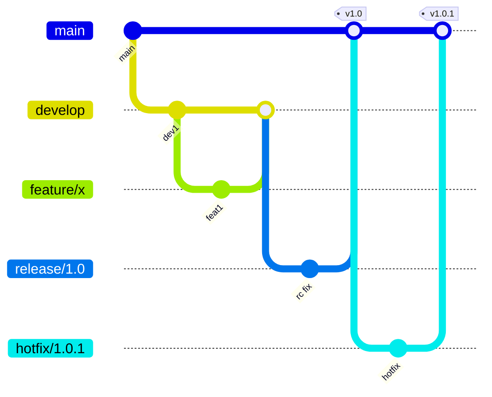
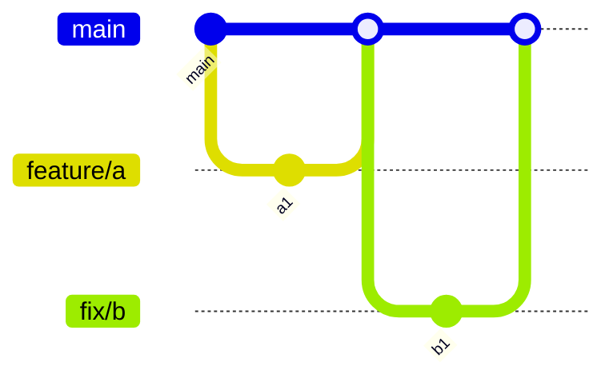
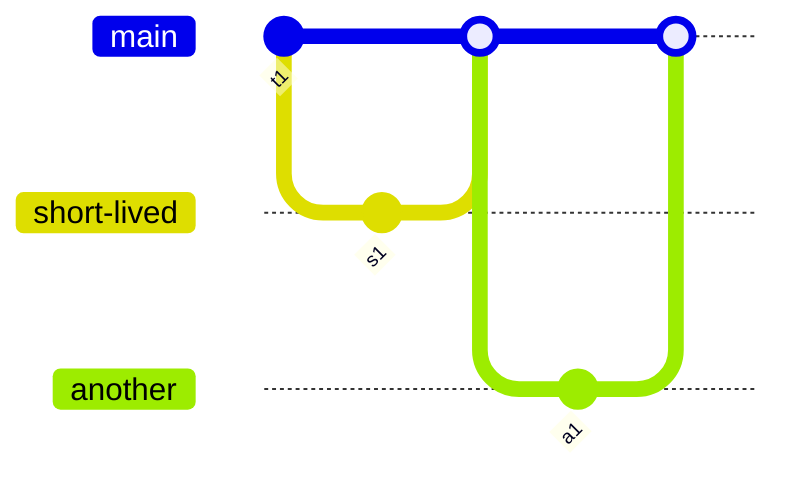
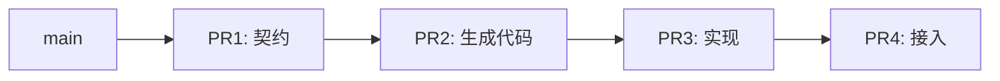
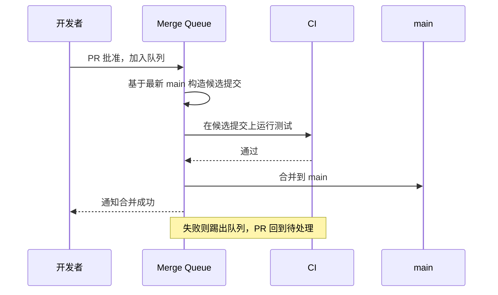

# 05 Git 协作与评审工作流

> 多语言项目里，Git 工作流是团队协作的「物理定律」：它决定了并行度、反馈速度与事故率。工作流选错的代价不会立刻显现，而是在项目中期以「合并冲突地狱、CI 排队、评审积压」的形式爆发。本章讨论分支模型、PR 纪律、提交规范、Merge Queue 与评审文化。前置阅读：[[多语言工程化/1统筹与协作/04_团队分工与代码所有权|04 团队分工与代码所有权]]。

---

## 一、分支模型对比

三种主流模型，适合不同的交付节奏：

### 1.1 Git Flow



- 长期存在 `develop`、`release`、`hotfix` 等多种分支；
- 适合有明确版本发布周期、需要同时维护多个已发布版本的软件（如客户端、SDK、私有化交付）；
- **不适用场景**：持续部署的 Web 服务。长期分支会让集成成本指数上升。

### 1.2 GitHub Flow



- 只有 `main` 长期分支 + 短生命周期功能分支；
- 每次合并即部署（或可部署）；
- 适合持续部署、单版本在线的服务；
- **不适用场景**：需要同时维护多个历史版本的软件；发布需要长冻结期的项目。

### 1.3 Trunk-Based Development（TBD）



- 所有人直接向主干提交（或分支存活不超过 1 天）；
- 未完成功能用特性开关（Feature Flag）隐藏，而不是靠分支隔离；
- 是高绩效交付团队的主流做法（DORA 研究中的关键实践）；
- **不适用场景**：团队缺乏自动化测试与特性开关能力时，直接上 TBD 等于把事故引入主干。

### 1.4 对比表

| 维度 | Git Flow | GitHub Flow | Trunk-Based |
|------|----------|-------------|-------------|
| 长期分支 | develop/release/hotfix | main | main |
| 分支寿命 | 天到周 | 小时到天 | 小时（< 1 天） |
| 集成频率 | 低（按发布集成） | 中 | 极高（每日多次） |
| 对自动化测试要求 | 中 | 高 | 极高 |
| 特性开关依赖 | 无 | 少 | 强依赖 |
| 适合发布节奏 | 版本制（月/季度） | 持续交付 | 持续部署 |
| 多版本维护 | 天然支持 | 困难 | 需版本分支辅助 |
| 学习成本 | 高（流程复杂） | 低 | 中（文化要求高） |
| 不适用场景 | Web 服务持续部署 | 多版本并行维护 | 无自动化测试/开关能力 |

### 1.5 多语言项目的建议

后端服务（可独立部署）用 GitHub Flow 或 TBD；客户端/SDK/对外交付用 GitHub Flow 加发布分支（release branch）管理版本；共享契约仓库用 TBD 加兼容性门禁，因为契约变更需要最快集成与最强检查。

## 二、短生命周期分支与持续集成

持续集成（CI）的本义不是「有 CI 服务器」，而是**每个人每天至少向主干集成一次**。分支寿命越长，集成风险越高：


分支长的团队常有这些症状：CI 在分支上绿、合并到主干后红（主干早已变化）；评审者面对几百个文件无法认真评审；出问题无法定位是哪次变更引入的；开发者害怕合并，于是分支更长，形成恶性循环。

**干预手段**：

| 手段 | 说明 |
|------|------|
| 特性开关 | 未完成功能合入主干但默认关闭 |
| 小步提交 | 每个 PR 只做一件事，见第三节 |
| 每日 rebase | 分支每天同步主干，冲突当天解决 |
| 合并队列 | 见第五节，解决主干竞争 |
| 分支寿命看板 | 公开显示超期分支，推动清理 |

## 三、PR 大小与拆分原则

PR 大小是评审质量的**第一决定因素**。研究与实践的共同结论：超过 400 行的变更，缺陷发现率显著下降。

| PR 规模 | 行数（含测试） | 评审质量 | 建议 |
|---------|--------------|---------|------|
| 理想 | < 200 行 | 高，逐行可审 | 保持 |
| 可接受 | 200-400 行 | 中 | 尽量拆分 |
| 偏大 | 400-800 行 | 低，容易只扫一眼 | 必须说明理由 |
| 过大 | > 800 行 | 极低 | 拆分或改为分阶段合并 |

### 3.1 拆分原则

1. **一个 PR 一个逻辑变更**：重构与功能不混在一起；
2. **先合「无行为变化」的 PR**：重命名、移动文件、格式化单独提；
3. **接口与实现分开**：契约 PR 先合，实现 PR 后合（契约先行，见 [[多语言工程化/1统筹与协作/03_接口先行与契约驱动|03 接口先行与契约驱动]]）；
4. **生成代码单独提**：SDK 生成、锁文件更新不掺杂业务逻辑；
5. **测试与实现同 PR**：测试不能拆到后续 PR（否则就是自欺欺人）。

### 3.2 拆分示例

一个「新增订单导出功能」的正确拆分：

```text
PR 1: 契约变更——新增 ExportOrders RPC（跨团队评审）
PR 2: 生成代码与脚手架（纯生成，快速评审）
PR 3: 导出逻辑实现 + 单元测试
PR 4: 前端接入（消费方，基于契约 Mock 并行开发）
PR 5: 特性开关打开与监控看板
```

每个 PR 都可独立合并、独立回滚。这比一个 3000 行的「大功能 PR」安全得多。

## 四、Stacked PR 与工具

当一个功能确实无法塞进单个小 PR 时，用堆叠 PR（Stacked PR）：多个 PR 串成一条链，每个基于前一个分支。



| 工具 | 形态 | 特点 | 不适用场景 |
|------|------|------|-----------|
| ghstack | Meta 开源，CLI | 与 GitHub PR 集成，提交即堆叠 | 团队无 CLI 使用习惯 |
| Graphite | 商业 SaaS + CLI | 图形化堆叠管理、自动 rebase | 不能使用外部 SaaS 的组织 |
| git-branchless | 开源 CLI | 本地堆叠与撤销，不绑定平台 | 需要平台 UI 支持的团队 |
| 手工堆叠 | Git 原生 | 无额外依赖，靠 base 分支管理 | PR 数量多时维护成本高 |

堆叠 PR 的关键纪律：每个 PR 仍然只做一件事，评审者从栈底开始；栈底合并后，栈中其余 PR 由工具自动 rebase；合并顺序不能乱，否则栈会断裂。

**不适用场景**：PR 之间没有真实依赖关系时，堆叠是过度设计；团队使用 Merge Queue 且 PR 都很小时，堆叠的必要性也下降。

## 五、Merge Queue：解决主干竞争

当主干合并频繁（一天几十次）时，会出现经典问题：PR A 基于 main@abc 通过 CI，PR B 先合并使 main 变为 def，PR A 合并后才发现冲突或语义不兼容，主干变红。

**Merge Queue（合并队列）** 的机制：PR 批准后进入队列，队列自动为每个 PR 构造「假设合并后的主干」并在其上运行 CI，通过才真正合并。



平台支持：GitHub Merge Queue（原生）、GitLab Merge Trains（付费档位）、Bors/Homu（开源早期方案）、Graphite（自带队列）。

**收益**：主干几乎永远绿；**代价**：需要 CI 能在合理时间跑完（否则队列等待时间长），且要求测试足够稳定（flaky 测试会被踢出队列）。CI 时间超过 30 分钟的团队，先优化 CI 再上 Merge Queue。

## 六、提交规范：Conventional Commits

提交信息是生成 CHANGELOG、判断版本升级、定位变更的最小数据单元。Conventional Commits 的格式为 `<type>(<scope>): <description>`，可带 body 与 footer：

```text
feat(order): 新增部分退款接口

支持按商品明细发起部分退款，金额不得超过原订单。
契约见 proto/order/v1/order.proto 的 PartialRefund。

BREAKING CHANGE: CreateOrder 的 coupon_code 字段语义变更，
旧值 "AUTO" 不再自动选择最优券。
Closes: #1234
```

| type | 含义 | 版本影响（SemVer） |
|------|------|-------------------|
| feat | 新功能 | MINOR |
| fix | 缺陷修复 | PATCH |
| perf | 性能优化 | PATCH |
| refactor | 重构（无行为变化） | 无 |
| docs/test/ci/chore | 文档/测试/CI/杂项 | 无 |
| build | 构建/依赖 | 无（或 PATCH） |
| revert | 回滚 | 视被回滚提交而定 |

### 6.1 工具链

```bash
# 安装 commitlint 与 husky（Node 生态示例，其他语言有等价工具）
npm install --save-dev @commitlint/cli @commitlint/config-conventional husky
npx husky init
# commit-msg 钩子：校验提交信息格式
echo 'npx --no -- commitlint --edit "$1"' > .husky/commit-msg
```

```javascript
// commitlint.config.js：约定规则
export default {
  extends: ["@commitlint/config-conventional"],
  rules: {
    "scope-enum": [2, "always", ["order", "payment", "proto", "web", "infra", "deps"]],
    "subject-max-length": [2, "always", 72],
  },
};
```

非 Node 项目不必强行引入 Node 工具链：通用场景用 pre-commit 框架（支持多语言 hook），Python 用 commitizen，Go 用自定义 git hook 加正则校验，Rust 用 cocogitto。

### 6.2 提交规范的价值边界

规范的价值在于可读历史、自动 CHANGELOG、自动版本判断、按类型筛选回滚；但不应要求每个提交都完美（squash 合并时只需 PR 标题合规）。单人项目、纯探索性仓库强制规范只会增加摩擦，属于不适用场景。

## 七、CHANGELOG 自动生成

Conventional Commits 的直接收益是 CHANGELOG 可自动生成：

```bash
# git-cliff：Rust 实现，多语言仓库通用
git cliff --tag v1.5.0 --output CHANGELOG.md      # 生成指定版本
git cliff --unreleased --prepend CHANGELOG.md     # 只生成未发布部分
```

```markdown
## [1.5.0] - 2026-03-30

### 新增
- 订单服务支持部分退款 ([#1234](https://example.com/pr/1234))

### 破坏性变更
- CreateOrder 的 coupon_code 语义变更，旧值 AUTO 不再自动选择最优券
```

工具对比：

| 工具 | 生态 | 特点 | 不适用场景 |
|------|------|------|-----------|
| git-cliff | 通用 | 模板灵活，Rust 单二进制 | 团队要求全 JS 工具链 |
| release-please | GitHub | 自动发 PR 更新 CHANGELOG 与版本 | 非 GitHub 平台 |
| semantic-release | Node | 全自动发布 | 需要人工控制发布节奏时 |
| changesets | JS/TS Monorepo | 手动声明变更集，适合 independent 版本 | 非 JS 仓库 |

## 八、代码评审文化

### 8.1 评审什么 / 不评审什么

| 应该评审 | 不应该评审（交给工具） |
|---------|---------------------|
| 接口语义与命名 | 代码格式（交给 formatter） |
| 边界条件与错误处理 | 简单的 import 顺序（交给 linter） |
| 并发与资源管理 | 拼写（交给 typo 检查器） |
| 测试是否覆盖关键路径 | 行尾空格 |
| 兼容性与迁移影响 | 可自动生成的样板代码 |
| 可读性与设计取舍 | 个人风格偏好 |

**原则**：工具能做的不要占用人的评审注意力。评审应该聚焦「机器判断不了的」——语义、设计、风险。

### 8.2 评论等级标记

统一使用前缀，避免作者猜测严重程度：`blocking`（必须修改，否则不能合并，如逻辑错误、安全问题）、`suggestion`（建议修改，作者可判断）、`nit`（细节问题，不阻塞合并）、`question`（需要解释，可能是评审者知识盲区）、`praise`（值得肯定）。

### 8.3 评审时限与轮次

| 指标 | 建议值 | 说明 |
|------|--------|------|
| 首次响应 | 4 工作小时内 | 超过则 PR 开始腐烂 |
| 完整评审 | 1 工作日内 | 大 PR 可先给整体意见 |
| 评审轮次 | 不超过 2-3 轮 | 超过说明需求没对齐，应同步沟通 |
| 评审人数 | 1-2 人 | 契约/CI 变更另加必选评审者 |

### 8.4 评审者与作者的共同责任

作者负责写清 PR 描述（为什么改、怎么验证、影响面）、控制 PR 大小、主动找评审者；评审者负责及时响应、就事论事、区分「必须」与「偏好」、不搞突然袭击式的大重构要求；有争议时用数据、文档或 30 分钟通话解决，不要在评论区长篇辩论。

## 九、多语言仓库的评审要点

多语言项目特有的评审风险：

| 变更类型 | 必须的评审者 | 检查重点 |
|---------|-------------|---------|
| 契约变更（proto/OpenAPI） | 接口委员会 + 至少一个消费方 | 兼容性、语义、命名 |
| 共享库变更 | 所有使用方团队 | 破坏性 API、传递依赖 |
| 构建/CI 变更 | 平台团队 | 缓存正确性、构建时间影响 |
| 锁文件变更 | 对应语言 owner | 是否引入高危依赖、版本是否合理 |
| 跨语言调用变更 | 两侧团队 | 超时、重试、错误映射 |
| 基础设施变更 | SRE | 资源、安全、回滚方案 |

一个多语言 PR 示例描述模板：

```markdown
## 变更内容
订单服务新增部分退款接口。

## 影响面
契约：libs/proto/order/v1/order.proto 新增 RPC（兼容变更）；消费方：客服系统（@kf-team）已确认排期；数据库：新增 refund_item 表（含迁移脚本）。

## 验证方式
单元测试覆盖金额边界（0、全额、超额）；buf breaking 通过；staging 环境跑通客服系统调用。

## 回滚方案
关闭特性开关 refund.partial.enabled，接口返回 UNIMPLEMENTED。
```

## 十、大型 PR 的处理

不可避免的大型变更（依赖大版本升级、大规模重命名）如何处理：

- 机械变更自动化：用脚本/IDE 批量改，单独 PR，评审只看规则（重命名、格式化）；
- 分阶段合并：加新接口、迁移调用、删旧接口三步走（大重构）；
- 平行实现：新旧实现并存，开关切换（高风险替换）；
- 代码冻结窗口：协调团队在窗口期集中合并（跨仓库大版本升级）；
- 事后补审：紧急修复先合，24 小时内补评审（线上事故）。

**原则：机械变更与语义变更必须分开**。一个 PR 里同时有「重命名 500 个文件」和「修改 3 行逻辑」，评审者永远找不到那 3 行。

## 十一、常见反模式

| 反模式 | 表现 | 后果 | 纠正 |
|--------|------|------|------|
| 长期分支 | 分支存活数周 | 大爆炸合并、冲突地狱 | 短分支 + 特性开关 |
| 大爆炸合并 | 一次性合并数千行 | 无法评审、无法回滚 | 拆分 PR |
| 橡皮图章评审 | 秒批 LGTM | 缺陷流入主干 | 明确评审责任，抽查评审质量 |
| 橡皮筋 PR | 评审后作者大改不重审 | 评审失效 | 实质修改需重新评审 |
| 评审辩论 | 评论区争论几十轮 | 交付停滞、关系恶化 | 两轮未决即同步沟通 |
| 混合 PR | 重构 + 功能 + 格式化混在一起 | 无法定位问题 | 一 PR 一事 |
| 跳过 CI | 管理员强推合并 | 主干红、事故 | 分支保护 + Merge Queue |
| 提交信息垃圾 | `fix`、`update`、`wip` | CHANGELOG 无法生成、无法追溯 | commitlint + squash |
| 主干长期红 | 失败测试无人修 | CI 失去可信度 | 红即停手，优先修复 |

一个真实教训：某团队允许「紧急 PR 跳过评审」，半年后 80% 的 PR 都标注为紧急。**例外机制一旦没有成本，就会变成常态**。紧急通道应要求事后 24 小时内补评审，并统计使用频率。

## 本章小结

- 三种分支模型各有适用边界：Git Flow 适合版本制交付，GitHub Flow 适合持续交付，TBD 是高效团队的主流但依赖测试与开关；
- 短生命周期分支是持续集成的前提，长分支必然导致大爆炸合并；
- PR 大小决定评审质量，200 行以内理想，400 行以上必须拆分；拆分遵循「一 PR 一逻辑变更」；
- Stacked PR 解决有依赖的系列变更；Merge Queue 解决主干竞争，前提是 CI 快而稳；
- Conventional Commits 支撑自动 CHANGELOG 与版本判断，用 commitlint 等工具强制执行；
- 评审聚焦机器判断不了的内容，用 blocking/suggestion/nit 标记等级，遵守响应 SLA；
- 多语言仓库中，契约、共享库、CI、锁文件变更需要指定评审者；
- 反模式的共同根源是「让例外变成常态」，分支保护与紧急通道都需要成本约束。

下一章讨论版本号与发布：[[多语言工程化/1统筹与协作/06_版本管理与发布策略|06 版本管理与发布策略]]。

## 动手实践

### 任务 1：选择并画出你团队的分支模型

根据项目发布节奏，选择 Git Flow、GitHub Flow 或 TBD，并用 mermaid gitGraph 画出典型流程。验收标准：

- 图中包含至少 2 个功能分支与 1 次发布；
- 写出选择理由，并说明为什么另外两种不适用；
- 定义分支命名规范与最长存活时间；
- 说明未完成功能如何合入主干（特性开关方案）。

### 任务 2：配置 commitlint 并验证

在一个本地 Git 仓库中配置 Conventional Commits 校验。验收标准：

- 安装并配置 commitlint（或等价工具）+ Git hook；
- 非法提交信息（如 `update`）被拒绝，合法信息（如 `feat(order): 新增导出`）通过；
- 配置 scope 白名单，非法 scope 被拒绝；
- 提交 5 条不同类型的信息，展示校验结果。

### 任务 3：把一个大型变更拆分为 PR 系列

找一个真实的大变更（如升级框架版本），设计拆分方案。验收标准：

- 拆出至少 4 个 PR，标明依赖顺序与每个 PR 的行数估算；
- 每个 PR 可独立合并、独立回滚；
- 指出哪些 PR 需要跨团队评审；
- 给出回滚方案与验证方式。

### 任务 4：生成一份 CHANGELOG

用 git-cliff 或同类工具，为一个本地仓库生成 CHANGELOG。验收标准：

- CHANGELOG 按类型分组（新增/修复/破坏性变更）；
- 破坏性变更单独成节且有醒目说明；
- 每条记录带 PR/提交链接；
- 说明如何将该生成步骤接入 CI（给出配置片段）。

- 返回目录：[[多语言工程化/多语言工程化目录|多语言工程化]]
