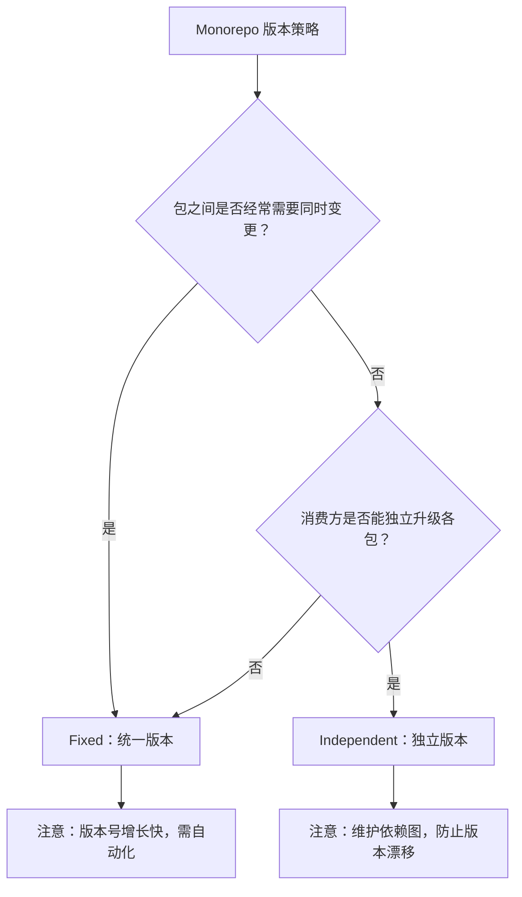
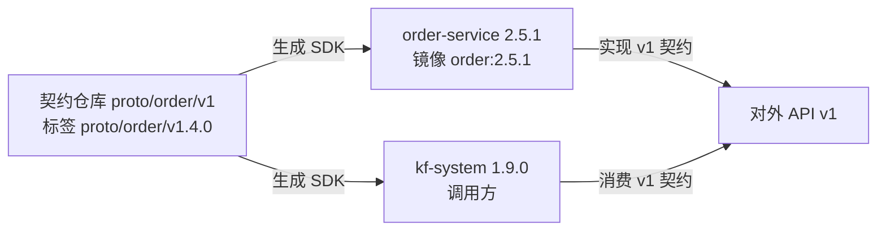
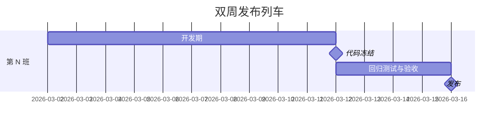

# 06 版本管理与发布策略

> 版本号是团队对外的承诺：承诺了什么变了、什么没变、能不能安全升级。多语言项目中，版本号贯穿包管理、镜像标签、API 契约与部署流水线，任何一处混乱都会导致「升级后发现不兼容」的事故。本章讨论 SemVer 规则、Monorepo 版本策略、发布列车、依赖升级与产物对应。前置阅读：[[多语言工程化/1统筹与协作/03_接口先行与契约驱动|03 接口先行与契约驱动]] 与 [[多语言工程化/1统筹与协作/05_Git协作与评审工作流|05 Git 协作与评审工作流]]。

## 一、语义化版本 SemVer

SemVer 的格式为 `MAJOR.MINOR.PATCH`（如 `2.5.1`）。

| 版本位 | 何时递增 | 含义 | 升级方需要做什么 |
|--------|---------|------|----------------|
| MAJOR | 不兼容的变更 | 破坏性 | 阅读迁移指南，修改调用代码 |
| MINOR | 向后兼容的新功能 | 新增能力 | 无需修改，可直接升级 |
| PATCH | 向后兼容的缺陷修复 | 修复 | 无需修改，建议尽快升级 |

### 1.1 判定表

| 变更 | 判定 | 说明 |
|------|------|------|
| 新增接口/端点 | MINOR | 向后兼容 |
| 新增可选参数 | MINOR | 默认行为不变 |
| 新增必填参数 | MAJOR | 老调用方会失败 |
| 删除接口/字段 | MAJOR | 调用方编译或运行失败 |
| 修改字段类型 | MAJOR | 反序列化/编译失败 |
| 修改字段语义（类型不变） | MAJOR | 最隐蔽的破坏性变更 |
| 修复返回错误结果的 bug | PATCH（需评估） | 依赖错误行为的调用方会受影响 |
| 修改日志格式 | PATCH | 除非日志被程序消费 |
| 提升最低运行时版本 | MAJOR | 如 JDK 17 升到 21 |
| 内部重构 | PATCH 或无发布 | 无对外行为变化 |
| 性能优化 | PATCH | 除非有可观察的行为差异 |
| 安全修复 | PATCH | 所有支持版本同步发 |

### 1.2 一条实用原则

> 只要消费方需要改代码才能升级，就是 MAJOR。判断不了时问一句「升级后调用方是否需要修改」。

SemVer 的承诺是双向的：库作者遵守「MINOR/PATCH 不破坏兼容」，库使用者让依赖范围匹配自己能接受的风险（见第八节）。如果团队做不到严格遵守 SemVer，宁可使用 `0.x` 或明确标注「滚动发布」，也不要发布名不副实的版本号——这比版本号本身更伤害信任。

## 二、0.x 版本的含义

SemVer 规定：主版本号为 0 时，任何版本都可能包含破坏性变更。

| 版本 | 含义 | 使用建议 |
|------|------|---------|
| 0.x.y | 开发期，API 不稳定 | 可用于内部项目，生产依赖需谨慎 |
| 1.0.0 | 首次稳定发布，开始遵守 SemVer 承诺 | 对外发布建议从 1.0.0 开始 |

常见误区：把内部项目长期停留在 0.x，导致既不敢升级也不敢依赖；0.x 阶段随意破坏，消费方却按 SemVer 锁定 `^0.5.0`，结果 MINOR 升级也炸；为了「显得成熟」直接跳 1.0.0，但团队没有能力履行兼容承诺。务实建议：内部共享库被 3 个以上团队使用时就应发布 1.0.0 并承诺兼容性；探索期的库明确标注「实验性」，不要指望版本号传达稳定性。

## 三、预发布版本与构建元数据

```text
1.2.0-alpha.1          预发布：alpha（内测）
1.2.0-beta.2           预发布：beta（公测）
1.2.0-rc.1             预发布：候选发布
1.2.0+build.20260330   构建元数据（不参与优先级比较）
```

### 3.1 优先级规则

```text
1.0.0-alpha < 1.0.0-alpha.1 < 1.0.0-alpha.beta < 1.0.0-beta
< 1.0.0-beta.2 < 1.0.0-beta.11 < 1.0.0-rc.1 < 1.0.0
```

注意 `beta.2 < beta.11`（按数字比较，不是字符串比较），这是很多手写版本比较逻辑出错的地方。

### 3.2 各语言生态的支持

| 生态 | 预发布支持 | 注意点 |
|------|-----------|--------|
| npm | `1.0.0-beta.1` | `npm install pkg` 默认不装预发布版 |
| Maven | `1.0.0-beta-1` | 比较规则与 SemVer 略有差异，`-SNAPSHOT` 表示快照 |
| Go Modules | `v1.0.0-beta.1` | 主版本 > 1 时模块路径必须带 `/v2` |
| Python (PEP 440) | `1.0.0b1` | 归一化后与 SemVer 不完全一致 |
| Cargo | `1.0.0-beta.1` | 与 SemVer 一致 |

多语言项目要特别注意跨语言的版本字符串差异：同一契约版本在 npm 是 `1.0.0-beta.1`，在 Maven 可能是 `1.0.0-beta-1`，在 Go 是 `v1.0.0-beta.1`。发布工具应统一从一处生成，避免手工对齐。

### 3.3 SNAPSHOT 的边界

Maven 的 `-SNAPSHOT` 表示「可变的最新构建」：适合团队内部频繁联调，不适合任何需要可复现构建的场景（SNAPSHOT 的内容会变）。规则是生产依赖禁止使用 SNAPSHOT，CI 中应检查并阻断。

## 四、多语言 Monorepo 的版本策略

| 策略 | 含义 | 优点 | 缺点 | 适用 |
|------|------|------|------|------|
| Fixed（锁定） | 所有包共享同一版本，一起发布 | 版本关系简单、依赖永远对齐 | 一个包变更导致全部重发，版本号膨胀快 | 包之间强耦合、发布节奏一致 |
| Independent（独立） | 每个包独立版本、独立发布 | 变更影响面小、发布灵活 | 需要工具维护依赖图，下游版本漂移 | 包之间松耦合、消费者独立 |
| Hybrid | 核心包锁定，外围包独立 | 平衡两者 | 规则复杂，需要文档 | 大型平台仓库 |

### 4.1 工具支持

| 工具 | Fixed | Independent | 说明 |
|------|-------|-------------|------|
| Nx Release | 支持 | 支持 | JS/TS 为主，可配置 group |
| Lerna | 支持 | 支持 | 与 Nx 集成后能力增强 |
| Changesets | 支持 | 支持 | 手动声明变更集，适合 independent |
| Melos | 支持 | 支持 | Dart/Flutter 生态 |
| Bazel | 不内置 | 不内置 | 需自建发布流程 |
| Go Workspace | 不适用 | 天然独立 | 多模块各自打 tag |

### 4.2 选择建议



Fixed 不等于「所有包版本必须一样」，而是「一起发布、共享版本号」。工具会在发布时统一提升所有变更包的版本，并生成依赖关系一致的发布集合：

```bash
# Nx 发布示例：统一版本 1.4.0，所有变更包同步发布
nx release version 1.4.0 && nx release changelog 1.4.0 && nx release publish
```

## 五、API 版本与应用版本的区别

| 维度 | API 版本 | 应用版本 |
|------|---------|---------|
| 描述对象 | 接口契约（proto/OpenAPI） | 可部署产物（镜像/服务） |
| 示例 | `order.v1`、`/v2/orders` | `order-service:2.5.1` |
| 变更频率 | 低（大版本以年计） | 高（每周/每天） |
| 兼容性要求 | 强（消费方无法同步升级） | 弱（应用可整体替换） |
| 版本号规则 | 通常整数递增（v1、v2） | SemVer |
| 单一事实源 | 契约仓库 | 代码仓库 + Git 标签 |



规则：应用版本升级不要求 API 版本升级（服务内部重构发 2.6.0，API 仍是 v1）；API 版本升级必须伴随应用发布；镜像标签使用应用版本，契约版本记录在构建元数据中（如 OCI 标签 `contract.version=proto/order/v1.4.0`）。

## 六、发布列车与冻结期

| 概念 | 含义 |
|------|------|
| 发布列车 | 固定发车时间（如每两周周三），所有想上车的变更必须赶在截止前完成 |
| 发车截止 | 代码冻结时间，之后只接受修复 |
| 冻结期 | 截止到发布之间的稳定期，用于回归测试与验收 |
| 脱班 | 未赶上的变更进入下一班车，不允许插队 |



适用与不适用：客户端/SDK/私有化交付（用户侧升级成本高）、多团队协同验证、合规要求固定节奏时适用；纯 SaaS 服务、单团队持续部署、需要快速响应市场的产品不适用。**把列车强加给 SaaS 团队会显著降低交付频率**；混合模式下可以让部分模块上车、部分模块持续发布。

## 七、LTS 与支持窗口

| 支持级别 | 含义 | 修复范围 |
|---------|------|---------|
| Current | 最新稳定版 | 功能 + 缺陷 + 安全 |
| LTS（长期支持） | 选定版本，支持 12-24 个月 | 缺陷 + 安全，不加新功能 |
| Maintenance | 即将停止支持 | 仅安全修复 |
| EOL（停止支持） | 不再维护 | 无 |

```text
支持窗口定义：
- 最新 MINOR 版本：完整支持
- 前一个 MINOR 版本：缺陷修复 3 个月
- 每个 MAJOR 的最后一个 MINOR：LTS，支持 12 个月
- 安全修复：覆盖所有 LTS 版本
发布节奏：MINOR 每 6 周；PATCH 按需；MAJOR 每 12-18 个月
```

多语言场景的特殊考虑：不同语言的 SDK 支持窗口应尽量对齐，否则会出现「Java SDK 还支持 v1，Go SDK 已停止」的尴尬局面。

## 八、依赖升级策略

依赖升级是持续性的工程活动，靠人盯必然失败，自动化工具是标配。

### 8.1 Renovate 与 Dependabot 对比

| 维度 | Renovate | Dependabot |
|------|----------|-----------|
| 平台 | 自托管/GitHub App/Mend | GitHub 原生 |
| 生态覆盖 | 极广（含非主流语言与工具） | 主流生态 |
| 配置能力 | 极强（正则、分组、排期） | 中等（YAML） |
| 合并策略 | 支持自动合并、分组 PR | 支持自动合并 |
| 自托管 | 支持 | 不支持 |
| 不适用场景 | 团队无力维护配置复杂度 | 需要非 GitHub 平台或复杂分组 |

### 8.2 Renovate 配置要点

```json
{
  "$schema": "https://docs.renovatebot.com/renovate-schema.json",
  "extends": ["config:recommended", "schedule:weekly"],
  "packageRules": [
    {
      "description": "补丁版本自动合并，降低评审噪音",
      "matchUpdateTypes": ["patch", "pin", "digest"],
      "automerge": true
    },
    {
      "description": "所有语言的依赖分组，减少 PR 数量",
      "matchManagers": ["gomod", "pip_requirements", "maven", "npm"],
      "groupName": "全部非破坏性依赖"
    },
    {
      "description": "主版本升级必须人工评审",
      "matchUpdateTypes": ["major"],
      "automerge": false,
      "labels": ["dependency-major"]
    },
    {
      "description": "契约与共享库不自动升级，需要跨团队协调",
      "matchPackagePatterns": ["^com\\.example\\.proto"],
      "automerge": false,
      "reviewers": ["team:api-reviewers"]
    }
  ]
}
```

### 8.3 自动合并的边界

| 可以自动合并 | 禁止自动合并 |
|-------------|-------------|
| 补丁版本（测试通过） | 主版本升级 |
| 开发依赖的补丁 | 运行时框架的大版本 |
| 锁文件格式更新 | 契约/共享库依赖 |
| 安全修复（有测试覆盖） | 无测试覆盖的模块 |

前提条件：自动合并必须有可靠的测试与 CI，没有测试的自动合并等于自动引入故障。

### 8.4 依赖升级的节奏

| 类型 | 频率 | 方式 |
|------|------|------|
| 安全补丁 | 立即 | 自动 PR + 快速评审 |
| 补丁/小版本 | 每周批量 | 分组自动合并 |
| 主版本 | 每季度规划 | 专项升级，写迁移文档 |
| 语言运行时 | 每年 | 与 LTS 对齐 |

## 九、锁文件的作用与争议

锁文件（lockfile）记录依赖树的精确版本与哈希，是可复现构建的基础。

| 生态 | 锁文件 | 是否入库 | 说明 |
|------|--------|---------|------|
| npm/pnpm/yarn | package-lock.json / pnpm-lock.yaml | 必须 | CI 用 `npm ci` 严格安装 |
| Go | go.sum（+ go.mod） | 必须 | 校验模块哈希 |
| Python | poetry.lock / uv.lock | 应用必须 | 库项目通常不锁 |
| Rust | Cargo.lock | 应用必须，库可选 | 二进制项目必须提交 |
| Java (Maven) | 无官方锁文件 | 用 BOM + 版本固定替代 | 依赖树仍需 CI 校验 |
| Dart | pubspec.lock | 应用必须 | 库项目不提交 |

### 9.1 争议点与工程结论

争议在于「锁文件应入库保证可复现」还是「不入库以保持依赖新鲜」。工程结论：应用（可部署产物）必须提交锁文件，否则同一份代码在不同时间构建出不同产物；库（被他人依赖）通常不提交，因为消费方会重新解析依赖。Monorepo 中锁文件冲突是高频痛点，缓解手段是小 PR、频繁更新、选用对冲突友好的锁文件格式。CI 中必须用严格安装命令（`npm ci`、`--frozen-lockfile`、`go mod verify`），禁止 CI 静默更新锁文件。

## 十、产物版本与 Git 标签的对应

多语言仓库中，产物（镜像、包、SDK）与 Git 标签必须可双向追溯。

| 产物 | 版本来源 | 追溯方式 |
|------|---------|---------|
| 容器镜像 | 应用 SemVer | 镜像标签 + OCI 注解记录 commit SHA |
| 语言包 | 包版本 | 包元数据记录 commit SHA（如 npm 的 gitHead） |
| 契约 SDK | 契约版本 | 生成时写入契约仓库 commit SHA |
| 发布产物 | Git 标签 | 标签必须指向构建所用的确切提交 |

### 10.1 标签规范

```text
order-service/v2.5.1    应用版本
proto/order/v1.4.0      契约版本
libs/common-go/v0.9.3   包版本（Monorepo）
v1.4.0                  全仓库发布（Fixed 策略）
```

```bash
# 创建带注释的标签，注明构建信息
git tag -a order-service/v2.5.1 -m "order-service 2.5.1: 新增部分退款接口"
git push origin order-service/v2.5.1
git show order-service/v2.5.1 --no-patch   # 验证标签指向的提交
```

规则：标签不可变，发布后禁止移动或覆盖，出问题发新版本；标签必须有注释，禁止轻量标签用于发布；镜像构建必须在标签提交上进行，CI 校验 `git describe --exact-match`；版本与产物双向可查，从镜像能查到 commit，从 commit 能查到发布的所有产物。

### 10.2 构建元数据

```dockerfile
# 在镜像中写入构建信息（OCI 标准注解）
LABEL org.opencontainers.image.revision="abc1234"
LABEL org.opencontainers.image.version="2.5.1"
LABEL org.opencontainers.image.source="https://github.com/example/rootstack"
LABEL com.example.contract.version="proto/order/v1.4.0"
```

排查线上问题时，`docker inspect` 能直接确认「这个镜像对应哪个提交、哪个契约版本」，比翻部署记录可靠。

## 十一、发布公告与迁移指南

### 11.1 发布公告模板

```markdown
# order-service 2.5.0 发布公告

## 发布内容
新增部分退款接口（契约 proto/order/v1.4.0）；修复并发下单库存超卖。

## 破坏性变更
无。2.4.x 可平滑升级。

## 升级步骤
更新依赖到 2.5.0，无需修改调用代码。

## 已知问题与回滚
部分退款暂不支持优惠券分摊，预计 2.6.0 支持；回滚到 2.4.3 即可，新接口在旧版本返回 UNIMPLEMENTED。
```

### 11.2 迁移指南要素

| 要素 | 说明 |
|------|------|
| 变更摘要 | 一句话说明变了什么 |
| 影响判断 | 如何判断我是否受影响（代码搜索关键词、日志特征） |
| 迁移步骤 | 分步骤可执行的操作 |
| 代码示例 | 变更前 vs 变更后 |
| 时间线 | 旧版本支持截止日期 |
| 求助渠道 | 谁负责答疑、在哪提问 |

公告渠道：CHANGELOG 是所有变更的单一事实源；破坏性变更必须发邮件/群公告并包含迁移截止时间；大版本可开说明会并录屏存档；代码内 Deprecation 警告用于开发阶段提示；监控看板显示各消费方迁移进度。

## 十二、常见坑与反模式

| 反模式 | 表现 | 后果 | 纠正 |
|--------|------|------|------|
| 破坏性变更不升 MAJOR | 新增必填字段却只升 MINOR | 消费方升级即故障 | 用判定表审查每次发布 |
| 版本号与实际不匹配 | 改了行为却发 PATCH | 信任崩塌 | CI 检查契约 diff 与版本类型 |
| 标签可移动 | 出问题直接改标签指向 | 构建不可追溯 | 标签不可变，发新版本 |
| 生产用 SNAPSHOT | 依赖 `1.0-SNAPSHOT` | 构建不可复现 | CI 阻断 SNAPSHOT |
| 锁文件不入库 | 每次构建解析最新依赖 | 线上行为漂移 | 应用必须提交锁文件 |
| 依赖长期不升级 | 版本落后 2 年 | 安全漏洞、升级成本累积 | Renovate 分组升级 |
| 自动合并无测试 | 依赖升级直接合 | 故障自动引入 | 有测试才开自动合并 |
| 无迁移指南 | 只发版本号 | 消费方不敢升级 | 破坏性变更必须配指南 |
| 多语言版本不一致 | Java SDK v1.3，Go SDK v1.1 | 跨语言行为差异 | 契约版本统一，SDK 同步发布 |

一个高频事故模式：某共享库把 `timeout` 字段的默认值从 30 秒改为 10 秒，认为「只是改了个默认值」发了 PATCH，结果所有未显式设置的调用方超时率飙升。**默认值变更、错误码变更、日志格式变更，这些「看起来小」的变更都必须按破坏性变更处理。**

## 本章小结

- SemVer 是承诺：消费方需要改代码就是 MAJOR；默认值、语义、错误码变更都属于破坏性；
- 0.x 表示不稳定，被多团队使用的库应尽快发布 1.0.0；预发布版本有严格优先级规则，跨语言版本字符串需要统一生成；
- Monorepo 版本策略分 Fixed 与 Independent，按「包之间是否经常同时变更」选择，Nx/Lerna/Changesets/Melos 均可支持；
- API 版本与应用版本是两回事：应用可频繁升级，API 大版本以年计，两者通过契约版本关联；
- 发布列车适合版本制交付，不适合持续部署；LTS 支持窗口需跨语言对齐；
- 依赖升级靠 Renovate/Dependabot 自动化，补丁可自动合并，MAJOR 与契约依赖必须人工评审；
- 应用必须提交锁文件并用严格安装命令，库通常不提交；
- 产物与 Git 标签必须双向可追溯，标签不可变，镜像需记录 commit 与契约版本；
- 破坏性变更必须配迁移指南与明确的时间线。

本部分至此结束。下一步进入 [[多语言工程化/多语言工程化目录|多语言工程化]] 第二部分「构建与依赖」，从 [[多语言工程化/2构建与依赖/01_多语言构建系统全景|多语言构建系统全景]] 开始。

## 动手实践

### 任务 1：为你的项目制定版本规则

为你的项目写一份「版本判定速查表」。验收标准：

- 覆盖至少 10 种变更类型，逐条给出 MAJOR/MINOR/PATCH 判定；
- 特别包含「修改默认值」「修改错误码」「修改日志格式」三个易错项；
- 给出 0.x 与预发布版本的使用规则；
- 说明 API 版本与应用版本的关系（用你的项目举例）。

### 任务 2：配置依赖升级机器人

在 GitHub 仓库（或本地模拟）配置 Renovate 或 Dependabot。验收标准：

- 补丁版本自动合并，主版本人工评审；
- 多语言依赖按语言分组，避免 PR 爆炸；
- 契约/共享库依赖禁止自动合并；
- 输出配置文件的完整内容与三条设计理由。

### 任务 3：设计一次破坏性变更的发布方案

假设你要把某个接口的必填字段改为可选（或反之），设计完整发布方案。验收标准：

- 给出新旧版本号（按 SemVer 判定并说明理由）；
- 画出从发布到旧版本下线的 mermaid 时间线；
- 包含迁移指南的关键内容（影响判断、迁移步骤、时间线）；
- 给出回滚方案与验证方式。

### 任务 4：建立产物追溯链

为一个本地构建的镜像或包，建立「产物 → Git 标签 → commit → 契约版本」的完整追溯。验收标准：

- 镜像（或包）中包含 commit SHA 与版本信息（用 LABEL 或等价机制）；
- Git 标签为带注释标签，指向构建所用提交；
- 写出从产物反查源码与契约版本的具体命令；
- 验证标签不可变性（写出团队阻止移动标签的规则内容）。

- 返回目录：[[多语言工程化/多语言工程化目录|多语言工程化]]
