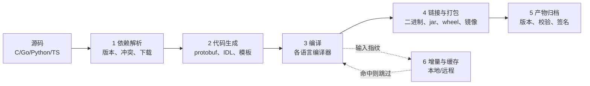
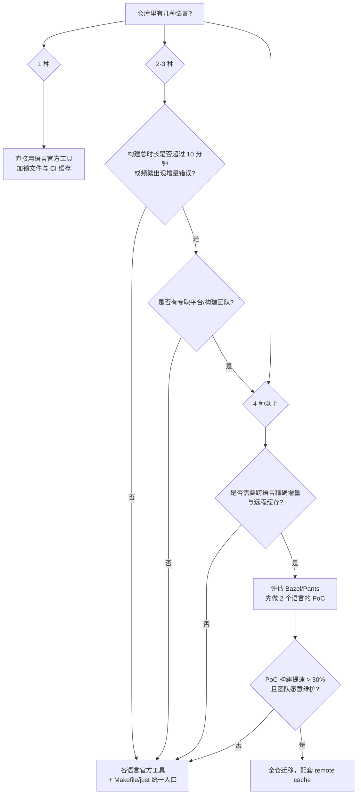
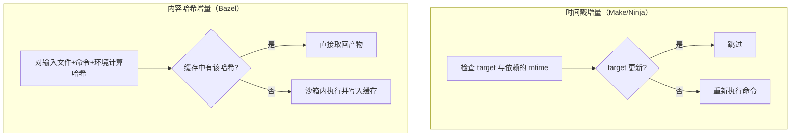

# 多语言构建系统全景

> 构建系统解决的不是「怎么把源码变成二进制」这一个问题，而是「在任何一台机器、任何一个提交上，如何用可预测的时间和产物把源码变成可交付物」。多语言项目里，真正的难点不是学四个构建工具，而是让这四个工具在同一仓库里共享依赖、共享缓存、共享入口，并且失败时能定位到是谁的问题。

单语言项目里，构建工具往往由语言官方钦定，没什么可选的；一旦仓库里出现第二门语言，团队就必须回答：是让每种语言各用各的官方工具、再用脚本粘起来，还是引入 Bazel 这类统一的产物式构建系统？本章先建立全景认知，后面三章分别深入 Bazel、依赖仓库与交叉编译。

---

## 一、构建系统的六项职责

无论工具叫什么名字，一个完整的构建系统都要负责以下六件事。多语言场景的麻烦在于：不同语言对同一职责的实现方式差异巨大，需要一层翻译。



| 职责 | C/C++ | Go | Python | JS/TS | Java |
|------|-------|----|--------|-------|------|
| 依赖解析 | CMake + Conan/vcpkg | go modules | uv/poetry/pip | pnpm/npm | Maven/Gradle |
| 代码生成 | protoc 插件、moc | protoc + go:generate | protoc、pydantic | protobufjs、codegen | annotation processor |
| 编译 | gcc/clang | go tool compile | 解释执行/字节码 | tsc/esbuild/swc | javac |
| 链接打包 | ld、ar | go build | wheel | bundle | jar/war |
| 增量 | 时间戳（Make/Ninja） | 包级内容哈希 | 无（虚拟环境重建） | 模块图 HMR | 任务图增量 |
| 缓存 | ccache/sccache | go build cache | uv cache | pnpm store | Gradle build cache |

**关键认知**：语言官方工具只覆盖了表中部分职责。Python 的 pip 不做编译，Node 的 npm 不做链接，它们的「构建」其实是打包。跨语言项目需要的不是替换这些工具，而是在它们之上补一层编排。

---

## 二、任务式与产物式：两种根本不同的构建模型

### 2.1 任务式构建系统（Task-based）

Make、Ninja、Gradle 的 task、npm scripts 都属于这一类。它的模型是：**声明「哪个文件由哪条命令从哪些文件生成」**，构建系统负责按依赖顺序执行命令，并根据文件时间戳或任务状态跳过已经完成的部分。

```makefile
# 任务式构建的典型心智模型：目标文件 : 依赖文件，然后写命令
# 编译：.c 依赖 .h，只要头文件更新就重编（但实际 Make 不会自动扫描头文件依赖）
app: main.o util.o
	$(CC) -o $@ $^ -lm

%.o: %.c
	$(CC) -c -MMD -MP $< -o $@

-include $(wildcard *.d)   # 靠编译器生成的 .d 文件补齐头文件依赖
```

任务式系统的优点是**透明**：每条命令都是普通 shell 命令，工程师能看懂、能手工重放。缺点是**正确性依赖使用者**：漏写一个依赖，增量构建就会产出陈旧产物；依赖靠时间戳判断，改系统时间或 checkout 旧分支就会误判。

### 2.2 产物式构建系统（Artifact-based）

Bazel、Buck2、Pants 属于这一类。它的模型是：**声明目标（target）的输入集合与动作，构建系统对输入做内容哈希，哈希相同则复用缓存产物**。构建系统自己知道每个动作读了哪些文件（沙箱隔离），因此不存在「漏写依赖」的经典问题。

```python
# Bazel 的产物式模型：target 声明输入（srcs/deps），动作由 rule 固定
# 依赖来自 deps，而不是「隐含地 include 了一个头文件」
cc_library(
    name = "hash",
    srcs = ["hash.cc"],
    hdrs = ["hash.h"],
    deps = [":base"],
    visibility = ["//visibility:public"],
)
```

### 2.3 对比与适用边界

| 维度 | 任务式（Make/Ninja/Gradle） | 产物式（Bazel/Buck2/Pants） |
|------|---------------------------|----------------------------|
| 增量判断 | 文件时间戳/任务状态 | 输入内容哈希 |
| 依赖声明 | 使用者负责，易漏 | 由 rule 与沙箱保证 |
| 跨语言统一 | 每种语言一套，靠脚本粘 | 原生统一 action graph |
| 远程缓存 | 部分支持（ccache/sccache） | 一等公民，按 action 缓存 |
| 学习成本 | 低，会 shell 就能上手 | 高，需要学 BUILD 语言与规则 |
| 生态成熟度 | 每语言极成熟 | C++/Java/Go/Python 较好，前端一般 |
| 小项目体验 | 轻量、够用 | 杀鸡用牛刀，配置成本高于收益 |
| 不适用场景 | 依赖图复杂、需要跨语言精确增量时 | 单语言、少于 3 个模块、构建 1 分钟内完成 |

> 判断标准不是「Bazel 更先进」，而是：**你的团队是否在构建上反复踩坑**（幽灵增量、跨语言重复编译、CI 缓存命中率低）。如果答案是「否」，任务式工具加锁文件就是最优解。

---

## 三、各语言主流构建工具速查

| 语言 | 主流工具 | 配置文件 | 依赖来源 | 锁文件 | 不适用场景 |
|------|---------|---------|---------|--------|-----------|
| C/C++ | Make | Makefile | 系统包/手写 | 无 | 跨平台、依赖复杂 |
| C/C++ | CMake | CMakeLists.txt | find_package/FetchContent | 无（需 Conan 等） | 极小型单文件项目 |
| C/C++ | Meson | meson.build | wrap/系统包 | 无 | 需要 CMake 生态的库 |
| C/C++ | Ninja | build.ninja | 由上层生成 | 无 | 手写（应作为 CMake/Meson 后端） |
| C/C++ | Conan/vcpkg | conanfile.txt/vcpkg.json | 中央仓库 | conan.lock/vcpkg baseline | 纯系统包依赖的项目 |
| Java | Maven | pom.xml | Maven Central/私服 | 无（依赖管理靠版本固定） | 需要复杂自定义构建逻辑 |
| Java | Gradle | build.gradle.kts | 仓库 | dependency locking 可选 | 小型库、团队不熟 Groovy/Kotlin DSL |
| Rust | Cargo | Cargo.toml | crates.io/私服 | Cargo.lock | 多语言单仓统一构建 |
| Go | go build | go.mod | module proxy | go.sum | 需要精细 C++ 集成的项目 |
| Python | uv | pyproject.toml | PyPI/私服 | uv.lock | 需要 conda 生态的科学计算 |
| Python | Poetry | pyproject.toml | PyPI/私服 | poetry.lock | 只想要 venv 管理、不需要打包 |
| Python | Hatch | pyproject.toml | PyPI/私服 | 需 hatch-pip-compile | 大型 monorepo 多包（可配 workspace） |
| JS/TS | pnpm | package.json | npm registry | pnpm-lock.yaml | 需要严格扁平 node_modules 的老项目 |
| JS/TS | Vite | vite.config.ts | 由包管理器决定 | 继承 | 非前端应用构建（服务端打包用 esbuild/tsup） |
| Dart | pub | pubspec.yaml | pub.dev | pubspec.lock | 非 Flutter/Dart 项目 |
| 多语言 | Bazel | BUILD/MODULE.bazel | bzlmod/私有 registry | MODULE.bazel.lock | 小团队、单语言、构建不痛 |
| 多语言 | Pants | BUILD/pants.toml | PyPI/npm 等 | 部分 | Windows 支持弱、团队规模小 |
| 多语言 | Buck2 | BUCK/TARGETS | 自定义 | 自定义 | 非 Meta 生态、文档少 |

**选型口诀**：单语言先用官方工具；两三种语言用「官方工具 + 统一脚本入口」；四种以上且构建超过十分钟，再评估 Bazel。

---

## 四、构建工具选择决策树



决策树的核心不是「语言数量」，而是两个现实问题：**构建是否已经成为瓶颈**、**是否有人愿意长期维护这套构建**。Bazel 迁移失败最常见的原因不是技术，而是没有 owner。

---

## 五、统一构建入口的设计

多语言仓库最容易失控的地方是文档：README 里写着五种构建方式，新人要装五个工具链才能跑起来。统一入口的目标只有一个：**任何人在任何机器上，用一条命令完成「安装依赖 + 构建 + 测试」**。

### 5.1 三种常见方案

| 方案 | 形式 | 优点 | 缺点 | 不适用场景 |
|------|------|------|------|-----------|
| Makefile 包装 | 顶层 Makefile 转发各语言命令 | 无需额外安装，人人会用 | 语法陈旧、跨平台差 | Windows 为主力开发环境 |
| just | justfile，类 Make 但语义更干净 | 跨平台、支持参数与文档注释 | 需要安装 just | 团队无法统一安装工具 |
| Task | Taskfile.yml | YAML 可读、支持依赖与并行 | 需要安装 go-task | 极简项目（杀鸡用牛刀） |
| 纯脚本 | scripts/*.sh | 无依赖、最灵活 | 参数处理与帮助文档要自己写 | 需要跨平台且不想维护两套脚本 |

### 5.2 Makefile 统一入口示例

```makefile
# 顶层 Makefile：统一入口，内部转发到各语言原生工具
# 约定：所有目标都可在 CI 与本地以同一方式调用
.PHONY: help setup build test lint clean

help:  ## 显示所有可用命令
	@grep -E '^[a-zA-Z_-]+:.*?## .*$$' $(MAKEFILE_LIST) | awk 'BEGIN {FS = ":.*?## "}; {printf "  %-12s %s\n", $$1, $$2}'

setup:  ## 安装各语言依赖（锁定版本）
	cd backend-go && go mod download
	cd service-py && uv sync --frozen
	cd web && pnpm install --frozen-lockfile

build:  ## 构建全部产物到 dist/
	cd backend-go && CGO_ENABLED=0 go build -o ../dist/api ./cmd/api
	cd service-py && uv build --out-dir ../dist
	cd web && pnpm build && cp -r dist ../dist/web

test:  ## 运行全部测试
	cd backend-go && go test ./...
	cd service-py && uv run pytest -q
	cd web && pnpm test --run

lint:  ## 统一静态检查
	cd backend-go && gofmt -l . && go vet ./...
	cd service-py && uv run ruff check . && uv run mypy .
	cd web && pnpm lint

clean:  ## 清理产物
	rm -rf dist backend-go/bin
```

### 5.3 justfile 等价版本

```makefile
# justfile：语法比 Make 干净，默认打印注释作为帮助
set shell := ["bash", "-euo", "pipefail", "-c"]

# 安装全部依赖
setup:
    cd backend-go && go mod download
    cd service-py && uv sync --frozen

# 构建全部产物
build:
    cd backend-go && CGO_ENABLED=0 go build -o ../dist/api ./cmd/api
    cd service-py && uv build --out-dir ../dist

# 运行全部测试
test:
    cd backend-go && go test ./...
    cd service-py && uv run pytest -q
```

统一入口的三条设计原则：

1. **命令名跨语言一致**：setup/build/test/lint/clean 五个动词固定，不允许某语言叫 `check`、另一语言叫 `verify`；
2. **入口脚本不做业务逻辑**：只做转发与串行/并行编排，真正的参数交给原生工具，避免「Makefile 里又写了一个构建系统」；
3. **CI 调用的命令与本地完全相同**：CI 里不出现 `npm run build`，只出现 `make build`，保证本地能复现 CI 失败。

---

## 六、增量构建与正确性

### 6.1 增量的两种实现



时间戳增量便宜但有系统性缺陷：`git checkout` 旧分支会让文件时间「倒退」、NFS 时间不同步、生成的中间文件时间戳异常，都会导致漏编。内容哈希增量正确性高，但需要构建系统自己跟踪全部输入（包括编译器版本、环境变量），否则哈希相同而行为不同，缓存就会返回错误产物。

### 6.2 缓存的三层

| 层级 | 代表工具 | 缓存键 | 共享范围 |
|------|---------|--------|---------|
| 编译器缓存 | ccache、sccache | 预处理后的源码 + 编译参数 | 本机/团队远程 |
| 构建缓存 | Gradle Build Cache、go build cache | 任务输入哈希 | 本机/远程 |
| 动作缓存 | Bazel Remote Cache | action 输入哈希 | 全团队/CI |
| 依赖缓存 | pnpm store、uv cache | 包内容哈希 | 本机/CI |

**常见误区**：把 ccache 当成「Bazel 的替代」。ccache 只缓存编译这一步，链接、代码生成、测试仍然全量执行；它能提速 C/C++，但改变不了跨语言构建的编排方式。

### 6.3 正确性优先原则

遇到「增量构建结果不对」时，第一反应必须是**先关闭增量、验证全量构建正确**，再回头定位依赖缺失。工程上宁可牺牲一次缓存，也不能让错误产物进入交付。

---

## 七、构建可复现性

可复现构建（Reproducible Build）指：**相同源码、相同工具链，在任何机器上构建出逐字节相同的产物**。它是安全审计、供应链校验、二进制差分调试的基础。

| 不可复现来源 | 表现 | 对策 |
|-------------|------|------|
| 依赖版本漂移 | 两次构建拉到不同小版本 | 提交锁文件，CI 用 frozen 模式 |
| 工具链漂移 | 本机 gcc 13、CI gcc 12 | 固定版本；用容器镜像固化工具链 |
| 时间戳写入产物 | 二进制里嵌入构建时间 | `SOURCE_DATE_EPOCH`、`-ffile-prefix-map` |
| 路径泄漏 | 调试信息含 `/home/alice/...` | 统一构建路径、`-fdebug-prefix-map` |
| 文件遍历顺序 | 打包内容顺序随机 | 排序输入、固定 locale（`LC_ALL=C`） |
| 并行任务竞争 | 输出顺序不稳定 | 构建系统保证确定性调度 |

```bash
# 以固定时间戳构建，配合 -ffile-prefix-map 消除路径差异
export SOURCE_DATE_EPOCH=$(git log -1 --format=%ct)   # 用最后一次提交时间
export LC_ALL=C
cmake -B build -DCMAKE_BUILD_TYPE=Release \
      -DCMAKE_C_FLAGS="-ffile-prefix-map=$(pwd)=/build"
cmake --build build
```

验证手段：连续两次构建后比较哈希。容器化是当前最省力的复现方案——把工具链版本、系统库、环境变量全部钉在镜像里。

---

## 八、常见坑与反模式

| 坑/反模式 | 后果 | 正确做法 |
|-----------|------|---------|
| 在 Makefile 里写下载依赖 | 构建不可复现、网络故障即失败 | 依赖解析交给锁文件工具，构建阶段离线 |
| 统一入口脚本与 CI 各写一套命令 | 本地过、CI 挂，排查成本翻倍 | CI 只调用统一入口 |
| 用 `file(GLOB)`/通配符收集源文件 | 新增文件不触发重新 configure，漏编 | 显式列出源文件 |
| 所有语言共享一个 build 目录 | 产物互相覆盖、缓存串味 | 按语言/模块分目录，统一收口到 `dist/` |
| 依赖 `latest` 或分支 | 某天开始所有人构建失败 | 全部固定版本与 tag，提交锁文件 |
| 把构建缓存当正确性保证 | 缓存污染导致幽灵 bug | 定期全量构建校验，缓存可随时清空 |
| 多语言各跑各的测试，无统一命令 | 有人只测自己语言，集成问题后移 | `make test` 必须覆盖全部语言 |
| 构建脚本里用绝对路径 | 换机器即失败 | 全部相对仓库根目录 |

---

## 本章小结

- 构建系统有六项职责，语言官方工具只覆盖其中一部分，多语言项目需要一层编排而不是替换；
- 任务式（Make/Ninja）透明但正确性靠人，产物式（Bazel）正确性强但成本高，选型看构建是否真的成为瓶颈；
- 单语言用官方工具，2-3 种语言用「官方工具 + 统一入口」，4 种以上且构建痛才评估 Bazel；
- 统一入口的核心是五个固定动词与「CI 调用与本地一致」，入口本身不写业务逻辑；
- 增量缓存分编译器、构建、动作、依赖四层，正确性永远优先于速度；
- 可复现构建靠锁文件、固定工具链、时间戳与路径处理共同保证。

下一章深入多语言单仓的终极方案：[[多语言工程化/2构建与依赖/02_Bazel多语言单仓构建|02 Bazel 多语言单仓构建]]。

---

## 动手实践

### 任务 1：为三语言小仓库写统一入口

准备一个包含 Go、Python、TypeScript 各一个模块的最小仓库（或使用任意已有项目），实现顶层 `Makefile`，提供 `setup/build/test/lint/clean` 五个目标。

验收标准：

- 新克隆的机器上依次执行 `make setup && make build && make test` 全部成功；
- `make help` 能列出全部目标及说明；
- `make clean` 后仓库中不残留产物（`git status` 干净，忽略项除外）。

### 任务 2：观察增量构建失效

在任务 1 的仓库中做实验：修改一个被多个源文件包含的头文件（Go 可用共享包、Python 可用共享模块），分别用原生工具与 `make build` 触发增量构建，记录哪些产物被重新生成。

验收标准：

- 写出一份表格，列出「修改的文件 → 预期重编的产物 → 实际重编的产物」；
- 至少复现一次「实际与预期不符」的情况（例如 Python 无需重编、Go 包级重编）；
- 给出至少一条改进增量正确性的措施（如补依赖、改用内容哈希工具）。

### 任务 3：验证构建可复现性

对任意一个语言的产物（如 Go 二进制或 Python wheel），连续构建两次并比较 SHA-256。

验收标准：

- 记录两次构建的哈希与差异原因；
- 若两次不一致，使用 `SOURCE_DATE_EPOCH`、固定路径等手段使至少一项产物可复现；
- 提交一份 200 字以内的实验记录（差异来源、使用的手段、剩余不可复现项）。

- 返回目录：[[多语言工程化/多语言工程化目录|多语言工程化]]
