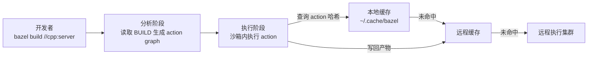
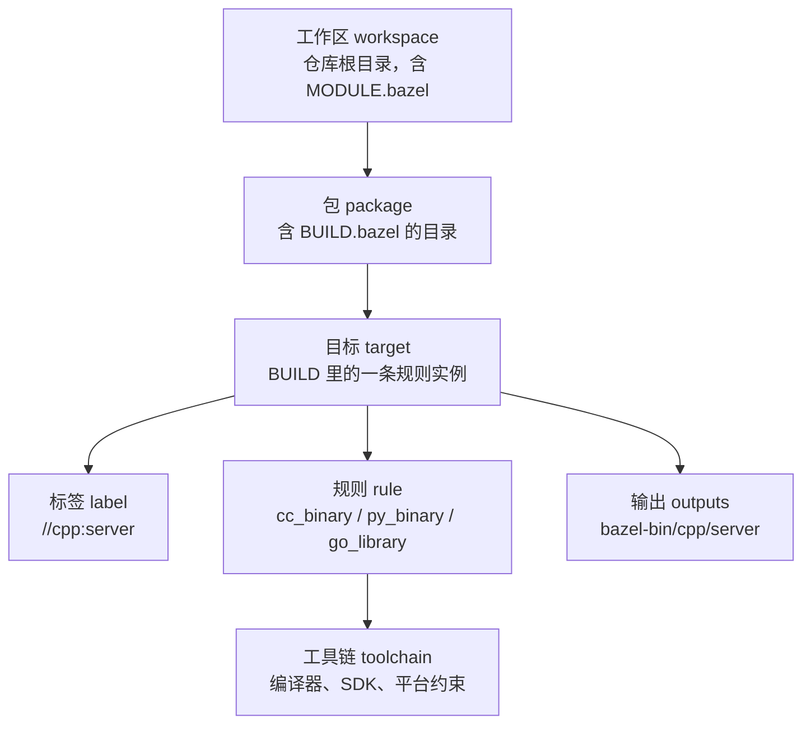

# Bazel 多语言单仓构建

> Bazel 是 Google 内部构建系统 Blaze 的开源版本，它押注的是一个和 Make/CMake 完全不同的模型：构建的正确性由系统保证，而不是由工程师的记忆保证。代价是团队要接受一套新的声明式语言、一套新的目录约定，以及一个需要长期维护的平台层。学 Bazel 的正确姿势是：先搞清楚它替你承担了什么风险，再决定这笔交易是否划算。

在多语言单仓里，构建问题会以组合爆炸的方式出现：C++ 的头文件依赖、Python 的包路径、Go 的 import path、Java 的 classpath、protobuf 生成的代码要在四种语言里保持一致。Bazel 的价值就在于把这些差异收敛到同一个依赖图和同一个缓存模型里。

---

## 一、Bazel 解决什么问题

Bazel 的核心命题可以概括为四条：

1. **精确增量**：每个动作（action）的输入、命令、输出被完整声明，输入内容不变则动作不重复执行。改一行 Python 不会触发 C++ 重编；
2. **跨语言统一**：C++、Go、Python、Java、Protobuf 在同一个 action graph 里，依赖关系可以跨语言（如 Go 目标依赖 protobuf 目标）；
3. **可缓存与可分发**：动作结果可以推到远程缓存，团队和 CI 共享；动作本身可以发到远程执行集群；
4. **可复现与沙箱化**：动作在受限沙箱中执行，只能看到声明的输入，天然发现「漏声明依赖」。

它不解决的问题同样要明确：Bazel 不是包管理器（依赖下载要接 registry 或 `http_archive`）、不是 CI（只提供 `bazel test`）、不是容器构建器（镜像要靠 rules_oci 等扩展）。



---

## 二、核心概念

### 2.1 概念地图



| 概念 | 含义 | 工程要点 |
|------|------|---------|
| workspace | 仓库根，Bazel 的边界 | 一个仓库一个 workspace，跨仓依赖走外部仓库 |
| package | 含 BUILD 文件的目录 | 目录即包，子目录不能属于父包 |
| target | 一个可构建/可测试单元 | 粒度宜小：一个库一个 target |
| label | `//包路径:目标名` | `//cpp:server`、`@rules_go//go:defs.bzl` |
| rule | 构建逻辑的声明 | 内置规则 + 社区规则（rules_go 等） |
| toolchain | 编译工具与平台约束 | 交叉编译、多版本 JDK 靠它切换 |
| hermeticity | 动作只依赖声明的输入 | 违反它会导致缓存返回错误结果 |

### 2.2 从源码到产物

Bazel 先做**分析**（不执行任何编译命令，纯读 BUILD 生成 action graph），再做**执行**（对每个 action 的输入做内容哈希，命中缓存直接取回产物，未命中则在沙箱内执行）。因此它对 BUILD 文件的编写质量极其敏感——一个 `glob()` 或隐式依赖就会让图不准确。

### 2.3 可见性（visibility）

默认 target 只对同包可见，跨包引用必须显式声明 `visibility`：

```python
cc_library(
    name = "hash",
    srcs = ["hash.cc"],
    hdrs = ["hash.h"],
    visibility = ["//visibility:public"],   # 整个仓库可用
    # 也可以写 ["//cpp/...", "//tools:__pkg__"] 精确授权
)
```

可见性是 Bazel 相比 CMake 的巨大优势：依赖关系被强制显式化，删除一个公共 target 前能通过 `rdeps` 找出所有使用者。

---

## 三、bzlmod 依赖管理

Bazel 8 起默认启用 bzlmod，旧的 WORKSPACE 机制已废弃。依赖在 `MODULE.bazel` 中声明，版本解析结果记录在 `MODULE.bazel.lock`。

```python
# MODULE.bazel —— 模块声明与依赖（版本号请以 Bazel Central Registry 当前版本为准）
module(
    name = "polyglot_demo",
    version = "0.1.0",
)

# 各语言规则集：从 BCR 拉取，自动解析传递依赖
bazel_dep(name = "rules_cc", version = "0.1.1")
bazel_dep(name = "rules_go", version = "0.50.1")
bazel_dep(name = "rules_python", version = "1.0.0")
bazel_dep(name = "rules_java", version = "8.6.1")
bazel_dep(name = "protobuf", version = "29.0")
bazel_dep(name = "rules_proto", version = "6.0.2")

# Go 第三方依赖通过 go_deps 扩展桥接 go.mod，避免两套版本清单
go_deps = use_extension("@rules_go//go:extensions.bzl", "go_deps")
go_deps.from_file(go_mod = "//:go.mod")
use_repo(go_deps, "org_golang_google_protobuf")
```

| 能力 | WORKSPACE（旧） | bzlmod（新） |
|------|----------------|--------------|
| 依赖声明 | `http_archive` 手写 URL+SHA | `bazel_dep(name, version)` |
| 传递依赖 | 手工处理，冲突靠运气 | 自动做 MVS 版本解析 |
| 版本覆盖 | `override` 补丁式 | `single_version_override` / `multiple_version_override` |
| 锁文件 | 无 | `MODULE.bazel.lock` 可提交 |
| 私有依赖 | 任意 URL | 私有 registry 或 `git_override` |
| 现状 | Bazel 8 起禁用 | 默认且唯一推荐 |

私有仓库场景下，用 `--registry=https://bcr.internal.example.com/` 指向内网 BCR 镜像，或对单个依赖使用：

```python
# 开发期指向本地路径，便于联调未发布的模块；发布前替换为 registry 版本
local_path_override(module_name = "common_proto", path = "../common-proto")
```

---

## 四、多语言单仓示例

### 4.1 目录结构

```text
polyglot_demo/
  MODULE.bazel, go.mod
  proto/greeter.proto, BUILD.bazel
  cpp/server.cc, BUILD.bazel
  go/greeter.go, BUILD.bazel
  py/worker.py, BUILD.bazel
  java/Cli.java, BUILD.bazel
```

### 4.2 接口定义与代码生成

```protobuf
// proto/greeter.proto —— 全仓唯一的接口事实源
syntax = "proto3";
package demo.v1;

message HelloRequest { string name = 1; }
message HelloReply { string message = 1; }

service Greeter {
  rpc SayHello(HelloRequest) returns (HelloReply);
}
```

```python
# proto/BUILD.bazel —— 一个 proto 目标，四种语言共享
load("@rules_proto//proto:defs.bzl", "proto_library")

proto_library(
    name = "greeter_proto",
    srcs = ["greeter.proto"],
    visibility = ["//visibility:public"],
)
```

### 4.3 C++ 目标

```python
# cpp/BUILD.bazel
load("@rules_cc//cc:defs.bzl", "cc_binary")
# 注意：protobuf 规则路径随版本变化，以下为 Bazel 7/8 + protobuf 29 的路径
load("@protobuf//bazel:cc_proto_library.bzl", "cc_proto_library")

cc_proto_library(
    name = "greeter_cc_proto",
    deps = ["//proto:greeter_proto"],
)

cc_binary(
    name = "server",
    srcs = ["server.cc"],
    deps = [":greeter_cc_proto"],
)
```

### 4.4 Go 目标

```python
# go/BUILD.bazel
load("@rules_go//go:defs.bzl", "go_binary", "go_library")

go_library(
    name = "greeter",
    srcs = ["greeter.go"],
    importpath = "example.com/polyglot_demo/go/greeter",
    visibility = ["//visibility:public"],
    deps = ["@org_golang_google_protobuf//proto"],
)

go_binary(
    name = "client",
    srcs = ["main.go"],
    deps = [":greeter"],
)
```

### 4.5 Python 与 Java 目标

```python
# py/BUILD.bazel
load("@rules_python//python:defs.bzl", "py_binary")

py_binary(
    name = "worker",
    srcs = ["worker.py"],
    deps = ["//proto:greeter_py_proto"],   # 需要 protobuf 规则提供该目标
)
```

```python
# java/BUILD.bazel
load("@rules_java//java:defs.bzl", "java_binary")
load("@protobuf//bazel:java_proto_library.bzl", "java_proto_library")

java_proto_library(
    name = "greeter_java_proto",
    deps = ["//proto:greeter_proto"],
)

java_binary(
    name = "cli",
    srcs = ["Cli.java"],
    main_class = "demo.Cli",
    deps = [":greeter_java_proto"],
)
```

### 4.6 构建与测试

```bash
# 构建全仓或单个目标；测试失败时保留日志
bazel build //...
bazel build //cpp:server
bazel test //... --test_output=errors
bazel clean --expunge   # 慎用：会清掉整个缓存
```

---

## 五、依赖图与查询

Bazel 自带的查询能力是排查「谁依赖了谁」「为什么这个目标被重编」的利器。

| 命令 | 作用 | 典型用途 |
|------|------|---------|
| `bazel query 'deps(//cpp:server)'` | 列出依赖闭包 | 评估改动影响范围 |
| `bazel query 'rdeps(//..., //proto:greeter_proto)'` | 反向依赖 | 改 proto 前找全部消费者 |
| `bazel query 'somepath(//cpp:server, //proto:greeter_proto)'` | 两点间路径 | 解释「为什么这里依赖了它」 |
| `bazel cquery` | 配置后查询 | 区分不同平台/编译模式下的依赖 |
| `bazel aquery` | 查询动作与命令 | 调试「实际执行了什么命令」 |
| `bazel query --output=graph` | 输出 DOT 图 | 可视化依赖关系 |

```bash
# 修改 greeter.proto 前，先找出所有会受影响的目标
bazel query 'rdeps(//..., //proto:greeter_proto)' --output=label

# 查看 C++ 编译动作的实际命令行与输入文件
bazel aquery 'mnemonic("CppCompile", //cpp:server)'
```

工程约定：把常用查询写成脚本放进 `tools/`，例如 `tools/impact.sh <target>` 输出反向依赖，避免每个人凭记忆拼查询表达式。

---

## 六、远程缓存与远程执行

### 6.1 远程缓存

```bash
# 命令行方式：指向团队共享缓存与本地磁盘缓存（断网可用）
bazel build //... --remote_cache=grpc://bazel-cache.internal:9092 --remote_timeout=60
```

```bash
# .bazelrc —— 全仓共享配置，CI 与本地行为一致
common --remote_cache=grpc://bazel-cache.internal:9092
common --remote_timeout=60
build --disk_cache=/var/cache/bazel
test --test_output=errors
build:ci --remote_upload_local_results=true
```

缓存收益的计算方式：命中率 = 缓存命中的 action 数 / 总 action 数。CI 首次构建通常 0%，第二次相同提交接近 100%；日常开发的关键指标是「改一处代码后重编的 action 数」。

### 6.2 远程执行

远程执行把 action 发到集群执行，适合 CI 或大型 C++ 编译：

```bash
bazel build //... \
  --remote_executor=grpc://rbe.internal:8980 \
  --remote_instance_name=main \
  --jobs=200
```

| 能力 | 本地构建 | 远程缓存 | 远程执行 |
|------|---------|---------|---------|
| 复用他人产物 | 否 | 是 | 是 |
| 加速单次冷构建 | 否 | 部分 | 是 |
| 基础设施成本 | 无 | 中（存储） | 高（计算集群） |
| 适用阶段 | 日常开发 | 团队/CI 首选 | 大型仓、CI 高峰 |
| 不适用场景 | 大仓 CI | 无共享网络的团队 | 小团队（维护成本高于收益） |

---

## 七、增量与正确性的取舍

Bazel 的正确性来自三条铁律：

1. **沙箱隔离**：action 只能读声明的输入。若某条规则偷偷读取了未声明的文件，沙箱里会直接失败，而不是悄悄产生错误的增量；
2. **工具链入哈希**：编译器版本、参数、目标平台都是 action 哈希的一部分，换工具链必然全量重编，不会出现「编译器升级了但缓存还在用旧结果」；
3. **依赖显式**：头文件必须出现在 `hdrs`/`deps` 中。C++ 的 `layering_check`、Python 的 `import` 检查都在强化这一点。

代价也要说清楚：

- **分析阶段有成本**：目标很多时，`bazel build //...` 光分析就要数十秒；查询用 `cquery` 更贵；
- **缓存命中率依赖粒度**：一个巨大的 `cc_library` 里改一行，所有依赖它的目标全部重编。目标拆得越细，缓存越有效，但 BUILD 文件越多；
- **规则质量决定一切**：社区规则如果实现得不 hermetic（如读取 `/usr/bin` 下的工具），缓存会跨机器返回不一致结果；频繁 `bazel clean` 说明某处破坏了正确性，应该定位而不是绕开。

---

## 八、学习曲线与团队成本

| 成本项 | 具体表现 | 缓解手段 |
|--------|---------|---------|
| BUILD 语言 | Starlark 语法、宏与规则的区别 | 先只用内置规则，禁止自写 rule |
| 工具链接入 | C++ toolchain、JDK、Python 解释器配置 | 统一用官方 rules + 固定版本 |
| 调试构建失败 | 错误信息与原生工具不同 | 学会 `aquery`、`--sandbox_debug`、`--verbose_failures` |
| 维护 owner | 规则升级、缓存运维 | 指定平台团队负责，写进 CODEOWNERS |
| 迁移成本 | 存量 CMake/Gradle 工程重写 | 按模块渐进迁移，允许两套并存一段时间 |

**团队规模的粗略门槛**：少于 10 名工程师、构建时间低于 5 分钟、语言不超过两种时，引入 Bazel 通常是负收益。

---

## 九、与 CMake/Gradle 对比

| 维度 | CMake | Gradle | Bazel |
|------|-------|--------|-------|
| 定位 | C/C++ 构建生成器 | JVM 生态构建 | 多语言单仓构建 |
| 语言 | CMake DSL | Groovy/Kotlin DSL | Starlark |
| 依赖管理 | 需 Conan/vcpkg | 内建 Maven 仓库 | bzlmod/外部规则 |
| 跨语言 | 弱（C++ 为主） | JVM 为主，可调用外部命令 | 原生多语言 |
| 增量正确性 | 中（依赖靠声明） | 中（任务图） | 高（action 哈希 + 沙箱） |
| 远程缓存 | 无（靠 ccache） | Build Cache | 一等公民 |
| 上手难度 | 低-中 | 中 | 高 |
| 不适用场景 | 多语言统一构建 | 非 JVM 单仓 | 小团队、单语言、构建不痛 |

> 组合用法也常见：Bazel 负责顶层编排，C++ 部分内部仍调用 CMake（`rules_foreign_cc`）。这能降低迁移成本，但会牺牲部分增量精度，属于过渡方案。

---

## 十、常见坑与反模式

| 坑/反模式 | 后果 | 正确做法 |
|-----------|------|---------|
| 用 `glob(["*.cc"])` 收源文件 | 新增文件不影响分析结果，漏编 | 显式列 `srcs`；生成文件用 `genrule` 声明 |
| 一个 target 塞几百个源文件 | 改一行全量重编，缓存命中率低 | 按模块拆 target，粒度 10-50 个文件 |
| 自写复杂 Starlark rule | 破坏 hermeticity，团队难维护 | 优先用官方/社区规则，确需自写时配测试 |
| 依赖未声明（偷读系统库） | 沙箱失败或缓存污染 | 用 `--sandbox_debug` 定位，补齐声明 |
| `visibility = public` 全开放 | 依赖网失控，无法收敛 API | 默认私有，按需授权，用 `rdeps` 审计 |
| CI 与本地配置不同 | 本地绿、CI 红 | 全部固化在 `.bazelrc`，CI 用 `--config=ci` |
| 忘记提交 `MODULE.bazel.lock` | 两次构建解析出不同版本 | 锁文件入库，CI 校验未变更 |
| 把构建产物提交进 git | 仓库膨胀、冲突频发 | `bazel-*` 全部加入 `.gitignore` |
| 缓存无鉴权暴露公网 | 源码与产物泄漏 | 缓存服务内网部署 + TLS + 认证 |

---

## 本章小结

- Bazel 用 action graph + 内容哈希 + 沙箱把构建正确性从「工程师自律」变成「系统保证」，代价是学习与维护成本；
- workspace/package/target/label/rule/toolchain 六个概念是读懂 BUILD 文件的基础；
- bzlmod 用 `MODULE.bazel` + BCR 取代 WORKSPACE，传递依赖与版本冲突处理能力显著增强；
- 同一 proto 目标可被 C++/Go/Python/Java 共享，这是多语言单仓最直接的收益；
- `query`/`cquery`/`aquery` 是排查依赖与增量的核心工具；
- 远程缓存几乎总值得上，远程执行只在构建规模足够大时才划算；
- 小团队、单语言、构建不痛的项目不应使用 Bazel。

下一章回到依赖本身：无论用不用 Bazel，依赖从哪来、如何锁定、如何防供应链攻击，都是必须回答的问题，见 [[多语言工程化/2构建与依赖/03_依赖管理与私有仓库|03 依赖管理与私有仓库]]。

---

## 动手实践

### 任务 1：跑通最小 Bazel 多语言构建

用 Bazelisk（自动管理 Bazel 版本）创建一个含 C++、Go、Python 各一个 `hello` 目标的最小工作区，并在 `MODULE.bazel` 中通过 bzlmod 引入对应规则集。

验收标准：

- `bazel build //...` 在全新克隆上成功，三个语言的产物均生成；
- `bazel test //...` 至少包含一个通过的语言测试；
- `.bazelrc` 中无本机绝对路径，换一台机器（或 Docker 容器）仍可构建。

### 任务 2：依赖查询与影响分析

在任务 1 的仓库中新增一个 `proto/greeter.proto` 与 `proto_library` 目标，让 C++ 与 Python 目标依赖它，然后用查询命令回答：修改该 proto 会影响哪些目标？

验收标准：

- 给出 `rdeps` 查询命令与完整输出；
- 用 `aquery` 找到一条由 proto 触发的代码生成动作，并说明其输入输出；
- 输出中能区分「直接依赖」与「传递依赖」。

### 任务 3：远程缓存实验

用 Docker 启动一个开源 Bazel 远程缓存服务（如 `bazel-remote`），配置 `.bazelrc` 指向它，完成两次构建并观察命中率变化。

验收标准：

- 第一次构建后缓存目录出现对象（记录缓存大小）；
- 第二次相同构建的命令输出中显示远程缓存命中；
- 提交一份记录：命中率、耗时对比、清理本地缓存后仅靠远程缓存重建是否成功。

- 返回目录：[[多语言工程化/多语言工程化目录|多语言工程化]]
