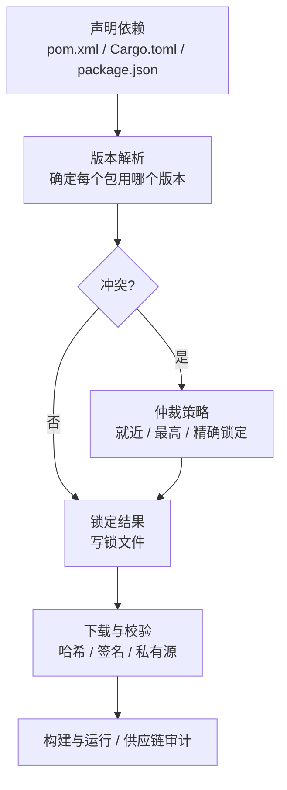
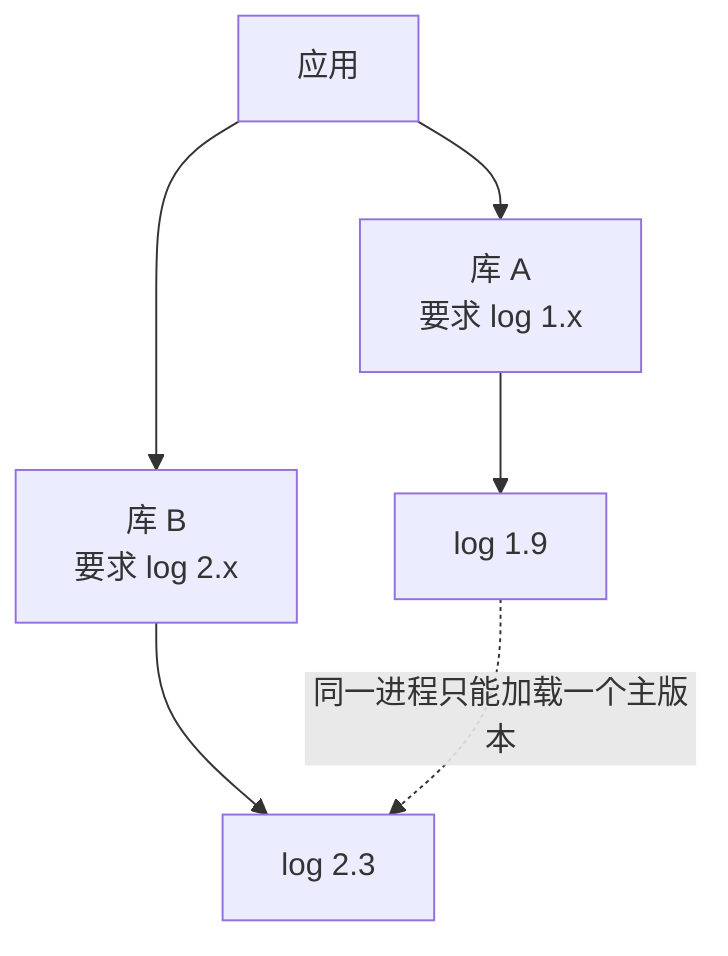
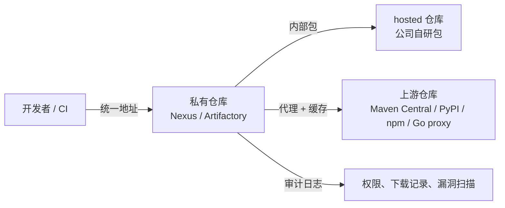
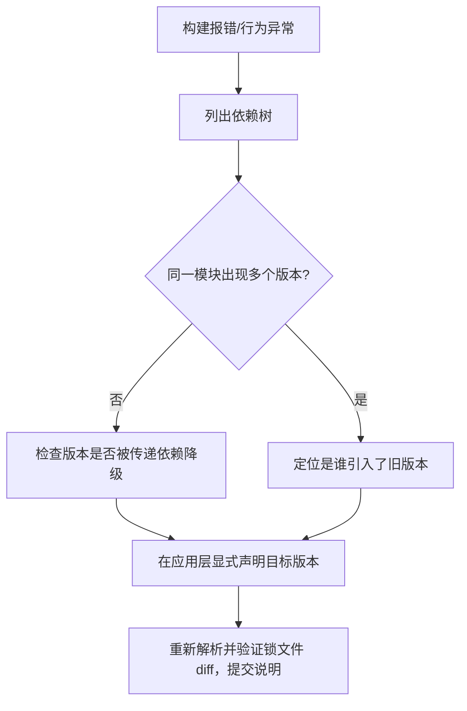
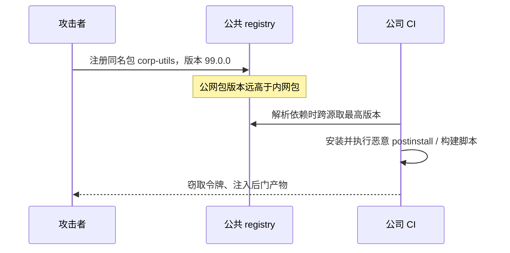

# 依赖管理与私有仓库

> 构建系统决定「怎么编译」，依赖管理决定「编译什么」。前者出错通常立刻可见（编译失败），后者出错往往潜伏数周：某天一个传递依赖偷偷升级，线上行为变化；或者一个内网包名被攻击者在公网抢注，CI 里静默拉到了恶意代码。依赖管理是多语言工程里最容易被低估、也最需要制度化的一环。

一个多语言仓库的依赖来自四五个不同的生态：C++ 的 Conan/vcpkg、Java 的 Maven Central、Python 的 PyPI、Go 的 module proxy、npm registry。它们各自有版本解析算法、锁文件格式和私有仓库协议。本章先建立统一的思维模型，再给出每个生态的具体落地方案。

---

## 一、依赖管理的四个核心问题



### 1.1 版本解析

不同生态的版本解析算法差异巨大，这直接决定了冲突处理的难度：

| 生态 | 解析模型 | 冲突处理 | 典型痛点 |
|------|---------|---------|---------|
| Maven | 就近优先（nearest wins） | 路径最短者胜，同深度先声明者胜 | 传递依赖悄悄降级，无锁文件 |
| Gradle | 最高版本优先（默认） | 同模块取最高版本 | 与 Maven 行为不同，迁移易踩坑 |
| npm/pnpm | 嵌套 + 去重 | 不同版本可共存于 node_modules | 多实例导致 `instanceof` 失效 |
| Go modules | 最小版本选择（MVS） | 取所有约束中的最低可行版本 | 升级需显式 `go get`，但结果可预测 |
| Cargo | 语义化版本 + 多版本共存 | 同主版本取满足约束的最高版 | 重复编译、trait 不兼容 |
| Python (uv/poetry) | 回溯搜索（SAT 类） | 求解全局一致解 | 冲突时解析慢，解可能不存在 |

**工程结论**：MVS（Go）最容易推理，因为「依赖的版本只会升不会降」；SAT 求解（Python）最灵活但可能无解；Maven 的就近优先最容易产生「与我声明的版本不一致」的意外。

### 1.2 传递依赖与钻石冲突



钻石依赖在 Java/Go/Python 里通常只能保留一个版本，在 npm/Cargo 里可以共存但会带来类型不兼容。处理原则：**优先在应用层显式声明被冲突的包版本**，把它变成自己的直接依赖。

### 1.3 供应链安全

依赖是别人写的代码，跑在你的生产环境里。供应链攻击的常见形态：**依赖混淆**（内网包名被公网抢注，CI 拉到恶意版本）、**投毒**（合法包的新版本被植入后门）、**抢注/仿冒**（包名拼写相近，如 `reqeusts`）、**账号接管**（维护者账号被盗后发布恶意版本）。对应防护见本章第十节。

「我本地能跑」的根源往往是依赖漂移。可复现的最低要求是：**提交锁文件，并在 CI 与发布构建中强制使用锁定模式**，禁止构建过程隐式升级任何依赖。

---

## 二、各语言锁文件对比

| 生态 | 锁文件 | 默认提交 | 冻结命令 | 哈希校验 | 备注与不适用场景 |
|------|--------|---------|---------|---------|-----------------|
| Rust/Cargo | `Cargo.lock` | 应用提交；库可选 | `cargo build --locked` | 内建 | 库项目不提交时下游各自解析 |
| Node/npm | `package-lock.json` | 提交 | `npm ci` | integrity 字段 | 手工改 package.json 易与锁文件不一致 |
| Node/pnpm | `pnpm-lock.yaml` | 提交 | `pnpm install --frozen-lockfile` | integrity 字段 | 老项目从 npm 迁移需重建锁 |
| Python/uv | `uv.lock` | 提交 | `uv sync --frozen` | 内建 | 需要 uv 1.0+，团队需统一工具 |
| Python/Poetry | `poetry.lock` | 提交 | `poetry install`（锁存在即用） | `content-hash` 校验 | 解析慢，workspace 支持弱 |
| Python/pip | `requirements.txt`（配合 pip-compile） | 提交 | `pip install -r requirements.txt` | `--require-hashes` | 裸 pip 无锁，必须借 pip-tools/uv |
| Go | `go.mod` + `go.sum` | 提交 | `go build -mod=readonly` | go.sum 全量哈希 | 1.17+ 模块图裁剪，版本已全量固定 |
| Java/Maven | 无原生锁 | — | — | — | 依赖版本靠显式管理；建议 `dependencyManagement` 全量固定 |
| Java/Gradle | `gradle.lockfile`（可选） | 推荐提交 | `--write-locks` | `verification-metadata.xml` 可配 | 默认不开，需团队主动启用 |
| C/C++/Conan | `conan.lock` | 提交 | `conan install --lockfile` | recipe/revision 哈希 | 2.x 才有完善锁支持 |

### 2.1 多语言仓库的锁文件治理

```bash
# CI 中必须使用冻结模式，任何锁文件变更都应导致构建失败并要求开发者提交
npm ci                       # 而不是 npm install
pnpm install --frozen-lockfile
uv sync --frozen             # 而不是 uv sync
cargo build --locked
go build -mod=readonly ./...
```

约定：**锁文件由依赖变更的 PR 一起提交，review 时单独看锁文件 diff**。锁文件出现非预期的大规模变化（例如某个包换了 registry 或版本跳变），必须在合并前解释清楚。

---

## 三、私有仓库方案对比

私有仓库（制品库）有三个作用：**托管内部包、代理上游仓库、统一权限与审计**。代理作用常被忽视，但它同时解决了「外网不稳定」和「依赖混淆」两个问题。



| 方案 | 支持格式 | 部署 | 权限模型 | 代理缓存 | 成本 | 不适用场景 |
|------|---------|------|---------|---------|------|-----------|
| Sonatype Nexus | Maven/npm/PyPI/Go/Docker 等 | 自托管（OSS 免费） | 角色 + 仓库粒度 | 强 | 服务器 + 运维 | 完全无运维人力的团队 |
| JFrog Artifactory | 几乎全部 + 高级元数据 | 自托管/云 | 细粒度、支持联邦 | 强 | 商业授权较贵 | 预算受限的小团队 |
| GitHub Packages | npm/Maven/NuGet/Docker 等 | SaaS | 复用 GitHub 权限 | 弱（无通用代理） | 随用量计费 | 需要代理上游、非 GitHub 生态 |
| GitLab Registry | npm/Maven/PyPI/Go/Docker 等 | SaaS/自托管 | 复用 GitLab 权限 | 弱（部分代理） | 随套餐 | 需要统一代理多生态 |

**选型建议**：已经有 GitLab/GitHub 且依赖量不大，先用平台自带 Packages；需要统一代理与严格审计，选 Nexus（免费）或 Artifactory（付费）；无论选哪个，**所有语言必须统一到同一个入口地址**，否则配置会散落在每个人的 `~/.npmrc`、`~/.m2/settings.xml`、`pip.conf` 里。

### 3.1 各生态接入私有源的配置

```ini
# .npmrc —— npm 按 scope 路由到私有源，避免依赖混淆
@corp:registry=https://nexus.internal/repository/npm-private/
registry=https://nexus.internal/repository/npm-proxy/   # 其余走代理
//nexus.internal/repository/npm-private/:_authToken=${NPM_TOKEN}
```

```xml
<!-- ~/.m2/settings.xml —— Maven 用 mirror 接管全部仓库请求（含 pom 里声明的） -->
<settings>
  <mirrors>
    <mirror>
      <id>corp-nexus</id>
      <mirrorOf>*</mirrorOf>
      <url>https://nexus.internal/repository/maven-public/</url>
    </mirror>
  </mirrors>
</settings>
```

```bash
# Go：私有模块走公司代理，并跳过公共校验和数据库
go env -w GOPROXY=https://nexus.internal/repository/go/,https://proxy.golang.org,direct
go env -w GOPRIVATE=git.internal.example.com/*   # 匹配的模块不走公共 proxy 与 sumdb
```

---

## 四、私有依赖的三种引用方式

| 方式 | 形式 | 优点 | 缺点 | 不适用场景 |
|------|------|------|------|-----------|
| 私有 registry | 发布到 Nexus/Artifactory 后按坐标引用 | 版本语义清晰、可缓存、可审计 | 需要发布流程与权限管理 | 快速联调未发布的改动 |
| Git 引用 | 直接指向仓库与 tag/commit | 无需发布环节，代码即版本 | 解析慢、无包级校验、跨语言工具支持参差 | 需要频繁解析依赖的 CI |
| path/子目录 | 本地相对路径或 monorepo 内引用 | 改完即生效，联调最快 | 破坏可复现，发布前必须换成正式版本 | 跨仓库协作、对外交付 |

### 4.1 各生态语法速查

```toml
# Cargo.toml —— 三种方式对比
[dependencies]
corp-utils = { version = "1.2", registry = "corp" }          # 私有 registry
corp-sdk = { git = "ssh://git@git.internal/corp/sdk.git", tag = "v0.9.0" }
corp-core = { path = "../corp-core" }                         # monorepo 内部
```

```text
# Python requirements（PEP 508 直接引用）
corp-common==2.1.0
corp-sdk @ git+https://git.internal/corp/sdk.git@v0.9.0
```

```go
// go.mod —— Go 用 replace 指向内部路径或 fork
replace example.com/corp/sdk => git.internal.example.com/corp/sdk v0.9.0
```

**工程约定**：`path` 引用只允许出现在开发分支，发布构建（release/CI tag）中必须全部替换为 registry 版本，否则产物无法被他人复现。可以写一个 CI 检查脚本扫描 `path`/`file:`/`replace ../` 并阻断发布。

---

## 五、vendoring 的取舍

Vendoring 指把依赖源码（或二进制）复制进本仓库，如 Go 的 `vendor/`、C/C++ 把第三方源码放进 `third_party/`、Python 的 vendored wheels。

| 维度 | 使用 vendoring | 不使用 vendoring |
|------|---------------|-----------------|
| 构建离线可用 | 是（拷贝全量依赖） | 需私有代理或本地缓存 |
| 审计与打补丁 | 源码在仓内，易改易查 | 需 fork 上游或打 patch 文件 |
| 仓库体积 | 急剧膨胀 | 保持轻量 |
| 依赖升级 | 需手动同步，容易过期 | 一条命令升级 |
| 安全补丁 | 容易漏（没人盯 vendor 目录） | 依赖扫描工具可覆盖 |

**适用**：航空/军工/金融等离线或强审计环境；依赖极小且稳定；上游已停止维护但必须使用。**不适用**：依赖频繁升级；团队没有人力定期同步 vendor 目录；仓库有体积限制。折中方案：只对「关键且不常变」的依赖 vendor，其余走私有代理缓存。

---

## 六、依赖冲突排查方法



各生态的排查命令：

```bash
# Java/Maven：看依赖树与冲突仲裁结果
mvn dependency:tree -Dincludes=com.fasterxml.jackson.core
mvn dependency:tree -Dverbose | grep "omitted for conflict"

# Node：解释为什么装了这个版本
pnpm why lodash          # 输出依赖路径，比 npm ls 清晰

# Go：模块图与某模块被引入的原因
go mod why -m example.com/old/module

# Rust / Python：重复依赖与依赖树
cargo tree -d
uv tree
```

**排除依赖要克制**：`<exclusions>`、`pnpm.overrides`、`[patch]` 都是「我知道自己在做什么」的声明，必须写注释说明原因和移除条件，否则会变成永久性技术债。

---

## 七、依赖更新策略

依赖不更新会积累安全漏洞与升级悬崖；更新太频繁则制造噪音。标准做法是**自动化工具开 PR + 人做合并决策**。

| 维度 | Renovate | Dependabot |
|------|----------|-----------|
| 托管方式 | 自托管/官方 App | GitHub 原生 |
| 生态覆盖 | 极广（含 Docker、Helm、Terraform） | 广，略少 |
| 分组更新 | 强（group/packageRules） | 支持 groups（较新） |
| 私有源支持 | 完整（hostRules） | 有限 |
| 调度与并发 | 细粒度控制 | 基础 |
| 不适用场景 | 团队完全不想维护配置 | 需要复杂分组策略的大型 monorepo |

```yaml
# .github/dependabot.yml —— 多生态统一配置，按周批量更新减少噪音
version: 2
updates:
  - package-ecosystem: "gomod"
    directory: "/backend-go"
    schedule: { interval: "weekly", day: "monday" }
    groups:
      go-deps: { patterns: ["*"] }     # 小版本合并成一个 PR
    open-pull-requests-limit: 5
  - package-ecosystem: "pip"
    directory: "/service-py"
    schedule: { interval: "weekly", day: "monday" }
  - package-ecosystem: "npm"
    directory: "/web"
    schedule: { interval: "weekly", day: "monday" }
    ignore:
      - dependency-name: "typescript"
        update-types: ["version-update:semver-major"]   # 大版本手动升级
```

```json5
// renovate.json —— 分组 + 自动合并策略
{
  "extends": ["config:recommended"],
  "packageRules": [
    { "matchUpdateTypes": ["patch"], "groupName": "patch updates", "automerge": true },
    { "matchUpdateTypes": ["minor"], "groupName": "minor updates" },
    { "matchUpdateTypes": ["major"], "dependencyDashboardApproval": true }
  ]
}
```

更新策略的三条规则：**补丁自动合并（测试通过后）、小版本合并 PR、主版本人工评估**。锁文件与依赖升级必须一起走 CI，禁止跳过测试直接合并安全更新。

---

## 八、SBOM：软件物料清单

SBOM（Software Bill of Materials）是产物的依赖清单，用于漏洞响应（「这个 CVE 影响我们哪些镜像」）与合规审计。两种主流格式：

| 维度 | SPDX | CycloneDX |
|------|------|-----------|
| 主导方 | Linux Foundation | OWASP |
| 标准地位 | ISO/IEC 5962:2021 | ECMA-424 |
| 强项 | 许可证信息、文件级清单 | 安全、漏洞、VEX、服务依赖 |
| 不适用场景 | 需要深度漏洞/VEX 表达 | 需要严格许可证合规报告 |

常用生成工具：

| 工具 | 覆盖 | 输出 | 说明 |
|------|------|------|------|
| Syft | 目录/镜像/文件系统 | SPDX、CycloneDX | 语言无关，镜像扫描首选 |
| Trivy | 镜像/文件系统/仓库 | CycloneDX、SPDX | 兼做漏洞与许可证扫描 |
| cdxgen | 源码仓库多语言 | CycloneDX | 支持多语言 manifest 聚合 |
| 语言插件 | cyclonedx-gradle/npm/python、cargo-cyclonedx | CycloneDX | 构建期生成，信息最准 |

```bash
# 为构建产物生成 CycloneDX SBOM，并用 SBOM 反查漏洞
syft dir:./dist -o cyclonedx-json > dist/sbom.cdx.json
trivy sbom dist/sbom.cdx.json --severity HIGH,CRITICAL
```

工程落地：**SBOM 与产物一起归档**（同一个制品版本、同一个保留策略），并在发布流水线里自动生成，人工补录的 SBOM 很快就会过期。

---

## 九、许可证合规

开源许可证分三类：宽松（MIT/Apache-2.0/BSD）、弱传染（LGPL/MPL）、强传染（GPL/AGPL）。商业产品对强传染许可证通常要求隔离或替换。合规动作是：**扫描 → 生成清单 → 策略判定 → 记录豁免**。

```toml
# deny.toml —— cargo-deny 的许可证策略示例
[licenses]
allow = ["MIT", "Apache-2.0", "BSD-3-Clause", "ISC"]
deny = ["GPL-3.0", "AGPL-3.0"]
confidence-threshold = 0.9
```

```bash
# 常用扫描命令
cargo deny check licenses                 # Rust
pip-licenses --format=markdown            # Python（需先安装）
trivy fs --scanners license .             # 语言无关
```

**注意**：许可证扫描有误报（尤其双许可、文件级声明），所有 `deny` 命中都要人工确认；豁免必须记录在案（ADR 或 `licenses/whitelist.md`），说明用途、范围与到期时间。

---

## 十、供应链攻击与依赖混淆防护



| 措施 | 适用生态 | 说明 |
|------|---------|------|
| 私有源代理 + 单一入口 | 全部 | 开发者只配置私有仓库，公网包由代理拉取并缓存 |
| 命名空间/scope | npm、Maven、NuGet | `@corp/`、`com.corp.*`，公网无法占用 |
| 禁止 `--extra-index-url` | pip | 多源会按版本择优，改用虚拟仓库统一优先级 |
| `GOPRIVATE`/`GONOSUMDB` | Go | 内部模块不走公共代理与校验库 |
| 锁文件哈希校验 | 全部 | 构建时强制 `--frozen`，哈希不匹配即失败 |
| 构建期禁网 | 全部 | 依赖在独立步骤下载，编译步骤无网络 |
| 版本固定 + 延迟升级 | 全部 | 新版本发布后经过观察期再升级，降低投毒窗口 |
| 出处证明 | npm、容器 | npm provenance、Sigstore、SLSA 构建证明 |
| 依赖审核 | 全部 | 新增依赖走 PR review，禁止 `latest` 与未知来源 |

```ini
# .npmrc —— 把私有 scope 钉死在私有源，其余走代理；代理只从上游拉取
@corp:registry=https://nexus.internal/repository/npm-private/
registry=https://nexus.internal/repository/npm-proxy/
```

---

## 十一、常见坑与反模式

| 坑/反模式 | 后果 | 正确做法 |
|-----------|------|---------|
| 不提交锁文件 | 每次构建解析出不同版本 | 锁文件入库，CI 用冻结模式 |
| CI 用 `npm install`/`uv sync` 不带冻结参数 | 悄悄升级依赖，构建不可复现 | 一律 `npm ci`/`--frozen`/`--locked` |
| 多源配置（extra-index-url） | 依赖混淆、解析结果不可预测 | 单一虚拟仓库入口 |
| 依赖写 `latest` 或分支 | 构建随上游变动而失败 | 固定版本或 tag |
| 用 `path`/`file:` 依赖发布 | 下游无法构建 | 发布前替换为 registry 版本并加检查 |
| 全量排除传递依赖 | 运行时缺类/缺符号 | 只在明确冲突时排除并写原因 |
| SBOM 手工维护 | 与产物脱节，应急时不可信 | 流水线自动生成并随产物归档 |
| 私有源只做托管不做代理 | 依赖混淆风险高、外网抖动即失败 | 启用代理 + 缓存 |

---

## 本章小结

- 依赖管理要同时解决版本解析、传递冲突、供应链安全与可复现四个问题，缺一不可；
- 锁文件是可复现的底线，各生态都必须有对应的冻结命令并在 CI 强制；
- 私有仓库既是内部包托管，也是上游代理与审计入口，多语言项目应统一到一个地址；
- 私有依赖三种引用方式各有边界：registry 用于交付、git 用于过渡、path 只用于开发期；
- 冲突排查先列依赖树，再在应用层显式声明版本，排除依赖必须写原因；
- 依赖更新用 Renovate/Dependabot 自动开 PR，补丁自动合并、主版本人工评估；
- SBOM 与产物同生命周期归档，许可证策略要机器可执行、豁免要留痕；
- 依赖混淆的根治手段是「单一私有源 + 命名空间 + 冻结构建」。

下一章处理另一个维度的产物问题：跨平台、跨架构构建与产物归档，见 [[多语言工程化/2构建与依赖/04_交叉编译与产物管理|04 交叉编译与产物管理]]。

---

## 动手实践

### 任务 1：搭建本地私有仓库并接入两个生态

用 Docker 启动 Nexus 3，创建 npm 代理仓库与 PyPI 代理仓库，把本地一个 npm 项目与一个 Python 项目的源地址改为该仓库。

验收标准：

- 两个项目都能从私有仓库成功安装依赖（断外网后第二次安装仍成功，验证缓存生效）；
- 提交配置模板（`.npmrc`、`pip.conf` 或 `uv.toml`），不含真实凭据。

### 任务 2：制造并修复一次依赖冲突

构造一个钻石依赖场景（例如两个库分别要求同一包的不同大版本），分别用依赖树命令定位，并通过应用层显式声明解决。

验收标准：

- 给出冲突前 `dependency tree`/`pnpm why`/`go mod graph` 的原始输出；
- 给出修复方案与修复后的输出对比，说明为何选择该方案（升级上游、显式声明或排除）。

### 任务 3：生成并审计 SBOM

对任务 1 中的任一项目生成 CycloneDX 格式 SBOM，并用扫描器查漏洞与许可证。

验收标准：

- `sbom.cdx.json` 能在本地解析（用 `jq` 检查 `components` 数量）；
- 用 Trivy 或同类工具基于 SBOM 输出 HIGH 及以上漏洞列表。

- 返回目录：[[多语言工程化/多语言工程化目录|多语言工程化]]
