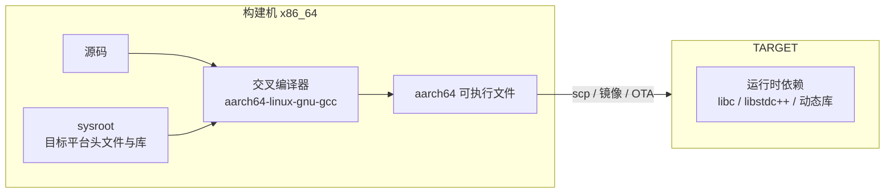
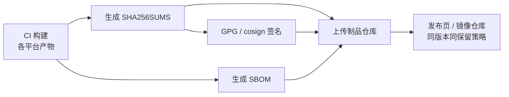

# 交叉编译与产物管理

> 多语言项目最终要交付到各种平台：x86 服务器、ARM 边缘设备、macOS 开发机、Windows 客户端。语言层面「一次编写到处运行」是理想，工程层面「一次构建多处交付」是现实需求。交叉编译负责把源码变成目标平台的产物，产物管理负责让每个产物可辨识、可校验、可追溯。

这一章同时覆盖两条线：**怎么编出别的架构的二进制**（工具链、构建系统、容器），以及**编出来之后怎么管**（命名、版本、校验、签名、归档、保留策略）。两条线都做对，发布才可复现、可回滚、可审计。

---

## 一、基本概念：host、target 与 sysroot

### 1.1 三个关键术语

| 术语 | 含义 | 例子 |
|------|------|------|
| host（构建机） | 执行编译的机器 | x86_64 Linux 开发机 |
| target（目标机） | 产物运行的机器 | aarch64 Linux 设备 |
| 三元组（triple） | 架构-厂商-系统-ABI 的组合 | `aarch64-unknown-linux-gnu` |
| sysroot | 目标平台的系统头文件与库的根目录 | `/usr/aarch64-linux-gnu` |



**核心难点不在编译，而在运行**：交叉编译能产出二进制，但目标机上是否有匹配的 libc 版本、动态库、CPU 指令集，只能通过「与目标环境一致的测试」验证。静态链接（musl）或容器化交付是绕开这个问题的两条主流路径。

### 1.2 常见目标三元组

| 三元组 | 平台 | 典型场景 |
|--------|------|---------|
| `x86_64-unknown-linux-gnu` | x86_64 Linux + glibc | 服务器 |
| `x86_64-unknown-linux-musl` | x86_64 Linux + musl 静态 | 容器、免依赖分发 |
| `aarch64-unknown-linux-gnu` | ARM64 Linux | 云 ARM 实例、树莓派 64 位 |
| `armv7-unknown-linux-gnueabihf` | ARM32 硬浮点 | 嵌入式设备 |
| `aarch64-apple-darwin` | Apple Silicon | 桌面工具 |
| `x86_64-pc-windows-msvc` | Windows | 客户端 |

---

## 二、C/C++ 交叉编译

### 2.1 安装交叉工具链

```bash
# Debian/Ubuntu：安装 aarch64 交叉编译器与目标平台运行库
sudo apt install gcc-aarch64-linux-gnu g++-aarch64-linux-gnu libc6-dev-arm64-cross

# 验证：能编出 aarch64 的 ELF
echo 'int main(void){return 0;}' | aarch64-linux-gnu-gcc -x c - -o /tmp/a.out
file /tmp/a.out   # 输出应含 "ARM aarch64"
```

### 2.2 CMake toolchain file

CMake 不直接支持交叉编译参数，而是通过 `CMAKE_TOOLCHAIN_FILE` 注入。这是 CMake 交叉编译的唯一推荐方式。

```cmake
# cmake/toolchains/aarch64-linux-gnu.cmake —— 目标平台 aarch64 + glibc
set(CMAKE_SYSTEM_NAME Linux)          # 触发交叉编译模式，必须设置
set(CMAKE_SYSTEM_PROCESSOR aarch64)

set(CMAKE_C_COMPILER   aarch64-linux-gnu-gcc)
set(CMAKE_CXX_COMPILER aarch64-linux-gnu-g++)

set(CMAKE_SYSROOT /usr/aarch64-linux-gnu)
set(CMAKE_FIND_ROOT_PATH /usr/aarch64-linux-gnu)

# 查找规则：程序在构建机找，库/头文件/包只在 sysroot 找
set(CMAKE_FIND_ROOT_PATH_MODE_PROGRAM NEVER)
set(CMAKE_FIND_ROOT_PATH_MODE_LIBRARY ONLY)
set(CMAKE_FIND_ROOT_PATH_MODE_INCLUDE ONLY)
set(CMAKE_FIND_ROOT_PATH_MODE_PACKAGE ONLY)
```

```bash
# 使用 toolchain file 配置与构建
cmake -B build-arm64 -S . \
  -DCMAKE_TOOLCHAIN_FILE=cmake/toolchains/aarch64-linux-gnu.cmake \
  -DCMAKE_BUILD_TYPE=Release
cmake --build build-arm64 -j

# 检查产物架构与动态依赖（注意：ldd 在构建机上不可用）
file build-arm64/app
aarch64-linux-gnu-readelf -d build-arm64/app | grep NEEDED
```

### 2.3 musl 静态链接

glibc 的向后兼容是「旧系统能跑新程序」，反过来不行：在 Ubuntu 24.04（glibc 2.39）上编译的程序无法在 CentOS 7（glibc 2.17）运行，报 `GLIBC_2.34 not found`。静态链接 musl 可以从根本上消除对目标机 libc 的依赖。

| 维度 | glibc 动态链接 | musl 静态链接 |
|------|---------------|--------------|
| 部署依赖 | 需目标机有兼容 glibc | 单文件，无 libc 依赖 |
| 体积 | 小（共享 libc） | 大（内嵌 libc） |
| DNS/NSS 行为 | 支持 NSS 插件、LDAP 等 | 行为简化，某些企业环境不兼容 |
| 性能 | 通用优化充分 | 小内存场景常更快，极端负载下 malloc 表现不同 |
| 不适用场景 | 需要 NSS、locale、iconv 全功能 | 需要完整 POSIX 扩展与 glibc 特有接口 |

```bash
# 安装 musl 工具链并静态编译：产物不依赖任何 .so
sudo apt install musl-tools musl-dev
musl-gcc -static -O2 -o app_static app.c
file app_static       # "statically linked"
./app_static          # 直接运行，无需动态库
```

CMake 中切换到 musl 只需换 toolchain file 中的编译器，并把 `CMAKE_SYSTEM_NAME` 设为 Linux 即可（`musl-gcc` 自带 sysroot）。

### 2.4 C++ 交叉编译的额外成本

C++ 的标准库（libstdc++）、异常、RTTI、第三方库（Boost、OpenSSL）都需要为目标平台重新编译。工程建议：**尽量缩小 C++ 的交叉编译面**，把平台相关部分隔离到薄层，其余逻辑用 Go/Rust 这类自带交叉能力的语言实现。

---

## 三、Go 的交叉编译

Go 的标准库自带所有平台的实现，只要不启用 CGO，交叉编译是零成本的。

### 3.1 纯 Go 交叉编译

```bash
# 一行命令切换目标平台，无需安装任何交叉工具链
GOOS=linux   GOARCH=amd64 go build -trimpath -o dist/app-linux-amd64 ./cmd/app
GOOS=linux   GOARCH=arm64 go build -trimpath -o dist/app-linux-arm64 ./cmd/app
GOOS=darwin  GOARCH=arm64 go build -trimpath -o dist/app-darwin-arm64 ./cmd/app
```

| 变量 | 取值 | 说明 |
|------|------|------|
| `GOOS` | linux/darwin/windows/freebsd | 目标操作系统 |
| `GOARCH` | amd64/arm64/arm/386/riscv64 | 目标架构 |
| `CGO_ENABLED` | 0/1 | 是否启用 C 互操作 |
| `GOAMD64` | v1-v4 | x86-64 指令集级别，默认 v1 兼容性最好 |

### 3.2 CGO 的代价与应对

一旦 `CGO_ENABLED=1`，交叉编译需要目标平台的 C 工具链，构建从「秒级」变成「配置工具链级」。

```bash
# 需要 sqlite3 等 C 依赖时，必须提供交叉 C 编译器
CC=aarch64-linux-gnu-gcc CGO_ENABLED=1 GOOS=linux GOARCH=arm64 \
  go build -o dist/app-arm64-cgo ./cmd/app
```

注意事项：

- `net` 包在 CGO 开启时默认使用系统解析器，交叉产物在目标机可能因缺少 NSS 配置而解析失败；可用 `-tags netgo` 强制纯 Go 解析器；
- `os/user` 在 CGO 关闭时只能读 `/etc/passwd`，容器场景通常够用，LDAP 场景不够；
- 需要 C 依赖时优先寻找纯 Go 替代（如 `modernc.org/sqlite`），保住 `CGO_ENABLED=0` 这条最省事的路径；确需 CGO 时可用 `zig cc` 作为自带 sysroot 的交叉编译器。

```bash
# 嵌入版本信息：编译期写入变量，运行时可查
VERSION=$(git describe --tags --always --dirty)
go build -trimpath \
  -ldflags "-s -w -X main.version=${VERSION} -X main.commit=$(git rev-parse --short HEAD)" \
  -o dist/app-linux-amd64 ./cmd/app
```

---

## 四、Rust 的 target triple 与 cross

Rust 的交叉编译分两档：纯 Rust 依赖只需 `rustup target add`；涉及 C 依赖时需要配置链接器或使用 `cross` 容器化工具。

```bash
# 第一档：纯 Rust，装标准库即可
rustup target add aarch64-unknown-linux-musl
cargo build --release --target aarch64-unknown-linux-musl
# 产物：target/aarch64-unknown-linux-musl/release/app（静态链接）
```

```toml
# .cargo/config.toml —— 需要 C 依赖时指定链接器
[target.aarch64-unknown-linux-gnu]
linker = "aarch64-linux-gnu-gcc"
rustflags = ["-C", "link-arg=--sysroot=/usr/aarch64-linux-gnu"]

[target.aarch64-unknown-linux-musl]
linker = "aarch64-linux-musl-gcc"
```

```bash
# cross：用 Docker 镜像封装工具链，配置一次到处用（需安装 cross）
cargo install cross
cross build --release --target aarch64-unknown-linux-gnu
cross test --target aarch64-unknown-linux-gnu   # 通过 QEMU 在容器内跑测试
```

| 方案 | 依赖 | 可测试 | 不适用场景 |
|------|------|--------|-----------|
| `rustup target add` + musl | 无额外工具 | 需目标机或 QEMU | 依赖大量 C 库的项目 |
| `.cargo/config.toml` 指定链接器 | 系统交叉工具链 | 同左 | 团队环境不一致时易失败 |
| cross | Docker | 内建 QEMU 测试 | CI 不允许 Docker、需要定制镜像 |

---

## 五、Docker buildx 多架构构建

容器是当前多架构交付最成熟的方式。`docker buildx` 配合 QEMU 能在一条命令里构建多个架构并推送 manifest list。

### 5.1 初始化与构建

```bash
# 创建并使用支持多平台的 builder（基于 docker-container 驱动）
docker buildx create --name multiarch --driver docker-container --use
docker buildx inspect --bootstrap     # 拉取 buildkit 镜像并注册 QEMU 模拟器

# 同时构建 amd64 与 arm64，直接推送到私有 registry
docker buildx build --platform linux/amd64,linux/arm64 \
  --build-arg VERSION=1.2.3 \
  -t registry.internal/corp/api:1.2.3 --push .
docker buildx imagetools inspect registry.internal/corp/api:1.2.3
```

### 5.2 利用 BUILDPLATFORM 避免 QEMU 慢速编译

QEMU 模拟编译可能比原生慢 5-20 倍。正确做法是用 `--platform=$BUILDPLATFORM` 让构建阶段跑在原生架构上，只交叉编译出目标产物。

```dockerfile
# Dockerfile —— 构建阶段固定原生架构，产物按 TARGETARCH 交叉编译
FROM --platform=$BUILDPLATFORM golang:1.23 AS build
ARG TARGETOS
ARG TARGETARCH
ARG VERSION=dev
WORKDIR /src
COPY go.mod go.sum ./
RUN go mod download                      # 依赖层单独缓存
COPY . .
RUN CGO_ENABLED=0 GOOS=$TARGETOS GOARCH=$TARGETARCH \
    go build -trimpath -ldflags "-s -w -X main.version=${VERSION}" -o /out/app ./cmd/app

# 运行阶段使用目标架构的基础镜像
FROM gcr.io/distroless/static-debian12:nonroot
COPY --from=build /out/app /app
USER nonroot:nonroot
ENTRYPOINT ["/app"]
```

### 5.3 多架构策略对比

| 策略 | 实现 | 速度 | 适用场景 | 不适用场景 |
|------|------|------|---------|-----------|
| QEMU 全模拟 | buildx 默认 | 慢 | 少量构建、验证兼容性 | 大型 C++ 项目日常 CI |
| 交叉编译 | `$BUILDPLATFORM` + GOARCH/rust target | 快 | Go/Rust 等自带交叉能力的语言 | 重度 C 依赖、需要目标机原生工具 |
| 原生多节点 | 每个架构一台构建机，manifest 合并 | 最快 | 高频发布、大型镜像 | 无多架构硬件资源 |

---

## 六、产物管理

### 6.1 命名规范

统一的命名让脚本、下载页、审计都能机器解析。推荐格式：`<名称>-<版本>-<os>-<arch>[.<扩展名>]`。

| 产物 | 示例 | 说明 |
|------|------|------|
| Linux 二进制 | `api-1.2.3-linux-amd64` | 无扩展名 |
| Windows 二进制 | `api-1.2.3-windows-amd64.exe` | 保留 .exe |
| Python wheel | `corp_sdk-1.2.3-py3-none-any.whl` | 遵循 PEP 427 |
| Java jar | `corp-sdk-1.2.3.jar` | 遵循 Maven 坐标 |
| 容器镜像 | `registry.internal/corp/api:1.2.3` | tag 只用版本，禁止 latest 发布 |

### 6.2 版本嵌入

产物必须能自证版本，避免「这个二进制是哪个提交编的」这种排查。

| 语言 | 方式 | 示例 |
|------|------|------|
| Go | `-ldflags -X` + VCS 信息 | `go build -ldflags "-X main.version=1.2.3"` |
| Rust | `env!("CARGO_PKG_VERSION")` | 编译期常量；详细提交信息用 vergen |
| C/C++ | CMake `configure_file` 生成头文件 | `#define APP_VERSION "@PROJECT_VERSION@"` |
| Java | Maven resource filtering 或 `Implementation-Version` | `getClass().getPackage().getImplementationVersion()` |
| 容器 | OCI 标签 | `--label org.opencontainers.image.version=1.2.3` |

```cmake
# CMake：从模板生成版本头文件（version.h.in 内容为 #define APP_VERSION "@PROJECT_VERSION@"）
configure_file(
    ${CMAKE_CURRENT_SOURCE_DIR}/version.h.in
    ${CMAKE_CURRENT_BINARY_DIR}/version.h
    @ONLY
)
```

### 6.3 校验、签名与 SBOM

```bash
# 1. 生成校验和（排序保证可复现）并用 GPG 签名
cd dist && sha256sum api-* > SHA256SUMS && gpg --detach-sign --armor SHA256SUMS && cd ..

# 2. 生成 SBOM 并用 Sigstore 无密钥签名（适合 CI）
syft dist/api-1.2.3-linux-amd64 -o cyclonedx-json > dist/api-1.2.3.cdx.json
cosign sign-blob --yes dist/SHA256SUMS --output-signature dist/SHA256SUMS.sig

# 3. 用户侧验证
sha256sum -c SHA256SUMS && gpg --verify SHA256SUMS.asc SHA256SUMS
```



**规则**：SBOM、校验和、签名必须与产物**同版本号、同保留策略**存放。产物还在而签名已过期删除，等于没有签名。

### 6.4 制品仓库与版本保留

| 类型 | 代表 | 适用产物 | 不适用场景 |
|------|------|---------|-----------|
| 通用制品库 | Nexus raw、Artifactory generic | 二进制、安装包、SBOM | 需要内容寻址与 OCI 协议 |
| 容器镜像库 | Harbor、Nexus docker、GHCR | 容器镜像 | 非容器产物 |
| 发布页附件 | GitHub/GitLab Releases | 对外分发 | 内网交付、超大文件 |

保留策略建议：

- **正式发布版本永久保留**（或至少覆盖合规要求的年限），并标记 immutable 防止覆盖；
- **快照/预发布保留 30-90 天**，过期自动清理；
- **latest 类移动标签不参与保留**，保留策略由仓库侧执行，不依赖人工删除。

---

## 七、可复现构建

交叉编译产物要做到「换台机器、换个时间，哈希一致」，需要同时满足：

| 影响因素 | 手段 |
|---------|------|
| 时间戳 | 设置 `SOURCE_DATE_EPOCH`（通常取 git 提交时间） |
| 绝对路径 | Go 用 `-trimpath`；C/C++ 用 `-ffile-prefix-map`；Rust 用 `--remap-path-prefix` |
| 工具链版本 | 用容器镜像固定编译器/SDK 版本 |
| 依赖版本 | 锁文件 + 冻结安装 |
| 并行与顺序 | 归档时排序（`tar --sort=name`）、固定 locale |
| 归档元数据 | `tar --mtime=@$SOURCE_DATE_EPOCH --owner=0 --group=0 --numeric-owner` |

```bash
# 可复现打包示例：固定时间戳、属主、排序
export SOURCE_DATE_EPOCH=$(git log -1 --format=%ct)
tar --sort=name --mtime="@${SOURCE_DATE_EPOCH}" \
    --owner=0 --group=0 --numeric-owner \
    -czf dist/app-1.2.3-linux-amd64.tar.gz -C staging app

# 验证：两次构建比较哈希，不一致用 diffoscope 定位差异
sha256sum dist/app-*.tar.gz
diffoscope dist/build-a/app dist/build-b/app | head -50
```

---

## 八、常见坑与反模式

| 坑/反模式 | 现象 | 正确做法 |
|-----------|------|---------|
| 构建机 glibc 比目标机新 | `GLIBC_2.34 not found` | 用旧基线镜像（如 manylinux）或 musl 静态链接 |
| 交叉产物缺动态库 | 目标机启动报 `libssl.so.3: not found` | 静态链接或随包携带依赖；用 `readelf -d` 检查 NEEDED |
| 架构标签写错 | armv7 产物装到 armv8 板子跑不起来 | 明确区分 `arm/v7`、`arm64/v8`、`amd64` |
| `CGO_ENABLED` 意外开启 | 交叉编译报找不到 C 编译器 | CI 显式设置 `CGO_ENABLED=0` 并加断言 |
| QEMU 下跑测试代替原生测试 | 时序/指令集差异导致误判 | 关键测试在目标硬件或原生 CI 节点跑 |
| `latest` 标签用于生产 | 回滚时无法定位版本 | 生产只引用不可变版本号，禁止 latest |
| 产物与 SBOM/签名分离保留 | 审计时证据缺失 | 同版本同保留策略归档 |
| 签名密钥放在 CI 明文变量 | 密钥泄露 | 使用 Sigstore 无密钥签名或 KMS/HSM |

---

## 本章小结

- 交叉编译的关键概念是 host/target/sysroot/toolchain，难点在运行时依赖而非编译本身；
- C/C++ 交叉编译靠交叉工具链 + CMake toolchain file，musl 静态链接可消除 glibc 版本问题；
- Go 的纯 Go 交叉编译零成本，CGO 会显著增加复杂度，应优先寻找纯 Go 替代；
- Rust 用 target triple + `.cargo/config.toml`，C 依赖多时用 cross 容器化工具链；
- Docker buildx 是容器多架构交付的标准方案，注意用 `$BUILDPLATFORM` 避免 QEMU 慢速编译；
- 产物管理四件套：统一命名、版本嵌入、校验签名、SBOM 同归档；可复现构建靠固定时间戳、路径、工具链、依赖与归档元数据共同保证。

至此「构建与依赖」部分结束。接下来进入如何保证跨语言系统「拼起来是好的」：[[多语言工程化/4测试与质量/01_跨语言测试策略|01 跨语言测试策略]]。

---

## 动手实践

### 任务 1：交叉编译一个 C 程序并验证运行

用 CMake toolchain file 把一个简单 C 程序交叉编译到 aarch64，并用 QEMU 用户态模拟器运行验证。

验收标准：

- `file` 输出为 `ELF 64-bit LSB ... ARM aarch64`；
- `qemu-aarch64 -L /usr/aarch64-linux-gnu ./app` 能正确输出程序结果。

### 任务 2：多架构镜像构建

用 `docker buildx` 把一个 Go 服务构建为 `linux/amd64` 与 `linux/arm64` 双架构镜像，推送到本地 registry（可用 `registry:2` 容器）。

验收标准：

- `docker buildx imagetools inspect` 显示两个平台；
- 用 `docker run --platform linux/arm64` 能启动（本机有 QEMU 时）；
- 记录两次构建的镜像 digest，并解释为何 digest 可能不同（构建时间、缓存等）。

### 任务 3：产物发布流水线

为任意一个语言的可执行产物实现本地发布脚本：生成命名规范的产物、`SHA256SUMS`、SBOM 与签名文件，并模拟归档目录。

验收标准：

- 目录中包含产物、`SHA256SUMS`、`.asc` 签名、`sbom.cdx.json`，命名符合本章规范；
- `sha256sum -c` 与 `gpg --verify` 均通过。

- 返回目录：[[多语言工程化/多语言工程化目录|多语言工程化]]
