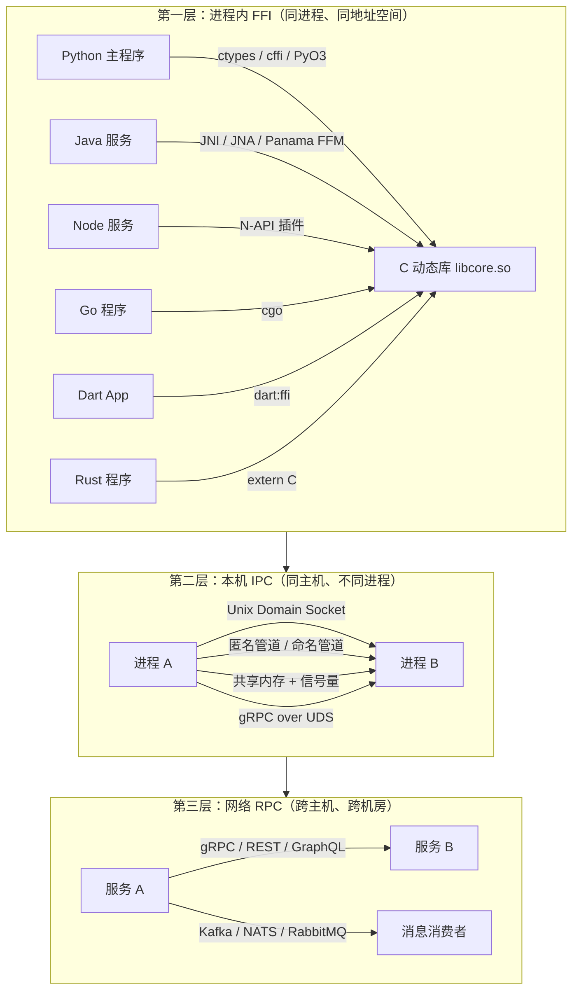
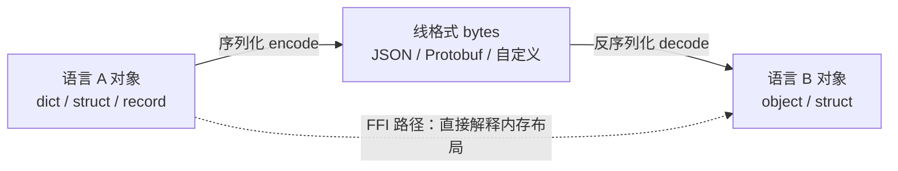
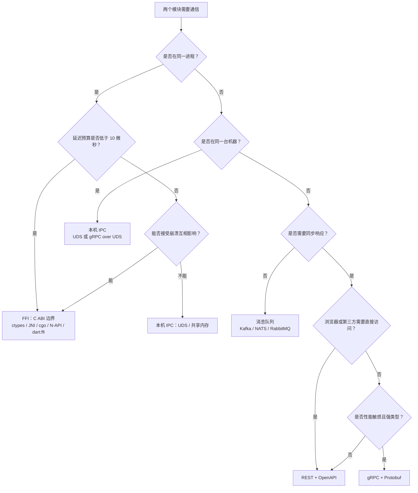

# 跨语言接口总览

> 多语言项目的失败，很少是因为「语言选错了」，多数是因为「接口层次选错了」。两个模块明明在同一台机器上，却为了"解耦"绕一圈 HTTP；或者明明是两个团队、两台机器，却为了"性能"把代码编进同一个进程。本章不教任何具体工具，而是先建立一张选型地图：先选对层次，再选对协议。

---

## 一、跨语言集成的三个层次

任意两个不同语言的模块通信，一定落在下面三层之一。层次决定成本结构，协议只是层次内的实现细节。



### 1.1 进程内 FFI：共享地址空间

FFI（Foreign Function Interface）让一门语言直接调用另一门语言编译出的函数。事实标准是 **C ABI**：操作系统、libc、动态链接器共同保证的二进制调用约定。

- 机制：动态库（`.so`/`.dylib`/`.dll`）+ 符号导出 + 调用约定匹配
- 延迟：一次跨语言调用通常在几十纳秒量级（受运行时包装层影响，Python `ctypes` 每次约 0.5-2 微秒）
- 优势：延迟最低；可零拷贝共享大块内存；不经过序列化
- 代价：**崩溃域共享**——C 侧段错误会带走整个进程；ABI 脆弱，编译器/标准库版本变化可能导致崩溃；两门语言的构建、发布、升级被绑死；调试需要跨语言栈

**适用**：性能敏感的内核（编解码、数值计算、图像处理、加密）、已有成熟 C/C++ 库需要复用、单机命令行工具。

**不适用**：需要独立部署和升级的两个团队；需要故障隔离的服务；调用频率低、网络延迟可忽略的场景。

判断标准很简单：如果 C 侧的库崩溃会导致业务不可用，就不能把它放进核心进程。FFI 适合「算错了可以重试」的计算内核，不适合「崩了全站挂掉」的在线链路。

### 1.2 本机 IPC：同机不同进程

两个进程在同一台机器上，通过内核提供的通道通信：Unix Domain Socket（UDS）、管道、共享内存、本机回环 TCP。

- 延迟：UDS 往返约 10-50 微秒；共享内存可到亚微秒级
- 优势：进程隔离（一个崩溃不影响另一个）；语言完全无关；可独立重启、独立限权（systemd 沙箱、seccomp）；不需要网络栈
- 代价：需要序列化/编组；连接生命周期与重连逻辑要自己写；共享内存需要自己处理同步与版本兼容

**适用**：同一台机器上的边车（sidecar）、CLI 与常驻进程、需要隔离的插件系统、本机数据库/缓存客户端。

**不适用**：需要跨机器扩展的场景；团队边界清晰且可以接受网络延迟的场景（此时直接用 RPC 更简单）。

### 1.3 网络 RPC：跨主机

gRPC、REST、GraphQL、消息队列都属于这一层。

- 延迟：同机房往返约 0.5-2 毫秒；跨地域 30-150 毫秒
- 优势：独立部署、独立扩缩容、故障隔离、天然对应团队边界；容量可以水平扩展
- 代价：网络不可靠（超时、重试、乱序、分区），必须处理幂等；需要服务发现、负载均衡、链路追踪、限流熔断

**适用**：微服务之间、跨团队、跨语言、需要独立发布节奏的一切场景。

**不适用**：需要亚毫秒延迟的高频调用；单机小工具内部通信（引入网络栈是过度设计）。

网络 RPC 的可靠性来自「可重试 + 幂等」而不是「网络本身可靠」。设计任何跨机接口时，先回答两个问题：调用失败后能否安全重试？重试时下游如何识别重复请求？答不上来就不要上线。

---

## 二、三个层次的量化对比

下表的延迟是量级参考，不是精确基准；真实数字取决于硬件、运行时版本与调用负载。

| 维度 | 进程内 FFI | 本机 IPC | 网络 RPC |
|------|-----------|----------|----------|
| 典型单次往返延迟 | 10 ns - 2 µs | 10 µs - 1 ms（UDS 约 10-50 µs） | 0.5 ms - 150 ms |
| 数据传递方式 | 共享地址空间，可零拷贝 | 序列化 + 内核缓冲区 | 序列化 + 网络栈 |
| 故障域 | 全进程一起死 | 单进程死 | 单服务死（可能级联） |
| 独立部署/升级 | 不能 | 可以 | 可以 |
| 跨机器 | 不能 | 不能 | 可以 |
| 语言耦合度 | 极高（ABI 级） | 低（线格式级） | 低（协议级） |
| 调试难度 | 高（跨语言栈、符号） | 中（需要看两个进程） | 中高（分布式追踪） |
| 安全边界 | 无 | 内核级隔离 | 网络边界 + 认证授权 |
| 引入成本 | 构建系统耦合 | 中（连接管理） | 高（治理设施） |
| 可靠性 | 最低（无隔离） | 中 | 高（可冗余） |

一条经验法则：**能用网络 RPC 解决的就不要用 FFI，除非延迟预算明确不允许**。FFI 省下的是微秒，付出的是整个进程的稳定性与两门语言工具链的耦合。

估算延迟预算时，把整条调用链相加再与 SLO 比较：一次请求若经过 3 个同步 RPC、每个 P99 为 200 ms，链路 P99 会远大于 600 ms（尾部叠加）。FFI 优化的是微秒级，网络优化的是毫秒级，**不要在毫秒级预算里纠结微秒级优化**。

---

## 三、数据编组与 ABI 稳定性

跨语言传递数据只有两条路：**共享内存布局**或**序列化成字节流**。



| 方式 | 代表 | 前提 | 风险 |
|------|------|------|------|
| 共享内存布局 | FFI 传结构体指针 | 两语言结构体布局、对齐、字节序完全一致 | 编译器版本、`#pragma pack`、`bool` 大小差异都会破坏 |
| 序列化字节流 | Protobuf、JSON、MessagePack | 只有线格式需要一致 | 有编解码开销，但边界稳定、可版本化 |

**ABI 是最脆弱的契约**，它由以下要素共同决定：

1. 调用约定（System V AMD64、Windows x64、AAPCS 等）
2. 结构体布局与对齐（`sizeof`、填充字节、位域）
3. 名称修饰（C++ name mangling 因编译器而异）
4. 符号可见性（默认导出 vs `-fvisibility=hidden`）
5. 运行时依赖（libstdc++、libc 版本、异常/panic 传播规则）

因此 FFI 边界设计有一条铁律：**边界尽量窄，只用 C 类型**。不要跨边界传 C++ `std::string`/`std::vector`，不要传 Go `string`/slice，不要传 JVM 对象。做法是：

- 用**不透明指针**（opaque pointer）代表对象，只暴露创建/销毁/操作函数
- 复杂数据用**序列化字节流**（Protobuf 或 JSON）通过 `(const uint8_t*, size_t)` 传递
- 错误用**错误码 + 错误信息函数**，绝不让异常/panic 穿过 C ABI

---

## 四、接口选型决策树



决策时要依次回答四个问题：

1. **部署边界**：这两个模块是否由同一个团队、同一份发布物交付？是则考虑 FFI/IPC，否则一律走网络
2. **同步性**：调用方是否需要立即拿到结果？需要则 RPC，不需要则消息队列
3. **性能预算**：延迟要求是微秒、毫秒还是秒？微秒级只有 FFI/共享内存能达标
4. **消费者形态**：浏览器/第三方要直接调用，选 REST + OpenAPI；内部强类型服务间调用，选 gRPC

### 4.1 同一个功能的三种接法

以「计算一组数字的均值与标准差」为例，同一个功能在三个层次上的调用形态：

```python
# 方式一：FFI（进程内，Python 直接调用 C 动态库）
import ctypes
lib = ctypes.CDLL("./libmathlib.so")
ctx = lib.stats_create()
for v in (1.0, 2.0, 3.0):
    lib.stats_push(ctx, ctypes.c_double(v))
mean, stddev = ctypes.c_double(), ctypes.c_double()
lib.stats_summary(ctx, ctypes.byref(mean), ctypes.byref(stddev))
```

```bash
# 方式二：本机 IPC（UDS 上的 JSON 请求-响应）
echo '{"values":[1,2,3]}' | socat - UNIX-CONNECT:/tmp/stats.sock
# {"mean":2.0,"stddev":0.816}
```

```bash
# 方式三：网络 RPC（gRPC，跨主机）
grpcurl -plaintext -d '{"values":[1,2,3]}' localhost:50051 stats.v1.StatsService/Summary
```

三种接法的业务结果相同，但延迟、故障域、部署方式完全不同。**先决定用哪种接法，再讨论用哪个协议**。

---

## 五、语言运行时互操作能力总表

几乎所有主流语言都以 C 为「通用语」。下表是各语言与 C 互操作的官方或主流机制：

| 语言 | 调用 C | 被 C 调用 | 主要机制 | 主要限制 |
|------|--------|-----------|----------|----------|
| C | 原生 | 原生 | 直接链接 | 无 |
| C++ | 原生（`extern "C"`） | `extern "C"` 包裹 | 直接链接、`extern "C"` | name mangling、ABI 不稳定、异常不能穿越 |
| Java/Kotlin | JNI、JNA、Panama FFM | JNI 导出函数 | `System.loadLibrary` + native 方法 | JNI 样板多；GC 会移动对象；线程需 Attach |
| Python | CPython C API、ctypes、cffi、pybind11 | C API / 扩展模块 | `ctypes.CDLL`、`cffi`、`PyO3` | GIL；引用计数必须配对；ctypes 有转换开销 |
| Node.js/TS | N-API、node-addon-api、WASM | N-API 模块 | `napi_create_function` 等 | 不能阻塞事件循环；回调需线程安全函数 |
| Go | cgo | cgo 导出（`//export`） | `import "C"` | 每次调用有调度开销；C 内存与 Go GC 互不知晓 |
| Rust | `extern "C"` + bindgen | `#[no_mangle] pub extern "C"` | `libc`、`bindgen`、`cbindgen` | `unsafe` 边界；panic 必须 `catch_unwind` 拦住 |
| Dart/Flutter | `dart:ffi` | 不支持反向调用 | `DynamicLibrary.open` + `lookupFunction` | 只能同步调用简单类型；复杂结构需手动映射 |
| C#/.NET | P/Invoke、C++/CLI | `UnmanagedCallersOnly` | `DllImport`、NativeAOT | 需固定（pin）托管对象；运行时版本差异 |

要点：

- **C 是唯一被所有语言共同支持的调用目标**，所以跨语言内核通常先写 C ABI
- 反向调用（C 调高级语言）远比正向调用复杂，涉及线程附着、GC、异常语义，能用回调注册表就别用
- 每种机制都有自己的「热路径开销」，Python ctypes、cgo、JNI 的每次调用成本差一个数量级，选型前要实测

选择互操作机制前先做一次开销实测：同一台机器上，把「C 直接调用」作为基线，分别测 Python `ctypes`、Go cgo、JNI 的每秒调用次数。常见结果是 ctypes 比 JNI 慢一个数量级，cgo 的开销随并发度变化。**调用频率低于每秒一千次时，开销通常可以忽略；超过每秒一百万次时，必须改用批量接口或换层次**。

---

## 六、接口的版本化与演进

接口一旦被第二个消费者使用，就**不再是实现细节，而是契约**。演进规则：

| 变更类型 | 兼容性 | 正确做法 |
|----------|--------|----------|
| 新增可选字段 | 向后兼容 | 直接加，老消费者忽略未知字段 |
| 新增必填字段 | 不兼容 | 新接口或先加可选再切流量 |
| 删除字段 | 不兼容 | 标记 `deprecated`，观察无调用后再删；Protobuf 中用 `reserved` 占位 |
| 修改字段类型/语义 | 不兼容 | 新增字段替代，双写过渡 |
| 新增枚举值 | 视消费者而定 | 消费者必须容忍未知值（proto3 默认保留） |
| 修改错误码含义 | 不兼容 | 新增错误码，不改变已有含义 |
| 修改 URL 路径/方法 | 不兼容 | 新旧路径并行，重定向过渡 |

三条底线：

1. **只增不改不删**：这是所有兼容性规则的根
2. **字段号/标签永不复用**：Protobuf 删除字段后必须 `reserved`，避免旧数据被新语义误读
3. **为兼容性写测试**：用旧版本的客户端解析新版本服务端的响应，这类测试要进 CI

版本号只是沟通工具，真正的兼容性由「旧消费者能否正确工作」定义，而不是由 `v2` 这个字符串定义。

兼容性不能靠声明，要靠验证。最小做法是维护一个「旧客户端 + 新服务端」的冒烟测试：把上一版本的生成代码与当前版本的响应样例放进 CI，用旧代码解析新数据。

```bash
# 用旧版本生成的代码解析当前版本的响应样例，失败即说明发生了破坏性变更
python -c "from order.v1 import order_pb2; order_pb2.Order.FromString(open('fixtures/order.bin','rb').read())"
```

---

## 七、集成测试与契约的关系

跨语言边界是缺陷高发区，因为两侧的编译器、类型系统、测试框架都管不到对方。边界上的缺陷通常分四类：

| 缺陷类型 | 例子 | 检测手段 |
|----------|------|----------|
| 编组错误 | 字符串编码、字节序、时间格式 | 边界两侧各写一组「最小往返测试」 |
| ABI 错误 | 结构体布局、调用约定不匹配 | 固定工具链版本，冒烟测试真实动态库 |
| 时序/并发 | 回调线程、重入、超时 | 集成测试 + 压力测试 |
| 版本漂移 | 服务端升级后客户端解析失败 | 契约测试，在 CI 中用旧客户端打新服务端 |

本章不展开测试细节。契约测试（消费者驱动契约）与跨语言集成测试的完整方法在 [[多语言工程化/多语言工程化目录|4 测试与质量]] 部分展开。这里只需记住一个原则：**接口定义完成的那一刻，就应当同时写下「如何验证双方仍然遵守它」的测试**，否则契约会在几周内悄悄腐烂。

每条边界至少要有三类测试：

1. **最小往返**：同一份数据在 A 语言编码、B 语言解码，断言字段值完全一致（覆盖字符串编码、时区、数字精度）
2. **异常路径**：B 语言返回错误码或异常时，A 语言能否正确识别且不崩溃
3. **生命周期**：B 语言侧释放资源后，A 语言再次访问应当得到明确错误，而不是内存损坏

---

## 常见坑与反模式

1. **为省一次网络调用引入 FFI 复杂度**：延迟只降了几百微秒，却换来了构建耦合、崩溃连带、跨语言调试。先量延迟预算，再决定值不值。
2. **用共享内存结构体跨语言传复杂数据**：`bool` 大小、对齐、字节序、编译器版本任意一项不同就出错，且错误往往表现为随机的内存损坏。用不透明指针 + 访问函数，或直接传序列化字节流。
3. **忽视 ABI 稳定性**：生产环境用 GCC 12 编译的库，升级到 GCC 13 后行为变化；或者头文件里出现 `std::string` 字段。FFI 边界只允许 C 类型。
4. **把 FFI 当免费**：一次空指针解引用会让 Python/Java/Node 整个进程崩溃，而不是抛一个可捕获的异常。必须在边界处做输入校验。
5. **没有版本协商的协议**：消息格式一变，所有消费者同时失败。协议第一版就要预留版本字段与未知字段容忍。
6. **在热路径上做文本序列化**：每秒十万次调用时，JSON 编解码可能比业务逻辑还贵。热路径优先二进制格式或共享内存。
7. **用「我们团队都用 X」代替选型分析**：技术选型要写成 ADR（背景、选项、决策、后果），否则半年后没人记得为什么这么选。
8. **所有调用都同步**：一条链路串起五个同步 RPC，可用性相乘、延迟相加。需要异步的地方用消息队列解耦。
9. **把「同一台机器」当成「可以随便用 FFI」**：同机不同进程仍应用 IPC 隔离；只有确认崩溃可接受、ABI 可管理时再下沉到 FFI。

---

## 本章小结

- 跨语言集成只有三层：进程内 FFI、本机 IPC、网络 RPC；层次决定成本结构，协议是层次内的细节
- 选型顺序是「部署边界 → 同步性 → 性能预算 → 消费者形态」，而不是先挑工具
- 数据跨边界要么共享内存布局，要么序列化；前者脆弱，后者稳定
- ABI 是最脆弱的契约，FFI 边界必须窄：C 类型、不透明指针、错误码、字节流
- 几乎所有语言都以 C 为互操作通用语，但各语言的调用开销与线程/GC 语义差异巨大
- 接口发布即契约；只增不改不删，字段号永不复用，兼容性必须有测试
- 边界的正确性靠契约测试与最小往返测试保证，而不是靠「两边都用了强类型语言」
- 选型先问部署边界与故障容忍度，再问性能；跨语言调试成本通常被严重低估
- 契约测试与版本化是接口长期可维护的两个支柱，应在项目第一天就建立

---

## 动手实践

### 实践一：测量三种层次的延迟

写三个最小程序：C 函数直接调用、Python `ctypes` 调用同一个 C 函数、Python 通过 UDS 调用一个回显服务。每个各调用 10 万次，记录平均值与 P99。

验收标准：输出一张对比表，包含三个层次的单次调用耗时；能解释为什么 `ctypes` 比 C 直接调用慢两三个数量级；把测量脚本提交到仓库 `bench/` 目录。

### 实践二：为你的项目画三层接口图

选一个你参与的真实项目，画出所有跨语言调用点，标注每个调用点属于哪一层、当前用什么协议。

验收标准：图用 mermaid 编写；每个调用点标注「延迟量级」与「是否与团队边界一致」；找出至少一个「层次选错」的调用点并说明理由。

### 实践三：写一份接口选型 ADR

针对「新增一个算法模块，由 Python 服务调用 C++ 库」这个场景，在 FFI、本机 IPC、网络 RPC 三者之间做决策。

验收标准：ADR 包含背景、三个选项、决策、后果四部分；必须写明每个选项的「不适用场景」；包含至少一个可量化的延迟预算假设。

### 实践四：最小互操作验证

选两种你熟悉的语言，用其中一种编译一个导出 `int add(int, int)` 的动态库，另一种通过官方 FFI 机制调用它。

验收标准：能打印出正确结果；记录从零到跑通踩到的坑（编译参数、类型声明、路径问题）；在 README 中写明复现命令。

---

- 返回目录：[[多语言工程化/多语言工程化目录|多语言工程化]]
