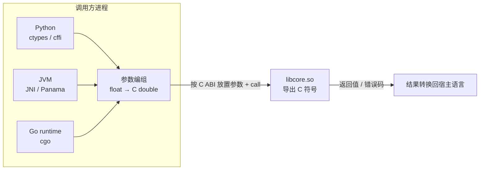

# FFI 跨语言调用

> FFI（Foreign Function Interface）是延迟最低、耦合最深的跨语言方案：两个语言运行时直接共享地址空间，没有网络，没有序列化。代价是：一次非法内存访问就能让整个进程消失。本章讲清 FFI 的原理、各语言的机制，以及如何把边界设计得足够窄、足够安全。

---

## 一、FFI 的原理：C ABI 是通用接口

所有 FFI 最终都落到同一件事：**按目标平台的 C ABI 约定，把参数放到寄存器/栈上，跳转到目标函数地址，再按约定取回返回值**。

| 组成 | 内容 | 稳定性来源 |
|------|------|-----------|
| 调用约定 | 参数寄存器、清栈方、返回值位置 | 操作系统与编译器共同遵循 |
| 结构体布局 | 字段顺序、对齐、填充 | 平台 ABI 文档规定 |
| 符号命名 | C 符号不修饰，C++ 会 name mangling | `extern "C"` 关闭修饰 |
| 动态链接 | 符号可见性、重定位 | 链接器与 loader 规定 |

任何语言只要能按同样规则生成调用序列，就能调用 C 函数。这就是 FFI 世界的事实标准是 **C** 而不是某种语言的原因。



---

## 二、跨语言调用全景表

| 调用方 | 机制 | 边界形式 | 单次调用量级 | 备注 |
|--------|------|----------|--------------|------|
| Python → C | `ctypes` | C 函数、`c_void_p` | 0.5-2 µs | 标准库自带，无需编译 |
| Python → C | `cffi` | C 声明 | 0.2-1 µs | API 模式最快 |
| Python → C++ | `pybind11` | 直接暴露 C++ 类型 | 0.1-1 µs | 需写胶水，体验最好 |
| Java → C | JNI | native 方法签名 | 20-100 ns | 样板多，需线程附着 |
| Java → C | JNA / Panama | 接口映射 / `MethodHandle` | 数 µs / 数十 ns | JNA 免编译，Panama 是现代首选 |
| Go → C | cgo | `import "C"` | 50-200 ns | 可能触发调度 |
| Rust → C | `extern "C"` + bindgen | `unsafe` 函数 | 纳秒级 | 零成本抽象 |
| Dart → C | `dart:ffi` | `lookupFunction` | 数十 ns | 手动管理内存，只支持同步调用 |
| Node → C | N-API | `napi_value` | 数十 ns | ABI 稳定，跨 Node 版本 |
| C# → C | P/Invoke | `[DllImport]` | 数十 ns | 需 pin 托管对象 |

---

## 三、C 中间层的最佳实践

跨语言时不要直接暴露某一侧的原生接口，而是先写一个薄 C 中间层，所有语言都接到它上面。三条规则：

1. **只导出 C 符号**：C++ 用 `extern "C"`，Rust 用 `#[no_mangle] pub extern "C"`，Go 用 `//export`
2. **不透明指针**：调用方只拿到 `struct stats_ctx *`，看不到内部布局
3. **错误码 + 错误信息函数**：C 没有异常，错误码是唯一可靠方式

```c
// native/mathlib.h —— 稳定的 FFI 边界
#ifndef MATHLIB_H
#define MATHLIB_H
#include <stddef.h>
#include <stdint.h>
#ifdef __cplusplus
extern "C" {
#endif

/* 不透明类型：调用方不知道它多大、有哪些字段 */
typedef struct stats_ctx stats_ctx;

/* 所有权约定：create 返回的对象必须由调用方用 free 释放 */
stats_ctx *stats_create(void);
void stats_free(stats_ctx *ctx);

/* 返回 0 成功，负数失败（错误码即契约，不跨边界抛异常） */
int32_t stats_push(stats_ctx *ctx, double value);
int32_t stats_summary(stats_ctx *ctx, double *mean_out, double *stddev_out);

#ifdef __cplusplus
}
#endif
#endif /* MATHLIB_H */
```

```c
// native/mathlib.c
#include "mathlib.h"
#include <math.h>
#include <stdlib.h>

struct stats_ctx { double *values; size_t len, cap; };

stats_ctx *stats_create(void) {
    stats_ctx *ctx = calloc(1, sizeof(stats_ctx));
    if (!ctx) return NULL;
    ctx->cap = 16;
    ctx->values = malloc(ctx->cap * sizeof(double));
    if (!ctx->values) { free(ctx); return NULL; }
    return ctx;
}

void stats_free(stats_ctx *ctx) {
    if (!ctx) return;                 /* 容忍 NULL，便于防御性调用 */
    free(ctx->values);
    free(ctx);
}

int32_t stats_push(stats_ctx *ctx, double value) {
    if (!ctx) return -1;
    if (ctx->len == ctx->cap) {
        size_t cap = ctx->cap * 2;
        double *p = realloc(ctx->values, cap * sizeof(double));
        if (!p) return -2;
        ctx->values = p; ctx->cap = cap;
    }
    ctx->values[ctx->len++] = value;
    return 0;
}

int32_t stats_summary(stats_ctx *ctx, double *mean_out, double *stddev_out) {
    if (!ctx || !mean_out || !stddev_out || ctx->len == 0) return -1;
    double sum = 0.0, var = 0.0;
    for (size_t i = 0; i < ctx->len; i++) sum += ctx->values[i];
    double mean = sum / (double)ctx->len;
    for (size_t i = 0; i < ctx->len; i++) {
        double d = ctx->values[i] - mean;
        var += d * d;
    }
    *mean_out = mean;
    *stddev_out = sqrt(var / (double)ctx->len);
    return 0;
}
```

```bash
# 编译动态库；生产代码应加 -fvisibility=hidden 并用宏显式导出 API
gcc -shared -fPIC -O2 -o libmathlib.so mathlib.c -lm
nm -D --defined-only libmathlib.so   # 确认导出符号
```

---

## 四、Python 调用 C

`ctypes` 是标准库方案，不需要编译胶水代码，适合快速集成。

```python
# python/use_stats.py —— 显式类型声明 + 手动释放
import ctypes
from ctypes import c_double, c_int32, c_void_p

class Stats:
    def __init__(self, lib_path: str = "./libmathlib.so"):
        self._lib = ctypes.CDLL(lib_path)
        # 必须显式声明 argtypes/restype，否则指针会被默认截断为 int
        self._lib.stats_create.restype = c_void_p
        self._lib.stats_create.argtypes = []
        self._lib.stats_free.restype = None
        self._lib.stats_free.argtypes = [c_void_p]
        self._lib.stats_push.restype = c_int32
        self._lib.stats_push.argtypes = [c_void_p, c_double]
        self._lib.stats_summary.restype = c_int32
        self._lib.stats_summary.argtypes = [c_void_p, ctypes.POINTER(c_double), ctypes.POINTER(c_double)]
        self._ctx = self._lib.stats_create()
        if not self._ctx:
            raise MemoryError("stats_create 返回空指针")

    def push(self, value: float) -> None:
        if self._lib.stats_push(self._ctx, value) != 0:
            raise RuntimeError("stats_push 失败")

    def summary(self) -> tuple[float, float]:
        mean, stddev = c_double(), c_double()
        if self._lib.stats_summary(self._ctx, ctypes.byref(mean), ctypes.byref(stddev)) != 0:
            raise RuntimeError("stats_summary 失败")
        return mean.value, stddev.value

    def close(self) -> None:
        if self._ctx:
            self._lib.stats_free(self._ctx)
            self._ctx = None  # 置空，避免重复释放

if __name__ == "__main__":
    s = Stats()
    for v in (1.0, 2.0, 3.0, 4.0):
        s.push(v)
    print("mean=%.3f stddev=%.3f" % s.summary())
    s.close()  # 必须显式释放，否则 C 侧内存泄漏
```

| 维度 | ctypes | cffi | pybind11 |
|------|--------|------|----------|
| 是否需编译 | 否 | API 模式需 | 需 C++ 编译 |
| 性能 | 较慢 | 接近原生 | 最快 |
| 类型安全 | 弱 | 中 | 强 |
| C++ 支持 | 无 | 弱 | 原生（类/STL/异常） |
| 适用 | 简单 C 接口、原型 | 中等复杂度 C 库 | 大型 C++ 库 |
| 不适用 | 高频调用 | 极简场景 | 只调几个 C 函数 |

---

## 五、Java 调用 C

JNI 是最底层的官方机制：Java 侧声明 `native` 方法，C 侧实现 `Java_类名_方法名` 函数。`JNIEnv*` 每线程一个，`jobject` 引用分局部/全局，异常必须用 `ExceptionCheck` 检查。

```java
// Java 侧：句柄用 long 保存指针，native 方法只传标量与数组
public final class NativeStats implements AutoCloseable {
    static { System.loadLibrary("stats_jni"); } // 加载 libstats_jni.so
    private long handle = nativeCreate();
    public double[] summary() {
        double[] out = new double[2];
        if (nativeSummary(handle, out) != 0) throw new IllegalStateException("summary 失败");
        return out;
    }
    @Override public void close() { nativeFree(handle); handle = 0; }
    private static native long nativeCreate();
    private static native void nativeFree(long handle);
    private static native int nativeSummary(long handle, double[] out);
}
```

```c
// C 侧：函数名 = Java_ + 类全名 + 方法名
JNIEXPORT jlong JNICALL Java_NativeStats_nativeCreate(JNIEnv *env, jclass cls) {
    return (jlong)(intptr_t)stats_create();
}
JNIEXPORT jint JNICALL Java_NativeStats_nativeSummary(JNIEnv *env, jclass cls,
                                                      jlong h, jdoubleArray out) {
    double mean = 0.0, stddev = 0.0;
    if (stats_summary((stats_ctx *)(intptr_t)h, &mean, &stddev) != 0) return -1;
    jdouble buf[2] = {mean, stddev};
    (*env)->SetDoubleArrayRegion(env, out, 0, 2, buf); // 越界会抛 Java 异常
    return 0;
}
```

- **JNA**：把 C 函数声明成 Java 接口，运行时自动映射，无需编译胶水；每次调用数微秒，只适合低频场景
- **Panama FFM**（`java.lang.foreign`，JDK 22 正式）：`Linker.nativeLinker()` 创建链接器，`SymbolLookup` 定位符号，`downcallHandle` 生成 `MethodHandle`，配合 `Arena` 管理内存，性能接近 JNI 且更类型安全

新项目优先 Panama，存量项目用 JNI，JNA 只在「不值得写胶水」时使用。

---

## 六、Go 调用 C（cgo）

```go
// go/main.go
package main

/*
#cgo CFLAGS: -I../native
#cgo LDFLAGS: -L../native -lmathlib -lm
#include <stdlib.h>
#include "mathlib.h"
*/
import "C"

import (
	"fmt"
	"runtime"
)

func main() {
	ctx := C.stats_create()
	if ctx == nil {
		panic("stats_create 失败")
	}
	defer C.stats_free(ctx)
	for _, v := range []float64{1, 2, 3, 4} {
		if rc := C.stats_push(ctx, C.double(v)); rc != 0 {
			panic(fmt.Sprintf("stats_push 失败: %d", int(rc)))
		}
	}
	var mean, stddev C.double
	if rc := C.stats_summary(ctx, &mean, &stddev); rc != 0 {
		panic("stats_summary 失败")
	}
	fmt.Printf("mean=%.3f stddev=%.3f\n", float64(mean), float64(stddev))
	runtime.KeepAlive(ctx) // 防止 GC 在调用完成前回收关联对象
}
```

注意：`CGO_ENABLED=0` 时 cgo 代码被排除、构建失败；每次 cgo 调用可能触发调度器切换，热路径应批量调用；Go 的 GC 不扫描 C 内存，C 侧保存 Go 指针非法；反向导出用 `//export`，回调中不能 panic。

---

## 七、Rust 调用与被调用

### 7.1 Rust 调用 C：bindgen

```rust
// build.rs —— 构建时从头文件生成绑定
fn main() {
    println!("cargo:rustc-link-search=../native");
    println!("cargo:rustc-link-lib=mathlib");
    println!("cargo:rerun-if-changed=../native/mathlib.h");
    let bindings = bindgen::Builder::default()
        .header("../native/mathlib.h")
        .parse_callbacks(Box::new(bindgen::CargoCallbacks::new()))
        .generate()
        .expect("无法生成绑定");
    let out = std::path::PathBuf::from(std::env::var("OUT_DIR").unwrap()).join("bindings.rs");
    bindings.write_to_file(out).expect("无法写入绑定");
}
```

```rust
// src/main.rs —— 调用生成的绑定
mod ffi { include!(concat!(env!("OUT_DIR"), "/bindings.rs")); }

fn main() {
    unsafe {
        let ctx = ffi::stats_create();
        assert!(!ctx.is_null());
        assert_eq!(ffi::stats_push(ctx, 2.0), 0);
        let (mut mean, mut stddev) = (0.0_f64, 0.0_f64);
        assert_eq!(ffi::stats_summary(ctx, &mut mean, &mut stddev), 0);
        ffi::stats_free(ctx);
    }
}
```

### 7.2 Rust 被 C 调用：`#[no_mangle]` + cbindgen

```rust
// src/lib.rs —— 导出 C 符号的关键点
use std::ffi::{c_double, c_int};
use std::sync::Mutex;

pub struct StatsCtx { values: Mutex<Vec<f64>> } // Mutex 保证跨线程安全

#[no_mangle]
pub extern "C" fn stats_create() -> *mut StatsCtx {
    Box::into_raw(Box::new(StatsCtx { values: Mutex::new(Vec::new()) }))
}

#[no_mangle]
pub extern "C" fn stats_free(ctx: *mut StatsCtx) {
    if ctx.is_null() { return; }
    unsafe { drop(Box::from_raw(ctx)); } // Rust 分配，必须 Rust 释放
}

#[no_mangle]
pub extern "C" fn stats_push(ctx: *mut StatsCtx, value: c_double) -> c_int {
    let Some(ctx) = (unsafe { ctx.as_ref() }) else { return -1 };
    match ctx.values.lock() {
        Ok(mut v) => { v.push(value); 0 }
        Err(_) => -2, // 锁中毒，返回错误码而不是 panic
    }
}
```

```bash
cargo install cbindgen
cbindgen --config cbindgen.toml --crate mathlib --output mathlib.h  # 从 Rust 生成头文件
```

关键点：`#[no_mangle]` 关闭符号修饰；panic 不能穿越 C ABI，导出函数应包 `catch_unwind`；`Box::into_raw`/`from_raw` 必须成对，谁分配谁释放。

---

## 八、Dart FFI 与 Node N-API

**Dart FFI**（详见 [[dart/dart目录|Dart 教程]]）用 `DynamicLibrary.open` 加载动态库、`lookupFunction` 绑定符号，类型用 `Pointer`、`Int32`、`Double`；只支持同步调用，跨 isolate 传递 `Pointer` 需谨慎。**Node N-API** 把 JS 值转成 `napi_value`，ABI 稳定、不需为每个 Node 大版本重编译，但函数不能阻塞事件循环；生产项目推荐 `node-addon-api` 或 `napi-rs`。

---

## 九、内存所有权与生命周期

FFI 最常见的 bug 是内存归属不清。规则只有一条：**谁分配，谁释放；跨越边界时必须写进文档**。

| 场景 | 分配方 | 释放方 | 常见错误 |
|------|--------|--------|----------|
| 返回句柄 | C | C（配套 free 函数） | 调用方直接 `free()`，堆实现不匹配 |
| 输出参数 | 调用方 | 调用方 | C 侧擅自释放宿主内存 |
| 返回字符串 | C | C（文档声明下次调用失效） | 调用方 free 或长期持有已失效指针 |
| 返回字节数组 | C（malloc） | 调用方（配套 free） | 忘记释放造成泄漏 |
| 回调传参 | 调用方临时 | 调用方 | 回调异步持有临时缓冲区指针 |

另外两个陷阱：**GC 移动对象**（JVM 传数组必须 pin 住，C 侧不得保存指针）；**双重释放**（`close()` 后必须把句柄置空）。

---

## 十、回调与线程模型

回调线程规则：JVM 的 native 线程需 `AttachCurrentThread` 并在结束后 Detach；Python 回调需 `PyGILState_Ensure/Release`；Go 回调运行在 C 线程且不能 panic，长时间阻塞会占用系统线程；Rust 导出函数必须包 `catch_unwind`；Node 用 `napi_threadsafe_function` 投递回事件循环。设计建议：能用「轮询 + 事件队列」替代回调就替代；回调必须能处理「C 侧在任意线程、任意时机调用」。

---

## 十一、FFI 调试

常用手段：`ldd` 与 `LD_DEBUG=libs` 排查动态库加载；`nm -D --defined-only` 确认符号导出；`gdb --args python script.py` 在崩溃点查看 C 栈；ASan（`-fsanitize=address`）或 Valgrind 定位越界与 use-after-free；`nm | c++filt` 检查 C++ 符号修饰；`pahole` 与 `offsetof` 静态断言核对结构体布局。

---

## 常见坑与反模式

1. **ABI 不匹配**：不同编译器/优化级别导致布局或调用约定不同。固定工具链、只传 C 标量、加静态断言
2. **字符串编码**：C 是字节流，Java 是 UTF-16，Python 是 Unicode。跨边界统一 UTF-8 + 显式长度，不要用 `strlen` 猜
3. **线程绑定**：`JNIEnv`、GIL、Node 事件循环都不是线程安全的，跨线程前先查规则
4. **异常穿越 C ABI**：C++ 异常、Rust panic、Go panic 都不能穿过 C 边界，导出函数必须是 `noexcept` 语义
5. **默认参数类型**：`ctypes` 不声明 `argtypes` 时指针被当 `int` 截断，64 位下必崩
6. **热路径逐次调用**：cgo/ctypes 有固定开销，应设计批量接口而不是循环单值
7. **忽略返回值**：错误码被宿主语言丢弃，错误静默传播
8. **静态库重复符号**：多个运行时链接同一符号导致冲突，用动态库 + 隐藏符号 + 命名前缀

---

## 本章小结

- FFI 的本质是按 C ABI 直接调用，C 是所有语言的通用接口层
- 稳定的 FFI 边界 = `extern "C"` + 不透明指针 + 错误码 + UTF-8 字节流
- 各语言机制差异大：ctypes 慢但免编译，JNI 快但样板多，Panama 是现代 Java 首选，cgo 有调度成本，Rust 零成本但需 `unsafe`
- 内存所有权必须写成文档：谁分配谁释放，跨边界句柄用配套 free 函数
- 回调与线程是 FFI 复杂度的主要来源；能轮询就不回调，回调必须线程安全
- 调试 FFI 靠 `nm`/`ldd`/`gdb`/ASan 这套工具链，编译期用静态断言锁住类型大小

---

## 动手实践

### 实践一：完成完整 FFI 链路

按 `native/mathlib.{h,c}` 编译动态库，用 Python `ctypes` 与 Go `cgo` 各写一个调用程序。

验收标准：两个程序输出相同的 mean/stddev；`nm -D` 能看到 `stats_create` 等符号；用 Valgrind 或 ASan 检查无内存泄漏；提交编译命令到 README。

### 实践二：用 Rust 实现同一接口

用 Rust 重写 `mathlib.c`，导出同样的 C 符号，用 `cbindgen` 生成头文件，然后用 Python 调用它。

验收标准：Python 端代码零修改即可切换动态库；`cargo test` 覆盖 push/summary/空上下文/重复释放；说明 Rust 侧如何保证 panic 不穿越边界。

### 实践三：定位一个真实的 FFI 崩溃

故意制造一个错误：用错误的 `argtypes` 调用函数，或在 C 侧把输出参数当输入读取。

验收标准：用 `gdb` 或 ASan 定位到具体行；写一份 200 字以内的事故记录，包含现象、定位过程、根因、修复与预防措施。

### 实践四：批量调用优化

设计批量接口 `stats_push_batch(ctx, const double *values, size_t n)`，从 Python 与 Go 各传入 10 万个值。

验收标准：对比逐次调用与批量调用的耗时，批量版本至少快 10 倍；解释为什么调用开销在批量场景被摊薄；提交基准测试代码。

---

- 返回目录：[[多语言工程化/多语言工程化目录|多语言工程化]]
