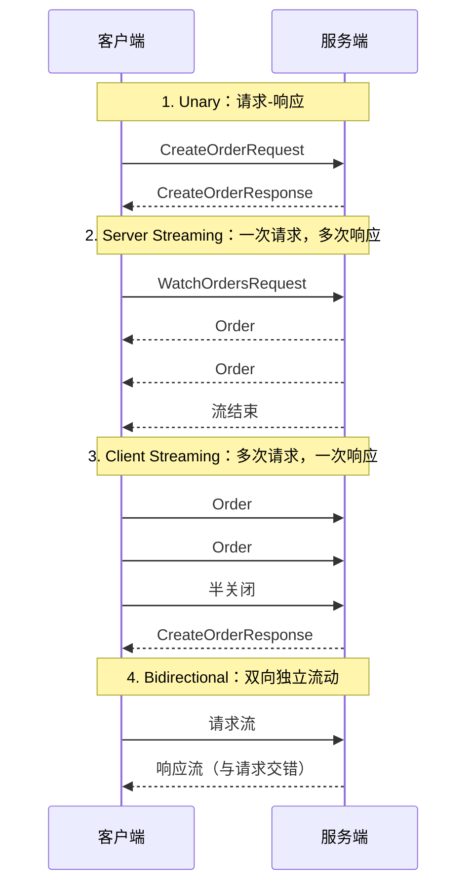

# Protobuf 与 gRPC

> 跨语言通信最大的成本不是网络，而是「双方对数据长什么样」的持续误解。JSON 把这种误解留到运行时，Protobuf 把它提前到编译期；gRPC 则把「调用」本身也变成了有类型、可生成代码的契约。本章讲清 IDL 驱动的接口开发方式：一份 `.proto` 文件，生成所有语言的客户端与服务端。

---

## 一、为什么需要 IDL

没有 IDL（Interface Definition Language）时，接口知识散落在各语言的 DTO、文档和口头约定里。典型症状：Python 写 `userId`、Go 按 `user_id` 解析导致字段为空；文档说金额单位是分，某实现按元传；新增字段后老客户端解析报错。

IDL 把接口定义收敛为**一份机器可读的源文件**，带来四个能力：

1. **多语言代码生成**：一份定义生成 Go/Java/Python/Rust/Dart 的类型与桩代码
2. **编译期校验**：字段名、类型、方法签名不匹配直接编译失败
3. **兼容性规则可执行**：工具能检测「删字段」「复用字段号」等破坏性变更
4. **文档与反射**：接口文档、gRPC 反射、API 目录都从同一份定义派生

Protobuf 是最主流的 IDL + 序列化格式，gRPC 是它的官方 RPC 载体；格式本身的横向对比见 [[多语言工程化/3接口与协议/06_序列化格式对比|序列化格式对比]]。

---

## 二、Protobuf 语法

下面是一个覆盖常用特性的完整示例（proto3）：

```protobuf
// proto/order/v1/order.proto
syntax = "proto3";

package order.v1;

option go_package = "example.com/shop/gen/order/v1;orderv1";

import "google/protobuf/timestamp.proto";

// 枚举：proto3 必须有一个值为 0 的默认项，命名加前缀避免各语言作用域冲突
enum OrderStatus {
  ORDER_STATUS_UNSPECIFIED = 0;
  ORDER_STATUS_CREATED = 1;
  ORDER_STATUS_PAID = 2;
  ORDER_STATUS_SHIPPED = 3;
  ORDER_STATUS_CANCELLED = 4;
}

message OrderItem {
  string sku = 1;
  int32 quantity = 2;
  int64 price_cent = 3;   // 金额一律用最小货币单位整数，杜绝浮点误差
}

message Order {
  string id = 1;
  string user_id = 2;
  repeated OrderItem items = 3;    // repeated 等价于列表，默认空列表
  OrderStatus status = 4;
  google.protobuf.Timestamp created_at = 5;

  map<string, string> labels = 6;  // map 遍历顺序不保证，不要依赖
  optional string coupon_code = 7; // optional 提供字段存在性判断

  oneof payment {                  // oneof：同一时刻最多设置一个
    string alipay_trade_no = 8;
    string wechat_trade_no = 9;
  }

  reserved 10, 11;                 // 已删除字段的编号永久占位
  reserved "legacy_source";        // 已删除字段名也占位
}

message CreateOrderRequest {
  string user_id = 1;
  repeated OrderItem items = 2;
  string idempotency_key = 3;      // 幂等键：重试安全的前提
}

message CreateOrderResponse {
  Order order = 1;
}

message WatchOrdersRequest {
  string user_id = 1;
}

service OrderService {
  rpc CreateOrder(CreateOrderRequest) returns (CreateOrderResponse);
  rpc WatchOrders(WatchOrdersRequest) returns (stream Order);
  rpc UploadOrders(stream Order) returns (CreateOrderResponse);
  rpc SyncOrders(stream WatchOrdersRequest) returns (stream Order);
}
```

要点：

- `package` 是 Protobuf 命名空间，跨语言生成时决定目录结构（`order/v1/order_pb2.py`）
- 字段号 `= N` 是**线格式的一部分**，字段名只是代码标识，改名不影响兼容性
- `int32/int64` 用变长编码，负数效率低；确定有负数时用 `sint32/sint64`
- 时间统一用 `google.protobuf.Timestamp`，不要自定义字符串格式

---

## 三、字段号兼容性规则

| 字段号范围 | 编码开销 | 建议用途 |
|-----------|----------|----------|
| 1 - 15 | 1 字节 tag | 最常出现的字段，留给热字段 |
| 16 - 2047 | 2 字节 tag | 一般字段 |
| 2048 - 536870911 | 3-5 字节 tag | 极少使用 |
| 19000 - 19999 | — | Protobuf 内部保留，禁止使用 |

铁律：

1. **字段号一旦发布，永不复用**：删除字段后必须 `reserved` 编号和名称
2. **不要修改已发布字段的类型**：`int32` 改 `string` 是破坏性变更，新增字段替代
3. **不要修改已发布字段的语义**：`price` 改成 `price_cent` 这类变化也要新增字段
4. **枚举 0 值必须有明确语义**：proto3 中 0 是默认值，应为 `UNSPECIFIED`
5. **枚举新增值要谨慎**：老客户端遇到未知枚举值会保留数字，但业务代码可能落入 `default` 分支

破坏性变更检测应自动化：`buf breaking` 把当前 proto 与主分支对比，在 CI 中直接失败。

---

## 四、Protobuf 编解码原理

Protobuf 的线格式是 **TLV 变体**：`tag`（字段号 + wire type）后跟 `value`。

| Wire Type | 编号 | 用途 |
|-----------|------|------|
| VARINT | 0 | int32/int64/uint32/uint64/bool/enum |
| I64 | 1 | fixed64/sfixed64/double |
| LEN | 2 | string/bytes/嵌套消息/repeated packed |
| I32 | 5 | fixed32/sfixed32/float |

**varint** 每字节用 7 位存数据、最高位表示「是否还有后续字节」。数字 300 编码为 `0xAC 0x02`：小数值占字节少，大数值占字节多。

`Order` 中 `id = "A1"`（字段号 1，string）的编码：

编码过程：`tag = (1 << 3) | 2 = 0x0A`，`len = 0x02`，`value` 是 "A1" 的 UTF-8 字节 `0x41 0x31`，最终字节为 `0A 02 41 31`。

**体积对比**：同样数据 Protobuf 通常比 JSON 小 30%-60%，解析快 2-10 倍。原因：没有字段名只有数字 tag、整数变长编码、默认值不序列化、二进制无需文本转义。但字段很多且全是小整数时 JSON 可能接近；单字段大字符串时两者几乎相同。选型要看真实数据分布。

---

## 五、代码生成

`protoc` 是基础工具：`python -m grpc_tools.protoc -I proto --python_out=gen/python --grpc_python_out=gen/python proto/order/v1/order.proto`，Go 用 `--go_out` 与 `--go-grpc_out`。它的痛点是插件管理、import 路径、lint 和破坏性变更检测都要自己拼，`buf` 用一个配置文件统一解决：

```yaml
# buf.yaml
version: v2
modules:
  - path: proto
lint:
  use: [STANDARD]
breaking:
  use: [FILE]
```

```yaml
# buf.gen.yaml —— 支持远程插件，团队无需本地装齐工具链
version: v2
managed: { enabled: true }
plugins:
  - { remote: buf.build/protocolbuffers/go, out: gen/go, opt: paths=source_relative }
  - { remote: buf.build/grpc/go, out: gen/go, opt: paths=source_relative }
  - { remote: buf.build/protocolbuffers/python, out: gen/python }
  - { remote: buf.build/grpc/python, out: gen/python }
```

```bash
buf lint                                    # 风格检查
buf breaking --against '.git#branch=main'   # 检测破坏性变更
buf generate                                # 一键生成所有语言
```

CI 中应同时运行 `buf lint` 与 `buf breaking`，把兼容性问题挡在合并之前。

---

## 六、gRPC 核心

gRPC 建立在 **HTTP/2** 之上：多路复用（一个连接并行多个请求，无队头阻塞）、HPACK 头部压缩、原生流、二进制帧天然适配 Protobuf。



| 方法类型 | 声明 | 典型场景 | 不适用场景 |
|----------|------|----------|-----------|
| Unary | `rpc F(Req) returns (Resp)` | 常规增删改查 | 需要持续推送 |
| Server Streaming | `returns (stream Resp)` | 订阅、大结果集、日志跟随 | 客户端也要持续发送 |
| Client Streaming | `stream Req` | 批量上传、聚合写入 | 需要逐条确认 |
| Bidirectional | `stream Req returns (stream Resp)` | 实时协作、双向聊天 | 简单请求响应 |

**截止时间与元数据**：

Go 客户端示例：`ctx, cancel := context.WithTimeout(context.Background(), time.Second)` 设置 1 秒截止时间；`ctx = metadata.AppendToOutgoingContext(ctx, "x-request-id", "req-123")` 附加元数据；随后调用 `client.CreateOrder(ctx, req)`。

- **deadline 会跨服务传播**：上游剩余时间自动成为下游上限，这是防止雪崩的关键
- **拦截器（interceptor）** 是 gRPC 中间件，客户端/服务端各有 unary/stream 两类，用于日志、鉴权、指标、重试
- **不要在元数据里放大数据**：它随每个请求发送且有大小限制

---

## 七、错误模型

业务错误不要塞进响应消息的 `error` 字段，应该用状态码 + `google.rpc.Status` 细节。

| 状态码 | 数值 | 含义 | 使用场景 |
|--------|------|------|----------|
| OK | 0 | 成功 | — |
| CANCELLED | 1 | 调用方取消 | 上游超时主动取消 |
| INVALID_ARGUMENT | 3 | 参数非法 | 校验失败 |
| DEADLINE_EXCEEDED | 4 | 超时 | 不要盲目重试非幂等操作 |
| NOT_FOUND | 5 | 资源不存在 | 查询无结果 |
| PERMISSION_DENIED | 7 | 无权限 | 鉴权失败 |
| RESOURCE_EXHAUSTED | 8 | 资源耗尽 | 限流、配额 |
| FAILED_PRECONDITION | 9 | 前置条件不满足 | 状态机非法流转 |
| ABORTED | 10 | 并发冲突 | 乐观锁失败，可重试 |
| INTERNAL | 13 | 内部错误 | 服务端 bug |
| UNAVAILABLE | 14 | 不可用 | 可重试（配合退避） |

```go
return nil, status.Errorf(codes.InvalidArgument, "user_id 不能为空: %q", req.GetUserId())
```

重试原则：只重试 `UNAVAILABLE` 与 `ABORTED`，且必须配合幂等键与指数退避；`INVALID_ARGUMENT`、`PERMISSION_DENIED` 重试没有意义。

---

## 八、负载均衡与服务发现

gRPC 长连接不能直接套用四层负载均衡：客户端与某个后端建立长连接后，L4 无法在请求级重新分配。正确做法是**客户端负载均衡**——客户端通过服务发现拿到全部后端地址自行选择。

客户端负载均衡流程：解析服务名，从 DNS/xDS/K8s Endpoints 拿到后端列表，再按轮询或最少连接策略选择后端。

| 方案 | 机制 | 适用 | 不适用 |
|------|------|------|--------|
| Headless Service + round_robin | 客户端直连 Pod IP | K8s 内部服务 | 需要集中式流量治理 |
| Service Mesh | Sidecar 代理 L7 | 多语言、需要 mTLS/熔断 | 小规模团队（运维成本高） |
| 集中式代理（Nginx/Envoy） | 代理终结连接 | 简单场景 | 双向流（需 HTTP/2 端到端） |

---

## 九、grpc-gateway 与 Connect

- **grpc-gateway**：用 proto 注解生成 REST/JSON 反向代理，把 HTTP 请求翻译成 gRPC。适合「内部 gRPC + 对外 REST」，一份定义暴露两种协议
- **Connect**（Buf 出品）：兼容 gRPC、gRPC-Web 和普通 HTTP/JSON 的 RPC 协议；浏览器可直接调用，不需要 grpc-web 代理，用标准库 `net/http` 即可承载

选择：纯 gRPC 适合内部服务间；grpc-gateway 适合对外 REST + 对内 gRPC；Connect 适合想统一内部与浏览器调用。

---

## 十、gRPC vs REST vs GraphQL

| 维度 | gRPC | REST + JSON | GraphQL |
|------|------|-------------|---------|
| 数据格式 | Protobuf（二进制） | JSON（文本） | JSON（文本） |
| 接口定义 | `.proto` 强类型 | OpenAPI（可选） | Schema 强类型 |
| 传输 | HTTP/2 | HTTP/1.1 或 2 | HTTP（通常 POST） |
| 浏览器支持 | 需 grpc-web | 原生 | 原生 |
| 流式 | 四种模式原生支持 | 有限（SSE/WebSocket） | Subscription |
| 性能 | 最高 | 中 | 中（可能 N+1） |
| 可读性/调试 | 需要工具（grpcurl） | 人类可读 | 需要工具 |
| 适用 | 内部服务间、低延迟、多语言 | 公开 API、简单 CRUD | 前端驱动的聚合查询 |
| 不适用 | 公开 API、需人工调试的接口 | 高频内部调用 | 简单 CRUD、文件上传 |

选型建议：内部服务间默认 gRPC；面向第三方/浏览器且接口简单用 REST + OpenAPI；前端需要灵活聚合多个数据源时考虑 GraphQL。

---

## 十一、完整示例：Go 服务端 + Python 客户端

### 11.1 Go 服务端

```go
// server-go/main.go
package main

import (
	"context"
	"fmt"
	"log"
	"net"
	"sync/atomic"

	"google.golang.org/grpc"
	"google.golang.org/grpc/codes"
	"google.golang.org/grpc/status"
	"google.golang.org/protobuf/types/known/timestamppb"

	orderv1 "example.com/shop/gen/order/v1"
)

type server struct {
	orderv1.UnimplementedOrderServiceServer // 前向兼容：新增方法不会导致编译失败
	seq                                     atomic.Int64
}

func (s *server) CreateOrder(ctx context.Context, req *orderv1.CreateOrderRequest) (*orderv1.CreateOrderResponse, error) {
	if req.GetUserId() == "" {
		return nil, status.Error(codes.InvalidArgument, "user_id 不能为空")
	}
	if len(req.GetItems()) == 0 {
		return nil, status.Error(codes.InvalidArgument, "订单不能为空")
	}
	order := &orderv1.Order{
		Id:        fmt.Sprintf("order-%d", s.seq.Add(1)),
		UserId:    req.GetUserId(),
		Items:     req.GetItems(),
		Status:    orderv1.OrderStatus_ORDER_STATUS_CREATED,
		CreatedAt: timestamppb.Now(),
	}
	return &orderv1.CreateOrderResponse{Order: order}, nil
}

func (s *server) WatchOrders(req *orderv1.WatchOrdersRequest, stream orderv1.OrderService_WatchOrdersServer) error {
	if req.GetUserId() == "" {
		return status.Error(codes.InvalidArgument, "user_id 不能为空")
	}
	for i := 1; i <= 2; i++ { // 演示：推送两条后关闭流；客户端断开时 Send 返回错误
		err := stream.Send(&orderv1.Order{Id: fmt.Sprintf("order-%d", i), UserId: req.GetUserId(),
			Status: orderv1.OrderStatus_ORDER_STATUS_PAID, CreatedAt: timestamppb.Now()})
		if err != nil {
			return err
		}
	}
	return nil
}

func main() {
	lis, err := net.Listen("tcp", ":50051")
	if err != nil {
		log.Fatalf("监听失败: %v", err)
	}
	s := grpc.NewServer()
	orderv1.RegisterOrderServiceServer(s, &server{})
	log.Println("gRPC 服务端监听 :50051")
	if err := s.Serve(lis); err != nil {
		log.Fatalf("服务失败: %v", err)
	}
}
```

### 11.2 Python 客户端

```python
# client-python/main.py —— 覆盖 unary 与 server streaming
import grpc

from order.v1 import order_pb2, order_pb2_grpc

with grpc.insecure_channel("localhost:50051") as channel:
    stub = order_pb2_grpc.OrderServiceStub(channel)
    req = order_pb2.CreateOrderRequest(
        user_id="u-1001",
        items=[order_pb2.OrderItem(sku="sku-1", quantity=2, price_cent=1999)],
        idempotency_key="demo-key-1",
    )
    try:
        resp = stub.CreateOrder(req, timeout=3.0, metadata=(("x-request-id", "demo-1"),))
        print(f"创建成功: {resp.order.id}")
    except grpc.RpcError as e:
        print(f"调用失败: code={e.code()} details={e.details()}")  # 状态码跨语言统一
    # server streaming：逐条读取直到流关闭
    for order in stub.WatchOrders(order_pb2.WatchOrdersRequest(user_id="u-1001"), timeout=5.0):
        print(f"收到订单推送: {order.id} 状态={order.status}")
```

服务端开启反射后可用 `grpcurl -plaintext localhost:50051 list` 列出服务，用 `grpcurl -plaintext -d '{...}' localhost:50051 order.v1.OrderService/CreateOrder` 直接调用，无需生成代码。

---

## 常见坑与反模式

1. **字段号冲突或复用**：两人各自新增字段都用了 8，或删字段后别人复用编号。用 `buf breaking` 在 CI 拦截
2. **大消息**：gRPC 默认单条消息上限 4 MiB，超限报 `RESOURCE_EXHAUSTED`。大文件走流式分块或对象存储，不要调大上限硬传
3. **流控与背压**：服务端 `Send` 超过客户端消费速度会导致内存增长，应尊重流的窗口或由客户端控制拉取节奏
4. **忽略 deadline**：不设超时的调用会在下游挂起时堆积，最终雪崩。所有 RPC 必须有截止时间
5. **在元数据放业务数据**：元数据大小有限且不加密，只放 trace-id、token 这类小数据
6. **proto3 默认值陷阱**：无法区分「未设置」与「设置为 0/空字符串」，需要存在性判断时用 `optional`
7. **把 gRPC 当 REST 用**：每个字段一个 RPC，导致 chatty 调用，接口应按用例设计
8. **生成代码与工具链版本漂移**：不同人用不同 protoc 版本生成，diff 噪声大；锁定 buf/protoc 版本并在 CI 校验

---

## 本章小结

- IDL 把接口从口头约定变成编译期契约，Protobuf 是最主流的 IDL + 序列化格式
- 字段号是兼容性的核心：1-15 号最省空间，发布后永不复用，删除必须 `reserved`
- Protobuf 靠 tag + varint 压缩体积，通常比 JSON 小 30%-60%，但不是所有数据都更小
- gRPC 基于 HTTP/2，支持 unary、服务端流、客户端流、双向流四种方法
- deadline、元数据、拦截器是 gRPC 工程化三大件；错误统一用状态码表达
- 长连接场景要做客户端负载均衡；对外 REST 可用 grpc-gateway，浏览器直连可考虑 Connect
- 内部服务间默认 gRPC；公开 API 与浏览器场景 REST 更合适；GraphQL 只在聚合查询确实复杂时引入

---

## 动手实践

### 实践一：定义并生成一套订单接口

写一份 `.proto`（至少包含一个 message、一个 enum、一个 unary、一个 server streaming），用 `buf` 生成 Go 与 Python 代码。

验收标准：`buf lint` 通过；生成的代码能编译/导入；`buf breaking` 在故意删除字段时能报错；提交生成脚本与锁定版本。

### 实践二：跨语言调用

用 Go 实现服务端、Python 实现客户端，跑通 unary 与 streaming 两个方法，并开启 gRPC 反射。

验收标准：`grpcurl list` 能看到服务；Python 客户端能打印流式推送的每一条消息；故意传空 `user_id` 时收到 `InvalidArgument`。

### 实践三：兼容性演练

在 `Order` 消息中新增一个字段、删除一个字段（用 `reserved`）、新增一个枚举值，然后用旧版客户端解析新版服务端响应。

验收标准：旧客户端不崩溃且能读到旧字段；写一份说明解释哪些变更兼容、哪些不兼容；在 CI 中加入 `buf breaking` 步骤。

### 实践四：超时与重试

给客户端加 100ms 截止时间，在服务端注入 200ms 延迟，观察 `DEADLINE_EXCEEDED`；再用幂等键实现「超时后重试不产生重复订单」。

验收标准：能复现超时错误；重试两次后服务端只创建了一个订单；说明哪些状态码可以重试、哪些不能。

---

- 返回目录：[[多语言工程化/多语言工程化目录|多语言工程化]]
