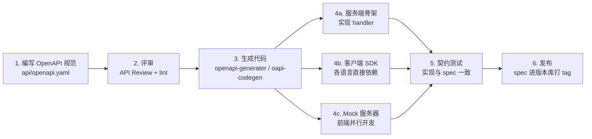

# REST 与 OpenAPI

> REST 是互联网上最普及的接口风格，也是最容易被「随手写」写坏的接口风格。当 REST 只服务一个前端时，约定可以口头传递；当它服务十个团队、五种语言时，必须有机器可读的契约。OpenAPI 就是这份契约：先写规范，再生成代码与文档，最后才是实现。

---

## 一、REST 设计原则

REST（Representational State Transfer）不是「用 JSON 的 HTTP 接口」的同义词。它的核心约束：

| 约束 | 含义 | 工程体现 |
|------|------|----------|
| 资源导向 | URL 表示资源，动作由方法表达 | `/orders/123` 而不是 `/getOrder?id=123` |
| 统一接口 | 标准方法语义 | GET 查询、POST 创建、PUT 全量替换、PATCH 局部更新、DELETE 删除 |
| 无状态 | 每个请求自带全部上下文 | 会话状态放 token，不放服务端内存 |
| 可缓存 | 响应标注可缓存性 | `Cache-Control`、`ETag`、`Last-Modified` |
| 分层系统 | 客户端不感知中间层 | 网关、CDN、负载均衡对客户端透明 |

### 1.1 HTTP 方法与幂等性

| 方法 | 语义 | 幂等 | 安全 | 典型状态码 |
|------|------|------|------|-----------|
| GET | 查询 | 是 | 是 | 200、304、404 |
| POST | 创建/执行 | 否 | 否 | 201、202、400、409 |
| PUT | 全量替换 | 是 | 否 | 200、201、204、404 |
| PATCH | 局部更新 | 否 | 否 | 200、204、400、409 |
| DELETE | 删除 | 是 | 否 | 204、404、409 |

幂等性是重试安全的基础：GET/PUT/DELETE 超时后可放心重试，POST 必须配合幂等键。

### 1.2 状态码使用规范

| 状态码 | 含义 | 使用建议 |
|--------|------|----------|
| 200 / 201 / 202 / 204 | 成功 | 201 创建成功带 `Location`；202 异步已接受；204 无响应体 |
| 400 | 请求格式错误 | JSON 解析失败、参数类型错误 |
| 401 / 403 | 未认证 / 无权限 | 401 缺凭证，403 已认证但不允许 |
| 404 | 资源不存在 | 也用于隐藏无权访问的资源 |
| 409 | 冲突 | 唯一键冲突、乐观锁失败 |
| 422 | 语义校验失败 | 格式对但业务规则不满足 |
| 429 | 限流 | 带 `Retry-After` |
| 500 / 503 | 服务端错误 / 不可用 | 500 不泄露内部细节；503 带 `Retry-After` |
---

## 二、RESTful URL 设计规范与反模式

```text
GET    /v1/orders                   # 列表（分页参数放 query）
POST   /v1/orders                   # 创建
GET    /v1/orders/{order_id}        # 详情
PATCH  /v1/orders/{order_id}        # 局部更新
DELETE /v1/orders/{order_id}        # 删除
GET    /v1/orders/{order_id}/items  # 子资源列表
POST   /v1/orders/{order_id}/cancel # 难以映射为 CRUD 的动作，用子资源动词
```

规则：名词复数（`/orders`）；小写 + 连字符（`/order-items`）；路径表达层级、query 表达过滤；版本放路径前缀；动作型接口用子资源。

| 反模式 | 例子 | 问题 | 正确做法 |
|--------|------|------|----------|
| 动词入路径 | `/getOrders` | 无法利用方法语义 | `GET /orders` |
| 单数名词 | `/order/1` | 集合与元素风格不一致 | `/orders/1` |
| 深层嵌套 | `/users/1/orders/2/items/3/tags` | 路径脆弱、难演进 | 超过两层用顶级资源 + 过滤 |
| 动作入 query | `POST /orders?action=cancel` | 语义混乱、无法缓存 | `POST /orders/1/cancel` |
| 200 包一切 | 业务失败也返回 200 | 监控、缓存、重试全部失效 | 语义化状态码 |

---

## 三、OpenAPI 规范结构

OpenAPI 3.x 用 YAML/JSON 描述 HTTP API。核心对象：`info`、`servers`、`paths`、`components`、`security`。

```yaml
# api/openapi.yaml
openapi: 3.1.0
info:
  title: 订单服务 API
  version: 1.0.0
servers:
  - url: https://api.example.com/v1
  - url: http://localhost:8080/v1

paths:
  /orders:
    get:
      operationId: listOrders
      summary: 查询订单列表
      parameters:
        - name: status
          in: query
          schema: { type: string, enum: [created, paid, shipped, cancelled] }
        - $ref: "#/components/parameters/PageSize"
        - $ref: "#/components/parameters/PageToken"
      responses:
        "200":
          description: 订单列表
          content:
            application/json:
              schema: { $ref: "#/components/schemas/OrderList" }
        "400": { $ref: "#/components/responses/Problem" }
    post:
      operationId: createOrder
      summary: 创建订单
      parameters:
        - $ref: "#/components/parameters/IdempotencyKey"
      requestBody:
        required: true
        content:
          application/json:
            schema: { $ref: "#/components/schemas/CreateOrderRequest" }
      responses:
        "201":
          description: 创建成功
          headers:
            Location: { schema: { type: string } }
          content:
            application/json:
              schema: { $ref: "#/components/schemas/Order" }
        "409": { $ref: "#/components/responses/Problem" }

  /orders/{orderId}:
    parameters:
      - name: orderId
        in: path
        required: true
        schema: { type: string }
    get:
      operationId: getOrder
      responses:
        "200":
          description: 订单详情
          content:
            application/json:
              schema: { $ref: "#/components/schemas/Order" }
        "404": { $ref: "#/components/responses/Problem" }

components:
  securitySchemes:
    bearerAuth: { type: http, scheme: bearer, bearerFormat: JWT }
    apiKey: { type: apiKey, in: header, name: X-API-Key }

  parameters:
    PageSize:
      name: page_size
      in: query
      schema: { type: integer, minimum: 1, maximum: 100, default: 20 }
    PageToken:
      name: page_token
      in: query
      schema: { type: string }
    IdempotencyKey:
      name: Idempotency-Key
      in: header
      required: true
      schema: { type: string, maxLength: 64 }

  responses:
    Problem:
      description: RFC 7807 错误响应
      content:
        application/problem+json:
          schema: { $ref: "#/components/schemas/Problem" }

  schemas:
    OrderItem:
      type: object
      required: [sku, quantity, price_cent]
      properties:
        sku: { type: string }
        quantity: { type: integer, minimum: 1 }
        price_cent: { type: integer, format: int64 }
    Order:
      type: object
      required: [id, user_id, items, status, created_at]
      properties:
        id: { type: string }
        user_id: { type: string }
        items:
          type: array
          items: { $ref: "#/components/schemas/OrderItem" }
        status: { type: string, enum: [created, paid, shipped, cancelled] }
        created_at: { type: string, format: date-time }
    CreateOrderRequest:
      type: object
      required: [user_id, items]
      properties:
        user_id: { type: string }
        items:
          type: array
          minItems: 1
          items: { $ref: "#/components/schemas/OrderItem" }
    OrderList:
      type: object
      properties:
        items:
          type: array
          items: { $ref: "#/components/schemas/Order" }
        next_page_token: { type: string }
    Problem:
      type: object
      required: [type, title, status]
      properties:
        type: { type: string, format: uri }
        title: { type: string }
        status: { type: integer }
        detail: { type: string }
        instance: { type: string, format: uri }

security:
  - bearerAuth: []
```

要点：`operationId` 是生成代码的方法名，必须全局唯一且稳定；复用 `components`，避免每个接口重复定义；`$ref` 可拆到多个文件；`format`（`int64`、`date-time`、`uuid`）是给生成器的提示。

---

## 四、契约先行工作流



纪律：

1. **spec 是唯一事实源**：接口变更先改 spec，再改实现
2. **CI 校验 spec**：`spectral` 做 lint，`openapi-diff` 检测破坏性变更
3. **生成产物与 spec 同版本**：客户端 SDK 版本跟随 spec 版本
4. **契约测试兜底**：用 spec 驱动请求与响应校验，防止实现漂移（见 [[多语言工程化/多语言工程化目录|4 测试与质量]]）

---

## 五、代码生成工具

| 工具 | 方向 | 语言 | 特点 | 不适用 |
|------|------|------|------|--------|
| openapi-generator | spec → 客户端/服务端 | 50+ 语言 | 生态最广，模板可定制 | 生成代码偏重，需 ignore 文件管理 |
| oapi-codegen | spec → Go | Go | 轻量，与 chi/echo/gin 集成好 | 仅 Go |
| tsoa | TS 代码 → spec | TS/Node | 代码即 spec，适合 TS 单体 | 需要多语言客户端时 |

```bash
# 生成 Go 服务端骨架与 Python 客户端
openapi-generator-cli generate -i api/openapi.yaml -g go-server -o gen/server-go \
  --additional-properties=packageName=api
openapi-generator-cli generate -i api/openapi.yaml -g python -o gen/client-python \
  --additional-properties=packageName=example_client

# oapi-codegen：生成 Go 类型与服务端接口
oapi-codegen -package api -generate types,chi-server,spec api/openapi.yaml > gen/api/api.gen.go
```

---

## 六、Mock 服务器与前端并行开发

契约先行的最大收益之一是前端不用等后端。

- **Prism**：读取 OpenAPI 直接启动 mock 服务，支持按 schema 生成随机数据、按 `example` 返回固定数据、请求校验
- **MSW（Mock Service Worker）**：在前端进程内拦截请求，测试与开发共用一套 handler

```bash
npm install -g @stoplight/prism-cli
prism mock api/openapi.yaml --port 4010            # mock 模式
prism proxy api/openapi.yaml https://api.example.com --port 4011  # 校验真实请求
```

```typescript
// MSW：前端测试与开发共用 mock
import { http, HttpResponse } from "msw";
import { setupServer } from "msw/node";

export const handlers = [
  http.get("/v1/orders", () =>
    HttpResponse.json({ items: [{ id: "order-1", status: "created" }] })
  ),
];
export const server = setupServer(...handlers);
```

约定：mock 数据必须从 spec 的 `example` 派生，不允许手写与 spec 不一致的假数据。

---

## 七、API 错误格式标准化

RFC 7807（Problem Details for HTTP APIs）定义了统一错误体，媒体类型为 `application/problem+json`：

```json
{
  "type": "https://api.example.com/problems/insufficient-balance",
  "title": "余额不足",
  "status": 422,
  "detail": "账户余额 100 分，订单需要 1999 分",
  "instance": "/v1/orders",
  "trace_id": "4f2a1c9e"
}
```

| 字段 | 含义 | 是否必需 |
|------|------|----------|
| `type` | 错误类型的稳定 URI，程序按它分支 | 是 |
| `title` | 人类可读的简短描述 | 是 |
| `status` | HTTP 状态码（与响应行一致） | 是 |
| `detail` | 本次错误的详细信息 | 否 |
| `instance` | 出错的具体请求路径 | 否 |
| 扩展字段 | `trace_id`、字段级错误列表等 | 否 |

字段级校验错误可以扩展为 `errors: [{field, code, message}]`。规则：`type` 与 `code` 一经发布不可变（给程序看）；`title`/`detail` 可以改（给人看）；错误体不回显敏感数据。

---

## 八、分页、过滤与排序约定

| 方案 | 请求 | 响应 | 优点 | 缺点 |
|------|------|------|------|------|
| Offset 分页 | `?offset=20&limit=20` | `total`、`items` | 简单，可跳页 | 深翻页慢，数据变动会漏/重 |
| Cursor/Token 分页 | `?page_token=xxx&page_size=20` | `next_page_token` | 稳定、性能恒定 | 不能跳页，token 不透明 |
| Keyset 分页 | `?created_after=...&limit=20` | 下一批边界值 | 可读、索引友好 | 排序字段受限 |

约定：默认 `page_size=20`、上限 100，超限返回 400 而不是静默截断；过滤参数用字段名（`?status=paid&user_id=u1`）；排序用 `sort=-created_at,name` 并白名单控制；列表响应统一包一层对象，不要裸返回数组。

---

## 九、认证方案

| 方案 | 机制 | 适用 | 不适用 |
|------|------|------|--------|
| API Key | 请求头/query 带固定密钥 | 服务端到服务端、简单场景 | 浏览器、需要用户级授权 |
| Bearer JWT | `Authorization: Bearer <jwt>` | 前后端分离、无状态鉴权 | 需要立即吊销 |
| OAuth2 + PKCE | 授权码换 token | 第三方登录、用户授权 | 机器对机器（用 client credentials） |
| mTLS | 双向证书 | 零信任内部服务 | 公开 API（证书管理成本高） |

```yaml
securitySchemes:
  bearerAuth: { type: http, scheme: bearer, bearerFormat: JWT }
security:
  - bearerAuth: []      # 全局默认
paths:
  /public/health:
    get:
      security: []      # 显式覆盖为无需认证
```

---

## 十、API 网关的职责

| 职责 | 说明 | 常见实现 |
|------|------|----------|
| 路由与版本 | 路径前缀映射到不同后端 | Nginx、Kong、APISIX、Envoy |
| 认证鉴权 | 统一校验 JWT/API Key | 网关插件或独立鉴权服务 |
| 限流熔断 | 按租户/接口限流，失败快速返回 | 令牌桶、熔断器 |
| 协议转换 | REST 到内部 gRPC | grpc-gateway、Envoy |
| 可观测性 | 访问日志、指标、链路追踪注入 | OpenTelemetry |
反模式：把业务逻辑写进网关。网关应保持无业务状态、可随时重建；业务规则属于服务。

---

## 十一、OpenAPI 与 GraphQL、gRPC 对比

| 维度 | OpenAPI / REST | GraphQL | gRPC |
|------|----------------|---------|------|
| 契约形式 | OpenAPI 文档 | Schema（SDL） | `.proto` |
| 数据获取 | 服务端决定响应结构 | 客户端按需选择字段 | 固定消息结构 |
| 多次请求 | 可能多次（聚合靠 BFF） | 一次查询聚合 | 按接口设计 |
| 缓存 | HTTP 缓存成熟 | 需自行实现 | 不适用 |
| 类型安全 | 生成器支持 | 强类型 | 强类型 |
| 文件上传 | 原生支持 | 较麻烦 | 流式支持 |
| 学习成本 | 低 | 高 | 中 |
| 适用 | 公开 API、CRUD、Web | 前端数据需求多变 | 内部高性能服务 |

选择依据：接口是否稳定、消费者是否多样、性能要求多高。不要因为「新」选 GraphQL，也不要因为「性能」在只有两个接口时上 gRPC。

---

## 十二、版本化策略

| 策略 | 做法 | 优点 | 缺点 |
|------|------|------|------|
| URI 版本 | `/v1/orders` | 直观、易路由、易文档 | 需要维护多版本 |
| Header 版本 | `Accept: application/vnd.api.v2+json` | URL 稳定 | 调试不直观、缓存配置复杂 |
| Query 版本 | `?version=2` | 简单 | 语义弱、容易被忽略 |
| 无版本 + 兼容演进 | 只做向后兼容变更 | 客户端无需改动 | 破坏性变更时被迫用前三种 |

推荐：**URI 大版本 + 兼容演进**。只有破坏性变更才升大版本；新增字段、接口、枚举值都在同一版本内完成。下线旧版本前必须有废弃公告期、调用量监控、迁移文档、`Deprecation`/`Sunset` 响应头。

---

## 常见坑与反模式

1. **spec 与实现漂移**：spec 只在立项时更新。对策：契约测试在 CI 中用 spec 校验真实响应
2. **生成代码不可读**：直接改生成产物，下次生成被覆盖。生成代码放 `gen/` 并加 ignore 文件，业务代码放生成目录之外
3. **一个 spec 塞进所有服务**：几千行单文件冲突频繁。按服务/资源拆文件，用 `$ref` 组合
4. **枚举值即契约**：服务端新增枚举值导致客户端解析失败。客户端必须容忍未知枚举值
5. **分页返回裸数组**：以后加分页信息就是破坏性变更。列表统一包一层
6. **200 返回业务错误**：监控误判、重试逻辑失效。用语义化状态码 + RFC 7807
7. **过度嵌套资源**：URL 随业务关系无限加深。超过两层用顶级资源 + 过滤
8. **鉴权写在每个 handler**：漏一个就是漏洞。网关/中间件统一处理，spec 声明 `security`
9. **忽略限流头**：客户端不读 `Retry-After`，限流时疯狂重试造成二次伤害

---

## 本章小结

- REST 的核心是资源 + 统一方法 + 无状态；URL 用名词复数，动作由 HTTP 方法表达
- 状态码是接口语义的一部分，200 包一切会让监控、缓存、重试全部失效
- OpenAPI 把 REST 接口变成机器可读契约，`operationId` 与 `components` 是生成质量的关键
- 契约先行：写 spec、评审、生成代码、mock 并行、契约测试，spec 是唯一事实源
- 错误格式统一用 RFC 7807；分页优先 cursor/token；认证方案在 spec 中声明
- 网关只管横切关注点，不写业务逻辑

---

## 动手实践

### 实践一：为订单服务写一份 OpenAPI 规范

覆盖列表、创建、详情、取消四个操作，包含分页参数、RFC 7807 错误、Bearer 认证。

验收标准：`spectral lint` 无错误；用 `prism mock` 能启动并返回符合 schema 的响应；用 Swagger UI 或 Redoc 能渲染出可读文档。

### 实践二：生成多语言客户端

用 `openapi-generator` 生成 Python 与 TypeScript 客户端，分别调用 Prism mock 服务。

验收标准：两个客户端都能成功调用列表与创建接口；生成的代码不手改；写一个脚本把「改 spec → 重新生成 → 运行调用」串成一条命令。

### 实践三：契约测试

实现一个最小的 Go 或 Python 服务端，用 spec 驱动测试：对每个 operation 发请求，校验响应状态码与 schema。

验收标准：故意让实现返回 spec 中不存在的字段，测试能报错；故意删掉必填字段，测试能报错；测试能在 CI 中一条命令运行。

### 实践四：破坏性变更演练

在 spec 中把 `price_cent` 从 `integer` 改为 `string`，用 `openapi-diff` 检测。

验收标准：工具能识别为破坏性变更；写一份迁移方案，说明如何用「新增字段 + 双写 + 灰度切换 + 下线旧字段」完成演进。

---

- 返回目录：[[多语言工程化/多语言工程化目录|多语言工程化]]
