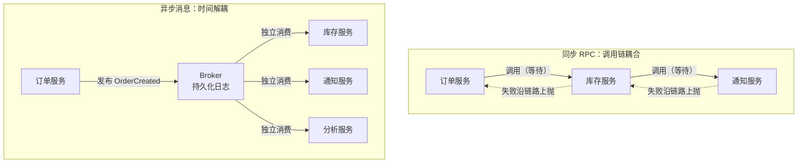
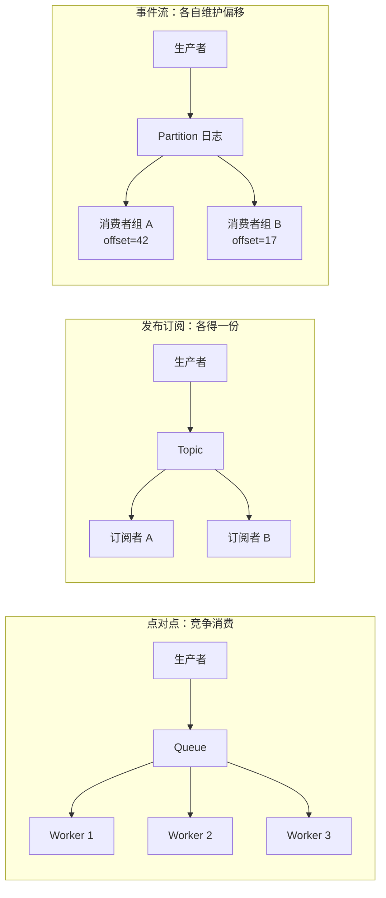
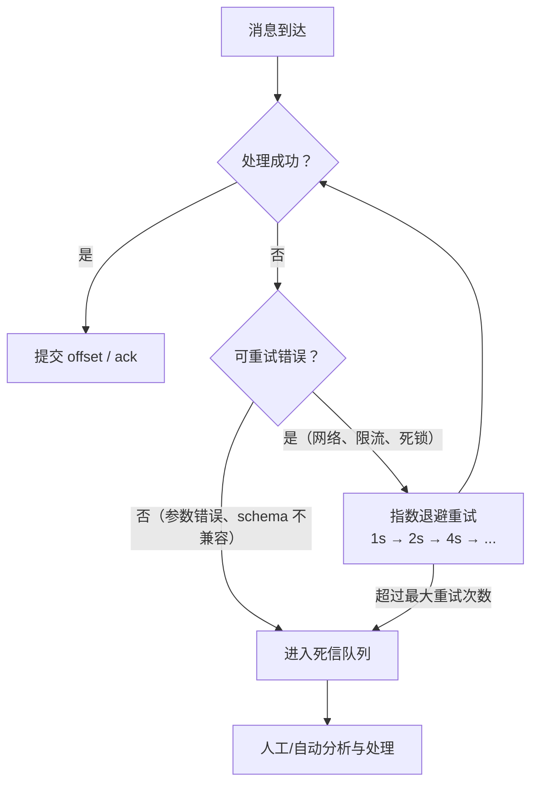
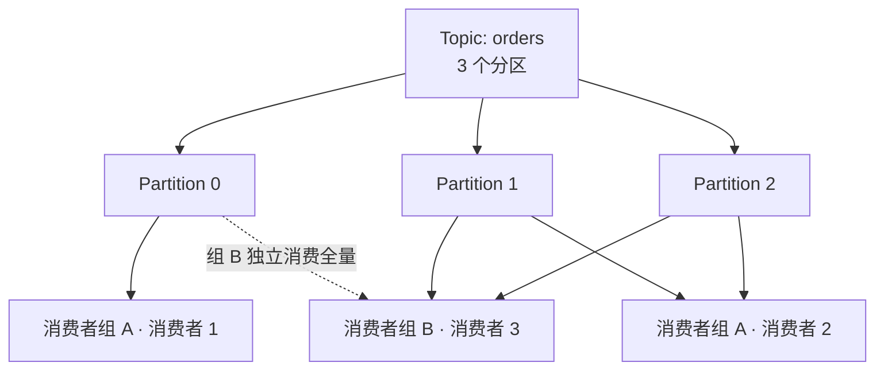
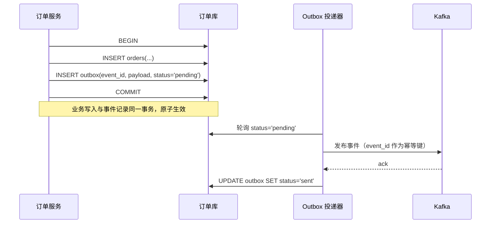

# 消息队列与事件驱动

> 同步 RPC 把「可用性」和「延迟」绑在一起：下游慢，上游就慢；下游挂，上游就挂。消息队列把时间解耦——生产者只管把事实写进日志，消费者按自己的节奏处理。代价是：重复、乱序、延迟、最终一致，全部变成你必须显式处理的工程问题。

---

## 一、同步 RPC 与异步消息的取舍



| 维度 | 同步 RPC | 异步消息 |
|------|----------|----------|
| 耦合方式 | 时间耦合：双方必须同时在线 | 时间解耦：broker 暂存消息 |
| 调用语义 | 请求-响应，立即拿到结果 | 发布-消费，结果最终出现 |
| 故障传播 | 下游故障向上游扩散，可能雪崩 | 下游故障不影响生产者 |
| 削峰能力 | 无，流量直接打到下游 | 有，队列缓冲突发流量 |
| 延迟 | 低且可预测 | 有排队延迟，不确定 |
| 一致性 | 易做强一致 | 通常最终一致 |
| 调试 | 调用链清晰 | 需要追踪消息流转 |
| 适用 | 查询、需要立即结果的操作 | 事件通知、耗时任务、扇出 |
| 不适用 | 长耗时操作、一对多扇出 | 需要同步返回结果的场景 |

决策原则：**读路径用同步（见 [[多语言工程化/3接口与协议/03_Protobuf与gRPC|Protobuf 与 gRPC]]），写路径的副作用用异步**。用户下单需要立即知道结果（同步创建订单），但扣库存、发通知、更新统计都可以异步。

---

## 二、消息模型

| 模型 | 结构 | 语义 | 典型实现 | 适用 |
|------|------|------|----------|------|
| 点对点队列 | 消息被一个消费者取走 | 任务分发 | RabbitMQ Queue、SQS | 任务队列、工作分发 |
| 发布订阅 | 每个订阅者都收到一份 | 广播 | RabbitMQ Fanout、Redis Pub/Sub、NATS | 配置刷新、实时通知 |
| 事件流 | 追加式日志，可重放 | 日志即真相 | Kafka、Pulsar、NATS JetStream | 事件溯源、CDC、多消费者独立进度 |

关键差异：**队列消费后消息消失，事件流消费后消息仍在**。事件流允许新消费者从历史位置开始重放，这是队列模型做不到的。需要「新服务上线后回放过去一周事件」时，只能选事件流。



---

## 三、主流中间件对比

| 维度 | Kafka | RabbitMQ | NATS / JetStream | Redis Streams | Pulsar |
|------|-------|----------|------------------|---------------|--------|
| 模型 | 分布式提交日志 | AMQP 队列/交换机 | 消息 + 持久化流 | 内存为主的事件流 | 分层存储的消息流 |
| 吞吐量级 | 百万条/秒 | 十万条/秒 | 百万条/秒 | 十万条/秒 | 百万条/秒 |
| 延迟 | 毫秒级 | 亚毫秒-毫秒 | 亚毫秒（核心 NATS） | 亚毫秒 | 毫秒级 |
| 持久化 | 磁盘日志，可长期保留 | 队列（可持久化） | JetStream 持久化 | AOF/RDB，内存上限约束 | 分层存储（内存+对象存储） |
| 顺序保证 | 分区内有序 | 单队列有序 | 流内有序 | 流内有序 | 分区内有序 |
| 重放 | 支持（改 offset） | 不支持（需重新入队） | 支持 | 支持（XRANGE） | 支持 |
| 延迟消息/定时 | 不支持（需外部方案） | 支持（TTL + DLX） | 支持 | 支持（XADD 时间戳） | 支持 |
| 多租户 | 中（ACL/配额） | 中（vhost） | 强（account） | 弱 | 强（tenant/namespace） |
| 运维复杂度 | 高（ZK/KRaft、分区规划） | 中 | 低 | 低 | 高（BookKeeper） |
| 跨语言生态 | 极好 | 极好 | 好 | 好（各语言 redis 客户端） | 好 |
| 适用 | 事件流、日志管道、CDC、大规模扇出 | 任务队列、路由复杂、延迟消息 | 云原生轻量消息、请求-响应 | 轻量场景、已有 Redis、小规模流 | 多租户、需要分层存储 |
| 不适用 | 低吞吐小项目、需要复杂路由 | 超大规模事件重放 | 需要复杂路由与事务消息 | 超大数据量长期保留 | 小团队（运维成本过高） |

选型建议：事件驱动主干优先 Kafka 或 Pulsar；轻量任务队列用 RabbitMQ；已有 Redis 且规模不大用 Redis Streams；云原生边车/服务网格场景 NATS 很合适。

---

## 四、投递语义与幂等消费

| 语义 | 保证 | 实现方式 | 风险 |
|------|------|----------|------|
| At-most-once | 最多一次，可能丢 | 先提交 offset 再处理 | 崩溃丢消息 |
| At-least-once | 至少一次，可能重复 | 先处理再提交 offset | 重复消费 |
| Exactly-once | 恰好一次 | 事务 + 幂等写入，或 Kafka 事务 | 成本高、边界有限 |

现实选择：**At-least-once + 幂等消费**。Exactly-once 只在特定边界内成立（如 Kafka 流处理内部），跨系统仍然要幂等。

幂等消费的设计手段：

1. **业务唯一键**：用事件 ID 或业务 ID 建唯一索引，重复插入直接冲突
2. **状态机守卫**：只允许合法状态转移，重复事件自然被忽略
3. **去重表**：处理前先查/插入 `processed_events(event_id)`，与业务操作放同一事务
4. **版本号/序号**：只接受比当前版本更新的消息

```python
# 幂等消费的核心：去重记录与业务写入在同一事务
def handle_order_created(conn, event: dict) -> bool:
    cur = conn.cursor()
    try:
        cur.execute("BEGIN")
        cur.execute(
            "INSERT INTO processed_events (event_id, processed_at) VALUES (?, datetime('now'))",
            (event["event_id"],),
        )
        cur.execute(
            "UPDATE inventory SET quantity = quantity - ? WHERE sku = ?",
            (event["quantity"], event["sku"]),
        )
        conn.commit()
        return True
    except sqlite3.IntegrityError:
        conn.rollback()   # 事件已处理过，安全跳过
        return False
```

注意：幂等键要覆盖「同一业务事件的多次投递」，而不是「同一消息内容的多次发送」。生产者重发时保持 `event_id` 不变，消费者才能识别。

---

## 五、消息格式与 Schema Registry

消息是长期存在的契约：今天的生产者可能三年后还在写，消费者的新版本要能读旧消息。

| 格式 | 是否自描述 | 体积 | 演进能力 | 适用 |
|------|-----------|------|----------|------|
| JSON | 是 | 大 | 弱（靠约定） | 简单场景、调试友好 |
| Avro | 否（需 schema） | 小 | 强（schema 解析） | Kafka 数据管道、CDC |
| Protobuf | 否（需 schema） | 小 | 强（字段号） | 跨语言服务、强类型 |
| JSON Schema | 是 | 大 | 中 | 校验 JSON 消息 |

**Schema Registry** 是集中管理 schema 版本的服务（Confluent Schema Registry、Apicurio）。生产者注册 schema 得到 ID，消息体只带 schema ID + 数据，消费者按 ID 拉取 schema 解析。

兼容性模式：

| 模式 | 允许的变更 | 升级顺序 |
|------|-----------|----------|
| BACKWARD | 新 schema 能读旧数据（删字段、加可选字段） | 先升消费者 |
| FORWARD | 旧 schema 能读新数据（加字段、删可选字段） | 先升生产者 |
| FULL | 双向兼容 | 任意顺序 |
| NONE | 不检查 | 危险，仅开发环境 |

默认建议 FULL：加字段必须可选、删字段必须先确认无消费者依赖。

---

## 六、事件驱动架构

事件驱动有三种成熟度，不要混为一谈：

| 模式 | 事件内容 | 消费者依赖 | 示例 |
|------|----------|-----------|------|
| 事件通知 | 只说明「发生了什么」，消费者回查 | 需要回调生产者 API | `{type: "order_created", id: "o1"}` |
| 事件携带状态转移 | 事件自带完整业务数据 | 不回调，自包含 | `{type: "order_created", order: {...完整订单...}}` |
| 事件溯源 | 事件是唯一事实源，状态由重放得出 | 强依赖事件序列 | 账户流水、审计系统 |

**推荐「事件携带状态转移」**：消费者无需回查，避免级联同步调用；同时保留 `event_id`、`occurred_at`、`version` 等元数据。

事件元数据的通用信封：

通用信封至少包含：`event_id`（消费端幂等键）、`event_type`（带版本，如 `order.created.v1`）、`occurred_at`（UTC）、`producer`、`trace_id` 与 `payload`。

### CQRS 简介

CQRS（Command Query Responsibility Segregation）把写模型与读模型分开：

- 写侧：接收命令、校验业务规则、写入事件/数据库
- 读侧：订阅事件、构建面向查询的物化视图（宽表、搜索索引、缓存）

写侧接收命令、校验业务规则、写入数据库并发布事件；读侧订阅事件构建物化视图（宽表、搜索索引、报表），查询 API 只读这些视图。

CQRS 的代价是**最终一致**：写成功后读侧可能短暂看不到。必须在前端交互上处理（乐观更新、轮询、WebSocket 推送）。只在读写负载差异大或查询形态复杂时使用，简单 CRUD 上 CQRS 是过度设计。

---

## 七、死信队列与重试策略



原则：

1. **区分可重试与不可重试错误**：`UNAVAILABLE` 可重试，`INVALID_ARGUMENT` 重试一万次也不会成功
2. **指数退避 + 抖动**：固定间隔会造成重试风暴；退避上限与最大次数必须设置
3. **毒消息隔离**：重试耗尽后进 DLQ，不能让一条坏消息阻塞整个分区
4. **DLQ 也要监控**：DLQ 有消息意味着有业务失败，必须有告警与处理流程
5. **重试要幂等**：重试必然导致重复投递，幂等是前提

---

## 八、消费者组与分区再均衡

Kafka 的并行单位是分区：一个分区同一时刻只能被同一消费者组内的一个消费者消费。



再均衡（rebalance）发生在消费者加入、离开、分区数变化时：

- 再均衡期间分区暂停消费（stop-the-world），时间过长会造成消费滞后
- 使用**协作式再均衡**（Cooperative Sticky）替代 eager 模式，减少全量暂停
- 消费处理时间超过 `max.poll.interval.ms` 会被踢出组，触发再均衡；长任务应拆分或调参
- 分区数决定最大并行度：消费者数超过分区数后，多出的消费者空闲

---

## 九、跨语言客户端生态

| 中间件 | Java | Go | Python | Rust | Node | C/C++ |
|--------|------|----|--------|------|------|-------|
| Kafka | 官方客户端 | franz-go、sarama | confluent-kafka、kafka-python | rdkafka、kafka | kafkajs | librdkafka |
| RabbitMQ | amqp-client | amqp091-go | pika、aio-pika | lapin | amqplib | rabbitmq-c |
| NATS | jnats | nats.go | nats.py | async-nats | nats.js | cnats |
| Redis Streams | Jedis/Lettuce | go-redis | redis-py | redis-rs | ioredis | hiredis |
| Pulsar | 官方客户端 | pulsar-client-go | pulsar-client | pulsar-rs | pulsar-client | pulsar-client-cpp |

跨语言使用同一 broker 时，注意：

- 不同客户端对「消费组协议、offset 提交、序列化」的默认行为不同，必须统一配置
- 消息格式由 Schema Registry 统一，不要各语言自定义
- 客户端版本差异可能导致兼容问题，锁定版本并写进依赖清单

---

## 十、Outbox 模式：解决数据库与消息不一致

「先写数据库，再发消息」有两个经典故障：写库成功但发消息失败（丢事件）；发消息成功但写库失败（幽灵事件）。分布式事务过重，Outbox 用本地事务解决。



```sql
-- outbox 表：与业务表在同一个数据库
CREATE TABLE outbox (
    id          INTEGER PRIMARY KEY AUTOINCREMENT,
    event_id    TEXT NOT NULL UNIQUE,   -- 消费者幂等键
    event_type  TEXT NOT NULL,
    payload     TEXT NOT NULL,
    status      TEXT NOT NULL DEFAULT 'pending',
    created_at  TEXT NOT NULL DEFAULT (datetime('now')),
    sent_at     TEXT
);
CREATE INDEX idx_outbox_pending ON outbox(status, id);
```

```python
# 投递器：至少一次投递，靠 event_id 保证消费端幂等
def relay_once(conn, producer) -> int:
    rows = conn.execute(
        "SELECT id, event_id, event_type, payload FROM outbox "
        "WHERE status='pending' ORDER BY id LIMIT 100"
    ).fetchall()
    for row in rows:
        producer.produce("orders", key=row["event_id"], value=row["payload"].encode())
        producer.flush()
        conn.execute("UPDATE outbox SET status='sent', sent_at=datetime('now') WHERE id=?",
                     (row["id"],))
    conn.commit()
    return len(rows)
```

更成熟的方案是 CDC（Debezium 等）直接读取数据库日志，省掉轮询。Outbox 是「消息最终会发出」的保证，不是「恰好一次」的保证。

---

## 十一、完整示例：Redpanda + Python 生产者与消费者

```yaml
# docker-compose.yml —— Redpanda 兼容 Kafka API，单容器即可本地开发
services:
  redpanda:
    image: redpandadata/redpanda:v24.2.7
    command: >
      redpanda start --overprovisioned --smp 1 --memory 1G --node-id 0 --check=false
      --kafka-addr PLAINTEXT://0.0.0.0:9092
      --advertise-kafka-addr PLAINTEXT://localhost:9092
    ports: ["9092:9092"]
```

```python
# producer.py —— 发送带 event_id 的订单事件，重发时 event_id 不变
import json
import uuid

from confluent_kafka import Producer

producer = Producer({"bootstrap.servers": "localhost:9092"})

def delivery_report(err, msg) -> None:
    print(f"投递失败: {err}" if err else f"投递成功: offset={msg.offset()}")

def publish_order_created(order_id: str, user_id: str, items: list[dict]) -> None:
    event = {"event_id": f"evt-{uuid.uuid4()}", "event_type": "order.created.v1",
             "payload": {"order_id": order_id, "user_id": user_id, "items": items}}
    # key 用 order_id：同一订单的事件进入同一分区，保证分区内有序
    producer.produce("orders", key=order_id.encode(),
                     value=json.dumps(event, ensure_ascii=False).encode(), callback=delivery_report)
    producer.flush()

if __name__ == "__main__":
    publish_order_created("o-1001", "u-1", [{"sku": "s1", "quantity": 2}])
```

```python
# consumer.py —— 手动提交 offset + SQLite 去重，实现至少一次投递下的幂等处理
import json
import sqlite3

from confluent_kafka import Consumer, KafkaError

conn = sqlite3.connect("consumer.db")
conn.execute("CREATE TABLE IF NOT EXISTS processed_events "
             "(event_id TEXT PRIMARY KEY, processed_at TEXT DEFAULT (datetime('now')))")
conn.commit()
consumer = Consumer({"bootstrap.servers": "localhost:9092", "group.id": "inventory-service",
                     "auto.offset.reset": "earliest", "enable.auto.commit": False})
consumer.subscribe(["orders"])

def handle(event: dict) -> None:
    try:
        conn.execute("BEGIN")  # 业务处理与去重记录必须在同一事务
        conn.execute("INSERT INTO processed_events (event_id) VALUES (?)", (event["event_id"],))
        order = event["payload"]
        print(f"扣减库存: order={order['order_id']} items={order['items']}")
        conn.commit()
    except sqlite3.IntegrityError:
        conn.rollback()
        print(f"重复事件，跳过: {event['event_id']}")

try:
    while True:
        msg = consumer.poll(1.0)
        if msg is None:
            continue
        if msg.error():
            if msg.error().code() == KafkaError._PARTITION_EOF:
                continue
            raise RuntimeError(msg.error())
        handle(json.loads(msg.value().decode()))
        consumer.commit(msg)  # 处理成功才提交
finally:
    consumer.close()
```

验收方式：启动 Redpanda，先运行消费者，再运行生产者；重复运行生产者两次（相同 `event_id` 需自行固定测试），观察第二次被去重逻辑跳过。

---

## 常见坑与反模式

1. **消息顺序**：全局有序不存在，只有分区内有序。需要顺序的事件必须用同一 key 进同一分区；消费者并行处理同一分区内消息也会破坏顺序
2. **重复消费**：at-least-once 必然重复，没有幂等设计的消费者上线就是事故
3. **消费者滞后（lag）无监控**：lag 持续增长意味着消费能力不足，必须告警而不是等用户投诉
4. **把 broker 当数据库**：消息保留期有限，需要长期存储要落库或对象存储
5. **大消息**：Kafka 默认单条 1 MB，大消息会拖垮 broker；文件走对象存储，消息只传引用
6. **重试风暴**：所有消费者同时固定间隔重试，把下游打垮。必须指数退避 + 抖动 + 熔断
7. **忘记处理毒消息**：一条 schema 不兼容的消息阻塞整个分区，需要 DLQ 与跳过策略
8. **Schema 变更无审核**：直接改消息结构，所有消费者同时失败。Schema Registry 的兼容性检查必须开启
10. **Outbox 只写不投**：忘了部署投递器，事件永远停在 pending。投递器要有 lag 监控

---

## 本章小结

- 同步 RPC 与异步消息不是替代关系：读路径同步，写路径副作用异步
- 队列、发布订阅、事件流是三种模型；需要重放就选事件流
- 现实投递语义是 at-least-once + 幂等消费；exactly-once 只在有限边界成立
- 消息格式必须版本化；Schema Registry 提供集中管理与兼容性检查
- Outbox 模式用本地事务保证「业务写入」与「事件发出」原子，是跨系统一致性的实用方案

---

## 动手实践

### 实践一：跑通 Redpanda 最小闭环

用本章的 `docker-compose.yml` 启动 Redpanda，运行生产者与消费者，观察 offset 与消费组状态。

验收标准：`docker exec` 进入容器用 `rpk topic consume orders` 能看到消息；`rpk group describe inventory-service` 能看到 lag 为 0；把消费者停掉再发 10 条消息，lag 显示为 10。

### 实践二：实现幂等消费

用 SQLite 去重表改造消费者，重复投递同一 `event_id` 时不重复处理。

验收标准：手动用相同 `event_id` 发送两次，第二次被跳过；在消费者处理中途 kill 进程（提交 offset 前），重启后消息被重新消费但不产生重复业务效果。

### 实践三：死信队列与重试

让消费者在遇到 `quantity < 0` 的消息时重试三次（指数退避）后转入 `orders-dlq` 主题。

验收标准：DLQ 中能看到毒消息；正常消息不受影响继续消费；写一份说明解释哪些错误应该重试、哪些直接进 DLQ。

### 实践四：Outbox 模式

在 SQLite 中建 `orders` 与 `outbox` 两张表，实现「下单事务 + 投递器」，模拟投递器崩溃后重启。

验收标准：投递器崩溃期间下单，重启后事件全部补发；同一事件不会在业务侧产生两次效果；说明为什么投递器采用轮询而不是数据库触发器。

---

- 返回目录：[[多语言工程化/多语言工程化目录|多语言工程化]]
