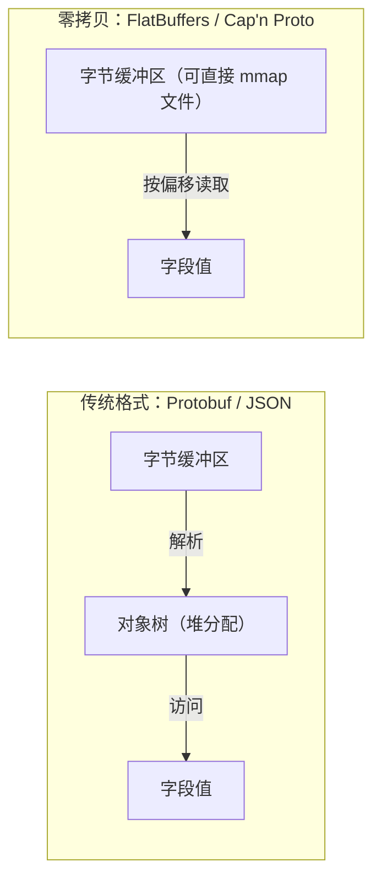
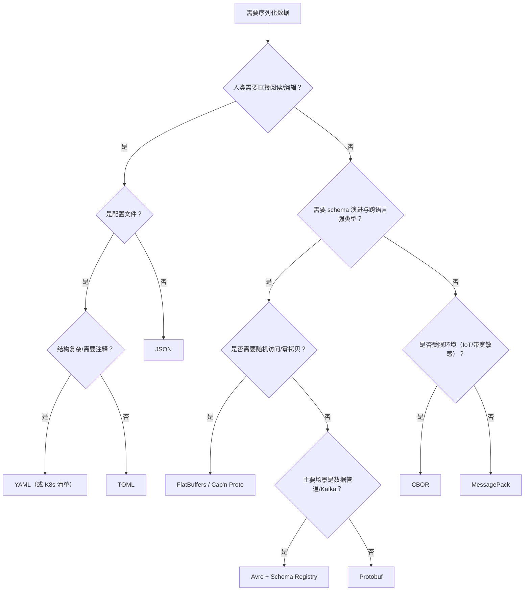

# 序列化格式对比

> 序列化是每个跨语言调用都要付的税：付多了，性能全耗在编解码上；付少了（选了不可读、不可演进的格式），调试和兼容性会让团队付出更大代价。选格式的本质是在体积、速度、可读性、演进能力、跨语言支持这五个维度上做加权取舍；IDL 与 RPC 的结合方式见 [[多语言工程化/3接口与协议/03_Protobuf与gRPC|Protobuf 与 gRPC]]。

---

## 一、序列化的核心指标

| 指标 | 含义 | 怎么测 |
|------|------|--------|
| 体积 | 编码后的字节数 | 用真实数据样本统计 P50/P99，不要只用平均值 |
| 编码/解码速度 | 每秒可处理的消息数或 MB/s | 同一份数据、同一语言、预热后测量 |
| 可读性 | 人类能否直接阅读与手工编辑 | 是否能进日志、能否用 `jq` 处理 |
| Schema 演进 | 加/删/改字段后旧数据的兼容能力 | 用新旧版本互相解析做兼容性矩阵 |
| 跨语言支持 | 各语言库的成熟度与一致性 | 检查目标语言是否有官方/活跃维护的实现 |
| 自描述性 | 数据本身是否包含结构信息 | 无 schema 能否解析 |
| 工具链成本 | 代码生成、校验、调试工具 | 团队是否需要额外学习与维护 |

没有全维度占优的格式。**选型就是明确哪个维度最重要，然后接受其他维度的损失**。

---

## 二、文本格式

### 2.1 四种文本格式对比

| 维度 | JSON | YAML | TOML | XML |
|------|------|------|------|-----|
| 定位 | 数据交换事实标准 | 配置、K8s 清单 | 配置文件 | 文档标记、企业集成 |
| 可读性 | 好 | 极好 | 好 | 差（标签冗余） |
| 注释 | 不支持 | 支持 | 支持 | 支持 |
| 数据类型 | 字符串/数字/布尔/null/数组/对象 | 同 JSON + 日期、锚点 | 同 JSON + 日期、整数/浮点区分 | 全部是文本 + schema |
| 数字精度 | 双精度，大整数有坑 | 依赖解析器 | 有整数类型 | 无内置数值语义 |
| 解析复杂度 | 低 | 高（缩进敏感、多方言） | 低 | 中高 |
| 表达力 | 中 | 强（锚点、多文档） | 中 | 极强（命名空间、schema） |
| 跨语言 | 所有语言 | 好 | 好 | 好（但 API 风格古老） |
| 适用 | API、日志、消息 | 配置、K8s、CI | 应用配置 | 文档、SOAP、行业标准 |
| 不适用 | 需要注释的配置、高精度数值 | 机器生成的大数据、深层嵌套 | 复杂嵌套结构 | 高性能数据交换 |

### 2.2 选型速记

- **数据交换**：JSON。生态最广，浏览器原生支持，调试最方便
- **配置文件**：TOML（应用）或 YAML（K8s/CI）。TOML 的类型系统更严谨，YAML 缩进错误是经典事故源
- **需要注释 + 嵌套深**：YAML，但禁止用 YAML 存业务数据
- **行业标准/文档**：XML 仍不可替代（SOAP、SVG、Office 格式）

---

## 三、二进制格式

| 维度 | MessagePack | CBOR | BSON |
|------|-------------|------|------|
| 全称 | — | Concise Binary Object Representation | Binary JSON |
| 标准化 | 事实标准 | IETF RFC 8949 | MongoDB 私有 |
| 类型系统 | JSON 超集（含二进制） | JSON 超集（含标签、日期） | JSON 超集（含 ObjectId、日期） |
| 体积 | 比 JSON 小 20%-50% | 比 JSON 小 20%-50% | 通常比 JSON 还大（字段名重复存储） |
| 是否自描述 | 是 | 是 | 是 |
| 流式解析 | 支持 | 支持 | 一般 |
| 跨语言 | 极好 | 好 | 好（MongoDB 驱动） |
| 适用 | 内部服务、缓存值、日志 | IoT、受限环境、需要标准 | MongoDB 存储 |
| 不适用 | 需要人类阅读的场景 | 需要极致性能（Protobuf 更快） | 非 MongoDB 场景（体积劣势） |

MessagePack 与 CBOR 的取舍：两者能力接近。CBOR 是 IETF 标准且有标签机制（可表达日期、大数），适合需要标准背书的场景；MessagePack 生态与工具更多，适合纯工程场景。**不要用 BSON 做通用交换格式**，它的字段名冗余会让体积大于 JSON。

---

## 四、Schema 驱动格式

| 维度 | Protobuf | Thrift | Avro | FlatBuffers | Cap'n Proto |
|------|----------|--------|------|-------------|-------------|
| 出身 | Google | Apache/Facebook | Apache/Hadoop | Google | 独立 |
| IDL | `.proto` | `.thrift` | `.avsc`（JSON 定义） | `.fbs` | `.capnp` |
| 编码 | TLV + varint | 二进制/压缩/JSON | 二进制，schema 随数据或注册中心 | 偏移量表 | 段式零拷贝 |
| 是否需要 schema 解析 | 需要（字段号） | 需要 | 需要（writer schema） | 需要 | 需要 |
| 零拷贝 | 否（需解析） | 否 | 否 | 是（随机访问） | 是（随机访问） |
| 随机访问字段 | 否 | 否 | 否 | 是 | 是 |
| 体积 | 小 | 小 | 小 | 中（对齐填充） | 中 |
| 演进能力 | 强（字段号） | 中 | 极强（读写 schema 分离） | 强（字段 ID） | 强（字段序号） |
| 跨语言 | 极好 | 好 | 好（Java 生态最强） | 好 | 中 |
| 典型场景 | gRPC、跨语言服务 | 大数据批处理 | Kafka、数据湖、CDC | 游戏、实时推理 | 高性能 IPC |
| 不适用 | 需要随机访问、极低延迟 | 新项目（生态萎缩） | 需要随机访问 | 频繁小对象（构建开销） | 生态要求广 |

关键差异：

- **Avro 的 schema 不嵌入数据**（Confluent 模式是 schema ID + 数据），依赖注册中心；这让「写 schema 升级、读 schema 旧版」成为可能，是数据管道的首选
- **FlatBuffers/Cap'n Proto 的核心价值是访问字段不需要解析整个消息**，适合「消息很大、只读其中几个字段」或「延迟极敏感」的场景
- **Thrift 的生态在收缩**，新项目除非已有 Hadoop 体系，否则不选

---

## 五、零拷贝与内存映射

传统反序列化是「读字节 → 构建对象树 → 访问字段」，两次拷贝 + 一次分配。FlatBuffers/Cap'n Proto 把结构信息编码为偏移量，访问字段时直接按偏移读取，**没有反序列化这一步**。



| 场景 | 是否适合零拷贝 | 原因 |
|------|----------------|------|
| 大消息只读少数字段 | 适合 | 省去全量解析 |
| 消息需要 mmap 到文件/共享内存 | 适合 | 无解析即可跨进程访问 |
| 小消息高频读写 | 不适合 | 构建开销与对齐填充抵消收益 |
| 需要频繁修改字段 | 不适合 | 多数实现不擅长原地更新 |
| 需要人类可读 | 不适合 | 二进制偏移量完全不可读 |

注意：零拷贝格式的「快」体现在读取路径；如果业务逻辑本来就要构建完整的领域对象，收益会大幅缩小。

---

## 六、编解码性能基准的解读方法

网上流传的 benchmark 大多是「特定数据 + 特定语言 + 特定版本」的结果，直接抄结论是选型事故的常见来源。

### 6.1 benchmark 的常见陷阱

| 陷阱 | 说明 | 正确做法 |
|------|------|----------|
| 数据不真实 | 用 3 个字段的小对象测出「Protobuf 快 10 倍」 | 用生产环境脱敏样本，覆盖典型与极端数据 |
| 忽略预热 | JIT/缓存未预热，结果波动巨大 | 预热后测量，多次运行取中位数 |
| 只测编码或只测解码 | 真实链路两者都有 | 测完整往返，含对象构建 |
| 忽略分配与 GC | 微基准不触发 GC，真实服务触发 | 用持续压测观察 GC 与尾延迟 |
| 忽略网络与磁盘 | 序列化省下的微秒被网络吞掉 | 端到端测量，再看序列化占比 |
| 版本过时 | 库的版本差异可能超过格式差异 | 锁定版本，记录测试环境 |

### 6.2 推荐的测试方法

1. 收集真实数据样本（至少 1 万条，覆盖大小分布）
2. 固定硬件、语言运行时版本、库版本
3. 每个格式测三件事：编码耗时、解码耗时、编码后体积
4. 先跑预热轮，再跑测量轮，输出 P50/P99，不只看平均值
5. 用 `perf`/pprof 看瓶颈是否真的在序列化
6. 把基准脚本与结果一起提交到仓库，随版本更新重跑

经验数据（量级参考，必须自行验证）：Protobuf 通常比 JSON 小 30%-60%，编解码快 2-10 倍；MessagePack 比 JSON 小 20%-50%，速度与 JSON 同量级或略快；FlatBuffers 读取可以比 Protobuf 快一个数量级，但构建更慢、体积更大。

---

## 七、选型决策树



---

## 八、数据格式的版本演进策略

| 变更 | JSON | Protobuf | Avro |
|------|------|----------|------|
| 新增字段 | 安全（消费者忽略） | 安全（未知字段保留） | 需要默认值 |
| 删除字段 | 安全（消费者容忍缺失） | 必须 `reserved` 编号 | 需要默认值 |
| 重命名字段 | 破坏性（键名即契约） | 安全（字段号不变） | 安全（按名匹配，需别名） |
| 修改类型 | 破坏性 | 破坏性 | 有限支持（提升规则） |
| 新增枚举值 | 需消费者容忍未知值 | 需消费者容忍未知值 | 需默认值 |
| 默认值语义 | 缺失 = undefined | proto3 缺失 = 零值 | schema 提供默认值 |

通用原则：

1. **加字段永远带默认值或可选语义**，让旧数据能被新代码读取
2. **删除字段先确认无消费者**，Protobuf 用 `reserved` 永久占位
3. **不要修改已发布字段的含义**，宁可新增字段
4. **未知字段必须保留**：Protobuf 会保留未知字段并在转发时写回，JSON 解析器通常丢弃——如果链路中有代理转发，注意这一点
5. **写兼容性测试**：用 N-1 版本的解析器读 N 版本的数据，进 CI

---

## 九、JSON 的坑

JSON 看起来简单，但在跨语言场景有四个高频陷阱：

### 9.1 数字精度

IEEE 754 双精度只有 53 位有效整数位。`9007199254740993` 在 JavaScript 里会变成 `9007199254740992`。

```javascript
// JavaScript：大整数精度丢失
JSON.parse('{"id": 9007199254740993}').id;   // 9007199254740992
```

对策：**所有 ID、金额、时间戳用字符串传输**，或在 schema 中标注 `format: int64` 并由生成器映射为大整数类型。

```python
# Python：默认解析为 int 不丢精度，但发到 JS 就会丢
import json
data = json.loads('{"id": 9007199254740993}')
assert data["id"] == 9007199254740993  # Python 侧没问题，问题在消费端
```

### 9.2 时区

ISO 8601 带时区偏移才能消除歧义：`2026-09-12T10:00:00+08:00` 或 `2026-09-12T02:00:00Z`。`2026-09-12 10:00:00` 这种不带时区的字符串在不同服务里会被解释成不同时刻。统一用 UTC + `Z`，展示层再转本地时区。

### 9.3 NaN 与 Infinity

JSON 标准不允许 `NaN`/`Infinity`，但 Python 的 `json.dumps` 默认会输出 `NaN`（非标准），JavaScript 的 `JSON.parse` 直接报错。

```python
import json
json.dumps({"score": float("nan")})          # '{"score": NaN}'，非法 JSON
json.dumps({"score": float("nan")}, allow_nan=False)  # 抛 ValueError，暴露问题
```

对策：浮点字段在写入前处理特殊值，或改用字符串/`null` 表达。

### 9.4 重复键与解析差异

```json
{"status": "created", "status": "paid"}
```

不同解析器行为不同：有的取最后一个，有的取第一个，有的报错。生成 JSON 时禁止重复键；解析时选择严格模式（如 Python 的 `object_pairs_hook` 检测重复）。

---

## 十、常见场景推荐组合表

| 场景 | 推荐格式 | 备选 | 理由 |
|------|----------|------|------|
| 公开 API | JSON | — | 浏览器原生、生态最广、可调试 |
| 内部服务 RPC | Protobuf | Thrift | 强类型、体积小、gRPC 原生 |
| Kafka 消息 | Protobuf 或 Avro | JSON | Schema Registry 管理演进 |
| 数据湖/批处理 | Parquet/ORC（列式） | Avro | 列式压缩与扫描效率 |
| 应用配置 | TOML | YAML | 类型清晰、不易缩进出错 |
| K8s/CI 配置 | YAML | — | 生态既定标准 |
| 日志 | JSON Lines | MessagePack | 可 grep、可被日志系统直接解析 |
| 缓存值 | MessagePack | JSON | 体积小、往返快 |
| 移动端本地存储 | Protobuf 或 MessagePack | JSON | 省流量、省电 |
| 共享内存/大对象 | FlatBuffers/Cap'n Proto | — | 零拷贝随机访问 |
| 浏览器与服务端实时通信 | JSON | Protobuf + grpc-web | 调试成本低 |
| IoT/受限带宽 | CBOR | MessagePack | 标准化、编码紧凑 |

---

## 十一、完整示例：同一份数据的三种编码

```python
# bench/serialize_compare.py
"""对比 JSON / MessagePack / Protobuf 的体积与编解码耗时"""
import json
import time
import statistics

import msgpack
from google.protobuf import timestamp_pb2

import order_pb2  # 由 proto/order/v1/order.proto 生成

SAMPLE = {
    "id": "order-1001",
    "user_id": "user-42",
    "status": "created",
    "created_at": "2026-09-12T10:00:00Z",
    "items": [
        {"sku": "sku-1", "quantity": 2, "price_cent": 1999},
        {"sku": "sku-2", "quantity": 1, "price_cent": 4999},
        {"sku": "sku-3", "quantity": 5, "price_cent": 299},
    ],
}

def to_proto(d: dict) -> order_pb2.Order:
    ts = timestamp_pb2.Timestamp()
    ts.FromJsonString(d["created_at"])  # ISO 8601 字符串 → Timestamp
    return order_pb2.Order(
        id=d["id"],
        user_id=d["user_id"],
        status=order_pb2.ORDER_STATUS_CREATED,
        created_at=ts,
        items=[
            order_pb2.OrderItem(sku=i["sku"], quantity=i["quantity"], price_cent=i["price_cent"])
            for i in d["items"]
        ],
    )

def bench(name: str, encode, decode, n: int = 20000) -> None:
    # 预热，避免把首次分配成本算进结果
    payload = encode(SAMPLE)
    decode(payload)

    enc_times, dec_times = [], []
    for _ in range(n):
        t0 = time.perf_counter_ns()
        payload = encode(SAMPLE)
        t1 = time.perf_counter_ns()
        decode(payload)
        t2 = time.perf_counter_ns()
        enc_times.append(t1 - t0)
        dec_times.append(t2 - t1)

    print(
        f"{name:12s} 体积={len(payload):5d} B  "
        f"编码P50={statistics.median(enc_times)/1000:8.2f} µs  "
        f"解码P50={statistics.median(dec_times)/1000:8.2f} µs"
    )

def main() -> None:
    bench(
        "JSON",
        lambda d: json.dumps(d, ensure_ascii=False).encode(),
        lambda b: json.loads(b),
    )
    bench(
        "MessagePack",
        lambda d: msgpack.packb(d, use_bin_type=True),
        lambda b: msgpack.unpackb(b, raw=False),
    )
    bench(
        "Protobuf",
        lambda d: to_proto(d).SerializeToString(),
        lambda b: order_pb2.Order.FromString(b),
    )

if __name__ == "__main__":
    main()
```

典型输出量级（本机实测会有差异）：

```text
JSON         体积=  269 B  编码P50=    1.8 µs  解码P50=    1.5 µs
MessagePack  体积=  192 B  编码P50=    1.1 µs  解码P50=    0.9 µs
Protobuf     体积=  118 B  编码P50=    2.5 µs  解码P50=    1.6 µs
```

注意：Protobuf 体积最小，但小消息的编解码未必最快（有对象构建开销）；**结论必须用自己的数据重新测**。

---

## 常见坑与反模式

1. **用 JSON 传大整数 ID**：JavaScript 端静默丢精度，且往往上线很久才被发现。ID 一律字符串
2. **YAML 存业务数据**：缩进敏感、隐式类型转换（`NO` 被解析成布尔）、多方言不一致。YAML 只用于配置
3. **BSON 当通用格式**：字段名重复存储导致体积比 JSON 还大，只在 MongoDB 内使用
4. **把浮点当金额**：`0.1 + 0.2 != 0.3`，金额一律用最小货币单位整数
5. **无 schema 的 JSON 直接进消息队列**：字段变更无人知，消费者集体失败。至少用 JSON Schema 校验
6. **迷信 benchmark**：用别人的数据、别人的语言结论指导自己的选型。必须用自己的真实数据实测
7. **忽略未知字段保留**：JSON 解析丢弃未知字段，经过代理转发后信息丢失；Protobuf 保留未知字段
8. **零拷贝格式用在小消息上**：构建开销与对齐填充让收益变负
9. **时区不统一**：一半服务存本地时间，一半存 UTC，跨时区就出错。统一 UTC
10. **格式升级无兼容测试**：改了字段类型直接发布。必须有 N-1 解析器读 N 数据的测试

---

## 本章小结

- 序列化选型是五维权衡：体积、速度、可读性、演进能力、跨语言支持，没有全胜格式
- 文本格式：JSON 是交换标准，TOML/YAML 做配置，XML 用于行业标准
- 二进制无 schema 格式：MessagePack 与 CBOR 是 JSON 的紧凑替代；BSON 只在 MongoDB 用
- Schema 驱动格式：Protobuf 是跨语言服务默认，Avro 是数据管道首选，FlatBuffers/Cap'n Proto 面向零拷贝
- 零拷贝的价值在读取路径；业务若需要构建完整对象，收益会缩小
- benchmark 必须用真实数据、完整往返、P99 指标，并随代码一起维护
- JSON 的四大坑：大整数精度、时区、NaN、重复键；金额与 ID 用字符串或整数
- 版本演进靠「加字段带默认值、删字段先确认、未知字段保留、兼容测试进 CI」

---

## 动手实践

### 实践一：用真实数据做三格式对比

从你的项目中导出 1 万条真实数据（脱敏），分别用 JSON、MessagePack、Protobuf 编码，统计体积分布与 P50/P99 编解码耗时。

验收标准：输出包含三种格式的体积与耗时的对比表；用直方图展示消息大小分布；给出「哪种格式在本项目数据上更优」的结论与依据。

### 实践二：JSON 数字精度复现

写一个脚本，把 `9007199254740993`、金额 `0.1+0.2`、`NaN` 分别写入 JSON，然后用 Python、JavaScript（Node）各解析一次。

验收标准：能复现 Node 中的精度丢失；给出三种字段各自的安全编码方式；把结论写进项目的接口规范文档。

### 实践三：兼容性矩阵测试

用 Protobuf 定义消息 v1 与 v2（v2 新增可选字段、删除一个字段并 `reserved`），生成两套代码，测试「旧读新」「新读旧」四种组合。

验收标准：四种组合全部不报错；删除字段在旧代码中表现为默认值；输出一张兼容性矩阵并解释每一格的预期行为。

### 实践四：选型 ADR

为你的项目选择「API 响应」「消息队列消息」「本地缓存」三个场景的序列化格式，各写一段选型说明。

验收标准：每个场景写明候选格式、评分维度、决策理由与不适用场景；至少引用一次本项目的实测数据；ADR 提交到 `docs/adr/`。

---

- 返回目录：[[多语言工程化/多语言工程化目录|多语言工程化]]
