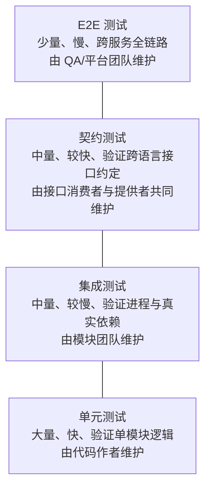
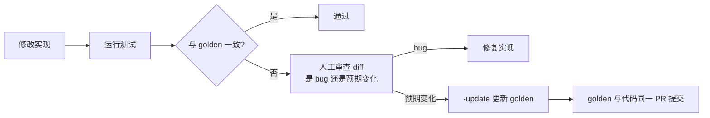
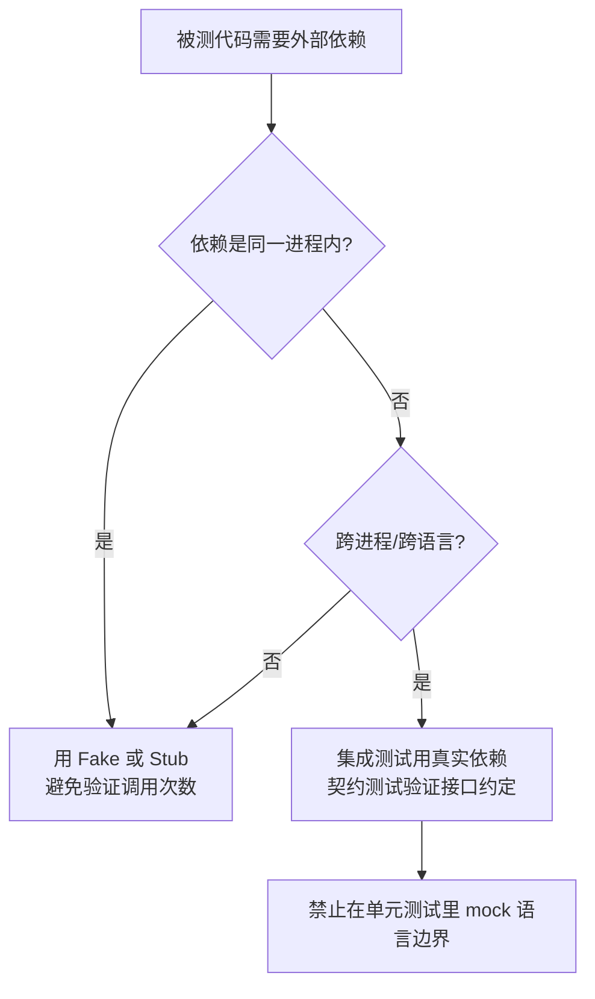
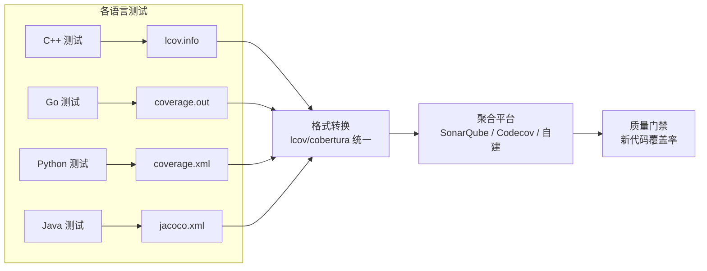
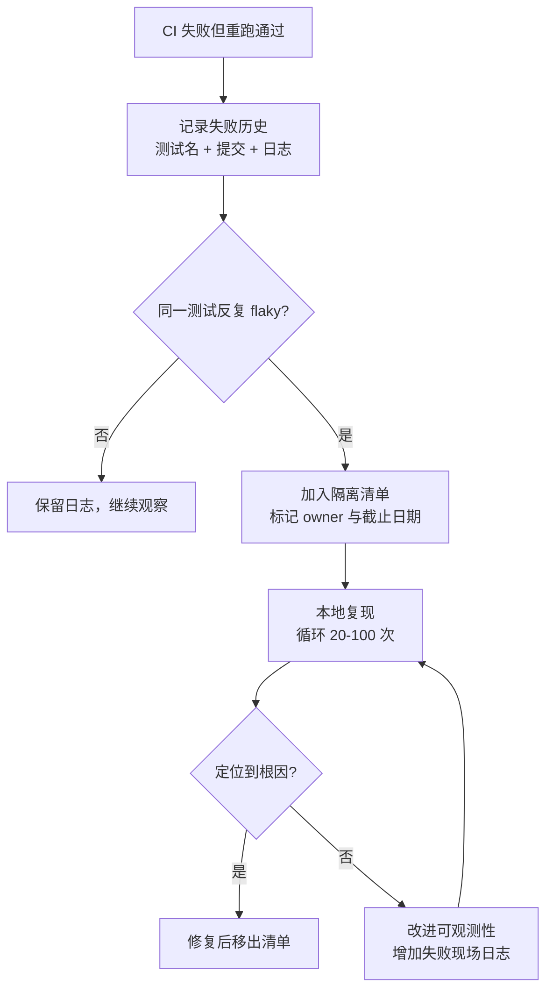

# 跨语言测试策略

> 单语言项目的测试策略可以靠框架默认值解决；多语言项目不行。当一次请求穿过 Go 网关、Java 服务、Python 模型和 C++ 引擎时，「每个语言自己的测试都绿了」距离「系统是好的」还有很长的路。测试策略要回答的核心问题是：每一层测什么、谁来写、用什么工具、花多少时间，以及跨语言边界用什么手段兜底。

本章先建立分层的成本模型，再给出各语言工具对照、测试数据管理、覆盖率聚合、flaky 治理与所有权划分。契约测试与集成/E2E 编排在后续两章展开。

---

## 一、测试金字塔在多语言项目中的含义

### 1.1 经典金字塔与多语言现实



多语言项目在经典三层之外多出一层**契约层**，原因是：单元测试无法发现「Go 服务发的 JSON 与 Python 服务的期望字段不一致」，而 E2E 又太慢、太脆，无法在每次提交中覆盖所有接口组合。契约测试填补的正是这个空档。

### 1.2 各层的成本与边界

| 层级 | 数量级 | 单次耗时 | 覆盖范围 | 失败定位 | 主要风险 |
|------|--------|---------|---------|---------|---------|
| 单元 | 数百到数千 | 毫秒 | 函数/类 | 精确到行 | 与真实行为脱节 |
| 集成 | 数十到数百 | 秒到分钟 | 模块 + 真实中间件 | 到模块 | 环境依赖、慢 |
| 契约 | 数十 | 秒 | 跨语言接口 | 到接口字段 | 契约过细变成负担 |
| E2E | 数个到数十 | 分钟 | 全链路 | 到服务，需人工定位 | flaky、维护成本高 |

---

## 二、各语言测试框架对照

| 语言 | 主流框架 | 断言风格 | 测试替身 | 覆盖率工具 | 不适用场景 |
|------|---------|---------|---------|-----------|-----------|
| C/C++ | GoogleTest | `EXPECT_EQ`/`ASSERT_*` | gMock | gcov + gcovr/lcov | 需要极简依赖的嵌入式项目（改用 doctest） |
| C/C++ | Catch2 | `REQUIRE(expr)` 自然语法 | 手写 fake | gcov | 需要成熟 mock 框架的大型工程 |
| C/C++ | doctest | 头文件单头库 | 手写 fake | gcov | 需要复杂参数化与 mock 的项目 |
| Java | JUnit 5 | `assertEquals` | Mockito | JaCoCo | 需要 BDD 语义（可叠加 Cucumber） |
| Java | TestNG | `assert` + 注解配置 | Mockito | JaCoCo | 新项目（生态重心已转向 JUnit 5） |
| Python | pytest | 原生 `assert` | unittest.mock/pytest-mock | coverage.py | 需要严格 xUnit 结构的老团队（unittest） |
| Go | testing（标准库） | `t.Errorf` | 接口 + 手写 fake | go cover | 需要复杂断言链（可加 testify，但非必须） |
| Rust | cargo test（内置） | `assert_eq!` | mockall | cargo-llvm-cov | 需要运行时 mock（Rust 倾向编译期替换） |
| Dart | package:test | `expect` | mockito | coverage 包 | 纯 Flutter Widget 测试（用 flutter_test） |
| JS/TS | Vitest | `expect` | vi.mock | c8/v8 coverage | 依赖 CommonJS 且配置复杂的老项目（Jest） |

**选型原则**：优先使用语言生态的默认选择，减少团队认知负担。跨语言项目里真正的统一发生在**报告格式**（见第六节）与**命令入口**（`make test`），而不是统一框架。

### 2.1 同一逻辑的多语言测试示例

```go
// Go：表驱动 + 子测试，失败时能定位到具体用例
func TestParseDuration(t *testing.T) {
	cases := []struct {
		name    string
		input   string
		want    int
		wantErr bool
	}{
		{"小时", "1h", 3600, false},
		{"分钟", "30m", 1800, false},
		{"非法输入", "12x", 0, true},
	}
	for _, tc := range cases {
		t.Run(tc.name, func(t *testing.T) {
			got, err := ParseDuration(tc.input)
			if (err != nil) != tc.wantErr {
				t.Fatalf("错误期望=%v 实际=%v", tc.wantErr, err)
			}
			if got != tc.want {
				t.Errorf("ParseDuration(%q)=%d, 期望 %d", tc.input, got, tc.want)
			}
		})
	}
}
```

```python
# Python：pytest 参数化，失败信息自带输入值
import pytest
from app.duration import parse_duration

@pytest.mark.parametrize(
    "raw,expected",
    [("1h", 3600), ("30m", 1800)],
)
def test_parse_duration(raw: str, expected: int) -> None:
    assert parse_duration(raw) == expected

def test_parse_duration_invalid() -> None:
    with pytest.raises(ValueError):
        parse_duration("12x")
```

两个示例的结构、命名、断言信息都不同，但都遵循同一条原则：**测试失败时不需要重新跑一遍就能定位原因**。

---

## 三、测试命名与组织约定

### 3.1 文件组织

| 语言 | 单元测试位置 | 命名 | 集成/E2E 位置 |
|------|-------------|------|--------------|
| Go | 与被测文件同目录 | `xxx_test.go` | `test/integration/`（build tag 隔离） |
| Python | `tests/` 目录镜像源码结构 | `test_xxx.py` | `tests/integration/` |
| Java | `src/test/java` 同包名 | `XxxTest.java` | `src/integrationTest/java` |
| Rust | 同文件 `#[cfg(test)]` 或 `tests/` | `xxx.rs` | `tests/` 顶层目录 |
| TS | 同目录或 `__tests__/` | `xxx.test.ts` | `e2e/` |

约定要点：

1. **单元测试与被测代码同仓同目录**（Go/Rust/TS），修改代码时测试触手可及；
2. **集成测试用独立目录与独立命令**，不与单元测试混跑，便于在 CI 里分阶段执行；
3. **测试文件命名可被工具发现**：不要用 `xxx_spec.ts` 混在 `*.test.ts` 的规则里；禁止 `utils_test.go` 这种杂物文件，测试工具函数放 `internal/testutil`。

### 3.2 测试命名

推荐 `Test<被测单元>_<场景>_<期望>`，中文或英文统一即可，关键是场景与期望可读：

```text
TestParseDuration_WhenInputInvalid_ReturnsError
test_parse_duration_invalid_raises
parseDuration > 非法输入 > 抛出异常
```

反例：`Test1`、`testItWorks`、`TestParseDuration`（没说明场景）。CI 失败通知里只显示测试名，命名质量直接决定定位速度。

---

## 四、共享测试数据与 fixture 管理

### 4.1 三种 fixture 形态

| 形态 | 说明 | 适用 | 不适用 |
|------|------|------|--------|
| 代码内构造 | 在测试里直接构造对象 | 小对象、逻辑测试 | 大 JSON、二进制、真实文件 |
| 外部数据文件 | `testdata/`、`fixtures/` 目录 | 输入输出样本、golden 文件 | 需要动态生成的场景 |
| 工厂/fixture 框架 | pytest fixtures、JUnit Extension、Testcontainers | 需要生命周期管理的资源 | 一次性简单数据 |

```text
# Go 约定：testdata 目录被 go 工具链忽略，不会参与构建
service/
  parser.go
  parser_test.go
  testdata/
    valid_001.json
    invalid_unicode.json
```

### 4.2 Golden 文件与更新流程

Golden 测试把「期望输出」存为文件，实际输出与之比对。它适合解析器、序列化、代码生成这类输出复杂的场景，但必须有明确的更新机制，否则会退化成「把当前输出存下来就算通过」。

```go
// Go：-update 标志显式更新 golden 文件，禁止测试自动改写
var update = flag.Bool("update", false, "更新 testdata 中的 golden 文件")

func TestRenderReport(t *testing.T) {
	got := RenderReport(inputFixture)
	golden := filepath.Join("testdata", "report.golden.json")
	if *update {
		if err := os.WriteFile(golden, got, 0o644); err != nil {
			t.Fatal(err)
		}
		return
	}
	want, _ := os.ReadFile(golden)
	if !bytes.Equal(got, want) {
		t.Errorf("输出与 golden 不一致，确认无误后运行 go test -update")
	}
}
```



**跨语言 fixture 的共享**：当 Go 生成、Python 消费同一份数据时，把 fixture 放在仓库共享目录（如 `testdata/shared/`），并给 fixture 加 `schema_version` 字段。消费方在测试中校验版本，避免一端升级格式另一端静默失败。

---

## 五、测试替身与跨语言边界

### 5.1 五种替身

| 类型 | 行为 | 用途 | 风险 |
|------|------|------|------|
| Dummy | 占位，不被使用 | 填充参数 | 无 |
| Stub | 返回固定值 | 控制输入 | 与真实行为脱节 |
| Spy | 记录调用 | 验证交互 | 过度断言实现细节 |
| Mock | 预设期望与验证 | 验证协作关系 | 重构即碎 |
| Fake | 轻量真实实现 | 内存数据库、本地队列 | 自身需要测试 |

### 5.2 跨语言边界的处理原则



关键原则：

1. **不要 mock 自己团队的跨语言接口**：Go 侧 mock 一个 Java 服务的 JSON 响应，等于把「我以为的接口」写进测试，接口变了测试照样绿。这类边界应该由契约测试覆盖；
2. **外部第三方服务才 mock**：支付网关、短信平台等不可控依赖用 WireMock/录制回放（见 [[多语言工程化/4测试与质量/03_集成测试与E2E编排|03 集成测试与 E2E 编排]]）；
3. **优先 Fake 而非 Mock**：内存版 Repository、本地版消息队列，既快又不会因重构而碎；
4. **FFI 边界必须用真实调用测**：C 与 Go/Rust 的内存布局、字符串编码、错误码传递，mock 没有任何意义，必须编译后真实调用。

---

## 六、覆盖率统计与多语言聚合

### 6.1 各语言覆盖率工具与格式

| 语言 | 工具 | 原生格式 | 通用格式 |
|------|------|---------|---------|
| C/C++ | gcov + gcovr | .gcda/.gcno | lcov、Cobertura |
| Java | JaCoCo | exec | XML（JaCoCo）、lcov |
| Python | coverage.py | SQLite | XML（Cobertura）、lcov |
| Go | go cover | coverprofile | 需转换（gocov 等） |
| Rust | cargo-llvm-cov | profdata | lcov |
| JS/TS | c8 / istanbul | JSON | lcov、Cobertura |

```bash
gcovr --lcov coverage.lcov --html-details build/coverage/ -r .       # C/C++
./gradlew test jacocoTestReport                                       # Java → jacocoTestReport.xml
pytest --cov=src --cov-report=xml:coverage.xml --cov-report=lcov:lcov.info   # Python
go test -coverprofile=coverage.out ./... && go tool cover -func=coverage.out  # Go
cargo llvm-cov --lcov --output-path lcov.info                         # Rust
```

### 6.2 聚合架构



| 聚合方案 | 优点 | 缺点 | 不适用场景 |
|---------|------|------|-----------|
| SonarQube | 多语言、质量门禁一体 | 需自建、资源占用高 | 小团队、只看覆盖率 |
| Codecov/Coveralls | 托管、配置简单 | 按私有仓库收费、数据出内网 | 强合规环境 |
| 自建脚本 + HTML | 无依赖、数据自控 | 无趋势与门禁 | 需要历史趋势的团队 |

**注意**：不同语言的「行覆盖率」定义不同（Python 按语句、Java 按字节码行、Go 按语句块），跨语言横向比较没有意义。门禁只应约束**单语言内部的变化趋势**，以及「新增代码的覆盖率」这类相对指标。

覆盖率的两条反模式：**追求百分比而写无断言测试**（覆盖了但没验证）、**把覆盖率当目标考核**（会催生大量低价值测试）。覆盖率只用来发现「完全没测到的区域」。

---

## 七、Flaky 测试的识别与治理

### 7.1 常见成因

| 成因 | 表现 | 对策 |
|------|------|------|
| 依赖真实时间 | 午夜/月末/闰年失败 | 注入 Clock 接口，测试用固定时间 |
| 依赖执行顺序 | 单独跑过、全量跑挂 | 测试间不共享状态，随机顺序运行 |
| 并发竞争 | 偶发超时、断言失败 | 测试内串行、加同步屏障，或显式控制并发 |
| 外部网络 | 调用公网 API 超时 | 服务虚拟化或本地容器替代 |
| 随机数据 | 特定输入才失败 | 固定随机种子，失败时打印种子 |
| 时间断言 | `sleep` 后断言 | 轮询等待条件，而非固定睡眠 |

### 7.2 识别与处置流程



```bash
# 本地复现 flaky：循环执行单个测试；随机化顺序暴露顺序依赖
go test -run TestFlaky -count=50 ./pkg/xxx
pytest tests/test_flaky.py --count=20          # 需 pytest-repeat
go test -shuffle=on ./...
```

治理政策：

1. **隔离而非删除**：flaky 测试进 `quarantine` 清单（文件形式，含 owner、issue 链接、截止日期），清单内的测试失败不阻塞合并，但每周统计存量；
2. **限制重试**：CI 最多自动重试一次，且重试通过必须上报「flaky 事件」，否则问题会被重试掩盖；
3. **禁止 `sleep` 式等待**：统一使用条件轮询（如 `Eventually`、`retry` 工具），超时时间显式声明；测试环境尽量与生产一致，减少配置差异导致的抖动。

---

## 八、测试执行时间预算

| 阶段 | 目标时长 | 触发时机 | 失败处理 |
|------|---------|---------|---------|
| 单个单元测试 | < 100ms | 每次保存 | 开发者本地修复 |
| 全量单元测试 | < 5 分钟 | 每次 push / PR | 阻塞合并 |
| 集成测试 | < 15 分钟 | PR 更新 | 阻塞合并 |
| E2E | < 30 分钟 | 合并到主干 / 发布前 | 阻塞发布 |
| 完整流水线 | < 45 分钟 | 合并 | 影响交付效率指标 |

加速手段：

- **并行与分片**：Go `-parallel`、pytest-xdist `-n auto`、Jest/Vitest `--shard`、JUnit 并行执行；
- **按变更选择测试**：CI 里根据 diff 路径只跑受影响模块（Bazel 的 `rdeps`、Nx affected、`go list -deps`）；
- **缓存测试依赖**：缓存容器镜像、包管理器目录、编译产物；
- **拆分慢测试**：把需要真实中间件的用例移到集成套件，单元套件保持无 IO。

---

## 九、测试的所有权

| 测试类型 | 编写者 | 维护者 | 评审者 |
|---------|--------|--------|--------|
| 单元测试 | 功能开发者 | 功能开发者 | 同模块 reviewer |
| 集成测试 | 功能开发者 | 模块团队 | 模块 owner |
| 契约测试（消费者侧） | 消费者团队 | 消费者团队 | 双方 |
| E2E | QA/平台团队 | QA/平台团队 | 各服务 owner |
| 测试基础设施 | 平台团队 | 平台团队 | 平台 owner |

三条制度性建议：

1. **测试是 PR 的一部分**：没有测试的功能 PR 不应合并；`CODEOWNERS` 中测试目录与源码目录归属同一 owner；
2. **跨语言边界的测试归属消费者**：谁调用接口，谁最清楚期望行为，消费者驱动契约（CDC）正是这个原则的体现；
3. **平台团队只提供能力，不替业务写测试**：测试框架、容器、报告平台由平台团队维护，业务测试由业务团队负责，避免平台成为瓶颈。

---

## 十、常见坑与反模式

| 坑/反模式 | 后果 | 正确做法 |
|-----------|------|---------|
| 用 mock 模拟跨语言接口 | 接口漂移检测不到 | 契约测试 + 真实集成测试 |
| 单元测试里连真实数据库 | 慢、环境依赖、CI 不稳定 | 单元用 Fake，集成才用真实依赖 |
| 测试间共享可变状态 | 顺序依赖、随机失败 | 每个测试独立 setup/teardown |
| `sleep` 等待异步结果 | flaky、浪费时间 | 条件轮询 + 超时 |
| 无断言测试凑覆盖率 | 覆盖率虚高，bug 照出 | 每个测试至少一个有效断言 |
| 把覆盖率当考核指标 | 测试数量膨胀、质量下降 | 只设「新增代码覆盖率」门槛 |
| E2E 覆盖所有路径 | 套件极慢、维护崩溃 | E2E 只保核心链路，其余下沉 |
| 跨语言测试数据各自维护 | 一端升级另一端挂 | 共享 fixture 目录 + schema 版本 |

---

## 本章小结

- 多语言测试金字塔在单元/集成/E2E 之间多了一层契约测试，专门覆盖跨语言接口约定；
- 各语言框架不必统一，但命令入口（`make test`）与报告格式（lcov/Cobertura）必须统一；
- 测试命名要写清「场景 + 期望」，失败通知里只有测试名；
- fixture 优先用文件 + 显式更新机制，跨语言共享的 fixture 要带版本字段；
- 跨语言边界禁止用 mock 假装，FFI 必须真实调用，服务接口用契约测试；
- 覆盖率跨语言不可比，只用于发现盲区与约束新增代码；
- flaky 测试要识别、隔离、修复，重试只能作为上报手段而非解决方案；
- 测试时间要设预算，用并行、分片、按变更选择测试来压缩；测试所有权跟随代码所有权，跨语言边界测试归消费者。

下一章深入跨语言接口的核心保障手段：[[多语言工程化/4测试与质量/02_契约测试|02 契约测试]]。

---

## 动手实践

### 任务 1：为两种语言建立统一测试入口

在一个包含两种语言的仓库中，让 `make test` 同时运行两种语言的单元测试，并输出统一的汇总结果（各自退出码正确传递）。

验收标准：

- 任一语言测试失败时 `make test` 返回非零；
- 能单独运行某一语言的测试（如 `make test-go`）；
- 记录两种语言各自的测试耗时，给出总时长与优化建议。

### 任务 2：实现一个 golden 文件测试

为任意一个「解析或生成结构化数据」的函数实现 golden 测试，包含显式更新机制。

验收标准：

- 正常运行测试通过；修改实现后测试失败并给出可读 diff；
- 用 `-update`（或等价机制）更新 golden 后测试通过，且更新命令有防误触设计；
- golden 文件与代码在同一提交中，说明为何选择 golden 而非内联断言。

### 任务 3：识别并修复一个 flaky 测试

构造一个依赖 `sleep` 或共享状态的 flaky 测试，循环运行至少 20 次复现失败，然后修复。

验收标准：

- 给出复现命令与失败日志（至少一次失败记录）；
- 修复后循环 50 次全部通过；
- 用 200 字说明根因、修复手段，以及如何在 CI 中防止同类问题（如禁用 sleep、随机顺序运行）。

- 返回目录：[[多语言工程化/多语言工程化目录|多语言工程化]]
