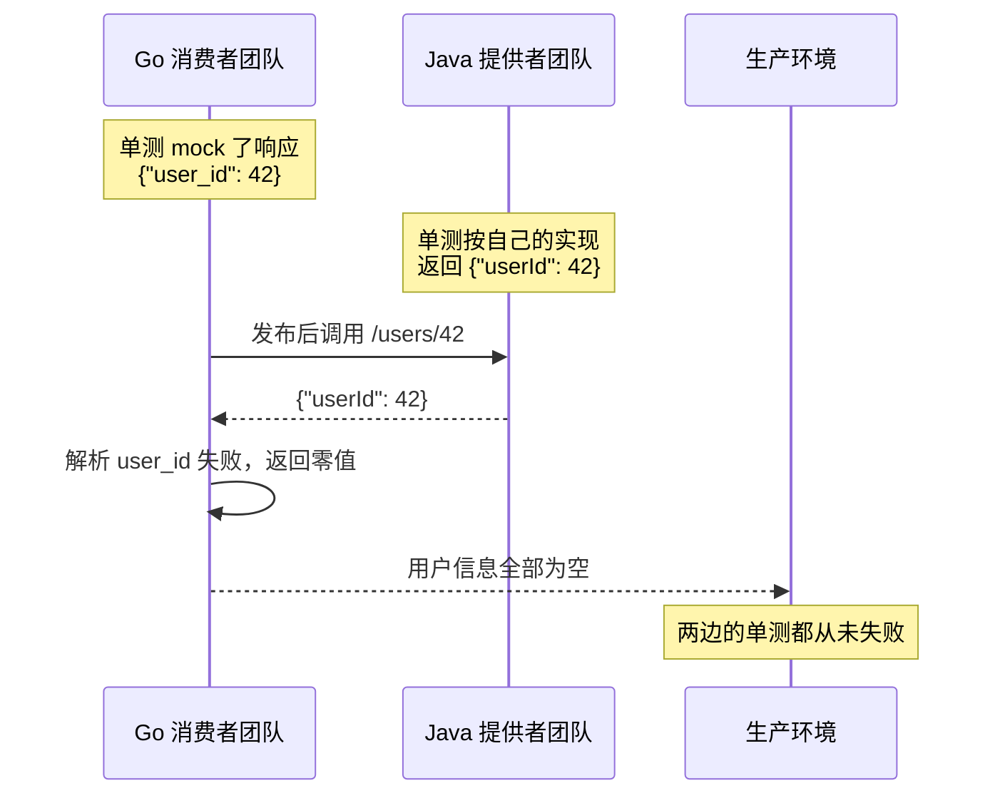
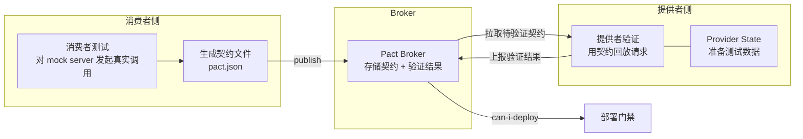
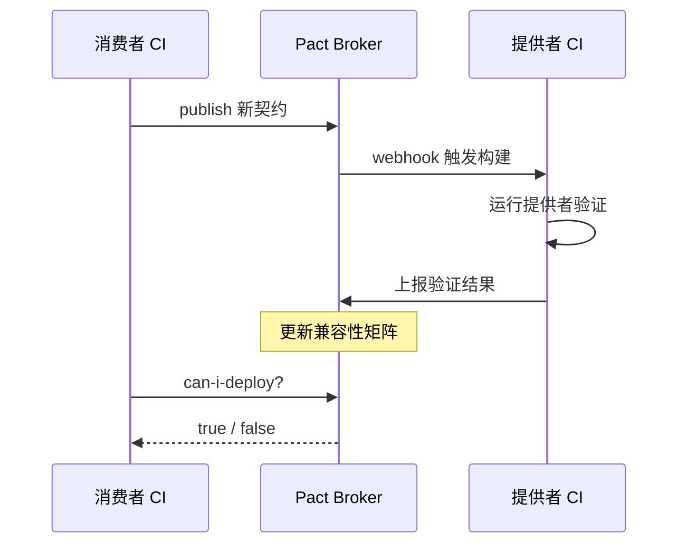

# 契约测试

> 跨团队接口的回归风险有一个残酷特点：出问题的地方，双方各自的测试通常都是绿的。消费者按「我以为的接口」写了 mock，提供者按「我实现的接口」写了单测，两套假设直到联调或生产才碰撞。契约测试把接口约定从口头与文档变成可执行、可验证、可版本化的产物。

本章讨论的是**跨进程、跨语言接口**的测试方法。如果系统只有一个服务、一个团队，契约测试价值有限；一旦存在「A 团队调用 B 团队接口」的关系，它就是投入产出比最高的测试层。

---

## 一、为什么单元测试与集成测试不够



问题不在于谁写错了，而在于**没有一个测试同时持有两边的约定**。集成测试可以覆盖，但需要同时启动两个服务，慢且脆；只能覆盖测试环境恰好被写到的调用组合；发现问题的时间点很晚；出错后也无法确定是提供者破坏了兼容性，还是消费者用错了接口。

---

## 二、消费者驱动契约（CDC）

**由消费者定义期望，提供者验证能否满足期望。** 传统接口文档由提供者单方面编写；CDC 反其道而行：谁使用接口，谁把使用方式写成可执行的期望。



| 角色 | 职责 | 产物 |
|------|------|------|
| 消费者测试 | 用契约 mock 替换真实提供者，跑通消费逻辑 | 契约文件（pact） |
| 提供者验证 | 按契约回放请求，返回真实响应 | 每个契约的验证结果 |
| Provider State | 让提供者进入契约要求的数据状态 | 状态处理代码 |
| 部署门禁 | `can-i-deploy` 判断某版本能否部署 | 布尔结果 |

**契约不是接口文档**：它只包含消费者**实际用到**的部分。消费者没用到的字段，契约里不出现，提供者可以自由改动。

---

## 三、Pact 工作流

### 3.1 消费者测试（生成契约）

```typescript
// tests/contract/user.pact.test.ts —— 消费者侧契约测试（Vitest + Pact）
import { PactV3, MatchersV3 } from "@pact-foundation/pact";
import { describe, expect, it } from "vitest";
import { fetchUser } from "../../src/userClient";

const { like, integer, string } = MatchersV3;

const provider = new PactV3({
  consumer: "web-app",
  provider: "user-service",
  dir: "./pacts",                 // 契约输出目录，CI 中发布到 Broker
});

describe("user-service 契约", () => {
  it("查询已存在用户返回 200 与用户信息", async () => {
    provider
      .given("用户 42 存在")        // Provider State：提供者需要准备的数据状态
      .uponReceiving("查询用户 42")
      .withRequest({ method: "GET", path: "/users/42" })
      .willRespondWith({
        status: 200,
        body: {
          id: integer(42),                 // 类型匹配：只约束类型，不约束具体值
          name: string("张三"),
          email: like("user@example.com"),
        },
      });

    await provider.executeTest(async (mockServer) => {
      const user = await fetchUser(mockServer.url, 42);
      expect(user.id).toBe(42);
      expect(user.email).toContain("@");
    });
  });
});
```

测试运行时 Pact 启动 mock server，消费者代码对它发起真实 HTTP 调用，测试结束后把交互序列化为契约文件。

```json
// pacts/web-app-user-service.json —— 生成的契约（节选）
{
  "consumer": { "name": "web-app" },
  "provider": { "name": "user-service" },
  "interactions": [
    {
      "description": "查询用户 42",
      "providerStates": [{ "name": "用户 42 存在" }],
      "request": { "method": "GET", "path": "/users/42" },
      "response": {
        "status": 200,
        "body": { "id": 42, "name": "张三", "email": "user@example.com" },
        "matchingRules": {
          "$.body.id": { "matchers": [{ "match": "integer" }] },
          "$.body.email": { "matchers": [{ "match": "type" }] }
        }
      }
    }
  ],
  "metadata": { "pactSpecification": { "version": "4.0" } }
}
```
**契约文件不要手改**，它是生成物，修改应回到消费者测试。

### 3.2 提供者验证（Java 示例）

```java
// UserProviderPactTest.java —— 提供者侧验证
@Provider("user-service")
@PactBroker(
    url = "https://pact-broker.internal",
    authentication = @PactBrokerAuth(token = "${PACT_BROKER_TOKEN}")
)
@SpringBootTest(webEnvironment = SpringBootTest.WebEnvironment.RANDOM_PORT)
class UserProviderPactTest {

    @LocalServerPort
    int port;

    @Autowired
    UserRepository userRepository;

    @TestTemplate
    @ExtendWith(PactVerificationInvocationContextProvider.class)
    void verifyPact(PactVerificationContext context) {
        context.setTarget(new HttpTestTarget("localhost", port));
        context.verifyInteraction();       // 按契约发起真实请求并校验响应
    }

    @State("用户 42 存在")                  // 对应消费者声明的 Provider State
    void user42Exists() {
        userRepository.save(new User(42L, "张三", "user@example.com"));
    }
}
```

Python 提供者用 `pact-python`，Go 提供者用 `pact-go`，验证模型相同。**验证必须打真实服务**，只调用内部函数会漏掉序列化、路由、中间件等真正容易出错的部分。

### 3.3 发布与验证结果上报

```bash
# 消费者 CI：测试通过后发布契约，版本用 git sha 保证可追溯
npx pact-broker publish ./pacts \
  --consumer-app-version "$GIT_SHA" --branch "$GIT_BRANCH" \
  --broker-base-url "$PACT_BROKER_BASE_URL" \
  --broker-token "$PACT_BROKER_TOKEN"

# 提供者 CI：pact-jvm 会自动上报验证结果；也可用 CLI 上报
pact-broker publish-verification-results \
  --provider-app-version "$GIT_SHA" \
  --broker-base-url "$PACT_BROKER_BASE_URL"
```

---

## 四、契约测试与集成/E2E 的边界

| 维度 | 契约测试 | 集成测试 | E2E 测试 |
|------|---------|---------|----------|
| 验证对象 | 接口约定（请求/响应结构） | 服务与真实中间件的连接 | 完整业务链路 |
| 是否需要对方启动 | 否 | 需要依赖组件 | 需要全部服务 |
| 速度 | 秒级 | 分钟级 | 十分钟级 |
| 覆盖范围 | 单接口 × 多场景 | 单服务 × 真实依赖 | 跨服务核心路径 |
| 发现问题 | 字段、状态码、兼容性 | 配置、连接、事务 | 业务逻辑串联 |
| 不适用场景 | 单团队内部接口、一次性原型 | 需要验证业务串联 | 需要回归全部功能 |

**组合原则**：契约测试保证「接口不会悄悄变」，集成测试保证「服务能连上依赖」，E2E 只验证核心链路。三者不可互相替代。

---

## 五、gRPC/Protobuf 的兼容性测试

```yaml
# buf.yaml —— 定义破坏性变更检查规则集
version: v2
modules:
  - path: proto
breaking:
  use:
    - FILE        # 以文件为单位检查；可选 WIRE（仅线上兼容）、PACKAGE 等
lint:
  use:
    - STANDARD
```

```bash
# 与主干对比，检测破坏性变更；有破坏时返回非零退出码
buf breaking proto --against '.git#branch=main,subdir=proto'
```

| 变更 | 二进制兼容 | JSON 兼容 | 结论 |
|------|-----------|----------|------|
| 新增字段（新字段号） | 兼容 | 兼容 | 安全 |
| 删除字段 | 兼容 | 不兼容 | 必须 `reserved` 字段号与名字 |
| 复用已删除的字段号 | 不兼容 | 不兼容 | 严重错误，数据会串 |
| 字段号不变，改名字 | 兼容 | 不兼容 | JSON 消费方会挂 |
| `int32` 改 `int64` | 线上兼容 | 兼容 | 语义风险（溢出），需评估 |
| 新增 enum 值 | 兼容 | 兼容 | 客户端需能处理未知值 |
| 删除或重命名 service/method | 不兼容 | 不兼容 | 需要版本化新接口 |

```protobuf
// 正确的删除方式：字段号与名字都 reserved，防止后人复用
message User {
  reserved 3, 7;
  reserved "legacy_name", "old_email";

  int64 id = 1;
  string name = 2;
}
```

gRPC 的兼容性还应包含**接口级测试**：用 `grpcurl` 或 `buf curl` 对提供者发起真实调用，验证 proto 与实现一致。仅检查 proto 兼容性不保证实现没跑偏。

---

## 六、JSON API 与消息的 schema 兼容性

| 工具 | 输入 | 能力 | 不适用场景 |
|------|------|------|-----------|
| oasdiff | 两份 OpenAPI | 破坏性变更分类、CI 集成 | 非 OpenAPI 描述的接口 |
| JSON Schema Validator | schema + 响应 | 运行时校验响应结构 | 无法检测跨版本兼容性 |
| Confluent Schema Registry | Avro/Protobuf/JSON Schema | Kafka 消息兼容性策略（BACKWARD/FORWARD/FULL） | 非 Kafka 场景 |

```bash
# OpenAPI 破坏性变更检查：新版本 spec 与主干对比，发现错误即失败
oasdiff breaking openapi/main.yaml openapi/current.yaml --fail-on ERR
```

**Kafka/消息队列的兼容性常被忽略**：生产者升级 schema 后，尚未升级的消费者会解析失败。事件驱动系统必须把 schema 兼容性检查放进 CI，与 proto 检查同等对待。

---

## 七、契约版本化与 Broker

契约版本使用**应用版本**（通常取 git sha 或语义化版本），而不是契约文件自身的版本。Broker 记录的是一张矩阵：**哪个消费者版本 × 哪个提供者版本 = 是否验证通过**。部署时查询这张矩阵即可回答「现在部署这个版本安全吗」。

```bash
# 部署前检查：user-service 的当前版本能否部署到 production
pact-broker can-i-deploy \
  --pacticipant user-service --version "$GIT_SHA" \
  --to-environment production \
  --broker-base-url "$PACT_BROKER_BASE_URL" \
  --broker-token "$PACT_BROKER_TOKEN"
```

`can-i-deploy` 是契约测试真正的落地价值：它把接口兼容性变成流水线里一个可自动判断的布尔值。没有它，契约测试只是多跑了一些测试。



---

## 八、CI 集成

```yaml
# .github/workflows/contract.yml —— 消费者与提供者契约流水线
name: contract-tests
on: [push, pull_request]

jobs:
  consumer-contract:
    runs-on: ubuntu-latest
    steps:
      - uses: actions/checkout@v4
      - uses: pnpm/action-setup@v4
      - run: pnpm install --frozen-lockfile
      - run: pnpm vitest run tests/contract     # 生成契约并自测
      - name: 发布契约到 Broker
        if: github.ref == 'refs/heads/main'
        run: |
          npx pact-broker publish ./pacts \
            --consumer-app-version "$GITHUB_SHA" --branch main \
            --broker-base-url "$PACT_BROKER_BASE_URL" \
            --broker-token "$PACT_BROKER_TOKEN"

  provider-verify:
    runs-on: ubuntu-latest
    needs: consumer-contract
    steps:
      - uses: actions/checkout@v4
      - uses: actions/setup-java@v4
        with: { distribution: temurin, java-version: "21" }
      - run: ./gradlew pactVerify -Ppact.broker.token="$PACT_BROKER_TOKEN"
      - name: 部署门禁
        if: github.ref == 'refs/heads/main'
        run: |
          pact-broker can-i-deploy \
            --pacticipant user-service --version "$GITHUB_SHA" \
            --to-environment production \
            --broker-base-url "$PACT_BROKER_BASE_URL"
```

CI 设计要点：**消费者契约测试在所有分支运行**，契约发布只在主干或 tag 触发；**提供者验证由契约变更 Webhook 触发**，而不是等发版才发现不兼容；**`can-i-deploy` 放在部署任务之前**，失败即阻断；**Broker 不可用时降级为警告并告警**，避免基础设施抖动阻塞交付。

---

## 九、没有 Broker 的轻量替代方案

契约文件本身是 JSON，可以像代码一样进 git：

```text
contracts/
  web-app--user-service.json      # 契约文件，由消费者生成后提交
  README.md                       # 说明生成命令与更新流程
```

流程调整：消费者 CI 生成契约并与 git 版本对比，有差异时在 PR 中展示 diff，要求提供者团队 reviewer 批准（CODEOWNERS）；提供者 CI 从仓库路径读取契约并验证；部署门禁改为「提供者验证任务通过才允许部署」。

| 维度 | Pact Broker | 契约文件入 git |
|------|-------------|---------------|
| 版本矩阵 | 完整 | 无（只有当前主干） |
| can-i-deploy | 支持 | 需自建判断逻辑 |
| Webhook 触发 | 支持 | 用 CI 路径过滤替代 |
| 多消费者管理 | 强 | 文件多了以后难管理 |
| 基础设施 | 需部署与维护 | 无 |
| 不适用场景 | 无运维人力的团队 | 消费者众多、需要版本矩阵的团队 |

**选择标准**：消费者少于 5、发布节奏同步的团队，git 方案足够；消费者多、独立发布、需要「某版本能否部署」判断时，Broker 的投入才值得。

---

## 十、常见反模式

| 反模式 | 后果 | 正确做法 |
|--------|------|---------|
| 用契约测试代替单元测试 | 契约只覆盖接口，内部逻辑无保障 | 各层各司其职 |
| 契约写得过细 | 提供者任何改动都要同步 | 只声明消费者真正使用的字段 |
| 用具体值而非类型匹配 | 数据一变契约就失效 | 使用 `like`/`integer` 等匹配器 |
| 手改契约文件 | 与消费者测试脱节 | 回到消费者测试修改后重新生成 |
| 提供者验证不启动真实服务 | 漏掉序列化、路由问题 | 用真实 HTTP/gRPC 端点验证 |
| 验证结果不上报 | 无法判断兼容性矩阵 | CI 中强制上报，失败即告警 |
| Broker 无鉴权 | 契约与内部接口信息泄漏 | 内网部署 + Token 认证 + TLS |

---

## 本章小结

- 契约测试填补「双方各自测试都绿、接口却对不上」的空档，成本远低于集成测试与 E2E；
- CDC 的核心是消费者定义期望、提供者验证，契约只覆盖消费者实际使用的部分；
- Pact 工作流为：消费者测试生成契约 → 发布到 Broker → 提供者验证 → `can-i-deploy` 门禁；
- 契约测试、集成测试、E2E 各有边界，不可互相替代；
- gRPC 用 buf breaking 检查 proto 兼容性，字段号与 reserved 是不可违背的纪律；
- JSON API 用 oasdiff 检查 OpenAPI 变更，消息队列要配置 schema 兼容性策略；
- 契约版本用应用版本标识，Broker 的版本矩阵是部署门禁的数据来源；消费者少、发布同步的团队可用「契约文件入 git」替代 Broker；
- 契约不要写细、不要手改、不要代替单元测试。

下一章进入比契约更完整的验证层：[[多语言工程化/4测试与质量/03_集成测试与E2E编排|03 集成测试与 E2E 编排]]。

---

## 动手实践

### 任务 1：跑通一次完整的 Pact 流程

用 Docker 启动 Pact Broker（`pactfoundation/pact-broker` 镜像），实现一个消费者测试生成契约，并让一个提供者（任意语言）完成验证。

验收标准：

- Broker 中能看到契约与至少一次验证结果；
- 消费者测试失败场景（如字段类型不匹配）能被提供者验证捕获，给出失败日志；
- 提交消费者测试代码、提供者验证代码与运行命令。

### 任务 2：Protobuf 破坏性变更检测

创建一个含若干字段的 proto 文件，用 `buf` 检测一次破坏性变更与一次兼容性变更。

验收标准：

- 构造「删除字段并复用字段号」的变更，`buf breaking` 必须报错，记录输出；
- 构造「新增字段」的变更，`buf breaking` 通过；
- 给出 `buf.yaml` 配置与 CI 集成命令，说明 `FILE` 与 `WIRE` 规则集的区别。

### 任务 3：为 JSON 接口做 schema 兼容性检查

准备两份 OpenAPI 描述（模拟接口演进），用 oasdiff 或同类工具找出破坏性变更。

验收标准：

- 至少找出一处破坏性变更与一处非破坏性变更，并说明判定理由；
- 给出可在 CI 中执行的命令，破坏性变更时返回非零退出码。

- 返回目录：[[多语言工程化/多语言工程化目录|多语言工程化]]
