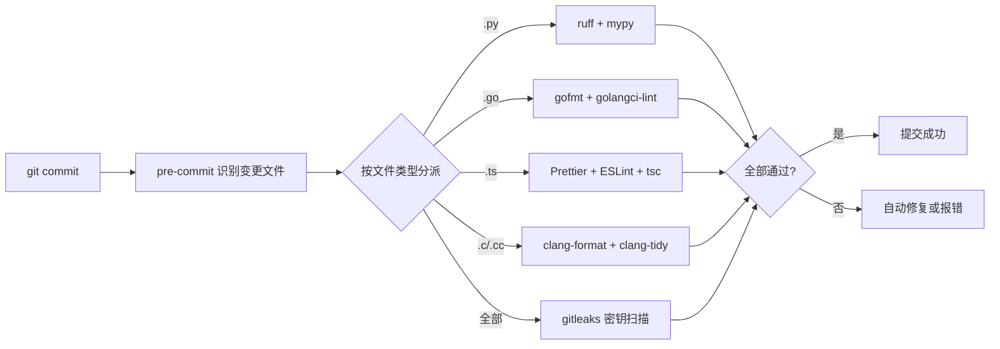
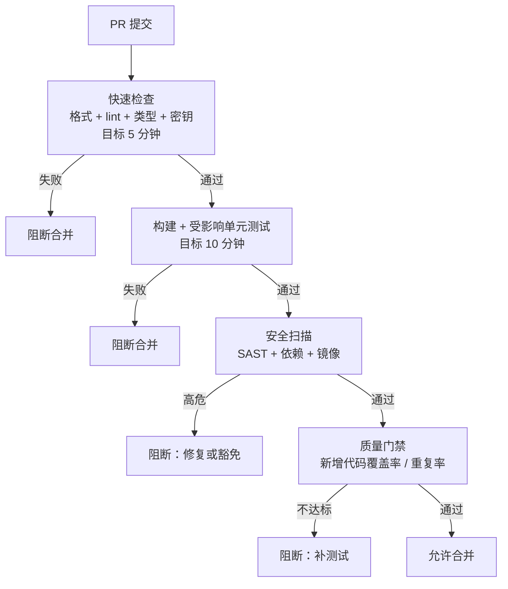

# 静态分析与质量门禁

> 测试回答「程序行为对不对」，静态分析回答「代码本身有没有问题」。前者要跑起来才知道结果，后者在代码运行前就能发现类型错误、危险调用、泄漏的密钥。质量门禁则把这些检查变成不可绕过的规则：不是「建议通过 lint」，而是「不通过就不能合并」。

多语言项目的质量门禁有一个额外难题：工具数量等于语言数量乘以检查类型数量。没有统一入口与统一策略，结果就是每个团队各配一套、CI 里堆满可选检查、没人说得清哪些真正阻断合并。本章把这套体系收敛成一张清晰的表。

---

## 一、静态分析的价值与层次


| 发现阶段 | 修复成本 | 典型问题 |
|---------|---------|---------|
| 编辑器 | 秒级 | 格式、导入顺序 |
| pre-commit | 分钟级 | 语法错误、明显缺陷、密钥 |
| CI 快速检查 | 分钟级 | 类型错误、lint 规则、未使用代码 |
| CI 深度检查 | 十分钟级 | 安全漏洞、依赖风险、复杂度 |
| 代码评审 | 小时级 | 设计问题（静态工具覆盖不到） |
| 运行期 | 天级 | 空指针、资源泄漏、并发问题 |

| 检查类型 | 回答的问题 | 代表工具 | 失败级别 |
|---------|-----------|---------|---------|
| 格式化 | 代码风格是否统一 | clang-format、gofmt、Prettier | 必须 |
| Lint | 有没有可疑写法 | clang-tidy、golangci-lint、ESLint | 必须（错误）/警告 |
| 类型检查 | 类型是否自洽 | mypy、tsc、dart analyze | 必须 |
| 复杂度/坏味道 | 是否难以维护 | SonarQube、PMD、SpotBugs | 增量门禁 |
| SAST | 有没有安全缺陷 | Semgrep、CodeQL | 高危必须 |
| 依赖扫描 | 依赖有没有已知漏洞 | Trivy、Grype | 高危必须（可豁免） |

**原则**：能用工具自动发现的，绝不留给人工评审；能在本地拦截的，绝不留给 CI。CI 是兜底，不是第一道防线。

---

## 二、各语言格式化与 Lint 对照

| 语言 | 格式化 | Lint | 类型检查 | 不适用场景 |
|------|--------|------|---------|-----------|
| C/C++ | clang-format | clang-tidy、cppcheck | 编译器 `-Wall -Wextra` | 无编译数据库时 clang-tidy 效果差 |
| Java | google-java-format / Spotless | SpotBugs、ErrorProne、Checkstyle | javac | 遗留代码全量开启会淹没 |
| Python | ruff format | ruff check | mypy / pyright | 无类型标注的遗留项目直接 strict 会爆炸 |
| Go | gofmt / goimports | golangci-lint、go vet | 编译器 | 无（工具链自带，成本极低） |
| Rust | rustfmt | clippy | 编译器 | 极老工具链（升级即可） |
| Dart | dart format | dart analyze | 分析器内建 | 无 |
| JS/TS | Prettier | ESLint（typescript-eslint） | tsc | 纯 JS 老项目直接 strict 会失败 |
| Shell | shfmt | shellcheck | 无 | 极短一次性脚本 |

```toml
# pyproject.toml —— ruff 同时承担格式化与 lint，配置集中一处
[tool.ruff]
line-length = 100
target-version = "py312"
exclude = ["build", "dist", "**/generated/**"]   # 生成代码不检查

[tool.ruff.lint]
select = ["E", "F", "I", "N", "UP", "B", "S", "ASYNC"]
ignore = ["S101"]                                # 允许 assert（测试中常用）
```

```yaml
# .golangci.yml —— Go 的 lint 聚合配置
linters:
  enable: [govet, errcheck, staticcheck, gosec, revive, unused]
issues:
  exclude-dirs: [generated]
```

**统一原则**：每个语言只保留一个格式化工具与一个 lint 入口，禁止格式化工具互相打架（如同时用 black 与 ruff format）；工具版本必须固定，见第四节。

---

## 三、类型检查在动态语言中的位置

Python、JavaScript 的错误有相当比例是「拼错字段名、传错类型、忘记处理 None」。这些错误单元测试未必覆盖，类型检查可以在不运行代码的情况下发现。

| 工具 | 语言 | 优点 | 缺点 | 不适用场景 |
|------|------|------|------|-----------|
| mypy | Python | 生态最广、插件多、strict 成熟 | 增量检查慢，对元编程支持有限 | 大量动态反射的代码 |
| pyright | Python | 快、类型推断强、编辑器友好 | 部分 mypy 插件生态不兼容 | 依赖 mypy 插件的项目 |
| tsc | TypeScript | 编译器即检查器，strict 逐项可控 | 大型项目全量检查慢 | 跨项目引用配置复杂 |
| dart analyze | Dart | 内建、无需配置 | 规则相对固定 | 无 |

```toml
# mypy 渐进式配置：全局宽松，核心模块严格
[mypy]
python_version = "3.12"
warn_unused_ignores = true

[mypy-app.core.*]        # 核心业务模块：完全严格
strict = true

[mypy-app.legacy.*]      # 遗留模块：暂时宽松，逐步迁移
ignore_errors = true
```

```json
// tsconfig.json —— TypeScript 建议开启的严格选项
{
  "compilerOptions": {
    "strict": true,
    "noUncheckedIndexedAccess": true,   // arr[i] 类型含 undefined
    "exactOptionalPropertyTypes": true, // 区分「缺失」与「值为 undefined」
    "noImplicitOverride": true
  }
}
```

**落地节奏**：先给新代码开 strict（通过 `include` 或按目录配置），再逐模块迁移旧代码。禁止用 `# type: ignore` 批量压错误——那等于关掉检查。

---

## 四、pre-commit：统一多语言本地检查

多语言项目里，开发者只熟悉自己语言的工具。统一钩子的价值是：**提交时自动只跑受影响语言的检查**，开发者不需要记住七八条命令。



```yaml
# .pre-commit-config.yaml —— 一个文件覆盖多语言，rev 固定版本保证一致性
repos:
  - repo: https://github.com/astral-sh/ruff-pre-commit
    rev: v0.8.4
    hooks:
      - id: ruff
        args: [--fix]
      - id: ruff-format

  - repo: https://github.com/pre-commit/mirrors-clang-format
    rev: v19.1.6
    hooks:
      - id: clang-format
        types_or: [c, c++]

  - repo: https://github.com/golangci/golangci-lint
    rev: v1.62.2
    hooks:
      - id: golangci-lint
        args: [--timeout=3m]

  - repo: https://github.com/gitleaks/gitleaks
    rev: v8.21.2
    hooks:
      - id: gitleaks

  # 本地钩子：使用项目内固定版本的 Prettier/tsc，避免全局版本漂移
  - repo: local
    hooks:
      - id: prettier
        name: prettier
        entry: pnpm exec prettier --write
        language: system
        files: \.(ts|tsx|json|md|css)$
      - id: tsc
        name: tsc 类型检查
        entry: pnpm exec tsc --noEmit
        language: system
        pass_filenames: false        # 类型检查是全量，不按文件传参
```

| 方案 | 安装 | 多语言支持 | 只检查变更文件 | 不适用场景 |
|------|------|-----------|--------------|-----------|
| pre-commit | Python 环境 | 通过 hook 覆盖任意语言 | 是 | 团队完全不用 Python 且不想装 |
| husky + lint-staged | Node 环境 | 主要面向 JS 生态 | 是 | 非 Node 主导的仓库 |
| 手写 git hooks | 无 | 任意 | 需自己实现 | 需要跨平台与版本管理 |

**性能注意**：`tsc`/`mypy` 这类全量检查无法增量，提交时可能等十几秒。折中方案是提交时只跑格式化与快速 lint，全量类型检查放 pre-push 或 CI。

---

## 五、CI 质量门禁设计

门禁设计的第一原则是**少而硬**：必须通过项太多，团队会找绕过手段；没有必须通过项，门禁形同虚设。

| 检查项 | 级别 | 检查范围 | 失败处理 |
|--------|------|---------|---------|
| 格式化 | 必须 | 变更文件 | 自动修复后重新提交 |
| Lint 错误 | 必须 | 变更文件 | 修复 |
| 类型检查 | 必须 | 全量（难增量） | 修复 |
| 单元测试 | 必须 | 受影响模块 | 修复 |
| 新增代码覆盖率 | 必须 | 变更行 | 补测试或说明 |
| SAST 高危 | 必须 | 变更代码 | 修复或走豁免 |
| 依赖高危漏洞 | 必须 | 全量依赖 | 升级或豁免 |
| 密钥扫描 | 必须 | 全量（含历史） | 立即轮换密钥 |
| Lint 警告 | 警告 | 变更文件 | 不阻断，计入趋势 |



**推荐组合**：类型检查与依赖扫描全量跑（结果稳定、可缓存），lint 与复杂度只查变更，覆盖率只考核新增代码。历史问题用基线冻结，不要求一次性清零。

```yaml
# .github/workflows/quality.yml —— 多语言质量门禁
name: quality
on: [pull_request]

jobs:
  fast-checks:
    runs-on: ubuntu-latest
    timeout-minutes: 10
    steps:
      - uses: actions/checkout@v4
      - uses: pre-commit/action@v3.0.1     # 复用本地钩子，保证与开发者一致
        env:
          SKIP: tsc                        # 全量类型检查放到单独 job

  typecheck:
    runs-on: ubuntu-latest
    timeout-minutes: 15
    steps:
      - uses: actions/checkout@v4
      - run: pip install -r requirements-dev.txt && mypy app/   # Python 全量类型检查
      - run: pnpm install --frozen-lockfile && pnpm exec tsc --noEmit

  security:
    runs-on: ubuntu-latest
    timeout-minutes: 15
    steps:
      - uses: actions/checkout@v4
        with: { fetch-depth: 0 }             # 密钥扫描需要完整历史
      - run: semgrep --config=p/ci --config=./semgrep-rules --error .
      - run: trivy fs --scanners vuln,misconfig --severity HIGH,CRITICAL --exit-code 1 .
      - run: gitleaks detect --source . --redact -v
```

CI 设计要点：**复用本地钩子**，CI 与开发者本地完全一致；**任务并行**，总时长取最慢者；**固定工具版本**（pre-commit rev、requirements-dev、package.json），禁止 `latest`；**失败信息可操作**，日志给出修复命令而非只报错。

---

## 六、SonarQube：多语言质量平台

SonarQube 把多语言的 lint、覆盖率、重复率、复杂度聚合到一个平台，并支持「只对新增代码设门禁」——这是处理存量技术债的关键能力。

```properties
# sonar-project.properties —— 多语言项目配置示例
sonar.projectKey=corp_polyglot
sonar.sources=backend-go,service-py,web/src,cpp/src
sonar.exclusions=**/generated/**,**/node_modules/**,**/testdata/**
sonar.python.coverage.reportPaths=service-py/coverage.xml
sonar.javascript.lcov.reportPaths=web/coverage/lcov.info
sonar.go.coverage.reportPaths=backend-go/coverage.out
sonar.cfamily.compile-commands=cpp/build/compile_commands.json
```

推荐的 Quality Gate 条件（只作用于 New Code）：

| 指标 | 阈值 | 级别 |
|------|------|------|
| 新增代码覆盖率 | >= 80% | 必须 |
| 新增重复行 | <= 3% | 必须 |
| 新增 Blocker/Critical 问题 | = 0 | 必须 |
| 安全热点已审查 | 100% | 必须 |
| 新增代码坏味道 | 不设硬阈值 | 趋势观察 |

| 维度 | SonarQube | 分散工具链 |
|------|-----------|-----------|
| 多语言聚合 | 原生 | 需自建脚本 |
| 新增代码门禁 | 内建 | 需自建 diff 逻辑 |
| 部署成本 | 需服务器与数据库 | 低 |
| 不适用场景 | 小团队、无专人维护 | 需要统一报表与门禁的大型组织 |

---

## 七、安全扫描

| 类型 | 工具 | 优点 | 缺点/不适用场景 |
|------|------|------|----------------|
| SAST | Semgrep | 快、规则易写、支持多语言 | 跨函数数据流弱于 CodeQL |
| SAST | CodeQL | 深度数据流、自定义查询 | 慢、资源消耗大，适合定时任务 |
| SAST | Bandit / gosec | 与单语言生态集成好 | 仅覆盖 Python / Go |
| 依赖漏洞 | Trivy | 多语言、多格式、镜像友好 | 数据库更新依赖网络 |
| 容器镜像 | Trivy | 与镜像发布流水线集成 | 无 |
| 密钥 | gitleaks | 快、可作 pre-commit | 不验证密钥有效性 |
| 密钥 | trufflehog | 能验证密钥是否真实有效 | 扫描较慢 |

```yaml
# semgrep-rules/no-command-injection.yaml —— 自定义规则示例
rules:
  - id: no-shell-true-with-user-input
    languages: [python]
    severity: ERROR
    message: 禁止对包含用户输入的字符串使用 shell=True，存在命令注入风险
    patterns:
      - pattern: subprocess.run(..., shell=True, ...)
      - pattern-not: subprocess.run("...", shell=True, ...)
```

```bash
# 快速 PR 扫描用 Semgrep；深度扫描用 CodeQL 定时任务
semgrep --config=p/ci --config=./semgrep-rules --error --sarif -o semgrep.sarif .
trivy fs --scanners vuln,misconfig --severity HIGH,CRITICAL --exit-code 1 .
trivy image --severity HIGH,CRITICAL registry.internal/corp/api:1.2.3
gitleaks detect --source . --redact -v
```

**密钥扫描的特殊纪律**：一旦密钥进入 git 历史，即使删除文件，历史里仍然存在。正确处理是**立即轮换密钥**，然后清理历史；只清历史不轮换等于没处理。

---

## 八、技术债与豁免机制

| 方式 | 粒度 | 使用场景 | 风险 |
|------|------|---------|------|
| 基线文件 | 全量历史问题 | 存量项目接入门禁 | 基线会过期，需定期重生成 |
| 按文件/目录豁免 | 文件级 | 生成代码、遗留模块 | 容易扩大化 |
| 单点豁免（注释） | 代码行级 | 确认为误报或有意为之 | 容易成为永久补丁 |

```toml
# ruff：按文件豁免必须注明原因与跟踪单
[tool.ruff.lint.per-file-ignores]
"tests/**" = ["S101"]                    # 测试允许 assert
"src/legacy/**" = ["E501"]               # 遗留模块暂不要求行宽，TECHDEBT-123，2026-Q2 复查
```

```c
// C/C++：NOLINT 后必须写说明
int fd = open(path, O_RDONLY);  // NOLINT(cert-err33-c) 下方分支已检查 fd < 0
```

豁免政策：全量关闭某条规则需要 ADR，写明理由、影响范围、替代措施、复查时间；单点豁免必须包含原因与跟踪号；豁免有到期时间，到期未处理自动转为阻断；每季度统计豁免数量与年龄，清理僵尸豁免；禁止用 `# noqa`/`eslint-disable` 无差别压错误。

---

## 九、常见坑与反模式

| 坑/反模式 | 后果 | 正确做法 |
|-----------|------|---------|
| 门禁一次全开 | 存量问题数千，团队用 `--no-verify` 绕过 | 基线冻结 + 只对新增代码设门禁 |
| 工具版本不固定 | 本地与 CI 结果不一致 | 版本写入配置，统一容器/锁文件 |
| 格式化争议进评审 | 消耗评审精力、风格反复 | 格式化完全自动化，评审只看逻辑 |
| 只查变更文件却不查类型 | 类型错误跨文件传播 | 类型检查全量跑 |
| 生成代码参与检查 | 噪音淹没真实问题 | 显式排除 generated/vendor/node_modules |
| 安全扫描无豁免流程 | 全量忽略或全员应付 | 提供带期限的豁免机制 |
| 密钥只从当前代码删 | 历史仍可获取 | 立即轮换 + 清理历史 + 加强扫描 |
| 覆盖率门禁设 100% | 催生无断言测试 | 只对新增代码设合理阈值（如 80%） |
| 警告项无限累积 | 告警疲劳，最终全部忽略 | 控制警告总量，设置清理计划 |

---

## 本章小结

- 静态分析按格式化、lint、类型、安全四层组织，越早发现成本越低；
- 各语言工具不必统一，但每语言只保留一个格式化工具与一个 lint 入口，版本必须固定；
- 动态语言的类型检查用渐进式严格，先覆盖新代码与核心模块；
- pre-commit 把多语言检查收敛到一次提交，全量检查放 pre-push 或 CI；
- 质量门禁要「少而硬」：格式化、lint 错误、类型、测试、新增覆盖率、高危安全项必须通过；
- 增量检查用于 lint 与覆盖率，全量检查用于类型、依赖与密钥；
- SonarQube 的价值在多语言聚合与「新增代码」门禁；
- 安全扫描分 SAST、依赖、密钥、镜像四类，密钥泄漏后必须轮换；
- 豁免必须留原因、跟踪号与到期时间，全量禁用规则需要 ADR。

至此「测试与质量」部分结束。质量保障的下一步是把检查接入完整交付流程，见 [[多语言工程化/6持续交付/01_CI_CD流水线设计|CI/CD 流水线设计]]；构建与依赖的回顾见 [[多语言工程化/2构建与依赖/01_多语言构建系统全景|01 多语言构建系统全景]]。

---

## 动手实践

### 任务 1：为多语言仓库配置统一 pre-commit

在一个含 Python 与 TypeScript（或任意两种语言）的仓库中配置 `.pre-commit-config.yaml`，覆盖格式化、lint 与密钥扫描。

验收标准：

- 故意提交格式错误、lint 违规与一个假密钥，三类问题都能在提交时被拦截；
- 只修改一种语言的文件时，另一语言的检查不执行（记录日志证明）。

### 任务 2：设计并实现 CI 质量门禁

为任务 1 的仓库编写 CI 工作流，包含快速检查、类型检查、安全扫描三个并行任务。

验收标准：

- 三类失败分别能阻断流水线，且日志给出可操作的修复命令；
- 全流程在 15 分钟内完成（记录各任务耗时）。

### 任务 3：存量技术债的基线处理

对一个故意包含大量 lint 错误的项目启用检查，用基线或按目录豁免让门禁「从今天起只拦新增问题」。

验收标准：

- 首次运行生成基线文件（或豁免配置），并记录被豁免的问题数量；
- 新增一个违规代码后门禁失败，修复后通过；
- 写一份 200 字以内的豁免政策说明：基线更新频率、单点豁免要求、复查周期。

- 返回目录：[[多语言工程化/多语言工程化目录|多语言工程化]]
