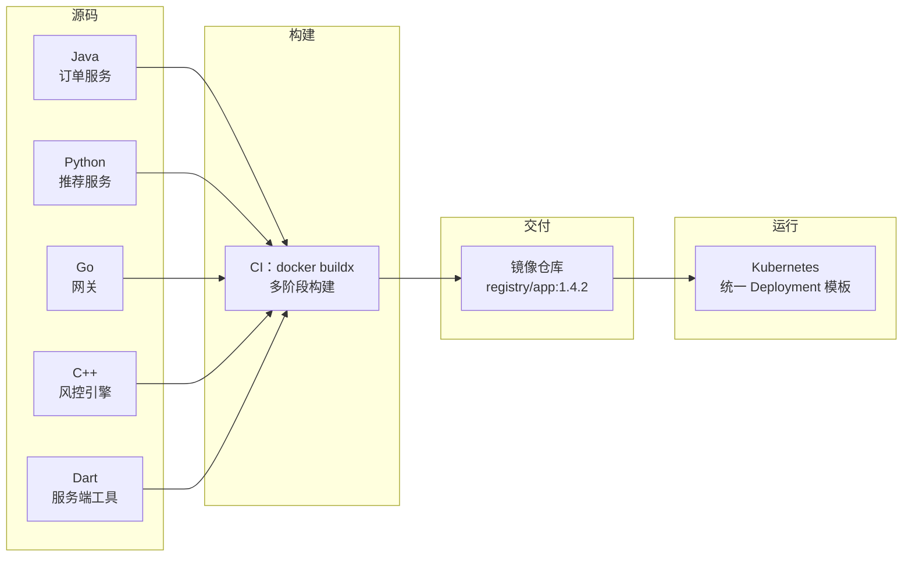

# 多语言统一容器化

> 前面四个部分解决了「怎么协作、怎么构建、怎么定义接口、怎么测试」。进入交付环节后，第一个现实问题是：Java 交付 jar、Go 交付静态二进制、Python 交付 venv 或 wheel、C++ 交付可执行文件与动态库、Dart 交付 AOT 产物——形态各异，运维不可能为每种语言维护一套部署脚本。容器化的真正价值，是把这些异构产物统一成同一种交付单元：一个带标签的 OCI 镜像。本章不重复 Docker 基础（见 [[docker/README|Docker 教程]] 与 [[docker/05-Dockerfile详解|Dockerfile 详解]]），只讨论多语言场景下的构建决策：模板、基础镜像、瘦身、安全与标签规范。

---

## 1 为什么多语言项目更需要统一容器化

### 1.1 三个核心价值

| 价值 | 单语言项目 | 多语言项目 |
|------|-----------|-----------|
| 环境一致 | 本机装好运行时即可 | 需要同时维护 JDK、Go、Python、Node、Dart 多套工具链与版本 |
| 依赖打包 | 依赖管理器基本够用 | 系统级依赖（libstdc++、openssl、glibc）无法用语言包管理器表达 |
| 部署单元统一 | 可以容忍「按语言定制脚本」 | 十余个服务、六种语言，运维必须面对同一种交付物 |

**环境一致**：CI 上编译通过、线上却因 glibc 版本不同而崩溃，是多语言项目最常见的故障。把「构建环境」和「运行环境」都固化成镜像后，`docker run` 与 CI 中执行的是同一套二进制与库。

**依赖打包**：Python 的 `psycopg2` 需要 `libpq`，C++ 需要 `libstdc++`，Java 需要字体与 `tzdata`。这些都不在语言包管理器里，只有镜像能一次打包干净。

**部署单元统一**：K8s、Helm、ArgoCD 这些工具只认识「镜像 + 标签 + 端口 + 探针」，不关心镜像里跑的是什么语言。统一容器化之后，多语言应用第一次拥有了一致的发布、回滚、扩缩容流程。



### 1.2 统一容器化不等于「所有语言一个 Dockerfile」

统一的是**约定**，不是**实现**：所有服务都必须满足四条约定，具体 Dockerfile 各写各的。

1. 运行阶段以非 root 用户启动
2. 暴露固定的健康检查端点（如 `/healthz`）
3. 能正确处理 `SIGTERM` 并优雅退出
4. 镜像标签遵循同一套规范（见第 8 节）

---

## 2 五种语言的多阶段构建模板

### 2.1 通用模式

多阶段构建的本质：**构建阶段可以又大又脏，运行阶段必须又小又干净**。所有语言遵循同一形状：builder 阶段用完整 SDK/编译器/包管理器，runtime 阶段只 `COPY` 产物，源码、缓存、工具链全部丢弃。

### 2.2 C++：编译后放入 distroless

```dockerfile
# 构建阶段：完整工具链
FROM gcc:14-bookworm AS builder
WORKDIR /src
# 先拷贝构建描述文件，利用层缓存
COPY CMakeLists.txt ./
COPY src/ ./src/
RUN cmake -S . -B build -DCMAKE_BUILD_TYPE=Release \
      -DCMAKE_CXX_FLAGS_RELEASE="-O2 -s" && \
    cmake --build build -j"$(nproc)"
# 运行阶段：distroless/cc 已包含 glibc 与 libstdc++
FROM gcr.io/distroless/cc-debian12:nonroot
COPY --from=builder /src/build/risk_engine /app/risk_engine
USER nonroot:nonroot
ENTRYPOINT ["/app/risk_engine"]
```

要点：C++ 产物依赖 `libstdc++`，不能放 `scratch`；`distroless/cc` 是当前最省心的选择。若链接了 `libssl`、`libz` 等，需要从构建镜像中把这些 `.so` 一并 `COPY` 过去，或者改为静态链接；部署前用 `ldd build/risk_engine` 确认动态依赖是必要步骤。

### 2.3 Java：JRE + 分层 jar

Spring Boot 的 fat jar 适合用官方 `layertools` 拆层：依赖层变化少、应用层变化频繁，拆层后每次只重传应用层。

```dockerfile
FROM eclipse-temurin:21-jdk AS builder
WORKDIR /src
COPY . .
RUN ./gradlew bootJar --no-daemon
# 分层阶段：把 fat jar 拆成四层（依赖层稳定、应用层频繁变化）
FROM eclipse-temurin:21-jre AS layers
WORKDIR /app
COPY --from=builder /src/build/libs/app.jar app.jar
RUN java -Djarmode=layertools -jar app.jar extract
# 运行阶段：只带 JRE
FROM eclipse-temurin:21-jre
RUN groupadd -r app && useradd -r -g app -d /app app
WORKDIR /app
COPY --from=layers /app/dependencies/ ./
COPY --from=layers /app/spring-boot-loader/ ./
COPY --from=layers /app/snapshot-dependencies/ ./
COPY --from=layers /app/application/ ./
USER app
EXPOSE 8080
ENTRYPOINT ["java", "org.springframework.boot.loader.launch.JarLauncher"]
```

不适用场景：需要 `jcmd`、`jmap` 等诊断工具时，JRE 镜像不够用，应临时用 `kubectl debug` 挂载 JDK 镜像排查，而不是把 JDK 打进生产镜像。更激进的方案是用 `jlink` 裁剪出自定义运行时，可再省 40-60MB，但模块配置出错时排查成本高，团队规模小时不划算。

### 2.4 Python：venv 整体复制

Python 的坑在于「构建时安装的包可能带编译产物，运行阶段缺少运行时库」。稳妥做法是在 builder 中建 venv，把整个 venv 复制到同版本基础镜像。

```dockerfile
FROM python:3.12-slim AS builder
ENV PIP_NO_CACHE_DIR=1
WORKDIR /app
RUN python -m venv /opt/venv
ENV PATH="/opt/venv/bin:$PATH"
COPY requirements.txt .
RUN pip install -r requirements.txt
FROM python:3.12-slim
ENV PATH="/opt/venv/bin:$PATH" \
    PYTHONDONTWRITEBYTECODE=1 \
    PYTHONUNBUFFERED=1
RUN useradd -r -u 10001 app
COPY --from=builder /opt/venv /opt/venv
WORKDIR /app
COPY --chown=app:app src/ ./src/
USER app
EXPOSE 8000
CMD ["uvicorn", "src.main:app", "--host", "0.0.0.0", "--port", "8000"]
```

`PYTHONUNBUFFERED=1` 让日志实时进入 `kubectl logs`，`PYTHONDONTWRITEBYTECODE=1` 避免只读文件系统下写 `__pycache__` 报错。两个环境变量在多语言统一运维里属于「Python 服务必须设置」。

### 2.5 Go：静态编译进 scratch

Go 是容器化的「模范生」：`CGO_ENABLED=0` 后得到完全静态的二进制，可以直接放空镜像。

```dockerfile
FROM golang:1.22-bookworm AS builder
WORKDIR /src
COPY go.mod go.sum ./
RUN go mod download
COPY . .
ARG VERSION=dev
RUN CGO_ENABLED=0 GOOS=linux go build \
      -trimpath -ldflags="-s -w -X main.version=${VERSION}" \
      -o /out/gateway ./cmd/gateway
FROM scratch
# 静态二进制若需访问 HTTPS，必须自带根证书
COPY --from=builder /etc/ssl/certs/ca-certificates.crt /etc/ssl/certs/
COPY --from=builder /out/gateway /gateway
USER 65534:65534
ENTRYPOINT ["/gateway"]
```

`-trimpath` 去掉本机绝对路径（可复现构建与安全），`-s -w` 去掉符号表与调试信息（体积可减 25% 左右），`-X main.version` 注入版本号。使用 `scratch` 后镜像里没有 shell、没有 `time.LoadLocation` 需要的 tzdata，需要时从 builder 复制 `/usr/share/zoneinfo`。

### 2.6 Dart：AOT 编译

Dart 服务端程序用 `dart compile exe` 编译为原生可执行文件，产物自带 Dart 运行时，但仍动态链接 glibc，因此不能放 `scratch`。

```dockerfile
FROM dart:3.4 AS builder
WORKDIR /src
COPY pubspec.* ./
RUN dart pub get
COPY . .
RUN dart pub get --offline && \
    dart compile exe bin/server.dart -o /out/server
FROM debian:12-slim
RUN apt-get update && \
    apt-get install -y --no-install-recommends ca-certificates && \
    rm -rf /var/lib/apt/lists/* && \
    useradd -r -u 10001 app
COPY --from=builder /out/server /app/server
USER app
EXPOSE 8080
ENTRYPOINT ["/app/server"]
```

`dart compile exe` 不支持跨操作系统编译（Linux 产物只能在 Linux 编译），跨 CPU 架构需借助 buildx 的 QEMU 模拟。若服务用 `dart pub` 依赖带原生扩展的包，构建镜像需装好对应的 `-dev` 系统包。

### 2.7 体积对比

| 语言 | 构建镜像 | 运行基础镜像 | 朴素单阶段 | 多阶段优化后 |
|------|---------|-------------|-----------|-------------|
| C++ | gcc:14-bookworm | distroless/cc-debian12 | 约 1.3GB | 约 30-60MB |
| Java | temurin:21-jdk | temurin:21-jre | 约 450MB | 约 180-250MB |
| Python | python:3.12-slim | python:3.12-slim | 约 150MB | 约 120-160MB |
| Go | golang:1.22-bookworm | scratch | 约 800MB | 约 10-25MB |
| Dart | dart:3.4 | debian:12-slim | 约 750MB | 约 80-130MB |

镜像体积直接影响三件事：镜像仓库存储成本、节点拉取时间（决定扩容速度）、CVE 扫描面。Go 服务从 800MB 降到 15MB 后，HPA 扩容一个新 Pod 的时间可以从分钟级降到秒级。

---

## 3 基础镜像选型与 libc 陷阱

### 3.1 四种基础镜像对比

| 基础镜像 | 体积 | 有 shell | 包管理器 | libc | 适用场景 | 不适用场景 |
|---------|------|---------|---------|------|---------|-----------|
| scratch | 0 | 无 | 无 | 无 | 静态链接的 Go/Rust 二进制 | 任何需要 glibc、CA 证书、时区、shell 的程序 |
| alpine | 约 5MB | 有（ash） | apk | musl | 需要 shell 调试、能接受 musl 的场景 | 预编译 glibc 二进制、依赖 musl 不兼容 wheel 的 Python |
| debian-slim | 约 80MB | 有 | apt | glibc | 需要 glibc 兼容与少量系统工具 | 对体积与 CVE 面极度敏感的场景 |
| distroless | 约 20MB | 无 | 无 | glibc | 生产环境首选：无 shell、无包管理器 | 需要进容器手动排查（改用临时 debug 容器） |

distroless 是「安全默认值」：攻击者拿到 RCE 后连 `sh` 都没有，横向移动成本陡增。代价是无法 `kubectl exec` 进容器调试，必须用 `kubectl debug` 注入临时容器，这个工作流见 [[多语言工程化/5容器与编排/04_Kubernetes部署实战|04 K8s 部署实战]]。

### 3.2 glibc 与 musl：跨语言镜像的头号陷阱

Alpine 使用 musl libc，而绝大多数语言在 CI/开发机上按 glibc 编译。混用的典型后果是运行时报 `no such file or directory` 或 `symbol not found`，且错误信息具有误导性。

| 语言 | 在 alpine 上运行的结论 | 原因 |
|------|----------------------|------|
| Go（CGO_ENABLED=0） | 可以 | 完全静态，不依赖 libc |
| C/C++ | 需在 alpine 内编译，或全静态链接 | 动态链接 glibc 的产物在 musl 上不可运行 |
| Java | 可以 | JVM 自身与 libc 交互方式对 musl 基本兼容，但字体与 DNS 行为可能有差异 |
| Python | 谨慎 | 许多 manylinux wheel 带 glibc 编译的 `.so`，musl 下需从源码编译 |
| Dart AOT | 不可 | 产物动态链接 glibc |
| Rust（gnu target） | 需改用 musl target | 默认 target 依赖 glibc |

**决策规则**：构建阶段与运行阶段的 libc 家族必须一致；静态链接的 Go/Rust 可用 scratch/alpine，动态链接的 C++/Dart 与含原生扩展的 Python 包必须用 glibc 镜像；不一致时优先换运行镜像，而不是赌「看起来能跑」。

---

## 4 镜像瘦身手段

| 手段 | 典型收益 | 风险/代价 |
|------|---------|----------|
| 多阶段构建 | 去掉整个工具链，收益最大 | 调试产物依赖时略麻烦 |
| 合并 RUN 与清理缓存 | 每层几十到几百 MB | 层数减少影响增量拉取粒度 |
| .dockerignore | 避免把 `.git`、测试数据带入上下文 | 需要维护忽略清单 |
| strip 符号 / `-s -w` | 10-30% | 无法用 `gdb`、`perf` 解析符号 |
| 换 distroless/scratch | 100MB 级 | 失去 shell 与包管理器 |
| 固定基础镜像 digest | 不直接瘦身，但保证可复现 | 需要定期更新 digest |

```text
# .dockerignore 示例（多语言仓库通用）
.git
.gitignore
**/node_modules
**/target
**/build
**/.gradle
**/__pycache__
**/.venv
**/.dart_tool
**/*.log
docs
tests/fixtures
```

`strip` 的使用方式因语言而异：C/C++ 在链接参数加 `-s` 或构建后 `strip binary`；Go 用 `-ldflags="-s -w"`；Rust 在 `Cargo.toml` 中设置 `[profile.release] strip = true`。Java 与 Python 没有等价物，它们的「瘦身」主要是去掉构建工具与缓存。

---

## 5 非 root 运行与只读文件系统

容器内以 root 运行意味着：一旦逃逸，攻击者就是节点上的 root。所有语言统一要求：

```dockerfile
# Debian 系
RUN groupadd -r app && useradd -r -g app -d /app -s /usr/sbin/nologin app
USER app
# Alpine 系：RUN addgroup -S app && adduser -S -G app app
# 最简：直接使用数值 UID（distroless/scratch 适用）
USER 65534:65534
```

在 K8s 侧用 `securityContext` 强制约束，防止镜像内忘记切换：

```yaml
# Deployment 片段：多语言服务统一的安全基线
spec:
  template:
    spec:
      securityContext:
        runAsNonRoot: true          # 未声明 USER 的镜像会启动失败
        runAsUser: 10001
        fsGroup: 10001              # 挂载卷属组，解决写权限
      containers:
        - name: api
          image: registry.example.com/order-api:1.4.2
          securityContext:
            allowPrivilegeEscalation: false
            readOnlyRootFilesystem: true
            capabilities: { drop: ["ALL"] }
          volumeMounts: [{ name: tmp, mountPath: /tmp }]   # 唯一可写目录
      volumes: [{ name: tmp, emptyDir: {} }]
```

只读根文件系统对各语言的影响不同：

| 语言 | 需要的可写目录 | 处理方式 |
|------|--------------|---------|
| Java | `/tmp`、部分场景下的 `$HOME` | 挂载 `emptyDir` 到 `/tmp`，设置 `-Djava.io.tmpdir=/tmp` |
| Python | `__pycache__` | 设置 `PYTHONDONTWRITEBYTECODE=1` |
| Go | 无（除程序显式写盘） | 直接把日志写 stdout |
| C++ | 取决于程序，常见 `/tmp` | 挂载 `emptyDir` |
| Dart | 无（除程序显式写盘） | 日志写 stdout |

---

## 6 健康检查与信号处理

### 6.1 PID 1 问题

容器里第一个进程是 PID 1。Linux 内核对 PID 1 有特殊待遇：**不注册处理函数的信号会被忽略**，且 PID 1 退出后不会自动回收僵尸子进程。用 shell 形式启动（`CMD python app.py`）会额外多一层 shell，信号根本传不到应用——kubelet 发送 SIGTERM 后只能等到宽限期结束再 SIGKILL，请求随之丢失。

正确做法有三条，任选其一：exec 格式 ENTRYPOINT 让应用直接成为 PID 1 并在代码里处理 `SIGTERM`；镜像内加 `tini`/`dumb-init` 负责转发信号与回收子进程；`docker run --init`（仅 Docker 单机，K8s 需把 init 放进镜像）。

```dockerfile
# 方案 2：用 tini 作为 PID 1（Debian 系）
RUN apt-get update && apt-get install -y --no-install-recommends tini && \
    rm -rf /var/lib/apt/lists/*
ENTRYPOINT ["/usr/bin/tini", "--"]
CMD ["/app/server"]
```

### 6.2 各语言优雅关闭

| 语言 | 优雅关闭要点 |
|------|-------------|
| Java | Spring Boot 设置 `server.shutdown=graceful` 与 `spring.lifecycle.timeout-per-shutdown-phase` |
| Go | `signal.NotifyContext(ctx, syscall.SIGTERM)` + `http.Server.Shutdown` |
| Python | 注册 `signal.signal(signal.SIGTERM, handler)`，uvicorn/gunicorn 已内置处理 |
| C++ | 注册 `sigaction(SIGTERM, ...)`，停止接受新请求后 drain 连接 |
| Dart | `ProcessSignal.sigterm.watch()`，关闭 `HttpServer` 后等待在途请求 |

K8s 侧配合 `terminationGracePeriodSeconds`（默认 30 秒）与 `preStop` 钩子：`preStop` 里 `sleep 5` 是为了让 Service 端点摘除先于进程退出，避免滚动更新时出现 502。健康检查不要用 Dockerfile 的 `HEALTHCHECK`：K8s 会忽略它，探针应写在 Pod 模板里（见 [[多语言工程化/5容器与编排/03_Kubernetes核心概念|03 K8s 核心概念]]），避免两套健康检查逻辑不一致。

---

## 7 构建参数与多平台

`ARG` 只在构建期可见，`ENV` 会进入镜像。版本号、构建时间等元数据用 `ARG` 注入，运行时配置用 `ENV` 给默认值：

```bash
# 注入版本与 git sha，同时打多个标签
docker buildx build --platform linux/amd64,linux/arm64 \
  --build-arg VERSION=1.4.2 \
  -t registry.example.com/order-api:1.4.2 \
  -t registry.example.com/order-api:sha-$(git rev-parse --short HEAD) --push .
```

buildx 是 BuildKit 的前端，多平台构建的实际机制是：本机构建当前架构，其他架构通过 QEMU 模拟执行构建指令。模拟构建慢且对交叉编译不友好的语言（Dart AOT、部分 C++ 模板代码）可能失败，替代方案是每种架构用对应 runner 分别构建，再用 `docker manifest` 合并。

```bash
# CI 缓存：把构建缓存推到仓库，跨流水线复用
docker buildx build \
  --cache-from type=registry,ref=registry.example.com/order-api:buildcache \
  --cache-to type=registry,ref=registry.example.com/order-api:buildcache,mode=max \
  -t registry.example.com/order-api:1.4.2 --push .
```

基础镜像固定到 digest 可保证「今天构建」与「半年后重建」得到一致环境；代价是安全更新不会自动获得，需要机器人（如 Renovate）定期提 PR 更新 digest。

---

## 8 镜像命名与标签规范

推荐格式：`<registry>/<项目>/<服务>:<版本>`，标签策略如下：

| 标签形式 | 示例 | 用途 | 注意 |
|---------|------|------|------|
| 语义化版本 | `1.4.2` | 发布与回滚的稳定引用 | 生产 Deployment 应使用它或 sha |
| git sha | `sha-9f3c1ab` | 精确追溯源码，CI 构建必打 | 不可读，但绝对唯一 |
| 环境前缀 | `dev-1.4.2` | 多环境共享仓库时的隔离 | 容易与正式标签混淆 |
| latest | `latest` | 本地体验、文档示例 | 生产禁用：不可追溯、缓存导致版本漂移 |

`latest` 的争议在于它同时被当作「最新稳定版」和「默认标签」使用，而 Docker 的拉取策略（`imagePullPolicy: IfNotPresent`）会让节点上的旧 `latest` 永不更新，导致「我明明推了新镜像，线上还是旧的」。统一约定：**CI 不推 `latest`，K8s 清单不使用 `latest`**。若必须用，设置 `imagePullPolicy: Always`，但这不是好方案。

---

## 9 镜像扫描与 SBOM

构建完成不等于交付完成，还需要回答两个问题：「镜像里有哪些已知漏洞」与「这个镜像到底包含哪些组件」。

```bash
# Trivy：按严重级别设置 CI 门禁；--ignore-unfixed 只留可修复漏洞
trivy image --severity HIGH,CRITICAL --exit-code 1 registry.example.com/order-api:1.4.2
trivy image --ignore-unfixed registry.example.com/order-api:1.4.2

# 生成 SBOM（软件物料清单）
syft registry.example.com/order-api:1.4.2 -o spdx-json > sbom.spdx.json
```

| 工具 | 类型 | 适用场景 | 不适用场景 |
|------|------|---------|-----------|
| Trivy | 漏洞扫描 + SBOM | CI 门禁、仓库定期扫描 | 需要运行时行为分析 |
| Grype | 漏洞扫描 | 与 Syft SBOM 配合 | 需要 IaC 扫描时（配合 Checkov） |
| Syft | SBOM 生成 | 合规、供应链追溯 | 漏洞优先级判断 |

多语言项目的扫描策略要点：基础镜像贡献了大部分 CVE，升级 `python:3.12-slim` 到最新补丁版比逐个修业务依赖更有效；语言级依赖（jar、wheel、go module）由语言自身的扫描器（OWASP Dependency-Check、pip-audit、govulncheck）覆盖，与镜像扫描互补。

---

## 10 常见坑与排错

| 症状 | 根因 | 解决 |
|------|------|------|
| `exec format error` | 镜像架构与节点不符（amd64 镜像跑在 arm64） | 用 buildx 构建多平台镜像，检查 `docker inspect` 的 Architecture |
| `no such file or directory`（文件明明存在） | glibc/musl 不匹配，或缺动态链接器 | 换 glibc 基础镜像，或用 `ldd` 核对依赖 |
| `permission denied` 写文件 | 只读根文件系统或 UID 不匹配 | 挂载 `emptyDir`，检查 `fsGroup` 与目录属主 |
| 容器收到 SIGTERM 不退出 | shell 形式 ENTRYPOINT，或应用忽略信号 | 改 exec 格式，加 tini，代码里处理 SIGTERM |
| 滚动更新时 502 | 端点摘除晚于进程退出 | 加 `preStop: sleep 5`，实现优雅关闭 |
| 镜像越推越大 | 单阶段构建、缓存未清理、`.dockerignore` 缺失 | 多阶段、合并清理命令、补全忽略清单 |
| `kubectl exec` 进不去容器 | distroless/scratch 没有 shell | 用 `kubectl debug -it --image=busybox` 注入临时容器 |

---

## 11 本章小结

1. 容器化对多语言项目的核心价值是**把异构产物统一为同一种交付单元**，而不是把程序塞进 Docker
2. 多阶段构建是通用模式：构建阶段装工具链，运行阶段只放产物
3. 基础镜像选型的第一原则是**构建与运行的 libc 家族一致**；distroless 是生产默认值
4. 非 root、只读文件系统、信号处理、健康检查是四条统一的容器安全与可靠性约定
5. 标签规范决定可追溯性：CI 推 sha 与语义化版本，生产禁用 `latest`
6. 扫描与 SBOM 是交付流程的一部分，不是可选项

---

## 动手实践

1. **同一服务双镜像对比**：选一个你熟悉的语言写一个 HTTP 服务（返回自身版本号），分别用「单阶段 ubuntu 基础镜像」与「本章对应语言的多阶段模板」构建，输出 `docker images` 体积对比。
   - 验收标准：优化后镜像体积小于单阶段的 30%；容器内 `id` 显示非 root；`docker stop` 后日志中能看到优雅退出记录。
2. **glibc/musl 陷阱复现**：在 Debian 基础镜像中编译一个 C 或 Dart 程序，复制到 `alpine` 镜像中运行，观察报错；再用 `ldd` 与 `readelf -l` 解释原因，最后给出两种修复方案。
   - 验收标准：能准确说明报错信息与动态链接器的关系，且两种修复方案都能跑通。
3. **信号处理验证**：用 Python 或 Go 写一个带 `sleep` 的假任务服务，分别用 shell 格式与 exec 格式的 `ENTRYPOINT` 启动，执行 `docker stop`，对比退出耗时与日志。
   - 验收标准：exec 格式（或 tini 包装）能在 1 秒内响应 SIGTERM 并打印关闭日志；shell 格式观察到 10 秒后被 SIGKILL。
4. **扫描与门禁**：对第 1 题的镜像运行 Trivy，生成 SBOM；找出 CVE 数量最多的组件，尝试通过更换基础镜像或升级依赖降低 HIGH/CRITICAL 数量。
   - 验收标准：提交前后两份扫描报告，HIGH/CRITICAL 数量下降，并说明每一处改动的理由。

---

- 返回目录：[[多语言工程化/多语言工程化目录|多语言工程化]]
