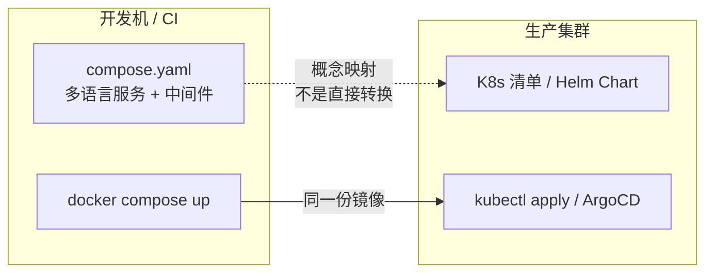

# Compose 多服务编排

> 上一章把每个语言的服务统一成了镜像，但本地开发时逐个 `docker run` 依然痛苦：启动顺序、网络别名、数据库初始化、环境变量散落各处。Docker Compose 用一份声明式 YAML 描述整个多语言开发环境，一条命令拉起 Java API、Python Worker、Go 网关、MySQL、Redis 与 Kafka。本章的定位很明确：**Compose 是开发与集成测试工具，生产编排交给 K8s**（见 [[多语言工程化/5容器与编排/03_Kubernetes核心概念|03 K8s 核心概念]]）。我们聚焦多语言团队如何把 Compose 用成「可复现的本地集成环境」，而不是重复 [[docker/README|Docker 教程]] 里的单容器基础。

---

## 1 Compose 在交付链路中的位置

### 1.1 三个使用场景

| 场景 | 说明 | 是否推荐 |
|------|------|---------|
| 本地开发环境 | 一条命令拉起全部依赖，新人当天可跑通 | 强烈推荐 |
| CI 集成测试 | 在流水线里跑真实的 MySQL/Kafka 做契约与集成测试 | 推荐（Testcontainers 是另一种选择） |
| 单机小型部署 | 小团队内网部署、演示环境 | 可用，但需明确边界 |
| 生产多机集群 | 需要自愈、滚动更新、HPA | 不推荐，用 K8s |

**不适用场景**：需要跨多台物理机、需要自动扩缩容、需要零停机滚动发布的生产系统。Compose 的 `deploy` 字段虽然支持 `replicas` 与 `restart_policy`，但只对 Swarm 模式完整生效，`docker compose` 命令下多数被忽略——这一点是新手最常踩的认知坑。

### 1.2 与 K8s 的关系



关键原则：**开发用 Compose，生产用 K8s，但两边使用完全相同的镜像**。差异只允许存在于「配置注入」与「编排策略」层，不允许出现「开发镜像装调试工具、生产镜像另一套」的分裂。

---

## 2 完整的 compose.yaml

下面是一个真实可运行的多语言开发环境。目录结构约定：

```text
polyglot/
├── compose.yaml / compose.override.yaml / .env(.example)
├── Makefile
├── infra/mysql/init/01_schema.sql
└── services/{gateway(Go), order-api(Java), recommend(Python)}
```

```yaml
# compose.yaml：基础定义，所有环境共用
name: polyglot-dev
# 扩展字段 + YAML 锚点，避免环境变量重复
x-common-env: &common-env
  LOG_LEVEL: debug
  OTEL_EXPORTER_OTLP_ENDPOINT: http://otel-collector:4317

services:
  gateway:                          # Go 网关：唯一对外入口
    build: { context: ./services/gateway, target: dev }
    ports: ["8080:8080"]
    environment:
      <<: *common-env
      ORDER_API_URL: http://order-api:8081
      REDIS_ADDR: redis:6379
    depends_on:
      order-api: { condition: service_healthy }
      redis: { condition: service_healthy }
    networks: [app-net]

  order-api:                        # Java 订单 API
    build: { context: ./services/order-api }
    environment:
      <<: *common-env
      SPRING_DATASOURCE_URL: jdbc:mysql://mysql:3306/orders?useSSL=false&allowPublicKeyRetrieval=true
      SPRING_DATASOURCE_USERNAME: app
      SPRING_DATASOURCE_PASSWORD: ${MYSQL_APP_PASSWORD}
      SPRING_KAFKA_BOOTSTRAP_SERVERS: kafka:9092
    depends_on:
      mysql: { condition: service_healthy }
      kafka: { condition: service_healthy }
    healthcheck:
      test: ["CMD", "curl", "-fsS", "http://localhost:8081/actuator/health/readiness"]
      interval: 10s
      timeout: 3s
      retries: 6
      start_period: 40s
    networks: [app-net]

  recommend-worker:                 # Python Worker：消费 Kafka，写 Redis
    build: { context: ./services/recommend }
    command: ["python", "-m", "worker.main"]
    environment:
      <<: *common-env
      KAFKA_BOOTSTRAP_SERVERS: kafka:9092
      REDIS_ADDR: redis:6379
    depends_on:
      kafka: { condition: service_healthy }
      redis: { condition: service_healthy }
    networks: [app-net]

  mysql:
    image: mysql:8.4
    environment:
      MYSQL_ROOT_PASSWORD: ${MYSQL_ROOT_PASSWORD}
      MYSQL_DATABASE: orders
      MYSQL_USER: app
      MYSQL_PASSWORD: ${MYSQL_APP_PASSWORD}
    ports: ["127.0.0.1:3306:3306"]  # 只绑定本机回环，避免暴露到局域网
    volumes:
      - mysql-data:/var/lib/mysql
      - ./infra/mysql/init:/docker-entrypoint-initdb.d:ro
    healthcheck:
      test: ["CMD-SHELL", "mysqladmin ping -h 127.0.0.1 -uroot -p$$MYSQL_ROOT_PASSWORD --silent"]
      interval: 10s
      timeout: 5s
      retries: 10
      start_period: 30s
    networks: [app-net]

  redis:
    image: redis:7-alpine
    command: ["redis-server", "--appendonly", "yes"]
    volumes: ["redis-data:/data"]
    healthcheck:
      test: ["CMD", "redis-cli", "ping"]
      interval: 5s
      timeout: 3s
      retries: 10
    networks: [app-net]

  kafka:
    image: bitnami/kafka:3.7
    environment:
      KAFKA_CFG_NODE_ID: "0"
      KAFKA_CFG_PROCESS_ROLES: controller,broker
      KAFKA_CFG_LISTENERS: PLAINTEXT://:9092,CONTROLLER://:9093
      KAFKA_CFG_ADVERTISED_LISTENERS: PLAINTEXT://kafka:9092
      KAFKA_CFG_CONTROLLER_QUORUM_VOTERS: 0@kafka:9093
      KAFKA_CFG_CONTROLLER_LISTENER_NAMES: CONTROLLER
      KAFKA_CFG_LISTENER_SECURITY_PROTOCOL_MAP: CONTROLLER:PLAINTEXT,PLAINTEXT:PLAINTEXT
    volumes: ["kafka-data:/bitnami/kafka"]
    healthcheck:
      test: ["CMD-SHELL", "kafka-topics.sh --bootstrap-server localhost:9092 --list >/dev/null 2>&1"]
      interval: 15s
      timeout: 10s
      retries: 10
      start_period: 40s
    networks: [app-net]

  otel-collector:                   # 可观测性栈用 profiles 隔离，默认不启动
    image: otel/opentelemetry-collector-contrib:0.104.0
    profiles: ["observability"]
    volumes: ["./infra/otel/config.yaml:/etc/otelcol-contrib/config.yaml:ro"]
    networks: [app-net]

volumes:
  mysql-data:
  redis-data:
  kafka-data:
networks:
  app-net: { driver: bridge }
```

`.env.example` 提交到仓库（`.env` 加入 `.gitignore`）：
```bash
# .env.example：只放开发默认值，绝不提交真实密钥
MYSQL_ROOT_PASSWORD=dev-root-password
MYSQL_APP_PASSWORD=dev-app-password
```

---

## 3 依赖顺序与健康检查

### 3.1 depends_on 只保证「启动顺序」，不保证「就绪」

`depends_on` 的短语法只控制容器创建顺序，MySQL 容器「已创建」时它内部的数据库可能还在初始化：Compose 立刻启动 order-api，而 mysqld 要 30 秒后才真正就绪，Java 应用连接被拒绝并崩溃重启。多语言项目里，Java 应用连接超时、Python Worker 找不到 topic、Go 网关首次请求 500，大多源于此。

正确姿势是长语法 + `condition: service_healthy`，并且**为每个有状态中间件写健康检查**：

| 中间件 | 健康检查命令 | 注意事项 |
|--------|-------------|---------|
| MySQL | `mysqladmin ping` | 镜像内有 `mysqladmin`；密码用 `$$` 转义避免 Compose 插值 |
| Redis | `redis-cli ping` | 返回 `PONG` 即健康 |
| Kafka | `kafka-topics.sh --list` | 比 `nc -z` 更能反映 broker 真正可用 |
| PostgreSQL | `pg_isready -U user` | 自带工具，推荐 |
| Java 服务 | `curl -f /actuator/health/readiness` | slim 镜像可能没有 curl，需在 Dockerfile 安装 |

### 3.2 应用侧仍要有重试

健康检查解决 95% 的启动顺序问题，但网络抖动、中间件重启仍会造成瞬时失败。应用必须实现**带退避的连接重试**：Java 侧用 Spring Retry 或连接池的 `initializationFailTimeout`，Python 侧用 tenacity，Go 侧用重试循环。Compose 的 `restart: unless-stopped` 只是兜底，不是设计手段。

---

## 4 配置分层与环境变量

### 4.1 三层配置模型

| 层级 | 文件 | 内容 | 是否提交 |
|------|------|------|---------|
| 基础定义 | `compose.yaml` | 服务、网络、卷、默认环境变量 | 是 |
| 个人覆盖 | `compose.override.yaml` | 端口、热重载、调试开关 | 是（开发约定） |
| 密钥与本地差异 | `.env` | 密码、个人 token | 否（`.gitignore`） |

Compose 会自动合并 `compose.yaml` 与 `compose.override.yaml`，后者字段覆盖前者。团队约定：**基础文件里不写宿主端口和 bind mount，全部放 override**，这样 CI 用基础文件即可，不受开发者个人配置干扰。

```yaml
# compose.override.yaml：仅开发环境使用
services:
  order-api:
    ports: ["8081:8081", "5005:5005"]      # API 端口 + JDWP 调试端口
    environment:
      JAVA_TOOL_OPTIONS: "-agentlib:jdwp=transport=dt_socket,server=y,suspend=n,address=*:5005"
  recommend-worker:
    volumes: ["./services/recommend/src:/app/src"]   # 源码挂载，配合 reload
    environment:
      WATCHFILES_FORCE_POLLING: "true"               # inotify 不稳定时启用轮询
```

### 4.2 环境变量的优先级

从低到高：`compose.yaml` 的 `environment` 默认值 → `env_file` 指定的文件 → `.env`（仅用于变量插值）→ `environment` 中的显式值 → `docker compose run -e`。

容易混淆的是 `.env` 与 `env_file`：

- `.env`：Compose 自身读取，用于 YAML 里的 `${VAR}` 插值，不会自动注入容器
- `env_file`：把文件里的变量注入容器进程

```yaml
services:
  order-api:
    env_file: ["./services/order-api/.env.dev"]   # 注入容器
    environment:
      LOG_LEVEL: ${LOG_LEVEL:-info}               # 从 .env 插值，带默认值
```

---

## 5 网络、端口与数据卷

### 5.1 网络

自定义 bridge 网络自带 DNS：容器间用**服务名**互相访问（`mysql:3306`、`kafka:9092`），这是多语言服务解耦的关键——代码里不应出现 IP。默认情况下 Compose 会创建一个 `<项目名>_default` 网络，显式命名便于排查与多项目共享。

| 需求 | 做法 | 注意 |
|------|------|------|
| 服务间互访 | 同一自定义网络 + 服务名 | 不要用 `links`（已废弃） |
| 与宿主机通信 | `host.docker.internal` | Linux 需加 `extra_hosts: ["host.docker.internal:host-gateway"]` |
| 隔离敏感服务 | 拆多个网络，只连必要服务 | 如 MySQL 不连公网网络 |

### 5.2 端口

| 写法 | 含义 | 适用 |
|------|------|------|
| `"8080:8080"` | 所有网卡暴露 | 仅开发，注意防火墙 |
| `"127.0.0.1:3306:3306"` | 仅本机可访问 | 数据库等敏感服务推荐 |
| 不写 `ports` | 仅容器网络内可见 | 内部服务推荐 |

### 5.3 数据卷与初始化脚本

命名卷（`mysql-data`）由 Docker 管理，性能好、权限自动处理；bind mount（`./infra/mysql/init`）适合放需要版本管理的初始化脚本。MySQL 官方镜像的 `/docker-entrypoint-initdb.d` 只在**数据目录为空**时执行，因此改了脚本想重跑必须 `docker compose down -v`（`-v` 会删除命名卷，数据一并清空）。

```sql
CREATE TABLE IF NOT EXISTS orders (
  id          BIGINT UNSIGNED AUTO_INCREMENT PRIMARY KEY,
  user_id     BIGINT UNSIGNED NOT NULL,
  amount      DECIMAL(12,2)   NOT NULL,
  status      VARCHAR(32)     NOT NULL DEFAULT 'created',
  created_at  TIMESTAMP       NOT NULL DEFAULT CURRENT_TIMESTAMP,
  KEY idx_user_status (user_id, status)
) ENGINE=InnoDB DEFAULT CHARSET=utf8mb4;
```

---

## 6 profiles：按需启动

开发时并非所有人都需要 Kafka 与可观测性栈。`profiles` 让服务默认不启动，显式指定时才拉起：

```bash
docker compose up -d                                     # 只启动核心服务
docker compose up -d --profile observability             # 核心 + 可观测性
docker compose --profile observability --profile tools up -d   # 多个 profile
```

| 服务 | profile | 使用场景 |
|------|---------|---------|
| otel-collector / jaeger | observability | 调试链路追踪 |
| mailhog | tools | 调试邮件通知 |
| kafka-ui | tools | 查看 topic 与消息 |

`profiles` 的替代方案是维护多个 compose 文件并用 `-f` 叠加，但文件组合容易失控；profiles 在单文件内表达「可选组件」更清晰。

---

## 7 开发热重载

### 7.1 两种方案对比

| 方案 | 机制 | 适用 | 不适用 |
|------|------|------|--------|
| bind mount + 语言自带 reload | 源码目录挂进容器，`uvicorn --reload` / `air` / `spring-boot-devtools` 监听文件变化 | 解释型语言、启动快的服务 | 编译型且启动慢的服务（C++、Dart AOT） |
| `docker compose watch` | Compose 监听文件变化，自动同步或重建 | 所有语言，支持 rebuild 动作 | Compose 版本低于 2.22 的环境 |

```yaml
# compose.override.yaml 中的 watch 配置
services:
  gateway:
    develop:
      watch:
        - { action: rebuild, path: ./services/gateway }   # Go 需重新编译
  recommend-worker:
    develop:
      watch:
        - { action: sync, path: ./services/recommend/src, target: /app/src }
        - { action: rebuild, path: ./services/recommend/requirements.txt }
```

```bash
docker compose watch          # 前台运行，监听变更
docker compose up --watch     # 等价写法
```

### 7.2 热重载的边界

热重载只用于**无状态应用代码**。以下内容变更必须重建镜像：依赖清单（`requirements.txt`、`go.mod`、`pom.xml`）、Dockerfile、基础镜像。把这些路径配成 `action: rebuild` 可避免「改了依赖但容器里还是旧版本」的幽灵问题。

---

## 8 扩缩容与日志

### 8.1 服务扩缩容

```bash
docker compose up -d --scale recommend-worker=3   # Kafka 消费者组自动分担分区
docker compose ps recommend-worker                # 查看实例
```

`--scale` 的两个前提：服务不能设置 `container_name`（名称必须唯一），不能把同一宿主端口固定映射到多个副本。生产里的扩缩容逻辑（指标驱动、滚动替换）是 K8s 的职责，Compose 的 `--scale` 仅用于本地验证「服务是否无状态、能否并行消费」。

### 8.2 日志聚合

```bash
docker compose logs -f --tail=100 gateway order-api   # 多服务日志，带服务名前缀
docker compose logs -t --since=10m                    # 带时间戳，排查跨服务时序
docker compose logs --no-log-prefix recommend-worker  # 只看某个服务
```

多语言日志格式不统一时，`docker compose logs` 只是最低要求。要真正排查跨语言调用，需要结构化日志与 trace_id，见 [[多语言工程化/5容器与编排/06_可观测性|06 可观测性]]。

---

## 9 一键启动：Makefile

```makefile
# Makefile：把冗长的 compose 命令固化成团队统一入口
COMPOSE := docker compose
.PHONY: up up-obs down reset build logs test

up:        ## 启动全部核心服务并等待健康
	$(COMPOSE) up -d --build --wait
up-obs:    ## 额外启动可观测性栈
	$(COMPOSE) --profile observability up -d --wait
down:      ## 停止但保留数据卷
	$(COMPOSE) down
reset:     ## 停止并清空数据（危险：本地数据全部丢失）
	$(COMPOSE) down -v --remove-orphans
build:     ## 只重建镜像
	$(COMPOSE) build --pull
logs:      ## 跟踪全部日志
	$(COMPOSE) logs -f --tail=100
seed:      ## 造一批测试订单
	$(COMPOSE) exec -T mysql mysql -uapp -p$$MYSQL_APP_PASSWORD orders < infra/seed/orders.sql
test:      ## 在 CI 中运行集成测试
	$(COMPOSE) -f compose.yaml -f compose.ci.yaml up -d --wait
	$(COMPOSE) -f compose.yaml -f compose.ci.yaml run --rm tests
	$(COMPOSE) -f compose.yaml -f compose.ci.yaml down -v
```

`docker compose up --wait` 会阻塞到所有带 healthcheck 的服务变为 healthy（无 healthcheck 的服务以 running 为准），这是 CI 中最可靠的「环境就绪」信号。

---

## 10 Compose 与 K8s 概念对照

| 能力 | Compose | Kubernetes | 迁移注意 |
|------|---------|-----------|---------|
| 服务定义 | `services.<name>` | Deployment + Service | 一个 Compose 服务通常拆成两个对象 |
| 副本数 | `--scale` / `deploy.replicas` | `replicas` + HPA | Compose 无自动扩缩 |
| 服务发现 | 自定义网络 DNS | Service + CoreDNS | 服务名写法相似，但 K8s 有命名空间后缀 |
| 端口暴露 | `ports` | Service / Ingress | K8s 中容器端口与对外端口解耦 |
| 配置 | `environment` / `env_file` | ConfigMap / Secret | 敏感值必须用 Secret |
| 存储 | 命名卷 / bind mount | PV / PVC / StorageClass | 动态供给是 K8s 独有 |
| 健康检查 | `healthcheck` | liveness/readiness/startup | 语义更细分 |
| 启动顺序 | `depends_on` + condition | 无顺序保证，靠探针与重试 | 应用必须容错启动 |
| 重启 | `restart: unless-stopped` | `restartPolicy` + 控制器 | 由控制器保证期望副本 |

---

## 11 常见坑与排错

| 症状 | 根因 | 解决 |
|------|------|------|
| 应用启动报连接拒绝 | 只用短 `depends_on`，中间件未就绪 | 改 `condition: service_healthy`，应用加退避重试 |
| 改了 `01_schema.sql` 不生效 | 初始化脚本只在空数据目录执行 | `docker compose down -v` 后重启 |
| MySQL 卷权限报错 | bind mount 目录属主与容器内 mysql 用户不符 | 用命名卷；或 `chown 999:999` 目录 |
| `--scale` 报端口冲突 | 服务固定映射了宿主端口 | 去掉宿主端口，或改用随机端口 |
| 容器内改代码无效果 | 挂载路径与工作目录不一致，或轮询未开 | 核对 `target`，必要时开 polling |
| 构建缓存导致依赖没更新 | 层缓存命中旧依赖 | `docker compose build --pull --no-cache` |
| `.env` 改了但没生效 | `.env` 只参与插值，未注入容器 | 需要注入时用 `env_file` |
| Kafka 容器内能连、宿主连不上 | `ADVERTISED_LISTENERS` 只声明了容器内地址 | 增加 `localhost:29092` 监听并按来源选择 |
| CI 中 `up -d` 后立刻测试失败 | 未等待健康检查 | 使用 `--wait`，或轮询健康端点 |

排错三板斧：

```bash
docker compose config                 # 查看合并、插值后的最终 YAML
docker compose ps --format json       # 查看容器与健康状态
docker compose logs --tail=50 <svc>   # 看应用日志
```

---

## 12 本章小结

1. Compose 的定位是**开发与集成测试环境**，不是生产编排；生产用 K8s，但镜像必须一致
2. `depends_on` 必须配合 `condition: service_healthy`，应用自身仍要容错重试
3. 配置分三层：基础文件、override、`.env`；密钥永不入库
4. 自定义网络的服务名 DNS 是多语言服务解耦的基础
5. `profiles` 管理可选组件，`watch` 提供热重载，`--wait` 是 CI 的就绪信号；Compose 与 K8s 的概念映射是迁移的前提

---

## 动手实践

1. **搭建三语言最小闭环**：用 Go（或任意语言）写网关、Python 写 Worker、Java 或 Node 写 API，加上 MySQL 与 Redis，用一份 `compose.yaml` 一键启动。要求 Worker 通过 Redis 收到网关写入的任务并打印日志。
   - 验收标准：`docker compose up -d --wait` 后所有服务 healthy；`curl localhost:8080/task` 后 `docker compose logs recommend-worker` 能看到任务日志；`docker compose down && docker compose up -d` 后数据仍在。
2. **启动顺序实验**：把 MySQL 的 healthcheck 删掉并改用短 `depends_on`，观察 API 是否出现连接失败；恢复 `condition: service_healthy` 并给 API 加上重试逻辑，再次验证。
   - 验收标准：能复现失败并给出日志证据；修复后连续执行 5 次 `down && up` 不再失败。
3. **热重载与 profiles**：为 Worker 配置 `develop.watch` 的 sync 动作，修改源码后不重建容器即可看到新逻辑；用 `profiles` 添加一个 Jaeger 服务，验证默认启动不包含它。
   - 验收标准：`docker compose watch` 下改代码 5 秒内生效；`docker compose config --services` 与带 profile 时的服务列表不同。
4. **扩缩容验证**：把 Worker 扩展到 3 个副本，观察 Kafka 消费者组或 Redis 队列的分工；再给 Worker 加上 `container_name`，验证 `--scale` 报错并解释原因。
   - 验收标准：3 个副本日志交错且不重复处理同一消息；能说明 `container_name` 为何破坏扩缩容。

---

- 返回目录：[[多语言工程化/多语言工程化目录|多语言工程化]]
