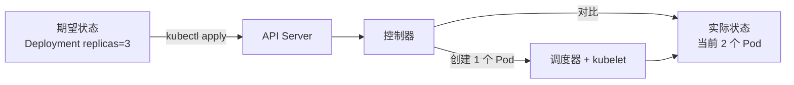
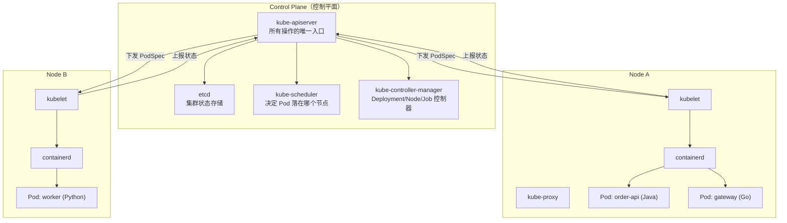
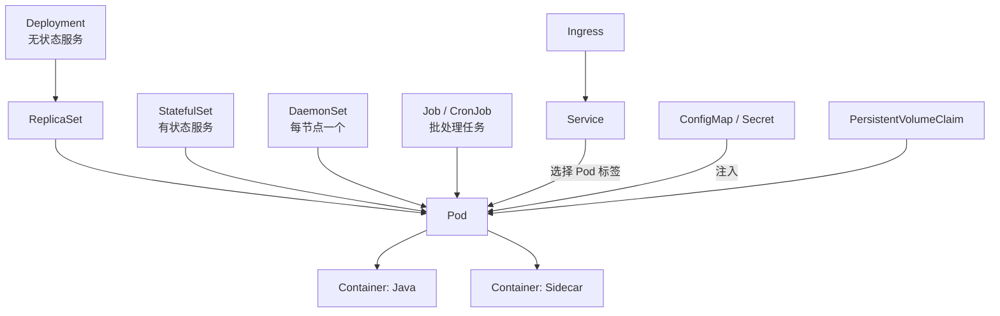
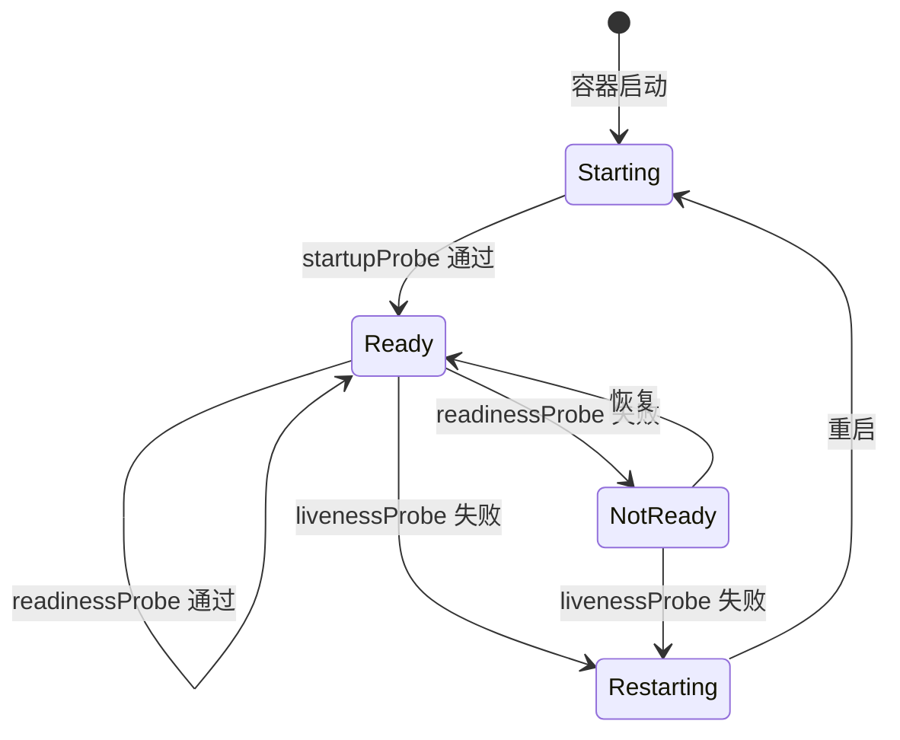

# Kubernetes 核心概念

> 多语言服务统一容器化之后，下一步是让它们在生产环境稳定运行：进程崩了自动重启、机器挂了自动迁移、流量涨了自动扩容。Kubernetes 用声明式 API 把「期望状态」写进 YAML，由控制器不断把实际状态拉回期望状态。[[linux/47-容器编排与K8s入门|K8s 入门]] 已从 Linux 运维视角讲过架构与基础对象，本章从**多语言应用交付**的视角重讲核心概念：哪些对象决定服务如何运行、如何被访问、如何被观测，以及语言无关的探针与资源配置约定。后续 [[多语言工程化/5容器与编排/04_Kubernetes部署实战|04 部署实战]] 会把它们组合成完整清单。

---

## 1 Kubernetes 解决什么问题

### 1.1 四个核心能力

| 能力 | 含义 | 对多语言团队的意义 |
|------|------|------------------|
| 声明式 | 描述期望状态，系统负责收敛 | 六种语言的部署方式统一为同一套 YAML 语义 |
| 自愈 | 容器崩溃重启、节点故障迁移、副本不足补齐 | 不需要为每个语言写守护脚本 |
| 调度 | 按资源、亲和性、污点把 Pod 放到合适节点 | CPU 密集的 C++ 服务与内存密集的 Java 服务可以分池 |
| 扩缩容 | 手工或基于指标调整副本数 | 流量高峰自动加 Go 网关，低谷缩容省成本 |

声明式是理解 K8s 的钥匙。你不再执行「启动三个容器」，而是声明「我要三个副本」；`kubectl apply` 之后，控制器持续对比实际状态与期望状态。这种「控制循环」意味着**任何手工修改都会被系统纠正回去**——包括你在 Pod 里改的配置。



### 1.2 不适合上 K8s 的场景

| 场景 | 建议 |
|------|------|
| 单体应用、一台机器足够 | Docker Compose 或 systemd，K8s 的复杂度不划算 |
| 团队没有运维能力 | 托管 K8s（EKS/GKE/ACK）或直接使用 PaaS |
| 需要固定 GPU 拓扑的离线训练 | 裸机 + Slurm 往往更合适 |
| 极低延迟的实时系统 | 容器网络与调度抖动可能不可接受 |

K8s 的代价是学习曲线与运维复杂度。多语言项目上 K8s 的正当理由是：**服务数量多、语言多，需要统一交付与观测**；如果只有两三个服务，先别上。

---

## 2 集群架构

### 2.1 控制平面与工作节点



| 组件 | 一句话职责 | 排障时的价值 |
|------|-----------|-------------|
| kube-apiserver | 认证、鉴权、准入、读写 etcd | `kubectl` 报错多半在这里，查其日志 |
| etcd | 保存全部对象状态 | 集群脑裂、性能问题的根源 |
| kube-scheduler | 为 Pod 选择节点 | Pod 一直 Pending 时看它的调度决策 |
| kube-controller-manager | 运行各种控制器 | 副本数不对、Job 不结束看它 |
| kubelet | 在节点上落地 Pod | 镜像拉取、探针失败看节点上的 kubelet 日志 |
| kube-proxy | 实现 Service 转发规则 | Service 不通时查 iptables/IPVS 规则 |

应用交付方几乎只与 API 对象打交道，但要理解两条链路：`apply → apiserver → etcd → 控制器 → 调度器 → kubelet → 容器`，以及 `Pod 就绪 → EndpointSlice → kube-proxy → 流量转发`。「部署了但访问不到」几乎都出在第二条链路。

---

## 3 核心对象

### 3.1 对象全景



| 对象 | 管理什么 | 多语言场景示例 | 关键特性 |
|------|---------|--------------|---------|
| Pod | 最小调度单元，一或多个容器 | 每个服务一个 Pod | 共享网络与卷，生命周期短 |
| ReplicaSet | 维持 Pod 副本数 | 一般不直接使用 | 由 Deployment 管理 |
| Deployment | 无状态应用的副本与更新 | Go 网关、Java API、Python API | 滚动更新、回滚、扩缩容 |
| StatefulSet | 有状态应用，稳定标识与存储 | MySQL、Kafka、Elasticsearch | 有序部署、稳定 DNS、独立 PVC |
| DaemonSet | 每个节点运行一个 Pod | Fluent Bit 日志采集、节点监控 | 新节点自动部署 |
| Job | 一次性任务 | 数据库迁移、批量导出 | 完成即退出 |
| CronJob | 定时任务 | 每日报表、清理任务 | cron 表达式调度 |

**选型规则**：能无状态就无状态，用 Deployment；需要稳定网络标识或每副本独立存储才用 StatefulSet；系统级守护进程用 DaemonSet；一次性与定时任务用 Job/CronJob。

### 3.2 一个最小的多语言 Deployment

```yaml
# order-api 的 Deployment 片段：注意标签必须与 Service 选择器一致
apiVersion: apps/v1
kind: Deployment
metadata:
  name: order-api
  labels:
    app.kubernetes.io/name: order-api
    app.kubernetes.io/part-of: polyglot-shop
spec:
  replicas: 2
  selector:
    matchLabels: { app.kubernetes.io/name: order-api }
  template:
    metadata:
      labels: { app.kubernetes.io/name: order-api }
    spec:
      containers:
        - name: api
          image: registry.example.com/polyglot/order-api:1.4.2
          ports: [{ containerPort: 8081 }]
          envFrom: [{ configMapRef: { name: order-api-config } }]
```

推荐统一使用 `app.kubernetes.io/name`、`app.kubernetes.io/instance`、`app.kubernetes.io/version` 等标签（K8s 推荐标签集），所有语言的服务共享同一套标签约定，Helm 与监控都依赖它们。

---

## 4 访问方式：Service 与 Ingress

### 4.1 为什么需要 Service

Pod 的 IP 随重建而变化，Service 提供稳定的虚拟 IP 与 DNS 名。多语言服务互相调用时，**代码里只写服务名**（如 `http://order-api:8081`），不写 IP。

| Service 类型 | 访问范围 | 适用场景 | 不适用场景 |
|-------------|---------|---------|-----------|
| ClusterIP | 集群内 | 服务间调用（默认选择） | 需要集群外直接访问 |
| NodePort | 节点 IP + 固定端口 | 本地集群验证、临时暴露 | 生产大规模暴露（端口管理混乱） |
| LoadBalancer | 云负载均衡器 | 生产对外入口（每个服务一个 LB） | 无云环境、成本敏感 |
| ExternalName | 外部 DNS 别名 | 迁移期把外部数据库映射为集群内名称 | 需要端口转换的场景 |
| Headless（clusterIP: None） | 直接返回 Pod IP 列表 | StatefulSet 的稳定 DNS | 需要负载均衡的普通服务 |

```yaml
# ClusterIP：默认且最常用
apiVersion: v1
kind: Service
metadata: { name: order-api }
spec:
  selector: { app.kubernetes.io/name: order-api }
  ports: [{ name: http, port: 8081, targetPort: 8081 }]  # Service 端口 → 容器端口
```

### 4.2 Ingress：七层入口

生产环境通常只有一个对外入口（一个 LoadBalancer 或 NodePort 指向 Ingress Controller），由 Ingress 按域名与路径路由到不同 Service。路由关系是：外部请求进入 Ingress Controller，再按 host/path 转发到对应 Service（gateway、order-api、recommend-api），Service 再负载均衡到各语言 Pod。

| 入口方案 | 适用 | 不适用 |
|---------|------|--------|
| Ingress + ingress-nginx | 通用 HTTP 路由、TLS 终止 | 需要 TCP/UDP 精细化控制 |
| Gateway API | 新项目、多团队共享网关 | 集群版本老、生态工具未跟进 |
| NodePort | 本地开发、内部工具 | 生产公网入口 |
| LoadBalancer per Service | 少量服务、云环境 | 服务多时成本高 |

---

## 5 配置与密钥

ConfigMap 存非敏感配置，Secret 存敏感数据。两者支持两种注入方式：

| 方式 | 优点 | 缺点 | 适用 |
|------|------|------|------|
| 环境变量 | 各语言读取方式统一 | 更新后需重启 Pod；可能被进程打印 | 简单配置、启动时读取 |
| 卷挂载 | 更新可热加载（应用需支持） | 需要处理文件解析 | 配置文件、证书 |

```yaml
apiVersion: v1
kind: ConfigMap
metadata: { name: order-api-config }
data:
  LOG_LEVEL: info
  KAFKA_BOOTSTRAP_SERVERS: kafka:9092
---
apiVersion: v1
kind: Secret
metadata: { name: order-api-secret }
type: Opaque
stringData:                       # 写入后自动转 base64
  SPRING_DATASOURCE_PASSWORD: "change-me"
```

多语言约定：**环境变量名统一大写加下划线**，各语言自行映射（Spring 的 `SPRING_DATASOURCE_URL`、Python 的 `os.environ`、Go 的 `os.Getenv`）。Secret 默认只是 base64 编码，不是加密，生产应配合 etcd 加密与外部密钥管理（见 [[多语言工程化/5容器与编排/05_Helm与GitOps|05 Helm 与 GitOps]] 的密钥管理一节）。

---

## 6 Namespace 与资源配额

```bash
# 按团队或环境划分命名空间
kubectl create namespace polyglot-dev
kubectl create namespace polyglot-prod

# 常用操作默认使用当前命名空间
kubectl config set-context --current --namespace=polyglot-dev
```

| 划分维度 | 示例 | 适用 | 注意 |
|---------|------|------|------|
| 按环境 | dev / staging / prod | 大多数团队 | 跨命名空间访问需完整 DNS 名 |
| 按团队 | team-order / team-recommend | 多团队共享集群 | 配合 ResourceQuota 与 NetworkPolicy |
| 按租户 | tenant-a / tenant-b | SaaS 多租户 | 需要更强的隔离方案 |

```yaml
# ResourceQuota：防止某个团队把所有资源吃光
apiVersion: v1
kind: ResourceQuota
metadata: { name: team-order-quota, namespace: polyglot-dev }
spec:
  hard:
    requests.cpu: "8"
    requests.memory: 16Gi
    limits.cpu: "16"
    limits.memory: 32Gi
    pods: "40"
```

配额是「命名空间级」的，LimitRange 则是「Pod 默认值与上下限」。没有设置 requests/limits 的 Pod 在配额命名空间里会被拒绝创建，这反过来强制团队为每个多语言服务声明资源画像。

---

## 7 探针与资源配置

### 7.1 三种探针的分工



| 探针 | 回答的问题 | 失败后果 | 适用场景 |
|------|-----------|---------|---------|
| startupProbe | 应用是否已完成启动 | 继续等待，不计入 liveness 失败 | 启动慢的 Java/Dart 服务 |
| readinessProbe | 是否可以接流量 | 从 Service 端点摘除 | 所有对外服务 |
| livenessProbe | 进程是否还活着 | 重启容器 | 会死锁或假死的服务 |

常见误配：把 liveness 配得过于激进（如 `initialDelaySeconds: 5` 而 JVM 启动要 40 秒），导致服务被反复重启。正确做法是：**用 startupProbe 覆盖慢启动，liveness 只检测真正的假死**。

```yaml
# Java 服务的探针配置示例
startupProbe:
  httpGet: { path: /actuator/health/liveness, port: 8081 }
  periodSeconds: 5
  failureThreshold: 24          # 最长容忍 120 秒启动
livenessProbe:
  httpGet: { path: /actuator/health/liveness, port: 8081 }
  periodSeconds: 10
  failureThreshold: 3
readinessProbe:
  httpGet: { path: /actuator/health/readiness, port: 8081 }
  periodSeconds: 5
  failureThreshold: 2
```

### 7.2 requests 与 limits

| 字段 | 含义 | 调度影响 | 运行影响 |
|------|------|---------|---------|
| requests.cpu | 保证的 CPU | 调度依据 | 决定 CPU 权重（相对份额） |
| limits.cpu | CPU 上限 | 无 | 超限被节流（throttling） |
| requests.memory | 保证的内存 | 调度依据 | 影响 QoS 等级 |
| limits.memory | 内存上限 | 无 | 超限触发 OOMKilled |

多语言经验值（需按压测调整）：

| 服务类型 | requests.cpu | limits.cpu | requests.memory | limits.memory |
|---------|-------------|-----------|----------------|---------------|
| Go 网关 | 100m | 500m | 64Mi | 128Mi |
| Java API（JVM） | 500m | 2000m | 512Mi | 1Gi |
| Python Worker | 200m | 1000m | 256Mi | 512Mi |
| C++ 计算服务 | 1000m | 4000m | 128Mi | 256Mi |

JVM 特别提醒：容器内 JVM 应设置 `-XX:MaxRAMPercentage=75` 让堆随 limit 自适应，而不是写死 `-Xmx`，否则 limit 调整后容易 OOMKilled。

---

## 8 调度基础

| 机制 | 作用 | 示例 |
|------|------|------|
| nodeSelector | 最简单：按节点标签选择 | 让 GPU 任务只去 `gpu=true` 的节点 |
| nodeAffinity | 更表达力的节点亲和 | 硬性/软性约束、集合运算 |
| podAffinity / podAntiAffinity | Pod 之间聚拢或分散 | 同服务副本分散到不同节点 |
| Taints / Tolerations | 节点拒绝或允许特定 Pod | 专用节点池、抢占式实例 |

```yaml
# 把 C++ 计算服务调度到专用节点池，并让副本尽量分散
spec:
  affinity:
    nodeAffinity:
      requiredDuringSchedulingIgnoredDuringExecution:
        nodeSelectorTerms:
          - matchExpressions:
              - { key: node-pool, operator: In, values: ["compute"] }
    podAntiAffinity:
      preferredDuringSchedulingIgnoredDuringExecution:
        - weight: 100
          podAffinityTerm:
            topologyKey: kubernetes.io/hostname
            labelSelector:
              matchLabels: { app.kubernetes.io/name: risk-engine }
```

反亲和是「副本分散」的标准手段：不加它，三个副本可能全在同一节点，节点一挂服务全灭。`preferred` 是软约束（不满足也能调度），`required` 是硬约束（可能让 Pod 一直 Pending），生产上优先用 `preferred` 或配合 `topologySpreadConstraints`。

---

## 9 kubectl 常用命令

| 命令 | 用途 | 多语言场景提示 |
|------|------|--------------|
| `kubectl get pods -o wide` | 查看 Pod 与所在节点 | 确认是否分散、镜像是否一致 |
| `kubectl describe pod <p>` | 查看详情与事件 | 排 ImagePullBackOff / Pending 第一站 |
| `kubectl logs -f <p>` | 跟踪日志 | 多容器 Pod 用 `-c` 指定容器 |
| `kubectl logs <p> --previous` | 看崩溃前的日志 | CrashLoopBackOff 必用 |
| `kubectl exec -it <p> -- sh` | 进容器调试 | distroless 无 shell，改用 `kubectl debug` |
| `kubectl apply -f <file>` | 声明式创建/更新 | 推荐始终用 apply，不用 create |
| `kubectl port-forward svc/order-api 8081:8081` | 本地访问集群内服务 | 不经过 Ingress 的快速验证 |
| `kubectl rollout status deploy/order-api` | 等待滚动更新完成 | CI 发布门禁 |
| `kubectl rollout undo deploy/order-api` | 回滚 | 紧急恢复 |
| `kubectl get events --sort-by=.lastTimestamp` | 按时间看事件 | 集群级排障入口 |
| `kubectl top pods` | 资源使用 | 需 metrics-server，用于调 requests/limits |
| `kubectl debug -it <p> --image=busybox` | 注入临时容器 | 排查 distroless/scratch 镜像 |

---

## 10 本地集群选型

| 特性 | kind | minikube | k3s |
|------|------|----------|-----|
| 实现方式 | K8s 节点跑在 Docker 容器里 | 虚拟机或容器内单节点 | 轻量发行版，单二进制 |
| 启动速度 | 10-30 秒 | 分钟级 | 秒级 |
| 多节点 | 原生支持 | 需 `--nodes` | 支持（多 server/agent） |
| 资源占用 | 低 | 中 | 很低 |
| 持久化 | 重启易丢（可用 extraMounts） | 支持 | 支持 |
| 与生产差异 | 较大（无云 LB、无默认 Ingress） | 中 | 小（常直接用于边缘生产） |
| 适用场景 | CI、快速验证清单 | 学习、需要 dashboard/addons | 本地开发、边缘、资源受限环境 |

本地实践建议：用 kind 做 CI 与清单验证，用 k3s 做「接近生产」的本地环境，用 minikube 体验官方 addons。三者的 `kubectl` 操作完全一致，这正是 K8s 的价值。

```bash
# kind：创建集群并把本地镜像加载进去（无需推仓库）
kind create cluster --name polyglot
kind load docker-image registry.example.com/polyglot/order-api:1.4.2 --name polyglot

# 部署并验证
kubectl apply -f k8s/
kubectl rollout status deploy/order-api
kubectl port-forward svc/gateway 8080:8080
```

---

## 11 与 Docker Compose 的概念映射

| Compose 概念 | K8s 对应 | 关键差异 |
|-------------|---------|---------|
| service | Deployment + Service | 计算与网络解耦为两个对象 |
| image / build | image（构建交给 CI） | 集群内一般不构建镜像 |
| ports | Service / Ingress | 端口与对外暴露解耦 |
| environment / env_file | ConfigMap / Secret | 敏感信息单独管理 |
| volumes | PV / PVC | 存储生命周期与 Pod 解耦 |
| healthcheck | 三种探针 | 语义更细，失败后果不同 |
| depends_on | 无直接对应 | 靠探针与重试，不保证顺序 |
| restart | restartPolicy + 控制器 | 副本数由控制器维持 |
| --scale | replicas / HPA | HPA 可自动扩缩 |
| profiles | 独立清单 / Helm values | 可选组件用模板控制 |

---

## 12 常见坑

| 症状 | 根因 | 解决 |
|------|------|------|
| Pod 一直 Pending | 资源不足、亲和性无法满足、PVC 未绑定 | `kubectl describe pod` 看 Events；检查 requests 与节点容量 |
| ImagePullBackOff | 镜像名错、私有仓库无凭据、标签不存在 | `describe` 看具体错误；配置 imagePullSecrets |
| CrashLoopBackOff | 应用启动即退出 | `logs --previous`；检查配置与依赖地址 |
| OOMKilled | 内存 limit 太小或内存泄漏 | 调大 limit；JVM 用 MaxRAMPercentage |
| 服务访问 502/超时 | 探针未通过、端口不匹配、NetworkPolicy | 检查 Endpoints 是否为空、targetPort 是否正确 |
| 更新后新旧版本混杂 | readiness 未配置 | 配置 readiness，滚动更新才会等待就绪 |
| Pod 被随机杀死 | 节点内存压力触发驱逐 | 设置 requests、避免超卖、加 PriorityClass |
| 时区不对 | 容器默认 UTC | 挂载 tzdata 或设置 `TZ`，多语言统一用 UTC 存储、展示层转换 |
| Secret 改了不起作用 | 环境变量注入不会热更新 | `kubectl rollout restart` 触发滚动重启 |

---

## 13 本章小结

1. K8s 的核心是**声明式控制循环**：写期望状态，控制器负责收敛
2. 对象选型规则：无状态用 Deployment，有状态用 StatefulSet，每节点一个用 DaemonSet，任务用 Job/CronJob
3. Service 提供稳定访问入口，Ingress 提供七层路由；代码中只引用服务名
4. ConfigMap/Secret 分离配置与镜像，探针与 requests/limits 决定服务能否稳定运行
5. 探针误配（尤其是 liveness 过激）是多语言服务最常见的生产事故来源
6. 本地用 kind/minikube/k3s 练习，操作方式与生产完全一致

---

## 动手实践

1. **搭建本地集群并部署两语言应用**：用 kind 或 k3s 创建集群，部署一个 Go 网关与一个 Python API（可先用现成镜像），通过 Service 互相调用。
   - 验收标准：`kubectl get pods` 全部 Running；在一个 Pod 内 `curl http://python-api:8000/health` 成功；`kubectl port-forward` 能从宿主机访问网关。
2. **探针实验**：给 Python API 写一个可以人为返回 500 的 `/healthz` 开关（通过环境变量控制），分别观察 readiness 与 liveness 失败后的行为差异。
   - 验收标准：能说明 readiness 失败时 Pod 仍是 Running 但不接收流量；liveness 失败时容器被重启且 `RESTARTS` 计数增加。
3. **资源配置与调度**：给两个服务设置不同的 requests/limits，并用 nodeSelector 或 affinity 把其中一个固定到特定节点（kind 多节点集群）。
   - 验收标准：`kubectl describe pod` 中的 Node 字段符合预期；用 `kubectl top pods` 观察实际用量并解释 limit 设置是否合理。
4. **故障注入**：把某个 Deployment 的镜像标签改成不存在的版本，观察并解释 Pod 状态变化；再用 `kubectl rollout undo` 恢复。
   - 验收标准：能准确说出 ImagePullBackOff 的事件信息，回滚后所有副本恢复 Running。

---

- 返回目录：[[多语言工程化/多语言工程化目录|多语言工程化]]
