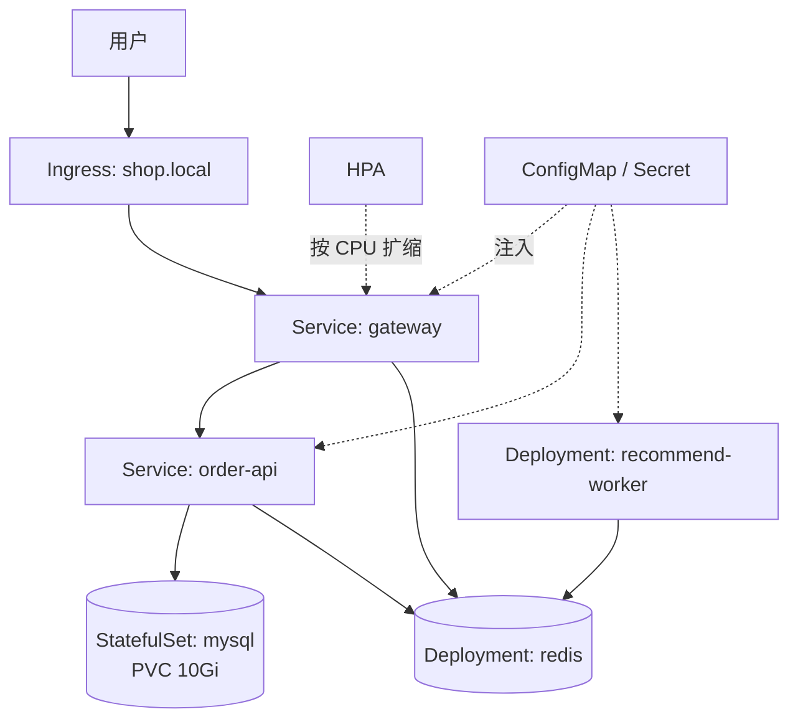

# Kubernetes 部署实战

> 核心概念解决「是什么」，本章解决「怎么落地」：把一个 Java API、一个 Python Worker、一个 Go 网关、MySQL 与 Redis 组成的多语言应用完整部署到集群，覆盖镜像凭据、配置注入、Ingress、HPA、持久化、滚动更新与故障排查。目标不是堆 YAML，而是建立可重复的交付路径：**同一套清单在本地 kind、测试集群、生产集群以相同语义运行，差异只通过环境叠加层注入**。本章清单可直接用于 [[多语言工程化/5容器与编排/03_Kubernetes核心概念|03 K8s 核心概念]] 中搭好的 kind/k3s 集群。

---

## 1 目标应用与部署架构

| 服务 | 语言 | 角色 | 副本 | 持久化 | 对外暴露 |
|------|------|------|------|--------|---------|
| gateway | Go | 唯一入口，路由与鉴权 | 2+（HPA） | 否 | 经 Ingress |
| order-api | Java | 订单读写 | 2 | 否 | 集群内 |
| recommend-worker | Python | 消费任务队列，生成推荐 | 2 | 否 | 无 |
| mysql | — | 订单主库 | 1（示例） | 是 | 集群内 |
| redis | — | 缓存与任务队列 | 1 | 可选 | 集群内 |



目录布局：`k8s/base/` 放与环境无关的清单，`k8s/overlays/{dev,prod}/` 放差异补丁，通过 `kubectl apply -k` 应用。

---

## 2 镜像推送与拉取密钥

```bash
# 构建并推送多平台镜像（CI 中执行；标签规范见第 01 章）
docker buildx build --platform linux/amd64,linux/arm64 \
  -t registry.example.com/polyglot/order-api:1.4.2 \
  -t registry.example.com/polyglot/order-api:sha-9f3c1ab --push ./services/order-api
# 创建私有仓库拉取凭据
kubectl create secret docker-registry registry-cred -n polyglot \
  --docker-server=registry.example.com \
  --docker-username=ci-bot --docker-password="$REGISTRY_TOKEN"
```

```yaml
# 挂到 default ServiceAccount：本命名空间所有 Pod 自动获得凭据
apiVersion: v1
kind: ServiceAccount
metadata: { name: default, namespace: polyglot }
imagePullSecrets: [{ name: registry-cred }]
```

排错时先分清三类事件：`401 Unauthorized` 是凭据错，`manifest unknown` 是标签不存在，`no such host` 是网络/DNS 问题。三者修复动作完全不同。

---

## 3 命名空间、配置与密钥

```yaml
# k8s/base/namespace.yaml + configmap.yaml + secret.yaml
apiVersion: v1
kind: Namespace
metadata: { name: polyglot }
---
apiVersion: v1
kind: ConfigMap
metadata: { name: app-config, namespace: polyglot }
data:
  LOG_LEVEL: info
  REDIS_ADDR: redis:6379
  ORDER_API_URL: http://order-api:8081
  OTEL_EXPORTER_OTLP_ENDPOINT: http://otel-collector:4317
---
apiVersion: v1
kind: Secret
metadata: { name: app-secret, namespace: polyglot }
type: Opaque
stringData:                        # 示例结构；生产禁止把真实值提交到 Git
  SPRING_DATASOURCE_USERNAME: app
  SPRING_DATASOURCE_PASSWORD: "change-me"
  MYSQL_ROOT_PASSWORD: "change-root"
```

| 配置类型 | 存放对象 | 更新方式 | 读取方式 |
|---------|---------|---------|---------|
| 非敏感、启动时读取 | ConfigMap（环境变量） | 改后 `rollout restart` | 各语言 `getenv` |
| 非敏感、需热加载 | ConfigMap（卷挂载） | 文件自动更新 | 应用监听文件 |
| 敏感数据 | Secret | 同上，配合密钥管理 | 环境变量或文件 |

---

## 4 无状态服务工作负载

### 4.1 Go 网关：Deployment + Service

```yaml
apiVersion: apps/v1
kind: Deployment
metadata: { name: gateway, namespace: polyglot }
spec:
  replicas: 2
  minReadySeconds: 5                   # 就绪后再观察 5 秒才算可用
  strategy:
    rollingUpdate: { maxSurge: 1, maxUnavailable: 0 }   # 先起新再停旧
  selector:
    matchLabels: { app.kubernetes.io/name: gateway }
  template:
    metadata:
      labels: { app.kubernetes.io/name: gateway }
    spec:
      securityContext: { runAsNonRoot: true, runAsUser: 10001 }
      containers:
        - name: gateway
          image: registry.example.com/polyglot/gateway:1.4.2
          ports: [{ name: http, containerPort: 8080 }]
          envFrom: [{ configMapRef: { name: app-config } }]
          resources:
            requests: { cpu: 100m, memory: 64Mi }
            limits: { cpu: 500m, memory: 128Mi }
          readinessProbe: { httpGet: { path: /healthz, port: http }, periodSeconds: 5 }
          livenessProbe: { httpGet: { path: /healthz, port: http }, periodSeconds: 10 }
          lifecycle:
            preStop: { exec: { command: ["/bin/sh", "-c", "sleep 5"] } }   # 等 Endpoint 摘除
      terminationGracePeriodSeconds: 30
---
apiVersion: v1
kind: Service
metadata: { name: gateway, namespace: polyglot }
spec:
  selector: { app.kubernetes.io/name: gateway }
  ports: [{ name: http, port: 8080, targetPort: http }]   # targetPort 引用端口名
```

### 4.2 Java 订单 API

```yaml
apiVersion: apps/v1
kind: Deployment
metadata: { name: order-api, namespace: polyglot }
spec:
  replicas: 2
  selector:
    matchLabels: { app.kubernetes.io/name: order-api }
  template:
    metadata:
      labels: { app.kubernetes.io/name: order-api }
    spec:
      containers:
        - name: api
          image: registry.example.com/polyglot/order-api:1.4.2
          ports: [{ name: http, containerPort: 8081 }]
          envFrom: [{ configMapRef: { name: app-config } }]
          env:
            - name: SPRING_DATASOURCE_URL
              value: jdbc:mysql://mysql:3306/orders?useSSL=false&allowPublicKeyRetrieval=true
            - name: SPRING_DATASOURCE_PASSWORD
              valueFrom:
                secretKeyRef: { name: app-secret, key: SPRING_DATASOURCE_PASSWORD }
            - name: JAVA_TOOL_OPTIONS
              value: "-XX:MaxRAMPercentage=75 -XX:+ExitOnOutOfMemoryError"
          resources:
            requests: { cpu: 500m, memory: 768Mi }
            limits: { cpu: "2", memory: 1Gi }
          startupProbe:                # JVM 启动慢，先用 startup 兜住（最长 120 秒）
            httpGet: { path: /actuator/health/liveness, port: http }
            periodSeconds: 5
            failureThreshold: 24
          livenessProbe: { httpGet: { path: /actuator/health/liveness, port: http }, periodSeconds: 10 }
          readinessProbe: { httpGet: { path: /actuator/health/readiness, port: http }, periodSeconds: 5 }
# order-api 的 Service 与 gateway 同构：selector 指向 app.kubernetes.io/name=order-api，port 8081
```

### 4.3 Python Worker：无 Service

```yaml
apiVersion: apps/v1
kind: Deployment
metadata: { name: recommend-worker, namespace: polyglot }
spec:
  replicas: 2
  selector:
    matchLabels: { app.kubernetes.io/name: recommend-worker }
  template:
    metadata:
      labels: { app.kubernetes.io/name: recommend-worker }
    spec:
      containers:
        - name: worker
          image: registry.example.com/polyglot/recommend:1.4.2
          command: ["python", "-m", "worker.main"]
          envFrom: [{ configMapRef: { name: app-config } }]
          env: [{ name: PYTHONUNBUFFERED, value: "1" }]   # 否则 kubectl logs 长时间空白
          resources:
            requests: { cpu: 200m, memory: 256Mi }
            limits: { cpu: "1", memory: 512Mi }
          readinessProbe:              # Worker 的就绪表示「能消费」
            exec: { command: ["sh", "-c", "test -f /tmp/worker-ready"] }
            periodSeconds: 10
```

Worker 没有 Service，因为它不被访问；扩缩容由队列积压（KEDA）或 CPU（HPA）驱动。

---

## 5 Ingress 与 HPA

```yaml
apiVersion: networking.k8s.io/v1
kind: Ingress
metadata:
  name: polyglot
  namespace: polyglot
  annotations: { nginx.ingress.kubernetes.io/proxy-body-size: "10m" }
spec:
  ingressClassName: nginx
  tls: [{ hosts: ["shop.local"], secretName: shop-tls }]   # 由 cert-manager 或手动创建
  rules:
    - host: shop.local
      http:
        paths:
          - path: /
            pathType: Prefix
            backend: { service: { name: gateway, port: { number: 8080 } } }
---
apiVersion: autoscaling/v2
kind: HorizontalPodAutoscaler
metadata: { name: gateway, namespace: polyglot }
spec:
  scaleTargetRef: { apiVersion: apps/v1, kind: Deployment, name: gateway }
  minReplicas: 2
  maxReplicas: 10
  metrics:
    - type: Resource
      resource:
        name: cpu
        target: { type: Utilization, averageUtilization: 70 }   # 基于 requests 计算
```

HPA 生效前提：安装 metrics-server，且 Pod 设置了 `requests.cpu`。HPA 只改副本数，不改资源上限；单副本资源不足时先调 requests/limits。

---

## 6 持久化存储与 MySQL StatefulSet

| 概念 | 谁创建 | 生命周期 | 说明 |
|------|--------|---------|------|
| StorageClass | 管理员 | 集群级 | 声明存储后端（本地盘、云盘、NFS） |
| PV | 动态或管理员 | 独立于 Pod | 真正的存储资源 |
| PVC | 开发者 | 独立于 Pod | 申请容量与访问模式，被 Pod 挂载 |
| volumeClaimTemplates | StatefulSet 控制器 | 每个副本一套 | 删 StatefulSet 不删 PVC |

```yaml
# 前置：Headless Service（clusterIP: None，selector 指向 mysql），StatefulSet 通过 serviceName 引用
apiVersion: apps/v1
kind: StatefulSet
metadata: { name: mysql, namespace: polyglot }
spec:
  serviceName: mysql                   # 必须指向 Headless Service
  replicas: 1
  selector:
    matchLabels: { app.kubernetes.io/name: mysql }
  template:
    metadata:
      labels: { app.kubernetes.io/name: mysql }
    spec:
      containers:
        - name: mysql
          image: mysql:8.4
          ports: [{ containerPort: 3306 }]
          env:
            - name: MYSQL_ROOT_PASSWORD
              valueFrom:
                secretKeyRef: { name: app-secret, key: MYSQL_ROOT_PASSWORD }
            - name: MYSQL_DATABASE
              value: orders
            - name: MYSQL_USER
              value: app
            - name: MYSQL_PASSWORD
              valueFrom:
                secretKeyRef: { name: app-secret, key: SPRING_DATASOURCE_PASSWORD }
          volumeMounts: [{ name: data, mountPath: /var/lib/mysql }]
          resources:
            requests: { cpu: 500m, memory: 1Gi }
            limits: { cpu: "2", memory: 2Gi }
          readinessProbe:
            exec: { command: ["sh", "-c", "mysqladmin ping -h 127.0.0.1 -uroot -p$MYSQL_ROOT_PASSWORD --silent"] }
            initialDelaySeconds: 20
            periodSeconds: 10
  volumeClaimTemplates:
    - metadata: { name: data }
      spec:
        accessModes: ["ReadWriteOnce"]
        storageClassName: standard      # kind 默认 local-path；云上用实际 SC
        resources: { requests: { storage: 10Gi } }
```

生产边界：单副本 StatefulSet 只适合演示。生产 MySQL 应使用云数据库或 Operator 解决复制、备份与故障切换。Redis 同理，缓存场景可用 Deployment + `emptyDir`，需持久化时再上 StatefulSet + PVC。

---

## 7 应用与验证

```bash
kubectl apply -k k8s/overlays/dev                    # 1. 应用清单
kubectl -n polyglot rollout status deploy/gateway --timeout=180s
kubectl -n polyglot get pods -o wide                 # 2. 检查 Pod 与端点
kubectl -n polyglot get endpoints gateway order-api
kubectl -n polyglot port-forward svc/gateway 8080:8080 &   # 3. 本地验证
curl -s localhost:8080/healthz && curl -s localhost:8080/api/orders
kubectl -n polyglot run dns-test --rm -it --image=busybox:1.36 --restart=Never -- \
  nslookup order-api.polyglot.svc.cluster.local      # 4. 验证 DNS
```

---

## 8 服务发现与 DNS

```text
<service>.<namespace>.svc.cluster.local          # 完整名，跨命名空间必须用
<service>.<namespace>                            # 跨命名空间常用简写
<service>                                        # 同命名空间简写
mysql-0.mysql.polyglot.svc.cluster.local         # StatefulSet 稳定 DNS
```

| 场景 | 地址写法 | 注意 |
|------|---------|------|
| 同命名空间互调 | `http://order-api:8081` | 推荐，环境无关 |
| 跨命名空间调用 | 全限定名 `...svc.cluster.local` | 避免搜索域歧义 |

**ndots 陷阱**：默认 `ndots:5` 会让 `api.example.com` 先尝试拼接搜索域，造成额外查询与偶发超时；可在 Pod 的 `dnsConfig` 中调整 `ndots`，或用带尾点的绝对域名。

---

## 9 滚动更新与回滚

滚动更新的过程是：控制器创建新 Pod（maxSurge 允许超出），readiness 通过后加入 Service 端点，再缩容旧 Pod；`maxUnavailable=0` 时总是先等新 Pod 就绪，因此不会出现容量缺口。`rollout undo` 依赖保留的旧 ReplicaSet。

```bash
kubectl -n polyglot set image deploy/order-api api=registry.example.com/polyglot/order-api:1.4.3
kubectl -n polyglot rollout status deploy/order-api
kubectl -n polyglot rollout history deploy/order-api
kubectl -n polyglot rollout undo deploy/order-api --to-revision=3
kubectl -n polyglot rollout restart deploy/order-api     # 改 ConfigMap/Secret 后
```

| 参数 | 作用 | 推荐值 |
|------|------|--------|
| maxSurge / maxUnavailable | 更新期间超出/不可用副本 | 1 或 25%；关键服务 maxUnavailable=0 |
| minReadySeconds | 就绪后观察期 | 5-30 秒 |
| progressDeadlineSeconds | 更新失败判定 | 300 秒 |
| revisionHistoryLimit | 保留历史版本数 | 5-10 |

注意：`rollout undo` 只回滚 Pod 模板，不会回滚 ConfigMap/Secret 内容。配置与镜像应一起版本化，这正是 [[多语言工程化/5容器与编排/05_Helm与GitOps|05 Helm 与 GitOps]] 要解决的问题。

---

## 10 环境区分：Kustomize

```yaml
# k8s/overlays/prod/kustomization.yaml
apiVersion: kustomize.config.k8s.io/v1beta1
kind: Kustomization
namespace: polyglot-prod
resources: [../../base]
images:
  - { name: registry.example.com/polyglot/gateway, newTag: 1.4.2 }
patches:
  - path: resources-patch.yaml
# resources-patch.yaml 只写要覆盖的字段：metadata.name、spec.replicas、resources 等
```

| 方案 | 适用 | 不适用 |
|------|------|--------|
| Kustomize | 结构相同的多环境叠加 | 需要复杂条件与循环 |
| Helm | 参数化模板、依赖管理、版本发布 | 模板调试成本高的小项目 |

```bash
kubectl kustomize k8s/overlays/prod | less    # 查看叠加后的最终清单
kubectl diff -k k8s/overlays/prod             # 预览将发生的变化
```

---

## 11 调试与排障

```bash
kubectl -n polyglot get pods -o wide                       # 1. 整体状态
kubectl -n polyglot describe pod <pod> | tail -30          # 2. 事件（最常用）
kubectl -n polyglot logs <pod> --previous                  # 3. 崩溃前日志
kubectl -n polyglot exec -it deploy/gateway -- sh          # 4. 有 shell 时进容器
kubectl -n polyglot debug -it <pod> --image=nicolaka/netshoot --target=api -- bash
kubectl -n polyglot top pods                               # 5. 资源用量
```

| 状态 | 典型根因 | 定位命令 | 修复 |
|------|---------|---------|------|
| ImagePullBackOff | 镜像名/标签错、无凭据、仓库不可达 | `describe pod` 事件 | 修标签、配 imagePullSecrets、查网络 |
| CrashLoopBackOff | 配置错、依赖不可达、命令错 | `logs --previous` | 修配置/依赖，必要时临时改 command 调试 |
| OOMKilled | limit 过小、JVM 堆配置不当、泄漏 | `describe pod`、`top` | 调 limit、MaxRAMPercentage、查泄漏 |
| Pending | 资源不足、亲和性无匹配、PVC 未绑定 | `describe pod` 调度事件 | 降 requests、调 affinity、查 StorageClass |
| Evicted | 节点资源/磁盘压力 | `describe node` | 加资源、清磁盘、设 requests |
| Service 无端点 | 标签不匹配、readiness 未过 | `get endpoints` | 对齐标签、查 readiness |
| Ingress 404/502 | IngressClass/端口错、Pod 未就绪 | `describe ingress`、控制器日志 | 逐层核对 |

一次典型排障：`order-api` 反复 CrashLoopBackOff，`logs --previous` 显示 `Access denied for user 'app'`，检查 Secret 发现密码与 MySQL 首次初始化时不一致（PVC 保留了旧密码的数据库）；统一密码并重建数据后恢复。

---

## 12 常见坑

| 坑 | 说明 | 规避 |
|----|------|------|
| 探针路径/端口写错 | 永远不 Ready 或反复重启 | 部署前 port-forward + curl 验证 |
| liveness 覆盖慢启动 | JVM/Dart 启动被误杀 | 用 startupProbe 保护启动期 |
| requests 不设或乱设 | 调度不准、HPA 失效、QoS 差 | 压测后设定，各语言分开画像 |
| 使用 latest 标签 | 节点缓存旧镜像，更新不生效 | 用 sha 或语义化版本 |
| Secret 提交进 Git | 泄露风险 | SealedSecrets/SOPS/External Secrets |
| StatefulSet 删除误以为数据丢失 | PVC 默认保留 | 明确数据生命周期，做好备份 |
| 只扩 HPA 不调 limit | 单副本被限流，扩副本无效 | 先保证单副本资源画像合理 |

---

## 13 本章小结

1. 完整部署 = 镜像与凭据 + 配置对象 + 工作负载 + 访问入口 + 扩缩容 + 存储 + 验证
2. 配置用 ConfigMap/Secret 注入，环境差异用 Kustomize overlay 管理，禁止手改集群
3. Service 与 DNS 提供稳定服务发现，Ingress 提供统一入口，HPA 需要 requests 与 metrics-server
4. StatefulSet + volumeClaimTemplates 是有状态服务的标准形态，生产数据库优先用托管服务或 Operator
5. 滚动更新质量由 readiness、minReadySeconds 与 maxUnavailable 决定；排障从 `describe` 事件与 `logs --previous` 入手，distroless 镜像用 `kubectl debug`

---

## 动手实践

1. **完整部署多语言应用**：在 kind 集群上用本章清单部署 gateway、order-api、worker、mysql、redis，并启用 Ingress（kind 需安装 ingress-nginx）。
   - 验收标准：`kubectl -n polyglot get pods` 全部 Running 且 READY 为 1/1；能完成一次「创建订单-查询订单」；`get endpoints` 中 gateway 与 order-api 都有地址。
2. **滚动更新与回滚演练**：把 order-api 镜像标签改为一个可用的新版本，执行更新并观察 Pod 变化，然后回滚。
   - 验收标准：记录 `kubectl get pods -w` 的输出并说明 maxSurge/maxUnavailable 的效果；回滚后标签恢复且持续 curl 不报错。
3. **故障注入与排障**：依次制造三种故障——错误镜像标签、错误数据库密码、内存 limit 设为 32Mi，分别用 describe/logs/top 定位并修复。
   - 验收标准：写出每种故障的关键事件信息与修复命令；CrashLoopBackOff 场景能用 `--previous` 找到根因。
4. **持久化验证**：删除 mysql Pod，观察 StatefulSet 重建后数据仍在；再删除 StatefulSet（保留 PVC）后重新 apply，验证数据未丢失。
   - 验收标准：重建后订单条数不变；能解释 PVC 与 StatefulSet 的生命周期关系。

---

- 返回目录：[[多语言工程化/多语言工程化目录|多语言工程化]]
