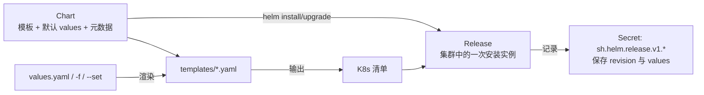
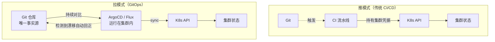

# Helm 与 GitOps

> 上一章的清单已经能跑，但多语言、多服务、多环境会迅速把 YAML 变成维护负担：dev 与 prod 只有副本数和资源不同，却复制了两份几乎相同的文件；每次发布靠人工执行 `kubectl apply`，没人知道集群当前状态对应哪个提交。Helm 解决「参数化与版本化打包」，GitOps 解决「谁在什么时候把什么变更同步到集群」。两者结合，构成多语言应用在生产环境的交付闭环。本章属于 [[多语言工程化/5容器与编排|5 容器与编排]] 的收尾，也是 [[多语言工程化/6持续交付|6 持续交付]] 的前置。

---

## 1 为什么需要包管理

### 1.1 裸 YAML 的四个问题

| 问题 | 具体表现 | 包管理的解法 |
|------|---------|-------------|
| 多环境重复 | dev/prod 清单 90% 相同 | values 分层，模板只有一份 |
| 无法参数化 | 镜像标签、副本数硬编码 | 模板变量 + `--set`/values 文件 |
| 无版本概念 | 不知道集群里是哪个版本 | Release 记录 revision 与 values |
| 无法打包复用 | 每个团队重写 Deployment | Chart 打包，跨项目复用 |

**不适用场景**：只有一两个服务、一个环境的小项目，直接用 Kustomize 或裸 YAML 更简单。引入 Helm 的前提是「同一套服务要部署到多个环境」或「清单需要被多个团队复用」。

### 1.2 Helm 与 Kustomize 的分工

Helm 负责「把应用做成可配置、可发布的包」，Kustomize 负责「对既有清单做环境叠加」。两者不冲突，常见组合是：业务 Chart 用 Helm 管理，环境差异用 Kustomize 包装，或者 Helm 的 values 本身按环境分层。

---

## 2 Helm 核心概念



| 概念 | 含义 | 类比 |
|------|------|------|
| Chart | 应用包：模板、默认值、依赖、元数据 | 软件安装包 |
| Release | Chart 在集群中的一次安装实例 | 已安装的程序 |
| values | 渲染模板的输入参数 | 配置文件 |
| template | 带 Go 模板语法的 K8s 清单 | 安装脚本 |
| revision | 每次 install/upgrade 的版本号 | 快照 |

关键认知：**Helm 只负责渲染清单并提交给 API Server，不负责持续同步**。Helm 装完之后有人手改集群，Helm 不会发现（`helm upgrade` 会覆盖回去，但 `helm list` 看不出漂移）。持续同步是 GitOps 工具（ArgoCD/Flux）的职责。

---

## 3 Chart 结构

```text
charts/polyglot/
├── Chart.yaml              # 元数据：名称、版本、appVersion、依赖
├── values.yaml             # 默认值；values-dev.yaml / values-prod.yaml 为环境覆盖
├── .helmignore             # 打包时排除的文件
├── templates/
│   ├── _helpers.tpl        # 命名模板（下划线开头不渲染为清单）
│   ├── NOTES.txt           # 安装后提示信息
│   ├── configmap.yaml / deployment.yaml / service.yaml / ingress.yaml / hpa.yaml
└── charts/                 # 本地子 Chart：gateway / order-api / worker
```

```yaml
# Chart.yaml
apiVersion: v2
name: polyglot
description: 多语言电商示例应用（Go 网关 + Java API + Python Worker）
type: application
version: 1.4.0            # Chart 版本，遵循 SemVer，每次改模板都要升
appVersion: "1.4.2"       # 应用版本，通常对应镜像标签
kubeVersion: ">=1.27.0-0"
dependencies:
  - { name: redis, version: "19.x.x", repository: "https://charts.bitnami.com/bitnami", condition: redis.enabled }
```

`version` 与 `appVersion` 是新手最常混淆的一对：改 values 或模板必须升 `version`，否则 `helm upgrade` 可能不产生新 revision；`appVersion` 只是元数据，是否用它作为镜像标签由模板决定。

---

## 4 模板语法

### 4.1 内置对象与常用语法

| 语法 | 含义 | 示例 |
|------|------|------|
| `{{ .Values.x }}` | 读取 values | `{{ .Values.services.gateway.port }}` |
| `{{ .Release.Name }}` | Release 名 | 用于资源命名前缀 |
| `{{ .Chart.AppVersion }}` | Chart 的应用版本 | 默认镜像标签 |
| `{{ include "tpl" . }}` | 引用命名模板 | 复用标签块 |
| `{{ nindent N }}` | 换行并缩进 | 块内容嵌入 |
| `{{- if / else / end }}` | 条件 | 可选组件开关 |
| `{{- range }}` | 循环 | 遍历多服务 |
| `{{ toYaml .Values.x \| nindent 4 }}` | 对象转 YAML | 资源块 |

### 4.2 _helpers.tpl

```gotemplate
{{/* 基础名称，最多 63 字符 */}}
{{- define "polyglot.name" -}}
{{- default .Chart.Name .Values.nameOverride | trunc 63 | trimSuffix "-" -}}
{{- end -}}

{{/* 统一标签：所有资源共用，监控与选择器依赖它 */}}
{{- define "polyglot.labels" -}}
app.kubernetes.io/name: {{ include "polyglot.name" . }}
app.kubernetes.io/instance: {{ .Release.Name }}
app.kubernetes.io/version: {{ .Chart.AppVersion | quote }}
app.kubernetes.io/managed-by: {{ .Release.Service }}
helm.sh/chart: {{ printf "%s-%s" .Chart.Name .Chart.Version | replace "+" "_" }}
{{- end -}}
```

### 4.3 用 range 渲染多语言服务

```yaml
# templates/deployment.yaml：一个模板渲染所有服务
{{- range $name, $svc := .Values.services }}
{{- if $svc.enabled }}
---
apiVersion: apps/v1
kind: Deployment
metadata:
  name: {{ $name }}
  labels:
    {{- include "polyglot.labels" $ | nindent 4 }}
    app.kubernetes.io/component: {{ $name }}
spec:
  replicas: {{ $svc.replicaCount | default 1 }}
  selector:
    matchLabels:
      app.kubernetes.io/name: {{ $name }}
      app.kubernetes.io/instance: {{ $.Release.Name }}
  template:
    metadata:
      labels:
        app.kubernetes.io/name: {{ $name }}
        app.kubernetes.io/instance: {{ $.Release.Name }}
    spec:
      imagePullSecrets:
        {{- toYaml $.Values.global.imagePullSecrets | nindent 8 }}
      containers:
        - name: {{ $name }}
          image: "{{ $.Values.global.imageRegistry }}/{{ $svc.image.repository }}:{{ $svc.image.tag | default $.Chart.AppVersion }}"
          ports: [{ name: http, containerPort: {{ $svc.port }} }]
          envFrom: [{ configMapRef: { name: app-config } }]
          resources:
            {{- toYaml $svc.resources | nindent 12 }}
          readinessProbe:
            {{- toYaml $svc.readinessProbe | nindent 12 }}
{{- end }}
{{- end }}
```

注意 `range` 内 `$` 始终指向根上下文，`$.Release.Name` 是正确写法；漏掉 `$` 会在渲染时报 `nil pointer`。

### 4.4 values 设计

```yaml
# values.yaml：默认值面向本地开发
global:
  imageRegistry: registry.example.com/polyglot
  imagePullSecrets: [{ name: registry-cred }]

services:
  gateway:
    enabled: true
    image: { repository: gateway, tag: "" }   # tag 为空则用 .Chart.AppVersion
    replicaCount: 2
    port: 8080
    resources:
      requests: { cpu: 100m, memory: 64Mi }
      limits: { cpu: 500m, memory: 128Mi }
    readinessProbe: { httpGet: { path: /healthz, port: http }, periodSeconds: 5 }

  order-api:
    enabled: true
    image: { repository: order-api, tag: "" }
    replicaCount: 2
    port: 8081
    resources:
      requests: { cpu: 500m, memory: 768Mi }
      limits: { cpu: "2", memory: 1Gi }
    readinessProbe: { httpGet: { path: /actuator/health/readiness, port: http }, periodSeconds: 5 }

  recommend-worker:
    enabled: true
    image: { repository: recommend, tag: "" }
    replicaCount: 2
    port: 9100
    resources:
      requests: { cpu: 200m, memory: 256Mi }
      limits: { cpu: "1", memory: 512Mi }

ingress: { enabled: true, className: nginx, host: shop.local }
redis: { enabled: true }
```

```yaml
# values-prod.yaml：只写与默认值的差异
services:
  order-api:
    replicaCount: 4
    resources:
      requests: { cpu: "1", memory: 1Gi }
      limits: { cpu: "4", memory: 2Gi }
ingress: { host: shop.example.com }
hpa: { enabled: true, minReplicas: 3, maxReplicas: 20, targetCPUUtilizationPercentage: 65 }
```

### 4.5 values 优先级

从低到高：子 Chart 的 `values.yaml` → 父 Chart 的 `values.yaml`（同名键覆盖子 Chart）→ `-f` 指定的文件（后者覆盖前者）→ `--set`/`--set-string`（最高，适合 CI 注入镜像标签）。

```bash
helm get values polyglot -n polyglot-prod --all   # 排查「为什么渲染结果不对」的第一步
```

---

## 5 子 Chart 与 umbrella chart

多服务项目的两种组织方式：

| 方式 | 结构 | 适用 | 不适用 |
|------|------|------|--------|
| 单 Chart + range | 一个 Chart 内遍历服务列表 | 服务同质、模板差异小 | 每个服务模板差异大 |
| Umbrella Chart + 子 Chart | 每个服务一个 Chart，父 Chart 聚合 | 服务由不同团队维护、可独立发布 | 小项目，增加复杂度 |

```yaml
# 子 Chart 依赖声明（本地路径或远程仓库）
dependencies:
  - { name: gateway, version: "0.1.0", repository: "file://charts/gateway", condition: gateway.enabled }
  - { name: kafka, version: "30.x.x", repository: "https://charts.bitnami.com/bitnami", condition: kafka.enabled }
```

```bash
helm dependency update ./charts/polyglot      # 拉取依赖并生成 Chart.lock
helm template polyglot ./charts/polyglot --show-only charts/gateway/templates/deployment.yaml
```

umbrella chart 的代价：任何子 Chart 升级都会触发父 Chart 版本变更；多团队并行开发时 `Chart.lock` 冲突频繁。团队规模大时，更常见的做法是「每个服务一个 Chart，环境仓库用 ArgoCD ApplicationSet 聚合」。

---

## 6 Helm 与 Kustomize 对比

| 维度 | Helm | Kustomize |
|------|------|-----------|
| 参数化方式 | Go 模板 + values | 补丁（patch/overlay） |
| 学习曲线 | 高（模板语法、作用域） | 低（就是 YAML 叠加） |
| 依赖管理 | 内置（subcharts、仓库） | 无 |
| 发布版本与回滚 | 内置 Release/revision/rollback | 无（靠 Git） |
| 清单可读性 | 渲染后才可读，调试成本高 | 输入输出都是 YAML |
| 适合场景 | 需要跨环境参数化、打包复用、版本发布 | 环境叠加、轻量定制、已有成熟清单 |
| 不适合场景 | 只有细微差异的小项目、团队不熟悉模板 | 需要复杂逻辑与依赖管理 |

组合策略（推荐）：**Chart 管应用，Kustomize 管环境**，或者 **Helm 的 values 按环境分层**。选择一种即可，不要两套参数化体系混用，否则「这个值到底从哪来」会成为长期负担。

Helm 的局限与替代：

| 工具 | 定位 | 适用 |
|------|------|------|
| helmfile | 用声明式文件编排多个 Helm Release | 多 Release、多环境统一管理 |
| Timoni | 基于 CUE 的现代包管理 | 想摆脱 Go 模板、需要类型安全 |
| cdk8s | 用 TypeScript/Python 生成清单 | 开发团队熟悉编程语言、逻辑复杂 |

这些工具解决的是「Helm 模板表达力不足」或「多 Release 编排」，但都未形成 Helm 级别的生态。除非团队已被模板问题严重困扰，否则优先把 Helm 用好。

---

## 7 GitOps：概念与工作流

### 7.1 推模式 vs 拉模式



| 维度 | 推模式 | 拉模式（GitOps） |
|------|--------|-----------------|
| 凭据位置 | CI 持有集群凭据 | 集群内组件持有 Git 只读凭据 |
| 漂移检测 | 无 | 持续对比并自动或手动同步 |
| 适用 | 小团队、发布频率低 | 多集群、多环境、强审计要求 |
| 不适用 | 需要严格 GitOps 审计的场景 | 集群无法访问 Git（需配代理） |

GitOps 的四条原则：**声明式**（所有状态可描述）、**版本化且不可变**（Git 为唯一事实源）、**自动拉取**（agent 主动同步）、**持续协调**（不断把实际状态拉回期望状态）。

### 7.2 ArgoCD 与 Flux 对比

| 维度 | ArgoCD | Flux |
|------|--------|------|
| 架构 | 中心化 Application CRD + UI/API | 一组控制器（source/kustomize/helm/notification） |
| 界面 | 内置 Web UI，可视化资源树 | 无官方 UI（可用 Weave GitOps 等） |
| 多集群 | 单实例管理多个集群，成熟 | 支持，通常每集群部署一套 |
| Helm 支持 | 原生（也可用 Helm 渲染后再同步） | HelmRelease CRD |
| 上手难度 | 低（UI 直观） | 中（纯 CRD，习惯 CLI） |
| 适用场景 | 需要可视化、多集群、多团队共享 | 追求轻量、控制器组合的平台团队 |

### 7.3 ArgoCD 工作流

```yaml
# argocd/prod-app.yaml：Application 是 ArgoCD 的核心对象
apiVersion: argoproj.io/v1alpha1
kind: Application
metadata: { name: polyglot-prod, namespace: argocd }
spec:
  project: default
  source:
    repoURL: https://github.com/example/polyglot-deploy.git
    targetRevision: main
    path: envs/prod
    helm: { valueFiles: [values-prod.yaml] }
  destination:
    server: https://kubernetes.default.svc
    namespace: polyglot-prod
  syncPolicy:
    automated: { prune: true, selfHeal: true }   # 删除 Git 中已移除的资源；手改自动回正
    syncOptions: [CreateNamespace=true, ServerSideApply=true]
```

| 概念 | 含义 | 排查用途 |
|------|------|---------|
| Application | 「哪个 Git 路径部署到哪个集群/命名空间」 | 同步失败第一站 |
| Sync | 把 Git 状态应用到集群 | 手动 Sync 前先看 Diff |
| Health | 资源是否健康（基于状态与探针） | Degraded 时看资源树定位 |
| Rollback | 回滚到某个历史 revision | 应急，但更推荐 `git revert` |

回滚的正确姿势：GitOps 下应 **`git revert` 产生新提交**，由 ArgoCD 同步；用 ArgoCD 的 Rollback 按钮会造成 Git 与集群状态不一致，下一轮同步又把旧版本拉回来。同理，禁止 `kubectl edit` 生产资源——`selfHeal: true` 会在几分钟内改回去，看似「灵异事件」。

---

## 8 多环境仓库布局

推荐「应用仓库」与「部署仓库」分离：

```text
polyglot-deploy/                 # 部署仓库（GitOps 事实源）
├── charts/
│   └── polyglot/                # 应用 Chart（版本化）
├── envs/
│   ├── dev/
│   │   ├── kustomization.yaml
│   │   └── values-dev.yaml
│   ├── staging/
│   │   └── values-staging.yaml
│   └── prod/
│       └── values-prod.yaml
└── argocd/
    ├── dev-app.yaml
    ├── staging-app.yaml
    └── prod-app.yaml
```

| 策略 | 做法 | 适用 | 缺点 |
|------|------|------|------|
| 目录分支（trunk-based） | 同一分支下 `envs/dev`、`envs/prod` | 大多数团队，推荐 | 需要 CI 保证只有合并到 main 才能动 prod |
| 环境分支 | `dev`/`prod` 分支各自维护 | 环境差异大、发布节奏完全不同 | 分支合并冲突多 |

环境升级流程：CI 构建镜像并推送，然后向部署仓库的 `envs/dev` 提交新镜像标签 PR；验证通过后向 `envs/prod` 提 PR，合并即发布。回滚就是 revert 那个提交。**镜像标签永远用 sha 或语义化版本，不用 latest**。

---

## 9 密钥管理

| 方案 | 原理 | 适用 | 不适用 |
|------|------|------|--------|
| SealedSecrets | 用集群公钥加密，只有目标集群能解密 | 单集群、纯 GitOps | 多集群共用同一份密文 |
| SOPS + age/KMS | 按文件加密，Git 中存密文 | 多集群、需要与其他工具集成 | 需要运行时动态轮换 |
| External Secrets Operator | 从 Vault/云 Secrets Manager 拉取 | 已有密钥管理系统、动态轮换 | 无外部密钥系统的小项目 |

```bash
# SealedSecrets 示例：加密后即可安全提交 Git
kubeseal --format yaml < secret.yaml > sealed-secret.yaml

# SOPS 示例
sops --encrypt --age age1xxxx --encrypted-regex '^(data|stringData)$' secret.yaml > secret.enc.yaml
```

GitOps 的底线：**Git 里只能出现密文或引用**。ArgoCD 与 Flux 都不会替你管理密钥生命周期，需要单独选型并明确轮换流程。

---

## 10 常见坑

| 坑 | 症状 | 规避 |
|----|------|------|
| 模板渲染错误难定位 | `helm install` 报错但不知哪行 | `helm template --debug`；`--show-only` 单个文件 |
| values 类型错误 | 数字被当字符串，`replicas: "2"` 被拒绝 | 明确使用 `--set-string` 或 `| quote` |
| 改了 values 没升 Chart 版本 | 没有新 revision | 每次改动升 `version`，或 CI 强制检查 |
| `helm upgrade` 丢手改 | 手改被覆盖 | 所有变更走 Git；用 ArgoCD selfHeal 兜底 |
| CRD 不随 Chart 升级 | 新版本 CRD 未安装 | CRD 单独管理，或用支持 CRD 升级的流程 |
| Helm hook 顺序出错 | 迁移 Job 在 DB 就绪前运行 | 用 hook 权重与重试，或 Init Container 等待依赖 |
| `--atomic` 未使用 | 升级失败后集群处于半坏状态 | 生产统一加 `--atomic --timeout 5m` |
| ArgoCD 一直 OutOfSync | 默认值或 API 默认字段差异 | 用 `ignoreDifferences` 处理，不要盲目 Sync |
| `lookup` 函数在 ArgoCD 返回空 | 渲染时无集群上下文 | 避免用 `lookup`，或接受其限制 |
| 密钥进了 Git 历史 | 泄露且难以清除 | 提交前扫描（gitleaks），泄露后轮换密钥而非只删文件 |

Helm 日常命令速查：

```bash
helm lint ./charts/polyglot -f values-prod.yaml        # 静态检查
helm template polyglot ./charts/polyglot -f values-prod.yaml > /tmp/rendered.yaml
helm upgrade --install polyglot ./charts/polyglot -n polyglot-prod \
  --create-namespace -f values-prod.yaml --atomic --timeout 5m
helm history polyglot -n polyglot-prod
helm rollback polyglot 3 -n polyglot-prod
helm get manifest polyglot -n polyglot-prod            # 查看实际提交的清单
```

---

## 11 本章小结

1. Helm 用 Chart 打包、values 参数化、Release 记录版本，解决多环境与复用问题
2. `_helpers.tpl` 统一命名与标签，`range` 让一个模板渲染多个语言的服务
3. 子 Chart 适合多团队维护的服务，单 Chart + range 适合同质服务；不要过度设计
4. GitOps 以 Git 为唯一事实源，拉模式让集群主动同步并自动纠正漂移
5. ArgoCD 适合需要可视化与多集群的团队，Flux 适合偏好轻量控制器的团队
6. 密钥永远以密文或引用形式进入 Git，回滚优先 `git revert` 而非手动 rollback

---

## 动手实践

1. **把上一章清单改造成 Chart**：将 gateway、order-api、worker 抽象为 values 中的服务列表，用 `range` 渲染；提供 `values-dev.yaml` 与 `values-prod.yaml`，两者只在副本数、资源、域名上有差异。
   - 验收标准：`helm lint` 通过；`helm template` 渲染出的清单与上一章手写版本功能等价；`helm upgrade --install` 部署成功且 `helm get values` 能看到覆盖后的值。
2. **模板调试练习**：故意引入三个错误——`range` 内漏 `$`、values 缩进错误、helper 名称拼错，分别记录报错信息并修复。
   - 验收标准：能说出每类错误的关键报错行；用 `--show-only` 快速定位到具体模板文件。
3. **搭建 ArgoCD GitOps 闭环**：在 kind 集群安装 ArgoCD，创建一个指向本地 Git 仓库（可用 Gitea 或 GitHub 私有仓库）的 Application，实现「改 values 提交 → 自动同步」。
   - 验收标准：Application 状态为 Synced/Healthy；手动 `kubectl edit` 改副本数后能在 UI 中看到 OutOfSync 并被 selfHeal 改回；`git revert` 后集群回到旧版本。
4. **密钥方案对比实验**：分别用 SealedSecrets 与 SOPS 加密同一个数据库密码并提交到仓库，部署后验证应用能读到明文。
   - 验收标准：仓库中只有密文；Pod 内环境变量为明文；写出两种方案在轮换密钥时的操作步骤差异。

---

- 返回目录：[[多语言工程化/多语言工程化目录|多语言工程化]]
