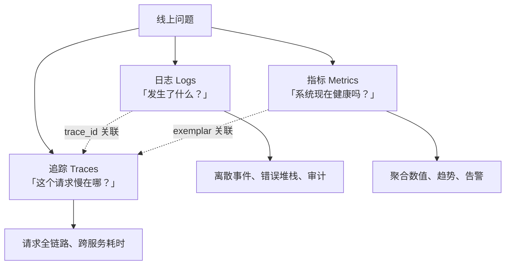
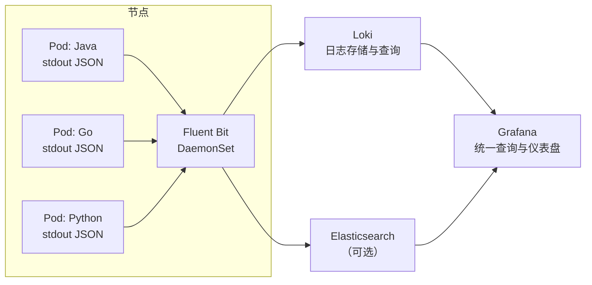
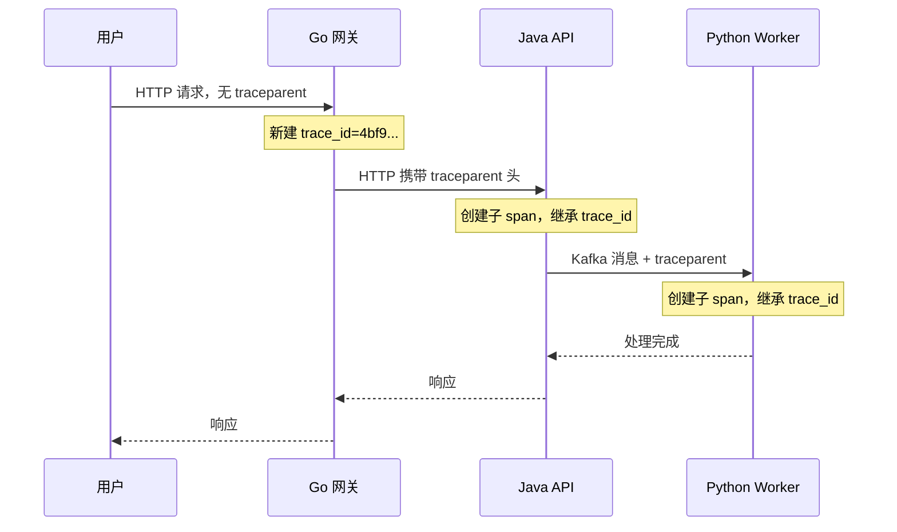
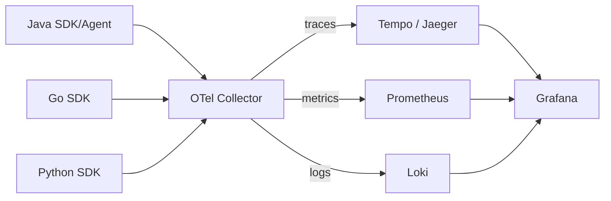

# 可观测性

> 多语言系统最痛的时刻，是线上出问题时「不知道发生了什么」：Go 网关报 500，Java API 日志里什么都没有，Python Worker 在悄悄重试。容器与 K8s 让服务可以随时被重建，却也让「登上机器看日志」的传统手段失效。可观测性不是装一个监控工具，而是让系统主动回答三个问题：**出了什么问题（日志）、系统健康吗（指标）、这个请求慢在哪（追踪）**。本章从多语言视角统一三支柱的数据约定与工具链，目标是任何语言的服务都遵循同一套日志、指标、追踪规范，排障时能用一个 `trace_id` 串起全部证据。

---

## 1 三支柱与它们回答的问题



| 支柱 | 数据形态 | 成本 | 回答的问题 | 不擅长 |
|------|---------|------|-----------|--------|
| 日志 | 离散事件，可全文检索 | 高（量大） | 具体错误与上下文 | 全局趋势、聚合统计 |
| 指标 | 数值时间序列，聚合 | 低 | 健康度、容量、告警 | 单个请求的细节 |
| 追踪 | 调用链 Span | 中 | 跨服务延迟与依赖 | 长期历史、高频全量采集 |

三者的关系不是替代而是互补：指标发现异常，追踪定位到具体服务与调用，日志给出根因细节。多语言系统的挑战在于三种数据由不同语言的库产生，必须先统一**数据格式与关联字段**，否则工具装了也串不起来。

### 1.1 统一约定（全语言必须遵守）

| 约定 | 内容 |
|------|------|
| 日志输出 | 一律 JSON 到 stdout，不写文件 |
| 时间格式 | UTC，RFC3339 带毫秒，如 `2026-09-12T10:15:30.123Z` |
| 必填字段 | `timestamp`、`level`、`service`、`version`、`message` |
| 关联字段 | `trace_id`、`span_id`（有则必填） |
| 指标命名 | `<namespace>_<subsystem>_<name>_<unit>`，如 `http_server_requests_seconds` |
| 资源属性 | `service.name`、`service.version`、`deployment.environment` |
| 敏感信息 | 不记录密码、token、完整身份证号；必要时脱敏 |

---

## 2 结构化日志

### 2.1 JSON 日志格式

```json
{
  "timestamp": "2026-09-12T10:15:30.123Z",
  "level": "ERROR",
  "service": "order-api",
  "version": "1.4.2",
  "trace_id": "4bf92f3577b34da6a3ce929d0e0e4736",
  "span_id": "00f067aa0ba902b7",
  "message": "failed to create order",
  "order_id": "10023",
  "error.type": "java.sql.SQLTransientConnectionException",
  "duration_ms": 3021
}
```

约定字段名的理由：`timestamp`/`level`/`message` 是绝大多数采集器的默认识别字段；`trace_id`/`span_id` 是 W3C TraceContext 的标准字段，可直接与追踪系统关联；自定义字段用扁平命名（`order_id` 而非嵌套对象），便于 Loki/ES 查询。

### 2.2 各语言日志库

| 语言 | 推荐组合 | 结构化输出方式 | 备注 |
|------|---------|--------------|------|
| Java | SLF4J + Logback | `logstash-logback-encoder` 输出 JSON | 生态最成熟，MDC 放 trace_id |
| Python | structlog 或 logging + python-json-logger | `structlog.processors.JSONRenderer` | structlog 的 contextvars 天然适配异步 |
| Go | log/slog（1.21+）或 zap | `slog.NewJSONHandler` | 标准库已够用，zap 性能更高 |
| Node/TS | pino | 默认 JSON | 比 winston 快，注意序列化错误对象 |
| Rust | tracing + tracing-subscriber | `json` feature | span 可自动带字段 |
| Dart | logging + 自定义 JSON formatter | `Logger` 输出 JSON | 服务端日志库生态较弱，常手写 formatter |
| C++ | spdlog | `spdlog::sinks::json_sink` 或自定义 | 注意多线程写入与异步 sink |

Python structlog 示例：

```python
import structlog
import logging

# 统一配置：JSON 输出 + 时间戳 + trace_id 注入
structlog.configure(
    processors=[
        structlog.contextvars.merge_contextvars,          # 注入请求级上下文
        structlog.processors.add_log_level,
        structlog.processors.TimeStamper(fmt="iso", utc=True),
        structlog.processors.StackInfoRenderer(),
        structlog.processors.format_exc_info,
        structlog.processors.JSONRenderer(ensure_ascii=False),
    ],
    wrapper_class=structlog.make_filtering_bound_logger(logging.INFO),
    cache_logger_on_first_use=True,
)

log = structlog.get_logger(service="recommend-worker", version="1.4.2")
log.info("task consumed", task_id="t-100", duration_ms=42)
```

Go slog 示例：

```go
// 统一 JSON 日志；trace_id 从 context 中取出后附加
handler := slog.NewJSONHandler(os.Stdout, &slog.HandlerOptions{Level: slog.LevelInfo})
logger := slog.New(handler).With("service", "gateway", "version", version)

logger.Info("request completed",
    "method", r.Method,
    "path", r.URL.Path,
    "status", status,
    "duration_ms", time.Since(start).Milliseconds(),
    "trace_id", traceIDFromContext(r.Context()),
)
```

### 2.3 日志级别与采样

| 级别 | 使用场景 | 生产默认 |
|------|---------|---------|
| ERROR | 需要人介入的失败 | 全部保留 |
| WARN | 可自愈但需关注 | 全部保留 |
| INFO | 关键业务事件（订单创建、任务完成） | 保留，注意控制量 |
| DEBUG | 排障细节 | 默认关闭，按需动态开启 |
| TRACE | 逐帧细节 | 禁止在生产默认开启 |

高流量服务（网关、Worker）的 INFO 日志可能达到每秒数万条。两个手段：**动态日志级别**（通过配置中心或 actuator 在排障时临时开 DEBUG）与**采样**（对成功请求按比例记录，错误请求全量记录）。注意：日志采样不能替代追踪采样，两者的目的不同。

### 2.4 日志收集架构



| 采集方案 | 适用 | 不适用 |
|---------|------|--------|
| Fluent Bit（DaemonSet） | K8s 标准方案，资源占用低 | 需要复杂处理逻辑（用 Fluentd） |
| Fluentd | 插件丰富、复杂路由与转换 | 资源受限的节点 |
| Vector | 高性能、Rust 实现、可做聚合 | 团队无运维能力时 |
| 应用直推 Loki | 无节点权限的托管环境 | 需要统一采集策略的集群 |
| Promtail | 与 Loki 配套、配置简单 | 需要多目的地输出的场景 |

K8s 中的关键实践：应用只写 stdout，采集器以 DaemonSet 方式部署（概念见 [[多语言工程化/5容器与编排/03_Kubernetes核心概念|03 K8s 核心概念]]），从 `/var/log/containers/` 读取并附加 Pod 标签（`namespace`、`pod`、`container`、`app`）。不要在应用里自己写文件再挂卷采集——容器重建后文件随之消失，且多了一层维护。

---

## 3 指标

### 3.1 Prometheus 数据模型

每条时间序列由**指标名 + 标签集**唯一确定，样本是 `(timestamp, value)`：

```text
http_requests_total{service="gateway", method="GET", path="/api/orders", status="200"} 1027
```

| 指标类型 | 语义 | 适用 | 不适用 |
|---------|------|------|--------|
| Counter | 只增不减的累计值 | 请求数、错误数、处理字节数 | 会减少的值（如队列长度） |
| Gauge | 可增可减的瞬时值 | 内存使用、连接数、队列长度 | 需要求速率的总量 |
| Histogram | 分桶统计分布 | 请求延迟、响应大小 | 需要精确分位数的场景（用 Summary） |
| Summary | 客户端计算分位数 | 单实例精确分位 | 需要跨实例聚合分位数 |

延迟指标优先用 Histogram：它可以在服务端聚合后计算全局 P99，而 Summary 的分位数无法跨实例合并。

### 3.2 各语言客户端库

| 语言 | 客户端库 | 与框架集成 |
|------|---------|-----------|
| Java | Micrometer（+ Prometheus registry） | Spring Boot Actuator 自动暴露 `/actuator/prometheus` |
| Python | prometheus_client | FastAPI/Flask 需手动中间件或 instrumentator |
| Go | prometheus/client_golang | `promhttp.Handler()`，gRPC 有拦截器 |
| Node/TS | prom-client | 需自行暴露 `/metrics` |
| Rust | metrics + metrics-exporter-prometheus | 需手动初始化 |
| Dart | prometheus_client（社区） | 生态较弱，常自建简单 exporter |
| C++ | prometheus-cpp | 需手动注册与暴露 |

统一约定：每个服务暴露 `/metrics`（HTTP）或 `:9090`（非 HTTP 服务），由 Prometheus 抓取。Java 的 Actuator 默认包含大量 JVM 指标，其他语言需要自己补充**运行时指标**（GC、goroutine 数、事件循环延迟）。

### 3.3 RED 与 USE 方法

| 方法 | 适用对象 | 指标 |
|------|---------|------|
| RED | 请求驱动的服务（API、网关、Worker） | Rate（速率）、Errors（错误率）、Duration（延迟分布） |
| USE | 资源（CPU、内存、磁盘、网络） | Utilization（使用率）、Saturation（饱和度）、Errors（错误） |

多语言服务的监控基线：所有服务都要有 RED；所有节点与中间件都要有 USE。只有 CPU 使用率而没有错误率和延迟，等于没有监控。

### 3.4 PromQL 入门

```promql
# 网关每秒请求数（按路由）
sum by (path) (rate(http_requests_total{service="gateway"}[5m]))

# 5xx 错误率（百分比）
100 * sum(rate(http_requests_total{status=~"5.."}[5m]))
    / sum(rate(http_requests_total[5m]))

# P99 延迟（基于 Histogram）
histogram_quantile(0.99,
  sum by (le, service) (rate(http_request_duration_seconds_bucket[5m])))

# 服务是否在线（up=0 表示抓取失败）
up{job="polyglot"}
```

告警规则示例：

```yaml
groups:
  - name: polyglot-slo
    rules:
      # 5 分钟内 5xx 占比超过 5% 持续 10 分钟
      - alert: HighErrorRate
        expr: |
          sum(rate(http_requests_total{status=~"5.."}[5m]))
          / sum(rate(http_requests_total[5m])) > 0.05
        for: 10m
        labels:
          severity: critical
        annotations:
          summary: "服务 {{ $labels.service }} 错误率过高"
          runbook: "https://wiki.example.com/runbooks/high-error-rate"
      # P99 延迟超过 1 秒
      - alert: HighLatencyP99
        expr: |
          histogram_quantile(0.99,
            sum by (le, service) (rate(http_request_duration_seconds_bucket[5m]))) > 1
        for: 10m
        labels:
          severity: warning
```

告警规则的原则：**告警必须可行动**。`CPU 超过 80%` 不是告警，是噪音；`错误率超过 SLO 且错误预算消耗过快` 才是告警。Alertmanager 负责分组、抑制、静默与路由（邮件、Slack、PagerDuty）。

---

## 4 链路追踪

### 4.1 Trace、Span 与上下文传播

一次请求从 Go 网关进入，调用 Java API，再触发 Python Worker，这条完整路径是一个 **Trace**；其中每次调用（HTTP、gRPC、数据库、消息消费）是一个 **Span**。跨服务传播靠 HTTP header 中的 `traceparent`（W3C TraceContext 标准），格式为 `版本-trace_id-span_id-采样标志`：

```text
traceparent: 00-4bf92f3577b34da6a3ce929d0e0e4736-00f067aa0ba902b7-01
```

| 字段 | 示例值 | 长度 | 说明 |
|------|--------|------|------|
| 版本 | `00` | 2 位十六进制 | 当前标准固定为 00 |
| trace_id | `4bf92f3577b34da6a3ce929d0e0e4736` | 32 位十六进制 | 全链路唯一 ID，由入口服务生成 |
| span_id | `00f067aa0ba902b7` | 16 位十六进制 | 当前调用的 span ID，每次调用新建 |
| 采样标志 | `01` | 2 位十六进制 | 01 采样、00 不采样，决定是否上报后端 |



跨进程传播媒介不同：HTTP 用 header，gRPC 用 metadata，Kafka/RabbitMQ 用消息 header（需要显式注入与提取，很多团队漏掉这一步，导致链路在消息队列处断开）。

### 4.2 OpenTelemetry 架构



| 组件 | 作用 | 说明 |
|------|------|------|
| API/SDK | 各语言生成遥测数据 | 统一语义约定（Semantic Conventions） |
| Collector | 接收、处理、导出 | 采样、脱敏、批处理、多目的地 |
| OTLP | 传输协议 | gRPC/HTTP，厂商中立 |
| Backend | 存储与查询 | Tempo/Jaeger（追踪）、Prometheus（指标）、Loki（日志） |

各语言 SDK 成熟度：

| 语言 | 追踪 | 指标 | 日志 | 备注 |
|------|------|------|------|------|
| Java | 稳定（支持自动埋点 Agent） | 稳定 | 稳定 | 零代码改动可接入 |
| Python | 稳定 | 稳定 | 开发中 | 自动埋点覆盖常用框架 |
| Go | 稳定 | 稳定 | 稳定 | 需显式埋点较多 |
| Node/TS | 稳定 | 稳定 | 稳定 | 自动埋点覆盖主流框架 |
| Rust | 稳定 | 稳定 | 开发中 | 生态相对年轻 |
| Dart | 实验性 | 实验性 | 实验性 | 需自行封装 HTTP 拦截器 |
| C++ | 稳定 | 稳定 | 开发中 | 手动埋点为主 |

### 4.3 后端选型

| 方案 | 适用 | 不适用 |
|------|------|--------|
| Grafana Tempo | 与 Loki/Prometheus/Grafana 同栈、成本敏感 | 需要复杂查询语言（TraceQL 较新） |
| Jaeger | 独立部署、UI 成熟、生态广 | 与 Grafana 栈整合不如 Tempo 自然 |
| Zipkin | 轻量、老系统集成 | 大规模与高吞吐场景 |
| 商业 APM | 需要开箱即用与专家支持 | 数据主权、成本敏感 |

---

## 5 跨服务关联：trace_id 贯穿一切

三支柱的黏合剂是 `trace_id`。落地方式：

1. 入口服务（网关）从 `traceparent` 提取或生成 `trace_id`
2. 应用日志框架自动把 `trace_id` 写入每条日志（Java 用 MDC + OTel Agent，Python 用 contextvars，Go 用 context）
3. 调用下游时自动注入 `traceparent`
4. 在 Grafana 中从指标 exemplar 或日志跳到追踪详情

```bash
# 排障示例：从 Loki 找到一条错误日志，拿到 trace_id，再查完整链路
# 1. Loki 查询
{namespace="polyglot", app="order-api"} |= "ERROR" | json | line_format "{{.trace_id}} {{.message}}"

# 2. Tempo/Jaeger 用 trace_id 查询
# 3. 在追踪中发现耗时集中在 MySQL 调用，结合 MySQL 慢查询日志定位
```

没有统一 `trace_id` 的多语言系统，排障只能靠猜；有了它，跨语言的调用链第一次成为一份可读的证据。

---

## 6 Grafana、告警与 SLO

### 6.1 仪表盘分层

| 层级 | 受众 | 内容 |
|------|------|------|
| 业务大盘 | 产品/管理层 | 订单量、成功率、核心漏斗 |
| 服务大盘 | 开发团队 | 每服务的 RED 指标、依赖健康 |
| 资源大盘 | 运维 | 节点 USE、中间件状态、容量趋势 |
| 排障视图 | on-call | 日志流、追踪搜索、错误 Top N |

Grafana 的原则：**每个面板都要能回答一个具体问题**。堆 50 个面板的大盘等于没有大盘。告警直接链接到对应面板与 runbook。

### 6.2 SLI、SLO 与错误预算

| 概念 | 定义 | 示例 |
|------|------|------|
| SLI | 可测量的服务质量指标 | 成功请求占比、P99 延迟 |
| SLO | SLI 的目标值 | 99.9% 请求成功（30 天窗口） |
| SLA | 对外的合同承诺 | 低于 SLO，含赔偿条款 |
| 错误预算 | 1 - SLO 允许的失败量 | 0.1% × 总请求数 |

错误预算驱动决策：预算充足时可以加快发布；预算耗尽则冻结变更、优先修复稳定性。基于错误预算的告警（burn rate）比单点阈值告警更符合业务：它直接回答「按当前错误速度，多久会耗尽预算」。

---

## 7 OpenTelemetry Collector 部署模式

| 模式 | 部署方式 | 优点 | 缺点 | 适用 |
|------|---------|------|------|------|
| Agent（DaemonSet） | 每节点一个 Collector | 本地聚合、减少应用直连后端 | 节点资源开销 | 大多数集群的默认 |
| Gateway（Deployment） | 中心化 Collector 集群 | 统一采样与脱敏、后端解耦 | 单点需高可用 | 多团队、统一策略 |
| Sidecar | 每 Pod 一个 | 隔离性最好 | 资源开销大、维护复杂 | 特殊合规场景 |
| 应用直连后端 | 无 Collector | 简单 | 无法统一处理、暴露后端地址 | 本地开发 |

推荐组合：**DaemonSet agent + Deployment gateway**。应用发 OTLP 到本节点 agent，agent 批处理后转发到 gateway，gateway 统一采样、脱敏并写入各后端。这样应用只依赖一个本机地址，后端更换不影响应用。

---

## 8 成本控制

| 手段 | 收益 | 代价 |
|------|------|------|
| 头部采样（head sampling） | 采集端就减少数据量，成本最低 | 可能丢掉出错的请求 |
| 尾部采样（tail sampling） | 保留错误与慢请求的全链路 | Collector 需要缓存整个 trace，内存开销大 |
| 指标标签控制 | 避免基数爆炸 | 丢失部分维度 |
| 日志级别动态调整 | 平时少记，排障时全记 | 需要动态配置能力 |
| 保留期分层 | 热数据 7 天、冷数据 30-90 天 | 查询冷数据变慢 |
| 按服务差异化 | 核心服务全量、边缘服务采样 | 需要治理策略 |

尾部采样是多语言系统里性价比最高的手段：在 Collector 中配置「错误 trace 100% 保留、慢请求 100% 保留、正常请求 1% 保留」，既保住排障能力，又把成本压到可控。

---

## 9 常见坑

| 坑 | 症状 | 规避 |
|----|------|------|
| 高基数标签 | Prometheus 内存暴涨、查询变慢 | 禁止把 `user_id`、`order_id`、`trace_id` 放进指标标签 |
| 日志打爆磁盘 | 节点磁盘压力、Pod 被 Evicted | 控制 INFO 量、采样、设置日志轮转与采集限流 |
| 时间戳格式不统一 | 跨服务日志无法按时间对齐 | 全部 UTC + RFC3339，禁止本地时间 |
| 多行堆栈被拆成多行 | 错误日志难读 | 用结构化字段 `error.stack` 或采集器多行解析 |
| trace 在消息队列断开 | 链路只到生产者 | 显式在消息 header 注入/提取 traceparent |
| 指标命名不一致 | 无法写统一查询 | 遵循 Prometheus 命名规范与 OTel Semantic Conventions |
| 采样率一刀切 | 要么丢错误要么成本爆炸 | 尾部采样 + 错误优先保留 |
| 只有 CPU 监控 | 服务错误率无人知晓 | 强制每个服务提供 RED 指标 |
| 告警过多 | on-call 麻木、真告警被忽略 | 只对可行动事件告警，定期清理 |
| 采集器成为瓶颈 | 遥测数据丢失 | Collector 设置资源 limits 与队列重试，横向扩容 |

---

## 10 本章小结

1. 可观测性三支柱各司其职：日志查根因、指标看趋势、追踪定瓶颈，用 `trace_id` 关联
2. 全语言统一数据约定：JSON 日志到 stdout、UTC 时间、统一字段名与指标命名
3. 指标遵循 RED/USE 方法，Histogram 用于延迟，PromQL 是查询与告警的基础
4. 追踪依赖 W3C TraceContext 传播，HTTP/gRPC/MQ 都要显式传递，否则链路断裂
5. OpenTelemetry 提供厂商中立的 SDK 与 Collector，推荐 agent + gateway 部署模式
6. SLO 与错误预算是把监控升级为可靠性治理的关键一步；成本控制靠采样与保留期策略

---

## 动手实践

1. **统一日志格式**：用两种语言各写一个 HTTP 服务，按本章约定输出 JSON 日志（含 `trace_id`），用 Docker Compose 启动后把日志同时输出到控制台与 Loki（可用 Grafana Loki 单机版）。
   - 验收标准：两个服务的日志字段完全一致；在 Grafana 中能用同一查询（如 `| json | level="ERROR"`）同时检索两个服务。
2. **指标与告警**：给两个服务接入 Prometheus 客户端，暴露请求数与延迟 Histogram；编写 PromQL 计算错误率与 P99，并配置一条错误率告警规则。
   - 验收标准：Prometheus 中能看到两个服务的指标；人为制造错误后告警在设定时间内触发；能解释 `rate` 与 `histogram_quantile` 的含义。
3. **跨语言链路追踪**：用 OpenTelemetry 为 Go 网关与 Python 服务接入追踪，确保 `traceparent` 正确传播，并在 Tempo/Jaeger 中看到完整链路。
   - 验收标准：一条请求的 trace 包含两个以上服务的 span；故意让下游变慢后能定位到具体 span；日志中的 `trace_id` 与追踪中的一致。
4. **成本实验**：在 OTel Collector 中配置尾部采样（错误全留、正常 1%），对比采样前后的数据量。
   - 验收标准：正常请求的 trace 数量显著下降，但人为制造的 500 请求 100% 保留；能说明头部与尾部采样的取舍。

---

- 返回目录：[[多语言工程化/多语言工程化目录|多语言工程化]]
