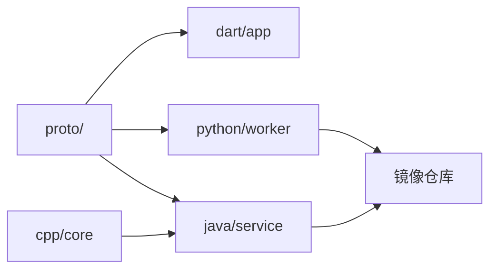
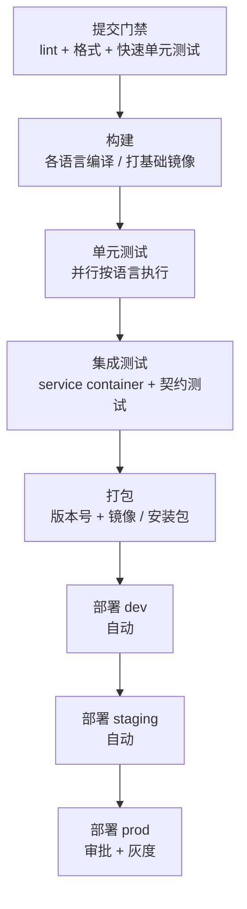
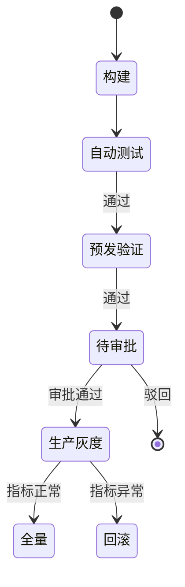

# 持续交付 01：CI/CD 流水线设计

> 多语言仓库的 CI 不是「把单语言流水线复制几份」。五种语言意味着五套工具链、五份缓存、五种构建产物，还可能有 C++ 库被 Go 服务链接、Python 模型被打进 Java 服务的镜像这类跨语言依赖。**流水线设计的目标是：任何一次提交，都能在可预期的时间内得到「能否交付」的确定答案**。
>
> 前置知识：[[多语言工程化/5容器与编排/01_多语言统一容器化|统一容器化]]、[[linux/61-CI-CD基础|CI/CD 基础]]（运维视角）。本章关注设计与取舍，具体语法见 [[多语言工程化/6持续交付/02_GitHub_Actions多语言流水线|02 GitHub Actions 多语言流水线]]。

---

## 一、CI 与 CD 的定义与区别

| 缩写 | 全称 | 回答的问题 | 典型动作 |
|------|------|-----------|----------|
| CI | Continuous Integration | 代码合进去会不会坏？ | 拉代码、装依赖、构建、单元测试 |
| CD | Continuous Delivery | 能不能随时安全发布？ | 打包、部署到类生产环境、验收测试 |
| CD | Continuous Deployment | 能不能自动上生产？ | 自动发布到生产 + 监控 + 回滚 |

Delivery 与 Deployment 的差别只有一步：**人工审批**。多数团队采用 Continuous Delivery——流水线把产物推到生产门口，由人按下最后按钮；只有测试体系与可观测性足够成熟才做 Continuous Deployment。


CI 与 CD 共用一个原则：**流水线是唯一可信的构建来源**。任何人本地打出的包都不能直接上线，否则「在我机器上是好的」会变成线上事故。

---

## 二、多语言仓库的流水线难点

| 难点 | 表现 | 对策 |
|------|------|------|
| 工具链多 | 每个 job 都要装对应语言环境 | 用 setup-* action 与缓存，见 02 章对比表 |
| 构建慢 | 全量构建触发所有语言，一次一小时 | path filter + affected 构建，只跑受影响的模块 |
| 相互依赖 | Go 服务链接 C++ 静态库，Python 产物被打进 Java 镜像 | 显式声明依赖图，按拓扑顺序构建；共享制品而非源码耦合 |
| 环境不一致 | 各语言要求不同编译器/运行时版本 | 容器化构建环境，版本锁进镜像 |
| 缓存策略各异 | Maven 与 pub 的缓存目录与失效条件完全不同 | 按语言分别设计缓存键（锁文件哈希） |
| 失败定位难 | 一条流水线跑五种语言，红了不知道哪坏 | 每语言独立 job + 汇总 job，失败隔离 |

核心思路：**把「语言差异」封装在 job 内部，让 job 之间只通过制品与接口通信**。跨语言依赖不要在流水线里直接链接源码，而是先构建上游产物（`.so`、jar、wheel、容器镜像），下游按版本引用。

### 2.1 一个多语言仓库的样子

```text
repo/
  proto/                # 接口定义（Protobuf），所有语言共享
  cpp/core/             # C++ 高性能核心，产出 libcore.so
  java/service/         # Java 服务，通过 JNI 使用 libcore.so
  python/worker/        # Python 数据处理，消费 proto
  dart/app/             # Flutter 客户端，消费 proto 生成的 Dart 代码
  .github/workflows/
```



改动 `cpp/core` 只需重建 C++ 库与 Java 服务；改动 `proto/` 则四个语言全部受影响。**依赖图是 path filter 与 affected 构建的依据，没有它只能全量构建**。

---

## 三、流水线阶段划分



各阶段的时间与失败率应呈金字塔：门禁秒级到分钟级、构建与单测分钟级、集成测试分钟级到十分钟、部署分钟级。**越早的阶段越便宜，能前置的检查绝不后置**。

| 阶段 | 目的 | 失败后的动作 |
|------|------|-------------|
| 提交门禁 | 拦住格式、明显错误 | 开发者本地修复后重推 |
| 构建 | 确认可编译、产出中间制品 | 修复编译错误 |
| 单元测试 | 验证模块行为 | 定位到具体模块 |
| 集成测试 | 验证跨服务/跨语言协作 | 检查接口契约与依赖版本 |
| 打包 | 生成可部署产物与版本号 | 修复打包脚本 |
| 部署 | 把产物放到目标环境 | 回滚或修复配置 |

### 3.1 阶段契约示例

```yaml
# pipeline.yaml —— 阶段契约（概念示意，具体引擎语法见 02 章）
stages:
  gate:                                   # 提交门禁：秒级反馈
    timeout: 5m
    commands: [make lint, make unit-test-fast]
  build:                                  # 各语言并行构建
    needs: [gate]
    matrix: [cpp, java, python, dart]
    timeout: 20m
  integration:                            # 集成测试：临时起依赖
    needs: [build]
    timeout: 15m
    services: [postgres, redis]
    commands: [make integration-test]
  package:                                # 仅 tag 触发
    needs: [integration]
    only_on: tags
    commands: [make package VERSION=$VERSION]
```

---

## 四、触发策略

| 触发方式 | 适用 | 说明 |
|----------|------|------|
| push 到功能分支 | 快速反馈 | 只跑受影响模块的门禁与单测 |
| pull_request | 合并门禁 | 必跑，配合分支保护规则 |
| tag（v*） | 发布 | 触发打包与生产部署 |
| 定时（cron） | 夜间全量、依赖扫描 | 跑慢速集成测试、SBOM 生成 |
| 手动 workflow_dispatch | 补跑、演练 | 调试与应急 |

### 4.1 path filter

```yaml
on:
  pull_request:
    paths:
      - "services/java/**"
      - "proto/**"          # 协议变更影响所有语言，必须全跑
      - ".github/workflows/**"
```

### 4.2 affected 构建

path filter 只能判断「改了哪些路径」，affected 构建进一步回答「哪些模块依赖了被改模块」。多语言仓库推荐用 Bazel 的 `rdeps()` 或 Nx/Turborepo 的 affected 能力；没有这类工具时，在仓库里维护一份 `deps.yaml` 并让脚本计算：

```yaml
# deps.yaml —— 模块依赖图（人工维护，变更依赖时同步更新）
cpp_core: []
java_service: [cpp_core]
python_worker: [proto]
proto: []
```

规则：**协议与共享库的变更默认触发全量构建**；业务模块只构建自身与下游。宁多跑一个模块，不可漏跑一个下游。

```bash
# scripts/affected.sh —— 无专用工具时的最小 affected 实现
CHANGED=$(git diff --name-only origin/main...HEAD)
for module in $(yq 'keys | .[]' deps.yaml); do
  for dep in $(yq ".${module}[]" deps.yaml); do
    if echo "$CHANGED" | grep -q "^${dep}/"; then
      echo "$module"; break        # 下游受影响，加入构建列表
    fi
  done
done
```

---

## 五、缓存与制品管理

### 5.1 缓存 vs 制品

| 概念 | 生命周期 | 内容 | 例子 |
|------|----------|------|------|
| 缓存（cache） | 短期，可重建，丢了只影响速度 | 依赖下载、编译中间产物 | Maven `~/.m2`、pub cache、Gradle caches |
| 制品（artifact） | 长期，不可重建或重建昂贵，需要审计 | 二进制、镜像、测试报告、符号文件 | jar、`.so`、Docker 镜像、IPA |

不要把制品塞进缓存：缓存会被清理，且缓存不保证跨分支可见；需要跨 job、跨流水线传递的东西一律走制品仓库（GitHub Artifacts、Nexus、S3、镜像仓库）。

### 5.2 缓存键设计

```yaml
key: ${{ runner.os }}-maven-${{ hashFiles('**/pom.xml') }}
restore-keys: |
  ${{ runner.os }}-maven-
```

原则：主键包含**锁文件的哈希**；`restore-keys` 用前缀做降级；缓存目录要覆盖工具链与依赖两层；**缓存不可作为正确性依赖**，任何 job 都必须在缓存未命中时仍能成功。

### 5.3 远程缓存与增量

多语言构建系统（Bazel、Gradle Build Cache、sccache）支持远程缓存：同样的输入直接复用别人机器上的产物。CI 场景下收益最大——同一 PR 的多次推送能复用 90% 以上的编译结果。前提是构建必须**确定性**：同样的源码与工具链版本产生同样的输出，否则缓存污染。

### 5.4 制品命名规范

制品名必须自解释且不可变：`<服务名>-<版本>-<commit短SHA>.<扩展名>`：

```text
java-service-1.4.2-a3f9c21.jar
python-worker-0.9.0-a3f9c21.whl
dart-app-1.4.2+88-a3f9c21.apk
registry.example.com/java-service:1.4.2-a3f9c21
```

禁止用 `latest` 作为部署输入：它无法回答「线上跑的是哪个版本」，回滚时也无从选择。

---

## 六、环境分层与密钥管理


| 环境 | 数据 | 部署触发 | 用途 |
|------|------|----------|------|
| dev | 测试数据 | 自动 | 开发者自测、冒烟 |
| staging | 脱敏的生产数据 | 自动 | 验收、性能、发布演练 |
| prod | 真实数据 | 审批 + 灰度 | 真实用户 |

密钥管理三条铁律：

1. **密钥不进仓库**：配置文件中的占位符在运行时由 CI/密钥管理系统注入；
2. **按环境隔离**：staging 的密钥与 prod 完全不同，泄露一个不影响另一个；
3. **最小权限**：CI 的部署账号只有目标环境所需权限，且优先使用 OIDC 短期凭证而非长期 AK/SK。

---

## 七、人工审批与发布窗口

需要审批的场景：生产部署、数据库迁移、涉及资金/权限的配置变更、首次发布的新服务。



发布窗口的取舍：限制「周五下午不发版」能降低风险，但会积累变更、加大单次发布风险。更现代的做法是**提高发布能力**（灰度、开关、快速回滚），而不是限制发布频率。DORA 研究早已证明：部署频率越高，变更失败率越低。

---

## 八、流水线性能优化

| 手段 | 说明 | 预期收益 |
|------|------|----------|
| 并行化 | 无依赖的 job 同时跑（各语言测试、多平台构建） | 接近线性 |
| 依赖分层 | 门禁 job 先跑，通过后再触发重任务 | 失败时省下全部重任务时间 |
| 增量构建 | 只编译变更模块（affected） | 大型仓库 50%-90% |
| 远程缓存 | Bazel/Gradle/sccache 复用他人产物 | 30%-80% |
| 缓存预热 | 定时任务维护基础镜像与依赖缓存 | 首次构建更快 |
| 矩阵瘦身 | 合并可合并的 job，减少 runner 启动开销 | 每次 10-30 秒 |
| 大 job 拆分 | 超过 10 分钟的测试按模块拆分 | 缩短关键路径 |

诊断方法：先看**关键路径**（最长的依赖链），再优化链上最慢的 job。平均耗时没有意义，关键路径决定用户等待时间。

---

## 九、DORA 四项指标

| 指标 | 定义 | 精英水平（参考） |
|------|------|-----------------|
| 部署频率 | 多久发布一次 | 按需，一天多次 |
| 变更前置时间 | 从提交到生产运行的时长 | 小于 1 小时 |
| 变更失败率 | 导致回滚/热修的发布占比 | 0%-15% |
| 恢复时间 | 故障到恢复的时长 | 小于 1 小时 |

前两项衡量**速度**，后两项衡量**稳定性**。四者并不矛盾：DORA 数据反复证明高绩效团队同时做到快与稳。度量流水线时应把这四项做成看板，而不是统计「CI 通过率」这类过程指标。注意：**不可用 DORA 指标考核个人**，否则会催生小批量提交、隐藏失败等反效果。

### 9.1 数据采集

```bash
# 变更前置时间：从提交时间到部署成功时间（需流水线记录部署时间戳）
git log -1 --format=%ct "$COMMIT_SHA"
# 部署频率：统计一天内生产部署成功事件
grep "deploy prod success" deploy.log | wc -l
```

四项指标应尽量自动采集进看板；手工统计只能作为起步，长期会因维护成本而荒废。

---

## 常见坑与反模式

1. **一条巨型流水线**：所有语言串行执行，任何一个失败都要等前面跑完；应按语言/模块拆 job。
2. **缓存当制品**：用 `actions/cache` 传构建产物，缓存被清理后流水线莫名失败；产物走 artifact。
3. **测试依赖外部环境**：集成测试连固定测试服务器，环境一挂全组阻塞；用 service container 起临时依赖。
4. **密钥写进 workflow 明文**：即使仓库私有也会出现在日志与 fork 中；一律用 Secrets 或 OIDC。
5. **全量构建每个 PR**：大型仓库 CI 排队一小时；必须做 path filter 与 affected。
6. **无版本号策略**：镜像永远 `latest`，回滚时不知道回哪个；产物必须带不可变版本号（commit SHA + 语义版本）。
7. **只测 happy path**：流水线全绿但线上首日崩溃；失败路径、契约测试、迁移脚本都要进流水线。
8. **缺少回滚演练**：回滚脚本从未执行过，真出事时才发现命令是错的；定期在 staging 演练。

---

## 本章小结

- CI 保证「合入不坏」，CD 保证「随时可发」，Delivery 与 Deployment 的差别在最后一步人工审批；
- 多语言仓库把语言差异封装在 job 内部，job 之间只通过制品与接口通信；
- 阶段按提交门禁 → 构建 → 单测 → 集成 → 打包 → 部署划分，越早的检查越便宜；
- path filter 解决「改哪里跑哪里」，affected 构建解决「改了上游跑下游」，共享路径触发全量；
- 缓存可重建、制品需审计，二者不可混用；缓存键必须包含锁文件哈希；
- 环境分层与密钥隔离，密钥不进仓库，OIDC 优先于长期凭证；
- 性能优化盯关键路径：并行、增量、远程缓存、矩阵瘦身；
- DORA 四项指标同时衡量速度与稳定性，只用于团队改进，不用于个人考核。

---

## 动手实践

1. **画依赖图**：为自己的多语言项目（或用一个假想项目）写出模块依赖图，标注哪些模块跨语言依赖，并产出 `deps.yaml`。
   - 验收：依赖图用 mermaid 表达且无环；`deps.yaml` 覆盖所有构建模块；给出「改 proto 触发全量」的说明。
2. **设计阶段流水线**：按第三节的阶段划分，为你的项目写出每个阶段的目标、命令、超时时间与失败动作。
   - 验收：输出一份表格；关键路径总时长估算在 15 分钟以内；每个阶段都有明确的失败处理。
3. **缓存方案**：为至少两种语言设计缓存键与目录，写出对应的 `actions/cache` 配置。
   - 验收：键包含锁文件哈希；模拟锁文件变更后缓存未命中但能降级恢复；说明缓存丢失时流水线仍可成功。
4. **DORA 基线**：记录团队当前四项指标的估算值，并给出一个月的改进目标与手段。
   - 验收：四项指标都有测量方法（如从 tag 与部署日志统计）；改进目标符合 DORA 建议区间；不包含个人考核内容。

- 返回目录：[[多语言工程化/多语言工程化目录|多语言工程化]]
