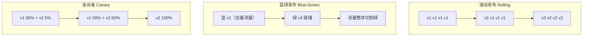
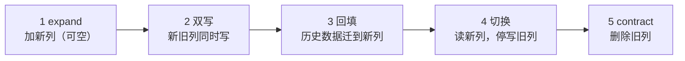

# 持续交付 03：发布策略与回滚

> 流水线把产物送到了生产门口，最后一步才是真正的风险点：**如何让新版本上线而用户无感，出问题时又如何在一分钟内退回**。发布策略决定了故障的爆炸半径，回滚预案决定了故障的持续时间。多语言系统里还要额外考虑一件事：各服务的发布节奏不同，数据库 schema 与消息格式必须保持向前兼容。
>
> 前置知识：[[多语言工程化/6持续交付/01_CI_CD流水线设计|01 CI/CD 流水线设计]]、[[多语言工程化/5容器与编排/03_Kubernetes核心概念|K8s 核心概念]]（Deployment/Service/Ingress）。

---

## 一、发布与部署的区别

| 动作 | 定义 | 影响 |
|------|------|------|
| 部署（Deploy） | 把新版本产物放到运行环境 | 尚未对用户产生影响 |
| 发布（Release） | 把流量切给新版本 | 用户开始使用新功能 |
| 回滚（Rollback） | 把流量切回旧版本 | 用户停止使用新版本 |
| 回退（Revert） | 代码层面撤销变更 | 需要重新走流水线 |

**部署不等于发布**：蓝绿、金丝雀、特性开关的共同思想就是把两者解耦——先部署（零影响），再逐步发布（可控影响），出问题时只切流量不回代码。这是现代发布体系的基石。

---

## 二、部署策略对比



| 策略 | 资源成本 | 回滚速度 | 风险 | 适用场景 |
|------|----------|----------|------|----------|
| 重建（Recreate） | 最低 | 慢（重新拉起） | 有停机 | 内部工具、可接受停机的服务 |
| 滚动（Rolling） | 低 | 中（再滚回去） | 新旧版本混跑 | K8s 默认，无状态服务 |
| 蓝绿（Blue-Green） | 双倍 | 最快（切流量） | 数据库需兼容两版 | 关键服务、要求秒级回滚 |
| 金丝雀（Canary） | 低 + 少量新版本 | 快（撤新版本） | 最小 | 用户量大、变更风险高的服务 |

选择原则：**能金丝雀就不全量，能蓝绿就不滚动**。代价是复杂度与资源，所以内部服务用滚动、面向用户的核心链路用金丝雀或蓝绿。

---

## 三、金丝雀发布与流量切分

### 3.1 K8s 原生方案

用两个 Deployment（稳定版 + 金丝雀版）共享同一个 Service，通过副本数近似控制流量比例：

```yaml
# 稳定版：9 个副本
apiVersion: apps/v1
kind: Deployment
metadata: { name: api-stable }
spec:
  replicas: 9
  selector: { matchLabels: { app: api, track: stable } }
  template:
    metadata: { labels: { app: api, track: stable } }
    spec:
      containers:
        - name: api
          image: registry.example.com/api:1.4.2-a3f9c21
---
# 金丝雀版：1 个副本，约 10% 流量
apiVersion: apps/v1
kind: Deployment
metadata: { name: api-canary }
spec:
  replicas: 1
  selector: { matchLabels: { app: api, track: canary } }
  template:
    metadata: { labels: { app: api, track: canary } }
    spec:
      containers:
        - name: api
          image: registry.example.com/api:1.5.0-b7d2e44
---
apiVersion: v1
kind: Service
metadata: { name: api }
spec:
  selector: { app: api }          # 同时选中 stable 与 canary
  ports: [{ port: 80, targetPort: 8080 }]
```

副本比例法简单但粗糙：流量按 Pod 数量近似分配，长连接场景偏差明显。精确切分需要 Ingress 权重或服务网格。

### 3.2 Ingress 权重切分

```yaml
apiVersion: networking.k8s.io/v1
kind: Ingress
metadata:
  name: api
  annotations:
    nginx.ingress.kubernetes.io/canary: "true"
    nginx.ingress.kubernetes.io/canary-weight: "5"   # 5% 流量进金丝雀
spec:
  rules:
    - host: api.example.com
      http:
        paths:
          - path: /
            pathType: Prefix
            backend:
              service:
                name: api-canary
                port: { number: 80 }
```

### 3.3 服务网格权重切分

Istio 用 VirtualService 按权重切流，且支持按请求头做定向灰度（内部用户先试）：

```yaml
apiVersion: networking.istio.io/v1beta1
kind: VirtualService
metadata: { name: api }
spec:
  hosts: [api.example.com]
  http:
    - match:                       # 内部测试账号优先命中金丝雀
        - headers: { x-internal-user: { exact: "true" } }
      route:
        - destination: { host: api-canary }
    - route:
        - destination: { host: api-stable }
          weight: 95
        - destination: { host: api-canary }
          weight: 5
```

金丝雀放量的判据必须是**可观测指标**而非时间：错误率、P99 延迟、业务转化率在观察窗口内与稳定版无显著差异，才进入下一档（5% → 25% → 50% → 100%）。指标异常时自动回滚（Argo Rollouts、Flagger 可自动化这一步）。

---

## 四、蓝绿发布与数据库兼容

蓝绿的关键约束：**新旧两版会同时存在一段时间**，且数据库只有一个。因此：

1. 数据库 schema 必须同时兼容新旧两版（见第六节 expand-contract）；
2. 会话与缓存不能绑定单实例本地内存，否则切流后用户掉线；
3. 切换动作要幂等且可快速反向执行（DNS/TLB/Service selector 二选一）。

```bash
# 蓝绿切换的最小实现：改 Service selector
kubectl patch service api -p '{"spec":{"selector":{"version":"green"}}}'
# 回滚：把 selector 指回 blue，秒级生效
kubectl patch service api -p '{"spec":{"selector":{"version":"blue"}}}'
```

蓝绿的隐藏成本是双倍资源；对于依赖外部回调（支付、第三方 webhook）的系统，还要保证回调地址不随颜色变化，否则会出现「切绿后支付回调打到蓝」的经典事故。

---

## 五、特性开关与渐进交付

特性开关（Feature Flag）把「代码是否部署」与「功能是否对用户可见」彻底分离：

```dart
// 多语言系统里开关通常放在配置中心，这里用内存实现示意
class FeatureFlags {
  FeatureFlags(this._remote);
  final Future<bool> Function(String key) _remote;

  Future<bool> isEnabled(String key) async {
    // 默认关闭：配置中心不可用时退化为旧行为，避免新功能在故障时被放大
    return await _remote(key).catchError((_) => false);
  }
}
```

```dart
// 使用：新旧逻辑共存，开关决定走哪条路
if (await flags.isEnabled('new_checkout_flow')) {
  return NewCheckoutFlow().run(order);
}
return LegacyCheckoutFlow().run(order);
```

| 开关类型 | 生命周期 | 例子 |
|----------|----------|------|
| 发布开关 | 短（功能全量后删除） | `new_checkout_flow` |
| 实验开关 | 中（实验结束删除） | A/B 测试分流 |
| 权限开关 | 长 | 企业版功能 |
| 运维开关 | 长（熔断降级） | 关闭推荐、降级为缓存 |

纪律：**发布开关必须有清理日期**。否则开关数量指数增长，分支组合无法测试，最终没人敢删。

---

## 六、数据库迁移：expand-contract

直接 `ALTER TABLE` 改字段是发布事故的头号来源：旧版本代码还在跑，schema 已经变了。expand-contract 把迁移拆成五步，保证任意时刻新旧代码都能工作：



```sql
-- 示例：把 users.name 拆成 first_name / last_name
-- 步骤 1：加列（旧代码不感知，新列可空）
ALTER TABLE users ADD COLUMN first_name VARCHAR(64);
ALTER TABLE users ADD COLUMN last_name  VARCHAR(64);

-- 步骤 2-3：新版本代码双写并回填（分批执行，避免锁表）
UPDATE users SET first_name = split_part(name, ' ', 1)
WHERE first_name IS NULL LIMIT 10000;

-- 步骤 4：读路径切到新列；观察一个发布周期，确认无回滚需求
-- 步骤 5：确认稳定后删除旧列（与步骤 1 至少间隔一个版本）
ALTER TABLE users DROP COLUMN name;
```

配套原则：

1. **迁移脚本与代码一起进版本库**，在流水线的部署前阶段自动执行；
2. **禁止破坏性 DDL 与代码同发**：删列永远滞后一个版本；
3. **回填分批**：大表一次性 UPDATE 会长时间锁表，按主键分批并限速；
4. **回滚边界**：expand 与双写阶段可安全回滚；切读之后回滚需要反向双写，成本高，因此切读前必须充分观察。

---

## 七、回滚预案

回滚能力必须在发布前就准备好，而不是出事时现想。

| 层级 | 回滚手段 | 恢复速度 | 边界 |
|------|----------|----------|------|
| 流量 | Service selector / Ingress 权重切回 | 秒级 | 两版共存时有效 |
| 镜像 | Deployment 回退到上一版本镜像 | 分钟级 | 镜像仓库保留历史 tag |
| 配置 | 配置中心版本回退 | 秒级 | 配置必须版本化 |
| 数据库 | 向前兼容设计，通常不回滚 | 慢 | 数据无法「回退」；只做修复或补偿 |
| 消息 | 消费者兼容旧格式 / 死信队列 | 分钟级 | 消息格式必须向前兼容 |

```bash
# 镜像回滚：先查历史，再回退
kubectl rollout history deployment/api
kubectl rollout undo deployment/api --to-revision=3
kubectl rollout status deployment/api
```

**数据回滚的边界必须写清楚**：schema 变更遵循 expand-contract 后通常不需要回滚数据库；如果确实需要，预案是「用备份恢复到新实例 + 业务侧对账补偿」，而不是在生产库上反向 DDL。回滚演练每季度至少一次，在 staging 上完整走一遍。

---

## 八、事故响应与复盘


事故响应的优先级永远是**止血 > 定位 > 修复**。先回滚让用户恢复，再慢慢查原因；在故障中调试代码是最昂贵的错误。

复盘（postmortem）的原则：

1. **对事不对人**：目标是找出系统性缺陷，不是追责；否则信息会被隐藏；
2. **时间线完整**：从第一次变更到恢复，每个关键动作的时间点；
3. **区分直接原因与根因**：直接原因可能是「空指针」，根因往往是「缺少契约测试 + 回滚未演练」；
4. **改进项可执行**：每条有负责人和截止日期，并纳入下一次迭代；
5. **文档公开**：团队内共享，避免同类事故重复发生。

---

## 九、发布检查清单

发布前：

- [ ] CI 全绿，产物带不可变版本号（语义版本 + commit SHA）
- [ ] 数据库迁移已按 expand-contract 拆分，且向前兼容
- [ ] 特性开关默认关闭，配置中心可用性已确认
- [ ] 回滚命令与上一版本镜像确认存在，回滚演练通过
- [ ] 监控看板与告警就绪：错误率、延迟、核心业务指标
- [ ] 发布窗口与相关团队已沟通（避开大促与高峰期）

发布中：

- [ ] 金丝雀 5% 观察至少一个业务周期，指标无异常再放量
- [ ] 每一步放量都有明确的进入/终止判据
- [ ] 关注跨语言依赖：上游 schema/消息格式变更是否已先行发布

发布后：

- [ ] 观察 24 小时，确认无长尾异常
- [ ] 清理已全量的发布开关，更新 CHANGELOG
- [ ] 记录本次发布的指标基线与耗时，沉淀到发布记录

---

## 常见坑

1. **破坏性 DDL 与代码同发**：旧版本代码仍在跑，直接删列或改名必然报错；严格走 expand-contract。
2. **蓝绿切换后外部回调仍指向旧环境**：支付、webhook 的回调地址必须与颜色解耦，否则切换即断流。
3. **金丝雀只看时间不看指标**：没有错误率与 P99 判据的放量等于全量发布。
4. **特性开关没有清理计划**：开关越积越多，代码分支组合无法测试；发布开关必须带清理日期。
5. **回滚只回代码不回配置**：镜像退回旧版但配置中心仍是新值，故障原样复现。
6. **有状态服务用滚动发布**：会话绑定单个实例，滚动期间用户掉线；需优雅下线与外部会话存储。
7. **消息格式变更不兼容旧消费者**：下游升级滞后，新格式消息直接进死信队列；新字段必须可选。
8. **回滚从未演练**：真出事才发现镜像 tag 已被清理或权限不足；每季度在 staging 完整演练一次。

---

## 本章小结

- 部署与发布解耦是可控发布的前提，蓝绿、金丝雀、特性开关都是解耦手段；
- 策略选择：内部服务用滚动，核心链路用金丝雀或蓝绿，重建只用于可接受停机的场景；
- 金丝雀放量依据是可观测指标而非时间，逐档放量并支持自动回滚；
- 蓝绿要求数据库兼容两版、会话不绑实例、外部回调与颜色解耦；
- 数据库迁移走 expand-contract 五步，删列永远滞后一个版本；
- 回滚分层准备：流量秒级、镜像分钟级，数据只做修复与补偿，不反向 DDL；
- 事故响应止血优先于定位；复盘对事不对人，改进项必须有负责人与期限；
- 发布检查清单要覆盖发布前、发布中、发布后三个阶段。

---

## 动手实践

1. **本地金丝雀演练**：用 Docker Compose 起两个版本的 HTTP 服务与一个 Nginx 反代，配置 9:1 权重切分。
   - 验收：连续请求 100 次，约 10% 命中新版本（响应体含版本号）；把新版本容器停掉后流量自动全回旧版本。
2. **expand-contract 实战**：在本地 PostgreSQL 上对一张含数据的表完成五步迁移，每步之间模拟「旧代码」与「新代码」同时读写。
   - 验收：迁移过程中旧代码的增删改查不报错；回填脚本分批执行；提供一份回滚决策说明（哪一步可回滚、哪一步不可）。
3. **回滚演练**：在 K8s 或 Compose 环境发布一个有缺陷的版本（如接口返回 500），执行回滚并记录耗时。
   - 验收：从发现问题到恢复在 5 分钟内；给出 `kubectl rollout undo` 或等价命令的执行记录；说明数据库是否需要处理。
4. **事故复盘文档**：为练习 3 的故障写一份 blameless postmortem，包含时间线、直接原因、根因、改进项。
   - 验收：时间线精确到分钟；至少 3 条改进项且各有负责人与期限；全文不出现个人追责表述。

- 返回目录：[[多语言工程化/多语言工程化目录|多语言工程化]]
