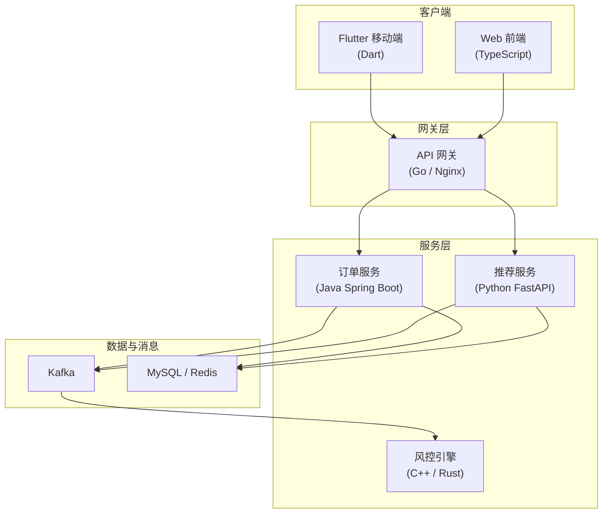
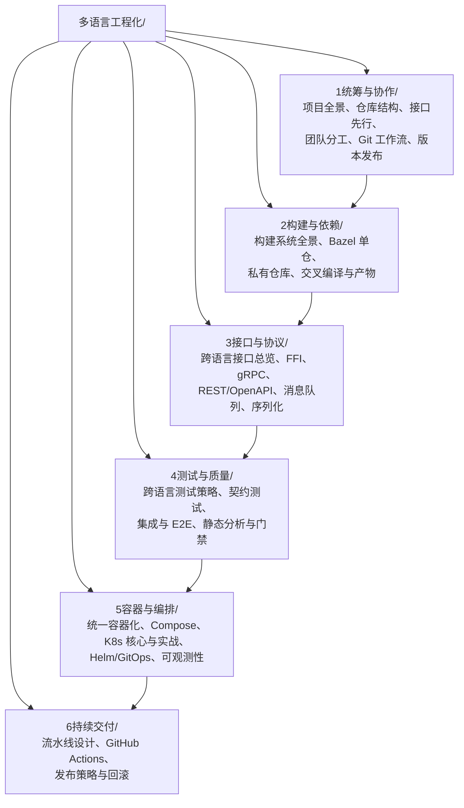

# 多语言工程化

现代软件项目很少只用一种语言。一个典型的业务系统可能是：后端 Java/Go、算法 Python、前端 TypeScript、移动端 Dart/Kotlin、底层 C/C++、运维 Shell，中间用 gRPC、消息队列、容器与 Kubernetes 把它们缝在一起。**多语言工程化**研究的不是「怎么再学一门语言」，而是**如何让多门语言在同一个团队、同一条流水线里稳定协作**。

本目录面向的是「多人项目如何统筹」这个问题：每个人负责不同部分，如何约定接口、如何并行开发、如何构建、如何测试、如何部署。它比单语言教程更偏工程与协作，也比运维手册更偏软件交付全流程。

> 前置要求：至少熟练掌握一门语言（C/C++/Java/Go/Python/Rust/Dart 均可），并了解 Git 基本操作（见 [[git.md|Git 与 GitHub 终端操作指南]]）。本目录不教任何单语言语法。

---

## 为什么需要多语言工程化

### 多语言是结果，不是目的

选择多语言通常出于三个理由：

1. **各取所长**：C/C++ 做高性能内核与驱动，Go 做高并发网络服务，Python 做数据分析与 AI，TypeScript 做交互界面，Dart/Flutter 做跨端 UI
2. **历史演进**：老系统用 Java，新模块用 Go，算法团队交付 Python 模型，不可能一次性重写
3. **生态绑定**：某个领域的库只在特定语言生态中成熟（如机器学习选 Python，嵌入式选 C）

但多语言有真实成本：**工具链翻倍、依赖管理翻倍、构建时间翻倍、招聘与培训成本上升、跨语言调试困难**。本目录的第一课就是：先判断「是否真的需要多语言」，再谈怎么统筹。

### 一个真实的多语言项目长什么样

这个系统里有 6 种语言、5 个团队、十余个可独立部署的服务。**每个团队的「自由」都必须在接口、构建、测试、部署四个层面被约束住**，否则系统会退化成无法集成的拼盘。这正是本目录六个部分要解决的问题。

---

## 目录结构

| 部分 | 回答的问题 | 关键词 |
|------|-----------|--------|
| 1 统筹与协作 | 谁负责哪块？代码放哪？接口怎么定？ | Monorepo、CODEOWNERS、契约、SemVer |
| 2 构建与依赖 | 多语言怎么一起编译？依赖从哪来？ | Bazel、私有仓库、交叉编译 |
| 3 接口与协议 | 不同语言之间怎么通信？ | FFI、gRPC、Protobuf、REST、MQ |
| 4 测试与质量 | 怎么保证拼起来是好的？ | 测试金字塔、契约测试、Testcontainers |
| 5 容器与编排 | 怎么统一交付与运行？ | Docker、Kubernetes、Helm、GitOps |
| 6 持续交付 | 怎么自动化发布与安全回滚？ | CI/CD、灰度、蓝绿、金丝雀 |

---

## 推荐学习路线

### 按角色选读

不同角色的最小知识集不同：

| 角色 | 推荐路线 | 预计章数 |
|------|---------|---------|
| 项目新人（接手多语言仓库） | 1-02 仓库结构 → 1-05 Git 工作流 → 2-01 构建全景 → 5-01 容器化 → 5-02 Compose | 约 5 章 |
| 模块负责人（负责一个服务） | 1-03 接口先行 → 3-03 gRPC → 4-02 契约测试 → 5-03/04 K8s → 6-02 Actions | 约 6 章 |
| 架构/技术负责人 | 全目录通读，重点 1-01/02/03/04、2-02 Bazel、3-01、5-05 GitOps | 全部 |
| 测试/质量工程师 | 3-03/04 协议 → 4 全部 → 6-01 流水线 | 约 7 章 |
| 运维/平台工程师 | 2 全部 → 5 全部 → 6 全部 | 约 13 章 |

### 按顺序通读（约 8 周，每天 2 小时）

| 周次 | 内容 | 阶段产出 |
|------|------|---------|
| 第 1 周 | 1 统筹与协作 | 画出自己项目的服务边界图与接口清单 |
| 第 2 周 | 2 构建与依赖 | 为多语言仓库写出统一构建入口 |
| 第 3 周 | 3 接口与协议（上） | 用 Protobuf 定义一套跨语言接口 |
| 第 4 周 | 3 接口与协议（下） | 跑通 gRPC + 消息队列的最小示例 |
| 第 5 周 | 4 测试与质量 | 给跨语言调用加上契约测试与集成测试 |
| 第 6 周 | 5 容器与编排（上） | 所有服务容器化并用 Compose 一键启动 |
| 第 7 周 | 5 容器与编排（下） | 部署到 K8s 集群并配置探针与 HPA |
| 第 8 周 | 6 持续交付 | 搭出完整的 CI/CD 流水线并演练一次回滚 |

---

## 核心原则

贯穿全目录的六条原则，先在这里建立印象：

1. **接口先行（Contract First）**：先定义接口与数据格式，再并行开发实现。接口是团队之间唯一的强约束，也是并行开发的前提
2. **构建可复现（Reproducible Build）**：任何一台机器、任何时间，用一条命令能构建出相同产物。锁文件、固定工具链版本、容器化构建环境都是手段
3. **测试分层（Test Pyramid）**：单元测试快而多，集成测试慢而少，端到端测试更慢更少。跨语言项目尤其要重视中间的契约测试层
4. **配置与代码分离（12-Factor）**：环境相关配置通过环境变量/配置中心注入，镜像与产物跨环境一致
5. **可观测性内建（Observability by Default）**：日志、指标、链路追踪从第一天就接入，而不是出故障后再补
6. **自动化一切可自动化的（Automate the Boring）**：格式化、静态检查、测试、构建、发布全部进流水线，人不做机器能做的事

---

## 与单语言教程的关系

| 已有教程 | 在本目录中的角色 |
|---------|-----------------|
| [[c语言教程/4工程化/02_C项目工程化\|C 项目工程化]] | C 侧的单语言工程实践，本目录在其上叠加跨语言协作 |
| [[cpp教程/cpp深化教程/17_包管理器Conan与vcpkg\|Conan 与 vcpkg]] | C++ 构建与依赖的深入版，2-01 会做横向对比 |
| [[java/java目录\|Java 教程]] | 3工程化部分（Maven/Gradle/Spring/Docker/CI）是本目录的重要案例来源 |
| [[python/5工程化/06_C_C++混合项目中的Python工程实践\|Python 混合项目]] | Python 与 C/C++ 混合的既有章节，与 3-02 FFI 互补 |
| [[rust/4工程/14-Cargo-workspace多包管理\|Cargo Workspace]] | 单语言多包管理，与 2-03 依赖管理、melos/Bazel 对照 |
| [[dart/dart目录\|Dart 教程]] | Flutter 客户端的工程化与 CI 发布 |
| [[docker/README\|Docker 教程]] | 5-01/02 的详细前置：镜像、网络、存储、Compose |
| [[linux/47-容器编排与K8s入门\|K8s 入门]] | 5-03/04 的 Linux 视角前置，本目录从应用交付角度展开 |
| [[linux/61-CI-CD基础\|CI/CD 基础]] | 6-01 的运维视角前置 |
| [[前端开发/09-融会贯通/01-前端工程化：构建与模块\|前端工程化]] | 前端侧的构建与模块化，3-04 OpenAPI 与前端联调相关 |

---

## 学习建议

### 1. 带着自己的项目来学

本目录每章都有「动手实践」。空对空读工程化内容收益极低——请准备一个真实的小项目（哪怕只有两个语言模块），把每章的方案套用到它上面。

### 2. 先跑通最小闭环，再谈规模

不要一上来就上 Bazel + K8s + 服务网格。先在单机上用 Make/CMake + Docker Compose 跑通「编译-测试-打包-启动」闭环，再逐步替换为更重的工具。工具是手段，闭环是目的。

### 3. 关注「为什么不用」

每个工具章节都会讲它的适用边界与代价。**工程决策的核心不是知道工具能做什么，而是知道什么场景不该用它**。

### 4. 记录决策

建议为你的项目维护一份 `docs/adr/`（Architecture Decision Record）目录，每次引入新工具或协议都写一页：背景、选项、决策、后果。这是团队协作中性价比最高的文档。

### 5. 与 AI 协作的边界

接口定义、架构决策、协议兼容性判断必须自己理解后拍板；代码生成、样板配置、文档整理可交给 AI。多语言工程里最容易出错的地方是「跨边界」——那正是 AI 最容易给出看似合理实则错误建议的地方。

---

## 术语速查表

| 术语 | 全称 | 一句话解释 |
|------|------|-----------|
| Polyglot | — | 多语言（项目/团队/程序员） |
| Monorepo | Monolithic Repository | 多项目共用一个仓库 |
| Polyrepo | — | 每个项目独立仓库 |
| CODEOWNERS | — | Git 平台的所有权声明文件，自动请求对应负责人评审 |
| Contract First | 契约先行 | 先定接口再写实现 |
| ADR | Architecture Decision Record | 架构决策记录 |
| FFI | Foreign Function Interface | 跨语言函数调用接口 |
| ABI | Application Binary Interface | 二进制接口约定，FFI 稳定的基础 |
| IDL | Interface Definition Language | 接口定义语言，如 Protobuf、Thrift |
| RPC | Remote Procedure Call | 远程过程调用 |
| gRPC | — | Google 开源的高性能 RPC 框架，基于 HTTP/2 与 Protobuf |
| OpenAPI | — | REST API 的描述规范（原 Swagger） |
| MQ | Message Queue | 消息队列 |
| CDC | Consumer-Driven Contract | 消费者驱动契约测试 |
| E2E | End-to-End | 端到端测试 |
| SBOM | Software Bill of Materials | 软件物料清单，记录所有依赖 |
| GitOps | — | 以 Git 为唯一事实源的部署方式 |
| HPA | Horizontal Pod Autoscaler | K8s 水平自动扩缩容 |
| SLO | Service Level Objective | 服务等级目标 |
| DORA | — | DevOps 研究组织，其四项指标是交付效能基准 |

---

## 外部资源

- [The Twelve-Factor App](https://12factor.net/zh_cn/) — 现代服务工程的经典方法论（中文）
- [Google SRE Book](https://sre.google/sre-book/table-of-contents/) — 站点可靠性工程权威著作，可免费在线阅读
- [Google 软件工程](https://abseil.io/resources/swe-book) — 大规模软件工程的实践总结，Monorepo 与构建章节的重要参考
- [Bazel 官方文档](https://bazel.build/) — 多语言单仓构建的事实标准
- [gRPC 官方文档](https://grpc.io/docs/) — 跨语言 RPC 框架
- [Protobuf 官方文档](https://protobuf.dev/) — 接口定义语言
- [Kubernetes 官方文档](https://kubernetes.io/zh-cn/docs/) — 容器编排标准（中文）
- [CNCF Landscape](https://landscape.cncf.io/) — 云原生技术全景图，本目录工具的定位地图
- [DORA 报告](https://dora.dev/) — 交付效能研究，6-01 的数据来源
- [Microservices.io](https://microservices.io/) — Chris Richardson 的微服务模式集合
- [Team Topologies](https://teamtopologies.com/) — 团队结构与软件架构的关系，1-04 的理论基础

---

## 本目录的写作约定

1. **命名**：文件名格式 `NN_主题.md`，编号即推荐阅读顺序；中文标题、下划线分隔
2. **案例优先**：每个概念尽量给出「两个语言互操作」的最小可运行示例，而不是抽象描述
3. **决策表**：涉及工具/协议选型时必配对比表，并写明「不适用场景」
4. **图形**：架构与流程一律使用 mermaid 代码块，不使用字符画
5. **链接**：站内互引用 Obsidian wiki 链接 `[[路径|显示名]]`，外部资源用标准 markdown 链接
6. **动手实践**：每章末尾给出可在本地或容器中完成的实践任务，不依赖付费云资源
7. **无平台绑定**：优先使用开源自托管方案；涉及云服务时只作对比说明，不绑定特定厂商

---

## 下一步

从 [[多语言工程化/1统筹与协作/01_多语言项目全景|01 多语言项目全景]] 开始，先回答「为什么以及何时需要多语言」；如果你已经在多语言团队中，可直接跳到 [[多语言工程化/1统筹与协作/03_接口先行与契约驱动|03 接口先行与契约驱动]] 解决最痛的问题。
