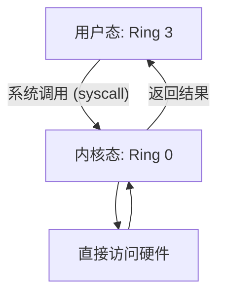
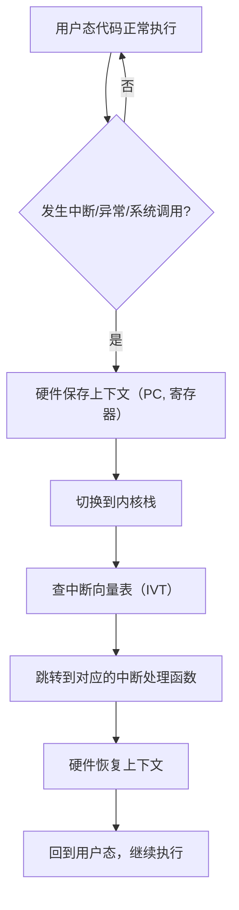

## A — 操作系统概述

操作系统是管理计算机硬件资源、为应用程序提供运行环境的系统软件。它是硬件之上的第一层软件，也是所有其他软件的基础。

### 操作系统的核心职责

| 职责 | 说明 |
|------|------|
| 资源抽象 | 将物理硬件（CPU、内存、磁盘）抽象为进程、虚拟内存、文件等概念 |
| 资源分配 | 在多个请求者之间公平分配 CPU 时间、内存空间、I/O 带宽 |
| 隔离保护 | 确保进程之间互不干扰，内核空间与用户空间严格隔离 |
| 并发管理 | 协调多进程/多线程的并发执行，保证数据一致性 |

### 用户态与内核态

现代 CPU 通常提供至少两个特权级别（x86 的 Ring 0 和 Ring 3）：



| 层级 | 能做什么 | 不能做什么 |
|------|---------|-----------|
| 用户态 | 执行应用程序代码、调用库函数、通过系统调用请求内核服务 | 直接访问硬件、修改页表、执行特权指令 |
| 内核态 | 访问所有内存地址、执行所有 CPU 指令、管理硬件设备 | (无权限限制) |

用户态程序请求内核服务的方式是**系统调用（System Call）**。常见系统调用：`read`、`write`、`open`、`close`、`fork`、`execve`、`mmap`、`brk`。

### 中断与异常

操作系统不是"主动管理"硬件的，而是**被动响应**。CPU 通过中断和异常机制通知内核：

| 类型 | 触发来源 | 举例 |
|------|---------|------|
| 硬件中断 | 外部设备 | 键盘按下、网卡数据到达、定时器到期 |
| 软件异常 | CPU 执行指令时 | 缺页中断（page fault）、除零错误、非法指令 |
| 陷入（Trap）| 主动触发 | 系统调用（应用程序主动请求进入内核） |



中断向量表（IVT）是内核在启动时设置好的一张函数指针表，入口 0 对应除零错误，入口 14 对应缺页中断（x86），入口 `0x80` 或 `syscall` 对应系统调用。

### 内核的类型

| 类型 | 特点 | 代表 |
|------|------|------|
| 宏内核（Monolithic） | 所有服务在内核态运行，高性能但内核庞大 | Linux, BSD |
| 微内核（Microkernel） | 最小化内核，大部分服务跑在用户态，更安全但通信开销大 | Minix, QNX, seL4 |
| 混合内核 | 结合两者优点 | Windows NT, macOS (XNU) |

Linux 是宏内核，但支持可加载内核模块（LKM），允许动态扩展内核功能而不必重新编译。

### 启动过程

```
固件（BIOS/UEFI）→ 引导加载器（GRUB）→ 内核加载 → init/systemd → 用户空间
```

引导加载器将内核映像从磁盘读入内存，设置页表和栈，跳转到内核入口点 `_start`，内核初始化子系统后启动第一个用户进程（`/sbin/init`）。

### 本章与其他模块的链接

- 系统调用的实现 → [[../内核/系统内核/05_中断与系统调用|中断与系统调用]]
- boot 加载过程的汇编层 → [[../汇编基础/1基础/01_寄存器与指令基础|汇编基础]]
- 关于此处的缺页中断 → [[F_内存管理]]
- malloc 作为系统调用的使用者 → [[G_内存分配器]]
